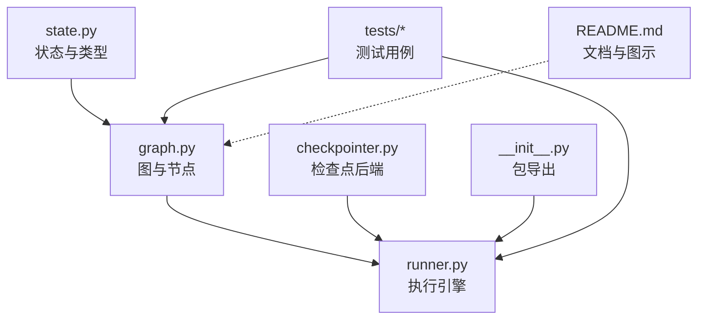
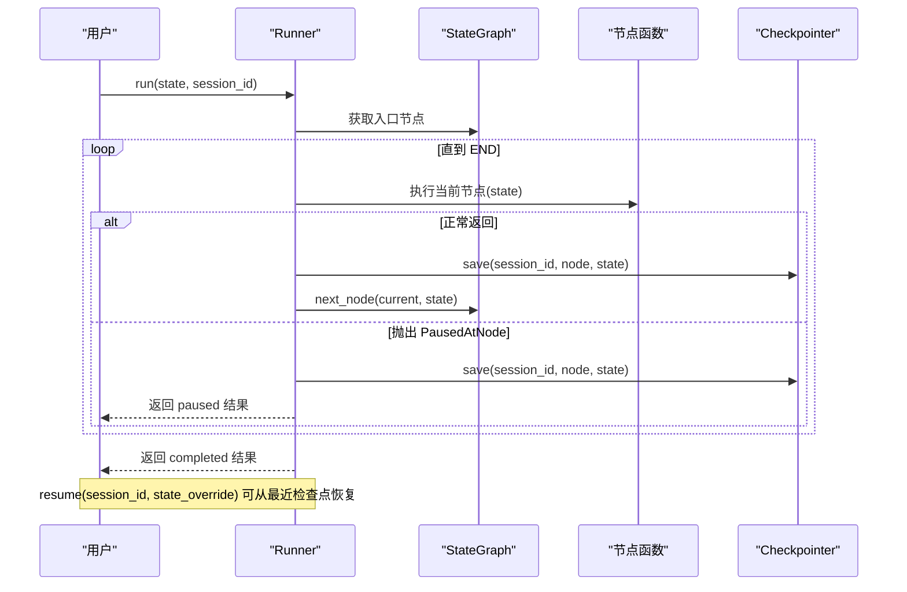
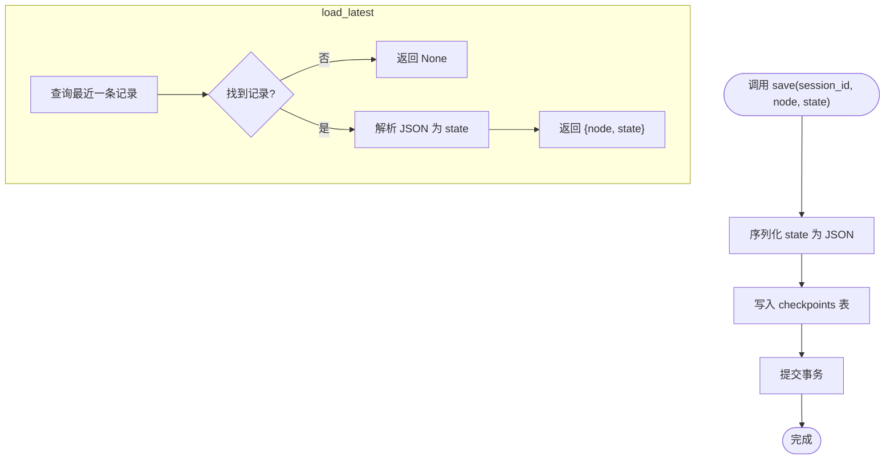
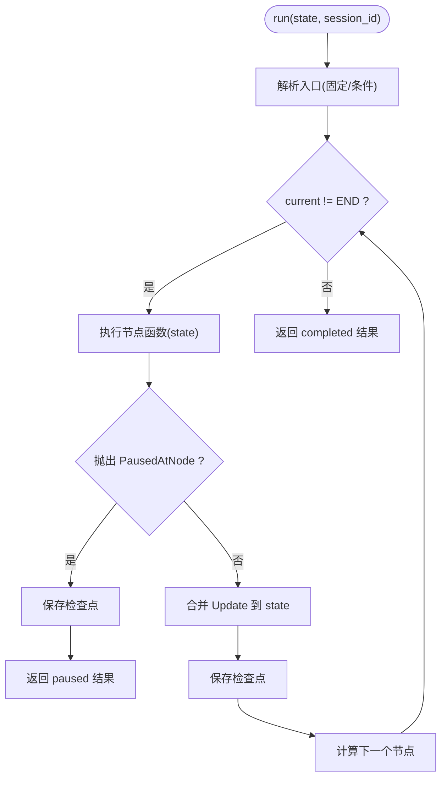
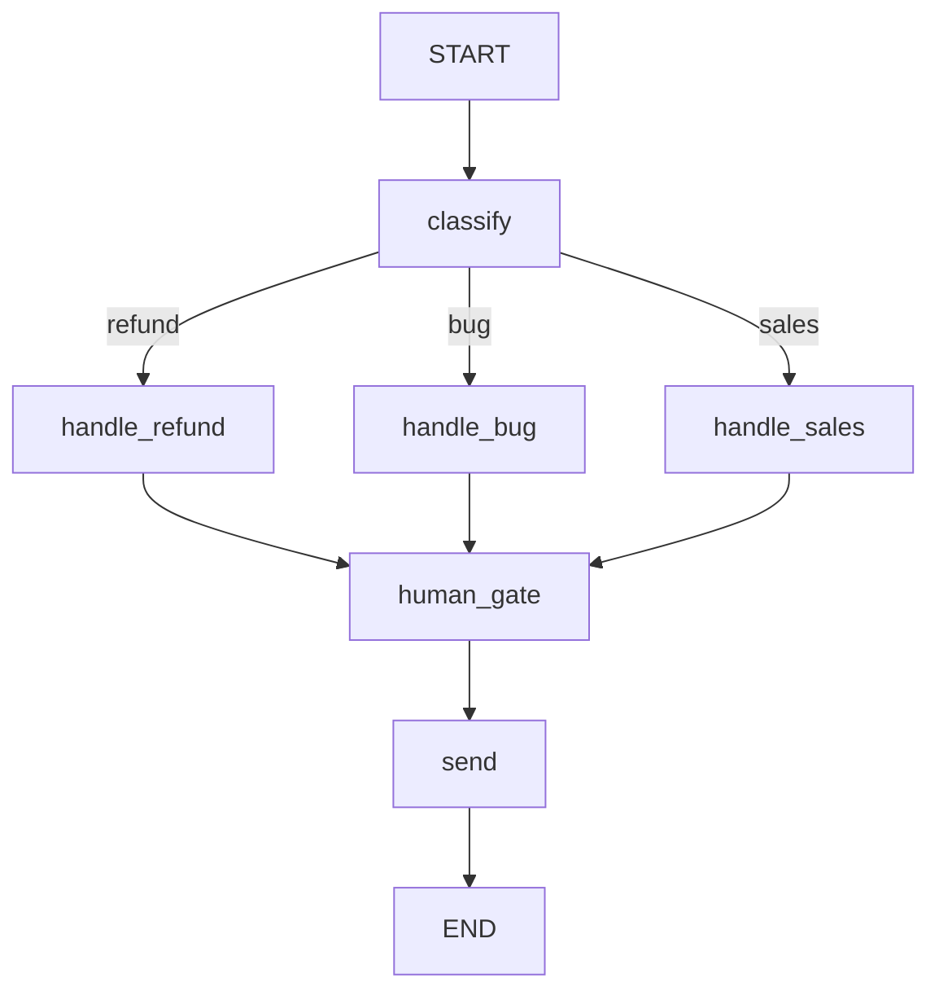
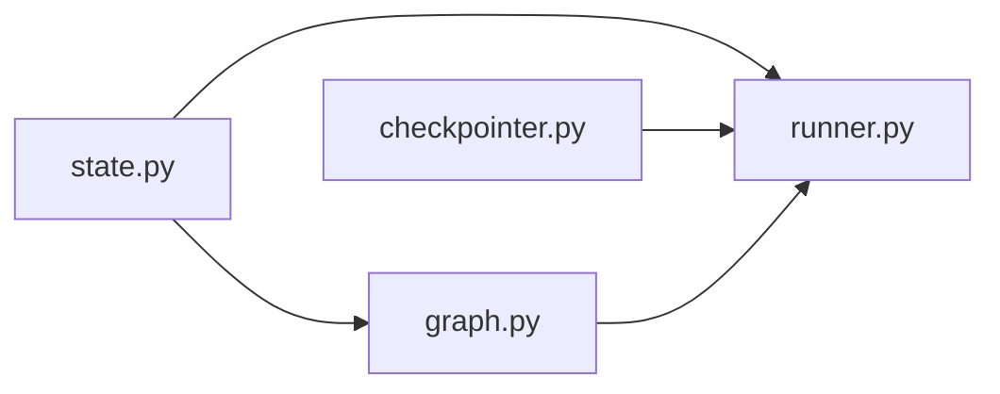
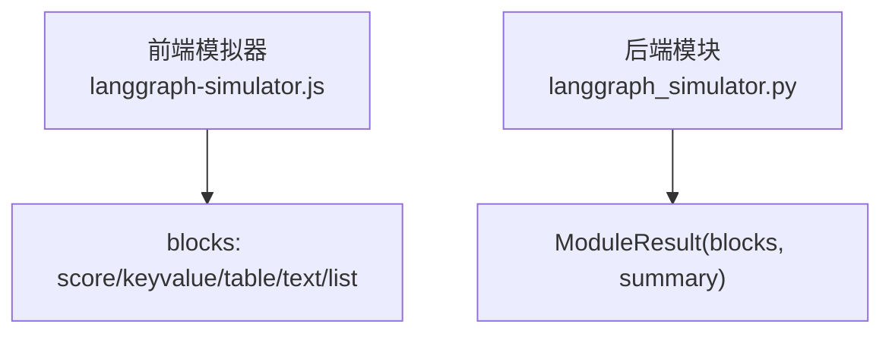

# LangGraph状态图技能演示

<cite>
**本文引用的文件**   
- [state.py](file://phases/14-agent-engineering/13-langgraph-stateful-graphs/outputs/skill-demo/state.py)
- [graph.py](file://phases/14-agent-engineering/13-langgraph-stateful-graphs/outputs/skill-demo/graph.py)
- [checkpointer.py](file://phases/14-agent-engineering/13-langgraph-stateful-graphs/outputs/skill-demo/checkpointer.py)
- [runner.py](file://phases/14-agent-engineering/13-langgraph-stateful-graphs/outputs/skill-demo/runner.py)
- [__init__.py](file://phases/14-agent-engineering/13-langgraph-stateful-graphs/outputs/skill-demo/__init__.py)
- [README.md](file://phases/14-agent-engineering/13-langgraph-stateful-graphs/outputs/skill-demo/README.md)
- [test_all.py](file://phases/14-agent-engineering/13-langgraph-stateful-graphs/outputs/skill-demo/tests/test_all.py)
- [test_graph.py](file://phases/14-agent-engineering/13-langgraph-stateful-graphs/outputs/skill-demo/tests/test_graph.py)
- [skill-state-graph.md](file://phases/14-agent-engineering/13-langgraph-stateful-graphs/outputs/skill-state-graph.md)
- [langgraph-simulator.js](file://site/vue-app/summary/src/data/modules/langgraph-simulator.js)
- [langgraph_simulator.py](file://guardrails-sandbox/backend/playground/modules/langgraph_simulator.py)
</cite>

## 目录
1. [简介](#简介)
2. [项目结构](#项目结构)
3. [核心组件](#核心组件)
4. [架构总览](#架构总览)
5. [详细组件分析](#详细组件分析)
6. [依赖关系分析](#依赖关系分析)
7. [性能与可扩展性](#性能与可扩展性)
8. [故障排查指南](#故障排查指南)
9. [结论](#结论)
10. [附录：前端模拟器与后端模块对照](#附录前端模拟器与后端模块对照)

## 简介
本演示以纯 Python 标准库实现了一个“LangGraph 风格”的有状态图引擎，围绕客服工单处理流程展开：分类 → 分支处理 → 人工审批 → 发送回复。通过类型化状态、条件边、逐节点检查点与持久化恢复能力，展示如何在复杂业务中构建可观测、可中断、可恢复的状态机。同时提供三种拓扑辅助模式（监督者、群集、层次化），以及前后端两套“ReAct 状态图模拟器”，帮助快速判断任务是否适合建模为状态图并模拟执行轨迹。

## 项目结构
该技能包位于 lesson 输出目录，采用最小依赖、清晰分层的设计：
- state.py：定义 State、Update、Router、NodeFn、哨兵常量 START/END 与 PausedAtNode 异常
- graph.py：StateGraph 类、示例节点函数、路由函数与三种拓扑辅助函数
- checkpointer.py：Checkpointer 抽象接口 + SQLite / InMemory 两种实现
- runner.py：Runner 执行引擎 + main() 演示入口
- __init__.py：包入口，统一导出核心 API
- tests/*：完整单元测试覆盖关键路径
- README.md：运行方式、设计说明与图示



**图表来源**
- [state.py:1-93](file://phases/14-agent-engineering/13-langgraph-stateful-graphs/outputs/skill-demo/state.py#L1-L93)
- [graph.py:1-378](file://phases/14-agent-engineering/13-langgraph-stateful-graphs/outputs/skill-demo/graph.py#L1-L378)
- [checkpointer.py:1-153](file://phases/14-agent-engineering/13-langgraph-stateful-graphs/outputs/skill-demo/checkpointer.py#L1-L153)
- [runner.py:1-214](file://phases/14-agent-engineering/13-langgraph-stateful-graphs/outputs/skill-demo/runner.py#L1-L214)
- [__init__.py:1-23](file://phases/14-agent-engineering/13-langgraph-stateful-graphs/outputs/skill-demo/__init__.py#L1-L23)
- [README.md:1-159](file://phases/14-agent-engineering/13-langgraph-stateful-graphs/outputs/skill-demo/README.md#L1-L159)

**章节来源**
- [README.md:19-30](file://phases/14-agent-engineering/13-langgraph-stateful-graphs/outputs/skill-demo/README.md#L19-L30)

## 核心组件
- 状态模型（TypedDict）：State 描述全局上下文；Update 表示增量更新；Runner 将 Update 合并进 State
- 图构建器（StateGraph）：支持固定边、条件边、入口设置；next_node 决定下一步
- 检查点（Checkpointer）：save/load_latest/history 三方法；默认 SQLite，另提供内存实现
- 执行器（Runner）：遍历图、每步保存检查点、捕获 PausedAtNode 暂停、支持 resume 注入人工决策
- 拓扑辅助：build_supervisor_graph / build_swarm_graph / build_hierarchical_graph

**章节来源**
- [state.py:15-93](file://phases/14-agent-engineering/13-langgraph-stateful-graphs/outputs/skill-demo/state.py#L15-L93)
- [graph.py:17-127](file://phases/14-agent-engineering/13-langgraph-stateful-graphs/outputs/skill-demo/graph.py#L17-L127)
- [checkpointer.py:20-153](file://phases/14-agent-engineering/13-langgraph-stateful-graphs/outputs/skill-demo/checkpointer.py#L20-L153)
- [runner.py:20-133](file://phases/14-agent-engineering/13-langgraph-stateful-graphs/outputs/skill-demo/runner.py#L20-L133)

## 架构总览
下图展示了从入口到结束的核心调用链与数据流：Runner 驱动 StateGraph 遍历节点，每个节点返回 Update 合并入 State；每次节点执行后由 Checkpointer 持久化；当节点抛出 PausedAtNode 时 Runner 保存检查点并暂停，后续可通过 resume 注入人工决策继续执行。



**图表来源**
- [runner.py:36-133](file://phases/14-agent-engineering/13-langgraph-stateful-graphs/outputs/skill-demo/runner.py#L36-L133)
- [graph.py:101-122](file://phases/14-agent-engineering/13-langgraph-stateful-graphs/outputs/skill-demo/graph.py#L101-L122)
- [checkpointer.py:77-115](file://phases/14-agent-engineering/13-langgraph-stateful-graphs/outputs/skill-demo/checkpointer.py#L77-L115)

## 详细组件分析

### 状态与类型（state.py）
- State：包含消息历史、工单类型、表单数据、审批标志、最终回复、重试计数等字段
- Update：所有字段可选，用于增量合并
- Router/NodeFn：路由与节点函数的类型别名
- START/END：虚拟入口/出口哨兵
- PausedAtNode：节点请求暂停时抛出的异常，携带节点名与原因

复杂度与行为要点：
- 状态合并使用字典合并语义，时间复杂度 O(k)，k 为状态键数
- 异常仅携带必要信息，便于调试与恢复

**章节来源**
- [state.py:15-93](file://phases/14-agent-engineering/13-langgraph-stateful-graphs/outputs/skill-demo/state.py#L15-L93)

### 图与节点（graph.py）
- StateGraph：维护节点映射、固定边、条件边与入口；next_node 优先条件边再固定边
- 示例节点：classify、handle_refund、handle_bug、handle_sales、human_gate、send
- 路由：classify_router 根据 ticket_type 选择分支
- 拓扑辅助：
  - build_support_graph：客服工单主流程
  - build_supervisor_graph：中央路由器分发至 worker 子图
  - build_swarm_graph：多代理交接协商
  - build_hierarchical_graph：按层串联流水线

```mermaid
classDiagram
class StateGraph {
-_nodes : dict
-_edges : dict
-_cond_edges : dict
-_entry : str|None
+add_node(name, fn)
+add_edge(src, dst)
+add_conditional_edges(src, router_fn, path_map)
+set_entry(node_name)
+get_node_fn(name)
+next_node(current, state)
+nodes : list
}
class NodeFn {
<<callable>>
(State) -> Update
}
class Router {
<<callable>>
(State) -> str
}
StateGraph --> NodeFn : "注册节点"
StateGraph --> Router : "条件边路由"
```

**图表来源**
- [graph.py:17-127](file://phases/14-agent-engineering/13-langgraph-stateful-graphs/outputs/skill-demo/graph.py#L17-L127)

**章节来源**
- [graph.py:133-268](file://phases/14-agent-engineering/13-langgraph-stateful-graphs/outputs/skill-demo/graph.py#L133-L268)
- [graph.py:275-377](file://phases/14-agent-engineering/13-langgraph-stateful-graphs/outputs/skill-demo/graph.py#L275-L377)

### 检查点后端（checkpointer.py）
- Checkpointer 抽象：save/load_latest/history
- SQLiteCheckpointer：WAL 模式、JSON 序列化、索引优化
- InMemoryCheckpointer：进程内存储，适合测试



**图表来源**
- [checkpointer.py:77-115](file://phases/14-agent-engineering/13-langgraph-stateful-graphs/outputs/skill-demo/checkpointer.py#L77-L115)

**章节来源**
- [checkpointer.py:20-153](file://phases/14-agent-engineering/13-langgraph-stateful-graphs/outputs/skill-demo/checkpointer.py#L20-L153)

### 执行引擎（runner.py）
- _execute_from：循环执行节点，捕获 PausedAtNode 并保存检查点后返回 paused
- run：确定入口（固定边或条件边），深拷贝初始状态，启动执行
- resume：加载最近检查点，注入 state_override，从暂停节点继续



**图表来源**
- [runner.py:36-107](file://phases/14-agent-engineering/13-langgraph-stateful-graphs/outputs/skill-demo/runner.py#L36-L107)

**章节来源**
- [runner.py:77-133](file://phases/14-agent-engineering/13-langgraph-stateful-graphs/outputs/skill-demo/runner.py#L77-L133)

### 客服工单流程图


**图表来源**
- [graph.py:230-268](file://phases/14-agent-engineering/13-langgraph-stateful-graphs/outputs/skill-demo/graph.py#L230-L268)
- [README.md:136-147](file://phases/14-agent-engineering/13-langgraph-stateful-graphs/outputs/skill-demo/README.md#L136-L147)

**章节来源**
- [README.md:134-151](file://phases/14-agent-engineering/13-langgraph-stateful-graphs/outputs/skill-demo/README.md#L134-L151)

## 依赖关系分析
- 模块耦合
  - runner.py 依赖 graph.StateGraph、state.END/START/PausedAtNode、checkpointer.Checkpointer
  - graph.py 依赖 state 中的类型与常量
  - checkpointer.py 仅依赖 state.State
- 外部依赖
  - 仅使用 Python 标准库（sqlite3、json、copy、abc、uuid 等）
- 潜在风险
  - 条件边未覆盖全部返回值会触发错误（已在 next_node 中校验）
  - 节点数量上限保护（~30），避免扁平图不可维护



**图表来源**
- [runner.py:1-14](file://phases/14-agent-engineering/13-langgraph-stateful-graphs/outputs/skill-demo/runner.py#L1-L14)
- [graph.py:1-11](file://phases/14-agent-engineering/13-langgraph-stateful-graphs/outputs/skill-demo/graph.py#L1-L11)
- [checkpointer.py:1-14](file://phases/14-agent-engineering/13-langgraph-stateful-graphs/outputs/skill-demo/checkpointer.py#L1-L14)

**章节来源**
- [runner.py:1-14](file://phases/14-agent-engineering/13-langgraph-stateful-graphs/outputs/skill-demo/runner.py#L1-L14)
- [graph.py:1-11](file://phases/14-agent-engineering/13-langgraph-stateful-graphs/outputs/skill-demo/graph.py#L1-L11)
- [checkpointer.py:1-14](file://phases/14-agent-engineering/13-langgraph-stateful-graphs/outputs/skill-demo/checkpointer.py#L1-L14)

## 性能与可扩展性
- 状态合并：O(k)，k 为状态键数；建议保持状态精简
- 检查点 IO：SQLite WAL 提升并发读；生产环境可替换为 Postgres/Redis 后端
- 节点规模：限制 ~30 节点，超过需拆分子图（监督者/层次化模式）
- 确定性要求：节点应避免随机与时钟依赖，确保可重放与可恢复

[本节为通用指导，不直接分析具体文件]

## 故障排查指南
- 常见错误
  - 未注册节点作为边的源/目标：在 add_edge/add_conditional_edges/set_entry 中校验
  - 条件边路由返回值不在 path_map：next_node 中抛出明确错误
  - 无入口节点：run 中检测并报错
  - 会话无检查点：resume 中检测并报错
- 定位手段
  - 查看检查点历史：cp.history(session_id)
  - 打印消息历史：main 中 _print_messages 示例
  - 断点恢复：resume(session_id, {"approved": True}) 注入人工决策

**章节来源**
- [graph.py:50-91](file://phases/14-agent-engineering/13-langgraph-stateful-graphs/outputs/skill-demo/graph.py#L50-L91)
- [graph.py:101-122](file://phases/14-agent-engineering/13-langgraph-stateful-graphs/outputs/skill-demo/graph.py#L101-L122)
- [runner.py:90-107](file://phases/14-agent-engineering/13-langgraph-stateful-graphs/outputs/skill-demo/runner.py#L90-L107)
- [runner.py:121-132](file://phases/14-agent-engineering/13-langgraph-stateful-graphs/outputs/skill-demo/runner.py#L121-L132)
- [runner.py:152-214](file://phases/14-agent-engineering/13-langgraph-stateful-graphs/outputs/skill-demo/runner.py#L152-L214)

## 结论
本演示以最小依赖实现了具备类型化状态、条件边、逐节点检查点与持久化恢复的有状态图引擎，并通过客服工单场景验证了“线性为主、条件为辅”的可维护图设计。配合三种拓扑辅助函数，可灵活表达监督者、群集与层次化模式。前后端两套 ReAct 状态图模拟器进一步帮助快速评估任务是否适合建模为状态图，并直观呈现检查点序列与中断点。

[本节为总结性内容，不直接分析具体文件]

## 附录：前端模拟器与后端模块对照
- 前端模拟器（Vue 应用模块）
  - 功能：基于关键词匹配判定“Agent 形状”，生成四节点 ReAct 拓扑与模拟检查点
  - 输入：任务描述、工具执行前是否中断
  - 输出：评分、判定、拓扑、检查点表格、四大超能力提示
- 后端模块（Playground 模块）
  - 功能：与前端一致逻辑，封装为 PlaygroundModule，返回结构化结果块



**图表来源**
- [langgraph-simulator.js:14-87](file://site/vue-app/summary/src/data/modules/langgraph-simulator.js#L14-L87)
- [langgraph_simulator.py:43-118](file://guardrails-sandbox/backend/playground/modules/langgraph_simulator.py#L43-L118)

**章节来源**
- [langgraph-simulator.js:1-105](file://site/vue-app/summary/src/data/modules/langgraph-simulator.js#L1-L105)
- [langgraph_simulator.py:1-119](file://guardrails-sandbox/backend/playground/modules/langgraph_simulator.py#L1-L119)