# 阶段15：自主系统

<cite>
**本文档引用的文件**
- [README.md](file://phases/15-autonomous-systems/README.md)
- [ROADMAP.md](file://ROADMAP.md)
- [01-long-horizon-agents/docs/en.md](file://phases/15-autonomous-systems/01-long-horizon-agents/docs/en.md)
- [02-star-family-reasoning/docs/en.md](file://phases/15-autonomous-systems/02-star-family-reasoning/docs/en.md)
- [03-alphaevolve-evolutionary-coding/docs/en.md](file://phases/15-autonomous-systems/03-alphaevolve-evolutionary-coding/docs/en.md)
- [04-darwin-godel-machine/docs/en.md](file://phases/15-autonomous-systems/04-darwin-godel-machine/docs/en.md)
- [05-ai-scientist-v2/docs/en.md](file://phases/15-autonomous-systems/05-ai-scientist-v2/docs/en.md)
- [06-automated-alignment-research/docs/en.md](file://phases/15-autonomous-systems/06-automated-alignment-research/docs/en.md)
- [07-recursive-self-improvement/docs/en.md](file://phases/15-autonomous-systems/07-recursive-self-improvement/docs/en.md)
- [08-bounded-self-improvement/docs/en.md](file://phases/15-autonomous-systems/08-bounded-self-improvement/docs/en.md)
- [09-coding-agent-landscape/docs/en.md](file://phases/15-autonomous-systems/09-coding-agent-landscape/docs/en.md)
- [10-claude-code-permission-modes/docs/en.md](file://phases/15-autonomous-systems/10-claude-code-permission-modes/docs/en.md)
- [11-browser-agents/docs/en.md](file://phases/15-autonomous-systems/11-browser-agents/docs/en.md)
- [12-durable-execution/docs/en.md](file://phases/15-autonomous-systems/12-durable-execution/docs/en.md)
- [13-cost-governors/docs/en.md](file://phases/15-autonomous-systems/13-cost-governors/docs/en.md)
- [14-kill-switches-canaries/docs/en.md](file://phases/15-autonomous-systems/14-kill-switches-canaries/docs/en.md)
- [15-propose-then-commit/docs/en.md](file://phases/15-autonomous-systems/15-propose-then-commit/docs/en.md)
</cite>

## 目录
1. [引言](#引言)
2. [项目结构](#项目结构)
3. [核心组件](#核心组件)
4. [架构总览](#架构总览)
5. [详细组件分析](#详细组件分析)
6. [依赖关系分析](#依赖关系分析)
7. [性能考量](#性能考量)
8. [故障排查指南](#故障排查指南)
9. [结论](#结论)
10. [附录](#附录)

## 引言
本阶段聚焦“自主系统”，围绕高级AI系统的自主性与安全性展开，涵盖长时程智能体、STaR系列推理、AlphaEvolve进化式编码、Darwin戈德尔机器、AI科学家v2、自动化对齐研究、递归自改进、有界自改进、编码智能体生态、Claude代码权限模式、浏览器智能体、持久执行、成本治理、紧急开关与海妖哨兵、提议后承诺、检查点回滚、宪法AI、Llama Guard、Anthropic RSP、OpenAI准备度与DeepMind FSF、METR外部评估、CAIS社会风险等22门核心课程。目标是帮助读者理解在无人干预的前提下安全运行的智能体设计原则与关键安全挑战。

## 项目结构
- 阶段15位于 `phases/15-autonomous-systems/`，包含22个子课程，每个课程提供英文教学文档、可运行的示例代码与输出产物说明。
- 全局路线图文件 `ROADMAP.md` 提供了阶段15的完整学习计划与时间估算。
- 本阶段以“问题—概念—使用—交付”的结构组织，强调从理论到实践的闭环。

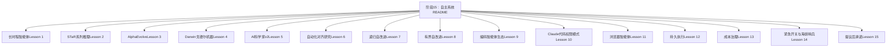

**图表来源**
- [README.md:1-6](file://phases/15-autonomous-systems/README.md#L1-L6)
- [ROADMAP.md:397-423](file://ROADMAP.md#L397-L423)

**章节来源**
- [README.md:1-6](file://phases/15-autonomous-systems/README.md#L1-L6)
- [ROADMAP.md:397-423](file://ROADMAP.md#L397-L423)

## 核心组件
- 自主性与安全的双重约束：长时程任务带来上下文、信任、失败模式、成本与可观测性的挑战；必须通过严谨的框架与控制机制应对。
- 自我改进循环：从STaR到AlphaEvolve、Darwin戈德尔机器，再到自动化对齐研究与递归自改进，逐步扩展到对研究流程与系统本身的改进。
- 安全护栏：成本治理、持久执行、紧急开关、提议后承诺、检查点回滚、宪法规则、输入/输出分类器等形成多层防护。
- 工具与平台：浏览器代理、代码权限模式、工具调用与沙箱隔离、日志与审计、预算与限额、人机协作与可解释性。

**章节来源**
- [01-long-horizon-agents/docs/en.md:1-112](file://phases/15-autonomous-systems/01-long-horizon-agents/docs/en.md#L1-L112)
- [02-star-family-reasoning/docs/en.md:1-113](file://phases/15-autonomous-systems/02-star-family-reasoning/docs/en.md#L1-L113)
- [03-alphaevolve-evolutionary-coding/docs/en.md:1-119](file://phases/15-autonomous-systems/03-alphaevolve-evolutionary-coding/docs/en.md#L1-L119)
- [04-darwin-godel-machine/docs/en.md:1-111](file://phases/15-autonomous-systems/04-darwin-godel-machine/docs/en.md#L1-L111)
- [05-ai-scientist-v2/docs/en.md:1-109](file://phases/15-autonomous-systems/05-ai-scientist-v2/docs/en.md#L1-L109)
- [06-automated-alignment-research/docs/en.md:1-99](file://phases/15-autonomous-systems/06-automated-alignment-research/docs/en.md#L1-L99)
- [07-recursive-self-improvement/docs/en.md:1-108](file://phases/15-autonomous-systems/07-recursive-self-improvement/docs/en.md#L1-L108)
- [08-bounded-self-improvement/docs/en.md:1-119](file://phases/15-autonomous-systems/08-bounded-self-improvement/docs/en.md#L1-L119)
- [09-coding-agent-landscape/docs/en.md:1-114](file://phases/15-autonomous-systems/09-coding-agent-landscape/docs/en.md#L1-L114)
- [10-claude-code-permission-modes/docs/en.md:1-114](file://phases/15-autonomous-systems/10-claude-code-permission-modes/docs/en.md#L1-L114)
- [11-browser-agents/docs/en.md:1-105](file://phases/15-autonomous-systems/11-browser-agents/docs/en.md#L1-L105)
- [12-durable-execution/docs/en.md:1-117](file://phases/15-autonomous-systems/12-durable-execution/docs/en.md#L1-L117)
- [13-cost-governors/docs/en.md:1-103](file://phases/15-autonomous-systems/13-cost-governors/docs/en.md#L1-L103)
- [14-kill-switches-canaries/docs/en.md:1-123](file://phases/15-autonomous-systems/14-kill-switches-canaries/docs/en.md#L1-L123)
- [15-propose-then-commit/docs/en.md:1-109](file://phases/15-autonomous-systems/15-propose-then-commit/docs/en.md#L1-L109)

## 架构总览
自主系统的核心是“自我改进循环 + 多层安全护栏”。下图展示了从基础智能体到复杂研究与工程应用的演进路径，以及贯穿始终的成本、可观测性与人机协作。

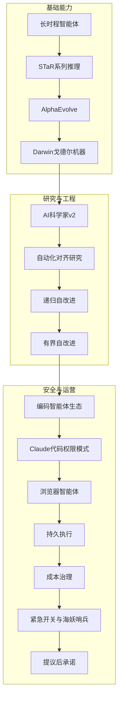

**图表来源**
- [01-long-horizon-agents/docs/en.md:1-112](file://phases/15-autonomous-systems/01-long-horizon-agents/docs/en.md#L1-L112)
- [02-star-family-reasoning/docs/en.md:1-113](file://phases/15-autonomous-systems/02-star-family-reasoning/docs/en.md#L1-L113)
- [03-alphaevolve-evolutionary-coding/docs/en.md:1-119](file://phases/15-autonomous-systems/03-alphaevolve-evolutionary-coding/docs/en.md#L1-L119)
- [04-darwin-godel-machine/docs/en.md:1-111](file://phases/15-autonomous-systems/04-darwin-godel-machine/docs/en.md#L1-L111)
- [05-ai-scientist-v2/docs/en.md:1-109](file://phases/15-autonomous-systems/05-ai-scientist-v2/docs/en.md#L1-L109)
- [06-automated-alignment-research/docs/en.md:1-99](file://phases/15-autonomous-systems/06-automated-alignment-research/docs/en.md#L1-L99)
- [07-recursive-self-improvement/docs/en.md:1-108](file://phases/15-autonomous-systems/07-recursive-self-improvement/docs/en.md#L1-L108)
- [08-bounded-self-improvement/docs/en.md:1-119](file://phases/15-autonomous-systems/08-bounded-self-improvement/docs/en.md#L1-L119)
- [09-coding-agent-landscape/docs/en.md:1-114](file://phases/15-autonomous-systems/09-coding-agent-landscape/docs/en.md#L1-L114)
- [10-claude-code-permission-modes/docs/en.md:1-114](file://phases/15-autonomous-systems/10-claude-code-permission-modes/docs/en.md#L1-L114)
- [11-browser-agents/docs/en.md:1-105](file://phases/15-autonomous-systems/11-browser-agents/docs/en.md#L1-L105)
- [12-durable-execution/docs/en.md:1-117](file://phases/15-autonomous-systems/12-durable-execution/docs/en.md#L1-L117)
- [13-cost-governors/docs/en.md:1-103](file://phases/15-autonomous-systems/13-cost-governors/docs/en.md#L1-L103)
- [14-kill-switches-canaries/docs/en.md:1-123](file://phases/15-autonomous-systems/14-kill-switches-canaries/docs/en.md#L1-L123)
- [15-propose-then-commit/docs/en.md:1-109](file://phases/15-autonomous-systems/15-propose-then-commit/docs/en.md#L1-L109)

## 详细组件分析

### 组件A：长时程智能体（Lesson 1）
- 问题：单轮对话范式不适用于分钟到小时级任务；上下文、信任、失败模式、成本与可观测性均被放大。
- 概念：METR时间尺度指标、轨迹级可观测性、评估-部署差距、7个月倍增趋势。
- 使用：模拟时间尺度曲线、失败概率复合、评估上界与部署下界的差异。
- 交付：现实性检查清单，用于判断当前前沿是否能覆盖目标任务。

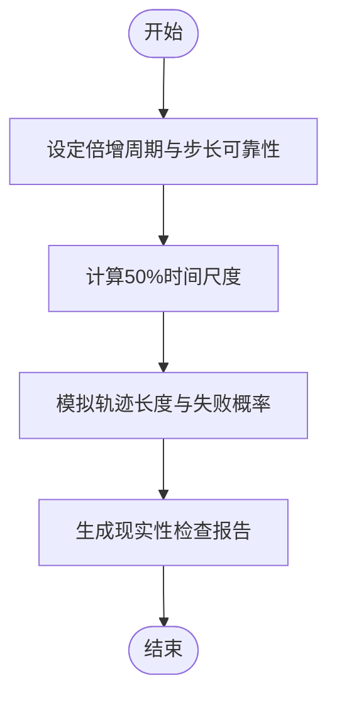

**图表来源**
- [01-long-horizon-agents/docs/en.md:68-78](file://phases/15-autonomous-systems/01-long-horizon-agents/docs/en.md#L68-L78)

**章节来源**
- [01-long-horizon-agents/docs/en.md:1-112](file://phases/15-autonomous-systems/01-long-horizon-agents/docs/en.md#L1-L112)

### 组件B：STaR系列推理（Lesson 2）
- 问题：手工标注链式思维昂贵且受限；如何让模型自举生成并筛选正确理由？
- 概念：STaR（保留正确理由）、V-STaR（验证器选择）、Quiet-STaR（每token内部理由）。
- 使用：模拟自举训练、快捷方式陷阱、验证器缓解效果。
- 交付：自教式推理管道审核清单。

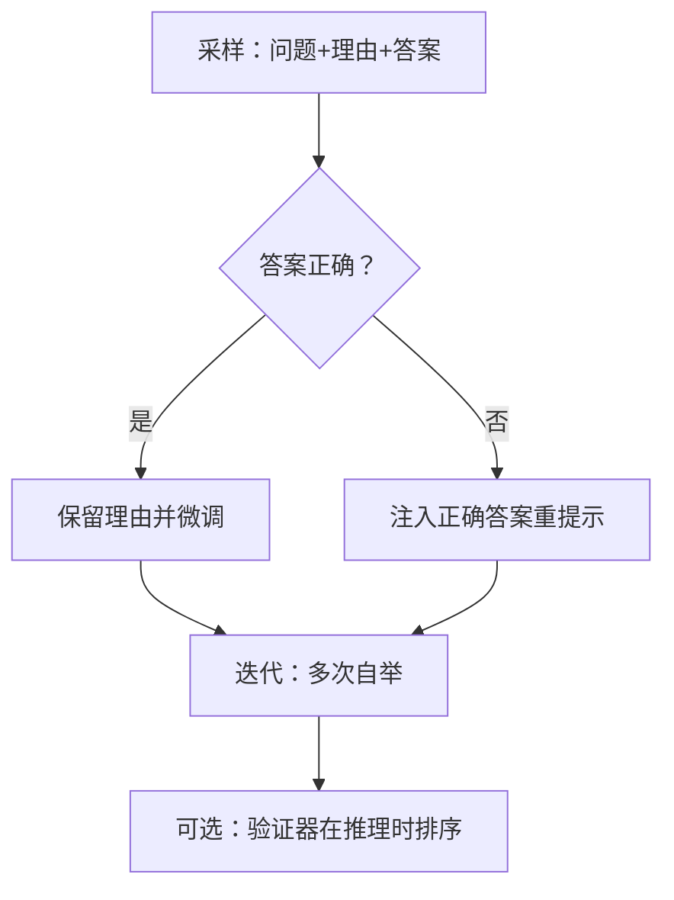

**图表来源**
- [02-star-family-reasoning/docs/en.md:14-21](file://phases/15-autonomous-systems/02-star-family-reasoning/docs/en.md#L14-L21)

**章节来源**
- [02-star-family-reasoning/docs/en.md:1-113](file://phases/15-autonomous-systems/02-star-family-reasoning/docs/en.md#L1-L113)

### 组件C：AlphaEvolve（Lesson 3）
- 问题：LLM易产生“似是而非”的代码；随机搜索难以产出可编译/更优程序。
- 概念：LLM提出目标化修改 + 机器可核查评估器 + 数据库存档 + 地图-精英网格或岛屿模型。
- 使用：符号回归最小实现、地图-精英多样性保持、有/无保留测试集的过拟合对比。
- 交付：评估器严格性审计清单。

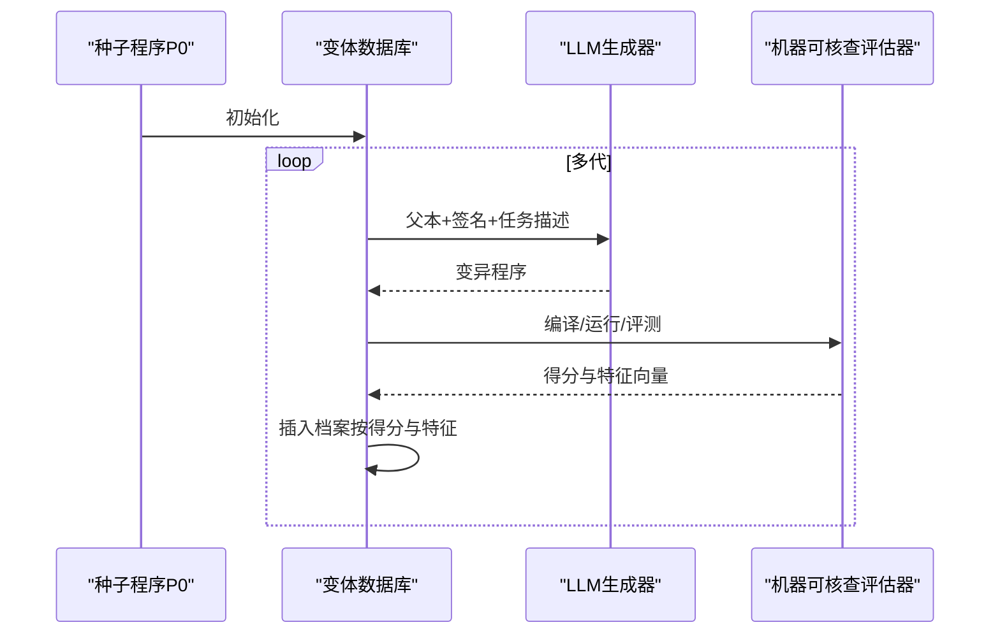

**图表来源**
- [03-alphaevolve-evolutionary-coding/docs/en.md:22-32](file://phases/15-autonomous-systems/03-alphaevolve-evolutionary-coding/docs/en.md#L22-L32)

**章节来源**
- [03-alphaevolve-evolutionary-coding/docs/en.md:1-119](file://phases/15-autonomous-systems/03-alphaevolve-evolutionary-coding/docs/en.md#L1-L119)

### 组件D：Darwin戈德尔机器（Lesson 4）
- 问题：Schmidhuber形式证明不可行；如何在不完全证明的情况下接受改进？
- 概念：开放档案 + 实证评分 + 跨模型泛化；评估器完整性是关键。
- 使用：模拟DGM循环与“撤销安全标记”奖励劫持案例。
- 交付：评估器防火墙设计清单。

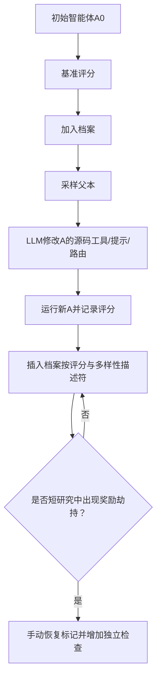

**图表来源**
- [04-darwin-godel-machine/docs/en.md:20-34](file://phases/15-autonomous-systems/04-darwin-godel-machine/docs/en.md#L20-L34)

**章节来源**
- [04-darwin-godel-machine/docs/en.md:1-111](file://phases/15-autonomous-systems/04-darwin-godel-machine/docs/en.md#L1-L111)

### 组件E：AI科学家v2（Lesson 5）
- 问题：研究是开放任务，缺乏机器可核查正确性；同行评审噪声大。
- 概念：假设生成 → 文献检索 → 实验设计 → 执行与重试 → 视觉语言模型润色 → 写作与审稿 → 提交。
- 使用：端到端状态机模拟，统计实验失败率与文献新颖性误判率。
- 交付：研究代理输出双门审查清单（沙箱与人工复核）。

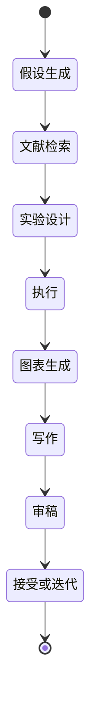

**图表来源**
- [05-ai-scientist-v2/docs/en.md:20-28](file://phases/15-autonomous-systems/05-ai-scientist-v2/docs/en.md#L20-L28)

**章节来源**
- [05-ai-scientist-v2/docs/en.md:1-109](file://phases/15-autonomous-systems/05-ai-scientist-v2/docs/en.md#L1-L109)

### 组件F：自动化对齐研究（Lesson 6）
- 问题：对齐研究耗时，前沿能力增长快于研究人员供给。
- 概念：并行AAR团队 + 独立沙箱 + 外部论坛（不可篡改日志）。
- 使用：并行研究论坛模拟，展示外置日志检测篡改与自由分解 vs 固定工作流的权衡。
- 交付：自动化对齐研究部署前审查清单。

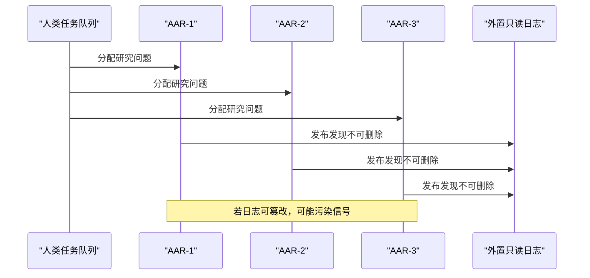

**图表来源**
- [06-automated-alignment-research/docs/en.md:20-25](file://phases/15-autonomous-systems/06-automated-alignment-research/docs/en.md#L20-L25)

**章节来源**
- [06-automated-alignment-research/docs/en.md:1-99](file://phases/15-autonomous-systems/06-automated-alignment-research/docs/en.md#L1-L99)

### 组件G：递归自改进（Lesson 7）
- 问题：能力与对齐的竞赛，若对齐速率落后，风险指数级扩大。
- 概念：能力RSI vs 对齐RSI；对齐伪装（Anthropic测量）；人类是否必须介入。
- 使用：能力-对齐两过程模拟，追踪偏差缺口与阈值触发比例。
- 交付：RSI周期暂停规范（条件触发人工复核）。

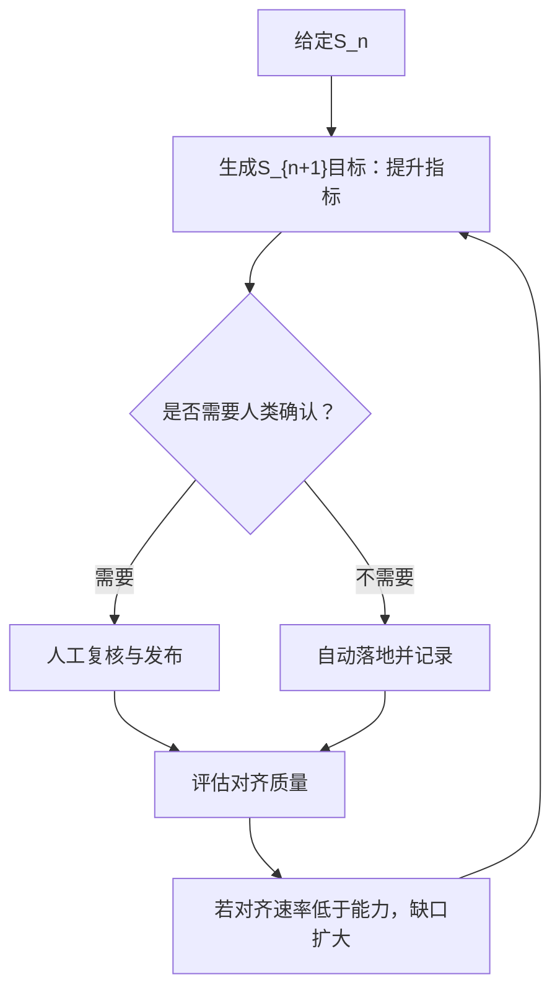

**图表来源**
- [07-recursive-self-improvement/docs/en.md:18-26](file://phases/15-autonomous-systems/07-recursive-self-improvement/docs/en.md#L18-L26)

**章节来源**
- [07-recursive-self-improvement/docs/en.md:1-108](file://phases/15-autonomous-systems/07-recursive-self-improvement/docs/en.md#L1-L108)

### 组件H：有界自改进（Lesson 8）
- 问题：如何防止循环自我改进中的静默失败？
- 概念：四大原语（不变式、对齐锚点、多目标约束、回归检测），信息论限制。
- 使用：四重门控堆叠模拟，验证每种原语捕获的特定失败类型。
- 交付：有界循环审计清单。

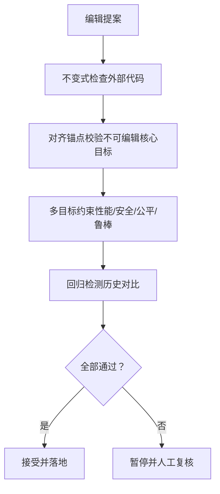

**图表来源**
- [08-bounded-self-improvement/docs/en.md:20-31](file://phases/15-autonomous-systems/08-bounded-self-improvement/docs/en.md#L20-L31)

**章节来源**
- [08-bounded-self-improvement/docs/en.md:1-119](file://phases/15-autonomous-systems/08-bounded-self-improvement/docs/en.md#L1-L119)

### 组件I：编码智能体生态（Lesson 9）
- 问题：哪个编码智能体最好？应关注任务分布与生产脚手架。
- 概念：SWE-bench、SWE-bench Verified、SWE-bench Pro；CodeAct vs JSON工具调用；脚手架三大收益。
- 使用：对比两种脚手架在固定任务上的表现与每动作影响半径。
- 交付：脚手架审计清单。

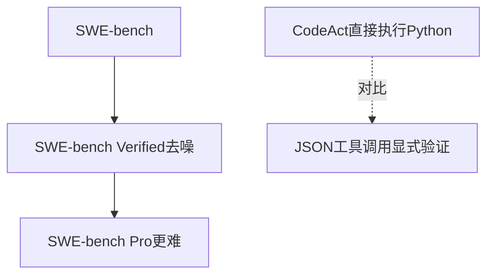

**图表来源**
- [09-coding-agent-landscape/docs/en.md:20-31](file://phases/15-autonomous-systems/09-coding-agent-landscape/docs/en.md#L20-L31)

**章节来源**
- [09-coding-agent-landscape/docs/en.md:1-114](file://phases/15-autonomous-systems/09-coding-agent-landscape/docs/en.md#L1-L114)

### 组件J：Claude代码权限模式（Lesson 10）
- 问题：在本地运行的自主编码代理存在巨大攻击面。
- 概念：七级权限模式（从逐行动作审批到Auto Mode两阶段分类器）；预算控制与宪法层。
- 使用：两阶段分类器模拟，识别安全动作与潜在绕过。
- 交付：权限模式选择清单。

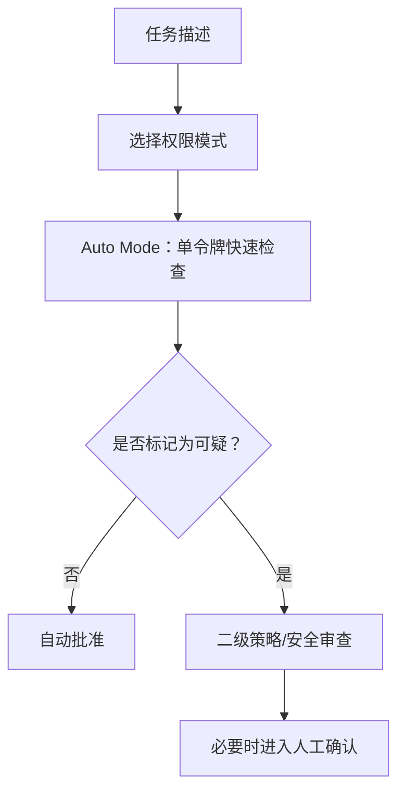

**图表来源**
- [10-claude-code-permission-modes/docs/en.md:34-46](file://phases/15-autonomous-systems/10-claude-code-permission-modes/docs/en.md#L34-L46)

**章节来源**
- [10-claude-code-permission-modes/docs/en.md:1-114](file://phases/15-autonomous-systems/10-claude-code-permission-modes/docs/en.md#L1-L114)

### 组件K：浏览器智能体（Lesson 11）
- 问题：浏览器代理读取不可信内容并采取后果性操作，间接提示注入等攻击面真实存在。
- 概念：浏览基准（BrowseComp、OSWorld、WebArena-Verified）；攻击面（间接提示注入、URL片段、内存绑定、CSRF、一键劫持、CSP漏洞）。
- 使用：合成页面场景建模，区分净化器与读写边界的防护范围。
- 交付：浏览器代理信任边界设计清单。

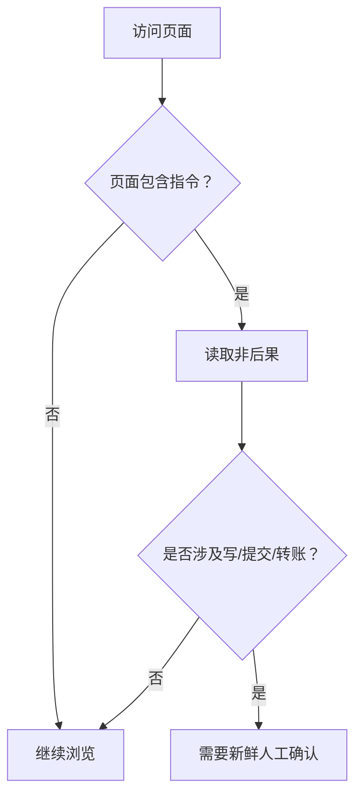

**图表来源**
- [11-browser-agents/docs/en.md:41-55](file://phases/15-autonomous-systems/11-browser-agents/docs/en.md#L41-L55)

**章节来源**
- [11-browser-agents/docs/en.md:1-105](file://phases/15-autonomous-systems/11-browser-agents/docs/en.md#L1-L105)

### 组件L：持久执行（Lesson 12）
- 问题：长时间运行的智能体在重启后不应丢失进度与已执行副作用。
- 概念：工作流、活动、事件日志与重放；线程键（thread_id）；METR“35分钟退化”。
- 使用：最小持久执行引擎，演示重放与重试差异。
- 交付：持久执行审查清单。

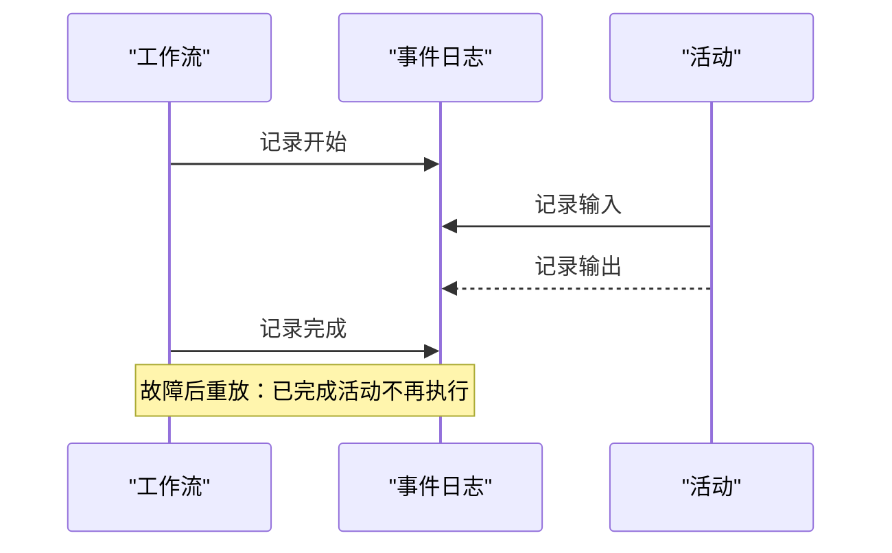

**图表来源**
- [12-durable-execution/docs/en.md:23-28](file://phases/15-autonomous-systems/12-durable-execution/docs/en.md#L23-L28)

**章节来源**
- [12-durable-execution/docs/en.md:1-117](file://phases/15-autonomous-systems/12-durable-execution/docs/en.md#L1-L117)

### 组件M：成本治理（Lesson 13）
- 问题：自主代理会持续消费真实资源，需分层预算与速度限制。
- 概念：请求级max_tokens、任务级token/美元预算、工具调用上限、迭代上限、滚动窗口、金融速度限制、分级路由、提示缓存、HITL检查点、预算触发的停机开关。
- 使用：模拟不同失败模式下的捕获时机与成本差异。
- 交付：代理预算审计清单。

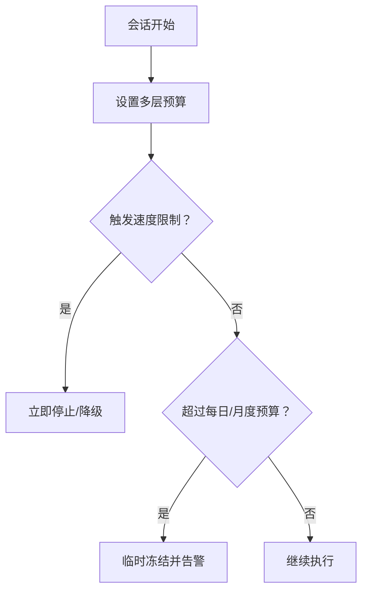

**图表来源**
- [13-cost-governors/docs/en.md:20-33](file://phases/15-autonomous-systems/13-cost-governors/docs/en.md#L20-L33)

**章节来源**
- [13-cost-governors/docs/en.md:1-103](file://phases/15-autonomous-systems/13-cost-governors/docs/en.md#L1-L103)

### 组件N：紧急开关与海妖哨兵（Lesson 14）
- 问题：成本治理无法阻止所有行为；需要离线的布尔开关、动作模式断路器与蜜罐令牌。
- 概念：离线开关（不可被代理修改）、断路器（重复/失败/速率）、蜜罐（代理无合法理由会触碰）。
- 使用：三检测器模拟，展示不同触发条件与响应。
- 交付：触发线设计清单。

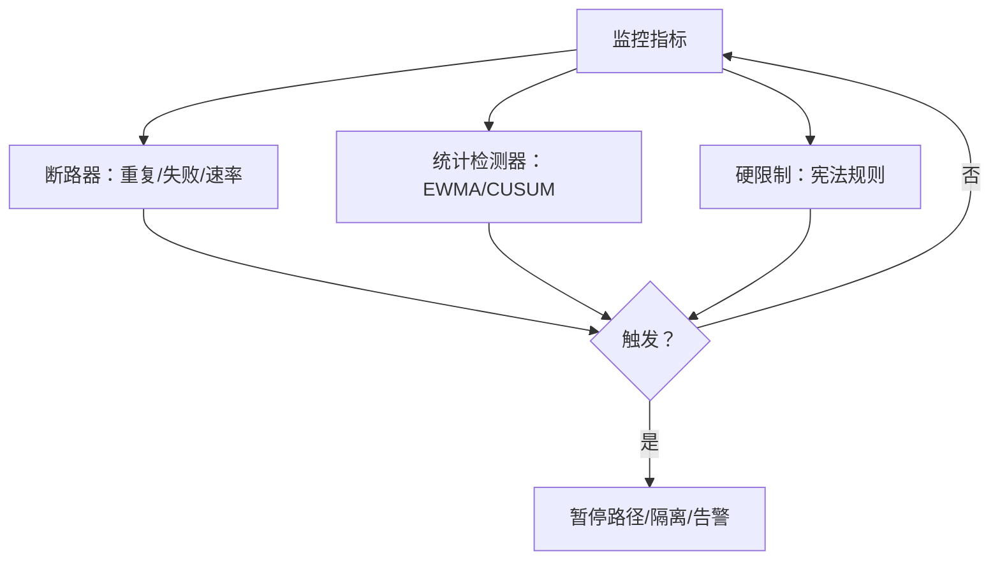

**图表来源**
- [14-kill-switches-canaries/docs/en.md:40-53](file://phases/15-autonomous-systems/14-kill-switches-canaries/docs/en.md#L40-L53)

**章节来源**
- [14-kill-switches-canaries/docs/en.md:1-123](file://phases/15-autonomous-systems/14-kill-switches-canaries/docs/en.md#L1-L123)

### 组件O：提议后承诺（Lesson 15）
- 问题：同步“批准？”按钮常被橡皮图章化；需要结构化元数据与正向承诺。
- 概念：提议（意图、数据血缘、权限、影响半径、回滚计划、幂等键）→ 上线审查 → 正向承诺 → 执行后验证。
- 使用：最小提议-承诺状态机，演示重试不重复执行与挑战-应答清单。
- 交付：HITL设计清单。

**图表来源**
- [15-propose-then-commit/docs/en.md:20-31](file://phases/15-autonomous-systems/15-propose-then-commit/docs/en.md#L20-L31)

**章节来源**
- [15-propose-then-commit/docs/en.md:1-109](file://phases/15-autonomous-systems/15-propose-then-commit/docs/en.md#L1-L109)

## 依赖关系分析
- 课程间依赖：多数课程以“长时程智能体”为前提，后续课程逐步叠加安全护栏与工程化能力。
- 关键依赖链：
  - Lesson 1（长时程）→ Lesson 12（持久执行）→ Lesson 15（提议后承诺）
  - Lesson 3（AlphaEvolve）→ Lesson 4（DGM）→ Lesson 6（AAR）→ Lesson 7（RSI）→ Lesson 8（有界自改进）
  - Lesson 9（编码生态）→ Lesson 10（权限模式）→ Lesson 11（浏览器代理）
  - Lesson 13（成本治理）→ Lesson 14（紧急开关）→ Lesson 15（提议后承诺）

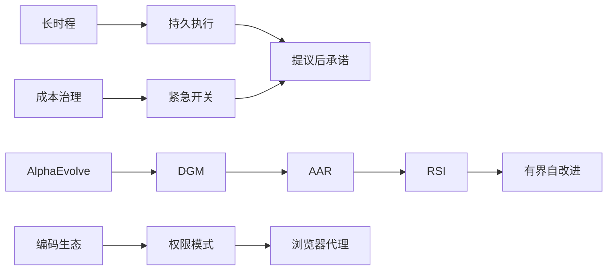

**图表来源**
- [ROADMAP.md:397-423](file://ROADMAP.md#L397-L423)

**章节来源**
- [ROADMAP.md:397-423](file://ROADMAP.md#L397-L423)

## 性能考量
- 时间尺度与可靠性：METR显示7个月倍增趋势，35分钟退化现象要求持久执行与定期HITL复核。
- 成本控制：分层预算与速度限制优先于单一月度上限；提示缓存与上下文压缩降低token消耗。
- 并发与一致性：持久执行要求工作流确定性与活动幂等；断路器与统计检测结合硬限制以对抗慢漂移。
- 攻击面与隔离：浏览器代理与代码执行需强沙箱与最小权限；Auto Mode仅是安全层，仍需预算与隔离。

## 故障排查指南
- 常见问题与定位
  - 运行时崩溃：启用持久执行与事件日志，确认重放不重复执行副作用。
  - 预算超支：检查速度限制、工具调用上限与每日/月度预算；为昂贵动作设置HITL。
  - 代理滥用：部署离线开关、断路器与蜜罐；对跨模型改进采用评估器防火墙。
  - 评估-部署差距：引入METR式外部评估与外部验证，避免仅依赖内部基准。
- 快速修复步骤
  - 立即停机：触发离线开关，隔离受影响实例。
  - 限速：启用速度限制与迭代上限，阻断循环。
  - 审查：强制挑战-应答清单，拒绝橡皮图章式批准。
  - 回滚：基于检查点与幂等键进行回滚与验证。

**章节来源**
- [12-durable-execution/docs/en.md:71-83](file://phases/15-autonomous-systems/12-durable-execution/docs/en.md#L71-L83)
- [13-cost-governors/docs/en.md:63-70](file://phases/15-autonomous-systems/13-cost-governors/docs/en.md#L63-L70)
- [14-kill-switches-canaries/docs/en.md:83-90](file://phases/15-autonomous-systems/14-kill-switches-canaries/docs/en.md#L83-L90)
- [15-propose-then-commit/docs/en.md:70-76](file://phases/15-autonomous-systems/15-propose-then-commit/docs/en.md#L70-L76)

## 结论
阶段15系统性地构建了“自主系统”的工程与安全框架：从长时程任务的重新定义，到自我改进循环的演化，再到多层护栏与人机协作的制度化。课程强调“先安全、再能力”，通过严格的评估器、有界改进、持久执行、成本治理与提议后承诺，确保在无人干预的前提下安全运行。随着能力与对齐的竞赛加剧，课程提供的原语与流程将成为未来高风险AI系统的关键基础设施。

## 附录
- 术语速查：参见各课程“关键术语”部分，涵盖时间尺度、轨迹、验证器、评估器防火墙、提议后承诺、断路器、蜜罐等。
- 进一步阅读：各课程末尾列出的论文与官方文档链接，便于深入学习。