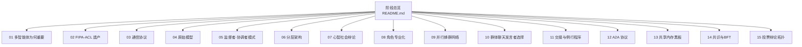
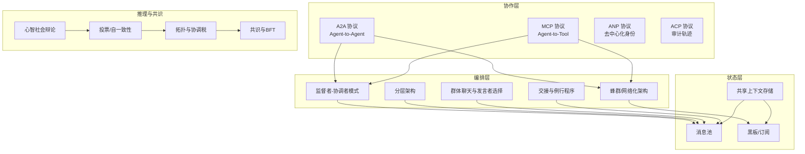
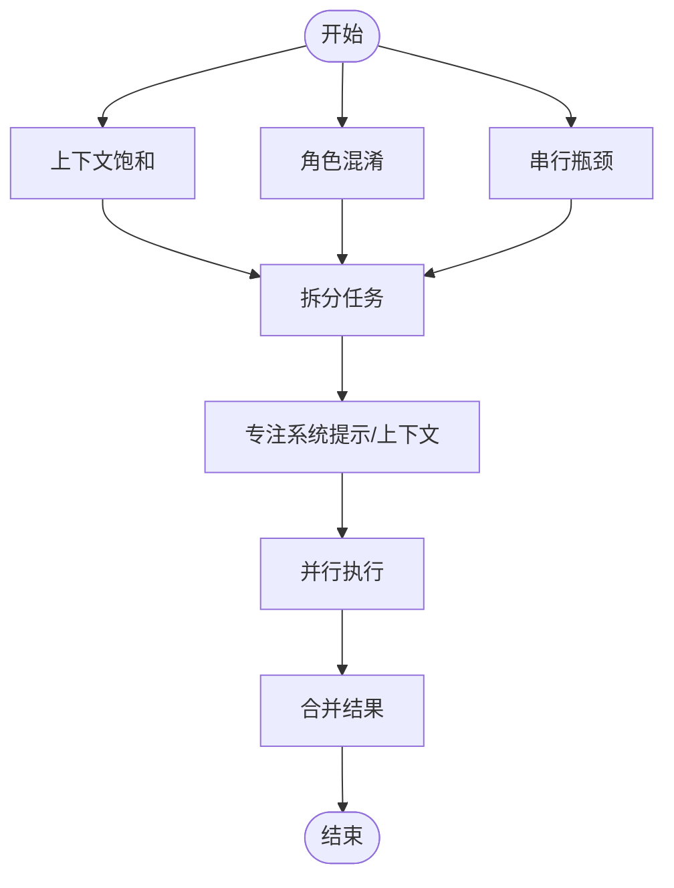
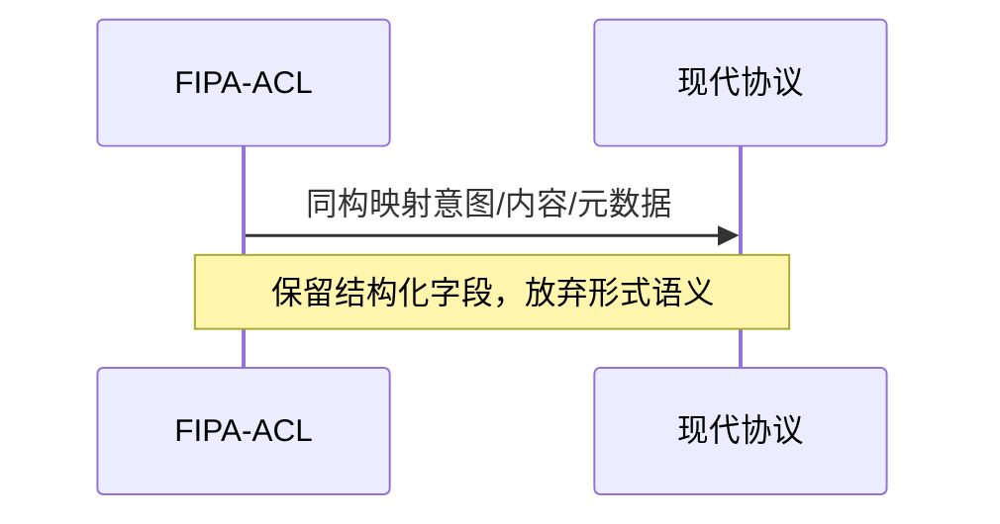
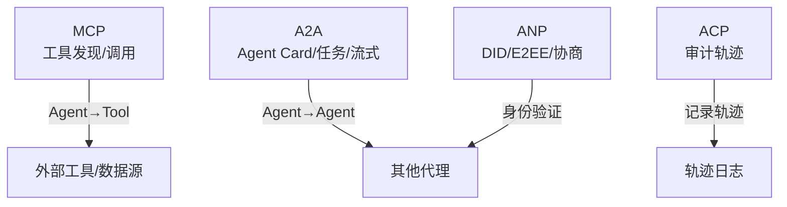
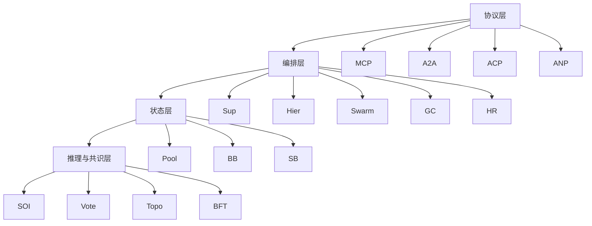

# 阶段16：多智能体与群体智能

<cite>
**本文引用的文件**
- [README.md](file://phases/16-multi-agent-and-swarms/README.md)
- [01-why-multi-agent/docs/en.md](file://phases/16-multi-agent-and-swarms/01-why-multi-agent/docs/en.md)
- [02-fipa-acl-heritage/docs/en.md](file://phases/16-multi-agent-and-swarms/02-fipa-acl-heritage/docs/en.md)
- [03-communication-protocols/docs/en.md](file://phases/16-multi-agent-and-swarms/03-communication-protocols/docs/en.md)
- [04-primitive-model/docs/en.md](file://phases/16-multi-agent-and-swarms/04-primitive-model/docs/en.md)
- [05-supervisor-orchestrator-pattern/docs/en.md](file://phases/16-multi-agent-and-swarms/05-supervisor-orchestrator-pattern/docs/en.md)
- [06-hierarchical-architecture/docs/en.md](file://phases/16-multi-agent-and-swarms/06-hierarchical-architecture/docs/en.md)
- [07-society-of-mind-debate/docs/en.md](file://phases/16-multi-agent-and-swarms/07-society-of-mind-debate/docs/en.md)
- [08-role-specialization/docs/en.md](file://phases/16-multi-agent-and-swarms/08-role-specialization/docs/en.md)
- [09-parallel-swarm-networks/docs/en.md](file://phases/16-multi-agent-and-swarms/09-parallel-swarm-networks/docs/en.md)
- [10-group-chat-speaker-selection/docs/en.md](file://phases/16-multi-agent-and-swarms/10-group-chat-speaker-selection/docs/en.md)
- [11-handoffs-and-routines/docs/en.md](file://phases/16-multi-agent-and-swarms/11-handoffs-and-routines/docs/en.md)
- [12-a2a-protocol/docs/en.md](file://phases/16-multi-agent-and-swarms/12-a2a-protocol/docs/en.md)
- [13-shared-memory-blackboard/docs/en.md](file://phases/16-multi-agent-and-swarms/13-shared-memory-blackboard/docs/en.md)
- [14-consensus-and-bft/docs/en.md](file://phases/16-multi-agent-and-swarms/14-consensus-and-bft/docs/en.md)
- [15-voting-debate-topology/docs/en.md](file://phases/16-multi-agent-and-swarms/15-voting-debate-topology/docs/en.md)
</cite>

## 目录
1. [引言](#引言)
2. [项目结构](#项目结构)
3. [核心组件](#核心组件)
4. [架构总览](#架构总览)
5. [详细组件分析](#详细组件分析)
6. [依赖关系分析](#依赖关系分析)
7. [性能考量](#性能考量)
8. [故障排查指南](#故障排查指南)
9. [结论](#结论)
10. [附录](#附录)

## 引言
本阶段系统性覆盖“多智能体与群体智能”的理论与实践，围绕多智能体为何重要、通信协议与标准化（FIPA ACL 遗产）、基础模型与协调模式（监督者-协调者、分层架构、心智社会辩论、角色专业化）、并行蜂群网络、群体聊天发言者选择、交接与例行程序、A2A 协议、共享内存黑板、共识与 BFT、投票辩论拓扑、谈判讨价还价、生成式智能体模拟、心智理论协调、群体优化（PSO/ACO）、多智能体强化学习（MARL）与 MADDPG/QMIX/MAPO、智能体经济、生产扩展队列与检查点、失败模式（MAST、群体思维）、评估与协调基准、以及 2026 年最新案例研究等 25 门核心课程主题，提供可操作的实现策略与工程化落地建议。

## 项目结构
该阶段以“课程化”组织，每个子主题包含：
- 文档（英文版，含概念、构建步骤、练习与术语）
- 代码示例（Python/TypeScript 实现最小原型）
- 输出物（技能卡片、设计模板、配置清单）



图示来源
- [README.md:1-6](file://phases/16-multi-agent-and-swarms/README.md#L1-L6)

章节来源
- [README.md:1-6](file://phases/16-multi-agent-and-swarms/README.md#L1-L6)

## 核心组件
本阶段的核心是“四元组原语”：智能体、交接、共享状态、协调器。所有主流框架（如 AutoGen、CrewAI、LangGraph、OpenAI Swarm、Microsoft Agent Framework）均可映射到这四个轴上，差异仅在默认值与表面语法。

- 智能体：系统提示词 + 工具集；无状态，每次运行从系统提示与当前消息历史开始
- 交接：结构化的控制转移，机制上为返回下一个智能体的工具调用或图边条件
- 共享状态：任何可被多个智能体读取（有时写入）的数据结构；消息池、黑板、键值存储、向量记忆
- 协调器：决定“谁在下一步说话”，选项包括：显式图（确定性）、LLM 发言者选择（软路由）、上次发言者的交接调用（Swarm）、或基于队列的调度（蜂群架构）

这些原语构成了多智能体系统的设计空间，框架差异在于如何权衡“记忆策略、安全边界、成本核算、可观测性”。

章节来源
- [04-primitive-model/docs/en.md:1-173](file://phases/16-multi-agent-and-swarms/04-primitive-model/docs/en.md#L1-L173)

## 架构总览
下图展示多智能体系统在不同场景下的典型架构形态与交互路径：



图示来源
- [03-communication-protocols/docs/en.md:36-570](file://phases/16-multi-agent-and-swarms/03-communication-protocols/docs/en.md#L36-L570)
- [04-primitive-model/docs/en.md:18-112](file://phases/16-multi-agent-and-swarms/04-primitive-model/docs/en.md#L18-L112)
- [09-parallel-swarm-networks/docs/en.md:16-70](file://phases/16-multi-agent-and-swarms/09-parallel-swarm-networks/docs/en.md#L16-L70)
- [13-shared-memory-blackboard/docs/en.md:18-92](file://phases/16-multi-agent-and-swarms/13-shared-memory-blackboard/docs/en.md#L18-L92)
- [14-consensus-and-bft/docs/en.md:18-85](file://phases/16-multi-agent-and-swarms/14-consensus-and-bft/docs/en.md#L18-L85)
- [15-voting-debate-topology/docs/en.md:35-99](file://phases/16-multi-agent-and-swarms/15-voting-debate-topology/docs/en.md#L35-L99)

## 详细组件分析

### 组件一：为何采用多智能体（Why Multi-Agent）
- 问题：单智能体在复杂任务中会遇到“上下文饱和、角色混淆、串行瓶颈”
- 解决方案：拆分为专注的智能体，各自拥有独立上下文窗口与系统提示
- 实践：通过对比单智能体与多智能体流水线/并行/团队/蜂群的复杂度与收益，帮助判断何时采用多智能体



图示来源
- [01-why-multi-agent/docs/en.md:17-221](file://phases/16-multi-agent-and-swarms/01-why-multi-agent/docs/en.md#L17-L221)

章节来源
- [01-why-multi-agent/docs/en.md:1-444](file://phases/16-multi-agent-and-swarms/01-why-multi-agent/docs/en.md#L1-L444)

### 组件二：FIPA-ACL 遗产与语音行为
- 背景：FIPA-ACL（2000）定义了二十种“言语行为”（performative），如 inform、request、query-if、propose、agree、failure 等
- 现状：现代协议（MCP、A2A、ACP、ANP）实质上是 FIPA 的 JSON 化与弱语义化版本
- 价值：通过对照表识别新协议是否为“重新发明轮子”，并规避历史上已知的失败模式（如语义漂移）



图示来源
- [02-fipa-acl-heritage/docs/en.md:147-177](file://phases/16-multi-agent-and-swarms/02-fipa-acl-heritage/docs/en.md#L147-L177)

章节来源
- [02-fipa-acl-heritage/docs/en.md:1-208](file://phases/16-multi-agent-and-swarms/02-fipa-acl-heritage/docs/en.md#L1-L208)

### 组件三：通信协议（MCP、A2A、ACP、ANP）
- MCP：代理 ↔ 工具；用于工具发现与调用
- A2A：代理 ↔ 代理；Agent Card、任务生命周期、流式事件
- ACP：企业级审计；TrajectoryMetadata 记录推理与工具调用链
- ANP：去中心化身份；DID + E2EE + 动态协议协商



图示来源
- [03-communication-protocols/docs/en.md:36-570](file://phases/16-multi-agent-and-swarms/03-communication-protocols/docs/en.md#L36-L570)

章节来源
- [03-communication-protocols/docs/en.md:1-800](file://phases/16-multi-agent-and-swarms/03-communication-protocols/docs/en.md#L1-L800)

### 组件四：原始模型（四元组原语）
- 四个轴：智能体、交接、共享状态、协调器
- 映射：OpenAI Swarm、AutoGen、CrewAI、LangGraph、Microsoft Agent Framework、Google ADK 均可映射到此四维空间
- 关键洞察：除共享状态外其余均为无状态；共享状态是“有趣缺陷”的主要来源

章节来源
- [04-primitive-model/docs/en.md:1-173](file://phases/16-multi-agent-and-swarms/04-primitive-model/docs/en.md#L1-L173)

### 组件五：监督者-协调者模式
- 结构：一个领导智能体负责规划、委派与合成；多个专用工作智能体并行执行
- 工程要点：模型搭配（领导推理型 vs 工作快速型）、超时与令牌上限、可观测性、渐进式部署
- 失败模式：领导计划错误、工作智能体越界、合成冲突未披露

```mermaid
sequenceDiagram
participant Lead as 领导智能体
participant W1 as 工作智能体1
participant W2 as 工作智能体2
participant W3 as 工作智能体3
Lead->>W1 : 子问题1
Lead->>W2 : 子问题2
Lead->>W3 : 子问题3
W1-->>Lead : 摘要A
W2-->>Lead : 摘要B
W3-->>Lead : 摘要C
Lead-->>Lead : 合成/冲突检测
Lead-->>W1 : 可选修订
Lead-->>W2 : 可选修订
Lead-->>W3 : 可选修订
W1-->>Lead : 修订后摘要
W2-->>Lead : 修订后摘要
W3-->>Lead : 修订后摘要
Lead-->>Final["最终合成报告"]
```

图示来源
- [05-supervisor-orchestrator-pattern/docs/en.md:77-98](file://phases/16-multi-agent-and-swarms/05-supervisor-orchestrator-pattern/docs/en.md#L77-L98)

章节来源
- [05-supervisor-orchestrator-pattern/docs/en.md:1-136](file://phases/16-multi-agent-and-swarms/05-supervisor-orchestrator-pattern/docs/en.md#L1-L136)

### 组件六：分层架构及其失败模式
- 形状：经理 → 子经理 → 工作者（叶子做实际工作）
- 成功场景：真实组织结构清晰的任务（法律/财务/工程分别评审）
- 失败模式：任务分配错误、输出误读、共识循环（管理内耗）

章节来源
- [06-hierarchical-architecture/docs/en.md:1-127](file://phases/16-multi-agent-and-swarms/06-hierarchical-architecture/docs/en.md#L1-L127)

### 组件七：心智社会与多智能体辩论
- 算法：N 个智能体初始回答，R 轮交换彼此答案并更新；多数投票
- 两个独立增益：智能体数量、轮次数量；二者叠加效果显著
- 机制：暴露分歧促进收敛；异构减少相关误差
- 失败模式：顺从风潮、话题漂移、计算爆炸

章节来源
- [07-society-of-mind-debate/docs/en.md:1-115](file://phases/16-multi-agent-and-swarms/07-society-of-mind-debate/docs/en.md#L1-L115)

### 组件八：角色专业化（规划师、批评者、执行者、验证者）
- 四类角色：规划、执行、批评、验证；验证必须是确定性的
- MetaGPT SOP 模式：严格输入/输出模式；ChatDev 交流反幻觉：执行者缺失细节时显式请求
- 关键：至少一个确定性验证器；批评优先于验证；限制修订轮次

章节来源
- [08-role-specialization/docs/en.md:1-130](file://phases/16-multi-agent-and-swarms/08-role-specialization/docs/en.md#L1-L130)

### 组件九：并行/蜂群/网络化架构
- 形状：共享队列 + 异步拉取 + 结果池
- 适用：大量独立任务、持续负载波动、吞吐优先
- 不适用：有序工作流、需要全局计划、调试需求强
- 失败模式：饥饿与热点；缓解：优先级队列、工作器专化、背压

章节来源
- [09-parallel-swarm-networks/docs/en.md:1-130](file://phases/16-multi-agent-and-swarms/09-parallel-swarm-networks/docs/en.md#L1-L130)

### 组件十：群体聊天与发言者选择
- AutoGen GroupChat：共享消息池 + 选择器函数（轮询、LLM、自定义）
- AutoGen v0.2 → AG2 保留；v0.4 重写为事件驱动 Actor 模型；微软合并至 Microsoft Agent Framework
- 失败模式：确定性差、顺从风潮、上下文膨胀、热门说话人

章节来源
- [10-group-chat-speaker-selection/docs/en.md:1-146](file://phases/16-multi-agent-and-swarms/10-group-chat-speaker-selection/docs/en.md#L1-L146)

### 组件十一：交接与例行程序（无状态编排）
- Swarm 将编排简化为“例行程序（系统提示+工具）+ 交接（返回另一个智能体）”
- 生产替代：OpenAI Agents SDK 增加会话、守卫、追踪
- 失败模式：状态丢失、并行困难、审计困难；缓解：日志、上下文转移规则、回退代理、环路检测

章节来源
- [11-handoffs-and-routines/docs/en.md:1-136](file://phases/16-multi-agent-and-swarms/11-handoffs-and-routines/docs/en.md#L1-L136)

### 组件十二：A2A 协议（代理对代理）
- 四要素：Agent Card（发现）、任务（生命周期）、工件（多模态）、不透明生命周期
- 与 MCP 的分工：MCP 是垂直（代理 ↔ 工具），A2A 是水平（代理 ↔ 代理）
- 适用：跨组织调用、异构框架互操作、长任务、Typed 工件

章节来源
- [12-a2a-protocol/docs/en.md:1-166](file://phases/16-multi-agent-and-swarms/12-a2a-protocol/docs/en.md#L1-L166)

### 组件十三：共享内存与黑板模式
- 两种拓扑：全消息池（AutoGen GroupChat/MetaGPT）、黑板订阅（CA-MCP/Matrix）
- 内存中毒：一个智能体的幻觉进入共享状态，下游智能体将其视为事实
- 三大缓解：记录溯源、版本写入（追加）、不可写验证者

章节来源
- [13-shared-memory-blackboard/docs/en.md:1-166](file://phases/16-multi-agent-and-swarms/13-shared-memory-blackboard/docs/en.md#L1-L166)

### 组件十四：共识与拜占庭容错（BFT）
- 经典 BFT：容忍 f < n/3 的拜占庭节点；假设独立故障、诚实节点正确、问题有真值
- LLM 特有问题：顺从风潮、相关错误（同质模型）、欺骗性代理
- 2025-2026 三种适配：
  - CP-WBFT：置信度探测加权
  - DecentLLMs：无领导者、几何中位聚合
  - WBFT：层次聚类 Core/Edge
- 实证：标量一致并不稳定，共识 ≠ 正确；需结合验证、多样性与评测

章节来源
- [14-consensus-and-bft/docs/en.md:1-152](file://phases/16-multi-agent-and-swarms/14-consensus-and-bft/docs/en.md#L1-L152)

### 组件十五：投票、自一致性与辩论拓扑
- 自一致性：单模型 N 次采样多数投票；代价是相关错误
- 多智能体投票：异构（不同模型/提示/温度/上下文）打破同质化
- 四种拓扑：星形、链式、树形、图（全连通/DAG）
- 协调税：图拓扑在 4 个以上智能体后出现成本增长超过质量提升
- AgentVerse：志愿者行为与顺从行为；Jury 方法作为折中

章节来源
- [15-voting-debate-topology/docs/en.md:1-163](file://phases/16-multi-agent-and-swarms/15-voting-debate-topology/docs/en.md#L1-L163)

## 依赖关系分析
- 协议层相互补充：MCP 提供工具访问，A2A 提供代理间协作，ACP 提供审计轨迹，ANP 提供去中心化信任
- 编排层与状态层耦合：共享状态是“唯一有状态部分”，协调器与交接决定信息流与控制流
- 推理与共识层：心智社会辩论与投票拓扑为“信息流设计”，BFT 为“输出对齐机制”



图示来源
- [03-communication-protocols/docs/en.md:36-570](file://phases/16-multi-agent-and-swarms/03-communication-protocols/docs/en.md#L36-L570)
- [04-primitive-model/docs/en.md:18-112](file://phases/16-multi-agent-and-swarms/04-primitive-model/docs/en.md#L18-L112)
- [13-shared-memory-blackboard/docs/en.md:18-92](file://phases/16-multi-agent-and-swarms/13-shared-memory-blackboard/docs/en.md#L18-L92)
- [14-consensus-and-bft/docs/en.md:18-85](file://phases/16-multi-agent-and-swarms/14-consensus-and-bft/docs/en.md#L18-L85)
- [15-voting-debate-topology/docs/en.md:35-99](file://phases/16-multi-agent-and-swarms/15-voting-debate-topology/docs/en.md#L35-L99)

## 性能考量
- 上下文与令牌：Anthropic 研究显示“令牌使用主导差异”；多智能体通常消耗更高令牌，需按任务价值权衡
- 并行与吞吐：蜂群架构在大量独立任务上优势明显；但需避免饥饿与热点
- 协调成本：拓扑越复杂，协调税越高；图拓扑在 4 个以上智能体后成本增长更快
- 审计与可观测性：TrajectoryMetadata、全程日志、溯源与版本化写入，是生产可用性的关键

## 故障排查指南
- 记忆中毒：启用溯源、版本化写入、不可写验证者；监控“被取代写入比例”
- 顺从风潮与话题漂移：辩论限定轮次、引入对立角色、定期重注问题
- 任务分配错误与合成冲突：明确分解边界、记录来源、在顶层进行冲突披露
- 饥饿与热点：优先级队列、工作器专化、背压
- 交接环路：检测最近 K 次交接，设置回退代理
- 跨组织互操作：A2A Agent Card 明确端点与认证；MCP 工具清单与能力声明

章节来源
- [13-shared-memory-blackboard/docs/en.md:67-137](file://phases/16-multi-agent-and-swarms/13-shared-memory-blackboard/docs/en.md#L67-L137)
- [07-society-of-mind-debate/docs/en.md:53-87](file://phases/16-multi-agent-and-swarms/07-society-of-mind-debate/docs/en.md#L53-L87)
- [05-supervisor-orchestrator-pattern/docs/en.md:61-108](file://phases/16-multi-agent-and-swarms/05-supervisor-orchestrator-pattern/docs/en.md#L61-L108)
- [09-parallel-swarm-networks/docs/en.md:58-102](file://phases/16-multi-agent-and-swarms/09-parallel-swarm-networks/docs/en.md#L58-L102)
- [11-handoffs-and-routines/docs/en.md:99-108](file://phases/16-multi-agent-and-swarms/11-handoffs-and-routines/docs/en.md#L99-L108)
- [12-a2a-protocol/docs/en.md:129-138](file://phases/16-multi-agent-and-swarms/12-a2a-protocol/docs/en.md#L129-L138)

## 结论
多智能体与群体智能的核心在于“以简单原语构建复杂系统”。通过四元组原语（智能体、交接、共享状态、协调器）与标准化协议（MCP/A2A/ACP/ANP），可以在不同任务与组织边界之间实现可组合、可审计、可扩展的协作。工程化落地的关键在于：
- 明确任务类型与组织结构，选择合适的编排模式（监督者/分层/蜂群/群体聊天/交接）
- 设计稳健的共享状态与溯源/版本/验证机制
- 在异构与有限轮次下进行投票/辩论，避免顺从风潮与协调税
- 以协议与审计为边界，确保跨组织互操作与合规

## 附录
- 术语速查：见各课文档中的“Key Terms”
- 进一步阅读：各课文档末尾的参考文献与链接
- 实践清单：每课“Use It/Ship It/Exercises”提供了可直接复用的技能卡片、检查清单与练习