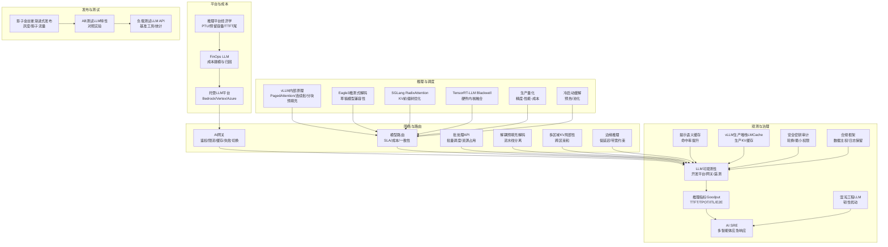
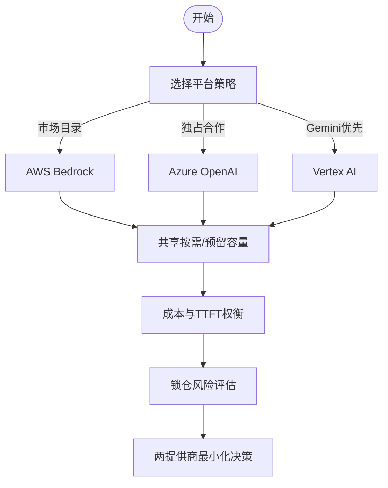
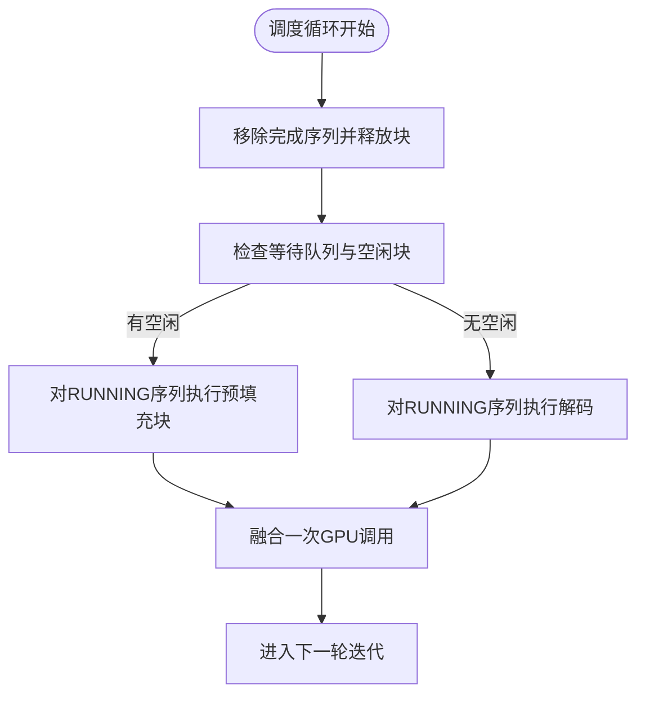
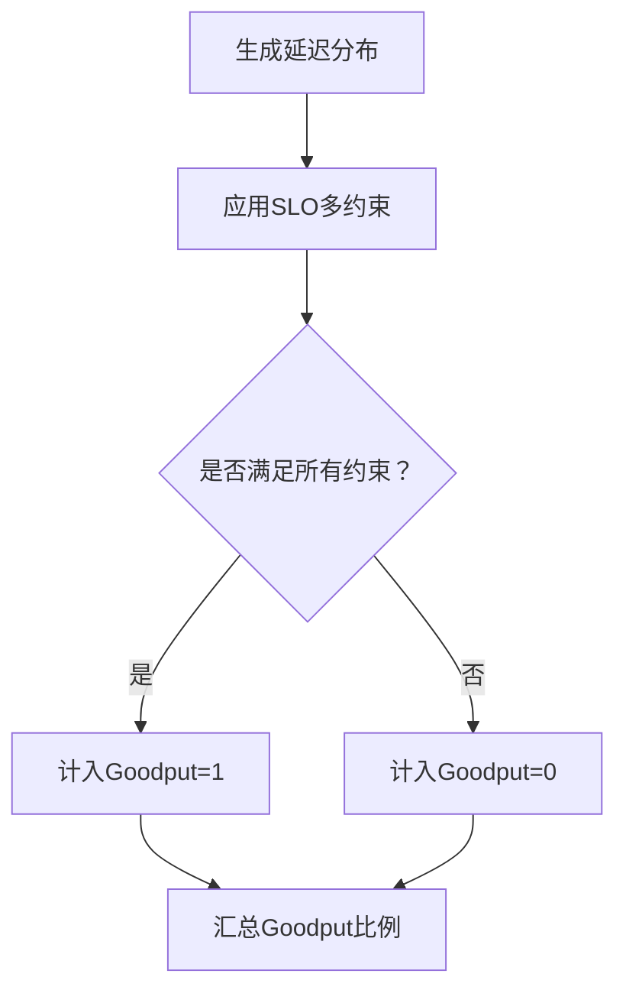
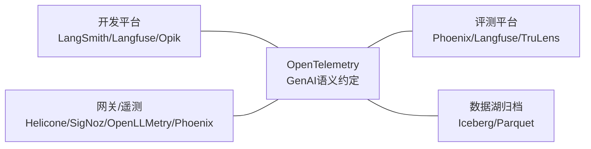
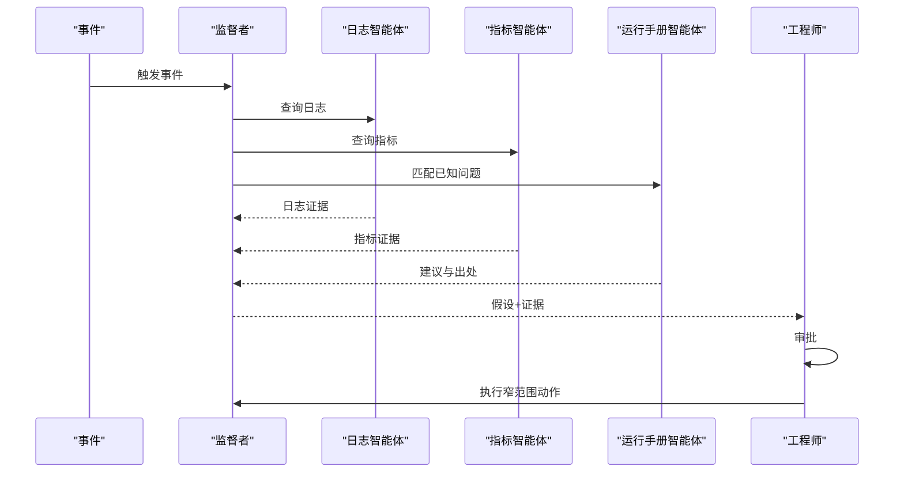
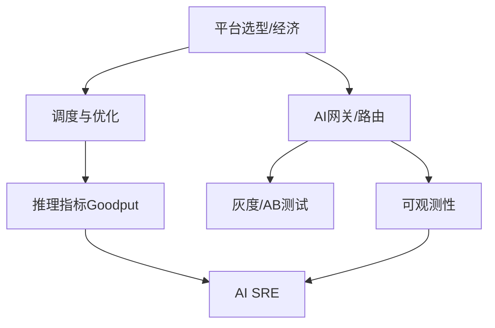

# 阶段17：基础设施与生产

<cite>
**本文引用的文件**
- [phases/17-infrastructure-and-production/README.md](file://phases/17-infrastructure-and-production/README.md)
- [phases/17-infrastructure-and-production/01-managed-llm-platforms/docs/en.md](file://phases/17-infrastructure-and-production/01-managed-llm-platforms/docs/en.md)
- [phases/17-infrastructure-and-production/02-inference-platform-economics/docs/en.md](file://phases/17-infrastructure-and-production/02-inference-platform-economics/docs/en.md)
- [phases/17-infrastructure-and-production/03-gpu-autoscaling-kubernetes/docs/en.md](file://phases/17-infrastructure-and-production/03-gpu-autoscaling-kubernetes/docs/en.md)
- [phases/17-infrastructure-and-production/04-vllm-serving-internals/docs/en.md](file://phases/17-infrastructure-and-production/04-vllm-serving-internals/docs/en.md)
- [phases/17-infrastructure-and-production/05-eagle3-speculative-decoding/docs/en.md](file://phases/17-infrastructure-and-production/05-eagle3-speculative-decoding/docs/en.md)
- [phases/17-infrastructure-and-production/06-sglang-radixattention/docs/en.md](file://phases/17-infrastructure-and-production/06-sglang-radixattention/docs/en.md)
- [phases/17-infrastructure-and-production/07-tensorrt-llm-blackwell/docs/en.md](file://phases/17-infrastructure-and-production/07-tensorrt-llm-blackwell/docs/en.md)
- [phases/17-infrastructure-and-production/08-inference-metrics-goodput/docs/en.md](file://phases/17-infrastructure-and-production/08-inference-metrics-goodput/docs/en.md)
- [phases/17-infrastructure-and-production/09-production-quantization/docs/en.md](file://phases/17-infrastructure-and-production/09-production-quantization/docs/en.md)
- [phases/17-infrastructure-and-production/10-cold-start-mitigation/docs/en.md](file://phases/17-infrastructure-and-production/10-cold-start-mitigation/docs/en.md)
- [phases/17-infrastructure-and-production/11-multi-region-kv-locality/docs/en.md](file://phases/17-infrastructure-and-production/11-multi-region-kv-locality/docs/en.md)
- [phases/17-infrastructure-and-production/12-edge-inference/docs/en.md](file://phases/17-infrastructure-and-production/12-edge-inference/docs/en.md)
- [phases/17-infrastructure-and-production/13-llm-observability/docs/en.md](file://phases/17-infrastructure-and-production/13-llm-observability/docs/en.md)
- [phases/17-infrastructure-and-production/14-prompt-semantic-caching/docs/en.md](file://phases/17-infrastructure-and-production/14-prompt-semantic-caching/docs/en.md)
- [phases/17-infrastructure-and-production/15-batch-apis/docs/en.md](file://phases/17-infrastructure-and-production/15-batch-apis/docs/en.md)
- [phases/17-infrastructure-and-production/16-model-routing/docs/en.md](file://phases/17-infrastructure-and-production/16-model-routing/docs/en.md)
- [phases/17-infrastructure-and-production/17-disaggregated-prefill-decode/docs/en.md](file://phases/17-infrastructure-and-production/17-disaggregated-prefill-decode/docs/en.md)
- [phases/17-infrastructure-and-production/18-vllm-production-stack-lmcache/docs/en.md](file://phases/17-infrastructure-and-production/18-vllm-production-stack-lmcache/docs/en.md)
- [phases/17-infrastructure-and-production/19-ai-gateways/docs/en.md](file://phases/17-infrastructure-and-production/19-ai-gateways/docs/en.md)
- [phases/17-infrastructure-and-production/20-shadow-canary-progressive/docs/en.md](file://phases/17-infrastructure-and-production/20-shadow-canary-progressive/docs/en.md)
- [phases/17-infrastructure-and-production/21-ab-testing-llm-features/docs/en.md](file://phases/17-infrastructure-and-production/21-ab-testing-llm-features/docs/en.md)
- [phases/17-infrastructure-and-production/22-load-testing-llm-apis/docs/en.md](file://phases/17-infrastructure-and-production/22-load-testing-llm-apis/docs/en.md)
- [phases/17-infrastructure-and-production/23-sre-for-ai/docs/en.md](file://phases/17-infrastructure-and-production/23-sre-for-ai/docs/en.md)
- [phases/17-infrastructure-and-production/24-chaos-engineering-llm/docs/en.md](file://phases/17-infrastructure-and-production/24-chaos-engineering-llm/docs/en.md)
- [phases/17-infrastructure-and-production/25-security-secrets-audit/docs/en.md](file://phases/17-infrastructure-and-production/25-security-secrets-audit/docs/en.md)
- [phases/17-infrastructure-and-production/26-compliance-frameworks/docs/en.md](file://phases/17-infrastructure-and-production/26-compliance-frameworks/docs/en.md)
- [phases/17-infrastructure-and-production/27-finops-llms/docs/en.md](file://phases/17-infrastructure-and-production/27-finops-llms/docs/en.md)
- [phases/17-infrastructure-and-production/28-self-hosted-serving-selection/docs/en.md](file://phases/17-infrastructure-and-production/28-self-hosted-serving-selection/docs/en.md)
</cite>

## 目录
1. [引言](#引言)
2. [项目结构](#项目结构)
3. [核心组件](#核心组件)
4. [架构总览](#架构总览)
5. [详细组件分析](#详细组件分析)
6. [依赖关系分析](#依赖关系分析)
7. [性能考量](#性能考量)
8. [故障排查指南](#故障排查指南)
9. [结论](#结论)
10. [附录](#附录)

## 引言
本阶段聚焦“基础设施与生产”，系统化讲解面向生产的AI系统设计与运维，覆盖托管LLM平台选型、推理平台经济学、GPU自动伸缩Kubernetes、vLLM服务内部原理、Eagle3推测式解码、SGLang RadixAttention、TensorRT-LLM Blackwell、推理指标Goodput、生产量化、冷启动缓解、多区域KV局部性、边缘推理、LLM可观测性、提示语义缓存、批处理API、模型路由、解耦预填充解码、vLLM生产堆栈LMCache、AI网关、影子金丝雀渐进式发布、AB测试LLM特性、负载测试LLM API、AI SRE、混沌工程LLM、安全密钥审计、合规框架、FinOps LLM、自托管服务选择等28门核心课程。目标是帮助读者建立可落地的生产级AI系统架构与运维策略。

## 项目结构
该阶段以“主题章节”组织，每个章节包含英文教学文档、代码示例、作业与术语表，便于学习者按主题深入掌握并动手实践。整体结构如下：

```mermaid
graph TB
A["阶段17：基础设施与生产<br/>README"] --> B["托管LLM平台"]
A --> C["推理平台经济学"]
A --> D["GPU自动伸缩Kubernetes"]
A --> E["vLLM服务内部原理"]
A --> F["Eagle3推测式解码"]
A --> G["SGLang RadixAttention"]
A --> H["TensorRT-LLM Blackwell"]
A --> I["推理指标Goodput"]
A --> J["生产量化"]
A --> K["冷启动缓解"]
A --> L["多区域KV局部性"]
A --> M["边缘推理"]
A --> N["LLM可观测性"]
A --> O["提示语义缓存"]
A --> P["批处理API"]
A --> Q["模型路由"]
A --> R["解耦预填充解码"]
A --> S["vLLM生产堆栈LMCache"]
A --> T["AI网关"]
A --> U["影子金丝雀渐进式发布"]
A --> V["AB测试LLM特性"]
A --> W["负载测试LLM API"]
A --> X["AI SRE"]
A --> Y["混沌工程LLM"]
A --> Z["安全密钥审计"]
A --> AA["合规框架"]
A --> AB["FinOps LLM"]
A --> AC["自托管服务选择"]
```

图示来源
- [phases/17-infrastructure-and-production/README.md](file://phases/17-infrastructure-and-production/README.md)

章节来源
- [phases/17-infrastructure-and-production/README.md](file://phases/17-infrastructure-and-production/README.md)

## 核心组件
本阶段围绕以下28个核心主题展开，每个主题均提供明确的学习目标、概念解析、实操代码与练习题，形成“学-练-用”的闭环能力模型。

- 托管LLM平台（Bedrock、Vertex AI、Azure OpenAI）：理解三类平台策略、容量模型差异、FinOps归因与锁仓风险。
- 推理平台经济学：PTU/预留容量成本与收益、TTFT尾时延与吞吐权衡、两提供商最小化策略。
- GPU自动伸缩Kubernetes：基于指标的HPA/GPU HPA实现、资源配额与弹性策略。
- vLLM服务内部原理：PagedAttention、连续批处理、分块预填充、调度器交互与性能边界。
- Eagle3推测式解码：草稿模型与主模型协同、兼容性约束与2026版本陷阱。
- SGLang RadixAttention：键值缓存的前缀树优化与内存碎片控制。
- TensorRT-LLM Blackwell：新一代硬件上的推理优化与内核融合。
- 推理指标Goodput：TTFT、TPOT、ITL、端到端延迟、吞吐与复合指标定义与测量陷阱。
- 生产量化：精度-性能-成本权衡、校准与部署策略。
- 冷启动缓解：预热策略、实例池化、容器/进程复用。
- 多区域KV局部性：跨区域请求的KV缓存亲和与一致性。
- 边缘推理：低延迟与带宽约束下的模型压缩与缓存。
- LLM可观测性：开发平台与网关/遥测工具的选型与组合、采样与归档。
- 提示语义缓存：语义近似匹配与缓存命中率提升。
- 批处理API：批量调度、队列管理与资源占用控制。
- 模型路由：多后端路由、SLA与成本导向的动态选择。
- 解耦预填充解码：预填充与解码流水线分离、资源利用最大化。
- vLLM生产堆栈LMCache：生产级KV缓存与LMCache集成。
- AI网关：统一鉴权、限流、缓存、失败切换与成本归因。
- 影子金丝雀渐进式发布：灰度流量、影子流量与渐进式放量。
- AB测试LLM特性：Prompt/Tool/路由等变更的对照实验设计。
- 负载测试LLM API：基准工具、分布与统计指标、测量陷阱。
- AI SRE：多智能体应急响应、运行手册与预测性检测。
- 混沌工程LLM：有目的的扰动与韧性评估。
- 安全密钥审计：密钥轮换、泄露检测与最小权限。
- 合规框架：数据主权、日志保留与企业合规要求。
- FinOps LLM：成本建模、预算与归因、ROI评估。
- 自托管服务选择：开源方案对比、部署与运维权衡。

章节来源
- [phases/17-infrastructure-and-production/01-managed-llm-platforms/docs/en.md](file://phases/17-infrastructure-and-production/01-managed-llm-platforms/docs/en.md)
- [phases/17-infrastructure-and-production/02-inference-platform-economics/docs/en.md](file://phases/17-infrastructure-and-production/02-inference-platform-economics/docs/en.md)
- [phases/17-infrastructure-and-production/03-gpu-autoscaling-kubernetes/docs/en.md](file://phases/17-infrastructure-and-production/03-gpu-autoscaling-kubernetes/docs/en.md)
- [phases/17-infrastructure-and-production/04-vllm-serving-internals/docs/en.md](file://phases/17-infrastructure-and-production/04-vllm-serving-internals/docs/en.md)
- [phases/17-infrastructure-and-production/05-eagle3-speculative-decoding/docs/en.md](file://phases/17-infrastructure-and-production/05-eagle3-speculative-decoding/docs/en.md)
- [phases/17-infrastructure-and-production/06-sglang-radixattention/docs/en.md](file://phases/17-infrastructure-and-production/06-sglang-radixattention/docs/en.md)
- [phases/17-infrastructure-and-production/07-tensorrt-llm-blackwell/docs/en.md](file://phases/17-infrastructure-and-production/07-tensorrt-llm-blackwell/docs/en.md)
- [phases/17-infrastructure-and-production/08-inference-metrics-goodput/docs/en.md](file://phases/17-infrastructure-and-production/08-inference-metrics-goodput/docs/en.md)
- [phases/17-infrastructure-and-production/09-production-quantization/docs/en.md](file://phases/17-infrastructure-and-production/09-production-quantization/docs/en.md)
- [phases/17-infrastructure-and-production/10-cold-start-mitigation/docs/en.md](file://phases/17-infrastructure-and-production/10-cold-start-mitigation/docs/en.md)
- [phases/17-infrastructure-and-production/11-multi-region-kv-locality/docs/en.md](file://phases/17-infrastructure-and-production/11-multi-region-kv-locality/docs/en.md)
- [phases/17-infrastructure-and-production/12-edge-inference/docs/en.md](file://phases/17-infrastructure-and-production/12-edge-inference/docs/en.md)
- [phases/17-infrastructure-and-production/13-llm-observability/docs/en.md](file://phases/17-infrastructure-and-production/13-llm-observability/docs/en.md)
- [phases/17-infrastructure-and-production/14-prompt-semantic-caching/docs/en.md](file://phases/17-infrastructure-and-production/14-prompt-semantic-caching/docs/en.md)
- [phases/17-infrastructure-and-production/15-batch-apis/docs/en.md](file://phases/17-infrastructure-and-production/15-batch-apis/docs/en.md)
- [phases/17-infrastructure-and-production/16-model-routing/docs/en.md](file://phases/17-infrastructure-and-production/16-model-routing/docs/en.md)
- [phases/17-infrastructure-and-production/17-disaggregated-prefill-decode/docs/en.md](file://phases/17-infrastructure-and-production/17-disaggregated-prefill-decode/docs/en.md)
- [phases/17-infrastructure-and-production/18-vllm-production-stack-lmcache/docs/en.md](file://phases/17-infrastructure-and-production/18-vllm-production-stack-lmcache/docs/en.md)
- [phases/17-infrastructure-and-production/19-ai-gateways/docs/en.md](file://phases/17-infrastructure-and-production/19-ai-gateways/docs/en.md)
- [phases/17-infrastructure-and-production/20-shadow-canary-progressive/docs/en.md](file://phases/17-infrastructure-and-production/20-shadow-canary-progressive/docs/en.md)
- [phases/17-infrastructure-and-production/21-ab-testing-llm-features/docs/en.md](file://phases/17-infrastructure-and-production/21-ab-testing-llm-features/docs/en.md)
- [phases/17-infrastructure-and-production/22-load-testing-llm-apis/docs/en.md](file://phases/17-infrastructure-and-production/22-load-testing-llm-apis/docs/en.md)
- [phases/17-infrastructure-and-production/23-sre-for-ai/docs/en.md](file://phases/17-infrastructure-and-production/23-sre-for-ai/docs/en.md)
- [phases/17-infrastructure-and-production/24-chaos-engineering-llm/docs/en.md](file://phases/17-infrastructure-and-production/24-chaos-engineering-llm/docs/en.md)
- [phases/17-infrastructure-and-production/25-security-secrets-audit/docs/en.md](file://phases/17-infrastructure-and-production/25-security-secrets-audit/docs/en.md)
- [phases/17-infrastructure-and-production/26-compliance-frameworks/docs/en.md](file://phases/17-infrastructure-and-production/26-compliance-frameworks/docs/en.md)
- [phases/17-infrastructure-and-production/27-finops-llms/docs/en.md](file://phases/17-infrastructure-and-production/27-finops-llms/docs/en.md)
- [phases/17-infrastructure-and-production/28-self-hosted-serving-selection/docs/en.md](file://phases/17-infrastructure-and-production/28-self-hosted-serving-selection/docs/en.md)

## 架构总览
下图展示了生产级AI系统在基础设施与运维层面的关键构件及其交互关系：从平台选型与成本归因，到推理引擎与调度优化；从可观测性与SRE，到网关与灰度发布；再到安全与合规贯穿始终。

图示来源
- [phases/17-infrastructure-and-production/01-managed-llm-platforms/docs/en.md](file://phases/17-infrastructure-and-production/01-managed-llm-platforms/docs/en.md)
- [phases/17-infrastructure-and-production/04-vllm-serving-internals/docs/en.md](file://phases/17-infrastructure-and-production/04-vllm-serving-internals/docs/en.md)
- [phases/17-infrastructure-and-production/08-inference-metrics-goodput/docs/en.md](file://phases/17-infrastructure-and-production/08-inference-metrics-goodput/docs/en.md)
- [phases/17-infrastructure-and-production/13-llm-observability/docs/en.md](file://phases/17-infrastructure-and-production/13-llm-observability/docs/en.md)
- [phases/17-infrastructure-and-production/19-ai-gateways/docs/en.md](file://phases/17-infrastructure-and-production/19-ai-gateways/docs/en.md)
- [phases/17-infrastructure-and-production/20-shadow-canary-progressive/docs/en.md](file://phases/17-infrastructure-and-production/20-shadow-canary-progressive/docs/en.md)
- [phases/17-infrastructure-and-production/23-sre-for-ai/docs/en.md](file://phases/17-infrastructure-and-production/23-sre-for-ai/docs/en.md)

## 详细组件分析

### 组件A：托管LLM平台（Bedrock、Vertex AI、Azure OpenAI）
- 平台策略：市场目录（Marketplace）、独占合作（Exclusive）、Gemini优先（Multimodal/长上下文）。
- 容量模型：PTU/预留容量 vs 共享按需；预留容量显著降低TTFT尾时延。
- 成本归因：Bedrock应用推理配置文件最细粒度；Vertex通过BigQuery灵活聚合；Azure需额外标注或代理注入。
- 锁仓风险：单一供应商锁定会错过前沿模型迭代；建议“两提供商最小化”。

图示来源
- [phases/17-infrastructure-and-production/01-managed-llm-platforms/docs/en.md](file://phases/17-infrastructure-and-production/01-managed-llm-platforms/docs/en.md)

章节来源
- [phases/17-infrastructure-and-production/01-managed-llm-platforms/docs/en.md](file://phases/17-infrastructure-and-production/01-managed-llm-platforms/docs/en.md)

### 组件B：vLLM服务内部原理（PagedAttention、连续批处理、分块预填充）
- PagedAttention：固定块分配KV缓存，块表映射逻辑位置到物理块，碎片率<4%。
- 连续批处理：每轮解码迭代进行准入/释放，避免全局重排，保持真实工作负载。
- 分块预填充：将长提示切分为固定大小块（默认512），与解码交错，保护TTFT尾时延。
- 调度器交互：三者互为基础；v0.18.0中草稿模型推测式解码与分块预填充存在互斥。

图示来源
- [phases/17-infrastructure-and-production/04-vllm-serving-internals/docs/en.md](file://phases/17-infrastructure-and-production/04-vllm-serving-internals/docs/en.md)

章节来源
- [phases/17-infrastructure-and-production/04-vllm-serving-internals/docs/en.md](file://phases/17-infrastructure-and-production/04-vllm-serving-internals/docs/en.md)

### 组件C：推理指标Goodput（TTFT、TPOT、ITL、E2E、吞吐、Goodput）
- 定义：TTFT=排队+网络+预填充；TPOT/ITL=解码内存瓶颈；E2E=TTFT+TPOT×输出长度+网络响应；吞吐=总输出token/时间；Goodput=满足所有SLO的请求比例。
- 统计陷阱：不同基准工具对ITL起点定义不同（是否包含TTFT），导致数值差异。
- 实践：报告P50/P90/P99；以SLO多约束计算Goodput；结合分块预填充与调度策略优化P99。

图示来源
- [phases/17-infrastructure-and-production/08-inference-metrics-goodput/docs/en.md](file://phases/17-infrastructure-and-production/08-inference-metrics-goodput/docs/en.md)

章节来源
- [phases/17-infrastructure-and-production/08-inference-metrics-goodput/docs/en.md](file://phases/17-infrastructure-and-production/08-inference-metrics-goodput/docs/en.md)

### 组件D：LLM可观测性（开发平台 vs 网关/遥测）
- 开发平台：LangSmith、Langfuse、Opik，捆绑监控、评测、提示管理、会话回放。
- 网关/遥测：Helicone、SigNoz、OpenLLMetry、Phoenix，专注遥测与指标。
- 选型维度：栈形态（LangChain/原生SDK/多供应商）、许可证容忍度、预算、自托管需求。
- 生产模式：网关（Helicone/Portkey）+ 评测平台（Phoenix/TruLens）+ OTel归档（Iceberg/Parquet）。

图示来源
- [phases/17-infrastructure-and-production/13-llm-observability/docs/en.md](file://phases/17-infrastructure-and-production/13-llm-observability/docs/en.md)

章节来源
- [phases/17-infrastructure-and-production/13-llm-observability/docs/en.md](file://phases/17-infrastructure-and-production/13-llm-observability/docs/en.md)

### 组件E：AI SRE（多智能体应急响应、运行手册、预测性检测）
- 架构：监督者协调多个专用智能体（日志、指标、运行手册），人类审批后执行窄范围自动修复。
- 自动修复边界：重启Pod、回滚特定部署、在批准范围内扩缩容；不涉及拓扑/数据库/权限等广域变更。
- 前瞻性：基于历史日志、GPU温度与错误模式的预测，MIT研究显示可提前89%识别故障。

图示来源
- [phases/17-infrastructure-and-production/23-sre-for-ai/docs/en.md](file://phases/17-infrastructure-and-production/23-sre-for-ai/docs/en.md)

章节来源
- [phases/17-infrastructure-and-production/23-sre-for-ai/docs/en.md](file://phases/17-infrastructure-and-production/23-sre-for-ai/docs/en.md)

## 依赖关系分析
- 平台选型决定成本与SLA边界，直接影响推理调度与可观测性策略。
- vLLM内部优化（PagedAttention/连续批/分块预填充）与平台预留容量共同决定TTFT尾与P99 ITL。
- 网关与路由层承担统一鉴权、限流、缓存与失败切换，是灰度发布与AB测试的入口。
- 可观测性与SRE相互支撑：可观测性提供证据，SRE负责自动化处置与预防。

图示来源
- [phases/17-infrastructure-and-production/01-managed-llm-platforms/docs/en.md](file://phases/17-infrastructure-and-production/01-managed-llm-platforms/docs/en.md)
- [phases/17-infrastructure-and-production/04-vllm-serving-internals/docs/en.md](file://phases/17-infrastructure-and-production/04-vllm-serving-internals/docs/en.md)
- [phases/17-infrastructure-and-production/08-inference-metrics-goodput/docs/en.md](file://phases/17-infrastructure-and-production/08-inference-metrics-goodput/docs/en.md)
- [phases/17-infrastructure-and-production/13-llm-observability/docs/en.md](file://phases/17-infrastructure-and-production/13-llm-observability/docs/en.md)
- [phases/17-infrastructure-and-production/19-ai-gateways/docs/en.md](file://phases/17-infrastructure-and-production/19-ai-gateways/docs/en.md)
- [phases/17-infrastructure-and-production/20-shadow-canary-progressive/docs/en.md](file://phases/17-infrastructure-and-production/20-shadow-canary-progressive/docs/en.md)
- [phases/17-infrastructure-and-production/23-sre-for-ai/docs/en.md](file://phases/17-infrastructure-and-production/23-sre-for-ai/docs/en.md)

## 性能考量
- 通过分块预填充与连续批处理降低P99 ITL，从而提升用户感知体验。
- PagedAttention显著降低KV缓存碎片，提高显存利用率与调度灵活性。
- 在高并发与长提示场景下，预留容量（PTU/预留）可稳定TTFT尾时延。
- 采用采样与归档策略平衡可观测性成本与长期分析需求。

## 故障排查指南
- 若出现高P99 ITL：检查是否启用分块预填充、是否存在长提示邻居阻塞解码、是否需要扩大GPU内存利用率。
- 若出现高TTFT尾：确认是否使用预留容量、是否存在队列拥塞、是否需要冷启动缓解策略。
- 若成本异常攀升：核查平台归因配置（Bedrock应用推理配置文件/Vertex标签/ Azure标签与PTU），定位热点团队或功能。
- 若可观测性缺失：确认OTel GenAI语义约定是否一致、是否正确路由到网关与评测平台、是否开启必要的采样规则。

章节来源
- [phases/17-infrastructure-and-production/04-vllm-serving-internals/docs/en.md](file://phases/17-infrastructure-and-production/04-vllm-serving-internals/docs/en.md)
- [phases/17-infrastructure-and-production/08-inference-metrics-goodput/docs/en.md](file://phases/17-infrastructure-and-production/08-inference-metrics-goodput/docs/en.md)
- [phases/17-infrastructure-and-production/13-llm-observability/docs/en.md](file://phases/17-infrastructure-and-production/13-llm-observability/docs/en.md)
- [phases/17-infrastructure-and-production/19-ai-gateways/docs/en.md](file://phases/17-infrastructure-and-production/19-ai-gateways/docs/en.md)

## 结论
本阶段构建了从平台选型、推理优化、可观测性到SRE与灰度发布的完整生产闭环。通过明确的指标（尤其是Goodput）、严格的归因与采样策略、以及多智能体应急响应，可在保证用户体验的同时实现成本可控与风险可管。建议以“平台-调度-观测-SRE”为主线推进落地，并持续以灰度与AB测试验证新策略的效果。

## 附录
- 术语速查：见各章节“Key Terms”部分，涵盖平台、调度、可观测性、SRE等核心概念。
- 实践清单：结合各章节“Use It/Ship It”产出，形成可执行的技能清单与交付物。