# 阶段19：毕业项目

<cite>
**本文档引用的文件**
- [README.md](file://README.md)
- [ROADMAP.md](file://ROADMAP.md)
- [phases/19-capstone-projects/README.md](file://phases/19-capstone-projects/README.md)
- [phases/19-capstone-projects/01-terminal-native-coding-agent/docs/en.md](file://phases/19-capstone-projects/01-terminal-native-coding-agent/docs/en.md)
- [phases/19-capstone-projects/07-end-to-end-fine-tuning-pipeline/docs/en.md](file://phases/19-capstone-projects/07-end-to-end-fine-tuning-pipeline/docs/en.md)
- [phases/19-capstone-projects/13-mcp-server-with-registry/docs/en.md](file://phases/19-capstone-projects/13-mcp-server-with-registry/docs/en.md)
- [phases/19-capstone-projects/29-end-to-end-coding-task-demo/docs/en.md](file://phases/19-capstone-projects/29-end-to-end-coding-task-demo/docs/en.md)
- [phases/19-capstone-projects/30-bpe-tokenizer-from-scratch/docs/en.md](file://phases/19-capstone-projects/30-bpe-tokenizer-from-scratch/docs/en.md)
- [phases/19-capstone-projects/48-distributed-fsdp-ddp/docs/en.md](file://phases/19-capstone-projects/48-distributed-fsdp-ddp/docs/en.md)
- [phases/19-capstone-projects/49-lm-eval-harness/docs/en.md](file://phases/19-capstone-projects/49-lm-eval-harness/docs/en.md)
- [phases/19-capstone-projects/69-end-to-end-rag-system/docs/en.md](file://phases/19-capstone-projects/69-end-to-end-rag-system/docs/en.md)
- [phases/19-capstone-projects/87-end-to-end-safety-gate/docs/en.md](file://phases/19-capstone-projects/87-end-to-end-safety-gate/docs/en.md)
</cite>

## 目录
1. [引言](#引言)
2. [项目结构](#项目结构)
3. [核心组件](#核心组件)
4. [架构总览](#架构总览)
5. [详细组件分析](#详细组件分析)
6. [依赖关系分析](#依赖关系分析)
7. [性能考虑](#性能考虑)
8. [故障排除指南](#故障排除指南)
9. [结论](#结论)
10. [附录](#附录)

## 引言
本文件面向“毕业项目阶段（阶段19）”，系统梳理并解读82个综合性项目实践，覆盖终端原生编码智能体、代码库RAG、实时语音助手、多模态文档问答、自主研究智能体、DevOps故障排查智能体、端到端微调流水线、生产级RAG聊天机器人、代码迁移智能体、多智能体软件团队、LLM可观测性仪表板、视频理解流水线、带注册表的MCP服务器、推测式解码服务器、宪法安全防护罩、GitHub Issue到PR智能体、个人AI导师、智能体防护罩循环契约、工具注册表模式验证、JSONRPC STDIO传输、函数调用分发器、计划执行控制流、验证门观测预算、沙箱运行器黑名单、评估防护罩固定任务、可观测性OTEL追踪、端到端编码任务演示、BPE分词器从零实现、标记化数据集滑动窗口、标记位置嵌入、多头自注意力、Transformer块、GPT模型组装、训练循环评估、加载预训练权重、分类器微调、指令微调SFT、DPO从零实现、评估流水线、大型语料库下载器、HDF5标记化语料库、余弦学习率预热、梯度裁剪AMP、梯度累积、检查点保存恢复、分布式FSDP DDP、LM评估防护罩、假设生成器、文献检索、实验运行器、结果评估器、论文写作器、评论循环、迭代调度器、端到端研究演示、视觉编码器补丁、ViT Transformer、投影层模态对齐、交叉注意力融合、视觉语言预训练、多模态评估、高级分块策略、混合检索BM25密集、重排序器交叉编码器、查询重写HyDE、RAG评估精度召回、端到端RAG系统、任务规格格式、经典指标、代码执行指标、困惑度校准、排行榜聚合、端到端评估运行器、集合操作从零实现、数据并行DDP、零参数分片、流水线并行、检查点分片恢复、端到端分布式训练、越狱分类法等主题。

这些项目以“构建—使用—交付”的闭环方式组织，每个项目都提供明确的问题背景、概念设计、实现步骤、使用方法与可复现的交付物，帮助读者在真实工程场景中落地AI系统。

## 项目结构
阶段19包含82个独立的“Capstone”或“Build”项目，分布在以下主题方向：
- 终端与工具链：终端原生编码智能体、JSON-RPC STDIO传输、函数调用分发器、计划执行控制流等
- 训练与推理：BPE分词器、Token化数据集滑动窗口、Transformer块、GPT模型组装、训练循环评估、分布式FSDP DDP、检查点保存恢复、分布式训练等
- 微调与评测：端到端微调流水线、LM评估防护罩、代码执行指标、困惑度校准、排行榜聚合、端到端评估运行器等
- 检索增强与多模态：RAG评估精度召回、端到端RAG系统、多模态文档问答、视频理解流水线、视觉语言预训练、跨模态检索等
- 安全与合规：宪法安全防护罩、越狱分类法、内容分类器集成、安全门（输入/输出/流式）组合、合规框架（MOF）等
- 工具协议与生产：带注册表的MCP服务器、推测式解码服务器、可观测性OTEL追踪、Agent工作台、多智能体软件团队等

```mermaid
graph TB
A["阶段19：毕业项目"] --> B["终端与工具链"]
A --> C["训练与推理"]
A --> D["微调与评测"]
A --> E["检索增强与多模态"]
A --> F["安全与合规"]
A --> G["工具协议与生产"]
B --> B1["终端原生编码智能体"]
B --> B2["JSON-RPC STDIO传输"]
B --> B3["函数调用分发器"]
B --> B4["计划执行控制流"]
C --> C1["BPE分词器从零实现"]
C --> C2["Transformer块"]
C --> C3["GPT模型组装"]
C --> C4["分布式FSDP DDP"]
D --> D1["端到端微调流水线"]
D --> D2["LM评估防护罩"]
D --> D3["代码执行指标"]
D --> D4["检查点保存恢复"]
E --> E1["端到端RAG系统"]
E --> E2["多模态文档问答"]
E --> E3["视频理解流水线"]
E --> E4["视觉语言预训练"]
F --> F1["宪法安全防护罩"]
F --> F2["越狱分类法"]
F --> F3["内容分类器集成"]
F --> F4["安全门组合"]
G --> G1["带注册表的MCP服务器"]
G --> G2["推测式解码服务器"]
G --> G3["可观测性OTEL追踪"]
G --> G4["多智能体软件团队"]
```

**图表来源**
- [ROADMAP.md:522-611](file://ROADMAP.md#L522-L611)
- [phases/19-capstone-projects/README.md:1-6](file://phases/19-capstone-projects/README.md#L1-L6)

**章节来源**
- [ROADMAP.md:522-611](file://ROADMAP.md#L522-L611)
- [phases/19-capstone-projects/README.md:1-6](file://phases/19-capstone-projects/README.md#L1-L6)

## 核心组件
本阶段的核心组件围绕“系统化构建—可复现交付—可观测性—安全性—生产化部署”展开，具体包括：

- 构建与使用闭环：每个项目提供“Build It/Use It/Ship It”三步法，确保可重复、可审计、可交付。
- 可观测性：OTEL GenAI语义规范、Prometheus指标、Langfuse追踪、Span记录贯穿训练与推理。
- 安全与合规：输入检测、流式过滤、输出分类、规则引擎、宪法安全防护罩、越狱分类法等形成三层安全网。
- 生产化：MCP协议（StreamableHTTP）、OAuth 2.1、OPA策略、注册表发现、负载测试、Kubernetes部署等。

**章节来源**
- [phases/19-capstone-projects/01-terminal-native-coding-agent/docs/en.md:1-145](file://phases/19-capstone-projects/01-terminal-native-coding-agent/docs/en.md#L1-L145)
- [phases/19-capstone-projects/13-mcp-server-with-registry/docs/en.md:1-149](file://phases/19-capstone-projects/13-mcp-server-with-registry/docs/en.md#L1-L149)
- [phases/19-capstone-projects/49-lm-eval-harness/docs/en.md:1-199](file://phases/19-capstone-projects/49-lm-eval-harness/docs/en.md#L1-L199)
- [phases/19-capstone-projects/87-end-to-end-safety-gate/docs/en.md:1-83](file://phases/19-capstone-projects/87-end-to-end-safety-gate/docs/en.md#L1-L83)

## 架构总览
下图展示了阶段19中多个项目的通用架构视图：从问题定义、概念设计、到构建实现、使用与交付，以及贯穿始终的可观测性与安全机制。

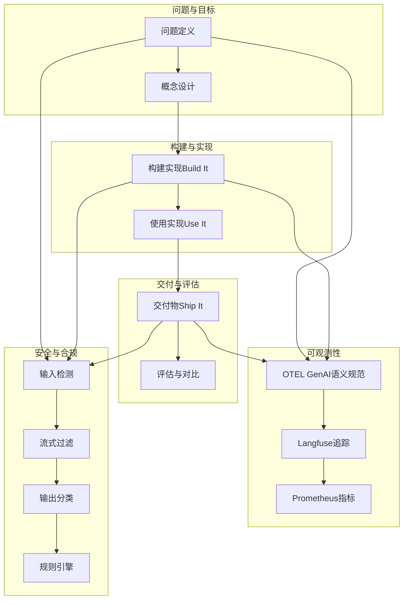

**图表来源**
- [phases/19-capstone-projects/01-terminal-native-coding-agent/docs/en.md:65-96](file://phases/19-capstone-projects/01-terminal-native-coding-agent/docs/en.md#L65-L96)
- [phases/19-capstone-projects/49-lm-eval-harness/docs/en.md:110-141](file://phases/19-capstone-projects/49-lm-eval-harness/docs/en.md#L110-L141)
- [phases/19-capstone-projects/87-end-to-end-safety-gate/docs/en.md:22-48](file://phases/19-capstone-projects/87-end-to-end-safety-gate/docs/en.md#L22-L48)

## 详细组件分析

### 终端原生编码智能体（Capstone 01）
- 实施流程：TUI命令循环、计划状态（TodoWrite）、工具表面（MCP StreamableHTTP）、沙箱隔离（E2B/Daytona）、钩子扩展（Pre/Post/Session/Stop等）、成本控制（令牌上限、会话预算、硬性回合数）、可观测性（OTEL + Langfuse）、PR自动化。
- 技术要点：StreamableHTTP传输、Worktree隔离、Hook生命周期、Token预算压缩（PreCompact）、SWE-bench Pro评估。
- 评估标准：pass@1 vs 基线、架构清晰度、安全性、可观测性、开发者体验、鲁棒性。

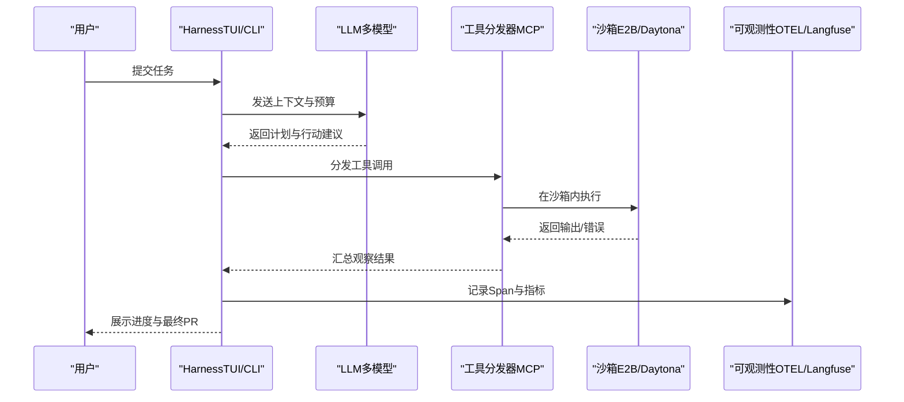

**图表来源**
- [phases/19-capstone-projects/01-terminal-native-coding-agent/docs/en.md:23-51](file://phases/19-capstone-projects/01-terminal-native-coding-agent/docs/en.md#L23-L51)

**章节来源**
- [phases/19-capstone-projects/01-terminal-native-coding-agent/docs/en.md:1-145](file://phases/19-capstone-projects/01-terminal-native-coding-agent/docs/en.md#L1-L145)

### 端到端微调流水线（Capstone 07）
- 实施流程：数据去重/质量过滤/PII清洗/分割卫生检查；SFT（Axolotl YAML + ZeRO-3 + FA3 + 序列打包）；偏好对齐（TRL DPO/GRPO）；量化（GPTQ/AWQ/GGUF）；服务（vLLM + EAGLE-3 + K8s HPA）；评估（lm-eval/RewardBench/MT-Bench/MMLU-Pro）；安全评估（Llama Guard/ShieldGemma）；模型卡（2026 MOF）。
- 技术要点：SFT-only vs SFT+DPO vs SFT+GRPO消融；EAGLE-3接受率与延迟；$/1M tokens；数据污染检测。
- 评估标准：目标任务增益、流水线可复现性、数据卫生、服务效率、模型卡与安全评估。

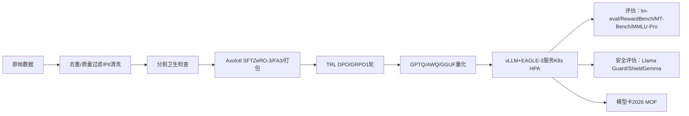

**图表来源**
- [phases/19-capstone-projects/07-end-to-end-fine-tuning-pipeline/docs/en.md:23-54](file://phases/19-capstone-projects/07-end-to-end-fine-tuning-pipeline/docs/en.md#L23-L54)

**章节来源**
- [phases/19-capstone-projects/07-end-to-end-fine-tuning-pipeline/docs/en.md:1-149](file://phases/19-capstone-projects/07-end-to-end-fine-tuning-pipeline/docs/en.md#L1-L149)

### 带注册表的MCP服务器（Capstone 13）
- 实施流程：暴露10个内部工具（Postgres只读、S3列表、Jira/Linear/Datadog等）、StreamableHTTP传输、OAuth 2.1作用域授权、OPA策略决策、破坏性工具分离与Slack人工审批、审计日志（按租户）、负载测试（100并发水平扩展）、一致性测试（MCP官方套件）。
- 技术要点：StreamableHTTP无状态扩展、能力清单（.well-known/mcp-capabilities）、OPA策略、人类审批、审计追踪。
- 评估标准：规范一致性、安全性（作用域/策略/密钥管理）、可观测性（每调用审计）、可扩展性（水平扩展）、注册表可用性。

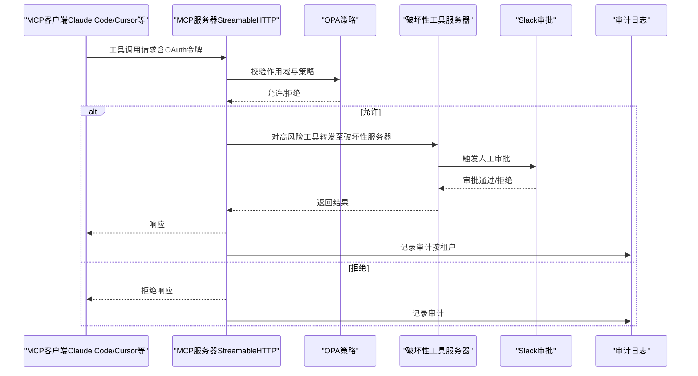

**图表来源**
- [phases/19-capstone-projects/13-mcp-server-with-registry/docs/en.md:25-56](file://phases/19-capstone-projects/13-mcp-server-with-registry/docs/en.md#L25-L56)

**章节来源**
- [phases/19-capstone-projects/13-mcp-server-with-registry/docs/en.md:1-149](file://phases/19-capstone-projects/13-mcp-server-with-registry/docs/en.md#L1-L149)

### 端到端编码任务演示（Capstone 29）
- 实施流程：将Gate链、沙箱、评估Harness与OTel Span整合为单一Agent循环；确定性策略（读取项目、运行测试、定位bug、修复、再次测试）；全局步数预算与观察令牌预算；完整OTel GenAI追踪与Prometheus指标；在少于12步内解决Fixture并零Gate触发。
- 技术要点：StepDispatcher、GateChain、Sandbox、ObservationLedger、SpanBuilder、MetricsRegistry；状态机五状态（SURVEY/RUN_TESTS/INSPECT/FIX/VERIFY）。
- 评估标准：步骤数约束、观察预算不超支、合法工具零拒绝、每步均有Span、Prometheus计数器与直方图。

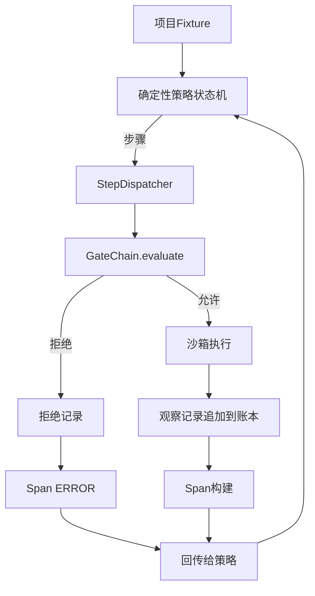

**图表来源**
- [phases/19-capstone-projects/29-end-to-end-coding-task-demo/docs/en.md:52-66](file://phases/19-capstone-projects/29-end-to-end-coding-task-demo/docs/en.md#L52-L66)

**章节来源**
- [phases/19-capstone-projects/29-end-to-end-coding-task-demo/docs/en.md:1-116](file://phases/19-capstone-projects/29-end-to-end-coding-task-demo/docs/en.md#L1-L116)

### BPE分词器从零实现（Capstone 30）
- 实施流程：字节级字母表（0–255），保留特殊token，空白与标点预分词，迭代合并最频繁相邻符号对，训练后应用同一合并顺序进行编码/解码，保证往返一致性（UTF-8无信息损失）。
- 技术要点：合并表确定性、特殊token保护、字节级健壮性、预分词避免跨词合并。
- 评估标准：往返一致性测试、特殊token保留、合并顺序正确性。

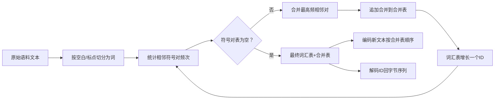

**图表来源**
- [phases/19-capstone-projects/30-bpe-tokenizer-from-scratch/docs/en.md:25-41](file://phases/19-capstone-projects/30-bpe-tokenizer-from-scratch/docs/en.md#L25-L41)

**章节来源**
- [phases/19-capstone-projects/30-bpe-tokenizer-from-scratch/docs/en.md:1-100](file://phases/19-capstone-projects/30-bpe-tokenizer-from-scratch/docs/en.md#L1-L100)

### 分布式数据并行与FSDP（Capstone 48）
- 实施流程：CPU上使用gloo后端初始化进程组，广播参数、反向后all-reduce梯度、验证多进程梯度等价性；FSDP草图：参数分片、前向gather、丢弃全张量、内存节省1/N。
- 技术要点：two collectives + one rule（启动广播、反向all-reduce）、FSDP反向gather与正向丢弃。
- 评估标准：多进程梯度与单进程梯度最大绝对差小于阈值、FSDP重建位相等。

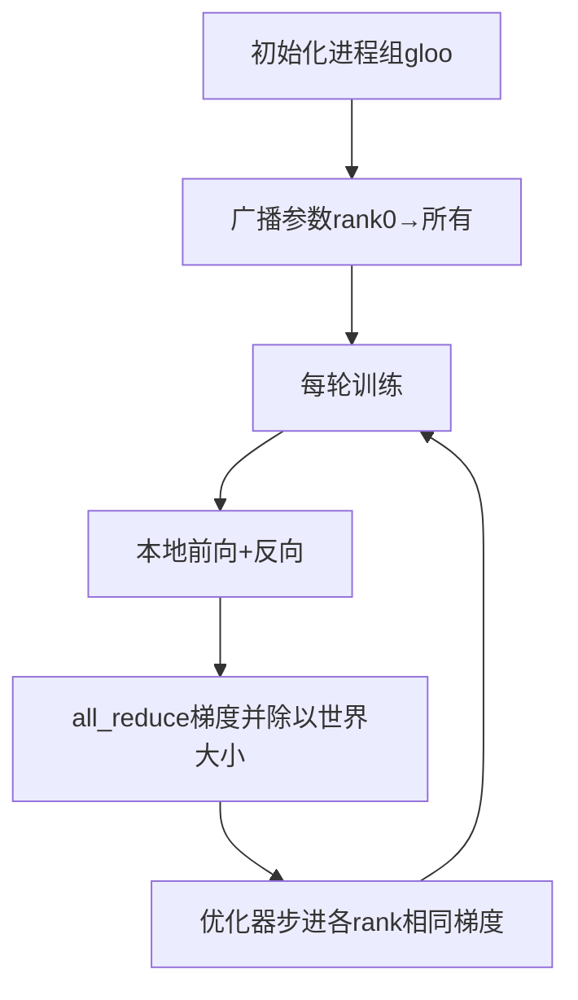

**图表来源**
- [phases/19-capstone-projects/48-distributed-fsdp-ddp/docs/en.md:25-40](file://phases/19-capstone-projects/48-distributed-fsdp-ddp/docs/en.md#L25-L40)

**章节来源**
- [phases/19-capstone-projects/48-distributed-fsdp-ddp/docs/en.md:1-161](file://phases/19-capstone-projects/48-distributed-fsdp-ddp/docs/en.md#L1-L161)

### LM评估防护罩（Capstone 49）
- 实施流程：任务规范（JSONL，含prompt/targets/metric/extras）、五种指标（精确匹配、ROUGE-L、可执行检查、多项选择、子串包含）、适配器接口（ModelAdapter.generate批量生成）、跑分与Leaderboard（含schema字符串）。
- 技术要点：适配器为唯一模型相关代码、批处理、可复现的总体平均分。
- 评估标准：任务文件固定、差异预测而非仅分数、批大小限制、可选包含每样本记录用于回归追踪。

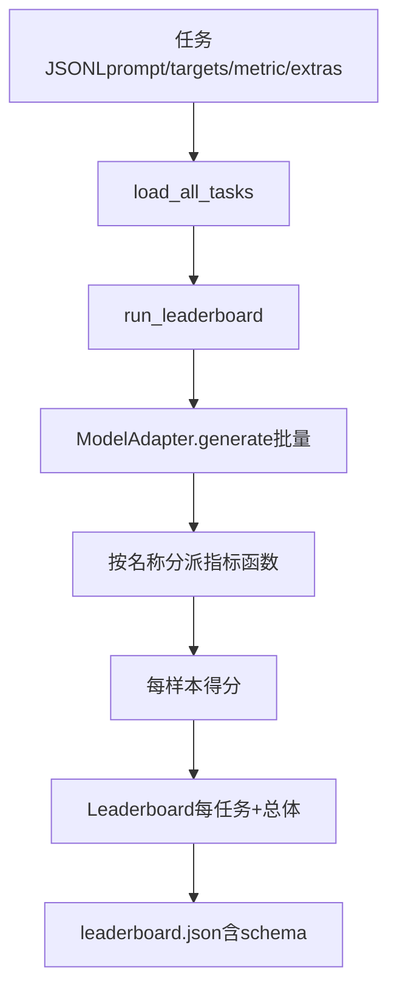

**图表来源**
- [phases/19-capstone-projects/49-lm-eval-harness/docs/en.md:25-36](file://phases/19-capstone-projects/49-lm-eval-harness/docs/en.md#L25-L36)

**章节来源**
- [phases/19-capstone-projects/49-lm-eval-harness/docs/en.md:1-199](file://phases/19-capstone-projects/49-lm-eval-harness/docs/en.md#L1-L199)

### 端到端RAG系统（Capstone 69）
- 实施流程：组装Chunker、混合检索（BM25+稠密+RRF）、查询重写（HyDE/多查询/分解）、交叉编码器重排、答案生成器（引用锚点+低置信拒绝）；离线自终止演示，严格阈值，失败即非零退出。
- 技术要点：稳定阶段接口、拒绝低置信（cross-encoder rank-1阈值）、Mock生成器隐藏幻觉风险、离线常量时间LLM模拟。
- 评估标准：集成管线优于孤立阶段、自终止演示报告、阈值驱动CI。

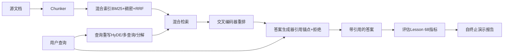

**图表来源**
- [phases/19-capstone-projects/69-end-to-end-rag-system/docs/en.md:24-37](file://phases/19-capstone-projects/69-end-to-end-rag-system/docs/en.md#L24-L37)

**章节来源**
- [phases/19-capstone-projects/69-end-to-end-rag-system/docs/en.md:1-156](file://phases/19-capstone-projects/69-end-to-end-rag-system/docs/en.md#L1-L156)

### 安全门（Capstone 87）
- 实施流程：三检查点（预生成、生成中、后生成）；预生成：输入检测器；生成中：流式过滤（缓冲最多两块，前缀注入识别）；后生成：输出分类器+规则引擎；聚合器综合四信号（检测置信度、流式触发、分类器严重性、规则引擎严重性）给出最终动作（阻止/删减/警告/允许）。
- 技术要点：自终止演示（每个请求完成或提前终止）、每请求trace（含延迟）、Mock LLM三种行为（拒绝/良性/部分有害）。
- 评估标准：每类别结果汇总、trace完整性、聚合逻辑正确性。

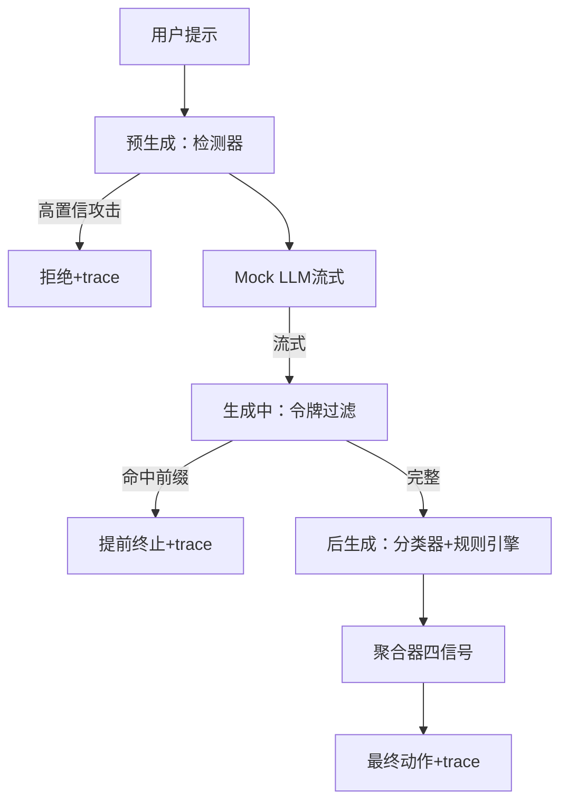

**图表来源**
- [phases/19-capstone-projects/87-end-to-end-safety-gate/docs/en.md:22-32](file://phases/19-capstone-projects/87-end-to-end-safety-gate/docs/en.md#L22-L32)

**章节来源**
- [phases/19-capstone-projects/87-end-to-end-safety-gate/docs/en.md:1-83](file://phases/19-capstone-projects/87-end-to-end-safety-gate/docs/en.md#L1-L83)

### 其他重要项目（概览）
- 推测式解码服务器（Capstone 14）：基于EAGLE-3的draft-verify流水线，降低尾延迟，提升吞吐。
- 多模态文档问答（Capstone 04）：视觉优先的文档问答，结合ColPali等视觉原生RAG。
- 自主研究智能体（Capstone 05）：类AI科学家的自主研究流程，包含假设生成、文献检索、实验运行、结果评估、论文写作。
- DevOps故障排查智能体（Capstone 06）：面向Kubernetes的故障排查Agent，结合日志检索与工具调用。
- 个人AI导师（Capstone 17）：自适应多模态导师系统，支持个性化学习路径。
- 多智能体软件团队（Capstone 10）：角色分工、编排模式、共识与协调、生产扩展。
- LLM可观测性仪表板（Capstone 11）：端到端指标采集、可视化与告警。
- 视频理解流水线（Capstone 12）：场景到问答的视频理解链路。
- JSON-RPC STDIO传输（Capstone 22）：基于换行分隔的STDIO传输实现。
- 函数调用分发器（Capstone 23）：统一工具路由与参数校验。
- 计划执行控制流（Capstone 24）：ReWOO/HTN等规划与执行的控制结构。
- 验证门观测预算（Capstone 25）：观察预算与验证门的协同。
- 沙箱运行器黑名单（Capstone 26）：路径隔离与黑名单策略。
- 评估防护罩固定任务（Capstone 27）：固定任务集的评估流水线。
- 可观测性OTEL追踪（Capstone 28）：OTel GenAI语义规范与Prometheus指标。
- 评估流水线（Capstone 41）：端到端评估框架。
- 大型语料库下载器（Capstone 42）：大规模语料下载与校验。
- HDF5标记化语料库（Capstone 43）：高效存储与访问。
- 余弦学习率预热（Capstone 44）：学习率调度。
- 梯度裁剪AMP（Capstone 45）：混合精度与梯度裁剪。
- 梯度累积（Capstone 46）：多步累积与no_sync。
- 检查点保存恢复（Capstone 47）：断点续训与一致性。
- LM评估防护罩（Capstone 49）：见上。
- 假设生成器（Capstone 50）：研究型Agent的假设生成。
- 文献检索（Capstone 51）：检索与筛选。
- 实验运行器（Capstone 52）：实验编排与资源管理。
- 结果评估器（Capstone 53）：结果收集与统计。
- 论文写作器（Capstone 54）：自动摘要与结构化写作。
- 评论循环（Capstone 55）：评审与迭代。
- 迭代调度器（Capstone 56）：实验迭代与资源调度。
- 研究演示（Capstone 57）：端到端研究演示。
- 视觉编码器补丁（Capstone 58）：ViT补丁提取。
- ViT Transformer（Capstone 59）：视觉Transformer实现。
- 投影层模态对齐（Capstone 60）：跨模态对齐。
- 交叉注意力融合（Capstone 61）：跨模态融合。
- 视觉语言预训练（Capstone 62）：对比学习与预训练。
- 多模态评估（Capstone 63）：多模态指标。
- 高级分块策略（Capstone 64）：递归/滚动/重叠等策略。
- 混合检索BM25密集（Capstone 65）：BM25+稠密融合。
- 重排序器交叉编码器（Capstone 66）：交叉编码器重排。
- 查询重写HyDE（Capstone 67）：假设文档增强。
- RAG评估精度召回（Capstone 68）：Precision/Recall/MRR/nDCG/Faithfulness/Relevance。
- 任务规格格式（Capstone 70）：标准化任务描述。
- 经典指标（Capstone 71）：传统指标体系。
- 代码执行指标（Capstone 72）：可执行检查。
- 困惑度校准（Capstone 73）：困惑度与校准。
- 排行榜聚合（Capstone 74）：多任务聚合。
- 端到端评估运行器（Capstone 75）：评估流水线。
- 集合操作从零实现（Capstone 76）：分布式集合通信。
- 数据并行DDP（Capstone 77）：数据并行实现。
- 零参数分片（Capstone 78）：ZeRO优化器状态分片。
- 流水线并行（Capstone 79）：层间流水线。
- 检查点分片恢复（Capstone 80）：分片检查点。
- 端到端分布式训练（Capstone 81）：端到端分布式训练。
- 越狱分类法（Capstone 82）：越狱攻击分类与检测。

**章节来源**
- [ROADMAP.md:522-611](file://ROADMAP.md#L522-L611)
- [phases/19-capstone-projects/README.md:1-6](file://phases/19-capstone-projects/README.md#L1-L6)

## 依赖关系分析
阶段19项目之间存在明显的依赖与复用关系：
- Track A（终端与工具链）：25-29号项目构成闭环，Gate链→沙箱→评估Harness→OTel追踪→端到端演示。
- Track B（训练与推理）：30-48号项目构成训练栈，从分词器到分布式训练再到评估。
- Track C（微调与评测）：49-57号项目构成评测与研究流程。
- Track D（检索增强与多模态）：64-69号项目构成RAG系统。
- Track E（安全与合规）：82-87号项目构成安全门与合规。
- Track F（工具协议与生产）：13、14、21-24、28、33-35、48、69、87等项目构成生产化基础设施。

```mermaid
graph TB
subgraph "Track A"
A25["验证门观测预算"] --> A26["沙箱运行器黑名单"]
A26 --> A27["评估防护罩固定任务"]
A27 --> A28["可观测性OTEL追踪"]
A28 --> A29["端到端编码任务演示"]
end
subgraph "Track B"
B30["BPE分词器"] --> B34["Transformer块"]
B34 --> B35["GPT模型组装"]
B35 --> B48["分布式FSDP DDP"]
B48 --> B49["LM评估防护罩"]
end
subgraph "Track C"
C49["LM评估防护罩"] --> C50["假设生成器"]
C50 --> C51["文献检索"]
C51 --> C52["实验运行器"]
C52 --> C53["结果评估器"]
C53 --> C54["论文写作器"]
C54 --> C55["评论循环"]
C55 --> C56["迭代调度器"]
C56 --> C57["端到端研究演示"]
end
subgraph "Track D"
D64["高级分块策略"] --> D65["混合检索BM25密集"]
D65 --> D66["重排序器交叉编码器"]
D66 --> D67["查询重写HyDE"]
D67 --> D68["RAG评估精度召回"]
D68 --> D69["端到端RAG系统"]
end
subgraph "Track E"
E82["越狱分类法"] --> E83["提示注入检测器"]
E83 --> E84["拒绝评估"]
E84 --> E85["内容分类器集成"]
E85 --> E86["宪法规则引擎"]
E86 --> E87["端到端安全门"]
end
subgraph "Track F"
F13["MCP服务器+注册表"] --> F14["推测式解码服务器"]
F21["工具注册表模式验证"] --> F23["函数调用分发器"]
F24["计划执行控制流"] --> F28["可观测性OTEL追踪"]
F33["多头自注意力"] --> F35["GPT模型组装"]
F48["分布式FSDP DDP"] --> F69["端到端RAG系统"]
F87["端到端安全门"] --> F13
end
```

**图表来源**
- [ROADMAP.md:522-611](file://ROADMAP.md#L522-L611)
- [phases/19-capstone-projects/01-terminal-native-coding-agent/docs/en.md:1-145](file://phases/19-capstone-projects/01-terminal-native-coding-agent/docs/en.md#L1-L145)
- [phases/19-capstone-projects/49-lm-eval-harness/docs/en.md:1-199](file://phases/19-capstone-projects/49-lm-eval-harness/docs/en.md#L1-L199)
- [phases/19-capstone-projects/69-end-to-end-rag-system/docs/en.md:1-156](file://phases/19-capstone-projects/69-end-to-end-rag-system/docs/en.md#L1-L156)
- [phases/19-capstone-projects/87-end-to-end-safety-gate/docs/en.md:1-83](file://phases/19-capstone-projects/87-end-to-end-safety-gate/docs/en.md#L1-L83)

**章节来源**
- [ROADMAP.md:522-611](file://ROADMAP.md#L522-L611)

## 性能考虑
- 训练与推理：分布式FSDP减少显存占用，ZeRO-3/梯度累积平衡内存与吞吐；混合精度AMP降低显存与提高吞吐；学习率余弦预热平滑收敛。
- 服务与吞吐：vLLM + EAGLE-3的推测式解码显著降低尾延迟；K8s HPA基于队列等待弹性扩缩容。
- 评估与可观测：OTEL GenAI语义规范与Prometheus指标确保端到端可见；Langfuse追踪便于回归定位。
- 安全与合规：OPA策略与人类审批在高风险工具上引入延迟但保障安全；越狱分类法与提示注入检测器在生成中早期拦截。

[本节为通用指导，无需特定文件引用]

## 故障排除指南
- Gate链拒绝合法工具：检查PreToolUse钩子与作用域配置，确认工具Schema与权限映射；查看GateChain.trace与审计日志。
- 沙箱逃逸或破坏性操作：确认denylist与路径隔离；审查破坏性工具分离与Slack审批流程。
- 评估分数异常：核对任务文件固定与哈希；启用每样本输出diff；检查批大小与速率限制。
- 分布式训练不同步：确认参数广播与梯度all-reduce顺序；检查进程组初始化与后端（gloo/nccl）。
- RAG系统召回下降：检查Chunker边界漂移与reranker训练集泄漏；确保查询重写与交叉编码器一致。
- 安全门误报/漏报：调整聚合阈值与信号权重；增加流式过滤规则与规则引擎覆盖范围。

**章节来源**
- [phases/19-capstone-projects/29-end-to-end-coding-task-demo/docs/en.md:89-101](file://phases/19-capstone-projects/29-end-to-end-coding-task-demo/docs/en.md#L89-L101)
- [phases/19-capstone-projects/13-mcp-server-with-registry/docs/en.md:79-85](file://phases/19-capstone-projects/13-mcp-server-with-registry/docs/en.md#L79-L85)
- [phases/19-capstone-projects/49-lm-eval-harness/docs/en.md:164-168](file://phases/19-capstone-projects/49-lm-eval-harness/docs/en.md#L164-L168)
- [phases/19-capstone-projects/48-distributed-fsdp-ddp/docs/en.md:124-130](file://phases/19-capstone-projects/48-distributed-fsdp-ddp/docs/en.md#L124-L130)
- [phases/19-capstone-projects/69-end-to-end-rag-system/docs/en.md:106-116](file://phases/19-capstone-projects/69-end-to-end-rag-system/docs/en.md#L106-L116)
- [phases/19-capstone-projects/87-end-to-end-safety-gate/docs/en.md:64-68](file://phases/19-capstone-projects/87-end-to-end-safety-gate/docs/en.md#L64-L68)

## 结论
阶段19通过82个综合性项目，系统性地覆盖了从基础算法实现到端到端工程交付的关键路径：训练与推理、检索增强、多模态、安全与合规、工具协议与生产化。每个项目均强调“可构建—可使用—可交付”，并通过可观测性与评估体系确保可复现与可审计。读者可在真实工程场景中复用这些模块，快速搭建可扩展、可治理的AI系统。

[本节为总结性内容，无需特定文件引用]

## 附录
- 术语速查：Harness/Hook/Worktree/TodoWrite/StreamableHTTP/Token Ceiling/pass@1等术语的精确定义与使用场景。
- 进一步阅读：各项目文档末尾提供的参考链接与后续学习路径。

**章节来源**
- [phases/19-capstone-projects/01-terminal-native-coding-agent/docs/en.md:123-144](file://phases/19-capstone-projects/01-terminal-native-coding-agent/docs/en.md#L123-L144)
- [phases/19-capstone-projects/49-lm-eval-harness/docs/en.md:192-198](file://phases/19-capstone-projects/49-lm-eval-harness/docs/en.md#L192-L198)
- [phases/19-capstone-projects/87-end-to-end-safety-gate/docs/en.md:80-82](file://phases/19-capstone-projects/87-end-to-end-safety-gate/docs/en.md#L80-L82)