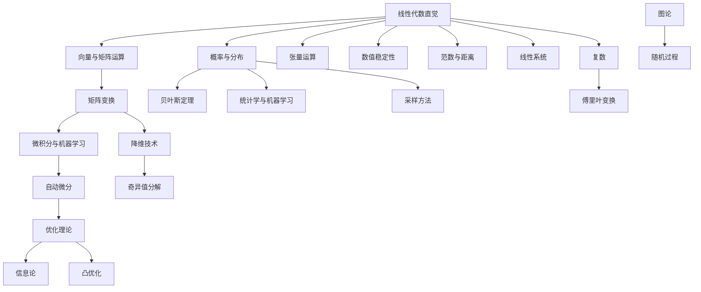
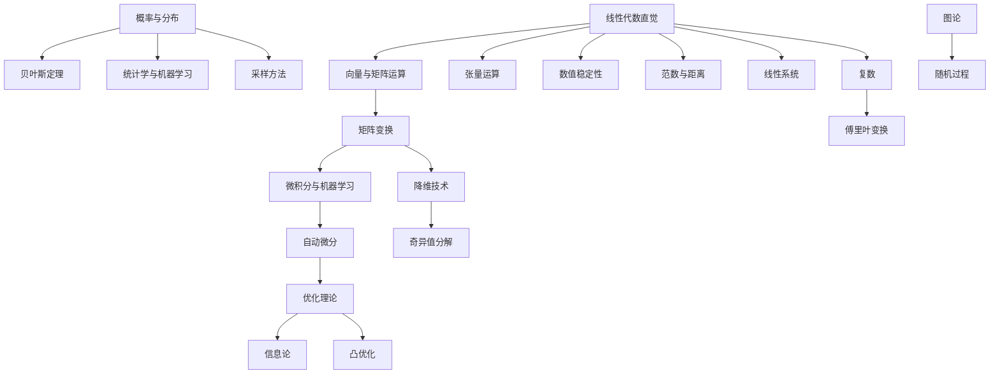

# 阶段1：数学基础

<cite>
**本文引用的文件**
- [phases/01-math-foundations/README.md](file://phases/01-math-foundations/README.md)
- [phases/01-math-foundations/01-linear-algebra-intuition/README.md](file://phases/01-math-foundations/01-linear-algebra-intuition/README.md)
- [phases/01-math-foundations/02-vectors-matrices-operations/README.md](file://phases/01-math-foundations/02-vectors-matrices-operations/README.md)
- [phases/01-math-foundations/03-matrix-transformations/README.md](file://phases/01-math-foundations/03-matrix-transformations/README.md)
- [phases/01-math-foundations/04-calculus-for-ml/README.md](file://phases/01-math-foundations/04-calculus-for-ml/README.md)
- [phases/01-math-foundations/05-chain-rule-and-autodiff/README.md](file://phases/01-math-foundations/05-chain-rule-and-autodiff/README.md)
- [phases/01-math-foundations/06-probability-and-distributions/README.md](file://phases/01-math-foundations/06-probability-and-distributions/README.md)
- [phases/01-math-foundations/07-bayes-theorem/README.md](file://phases/01-math-foundations/07-bayes-theorem/README.md)
- [phases/01-math-foundations/08-optimization/README.md](file://phases/01-math-foundations/08-optimization/README.md)
- [phases/01-math-foundations/09-information-theory/README.md](file://phases/01-math-foundations/09-information-theory/README.md)
- [phases/01-math-foundations/10-dimensionality-reduction/README.md](file://phases/01-math-foundations/10-dimensionality-reduction/README.md)
- [phases/01-math-foundations/11-singular-value-decomposition/README.md](file://phases/01-math-foundations/11-singular-value-decomposition/README.md)
- [phases/01-math-foundations/12-tensor-operations/README.md](file://phases/01-math-foundations/12-tensor-operations/README.md)
- [phases/01-math-foundations/13-numerical-stability/README.md](file://phases/01-math-foundations/13-numerical-stability/README.md)
- [phases/01-math-foundations/14-norms-and-distances/README.md](file://phases/01-math-foundations/14-norms-and-distances/README.md)
- [phases/01-math-foundations/15-statistics-for-ml/README.md](file://phases/01-math-foundations/15-statistics-for-ml/README.md)
- [phases/01-math-foundations/16-sampling-methods/README.md](file://phases/01-math-foundations/16-sampling-methods/README.md)
- [phases/01-math-foundations/17-linear-systems/README.md](file://phases/01-math-foundations/17-linear-systems/README.md)
- [phases/01-math-foundations/18-convex-optimization/README.md](file://phases/01-math-foundations/18-convex-optimization/README.md)
- [phases/01-math-foundations/19-complex-numbers/README.md](file://phases/01-math-foundations/19-complex-numbers/README.md)
- [phases/01-math-foundations/20-fourier-transform/README.md](file://phases/01-math-foundations/20-fourier-transform/README.md)
- [phases/01-math-foundations/21-graph-theory/README.md](file://phases/01-math-foundations/21-graph-theory/README.md)
- [phases/01-math-foundations/22-stochastic-processes/README.md](file://phases/01-math-foundations/22-stochastic-processes/README.md)
</cite>

## 目录
1. [引言](#引言)
2. [项目结构](#项目结构)
3. [核心组件](#核心组件)
4. [架构总览](#架构总览)
5. [详细组件分析](#详细组件分析)
6. [依赖分析](#依赖分析)
7. [性能考虑](#性能考虑)
8. [故障排查指南](#故障排查指南)
9. [结论](#结论)
10. [附录](#附录)

## 引言
本阶段聚焦“数学基础”，目标是通过代码与直观理解，建立对AI算法背后的数学直觉。仓库以“从零开始”的方式组织了22门核心数学课程，覆盖线性代数、向量与矩阵运算、矩阵变换、微积分与自动微分、概率与分布、贝叶斯定理、优化理论、信息论、降维与主成分分析、奇异值分解、张量运算、数值稳定性、范数与距离、统计学、采样方法、线性系统、凸优化、复数、傅里叶变换、图论、随机过程等主题。每门课程均配有练习题与中文测验，帮助读者巩固知识并检验掌握程度。

## 项目结构
该阶段采用按课程编号组织的层次化结构，每个课程包含：
- 课程说明文档（README.md）
- 代码示例目录（code/）
- 文档与讲义（docs/）
- 输出产物（outputs/）
- 测验（quiz.json 及其对应的中文版本 quiz.zh.json）

下图展示了阶段一的整体结构与课程分布：

```mermaid
graph TB
Root["阶段1：数学基础<br/>phases/01-math-foundations"] --> C1["线性代数直觉<br/>01-linear-algebra-intuition"]
Root --> C2["向量与矩阵运算<br/>02-vectors-matrices-operations"]
Root --> C3["矩阵变换<br/>03-matrix-transformations"]
Root --> C4["微积分与机器学习<br/>04-calculus-for-ml"]
Root --> C5["链式法则与自动微分<br/>05-chain-rule-and-autodiff"]
Root --> C6["概率与分布<br/>06-probability-and-distributions"]
Root --> C7["贝叶斯定理<br/>07-bayes-theorem"]
Root --> C8["优化理论<br/>08-optimization"]
Root --> C9["信息论<br/>09-information-theory"]
Root --> C10["降维技术<br/>10-dimensionality-reduction"]
Root --> C11["奇异值分解<br/>11-singular-value-decomposition"]
Root --> C12["张量运算<br/>12-tensor-operations"]
Root --> C13["数值稳定性<br/>13-numerical-stability"]
Root --> C14["范数与距离<br/>14-norms-and-distances"]
Root --> C15["统计学与机器学习<br/>15-statistics-for-ml"]
Root --> C16["采样方法<br/>16-sampling-methods"]
Root --> C17["线性系统<br/>17-linear-systems"]
Root --> C18["凸优化<br/>18-convex-optimization"]
Root --> C19["复数<br/>19-complex-numbers"]
Root --> C20["傅里叶变换<br/>20-fourier-transform"]
Root --> C21["图论<br/>21-graph-theory"]
Root --> C22["随机过程<br/>22-stochastic-processes"]
```

图表来源
- [phases/01-math-foundations/README.md](file://phases/01-math-foundations/README.md)
- [phases/01-math-foundations/01-linear-algebra-intuition/README.md](file://phases/01-math-foundations/01-linear-algebra-intuition/README.md)
- [phases/01-math-foundations/02-vectors-matrices-operations/README.md](file://phases/01-math-foundations/02-vectors-matrices-operations/README.md)
- [phases/01-math-foundations/03-matrix-transformations/README.md](file://phases/01-math-foundations/03-matrix-transformations/README.md)
- [phases/01-math-foundations/04-calculus-for-ml/README.md](file://phases/01-math-foundations/04-calculus-for-ml/README.md)
- [phases/01-math-foundations/05-chain-rule-and-autodiff/README.md](file://phases/01-math-foundations/05-chain-rule-and-autodiff/README.md)
- [phases/01-math-foundations/06-probability-and-distributions/README.md](file://phases/01-math-foundations/06-probability-and-distributions/README.md)
- [phases/01-math-foundations/07-bayes-theorem/README.md](file://phases/01-math-foundations/07-bayes-theorem/README.md)
- [phases/01-math-foundations/08-optimization/README.md](file://phases/01-math-foundations/08-optimization/README.md)
- [phases/01-math-foundations/09-information-theory/README.md](file://phases/01-math-foundations/09-information-theory/README.md)
- [phases/01-math-foundations/10-dimensionality-reduction/README.md](file://phases/01-math-foundations/10-dimensionality-reduction/README.md)
- [phases/01-math-foundations/11-singular-value-decomposition/README.md](file://phases/01-math-foundations/11-singular-value-decomposition/README.md)
- [phases/01-math-foundations/12-tensor-operations/README.md](file://phases/01-math-foundations/12-tensor-operations/README.md)
- [phases/01-math-foundations/13-numerical-stability/README.md](file://phases/01-math-foundations/13-numerical-stability/README.md)
- [phases/01-math-foundations/14-norms-and-distances/README.md](file://phases/01-math-foundations/14-norms-and-distances/README.md)
- [phases/01-math-foundations/15-statistics-for-ml/README.md](file://phases/01-math-foundations/15-statistics-for-ml/README.md)
- [phases/01-math-foundations/16-sampling-methods/README.md](file://phases/01-math-foundations/16-sampling-methods/README.md)
- [phases/01-math-foundations/17-linear-systems/README.md](file://phases/01-math-foundations/17-linear-systems/README.md)
- [phases/01-math-foundations/18-convex-optimization/README.md](file://phases/01-math-foundations/18-convex-optimization/README.md)
- [phases/01-math-foundations/19-complex-numbers/README.md](file://phases/01-math-foundations/19-complex-numbers/README.md)
- [phases/01-math-foundations/20-fourier-transform/README.md](file://phases/01-math-foundations/20-fourier-transform/README.md)
- [phases/01-math-foundations/21-graph-theory/README.md](file://phases/01-math-foundations/21-graph-theory/README.md)
- [phases/01-math-foundations/22-stochastic-processes/README.md](file://phases/01-math-foundations/22-stochastic-processes/README.md)

章节来源
- [phases/01-math-foundations/README.md](file://phases/01-math-foundations/README.md)

## 核心组件
- 线性代数直觉：建立向量、矩阵、行列式的几何与代数直觉，为深度学习权重空间与梯度方向提供基础。
- 向量与矩阵运算：涵盖加法、乘法、转置、逆与行列式，强调计算与实现细节。
- 矩阵变换：从旋转、缩放、投影到特征值分解，连接几何变换与数据变换。
- 微积分与机器学习：导数、偏导、梯度、雅可比与海塞矩阵在模型训练中的作用。
- 自动微分：前向/反向模式的实现原理与在神经网络中的应用。
- 概率与分布：离散/连续概率模型、联合/边缘/条件概率、期望与方差。
- 贝叶斯定理：先验、似然、后验与参数估计的贝叶斯视角。
- 优化理论：无约束与约束优化、一阶/二阶梯度方法、收敛性与稳定性。
- 信息论：熵、互信息、KL散度与交叉熵在模型评估与正则中的意义。
- 降维技术：主成分分析（PCA）与特征值问题求解。
- 奇异值分解（SVD）：低秩近似、噪声抑制与推荐系统的矩阵补全。
- 张量运算：多维数组的广播、收缩与卷积，为高维数据处理打基础。
- 数值稳定性：浮点误差、病态矩阵与迭代收敛问题的对策。
- 范数与距离：L1/L2/无穷范数与距离度量在正则与相似度计算中的作用。
- 统计学与机器学习：参数估计、假设检验、偏差-方差权衡。
- 采样方法：重要性采样、马尔可夫链蒙特卡洛（MCMC）等在贝叶斯推断中的应用。
- 线性系统：线性方程组求解、LU/QR分解与迭代方法。
- 凸优化：凸集、凸函数、凸规划与对偶理论。
- 复数：复平面、欧拉公式与信号处理中的应用。
- 傅里叶变换：频域分析、卷积定理与滤波器设计。
- 图论：节点、边、路径与邻接表示，为图神经网络与知识图谱打基础。
- 随机过程：马尔可夫链、布朗运动与时间序列建模。

章节来源
- [phases/01-math-foundations/01-linear-algebra-intuition/README.md](file://phases/01-math-foundations/01-linear-algebra-intuition/README.md)
- [phases/01-math-foundations/02-vectors-matrices-operations/README.md](file://phases/01-math-foundations/02-vectors-matrices-operations/README.md)
- [phases/01-math-foundations/03-matrix-transformations/README.md](file://phases/01-math-foundations/03-matrix-transformations/README.md)
- [phases/01-math-foundations/04-calculus-for-ml/README.md](file://phases/01-math-foundations/04-calculus-for-ml/README.md)
- [phases/01-math-foundations/05-chain-rule-and-autodiff/README.md](file://phases/01-math-foundations/05-chain-rule-and-autodiff/README.md)
- [phases/01-math-foundations/06-probability-and-distributions/README.md](file://phases/01-math-foundations/06-probability-and-distributions/README.md)
- [phases/01-math-foundations/07-bayes-theorem/README.md](file://phases/01-math-foundations/07-bayes-theorem/README.md)
- [phases/01-math-foundations/08-optimization/README.md](file://phases/01-math-foundations/08-optimization/README.md)
- [phases/01-math-foundations/09-information-theory/README.md](file://phases/01-math-foundations/09-information-theory/README.md)
- [phases/01-math-foundations/10-dimensionality-reduction/README.md](file://phases/01-math-foundations/10-dimensionality-reduction/README.md)
- [phases/01-math-foundations/11-singular-value-decomposition/README.md](file://phases/01-math-foundations/11-singular-value-decomposition/README.md)
- [phases/01-math-foundations/12-tensor-operations/README.md](file://phases/01-math-foundations/12-tensor-operations/README.md)
- [phases/01-math-foundations/13-numerical-stability/README.md](file://phases/01-math-foundations/13-numerical-stability/README.md)
- [phases/01-math-foundations/14-norms-and-distances/README.md](file://phases/01-math-foundations/14-norms-and-distances/README.md)
- [phases/01-math-foundations/15-statistics-for-ml/README.md](file://phases/01-math-foundations/15-statistics-for-ml/README.md)
- [phases/01-math-foundations/16-sampling-methods/README.md](file://phases/01-math-foundations/16-sampling-methods/README.md)
- [phases/01-math-foundations/17-linear-systems/README.md](file://phases/01-math-foundations/17-linear-systems/README.md)
- [phases/01-math-foundations/18-convex-optimization/README.md](file://phases/01-math-foundations/18-convex-optimization/README.md)
- [phases/01-math-foundations/19-complex-numbers/README.md](file://phases/01-math-foundations/19-complex-numbers/README.md)
- [phases/01-math-foundations/20-fourier-transform/README.md](file://phases/01-math-foundations/20-fourier-transform/README.md)
- [phases/01-math-foundations/21-graph-theory/README.md](file://phases/01-math-foundations/21-graph-theory/README.md)
- [phases/01-math-foundations/22-stochastic-processes/README.md](file://phases/01-math-foundations/22-stochastic-processes/README.md)

## 架构总览
阶段一的课程体系遵循“由浅入深、由直觉到严谨”的递进逻辑，形成如下知识架构：

图表来源
- [phases/01-math-foundations/01-linear-algebra-intuition/README.md](file://phases/01-math-foundations/01-linear-algebra-intuition/README.md)
- [phases/01-math-foundations/02-vectors-matrices-operations/README.md](file://phases/01-math-foundations/02-vectors-matrices-operations/README.md)
- [phases/01-math-foundations/03-matrix-transformations/README.md](file://phases/01-math-foundations/03-matrix-transformations/README.md)
- [phases/01-math-foundations/04-calculus-for-ml/README.md](file://phases/01-math-foundations/04-calculus-for-ml/README.md)
- [phases/01-math-foundations/05-chain-rule-and-autodiff/README.md](file://phases/01-math-foundations/05-chain-rule-and-autodiff/README.md)
- [phases/01-math-foundations/06-probability-and-distributions/README.md](file://phases/01-math-foundations/06-probability-and-distributions/README.md)
- [phases/01-math-foundations/07-bayes-theorem/README.md](file://phases/01-math-foundations/07-bayes-theorem/README.md)
- [phases/01-math-foundations/08-optimization/README.md](file://phases/01-math-foundations/08-optimization/README.md)
- [phases/01-math-foundations/09-information-theory/README.md](file://phases/01-math-foundations/09-information-theory/README.md)
- [phases/01-math-foundations/10-dimensionality-reduction/README.md](file://phases/01-math-foundations/10-dimensionality-reduction/README.md)
- [phases/01-math-foundations/11-singular-value-decomposition/README.md](file://phases/01-math-foundations/11-singular-value-decomposition/README.md)
- [phases/01-math-foundations/12-tensor-operations/README.md](file://phases/01-math-foundations/12-tensor-operations/README.md)
- [phases/01-math-foundations/13-numerical-stability/README.md](file://phases/01-math-foundations/13-numerical-stability/README.md)
- [phases/01-math-foundations/14-norms-and-distances/README.md](file://phases/01-math-foundations/14-norms-and-distances/README.md)
- [phases/01-math-foundations/15-statistics-for-ml/README.md](file://phases/01-math-foundations/15-statistics-for-ml/README.md)
- [phases/01-math-foundations/16-sampling-methods/README.md](file://phases/01-math-foundations/16-sampling-methods/README.md)
- [phases/01-math-foundations/17-linear-systems/README.md](file://phases/01-math-foundations/17-linear-systems/README.md)
- [phases/01-math-foundations/18-convex-optimization/README.md](file://phases/01-math-foundations/18-convex-optimization/README.md)
- [phases/01-math-foundations/19-complex-numbers/README.md](file://phases/01-math-foundations/19-complex-numbers/README.md)
- [phases/01-math-foundations/20-fourier-transform/README.md](file://phases/01-math-foundations/20-fourier-transform/README.md)
- [phases/01-math-foundations/21-graph-theory/README.md](file://phases/01-math-foundations/21-graph-theory/README.md)
- [phases/01-math-foundations/22-stochastic-processes/README.md](file://phases/01-math-foundations/22-stochastic-processes/README.md)

## 详细组件分析

### 线性代数直觉
- 学习要点：向量的几何意义、标量积与叉积、矩阵作为线性变换的表示、行列式的几何解释。
- 实践建议：用可视化工具展示向量旋转、缩放与投影；编写最小实现验证矩阵乘法与特征值分解。
- 典型误区：混淆坐标系与基底；忽略矩阵非交换性导致的错误推导。

章节来源
- [phases/01-math-foundations/01-linear-algebra-intuition/README.md](file://phases/01-math-foundations/01-linear-algebra-intuition/README.md)

### 向量与矩阵运算
- 学习要点：加法、乘法、转置、共轭、逆与伪逆；行列式与迹；特征值与特征向量。
- 实践建议：手写实现矩阵乘法与求逆；对比不同库的实现差异；关注数值稳定性。
- 典型误区：误以为矩阵可逆等价于行列式非零；忽略维度匹配与广播规则。

章节来源
- [phases/01-math-foundations/02-vectors-matrices-operations/README.md](file://phases/01-math-foundations/02-vectors-matrices-operations/README.md)

### 矩阵变换
- 学习要点：旋转、缩放、剪切、投影与反射；正交矩阵与正规矩阵；对称矩阵的对角化。
- 实践建议：实现基本变换的组合；用图像或点云演示变换效果。
- 典型误区：混淆变换顺序与矩阵乘法方向；忽略正交性假设。

章节来源
- [phases/01-math-foundations/03-matrix-transformations/README.md](file://phases/01-math-foundations/03-matrix-transformations/README.md)

### 微积分与机器学习
- 学习要点：导数、偏导、梯度、雅可比与海塞矩阵；链式法则在复合函数中的应用。
- 实践建议：实现梯度检查与数值导数对比；理解损失函数的可微性要求。
- 典型误区：忽略函数可微性假设；混淆方向导数与梯度。

章节来源
- [phases/01-math-foundations/04-calculus-for-ml/README.md](file://phases/01-math-foundations/04-calculus-for-ml/README.md)

### 链式法则与自动微分
- 学习要点：前向模式与反向模式的计算图；自动微分在BP中的角色。
- 实践建议：构建简单计算图并手动追踪前向/反向传播；比较两种模式的适用场景。
- 典型误区：忘记清理中间变量；忽略常数项的导数为零。

章节来源
- [phases/01-math-foundations/05-chain-rule-and-autodiff/README.md](file://phases/01-math-foundations/05-chain-rule-and-autodiff/README.md)

### 概率与分布
- 学习要点：概率公理、条件概率、全概率公式；离散/连续分布的期望与方差。
- 实践建议：生成样本并估计均值/方差；绘制PMF/PDF进行直觉验证。
- 典型误区：混淆独立与不相容事件；误用贝叶斯公式时忽略先验。

章节来源
- [phases/01-math-foundations/06-probability-and-distributions/README.md](file://phases/01-math-foundations/06-probability-and-distributions/README.md)

### 贝叶斯定理
- 学习要点：先验、似然、后验与证据；MAP与MCMC估计。
- 实践建议：用简单模型演示先验如何影响后验；实现简单MCMC采样。
- 典型误区：忽略超参数选择对后验的影响；将后验当作先验重复使用。

章节来源
- [phases/01-math-foundations/07-bayes-theorem/README.md](file://phases/01-math-foundations/07-bayes-theorem/README.md)

### 优化理论
- 学习要点：梯度下降、牛顿法、信赖域与共轭梯度；收敛性与步长策略。
- 实践建议：实现不同优化器并比较轨迹；可视化损失面与收敛路径。
- 典型误区：步长过大导致发散；忽略Hessian病态带来的困难。

章节来源
- [phases/01-math-foundations/08-optimization/README.md](file://phases/01-math-foundations/08-optimization/README.md)

### 信息论
- 学习要点：熵、条件熵、互信息、KL散度；交叉熵与最大似然的关系。
- 实践建议：计算离散分布的熵并解释不确定性；用KL散度衡量分布差异。
- 典型误区：混淆熵与信息增益；忽略KL散度的非对称性。

章节来源
- [phases/01-math-foundations/09-information-theory/README.md](file://phases/01-math-foundations/09-information-theory/README.md)

### 降维技术
- 学习要点：主成分分析（PCA）与特征值问题；协方差矩阵的性质。
- 实践建议：从零实现PCA并可视化主成分；对比不同中心化策略。
- 典型误区：未中心化导致主成分方向错误；忽略特征值排序与累积方差贡献。

章节来源
- [phases/01-math-foundations/10-dimensionality-reduction/README.md](file://phases/01-math-foundations/10-dimensionality-reduction/README.md)

### 奇异值分解（SVD）
- 学习要点：SVD的几何与代数意义；低秩近似与噪声抑制。
- 实践建议：实现SVD并用于图像压缩与推荐系统矩阵补全。
- 典型误区：忽略奇异值大小的截断阈值；混淆SVD与EVD。

章节来源
- [phases/01-math-foundations/11-singular-value-decomposition/README.md](file://phases/01-math-foundations/11-singular-value-decomposition/README.md)

### 张量运算
- 学习要点：多维数组的索引、切片与广播；收缩与卷积的实现。
- 实践建议：实现张量加法、收缩与卷积；理解内存布局对性能的影响。
- 典型误区：广播规则理解错误导致形状不匹配；忽略轴的顺序。

章节来源
- [phases/01-math-foundations/12-tensor-operations/README.md](file://phases/01-math-foundations/12-tensor-operations/README.md)

### 数值稳定性
- 学习要点：浮点误差、病态矩阵、迭代收敛；稳定算法与预处理。
- 实践建议：比较不同算法在病态问题上的表现；实现稳定化的QR分解。
- 典型误区：直接使用不稳定的公式；忽略舍入误差的累积。

章节来源
- [phases/01-math-foundations/13-numerical-stability/README.md](file://phases/01-math-foundations/13-numerical-stability/README.md)

### 范数与距离
- 学习要点：L1/L2/无穷范数与马氏距离；正则化与距离度量的选择。
- 实践建议：实现不同范数并可视化单位球；在回归中对比L1/L2正则。
- 典型误区：混淆范数与距离；忽略尺度对距离的影响。

章节来源
- [phases/01-math-foundations/14-norms-and-distances/README.md](file://phases/01-math-foundations/14-norms-and-distances/README.md)

### 统计学与机器学习
- 学习要点：参数估计、假设检验、偏差-方差权衡；经验风险最小化。
- 实践建议：实现最大似然估计与贝叶斯估计；进行交叉验证。
- 典型误区：过拟合与欠拟合的判断；忽略正则化的作用。

章节来源
- [phases/01-math-foundations/15-statistics-for-ml/README.md](file://phases/01-math-foundations/15-statistics-for-ml/README.md)

### 采样方法
- 学习要点：重要性采样、拒绝采样、马尔可夫链蒙特卡洛（MCMC）。
- 实践建议：实现简单采样器并评估接受率；用MCMC估计后验均值。
- 典型误区：提议分布选择不当导致效率低；忽略混合时间与自相关。

章节来源
- [phases/01-math-foundations/16-sampling-methods/README.md](file://phases/01-math-foundations/16-sampling-methods/README.md)

### 线性系统
- 学习要点：线性方程组求解、LU/QR分解与迭代方法（如CG）。
- 实践建议：实现高斯消元与LU分解；比较直接法与迭代法的性能。
- 典型误区：忽略矩阵条件数；迭代法未正确设置停止准则。

章节来源
- [phases/01-math-foundations/17-linear-systems/README.md](file://phases/01-math-foundations/17-linear-systems/README.md)

### 凸优化
- 学习要点：凸集、凸函数、凸规划与对偶理论；KKT条件。
- 实践建议：实现软间隔SVM或LASSO的对偶形式；理解强对偶成立的条件。
- 典型误区：误判非凸问题为凸；忽略 Slater 条件。

章节来源
- [phases/01-math-foundations/18-convex-optimization/README.md](file://phases/01-math-foundations/18-convex-optimization/README.md)

### 复数
- 学习要点：复平面、欧拉公式、极坐标表示；在信号与系统中的应用。
- 实践建议：实现复数加减乘除与幂运算；绘制幅频响应。
- 典型误区：混淆实部与虚部的物理意义；忽略周期性与多值性。

章节来源
- [phases/01-math-foundations/19-complex-numbers/README.md](file://phases/01-math-foundations/19-complex-numbers/README.md)

### 傅里叶变换
- 学习要点：DTFT、DFT与FFT；卷积定理与滤波；频域分析。
- 实践建议：实现FFT并可视化频谱；用低通/高通滤波器处理信号。
- 典型误区：混叠与窗函数效应；忽略能量守恒。

章节来源
- [phases/01-math-foundations/20-fourier-transform/README.md](file://phases/01-math-foundations/20-fourier-transform/README.md)

### 图论
- 学习要点：节点、边、路径、连通性；邻接矩阵与可达性。
- 实践建议：实现图的遍历（DFS/BFS）与最短路；绘制简单图验证性质。
- 典型误区：忽略有向/无向的区别；混淆连通与强连通。

章节来源
- [phases/01-math-foundations/21-graph-theory/README.md](file://phases/01-math-foundations/21-graph-theory/README.md)

### 随机过程
- 学习要点：马尔可夫链、布朗运动、泊松过程；平稳性与遍历性。
- 实践建议：模拟马尔可夫链并估计稳态分布；生成布朗路径。
- 典型误区：混淆状态转移与时间无关性；忽略初值分布的影响。

章节来源
- [phases/01-math-foundations/22-stochastic-processes/README.md](file://phases/01-math-foundations/22-stochastic-processes/README.md)

## 依赖分析
- 内容依赖：线性代数是所有后续课程的基础；微积分与自动微分贯穿优化与概率；信息论与统计学为模型评估提供工具。
- 实现依赖：多数课程提供代码示例目录，便于读者自行实现与验证；建议优先完成基础课程再进入进阶主题。
- 测验依赖：每门课程均配有测验（quiz.json 及其中文版本），用于自我评估与查漏补缺。

图表来源
- [phases/01-math-foundations/01-linear-algebra-intuition/README.md](file://phases/01-math-foundations/01-linear-algebra-intuition/README.md)
- [phases/01-math-foundations/02-vectors-matrices-operations/README.md](file://phases/01-math-foundations/02-vectors-matrices-operations/README.md)
- [phases/01-math-foundations/03-matrix-transformations/README.md](file://phases/01-math-foundations/03-matrix-transformations/README.md)
- [phases/01-math-foundations/04-calculus-for-ml/README.md](file://phases/01-math-foundations/04-calculus-for-ml/README.md)
- [phases/01-math-foundations/05-chain-rule-and-autodiff/README.md](file://phases/01-math-foundations/05-chain-rule-and-autodiff/README.md)
- [phases/01-math-foundations/06-probability-and-distributions/README.md](file://phases/01-math-foundations/06-probability-and-distributions/README.md)
- [phases/01-math-foundations/07-bayes-theorem/README.md](file://phases/01-math-foundations/07-bayes-theorem/README.md)
- [phases/01-math-foundations/08-optimization/README.md](file://phases/01-math-foundations/08-optimization/README.md)
- [phases/01-math-foundations/09-information-theory/README.md](file://phases/01-math-foundations/09-information-theory/README.md)
- [phases/01-math-foundations/10-dimensionality-reduction/README.md](file://phases/01-math-foundations/10-dimensionality-reduction/README.md)
- [phases/01-math-foundations/11-singular-value-decomposition/README.md](file://phases/01-math-foundations/11-singular-value-decomposition/README.md)
- [phases/01-math-foundations/12-tensor-operations/README.md](file://phases/01-math-foundations/12-tensor-operations/README.md)
- [phases/01-math-foundations/13-numerical-stability/README.md](file://phases/01-math-foundations/13-numerical-stability/README.md)
- [phases/01-math-foundations/14-norms-and-distances/README.md](file://phases/01-math-foundations/14-norms-and-distances/README.md)
- [phases/01-math-foundations/15-statistics-for-ml/README.md](file://phases/01-math-foundations/15-statistics-for-ml/README.md)
- [phases/01-math-foundations/16-sampling-methods/README.md](file://phases/01-math-foundations/16-sampling-methods/README.md)
- [phases/01-math-foundations/17-linear-systems/README.md](file://phases/01-math-foundations/17-linear-systems/README.md)
- [phases/01-math-foundations/18-convex-optimization/README.md](file://phases/01-math-foundations/18-convex-optimization/README.md)
- [phases/01-math-foundations/19-complex-numbers/README.md](file://phases/01-math-foundations/19-complex-numbers/README.md)
- [phases/01-math-foundations/20-fourier-transform/README.md](file://phases/01-math-foundations/20-fourier-transform/README.md)
- [phases/01-math-foundations/21-graph-theory/README.md](file://phases/01-math-foundations/21-graph-theory/README.md)
- [phases/01-math-foundations/22-stochastic-processes/README.md](file://phases/01-math-foundations/22-stochastic-processes/README.md)

## 性能考虑
- 计算复杂度：矩阵乘法、SVD、FFT等操作的渐近复杂度与缓存友好的实现策略。
- 数值稳定性：在优化与求解过程中优先选择条件良好的算法与预处理手段。
- 并行化：利用BLAS/LAPACK等库进行向量化与并行加速；注意内存带宽瓶颈。
- 可视化与调试：通过中间结果的可视化定位性能瓶颈与数值异常。

## 故障排查指南
- 常见问题
  - 形状不匹配：检查张量/矩阵的维度与广播规则。
  - 发散或震荡：调整学习率或优化器参数；检查损失函数可微性。
  - 结果不稳定：引入正则化、重初始化或更稳健的算法。
  - 混叠与泄漏：在频域分析中确保采样率与窗函数选择合理。
- 排错步骤
  - 固定随机种子，复现实验；逐步简化输入规模定位问题。
  - 使用梯度检查与小批量数据验证BP正确性。
  - 对比不同库的实现，确认数值精度与边界条件。

## 结论
阶段一的22门数学课程构成了AI工程的坚实根基。通过“代码+直觉”的方式，读者可以系统地掌握从线性代数到随机过程的核心工具，并在实践中加深对机器学习各模块的深层理解。建议按照课程依赖关系循序渐进，结合测验与实践项目巩固所学。

## 附录
- 学习路径建议
  - 基础层：线性代数直觉 → 向量与矩阵运算 → 矩阵变换
  - 分析层：微积分与机器学习 → 自动微分 → 优化理论
  - 概率层：概率与分布 → 贝叶斯定理 → 采样方法 → 统计学与机器学习
  - 信息与结构：信息论 → 降维技术 → 奇异值分解 → 张量运算
  - 数值与高级：数值稳定性 → 范数与距离 → 线性系统 → 凸优化
  - 进阶与应用：复数 → 傅里叶变换 → 图论 → 随机过程
- 工具与资源
  - Python/Numpy/Scipy：实现与验证数学算法
  - Matplotlib/Plotly：可视化向量、变换与损失面
  - Jupyter：交互式实验与报告
  - 测验与中文版：定期自检与查漏补缺