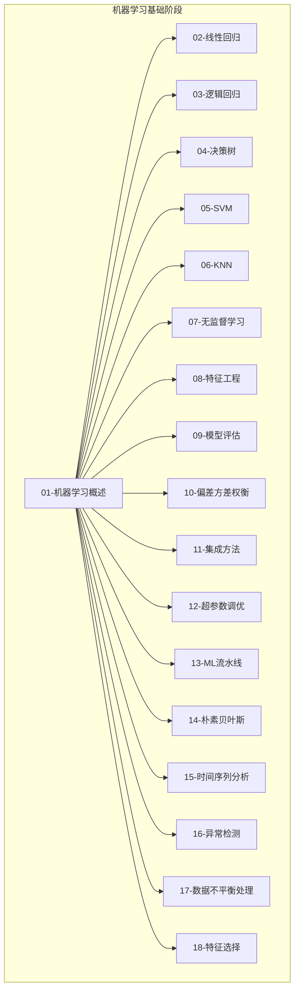
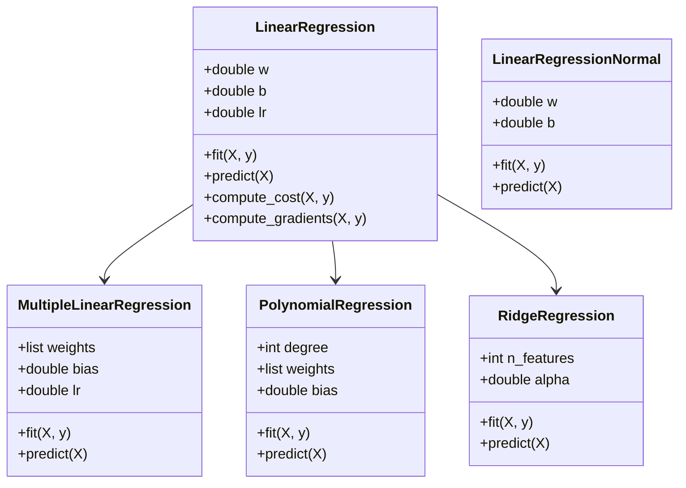
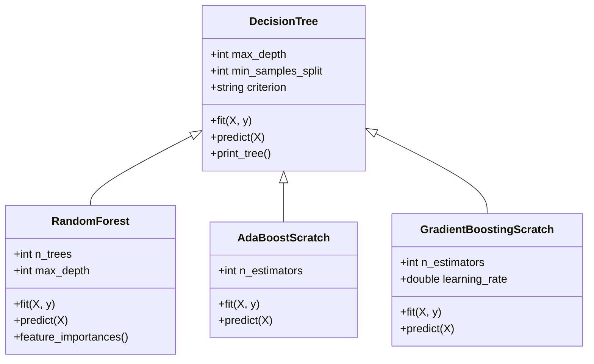
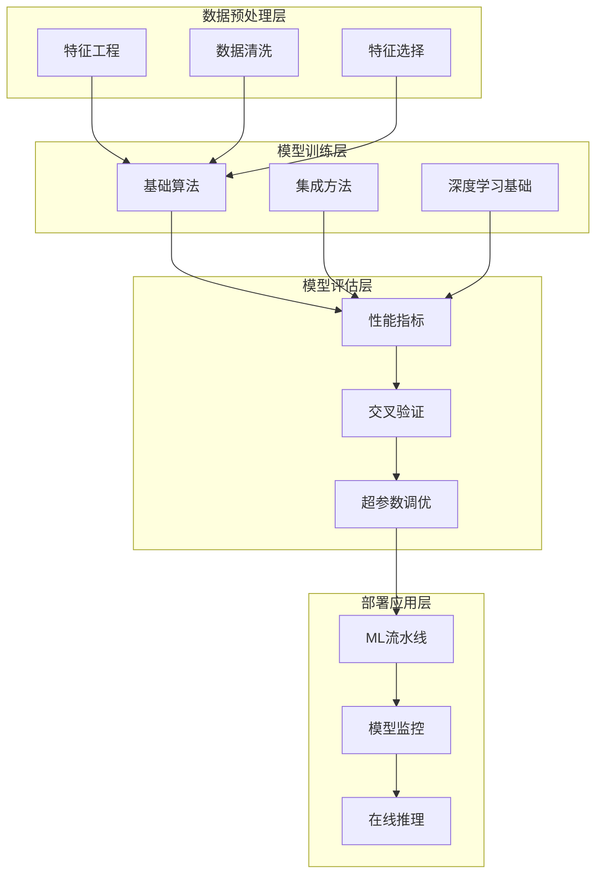
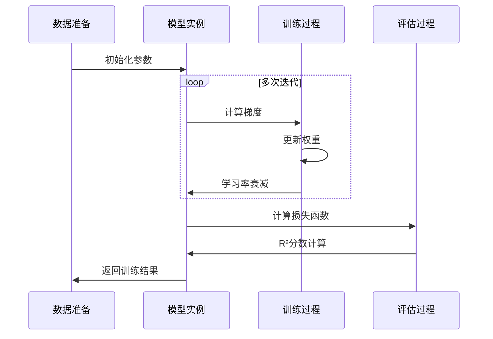
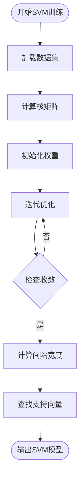
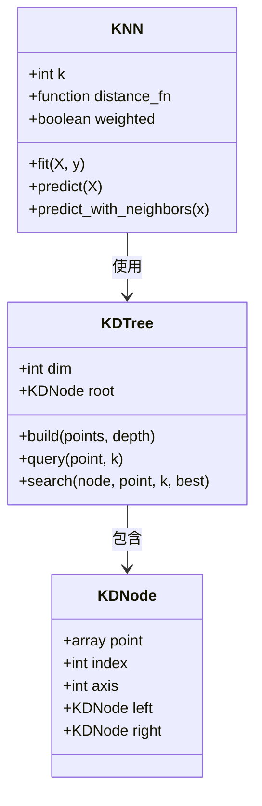
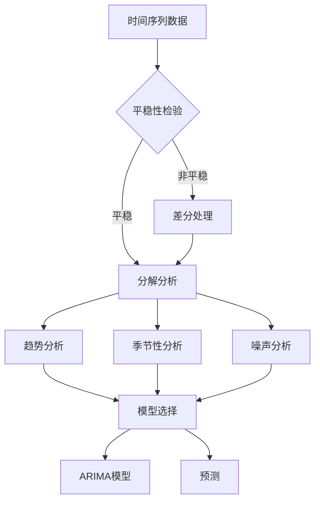
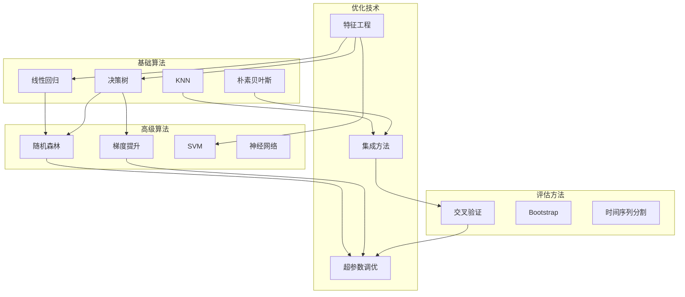
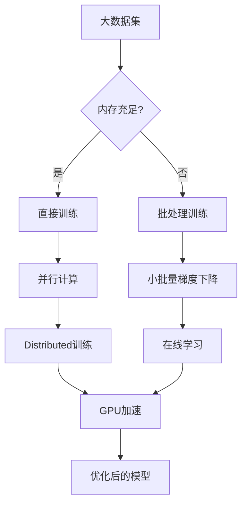

# 阶段2：机器学习基础

<cite>
**本文档引用的文件**
- [线性回归实现](file://phases/02-ml-fundamentals/02-linear-regression/code/linear_regression.py)
- [逻辑回归实现](file://phases/02-ml-fundamentals/03-logistic-regression/code/logistic_regression.py)
- [决策树实现](file://phases/02-ml-fundamentals/04-decision-trees/code/trees.py)
- [支持向量机实现](file://phases/02-ml-fundamentals/05-support-vector-machines/code/svm.py)
- [KNN与距离度量实现](file://phases/02-ml-fundamentals/06-knn-and-distances/code/knn.py)
- [无监督学习（聚类）实现](file://phases/02-ml-fundamentals/07-unsupervised-learning/code/clustering.py)
- [特征工程实现](file://phases/02-ml-fundamentals/08-feature-engineering/code/features.py)
- [模型评估实现](file://phases/02-ml-fundamentals/09-model-evaluation/code/evaluation.py)
- [偏差-方差权衡实现](file://phases/02-ml-fundamentals/10-bias-variance/code/bias_variance.py)
- [集成方法实现](file://phases/02-ml-fundamentals/11-ensemble-methods/code/ensembles.py)
- [超参数调优实现](file://phases/02-ml-fundamentals/12-hyperparameter-tuning/code/tuning.py)
- [机器学习流水线实现](file://phases/02-ml-fundamentals/13-ml-pipelines/code/pipeline.py)
- [朴素贝叶斯实现](file://phases/02-ml-fundamentals/14-naive-bayes/code/naive_bayes.py)
- [时间序列分析实现](file://phases/02-ml-fundamentals/15-time-series/code/time_series.py)
- [异常检测实现](file://phases/02-ml-fundamentals/16-anomaly-detection/code/anomaly_detection.py)
</cite>

## 目录
1. [引言](#引言)
2. [项目结构](#项目结构)
3. [核心组件](#核心组件)
4. [架构概览](#架构概览)
5. [详细组件分析](#详细组件分析)
6. [依赖关系分析](#依赖关系分析)
7. [性能考虑](#性能考虑)
8. [故障排除指南](#故障排除指南)
9. [结论](#结论)

## 引言

本阶段专注于机器学习的基础知识体系，涵盖从理论到实践的完整学习路径。通过深入分析18门核心课程，我们将建立扎实的机器学习基础，掌握各种算法的原理、适用场景和实现细节。

机器学习作为人工智能的核心技术，已经在图像识别、自然语言处理、推荐系统等领域取得了巨大成功。本阶段的学习将帮助我们理解这些成功的背后原理，并具备独立构建和优化机器学习模型的能力。

## 项目结构

该项目采用模块化设计，每个机器学习算法都包含独立的实现文件、文档和示例代码：



**图表来源**
- [线性回归实现:1-344](file://phases/02-ml-fundamentals/02-linear-regression/code/linear_regression.py#L1-L344)
- [逻辑回归实现:1-326](file://phases/02-ml-fundamentals/03-logistic-regression/code/logistic_regression.py#L1-L326)

**章节来源**
- [线性回归实现:1-344](file://phases/02-ml-fundamentals/02-linear-regression/code/linear_regression.py#L1-L344)
- [逻辑回归实现:1-326](file://phases/02-ml-fundamentals/03-logistic-regression/code/logistic_regression.py#L1-L326)

## 核心组件

### 线性回归家族

线性回归是机器学习最基础的算法之一，包含多种变体：



**图表来源**
- [线性回归实现:18-344](file://phases/02-ml-fundamentals/02-linear-regression/code/linear_regression.py#L18-L344)

### 决策树与集成学习

决策树提供了直观的可解释性，而集成方法则通过组合多个弱学习器来提升性能：



**图表来源**
- [决策树实现:75-653](file://phases/02-ml-fundamentals/04-decision-trees/code/trees.py#L75-L653)
- [集成方法实现:59-503](file://phases/02-ml-fundamentals/11-ensemble-methods/code/ensembles.py#L59-L503)

**章节来源**
- [决策树实现:1-653](file://phases/02-ml-fundamentals/04-decision-trees/code/trees.py#L1-L653)
- [集成方法实现:1-503](file://phases/02-ml-fundamentals/11-ensemble-methods/code/ensembles.py#L1-L503)

## 架构概览

整个机器学习基础阶段采用分层架构设计，从简单的线性模型到复杂的集成方法：



**图表来源**
- [特征工程实现:1-392](file://phases/02-ml-fundamentals/08-feature-engineering/code/features.py#L1-L392)
- [模型评估实现:1-462](file://phases/02-ml-fundamentals/09-model-evaluation/code/evaluation.py#L1-L462)

## 详细组件分析

### 线性回归：从梯度下降到正规化

线性回归作为机器学习的入门算法，展示了从简单到复杂的发展轨迹：



**图表来源**
- [线性回归实现:41-50](file://phases/02-ml-fundamentals/02-linear-regression/code/linear_regression.py#L41-L50)

线性回归的关键特性包括：
- **数学原理**：最小二乘法求解最优参数
- **实现细节**：批量梯度下降和随机梯度下降
- **扩展能力**：多项式回归和岭回归
- **评估指标**：均方误差、R²决定系数

**章节来源**
- [线性回归实现:1-344](file://phases/02-ml-fundamentals/02-linear-regression/code/linear_regression.py#L1-L344)

### 支持向量机：最大间隔分类

SVM通过寻找最大间隔超平面实现了强大的分类能力：



**图表来源**
- [支持向量机实现:62-111](file://phases/02-ml-fundamentals/05-support-vector-machines/code/svm.py#L62-L111)

SVM的核心优势：
- **稀疏性**：仅使用支持向量进行预测
- **核技巧**：处理非线性可分问题
- **正则化**：通过C参数控制模型复杂度
- **鲁棒性**：对异常值相对不敏感

**章节来源**
- [支持向量机实现:1-567](file://phases/02-ml-fundamentals/05-support-vector-machines/code/svm.py#L1-L567)

### K近邻：懒惰学习的代表

KNN展现了"学习"和"推理"分离的独特设计理念：



**图表来源**
- [KNN与距离度量实现:49-173](file://phases/02-ml-fundamentals/06-knn-and-distances/code/knn.py#L49-L173)

KNN的特点：
- **懒惰学习**：训练阶段只存储数据
- **参数选择**：K值和距离度量的选择
- **高效搜索**：KD树加速最近邻查询
- **适用场景**：小数据集和局部模式明显的问题

**章节来源**
- [KNN与距离度量实现:1-735](file://phases/02-ml-fundamentals/06-knn-and-distances/code/knn.py#L1-L735)

### 朴素贝叶斯：概率建模的经典

朴素贝叶斯通过贝叶斯定理实现了高效的分类：

```mermaid
graph LR
subgraph "文本分类流程"
A[文档预处理] --> B[特征提取]
B --> C[概率计算]
C --> D[类别预测]
end
subgraph "数学公式"
E[P(C|W) ∝ P(W|C) × P(C)]
F[P(W|C) = Π P(wi|C)]
end
C --> E
E --> F
F --> D
```

**图表来源**
- [朴素贝叶斯实现:4-46](file://phases/02-ml-fundamentals/14-naive-bayes/code/naive_bayes.py#L4-L46)

朴素贝叶斯的优势：
- **训练快速**：一次遍历即可完成参数估计
- **内存效率**：存储概率表而非原始数据
- **小样本友好**：拉普拉斯平滑解决零概率问题
- **多类别天然支持**：直接扩展到多分类问题

**章节来源**
- [朴素贝叶斯实现:1-345](file://phases/02-ml-fundamentals/14-naive-bayes/code/naive_bayes.py#L1-L345)

### 时间序列分析：时序数据的特殊性

时间序列分析需要考虑数据的时间依赖性和季节性特征：



**图表来源**
- [时间序列分析实现:36-57](file://phases/02-ml-fundamentals/15-time-series/code/time_series.py#L36-L57)

时间序列的关键技术：
- **平稳性检验**：滚动均值和滚动方差
- **自相关分析**：识别周期性模式
- **滞后特征**：利用历史值预测未来值
- **滚动验证**：避免未来信息泄露

**章节来源**
- [时间序列分析实现:1-353](file://phases/02-ml-fundamentals/15-time-series/code/time_series.py#L1-L353)

### 异常检测：识别少数异常

异常检测在网络安全、金融风控等领域具有重要应用价值：

```mermaid
graph TB
subgraph "异常检测方法"
A[Z-score方法]
B[IQR方法]
C[孤立森林]
end
subgraph "应用场景"
D[网络入侵检测]
E[欺诈检测]
F[设备故障预警]
end
A --> D
B --> E
C --> F
subgraph "评估指标"
G[精确率]
H[召回率]
I[F1分数]
J[Precision@K]
end
D --> G
E --> H
F --> I
G --> J
```

**图表来源**
- [异常检测实现:4-133](file://phases/02-ml-fundamentals/16-anomaly-detection/code/anomaly_detection.py#L4-L133)

异常检测的挑战：
- **数据不平衡**：正常样本远多于异常样本
- **特征空间复杂**：多维数据中的异常模式
- **阈值选择**：如何平衡误报和漏报
- **实时处理**：在线异常检测的需求

**章节来源**
- [异常检测实现:1-341](file://phases/02-ml-fundamentals/16-anomaly-detection/code/anomaly_detection.py#L1-L341)

## 依赖关系分析

机器学习算法之间存在复杂的依赖关系和相互影响：



**图表来源**
- [集成方法实现:196-272](file://phases/02-ml-fundamentals/11-ensemble-methods/code/ensembles.py#L196-L272)
- [超参数调优实现:123-141](file://phases/02-ml-fundamentals/12-hyperparameter-tuning/code/tuning.py#L123-L141)

**章节来源**
- [集成方法实现:1-503](file://phases/02-ml-fundamentals/11-ensemble-methods/code/ensembles.py#L1-L503)
- [超参数调优实现:1-573](file://phases/02-ml-fundamentals/12-hyperparameter-tuning/code/tuning.py#L1-L573)

## 性能考虑

### 计算复杂度对比

不同算法在训练和预测阶段的性能表现：

| 算法类型 | 训练复杂度 | 预测复杂度 | 内存需求 | 可解释性 |
|---------|-----------|-----------|----------|----------|
| 线性回归 | O(npd) | O(pd) | 低 | 高 |
| 决策树 | O(npd log n) | O(d log n) | 中等 | 高 |
| 随机森林 | O(ntpd log n) | O(ntd log n) | 高 | 中等 |
| SVM | O(n²p) 到 O(n³p) | O(dp) | 高 | 低 |
| KNN | O(1) | O(ndn) | 极高 | 低 |
| 朴素贝叶斯 | O(nd) | O(nd) | 低 | 中等 |

### 内存优化策略

针对大规模数据的内存优化方案：



## 故障排除指南

### 常见问题诊断

**过拟合问题**
- 现象：训练误差很小，测试误差很大
- 解决方案：增加正则化、简化模型、收集更多数据
- 检测方法：学习曲线分析、验证曲线分析

**欠拟合问题**
- 现象：训练和测试误差都很大
- 解决方案：增加模型复杂度、添加更多特征
- 检测方法：高偏差诊断、学习曲线分析

**数据质量问题**
- 现象：模型性能不稳定或出现异常
- 解决方案：数据清洗、异常值处理、特征标准化
- 检测方法：统计描述、可视化分析

**章节来源**
- [偏差-方差权衡实现:190-229](file://phases/02-ml-fundamentals/10-bias-variance/code/bias_variance.py#L190-L229)

## 结论

机器学习基础阶段为我们建立了坚实的理论和实践基础。通过系统学习这18门核心课程，我们不仅掌握了各种算法的原理和实现，更重要的是培养了以下能力：

1. **算法选择能力**：根据问题特点选择合适的算法
2. **模型调试能力**：识别和解决模型问题
3. **性能优化能力**：提升模型的准确性和效率
4. **工程实践能力**：构建可部署的机器学习系统

这些技能将为后续深入学习深度学习、强化学习等高级主题奠定坚实基础。建议在掌握理论的同时，多动手实践，通过实际项目来巩固所学知识。