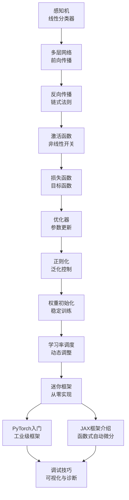
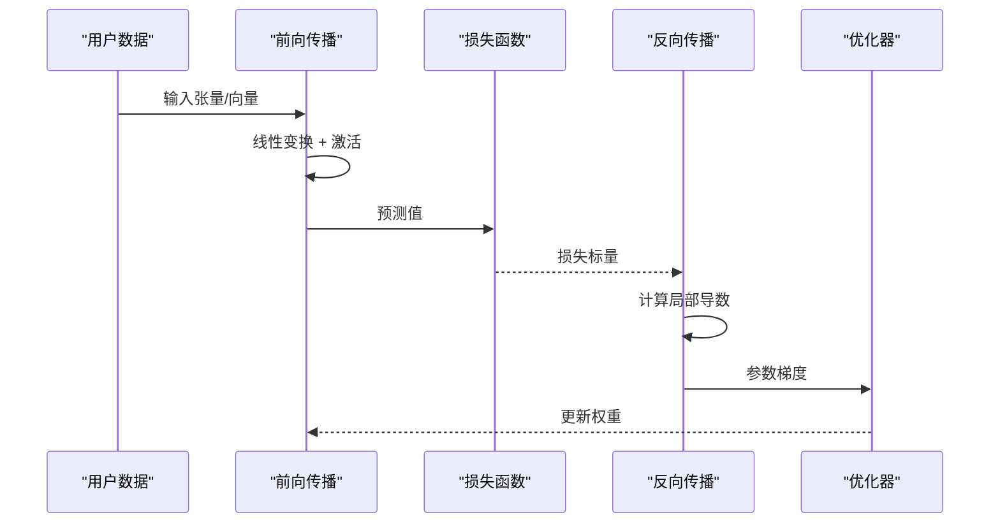
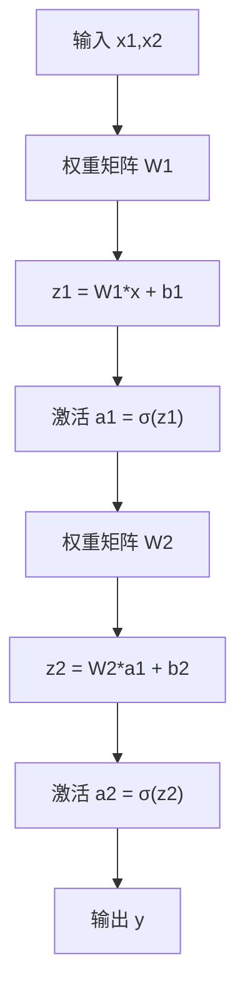
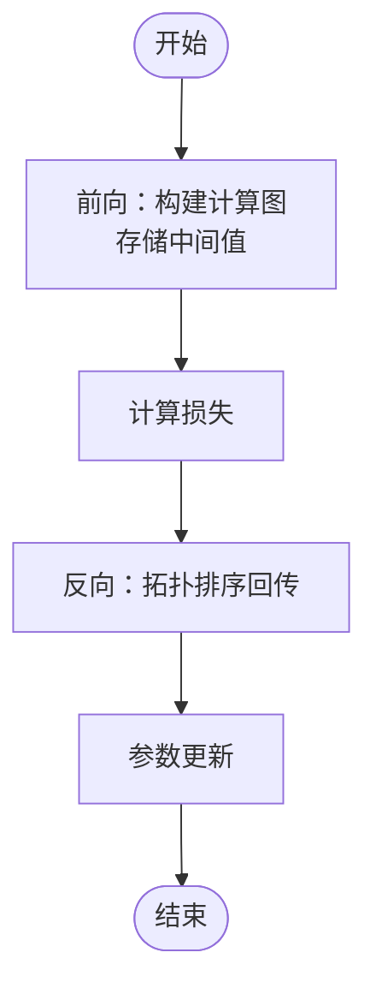
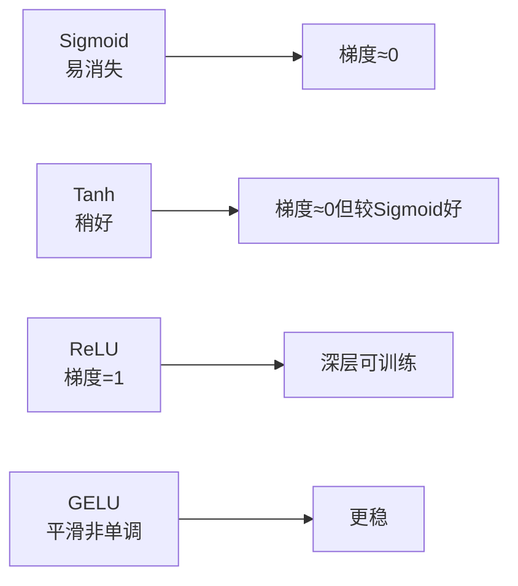
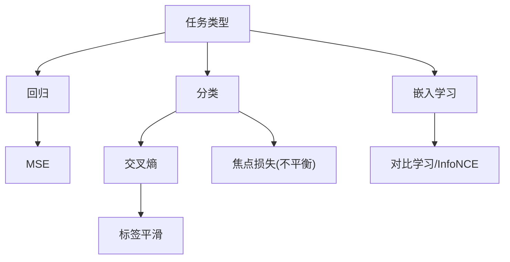
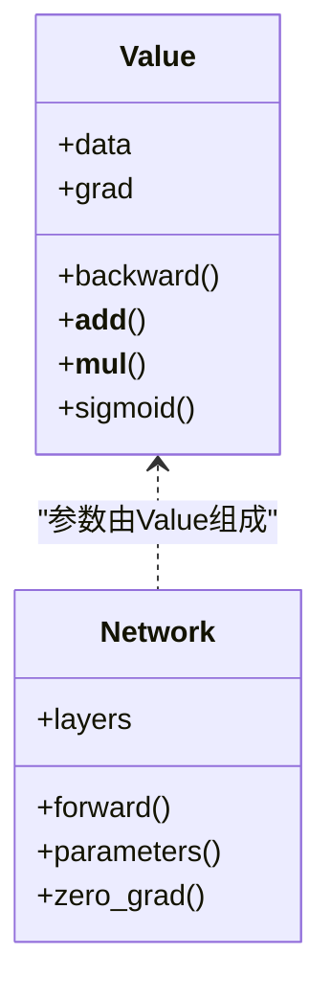
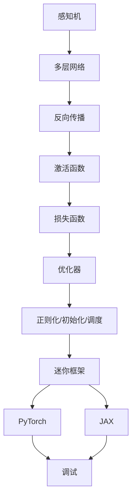

# 阶段3：深度学习核心

<cite>
**本文档引用的文件**
- [README.md](file://phases/03-deep-learning-core/README.md)
- [ROADMAP.md](file://ROADMAP.md)
- [01-感知机.md](file://phases/03-deep-learning-core/01-the-perceptron/docs/en.md)
- [02-多层网络.md](file://phases/03-deep-learning-core/02-multi-layer-networks/docs/en.md)
- [03-反向传播.md](file://phases/03-deep-learning-core/03-backpropagation/docs/en.md)
- [04-激活函数.md](file://phases/03-deep-learning-core/04-activation-functions/docs/en.md)
- [05-损失函数.md](file://phases/03-deep-learning-core/05-loss-functions/docs/en.md)
- [06-优化器.md](file://phases/03-deep-learning-core/06-optimizers/docs/en.md)
- [07-正则化.md](file://phases/03-deep-learning-core/07-regularization/docs/en.md)
- [08-权重初始化.md](file://phases/03-deep-learning-core/08-weight-initialization/docs/en.md)
- [09-学习率调度.md](file://phases/03-deep-learning-core/09-learning-rate-schedules/docs/en.md)
- [10-迷你框架.md](file://phases/03-deep-learning-core/10-mini-framework/docs/en.md)
- [11-PyTorch入门.md](file://phases/03-deep-learning-core/11-intro-to-pytorch/docs/en.md)
- [12-JAX框架介绍.md](file://phases/03-deep-learning-core/12-intro-to-jax/docs/en.md)
- [13-神经网络调试.md](file://phases/03-deep-learning-core/13-debugging-neural-networks/docs/en.md)
</cite>

## 目录
1. [引言](#引言)
2. [项目结构](#项目结构)
3. [核心组件](#核心组件)
4. [架构总览](#架构总览)
5. [详细组件分析](#详细组件分析)
6. [依赖关系分析](#依赖关系分析)
7. [性能考虑](#性能考虑)
8. [故障排查指南](#故障排查指南)
9. [结论](#结论)
10. [附录](#附录)

## 引言
本阶段聚焦“深度学习核心”，从最基础的感知机出发，逐步构建多层网络、理解前向传播与反向传播、掌握激活函数、损失函数、优化器、正则化、权重初始化、学习率调度等关键要素，并最终完成一个可运行的迷你框架，同时引入PyTorch与JAX两大主流生态。通过“从零实现”的方式，帮助读者建立对神经网络训练全流程的系统性认知。

## 项目结构
- 深度学习核心阶段包含13门核心课程，覆盖从理论到实践的完整闭环：
  - 感知机与线性可分问题
  - 多层网络与前向传播
  - 反向传播与自动微分
  - 激活函数与梯度流动
  - 损失函数与任务匹配
  - 优化器与参数更新
  - 正则化与泛化能力
  - 权重初始化与训练稳定性
  - 学习率调度与收敛加速
  - 迷你框架：从Value节点到训练循环
  - PyTorch入门与模块化使用
  - JAX框架介绍与函数式编程范式
  - 神经网络调试技巧与可视化

图示来源
- [01-感知机.md:1-383](file://phases/03-deep-learning-core/01-the-perceptron/docs/en.md#L1-L383)
- [02-多层网络.md:1-362](file://phases/03-deep-learning-core/02-multi-layer-networks/docs/en.md#L1-L362)
- [03-反向传播.md:1-471](file://phases/03-deep-learning-core/03-backpropagation/docs/en.md#L1-L471)
- [04-激活函数.md:1-537](file://phases/03-deep-learning-core/04-activation-functions/docs/en.md#L1-L537)
- [05-损失函数.md:1-459](file://phases/03-deep-learning-core/05-loss-functions/docs/en.md#L1-L459)
- [06-优化器.md:1-458](file://phases/03-deep-learning-core/06-optimizers/docs/en.md#L1-L458)
- [07-正则化.md:1-200](file://phases/03-deep-learning-core/07-regularization/docs/en.md#L1-L200)
- [08-权重初始化.md:1-200](file://phases/03-deep-learning-core/08-weight-initialization/docs/en.md#L1-L200)
- [09-学习率调度.md:1-200](file://phases/03-deep-learning-core/09-learning-rate-schedules/docs/en.md#L1-L200)
- [10-迷你框架.md:1-200](file://phases/03-deep-learning-core/10-mini-framework/docs/en.md#L1-L200)
- [11-PyTorch入门.md:1-200](file://phases/03-deep-learning-core/11-intro-to-pytorch/docs/en.md#L1-L200)
- [12-JAX框架介绍.md:1-200](file://phases/03-deep-learning-core/12-intro-to-jax/docs/en.md#L1-L200)
- [13-神经网络调试.md:1-200](file://phases/03-deep-learning-core/13-debugging-neural-networks/docs/en.md#L1-L200)

章节来源
- [README.md:1-6](file://phases/03-deep-learning-core/README.md#L1-L6)
- [ROADMAP.md:78-95](file://ROADMAP.md#L78-L95)

## 核心组件
- 感知机与单层决策边界：理解线性可分性与XOR难题，为多层网络铺路。
- 多层网络与前向传播：矩阵乘法、维度追踪、隐藏状态与组合性。
- 反向传播与自动微分：构建计算图、链式法则、梯度回传与内存-计算权衡。
- 激活函数：Sigmoid/Tanh/ReLU/GELU/Swish/Softmax的数学性质与梯度流动。
- 损失函数：MSE、交叉熵、对比学习（InfoNCE）、焦点损失等的任务适配。
- 优化器：SGD、动量、Adam/AdamW的直觉与实现要点、权重衰减差异。
- 正则化：Dropout、权重衰减、批归一化与训练稳定性。
- 权重初始化：Xavier/Glorot、He初始化与深层网络饱和问题。
- 学习率调度：warmup、余弦退火、阶梯衰减与收敛加速。
- 迷你框架：Value节点、autograd引擎、训练循环与参数管理。
- 框架使用：PyTorch模块化与JAX函数式自动微分范式。
- 调试技巧：梯度可视化、发散/消失检测、中间表示分析。

章节来源
- [01-感知机.md:10-383](file://phases/03-deep-learning-core/01-the-perceptron/docs/en.md#L10-L383)
- [02-多层网络.md:10-362](file://phases/03-deep-learning-core/02-multi-layer-networks/docs/en.md#L10-L362)
- [03-反向传播.md:10-471](file://phases/03-deep-learning-core/03-backpropagation/docs/en.md#L10-L471)
- [04-激活函数.md:10-537](file://phases/03-deep-learning-core/04-activation-functions/docs/en.md#L10-L537)
- [05-损失函数.md:10-459](file://phases/03-deep-learning-core/05-loss-functions/docs/en.md#L10-L459)
- [06-优化器.md:10-458](file://phases/03-deep-learning-core/06-optimizers/docs/en.md#L10-L458)
- [07-正则化.md:1-200](file://phases/03-deep-learning-core/07-regularization/docs/en.md#L1-L200)
- [08-权重初始化.md:1-200](file://phases/03-deep-learning-core/08-weight-initialization/docs/en.md#L1-L200)
- [09-学习率调度.md:1-200](file://phases/03-deep-learning-core/09-learning-rate-schedules/docs/en.md#L1-L200)
- [10-迷你框架.md:1-200](file://phases/03-deep-learning-core/10-mini-framework/docs/en.md#L1-L200)
- [11-PyTorch入门.md:1-200](file://phases/03-deep-learning-core/11-intro-to-pytorch/docs/en.md#L1-L200)
- [12-JAX框架介绍.md:1-200](file://phases/03-deep-learning-core/12-intro-to-jax/docs/en.md#L1-L200)
- [13-神经网络调试.md:1-200](file://phases/03-deep-learning-core/13-debugging-neural-networks/docs/en.md#L1-L200)

## 架构总览
下图展示了从输入到输出的端到端流程，以及反向传播如何在计算图上回传梯度：

图示来源
- [02-多层网络.md:84-107](file://phases/03-deep-learning-core/02-multi-layer-networks/docs/en.md#L84-L107)
- [03-反向传播.md:33-71](file://phases/03-deep-learning-core/03-backpropagation/docs/en.md#L33-L71)
- [05-损失函数.md:29-47](file://phases/03-deep-learning-core/05-loss-functions/docs/en.md#L29-L47)

## 详细组件分析

### 组件A：感知机与多层网络
- 感知机是线性分类器，激活为阶跃函数，仅能解决线性可分问题；XOR不可分证明了单层的局限。
- 多层网络通过堆叠非线性激活实现曲线决策边界，前向传播由矩阵乘法与偏置加和构成，维度需严格匹配。
- 手工调参的两层网络可解XOR；随机权重的圆内/圆外分类展示了前向传播的计算过程。

图示来源
- [01-感知机.md:29-46](file://phases/03-deep-learning-core/01-the-perceptron/docs/en.md#L29-L46)
- [02-多层网络.md:88-98](file://phases/03-deep-learning-core/02-multi-layer-networks/docs/en.md#L88-L98)

章节来源
- [01-感知机.md:85-113](file://phases/03-deep-learning-core/01-the-perceptron/docs/en.md#L85-L113)
- [02-多层网络.md:109-122](file://phases/03-deep-learning-core/02-multi-layer-networks/docs/en.md#L109-L122)

### 组件B：反向传播与自动微分
- 以计算图为载体，前向存储中间值，后向按拓扑序回传梯度。
- 借助链式法则，逐节点累积梯度，形成完整的梯度流。
- 深层Sigmoid易导致梯度消失，需要通过ReLU/GELU等激活缓解。

图示来源
- [03-反向传播.md:33-71](file://phases/03-deep-learning-core/03-backpropagation/docs/en.md#L33-L71)
- [03-反向传播.md:89-101](file://phases/03-deep-learning-core/03-backpropagation/docs/en.md#L89-L101)

章节来源
- [03-反向传播.md:103-133](file://phases/03-deep-learning-core/03-backpropagation/docs/en.md#L103-L133)

### 组件C：激活函数与梯度健康
- Sigmoid/Tanh存在饱和区，深层网络梯度易消失；ReLU/GELU等提供更稳定的梯度流。
- 不同激活在深层网络中的梯度幅度差异显著，应结合任务选择默认激活（Transformer用GELU，CNN用ReLU）。

图示来源
- [04-激活函数.md:55-77](file://phases/03-deep-learning-core/04-activation-functions/docs/en.md#L55-L77)
- [04-激活函数.md:81-97](file://phases/03-deep-learning-core/04-activation-functions/docs/en.md#L81-L97)
- [04-激活函数.md:99-116](file://phases/03-deep-learning-core/04-activation-functions/docs/en.md#L99-L116)
- [04-激活函数.md:129-143](file://phases/03-deep-learning-core/04-activation-functions/docs/en.md#L129-L143)

章节来源
- [04-激活函数.md:157-166](file://phases/03-deep-learning-core/04-activation-functions/docs/en.md#L157-L166)

### 组件D：损失函数与任务匹配
- MSE适用于回归；交叉熵适用于分类；对比学习（InfoNCE）用于自监督表征学习。
- 标签平滑可抑制过拟合与过自信；焦点损失关注难样本。

图示来源
- [05-损失函数.md:154-174](file://phases/03-deep-learning-core/05-loss-functions/docs/en.md#L154-L174)
- [05-损失函数.md:101-112](file://phases/03-deep-learning-core/05-loss-functions/docs/en.md#L101-L112)
- [05-损失函数.md:139-152](file://phases/03-deep-learning-core/05-loss-functions/docs/en.md#L139-L152)

章节来源
- [05-损失函数.md:176-188](file://phases/03-deep-learning-core/05-loss-functions/docs/en.md#L176-L188)

### 组件E：优化器与权重衰减
- SGD/动量：适合CNN/ResNet；Adam/AdamW：现代默认（尤其是Transformer/Large模型）。
- AdamW将权重衰减与梯度解耦，提升泛化能力。
- 学习率调度（warmup+余弦退火）是大规模训练的关键。

图示来源
- [06-优化器.md:141-166](file://phases/03-deep-learning-core/06-optimizers/docs/en.md#L141-L166)
- [06-优化器.md:101-115](file://phases/03-deep-learning-core/06-optimizers/docs/en.md#L101-L115)
- [09-学习率调度.md:1-200](file://phases/03-deep-learning-core/09-learning-rate-schedules/docs/en.md#L1-L200)

章节来源
- [06-优化器.md:117-140](file://phases/03-deep-learning-core/06-optimizers/docs/en.md#L117-L140)

### 组件F：正则化与初始化
- 正则化：Dropout随机失活、权重衰减L2、批归一化BN稳定训练。
- 初始化：Xavier/Glorot适配tanh，He初始化适配ReLU，缓解深层网络饱和与梯度爆炸/消失。

章节来源
- [07-正则化.md:1-200](file://phases/03-deep-learning-core/07-regularization/docs/en.md#L1-L200)
- [08-权重初始化.md:1-200](file://phases/03-deep-learning-core/08-weight-initialization/docs/en.md#L1-L200)

### 组件G：迷你框架与工业框架
- 迷你框架：Value节点、运算符重载、拓扑排序、backward()实现，完整复刻autograd核心。
- 工业框架：PyTorch模块化、JAX函数式自动微分，强调高效性与可扩展性。

图示来源
- [10-迷你框架.md:1-200](file://phases/03-deep-learning-core/10-mini-framework/docs/en.md#L1-L200)
- [03-反向传播.md:141-244](file://phases/03-deep-learning-core/03-backpropagation/docs/en.md#L141-L244)

章节来源
- [10-迷你框架.md:1-200](file://phases/03-deep-learning-core/10-mini-framework/docs/en.md#L1-L200)
- [11-PyTorch入门.md:1-200](file://phases/03-deep-learning-core/11-intro-to-pytorch/docs/en.md#L1-L200)
- [12-JAX框架介绍.md:1-200](file://phases/03-deep-learning-core/12-intro-to-jax/docs/en.md#L1-L200)

### 组件H：神经网络调试技巧
- 关注梯度范数、激活分布、中间特征图；识别梯度消失/爆炸与死神经元。
- 使用可视化工具与日志记录，定位训练异常。

章节来源
- [13-神经网络调试.md:1-200](file://phases/03-deep-learning-core/13-debugging-neural-networks/docs/en.md#L1-L200)

## 依赖关系分析
- 课程依赖：感知机 → 多层网络 → 反向传播 → 激活函数 → 损失函数 → 优化器 → 正则化/初始化/调度 → 迷你框架 → 框架使用 → 调试。
- 实现依赖：Value节点与autograd是反向传播的基石；不同激活/损失/优化器在训练循环中组合使用。

图示来源
- [ROADMAP.md:78-95](file://ROADMAP.md#L78-L95)

章节来源
- [ROADMAP.md:78-95](file://ROADMAP.md#L78-L95)

## 性能考虑
- 深层网络中优先选择ReLU/GELU等避免梯度消失；合理初始化降低饱和风险。
- 优化器选择与学习率调度直接影响收敛速度与泛化；AdamW在大模型中通常优于Adam。
- 正则化与早停策略平衡过拟合；梯度裁剪防止爆炸更新。
- 批大小与并行策略影响吞吐与收敛稳定性。

## 故障排查指南
- 梯度消失/爆炸：检查激活函数、初始化与学习率；使用梯度裁剪与可视化。
- 死神经元：更换为GELU或带小斜率的激活；监控每层激活比例。
- 损失不下降：确认损失函数与标签是否匹配；检查学习率与优化器设置。
- 发散/NaN：降低学习率、启用梯度裁剪、检查数值稳定性（如对数项截断）。

章节来源
- [03-反向传播.md:89-101](file://phases/03-deep-learning-core/03-backpropagation/docs/en.md#L89-L101)
- [04-激活函数.md:118-127](file://phases/03-deep-learning-core/04-activation-functions/docs/en.md#L118-L127)
- [05-损失函数.md:21-27](file://phases/03-deep-learning-core/05-loss-functions/docs/en.md#L21-L27)

## 结论
本阶段通过“从零实现”的方式，系统串联了深度学习的核心知识与工程实践。从感知机到多层网络，从反向传播到优化器，再到正则化、初始化与学习率调度，最终以迷你框架贯通理论与实践，并引入PyTorch与JAX两大生态。建议在每个环节都动手实现对应组件，配合可视化与调试技巧，形成对训练全流程的深刻理解。

## 附录
- 术语速查：激活函数、损失函数、优化器、正则化、初始化、学习率调度、调试方法等。
- 推荐阅读：各章节末尾的参考文献与延伸资源，便于进一步深造。