# 阶段4：计算机视觉

<cite>
**本文档引用的文件**
- [计算机视觉阶段总览](file://ROADMAP.md)
- [图像基础](file://phases/04-computer-vision/01-image-fundamentals/docs/en.md)
- [卷积实现（从零开始）](file://phases/04-computer-vision/02-convolutions-from-scratch/docs/en.md)
- [CNN架构演进（LeNet到ResNet）](file://phases/04-computer-vision/03-cnns-lenet-to-resnet/docs/en.md)
- [图像分类](file://phases/04-computer-vision/04-image-classification/docs/en.md)
- [迁移学习与微调](file://phases/04-computer-vision/05-transfer-learning/docs/en.md)
- [目标检测YOLO（从零开始）](file://phases/04-computer-vision/06-object-detection-yolo/docs/en.md)
- [语义分割U-Net](file://phases/04-computer-vision/07-semantic-segmentation-unet/docs/en.md)
- [实例分割Mask R-CNN](file://phases/04-computer-vision/08-instance-segmentation-mask-rcnn/docs/en.md)
- [图像生成GAN](file://phases/04-computer-vision/09-image-generation-gans/docs/en.md)
- [图像生成扩散模型](file://phases/04-computer-vision/10-image-generation-diffusion/docs/en.md)
- [稳定扩散（Stable Diffusion）](file://phases/04-computer-vision/11-stable-diffusion/docs/en.md)
- [视频理解](file://phases/04-computer-vision/12-video-understanding/docs/en.md)
- [3D视觉NeRF](file://phases/04-computer-vision/13-3d-vision-nerf/docs/en.md)
- [视觉Transformer](file://phases/04-computer-vision/14-vision-transformers/docs/en.md)
- [实时边缘推理](file://phases/04-computer-vision/15-real-time-edge/docs/en.md)
- [视觉管道综合项目](file://phases/04-computer-vision/16-vision-pipeline-capstone/docs/en.md)
- [自监督视觉](file://phases/04-computer-vision/17-self-supervised-vision/docs/en.md)
- [开放词汇CLIP](file://phases/04-computer-vision/18-open-vocab-clip/docs/en.md)
- [OCR与文档理解](file://phases/04-computer-vision/19-ocr-document-understanding/docs/en.md)
- [图像检索与度量学习](file://phases/04-computer-vision/20-image-retrieval-metric/docs/en.md)
- [关键点与姿态估计](file://phases/04-computer-vision/21-keypoint-pose/docs/en.md)
- [3D高斯点阵](file://phases/04-computer-vision/22-3d-gaussian-splatting/docs/en.md)
- [扩散Transformer与修正流](file://phases/04-computer-vision/23-diffusion-transformers-rectified-flow/docs/en.md)
- [SAM3开放词汇分割](file://phases/04-computer-vision/24-sam3-open-vocab-segmentation/docs/en.md)
- [视觉语言模型](file://phases/04-computer-vision/25-vision-language-models/docs/en.md)
- [单目深度估计](file://phases/04-computer-vision/26-monocular-depth/docs/en.md)
- [多目标跟踪](file://phases/04-computer-vision/27-multi-object-tracking/docs/en.md)
- [世界模型与视频扩散](file://phases/04-computer-vision/28-world-models-video-diffusion/docs/en.md)
</cite>

## 目录
1. [引言](#引言)
2. [项目结构](#项目结构)
3. [核心组件](#核心组件)
4. [架构总览](#架构总览)
5. [详细组件分析](#详细组件分析)
6. [依赖关系分析](#依赖关系分析)
7. [性能考量](#性能考量)
8. [故障排查指南](#故障排查指南)
9. [结论](#结论)
10. [附录](#附录)

## 引言
本阶段系统性覆盖计算机视觉从“像素到理解”的完整技术栈，包含图像基础、卷积实现、CNN架构演进、图像分类、迁移学习、目标检测YOLO、语义分割U-Net、实例分割Mask R-CNN、图像生成（GAN、扩散模型）、稳定扩散（Stable Diffusion）、视频理解、3D视觉（NeRF）、视觉Transformer、实时边缘推理、视觉管道综合项目、自监督视觉、开放词汇CLIP、OCR与文档理解、图像检索与度量学习、关键点与姿态估计、3D高斯点阵、扩散Transformer与修正流、SAM3开放词汇分割、视觉语言模型、单目深度估计、多目标跟踪、世界模型与视频扩散等28门核心课程。每门课程均提供清晰的学习目标、概念讲解、动手实践与工程化应用建议，帮助读者建立可迁移的工程能力。

## 项目结构
计算机视觉阶段位于仓库第四阶段，课程以“主题-任务”组织，每个课程包含：
- 文档：英文版概念与实践说明
- 代码：最小可运行示例或可扩展骨架
- 输出：可复用提示词与技能清单，便于团队协作与质量审计

```mermaid
graph TB
A["阶段4：计算机视觉<br/>ROADMAP.md"] --> B["图像基础"]
A --> C["卷积实现从零开始"]
A --> D["CNN架构演进LeNet到ResNet"]
A --> E["图像分类"]
A --> F["迁移学习与微调"]
A --> G["目标检测YOLO从零开始"]
A --> H["语义分割U-Net"]
A --> I["实例分割Mask R-CNN"]
A --> J["图像生成GAN"]
A --> K["图像生成扩散模型"]
A --> L["稳定扩散Stable Diffusion"]
A --> M["视频理解"]
A --> N["3D视觉NeRF"]
A --> O["视觉Transformer"]
A --> P["实时边缘推理"]
A --> Q["视觉管道综合项目"]
A --> R["自监督视觉"]
A --> S["开放词汇CLIP"]
A --> T["OCR与文档理解"]
A --> U["图像检索与度量学习"]
A --> V["关键点与姿态估计"]
A --> W["3D高斯点阵"]
A --> X["扩散Transformer与修正流"]
A --> Y["SAM3开放词汇分割"]
A --> Z["视觉语言模型"]
A --> AA["单目深度估计"]
A --> AB["多目标跟踪"]
A --> AC["世界模型与视频扩散"]
```

图表来源
- [计算机视觉阶段总览](file://ROADMAP.md)

章节来源
- [计算机视觉阶段总览:96-127](file://ROADMAP.md#L96-L127)

## 核心组件
本阶段的核心知识模块围绕“数据预处理—特征提取—任务头—评估与部署”展开，强调工程可复现性与可诊断性。以下为关键构件与职责：
- 图像基础：像素、通道、颜色空间、布局、归一化与标准化、重采样与插值
- 卷积实现：滑窗、共享权重、im2col、感受野、输出尺寸计算
- CNN架构：LeNet、AlexNet、VGG、Inception、ResNet；残差连接与退化问题
- 分类流水线：数据加载、增强、损失、优化器、调度器、评估指标
- 迁移学习：特征提取、渐进解冻、判别式学习率、BN统计漂移
- 检测：网格与锚框、回归与分类、对象性得分、NMS、损失分解
- 分割：U-Net编码器-解码器+跳跃连接、Dice损失、IoU/Dice指标
- 生成：GAN对抗博弈、稳定性技巧；扩散模型噪声计划、去噪预测、采样策略
- 多模态：CLIP对比学习、视觉-语言对齐、检索与零样本
- 视频/3D/关键点/深度/跟踪/世界模型：时序建模、体积表示、几何约束、轨迹管理

章节来源
- [图像基础:10-23](file://phases/04-computer-vision/01-image-fundamentals/docs/en.md#L10-L23)
- [卷积实现（从零开始）:10-23](file://phases/04-computer-vision/02-convolutions-from-scratch/docs/en.md#L10-L23)
- [CNN架构演进（LeNet到ResNet）:17-36](file://phases/04-computer-vision/03-cnns-lenet-to-resnet/docs/en.md#L17-L36)
- [图像分类:17-24](file://phases/04-computer-vision/04-image-classification/docs/en.md#L17-L24)
- [迁移学习与微调:17-24](file://phases/04-computer-vision/05-transfer-learning/docs/en.md#L17-L24)
- [目标检测YOLO（从零开始）:17-24](file://phases/04-computer-vision/06-object-detection-yolo/docs/en.md#L17-L24)
- [语义分割U-Net:17-24](file://phases/04-computer-vision/07-semantic-segmentation-unet/docs/en.md#L17-L24)
- [图像生成GAN:17-24](file://phases/04-computer-vision/09-image-generation-gans/docs/en.md#L17-L24)
- [图像生成扩散模型:17-24](file://phases/04-computer-vision/10-image-generation-diffusion/docs/en.md#L17-L24)
- [视觉语言模型](file://phases/04-computer-vision/25-vision-language-models/docs/en.md)

## 架构总览
下图展示从“像素到理解”的端到端路径：输入图像经由骨干网络提取层次化特征，再接入任务特定头部完成分类、检测、分割、生成等任务，并通过评估指标与可视化工具进行诊断与优化。

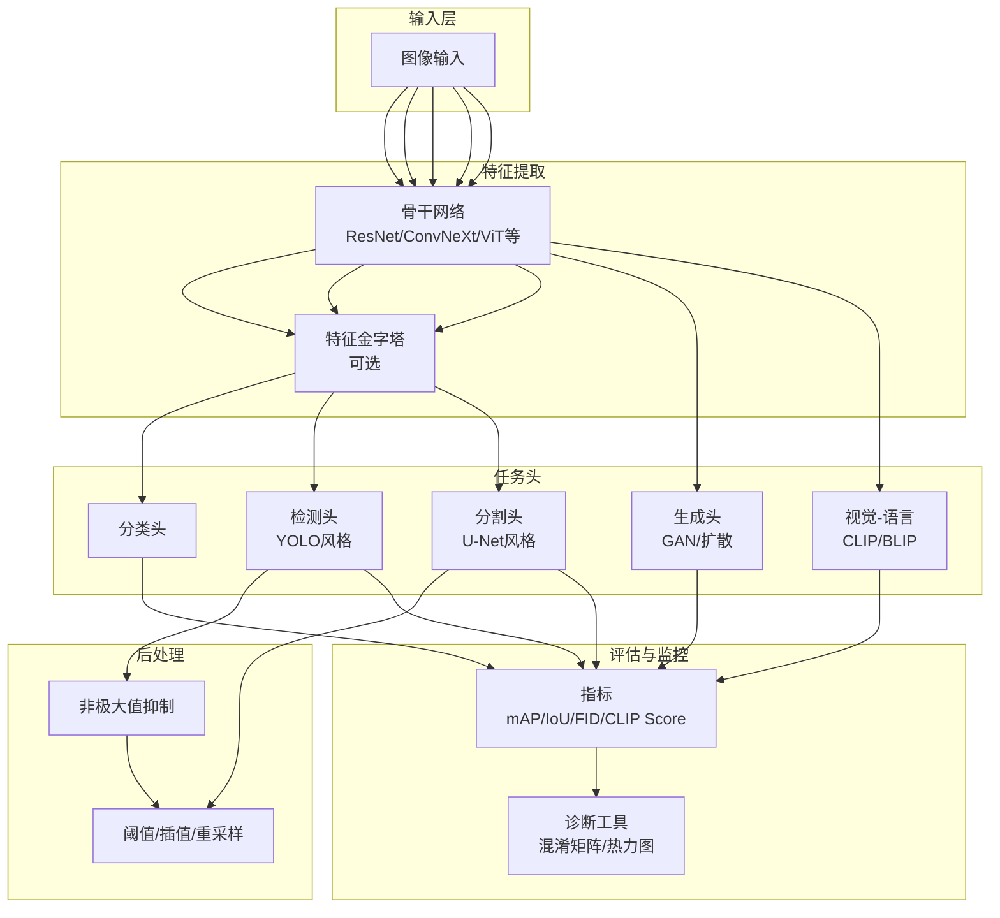

图表来源
- [图像分类:29-47](file://phases/04-computer-vision/04-image-classification/docs/en.md#L29-L47)
- [目标检测YOLO（从零开始）:31-45](file://phases/04-computer-vision/06-object-detection-yolo/docs/en.md#L31-L45)
- [语义分割U-Net:48-75](file://phases/04-computer-vision/07-semantic-segmentation-unet/docs/en.md#L48-L75)
- [图像生成扩散模型:59-75](file://phases/04-computer-vision/10-image-generation-diffusion/docs/en.md#L59-L75)
- [视觉语言模型](file://phases/04-computer-vision/25-vision-language-models/docs/en.md)

## 详细组件分析

### 图像基础
- 关键点：像素采样与量化、颜色空间（RGB/HSL/YCbCr）、布局（HWC/CHW）、数据类型（uint8/float32）、归一化与标准化、重采样与插值
- 工程要点：预处理管线必须可逆且与训练分布一致；错误的布局或标准化是“静默失败”的首要原因
- 实践：实现从原始字节到标准张量的完整管线，验证反变换一致性

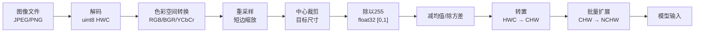

图表来源
- [图像基础:31-47](file://phases/04-computer-vision/01-image-fundamentals/docs/en.md#L31-L47)

章节来源
- [图像基础:10-23](file://phases/04-computer-vision/01-image-fundamentals/docs/en.md#L10-L23)
- [图像基础:205-327](file://phases/04-computer-vision/01-image-fundamentals/docs/en.md#L205-L327)

### 卷积实现（从零开始）
- 关键点：共享权重、局部性、滑窗、im2col、感受野、输出尺寸公式
- 工程要点：先实现嵌套循环版本校验正确性，再用im2col替换为向量化实现
- 实践：手写核设计（边缘、模糊、锐化、Sobel），观察激活响应

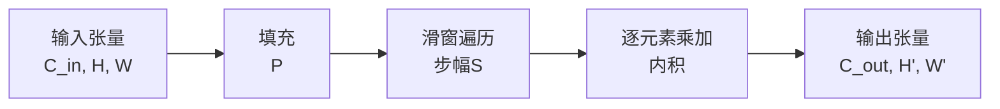

图表来源
- [卷积实现（从零开始）:31-49](file://phases/04-computer-vision/02-convolutions-from-scratch/docs/en.md#L31-L49)

章节来源
- [卷积实现（从零开始）:73-91](file://phases/04-computer-vision/02-convolutions-from-scratch/docs/en.md#L73-L91)
- [卷积实现（从零开始）:151-167](file://phases/04-computer-vision/02-convolutions-from-scratch/docs/en.md#L151-L167)

### CNN架构演进（LeNet到ResNet）
- 关键点：四次架构跃迁（LeNet→AlexNet→VGG→Inception→ResNet），残差连接解决退化问题
- 工程要点：理解每一代的单一新思想；掌握残差块与瓶颈块的结构差异
- 实践：实现LeNet-5、VGG块、ResNet BasicBlock与Bottleneck，比较参数效率与精度

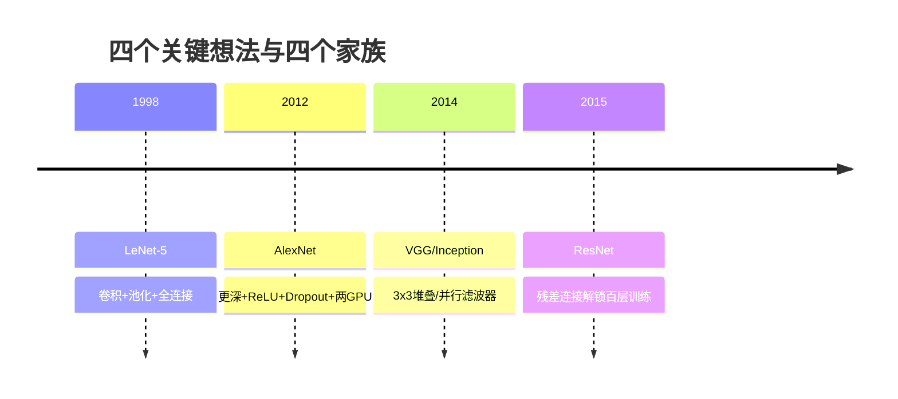

图表来源
- [CNN架构演进（LeNet到ResNet）:27-34](file://phases/04-computer-vision/03-cnns-lenet-to-resnet/docs/en.md#L27-L34)

章节来源
- [CNN架构演进（LeNet到ResNet）:109-128](file://phases/04-computer-vision/03-cnns-lenet-to-resnet/docs/en.md#L109-L128)
- [CNN架构演进（LeNet到ResNet）:239-266](file://phases/04-computer-vision/03-cnns-lenet-to-resnet/docs/en.md#L239-L266)

### 图像分类
- 关键点：分类即从像素到类别概率分布；损失、增强、评估指标缺一不可
- 工程要点：交叉熵直接作用于logits；混合增强（mixup、cutout、标签平滑）显著提升鲁棒性
- 实践：构建从零到一的分类流水线，合成数据集验证；使用混淆矩阵与各类指标诊断

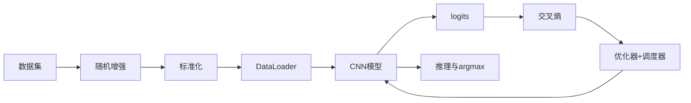

图表来源
- [图像分类:29-47](file://phases/04-computer-vision/04-image-classification/docs/en.md#L29-L47)

章节来源
- [图像分类:103-114](file://phases/04-computer-vision/04-image-classification/docs/en.md#L103-L114)
- [图像分类:116-118](file://phases/04-computer-vision/04-image-classification/docs/en.md#L116-L118)

### 迁移学习与微调
- 关键点：特征提取与端到端微调的选择依据；判别式学习率与BN统计漂移
- 工程要点：冻结骨干+训练头部作为基线；渐进解冻与分阶段学习率；小数据集优先冻结BN
- 实践：线性探测准确率与微调准确率双轨评估；针对不同域选择合适策略

章节来源
- [迁移学习与微调:27-56](file://phases/04-computer-vision/05-transfer-learning/docs/en.md#L27-L56)
- [迁移学习与微调:109-117](file://phases/04-computer-vision/05-transfer-learning/docs/en.md#L109-L117)

### 目标检测YOLO（从零开始）
- 关键点：网格+锚框设计、回归+分类+对象性三分支、NMS后处理、损失分解
- 工程要点：理解tx/ty/tw/th与锚框的关系；IoU阈值与NMS策略；损失权重平衡
- 实践：实现IoU、NMS、编码/解码、最小YOLO头与损失函数；推理流程完整闭环

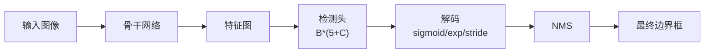

图表来源
- [目标检测YOLO（从零开始）:31-45](file://phases/04-computer-vision/06-object-detection-yolo/docs/en.md#L31-L45)

章节来源
- [目标检测YOLO（从零开始）:127-137](file://phases/04-computer-vision/06-object-detection-yolo/docs/en.md#L127-L137)

### 语义分割U-Net
- 关键点：编码器下采样+跳跃连接+解码器上采样；Dice损失缓解类别不平衡
- 工程要点：跳连保留高频细节；上采样可用转置卷积或双线性+卷积；Dice与交叉熵组合
- 实践：实现U-Net骨干、Dice损失、IoU指标；在合成数据上验证边界精度

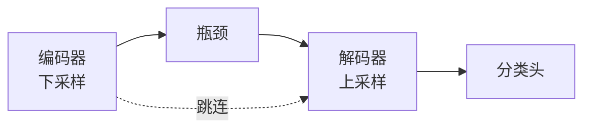

图表来源
- [语义分割U-Net:48-75](file://phases/04-computer-vision/07-semantic-segmentation-unet/docs/en.md#L48-L75)

章节来源
- [语义分割U-Net:119-127](file://phases/04-computer-vision/07-semantic-segmentation-unet/docs/en.md#L119-L127)

### 实例分割Mask R-CNN
- 关键点：Faster R-CNN+掩码头；RoIAlign无量化采样；RPN生成候选框
- 工程要点：RoIAlign与RoIPool的数值差异；掩码头输出28x28再上采样；冻结骨干+仅训练头部
- 实践：实现RoIAlign；加载预训练模型；替换头部并微调

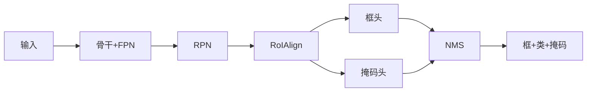

图表来源
- [实例分割Mask R-CNN:29-46](file://phases/04-computer-vision/08-instance-segmentation-mask-rcnn/docs/en.md#L29-L46)

章节来源
- [实例分割Mask R-CNN:56-74](file://phases/04-computer-vision/08-instance-segmentation-mask-rcnn/docs/en.md#L56-L74)

### 图像生成GAN
- 关键点：生成器与判别器的极小极大博弈；非饱和损失、谱归一化、TTUR
- 工程要点：D与G交替更新；G的梯度来自D的反馈；模式崩溃、判别器过强、震荡的识别与修复
- 实践：DCGAN实现；谱归一化替代BN；FID/精度召回评估

章节来源
- [图像生成GAN:79-95](file://phases/04-computer-vision/09-image-generation-gans/docs/en.md#L79-L95)
- [图像生成GAN:166-196](file://phases/04-computer-vision/09-image-generation-gans/docs/en.md#L166-L196)

### 图像生成扩散模型
- 关键点：前向加噪与反向去噪；噪声预测目标；时间条件注入；DDPM/DDIM采样
- 工程要点：训练仅需MSE；采样可加速至几十步；时间嵌入决定采样效率
- 实践：实现噪声计划、q_sample、小型U-Net噪声预测器、DDPM/DDIM采样

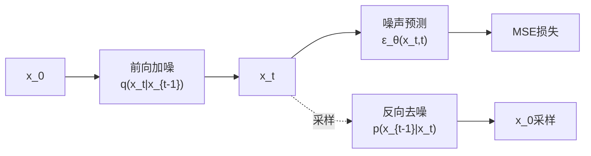

图表来源
- [图像生成扩散模型:59-75](file://phases/04-computer-vision/10-image-generation-diffusion/docs/en.md#L59-L75)

章节来源
- [图像生成扩散模型:123-127](file://phases/04-computer-vision/10-image-generation-diffusion/docs/en.md#L123-L127)
- [图像生成扩散模型:228-251](file://phases/04-computer-vision/10-image-generation-diffusion/docs/en.md#L228-L251)

### 稳定扩散（Stable Diffusion）
- 关键点：VAE编码器/解码器、文本编码器、U-Net去噪、无分类器指导采样
- 工程要点：文本条件注入潜空间；CFG权重平衡；训练与推理的管线化
- 实践：基于diffusers构建文本到图像管线；LoRA微调；图像编辑与超分

章节来源
- [稳定扩散（Stable Diffusion）](file://phases/04-computer-vision/11-stable-diffusion/docs/en.md)

### 视频理解
- 关键点：时序建模、帧间一致性、运动表征、时空特征融合
- 工程要点：3D卷积、时序注意力、光流引导、多尺度时序池化
- 实践：动作识别、时序分割、视频检索

章节来源
- [视频理解](file://phases/04-computer-vision/12-video-understanding/docs/en.md)

### 3D视觉NeRF
- 关键点：神经辐射场、沿射线采样、体积渲染、位置编码
- 工程要点：隐式场景表示、视图外泛化、高效训练与渲染
- 实践：NeRF训练与渲染；Neuralangelo等进阶管线

章节来源
- [3D视觉NeRF](file://phases/04-computer-vision/13-3d-vision-nerf/docs/en.md)

### 视觉Transformer
- 关键点：补丁嵌入、自注意力、层级结构、位置编码
- 工程要点：ViT/DeiT/BeiT等变体；预训练与微调策略
- 实践：ViT骨干替换CNN；多尺度特征融合

章节来源
- [视觉Transformer](file://phases/04-computer-vision/14-vision-transformers/docs/en.md)

### 实时边缘推理
- 关键点：量化、剪枝、蒸馏、编译优化、后端部署
- 工程要点：移动端/嵌入式资源约束下的延迟与吞吐权衡
- 实践：TensorRT/TVM/ONNXRuntime流水线；A/B测试与观测

章节来源
- [实时边缘推理](file://phases/04-computer-vision/15-real-time-edge/docs/en.md)

### 视觉管道综合项目
- 关键点：端到端流水线整合、数据-模型-评估-部署一体化
- 工程要点：模块化设计、可观测性、可扩展性、可维护性
- 实践：从数据采集到在线服务的完整项目

章节来源
- [视觉管道综合项目](file://phases/04-computer-vision/16-vision-pipeline-capstone/docs/en.md)

### 自监督视觉
- 关键点：SimCLR/MAE/DINO等自监督策略、对比学习与重建
- 工程要点：离线预训练+线性探针；下游任务微调
- 实践：对比不同自监督方法在下游任务上的表现

章节来源
- [自监督视觉](file://phases/04-computer-vision/17-self-supervised-vision/docs/en.md)

### 开放词汇CLIP
- 关键点：对比学习、跨模态对齐、零样本分类
- 工程要点：图像-文本特征对齐、温度参数、检索与排序
- 实践：CLIP特征提取与检索；零样本分类

章节来源
- [开放词汇CLIP](file://phases/04-computer-vision/18-open-vocab-clip/docs/en.md)

### OCR与文档理解
- 关键点：文本检测与识别、版面分析、结构化抽取
- 工程要点：端到端OCR、文档布局解析、多语言支持
- 实践：DocTR/LayoutLM等方案集成

章节来源
- [OCR与文档理解](file://phases/04-computer-vision/19-ocr-document-understanding/docs/en.md)

### 图像检索与度量学习
- 关键点：对比损失、三元组损失、度量空间学习
- 工程要点：全局特征、局部特征、哈希近似、索引加速
- 实践：大规模图像检索系统

章节来源
- [图像检索与度量学习](file://phases/04-computer-vision/20-image-retrieval-metric/docs/en.md)

### 关键点与姿态估计
- 关键点：2D/3D关键点、拓扑约束、时序一致性
- 工程要点：Heatmap回归、树桩法、多尺度特征
- 实践：MPII/COCO关键点基准

章节来源
- [关键点与姿态估计](file://phases/04-computer-vision/21-keypoint-pose/docs/en.md)

### 3D高斯点阵
- 关键点：显式3D表示、可微渲染、稀疏化
- 工程要点：高斯混合、可见性掩码、优化策略
- 实践：NeRF-Free、Instant-NeRF等

章节来源
- [3D高斯点阵](file://phases/04-computer-vision/22-3d-gaussian-splatting/docs/en.md)

### 扩散Transformer与修正流
- 关键点：扩散过程与Transformer结合、修正流正则
- 工程要点：连续时间扩散、SDE/ODE统一视角
- 实践：Denoising Diffusion Transformer

章节来源
- [扩散Transformer与修正流](file://phases/04-computer-vision/23-diffusion-transformers-rectified-flow/docs/en.md)

### SAM3开放词汇分割
- 关键点：提示驱动分割、开放词汇、交互式标注
- 工程要点：掩码编码器、提示对齐、多尺度融合
- 实践：交互式分割与标注

章节来源
- [SAM3开放词汇分割](file://phases/04-computer-vision/24-sam3-open-vocab-segmentation/docs/en.md)

### 视觉语言模型
- 关键点：ViT+MLP+LLM范式、跨模态对齐、指令微调
- 工程要点：Q-Former、BLIP-2、LLaVA等架构
- 实践：多模态对话与指令遵循

章节来源
- [视觉语言模型](file://phases/04-computer-vision/25-vision-language-models/docs/en.md)

### 单目深度估计
- 关键点：几何约束、多尺度、有序回归、不确定性建模
- 工程要点：Monodepth、AdaBins、MiDaS等
- 实践：深度图生成与可视化

章节来源
- [单目深度估计](file://phases/04-computer-vision/26-monocular-depth/docs/en.md)

### 多目标跟踪
- 关键点：外观特征、运动模型、轨迹关联、内存机制
- 工程要点：SORT/DeepSORT/MOTR/TrackFormer
- 实践：视频序列多目标轨迹重建

章节来源
- [多目标跟踪](file://phases/04-computer-vision/27-multi-object-tracking/docs/en.md)

### 世界模型与视频扩散
- 关键点：环境模型、计划-执行、视频扩散
- 工程要点：Dreamer、PETS、Video Diffusion
- 实践：世界模型训练与仿真

章节来源
- [世界模型与视频扩散](file://phases/04-computer-vision/28-world-models-video-diffusion/docs/en.md)

## 依赖关系分析
- 数据与预处理：所有任务均依赖图像基础与标准化管线
- 特征提取：CNN/ViT/自监督/CLIP作为骨干，迁移学习贯穿始终
- 任务头：分类/检测/分割/生成/多模态各司其职，但共享优化与评估框架
- 评估与诊断：指标体系与可视化工具为工程迭代提供反馈

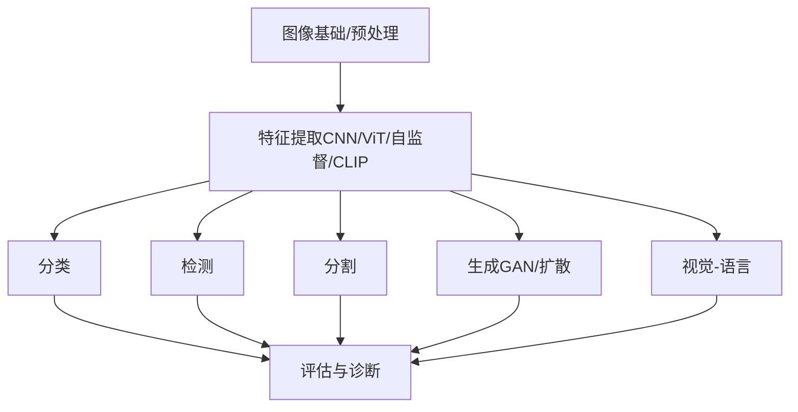

图表来源
- [图像基础:29-47](file://phases/04-computer-vision/01-image-fundamentals/docs/en.md#L29-L47)
- [图像分类:29-47](file://phases/04-computer-vision/04-image-classification/docs/en.md#L29-L47)

章节来源
- [图像基础:10-23](file://phases/04-computer-vision/01-image-fundamentals/docs/en.md#L10-L23)
- [图像分类:17-24](file://phases/04-computer-vision/04-image-classification/docs/en.md#L17-L24)

## 性能考量
- 计算效率：卷积im2col、编译优化（TensorRT/TVM）、量化/蒸馏
- 内存占用：U-Net输入分辨率、FPN层级、批次大小与梯度累积
- 收敛稳定性：判别式学习率、BN处理、谱归一化、TTUR、损失平衡
- 推理速度：DDIM/Euler等快速采样、批处理、缓存与流水线

## 故障排查指南
- 预处理错误
  - 布局不匹配（HWC/CHW）导致首层卷积误读通道
  - 缺少标准化或使用错误均值/方差
  - 插值方式不当（标签用最近邻）
- 训练异常
  - 学习率过高导致特征破坏或发散
  - BN统计漂移（小数据集冻结BN或改用GroupNorm）
  - 模式崩溃（GAN）或判别器过强（扩散模型D训练过强）
- 检测/分割问题
  - 锚框与目标尺度不匹配
  - NMS阈值过高/过低
  - 类别不平衡导致Dice主导
- 生成质量
  - FID/IS偏低：增加训练步数、改进损失或采样策略
  - 文本-图像对齐不佳：调整温度参数、提示注入策略

章节来源
- [图像基础:17-23](file://phases/04-computer-vision/01-image-fundamentals/docs/en.md#L17-L23)
- [迁移学习与微调:77-85](file://phases/04-computer-vision/05-transfer-learning/docs/en.md#L77-L85)
- [目标检测YOLO（从零开始）:96-110](file://phases/04-computer-vision/06-object-detection-yolo/docs/en.md#L96-L110)
- [语义分割U-Net:98-117](file://phases/04-computer-vision/07-semantic-segmentation-unet/docs/en.md#L98-L117)
- [图像生成GAN:79-95](file://phases/04-computer-vision/09-image-generation-gans/docs/en.md#L79-L95)
- [图像生成扩散模型:108-111](file://phases/04-computer-vision/10-image-generation-diffusion/docs/en.md#L108-L111)

## 结论
本阶段以“工程可复现、可诊断、可迁移”为目标，系统构建从图像基础到前沿应用的完整知识体系。通过28门课程的递进式学习与实践，读者将具备独立设计、训练与部署视觉系统的工程能力，并能在真实业务中快速定位问题、优化性能与扩展功能。

## 附录
- 术语速查：像素、通道、HWC/CHW、归一化/标准化、感受野、锚框、IoU、NMS、Dice、FID、mAP、RoIAlign、DDPM/DDIM、CLIP、LoRA、CFG、NeRF、ViT、SAM3等
- 参考资料：各课程末尾进一步阅读材料与官方文档链接