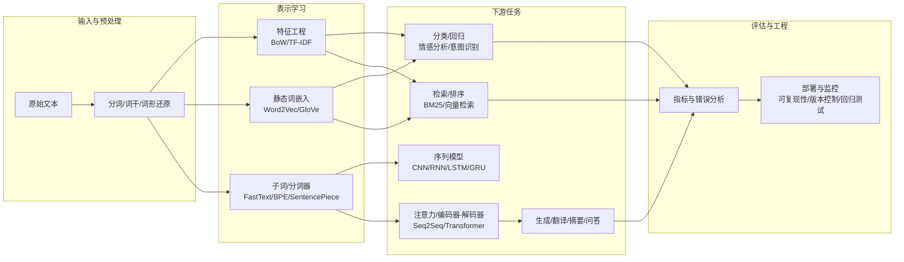
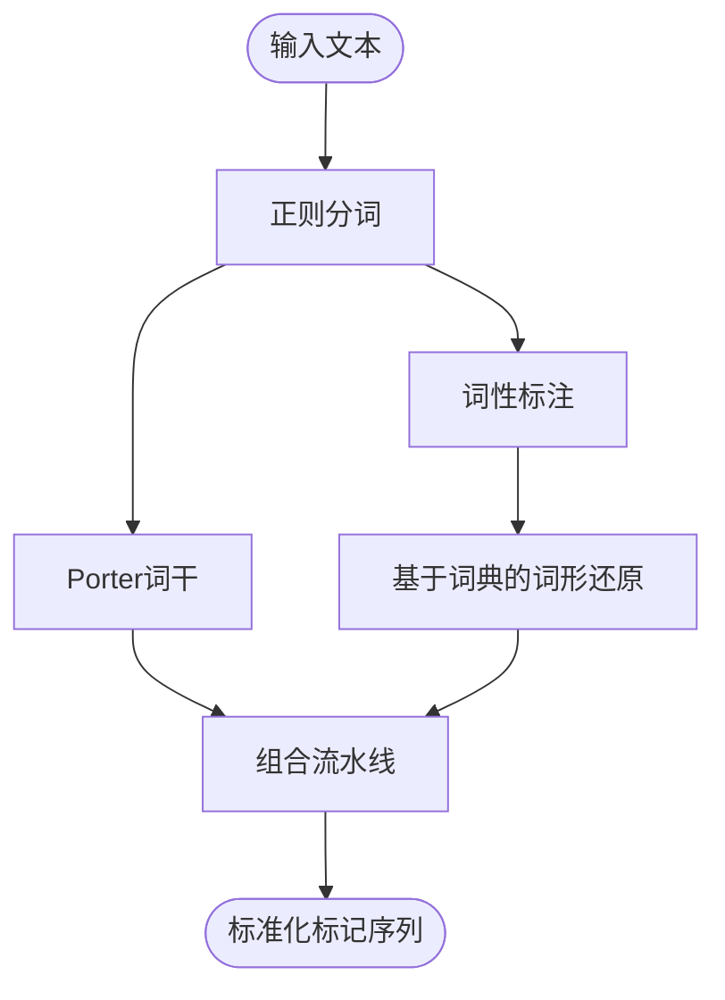
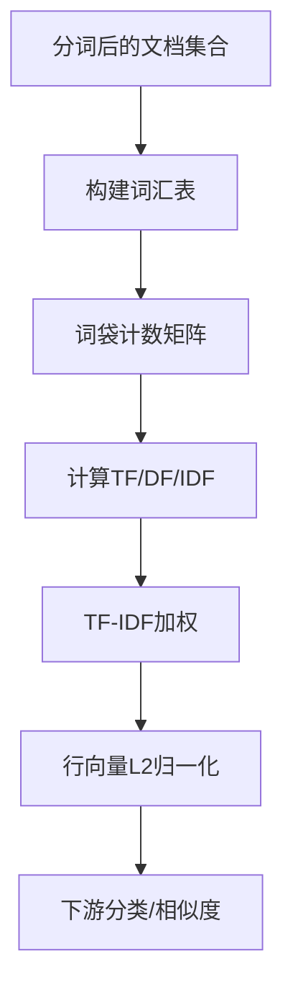
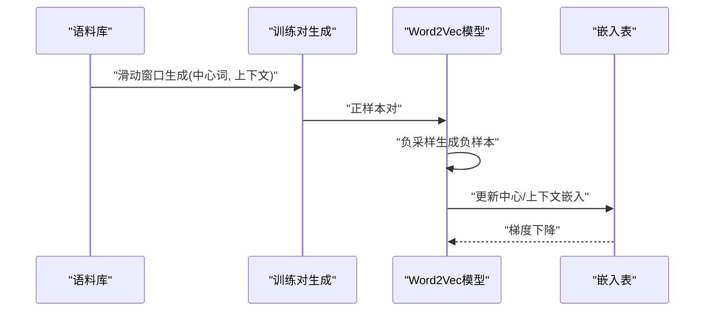
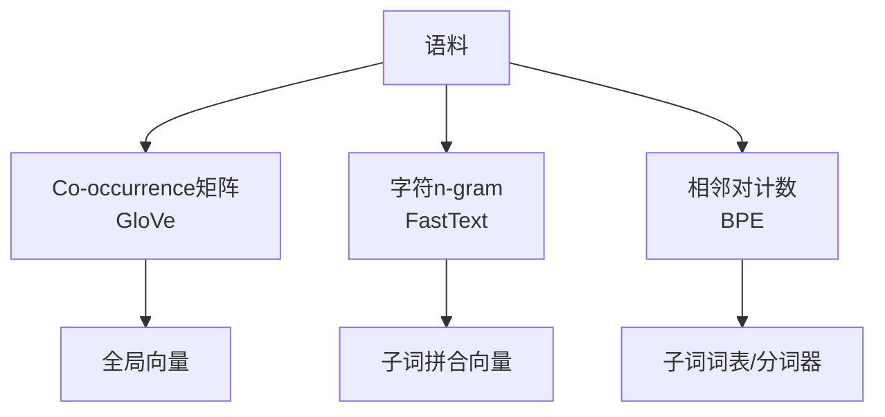
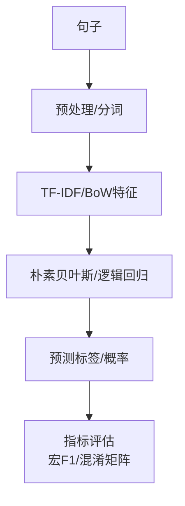
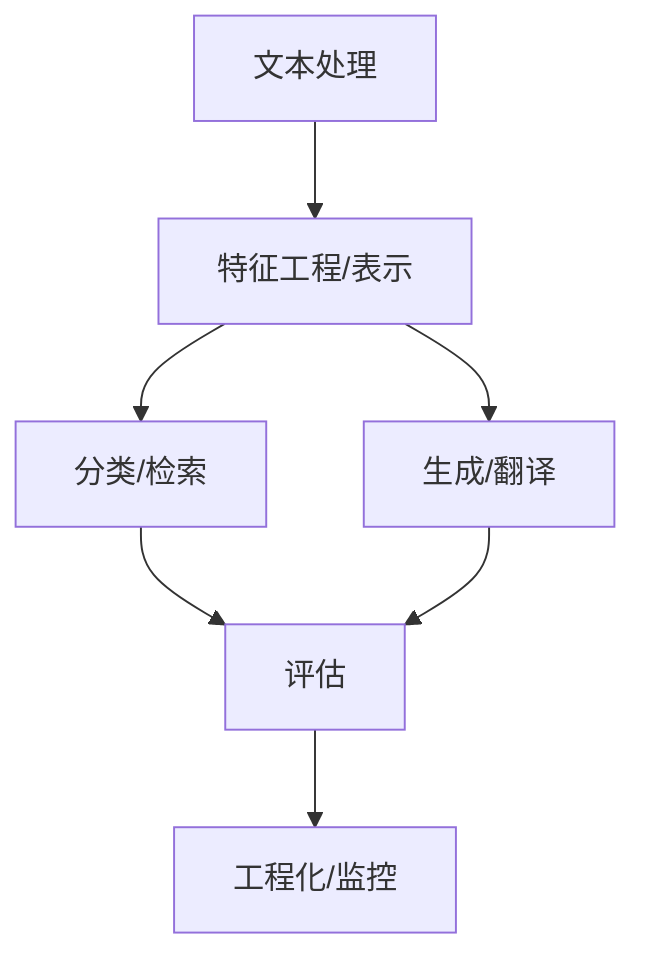

# 阶段5：自然语言处理基础

<cite>
**本文引用的文件**
- [phases/05-nlp-foundations-to-advanced/README.md](file://phases/05-nlp-foundations-to-advanced/README.md)
- [phases/05-nlp-foundations-to-advanced/01-text-processing/docs/en.md](file://phases/05-nlp-foundations-to-advanced/01-text-processing/docs/en.md)
- [phases/05-nlp-foundations-to-advanced/02-bag-of-words-tfidf/docs/en.md](file://phases/05-nlp-foundations-to-advanced/02-bag-of-words-tfidf/docs/en.md)
- [phases/05-nlp-foundations-to-advanced/03-word-embeddings-word2vec/docs/en.md](file://phases/05-nlp-foundations-to-advanced/03-word-embeddings-word2vec/docs/en.md)
- [phases/05-nlp-foundations-to-advanced/04-glove-fasttext-subword/docs/en.md](file://phases/05-nlp-foundations-to-advanced/04-glove-fasttext-subword/docs/en.md)
- [phases/05-nlp-foundations-to-advanced/05-sentiment-analysis/docs/en.md](file://phases/05-nlp-foundations-to-advanced/05-sentiment-analysis/docs/en.md)
- [phases/05-nlp-foundations-to-advanced/06-named-entity-recognition/docs/en.md](file://phases/05-nlp-foundations-to-advanced/06-named-entity-recognition/docs/en.md)
- [phases/05-nlp-foundations-to-advanced/07-pos-tagging-parsing/docs/en.md](file://phases/05-nlp-foundations-to-advanced/07-pos-tagging-parsing/docs/en.md)
- [phases/05-nlp-foundations-to-advanced/08-cnns-rnns-for-text/docs/en.md](file://phases/05-nlp-foundations-to-advanced/08-cnns-rnns-for-text/docs/en.md)
- [phases/05-nlp-foundations-to-advanced/09-sequence-to-sequence/docs/en.md](file://phases/05-nlp-foundations-to-advanced/09-sequence-to-sequence/docs/en.md)
- [phases/05-nlp-foundations-to-advanced/10-attention-mechanism/docs/en.md](file://phases/05-nlp-foundations-to-advanced/10-attention-mechanism/docs/en.md)
- [phases/05-nlp-foundations-to-advanced/11-machine-translation/docs/en.md](file://phases/05-nlp-foundations-to-advanced/11-machine-translation/docs/en.md)
- [phases/05-nlp-foundations-to-advanced/12-text-summarization/docs/en.md](file://phases/05-nlp-foundations-to-advanced/12-text-summarization/docs/en.md)
- [phases/05-nlp-foundations-to-advanced/13-question-answering/docs/en.md](file://phases/05-nlp-foundations-to-advanced/13-question-answering/docs/en.md)
- [phases/05-nlp-foundations-to-advanced/14-information-retrieval-search/docs/en.md](file://phases/05-nlp-foundations-to-advanced/14-information-retrieval-search/docs/en.md)
- [phases/05-nlp-foundations-to-advanced/15-topic-modeling/docs/en.md](file://phases/05-nlp-foundations-to-advanced/15-topic-modeling/docs/en.md)
- [phases/05-nlp-foundations-to-advanced/16-text-generation-pre-transformer/docs/en.md](file://phases/05-nlp-foundations-to-advanced/16-text-generation-pre-transformer/docs/en.md)
- [phases/05-nlp-foundations-to-advanced/17-chatbots-rule-to-neural/docs/en.md](file://phases/05-nlp-foundations-to-advanced/17-chatbots-rule-to-neural/docs/en.md)
- [phases/05-nlp-foundations-to-advanced/18-multilingual-nlp/docs/en.md](file://phases/05-nlp-foundations-to-advanced/18-multilingual-nlp/docs/en.md)
- [phases/05-nlp-foundations-to-advanced/19-subword-tokenization/docs/en.md](file://phases/05-nlp-foundations-to-advanced/19-subword-tokenization/docs/en.md)
- [phases/05-nlp-foundations-to-advanced/20-structured-outputs-constrained-decoding/docs/en.md](file://phases/05-nlp-foundations-to-advanced/20-structured-outputs-constrained-decoding/docs/en.md)
- [phases/05-nlp-foundations-to-advanced/21-nli-textual-entailment/docs/en.md](file://phases/05-nlp-foundations-to-advanced/21-nli-textual-entailment/docs/en.md)
- [phases/05-nlp-foundations-to-advanced/22-embedding-models-deep-dive/docs/en.md](file://phases/05-nlp-foundations-to-advanced/22-embedding-models-deep-dive/docs/en.md)
- [phases/05-nlp-foundations-to-advanced/23-chunking-strategies-rag/docs/en.md](file://phases/05-nlp-foundations-to-advanced/23-chunking-strategies-rag/docs/en.md)
- [phases/05-nlp-foundations-to-advanced/24-coreference-resolution/docs/en.md](file://phases/05-nlp-foundations-to-advanced/24-coreference-resolution/docs/en.md)
- [phases/05-nlp-foundations-to-advanced/25-entity-linking/docs/en.md](file://phases/05-nlp-foundations-to-advanced/25-entity-linking/docs/en.md)
- [phases/05-nlp-foundations-to-advanced/26-relation-extraction-kg/docs/en.md](file://phases/05-nlp-foundations-to-advanced/26-relation-extraction-kg/docs/en.md)
- [phases/05-nlp-foundations-to-advanced/27-llm-evaluation-frameworks/docs/en.md](file://phases/05-nlp-foundations-to-advanced/27-llm-evaluation-frameworks/docs/en.md)
- [phases/05-nlp-foundations-to-advanced/28-long-context-evaluation/docs/en.md](file://phases/05-nlp-foundations-to-advanced/28-long-context-evaluation/docs/en.md)
- [phases/05-nlp-foundations-to-advanced/29-dialogue-state-tracking/docs/en.md](file://phases/05-nlp-foundations-to-advanced/29-dialogue-state-tracking/docs/en.md)
</cite>

## 目录
1. 引言
2. 项目结构
3. 核心组件
4. 架构总览
5. 详细组件分析
6. 依赖分析
7. 性能考虑
8. 故障排查指南
9. 结论
10. 附录

## 引言
本阶段面向“自然语言处理基础”，系统梳理从文本预处理到现代大模型之前的经典与前沿技术，覆盖29门核心课程主题。目标是帮助读者建立完整的NLP知识地图：理解每项技术的动机、原理、实现要点、适用场景与局限，并掌握在工程中落地的关键实践（如可复现性、训练/推理一致性、指标设计等）。

## 项目结构
该阶段以“课程清单”形式组织，每个课程包含：
- 文档：英文版课程说明，涵盖问题定义、概念讲解、动手实现、使用建议、失败模式与术语表
- 代码：课程配套的最小可运行实现（如从零构建向量化器、Word2Vec、GloVe、FastText等）
- 笔记本：交互式学习材料（部分课程提供）
- 输出物：可复用的提示词或技能模板，便于工程化复用

```mermaid
graph TB
A["阶段总览<br/>README.md"] --> B["文本处理<br/>01-text-processing"]
A --> C["词袋与TF-IDF<br/>02-bag-of-words-tfidf"]
A --> D["词嵌入与Word2Vec<br/>03-word-embeddings-word2vec"]
A --> E["GloVe/FastText/子词<br/>04-glove-fasttext-subword"]
A --> F["情感分析<br/>05-sentiment-analysis"]
A --> G["命名实体识别<br/>06-named-entity-recognition"]
A --> H["词性标注与句法<br/>07-pos-tagging-parsing"]
A --> I["文本CNN/RNN<br/>08-cnns-rnns-for-text"]
A --> J["序列到序列<br/>09-sequence-to-sequence"]
A --> K["注意力机制<br/>10-attention-mechanism"]
A --> L["机器翻译<br/>11-machine-translation"]
A --> M["文本摘要<br/>12-text-summarization"]
A --> N["问答系统<br/>13-question-answering"]
A --> O["信息检索/搜索<br/>14-information-retrieval-search"]
A --> P["主题建模<br/>15-topic-modeling"]
A --> Q["预Transformer文本生成<br/>16-text-generation-pre-transformer"]
A --> R["聊天机器人：规则到神经<br/>17-chatbots-rule-to-neural"]
A --> S["多语言NLP<br/>18-multilingual-nlp"]
A --> T["子词分词<br/>19-subword-tokenization"]
A --> U["结构化输出与约束解码<br/>20-structured-outputs-constrained-decoding"]
A --> V["自然语言推理<br/>21-nli-textual-entailment"]
A --> W["嵌入模型深度解析<br/>22-embedding-models-deep-dive"]
A --> X["RAG分块策略<br/>23-chunking-strategies-rag"]
A --> Y["共指消解<br/>24-coreference-resolution"]
A --> Z["实体链接<br/>25-entity-linking"]
AA["关系抽取与知识图谱<br/>26-relation-extraction-kg"] --> A
AB["LLM评估框架<br/>27-llm-evaluation-frameworks"] --> A
AC["长上下文评估<br/>28-long-context-evaluation"] --> A
AD["对话状态追踪<br/>29-dialogue-state-tracking"] --> A
```

图表来源
- [phases/05-nlp-foundations-to-advanced/README.md](file://phases/05-nlp-foundations-to-advanced/README.md)

章节来源
- [phases/05-nlp-foundations-to-advanced/README.md](file://phases/05-nlp-foundations-to-advanced/README.md)

## 核心组件
本阶段的核心由“课程模块”构成，每个模块围绕一个技术主题，提供从理论到工程的闭环：
- 知识层：问题背景、概念定义、算法推导与可视化
- 实践层：从零实现关键算法（如TF-IDF、Word2Vec、GloVe、FastText、BPE等）
- 工程层：参数调优、指标设计、可复现性与生产注意事项
- 可复用资产：提示词与技能模板，便于在工程流水线中直接使用

章节来源
- [phases/05-nlp-foundations-to-advanced/01-text-processing/docs/en.md](file://phases/05-nlp-foundations-to-advanced/01-text-processing/docs/en.md)
- [phases/05-nlp-foundations-to-advanced/02-bag-of-words-tfidf/docs/en.md](file://phases/05-nlp-foundations-to-advanced/02-bag-of-words-tfidf/docs/en.md)
- [phases/05-nlp-foundations-to-advanced/03-word-embeddings-word2vec/docs/en.md](file://phases/05-nlp-foundations-to-advanced/03-word-embeddings-word2vec/docs/en.md)
- [phases/05-nlp-foundations-to-advanced/04-glove-fasttext-subword/docs/en.md](file://phases/05-nlp-foundations-to-advanced/04-glove-fasttext-subword/docs/en.md)
- [phases/05-nlp-foundations-to-advanced/05-sentiment-analysis/docs/en.md](file://phases/05-nlp-foundations-to-advanced/05-sentiment-analysis/docs/en.md)

## 架构总览
下图展示从“文本预处理”到“下游任务”的典型数据流：预处理 → 表示学习/特征工程 → 分类/生成/检索 → 评估与监控。

图表来源
- [phases/05-nlp-foundations-to-advanced/01-text-processing/docs/en.md](file://phases/05-nlp-foundations-to-advanced/01-text-processing/docs/en.md)
- [phases/05-nlp-foundations-to-advanced/02-bag-of-words-tfidf/docs/en.md](file://phases/05-nlp-foundations-to-advanced/02-bag-of-words-tfidf/docs/en.md)
- [phases/05-nlp-foundations-to-advanced/03-word-embeddings-word2vec/docs/en.md](file://phases/05-nlp-foundations-to-advanced/03-word-embeddings-word2vec/docs/en.md)
- [phases/05-nlp-foundations-to-advanced/04-glove-fasttext-subword/docs/en.md](file://phases/05-nlp-foundations-to-advanced/04-glove-fasttext-subword/docs/en.md)
- [phases/05-nlp-foundations-to-advanced/05-sentiment-analysis/docs/en.md](file://phases/05-nlp-foundations-to-advanced/05-sentiment-analysis/docs/en.md)

## 详细组件分析

### 文本处理：分词、词干、词形还原
- 问题：模型处理离散符号，人类语言是连续的；如何正确切分、统一形态、保持语义一致性
- 关键点：正则分词器、Porter词干、基于词性标注的词形还原；生产对比（NLTK vs spaCy）
- 失败模式：版本漂移导致训练/推理分布不一致；训练/推理预处理不一致
- 工程建议：固定库版本、写回归测试；将预处理封装进服务包内

图表来源
- [phases/05-nlp-foundations-to-advanced/01-text-processing/docs/en.md](file://phases/05-nlp-foundations-to-advanced/01-text-processing/docs/en.md)

章节来源
- [phases/05-nlp-foundations-to-advanced/01-text-processing/docs/en.md](file://phases/05-nlp-foundations-to-advanced/01-text-processing/docs/en.md)

### 词袋模型与TF-IDF
- 问题：如何将变长字符串映射为定长稠密/稀疏向量供分类器消费
- 关键点：词频统计、文档频率、逆文档频率、L2归一化；与嵌入的混合使用
- 失败模式：语义盲区（否定、反讽）、OOV；何时转向嵌入
- 工程建议：n-gram、min_df/max_df、stop_words、sublinear_tf；结合线性模型获得可解释性

图表来源
- [phases/05-nlp-foundations-to-advanced/02-bag-of-words-tfidf/docs/en.md](file://phases/05-nlp-foundations-to-advanced/02-bag-of-words-tfidf/docs/en.md)

章节来源
- [phases/05-nlp-foundations-to-advanced/02-bag-of-words-tfidf/docs/en.md](file://phases/05-nlp-foundations-to-advanced/02-bag-of-words-tfidf/docs/en.md)

### 词嵌入与Word2Vec
- 问题：如何让语义相近的词在向量空间中彼此接近
- 关键点：分布假设、Skip-gram/CBOW、负采样、向量运算（类比）
- 失败模式：多义词、OOV；静态向量无法捕捉上下文
- 工程建议：加载预训练向量；作为特征池化用于下游任务；进行质量探针（类比、邻居、范数）

图表来源
- [phases/05-nlp-foundations-to-advanced/03-word-embeddings-word2vec/docs/en.md](file://phases/05-nlp-foundations-to-advanced/03-word-embeddings-word2vec/docs/en.md)

章节来源
- [phases/05-nlp-foundations-to-advanced/03-word-embeddings-word2vec/docs/en.md](file://phases/05-nlp-foundations-to-advanced/03-word-embeddings-word2vec/docs/en.md)

### GloVe、FastText与子词
- 问题：如何兼顾全局共现信息、处理OOV并支持子词级表示
- 关键点：共现矩阵分解（GloVe）、字符n-gram聚合（FastText）、迭代合并（BPE）
- 工程建议：根据任务选择（通用词向量、鲁棒性、与模型tokenizer一致）

图表来源
- [phases/05-nlp-foundations-to-advanced/04-glove-fasttext-subword/docs/en.md](file://phases/05-nlp-foundations-to-advanced/04-glove-fasttext-subword/docs/en.md)

章节来源
- [phases/05-nlp-foundations-to-advanced/04-glove-fasttext-subword/docs/en.md](file://phases/05-nlp-foundations-to-advanced/04-glove-fasttext-subword/docs/en.md)

### 情感分析
- 问题：如何准确识别短文本的情感极性，处理否定、反讽、领域差异
- 关键点：特征工程（BoW/TF-IDF + n-gram）、朴素贝叶斯、逻辑回归；否定作用域
- 工程建议：宏F1、混淆矩阵、误例抽样；避免仅用准确率；必要时转向上下文模型

图表来源
- [phases/05-nlp-foundations-to-advanced/05-sentiment-analysis/docs/en.md](file://phases/05-nlp-foundations-to-advanced/05-sentiment-analysis/docs/en.md)

章节来源
- [phases/05-nlp-foundations-to-advanced/05-sentiment-analysis/docs/en.md](file://phases/05-nlp-foundations-to-advanced/05-sentiment-analysis/docs/en.md)

### 命名实体识别（NER）
- 技术要点：序列标注（BILOU/IOB）、特征工程（词形、后缀、上下文）、CRF/MLP
- 工程建议：标签一致性、类别不平衡、跨域迁移

章节来源
- [phases/05-nlp-foundations-to-advanced/06-named-entity-recognition/docs/en.md](file://phases/05-nlp-foundations-to-advanced/06-named-entity-recognition/docs/en.md)

### 词性标注与句法分析
- 技术要点：隐马尔可夫/条件随机场、依存句法、转移系统
- 工程建议：与下游任务（阅读理解、信息抽取）联合优化

章节来源
- [phases/05-nlp-foundations-to-advanced/07-pos-tagging-parsing/docs/en.md](file://phases/05-nlp-foundations-to-advanced/07-pos-tagging-parsing/docs/en.md)

### 文本CNN/RNN
- 技术要点：卷积捕获局部模式，循环网络建模顺序依赖
- 工程建议：正则化、梯度裁剪、批归一化；与注意力结合

章节来源
- [phases/05-nlp-foundations-to-advanced/08-cnns-rnns-for-text/docs/en.md](file://phases/05-nlp-foundations-to-advanced/08-cnns-rnns-for-text/docs/en.md)

### 序列到序列（Seq2Seq）
- 技术要点：编码器-解码器、教师强制、束搜索
- 工程建议：处理长序列、梯度稳定、后处理清洗

章节来源
- [phases/05-nlp-foundations-to-advanced/09-sequence-to-sequence/docs/en.md](file://phases/05-nlp-foundations-to-advanced/09-sequence-to-sequence/docs/en.md)

### 注意力机制
- 技术要点：点积注意力、缩放、多头注意力、位置编码
- 工程建议：KV缓存、稀疏注意力、长上下文优化

章节来源
- [phases/05-nlp-foundations-to-advanced/10-attention-mechanism/docs/en.md](file://phases/05-nlp-foundations-to-advanced/10-attention-mechanism/docs/en.md)

### 机器翻译
- 技术要点：双语语料、对齐、端到端神经翻译
- 工程建议：回译、去歧义、评估指标（BLEU、chrF）

章节来源
- [phases/05-nlp-foundations-to-advanced/11-machine-translation/docs/en.md](file://phases/05-nlp-foundations-to-advanced/11-machine-translation/docs/en.md)

### 文本摘要
- 技术要点：抽取式 vs 生成式、ROUGE、约束解码
- 工程建议：长度约束、重复惩罚、可读性后处理

章节来源
- [phases/05-nlp-foundations-to-advanced/12-text-summarization/docs/en.md](file://phases/05-nlp-foundations-to-advanced/12-text-summarization/docs/en.md)

### 问答系统
- 技术要点：抽取式、生成式、多跳推理、检索增强
- 工程建议：问题重写、上下文截断、事实性校验

章节来源
- [phases/05-nlp-foundations-to-advanced/13-question-answering/docs/en.md](file://phases/05-nlp-foundations-to-advanced/13-question-answering/docs/en.md)

### 信息检索与搜索
- 技术要点：BM25、向量检索、重排序、混合检索
- 工程建议：查询扩展、领域自适应、评估指标（P@k、nDCG）

章节来源
- [phases/05-nlp-foundations-to-advanced/14-information-retrieval-search/docs/en.md](file://phases/05-nlp-foundations-to-advanced/14-information-retrieval-search/docs/en.md)

### 主题建模
- 技术要点：LDA、主题分布、可解释性
- 工程建议：主题稳定性、人工校验、与分类任务结合

章节来源
- [phases/05-nlp-foundations-to-advanced/15-topic-modeling/docs/en.md](file://phases/05-nlp-foundations-to-advanced/15-topic-modeling/docs/en.md)

### 预Transformer文本生成
- 技术要点：n-gram语言模型、RNN/LSTM、训练技巧
- 工程建议：温度采样、核采样、多样性与连贯性平衡

章节来源
- [phases/05-nlp-foundations-to-advanced/16-text-generation-pre-transformer/docs/en.md](file://phases/05-nlp-foundations-to-advanced/16-text-generation-pre-transformer/docs/en.md)

### 聊天机器人：从规则到神经
- 技术要点：槽位填充、对话管理、检索式/生成式
- 工程建议：多轮一致性、上下文压缩、安全与合规

章节来源
- [phases/05-nlp-foundations-to-advanced/17-chatbots-rule-to-neural/docs/en.md](file://phases/05-nlp-foundations-to-advanced/17-chatbots-rule-to-neural/docs/en.md)

### 多语言NLP
- 技术要点：多语词向量、跨语言对齐、零样本/少样本
- 工程建议：语言检测、分层预训练、评估基准

章节来源
- [phases/05-nlp-foundations-to-advanced/18-multilingual-nlp/docs/en.md](file://phases/05-nlp-foundations-to-advanced/18-multilingual-nlp/docs/en.md)

### 子词分词
- 技术要点：BPE、WordPiece、SentencePiece、Byte-level BPE
- 工程建议：与模型tokenizer强绑定、一致性验证

章节来源
- [phases/05-nlp-foundations-to-advanced/19-subword-tokenization/docs/en.md](file://phases/05-nlp-foundations-to-advanced/19-subword-tokenization/docs/en.md)

### 结构化输出与约束解码
- 技术要点：JSON/SQL/Schema约束、解码时硬约束、后处理修复
- 工程建议：格式验证器、重试与回退策略

章节来源
- [phases/05-nlp-foundations-to-advanced/20-structured-outputs-constrained-decoding/docs/en.md](file://phases/05-nlp-foundations-to-advanced/20-structured-outputs-constrained-decoding/docs/en.md)

### 自然语言推理（NLI）
- 技术要点：蕴含/对立/中性三分类、对抗数据集
- 工程建议：对抗训练、可解释性分析

章节来源
- [phases/05-nlp-foundations-to-advanced/21-nli-textual-entailment/docs/en.md](file://phases/05-nlp-foundations-to-advanced/21-nli-textual-entailment/docs/en.md)

### 嵌入模型深度解析
- 技术要点：维度、距离度量、聚类与可视化、公平性偏差
- 工程建议：投影分析、偏见检测与缓解

章节来源
- [phases/05-nlp-foundations-to-advanced/22-embedding-models-deep-dive/docs/en.md](file://phases/05-nlp-foundations-to-advanced/22-embedding-models-deep-dive/docs/en.md)

### RAG分块策略
- 技术要点：段落切分、重叠、元数据保留、重排
- 工程建议：多粒度分块、查询改写、混合检索

章节来源
- [phases/05-nlp-foundations-to-advanced/23-chunking-strategies-rag/docs/en.md](file://phases/05-nlp-foundations-to-advanced/23-chunking-strategies-rag/docs/en.md)

### 共指消解
- 技术要点：指代表达识别、消解链、跨句连接
- 工程建议：与阅读理解/问答联合训练

章节来源
- [phases/05-nlp-foundations-to-advanced/24-coreference-resolution/docs/en.md](file://phases/05-nlp-foundations-to-advanced/24-coreference-resolution/docs/en.md)

### 实体链接
- 技术要点：候选生成、匹配打分、KB链接
- 工程建议：高质量实体词典、跨语言链接

章节来源
- [phases/05-nlp-foundations-to-advanced/25-entity-linking/docs/en.md](file://phases/05-nlp-foundations-to-advanced/25-entity-linking/docs/en.md)

### 关系抽取与知识图谱
- 技术要点：监督/半监督/无监督关系抽取、图谱构建与更新
- 工程建议：实体对齐、冲突消解、增量更新

章节来源
- [phases/05-nlp-foundations-to-advanced/26-relation-extraction-kg/docs/en.md](file://phases/05-nlp-foundations-to-advanced/26-relation-extraction-kg/docs/en.md)

### LLM评估框架
- 技术要点：基准评测、人工评估、鲁棒性测试
- 工程建议：多维指标、A/B测试、持续评估

章节来源
- [phases/05-nlp-foundations-to-advanced/27-llm-evaluation-frameworks/docs/en.md](file://phases/05-nlp-foundations-to-advanced/27-llm-evaluation-frameworks/docs/en.md)

### 长上下文评估
- 技术要点：超长文档处理、检索与生成稳定性
- 工程建议：分块策略、缓存与增量更新

章节来源
- [phases/05-nlp-foundations-to-advanced/28-long-context-evaluation/docs/en.md](file://phases/05-nlp-foundations-to-advanced/28-long-context-evaluation/docs/en.md)

### 对话状态追踪
- 技术要点：槽位值跟踪、多轮一致性、外部工具调用
- 工程建议：状态图/有限状态机、可观测性与调试

章节来源
- [phases/05-nlp-foundations-to-advanced/29-dialogue-state-tracking/docs/en.md](file://phases/05-nlp-foundations-to-advanced/29-dialogue-state-tracking/docs/en.md)

## 依赖分析
- 组件耦合：上游预处理直接影响下游表示与效果；表示层（BoW/TF-IDF/嵌入/子词）与任务层（分类/检索/生成）松耦合
- 外部依赖：scikit-learn、gensim、transformers、spaCy/NLTK等
- 可能的循环依赖：课程间前置依赖明确，未见循环导入

图表来源
- [phases/05-nlp-foundations-to-advanced/01-text-processing/docs/en.md](file://phases/05-nlp-foundations-to-advanced/01-text-processing/docs/en.md)
- [phases/05-nlp-foundations-to-advanced/02-bag-of-words-tfidf/docs/en.md](file://phases/05-nlp-foundations-to-advanced/02-bag-of-words-tfidf/docs/en.md)
- [phases/05-nlp-foundations-to-advanced/03-word-embeddings-word2vec/docs/en.md](file://phases/05-nlp-foundations-to-advanced/03-word-embeddings-word2vec/docs/en.md)
- [phases/05-nlp-foundations-to-advanced/04-glove-fasttext-subword/docs/en.md](file://phases/05-nlp-foundations-to-advanced/04-glove-fasttext-subword/docs/en.md)
- [phases/05-nlp-foundations-to-advanced/05-sentiment-analysis/docs/en.md](file://phases/05-nlp-foundations-to-advanced/05-sentiment-analysis/docs/en.md)

## 性能考虑
- 计算效率：TF-IDF+线性模型毫秒级响应；嵌入/Transformer生成/检索更慢但语义更强
- 内存占用：稀疏矩阵优先；嵌入表规模与维度权衡
- 可扩展性：分布式训练（后续阶段涉及）、KV缓存、批处理与流水线

## 故障排查指南
- 训练/推理不一致：确保预处理函数完全一致；写回归测试
- 版本漂移：固定第三方库版本；记录tokenizer/lemmatizer行为
- 类别不平衡：用宏F1、加权F1、AUPRC；检查混淆矩阵
- OOV与多义词：采用子词/分词器；考虑上下文嵌入
- 评估陷阱：不要只看准确率；区分域内/域外；做A/B测试

章节来源
- [phases/05-nlp-foundations-to-advanced/01-text-processing/docs/en.md](file://phases/05-nlp-foundations-to-advanced/01-text-processing/docs/en.md)
- [phases/05-nlp-foundations-to-advanced/05-sentiment-analysis/docs/en.md](file://phases/05-nlp-foundations-to-advanced/05-sentiment-analysis/docs/en.md)

## 结论
本阶段系统性地串联了NLP从基础到进阶的知识脉络：先以规则与统计方法建立稳健基线，再逐步引入上下文感知与大规模预训练能力。通过“从零实现 + 工程化最佳实践”的方式，既掌握原理，又具备落地能力。建议在完成本阶段后，继续进入Transformer与大模型相关课程，进一步拓展到生成式AI与工程化应用。

## 附录
- 可复用提示词与技能模板：用于工程流水线中的自动化决策与质量把关
- 进一步阅读：各课程末尾列出的经典论文与官方文档索引