# 阶段6：语音与音频处理

<cite>
**本文档引用的文件**
- [README.md](file://phases/06-speech-and-audio/README.md)
- [01-audio-fundamentals/docs/en.md](file://phases/06-speech-and-audio/01-audio-fundamentals/docs/en.md)
- [02-spectrograms-mel-features/docs/en.md](file://phases/06-speech-and-audio/02-spectrograms-mel-features/docs/en.md)
- [03-audio-classification/docs/en.md](file://phases/06-speech-and-audio/03-audio-classification/docs/en.md)
- [04-speech-recognition-asr/docs/en.md](file://phases/06-speech-and-audio/04-speech-recognition-asr/docs/en.md)
- [05-whisper-architecture-finetuning/docs/en.md](file://phases/06-speech-and-audio/05-whisper-architecture-finetuning/docs/en.md)
- [06-speaker-recognition-verification/docs/en.md](file://phases/06-speech-and-audio/06-speaker-recognition-verification/docs/en.md)
- [07-text-to-speech/docs/en.md](file://phases/06-speech-and-audio/07-text-to-speech/docs/en.md)
- [08-voice-cloning-conversion/docs/en.md](file://phases/06-speech-and-audio/08-voice-cloning-conversion/docs/en.md)
- [09-music-generation/docs/en.md](file://phases/06-speech-and-audio/09-music-generation/docs/en.md)
- [10-audio-language-models/docs/en.md](file://phases/06-speech-and-audio/10-audio-language-models/docs/en.md)
- [11-real-time-audio-processing/docs/en.md](file://phases/06-speech-and-audio/11-real-time-audio-processing/docs/en.md)
- [12-voice-assistant-pipeline/docs/en.md](file://phases/06-speech-and-audio/12-voice-assistant-pipeline/docs/en.md)
- [13-neural-audio-codecs/docs/en.md](file://phases/06-speech-and-audio/13-neural-audio-codecs/docs/en.md)
- [14-voice-activity-detection-turn-taking/docs/en.md](file://phases/06-speech-and-audio/14-voice-activity-detection-turn-taking/docs/en.md)
- [15-streaming-speech-to-speech-moshi-hibiki/docs/en.md](file://phases/06-speech-and-audio/15-streaming-speech-to-speech-moshi-hibiki/docs/en.md)
- [16-anti-spoofing-audio-watermarking/docs/en.md](file://phases/06-speech-and-audio/16-anti-spoofing-audio-watermarking/docs/en.md)
- [17-audio-evaluation-metrics/docs/en.md](file://phases/06-speech-and-audio/17-audio-evaluation-metrics/docs/en.md)
</cite>

## 目录
1. [引言](#引言)
2. [项目结构](#项目结构)
3. [核心组件](#核心组件)
4. [架构总览](#架构总览)
5. [详细组件分析](#详细组件分析)
6. [依赖关系分析](#依赖关系分析)
7. [性能考量](#性能考量)
8. [故障排查指南](#故障排查指南)
9. [结论](#结论)
10. [附录](#附录)

## 引言
本阶段系统性覆盖语音与音频处理的完整知识体系，包含从底层信号处理到端到端语音助手的工程实践。课程围绕“音频基础 → 特征提取 → 分类/识别 → 语音合成 → 克隆转换 → 音乐生成 → 多模态理解 → 实时处理 → 全双工对话 → 安全合规 → 评估度量”的主线展开，既强调理论基础，也注重工程落地与生产级质量保障。

## 项目结构
该阶段由17门核心课程构成，每门课程聚焦一个关键能力模块，形成“问题定义—概念讲解—动手实现—工程选型—最佳实践—评估度量”的闭环学习路径。

```mermaid
graph TB
subgraph "语音与音频处理阶段"
A["音频基础<br/>采样/傅里叶/帧窗口"] --> B["梅尔特征<br/>STFT/滤波器组/对数压缩"]
B --> C["音频分类<br/>CNN/Transformer/自监督"]
C --> D["语音识别ASR<br/>CTC/RNN-T/注意力"]
D --> E["Whisper架构与微调<br/>多任务/提示词/长文本"]
E --> F["说话人识别验证<br/>嵌入/阈值/EER"]
F --> G["文本转语音TTS<br/>声学模型/声码器"]
G --> H["声音克隆转换<br/>零样本/少样本/水印"]
H --> I["音乐生成<br/>编码器-解码器/扩散"]
I --> J["音频语言模型<br/>跨模态理解/推理"]
J --> K["实时音频处理<br/>环形缓冲/VAD/中断"]
K --> L["语音助手流水线<br/>端点检测/工具调用"]
L --> M["神经音频编解码器<br/>RVQ/语义-音质分离"]
M --> N["语音活动检测与轮流<br/>三阶VAD/刷新技巧"]
N --> O["流式语音到语音<br/>Moshe Hibiki全双工"]
O --> P["反欺骗与音频水印<br/>检测/水印/溯源"]
P --> Q["音频评估指标<br/>WER/MOS/FAD/EER等"]
end
```

图表来源
- [01-audio-fundamentals/docs/en.md:1-143](file://phases/06-speech-and-audio/01-audio-fundamentals/docs/en.md#L1-L143)
- [02-spectrograms-mel-features/docs/en.md:1-175](file://phases/06-speech-and-audio/02-spectrograms-mel-features/docs/en.md#L1-L175)
- [03-audio-classification/docs/en.md:1-180](file://phases/06-speech-and-audio/03-audio-classification/docs/en.md#L1-L180)
- [04-speech-recognition-asr/docs/en.md:1-182](file://phases/06-speech-and-audio/04-speech-recognition-asr/docs/en.md#L1-L182)
- [05-whisper-architecture-finetuning/docs/en.md:1-188](file://phases/06-speech-and-audio/05-whisper-architecture-finetuning/docs/en.md#L1-L188)
- [06-speaker-recognition-verification/docs/en.md:1-173](file://phases/06-speech-and-audio/06-speaker-recognition-verification/docs/en.md#L1-L173)
- [07-text-to-speech/docs/en.md:1-184](file://phases/06-speech-and-audio/07-text-to-speech/docs/en.md#L1-L184)
- [08-voice-cloning-conversion/docs/en.md:1-172](file://phases/06-speech-and-audio/08-voice-cloning-conversion/docs/en.md#L1-L172)
- [09-music-generation/docs/en.md:1-169](file://phases/06-speech-and-audio/09-music-generation/docs/en.md#L1-L169)
- [10-audio-language-models/docs/en.md:1-187](file://phases/06-speech-and-audio/10-audio-language-models/docs/en.md#L1-L187)
- [11-real-time-audio-processing/docs/en.md:1-175](file://phases/06-speech-and-audio/11-real-time-audio-processing/docs/en.md#L1-L175)
- [12-voice-assistant-pipeline/docs/en.md:1-178](file://phases/06-speech-and-audio/12-voice-assistant-pipeline/docs/en.md#L1-L178)
- [13-neural-audio-codecs/docs/en.md:1-186](file://phases/06-speech-and-audio/13-neural-audio-codecs/docs/en.md#L1-L186)
- [14-voice-activity-detection-turn-taking/docs/en.md:1-174](file://phases/06-speech-and-audio/14-voice-activity-detection-turn-taking/docs/en.md#L1-L174)
- [15-streaming-speech-to-speech-moshi-hibiki/docs/en.md:1-181](file://phases/06-speech-and-audio/15-streaming-speech-to-speech-moshi-hibiki/docs/en.md#L1-L181)
- [16-anti-spoofing-audio-watermarking/docs/en.md:1-193](file://phases/06-speech-and-audio/16-anti-spoofing-audio-watermarking/docs/en.md#L1-L193)
- [17-audio-evaluation-metrics/docs/en.md:1-225](file://phases/06-speech-and-audio/17-audio-evaluation-metrics/docs/en.md#L1-L225)

章节来源
- [README.md:1-6](file://phases/06-speech-and-audio/README.md#L1-L6)

## 核心组件
- 音频基础：采样率、奈奎斯特定理、位深、DFT/FFT、短时傅里叶变换（STFT）与窗函数。
- 梅尔特征：梅尔刻度、三角滤波器组、对数压缩、MFCC。
- 音频分类：k-NN、CNN、Audio Spectrogram Transformer（AST）、自监督预训练（BEATs）。
- 语音识别ASR：CTC、RNN-T、注意力编码器-解码器；WDER、字符/词级别归一化。
- Whisper架构与微调：30秒窗口、提示词格式、长文本分块、LoRA微调、faster-whisper推理加速。
- 说话人识别验证：ECAPA-TDNN、WavLM-SV、AAM-softmax、EER、PLDA、评分归一化、聚类说话人分割。
- 文本转语音TTS：Tacotron 2、FastSpeech 2、VITS、F5-TTS、Kokoro、HiFi-GAN、神经编解码器。
- 声音克隆与转换：零样本/少样本克隆、语音转换（KNN-VC/Diff-HierVC）、神经编解码器TTS、水印与同意门禁。
- 音乐生成：MusicGen、Stable Audio、ACE-Step、Lyria、Udio、版权与披露策略。
- 音频语言模型：Qwen2.5-Omni、Audio Flamingo、GPT-4o Audio、MMAU/LongAudioBench评测。
- 实时音频处理：环形缓冲、VAD、流式ASR、中断、WebRTC Opus、抖动缓冲、回声抵消。
- 语音助手流水线：麦克风采集、端点检测、流式STT、工具调用、流式TTS、打断处理。
- 神经音频编解码器：Residual Vector Quantization（RVQ）、EnCodec、DAC、SNAC、Mimi语义-音质分离。
- 语音活动检测与轮流：Silero VAD、三阶VAD级联、静默挂起、预滚缓冲、刷新技巧。
- 流式语音到语音：Moshe全双工、Hibiki翻译、延迟建模、深度变换器。
- 反欺骗与音频水印：AASIST/RAWNet2检测、AudioSeal/WaveVerify水印、C2PA溯源。
- 音频评估指标：WER/CER、MOS/UTMOS、SECS、EER、DER、FAD、RTFx、延迟分布。

章节来源
- [01-audio-fundamentals/docs/en.md:1-143](file://phases/06-speech-and-audio/01-audio-fundamentals/docs/en.md#L1-L143)
- [02-spectrograms-mel-features/docs/en.md:1-175](file://phases/06-speech-and-audio/02-spectrograms-mel-features/docs/en.md#L1-L175)
- [03-audio-classification/docs/en.md:1-180](file://phases/06-speech-and-audio/03-audio-classification/docs/en.md#L1-L180)
- [04-speech-recognition-asr/docs/en.md:1-182](file://phases/06-speech-and-audio/04-speech-recognition-asr/docs/en.md#L1-L182)
- [05-whisper-architecture-finetuning/docs/en.md:1-188](file://phases/06-speech-and-audio/05-whisper-architecture-finetuning/docs/en.md#L1-L188)
- [06-speaker-recognition-verification/docs/en.md:1-173](file://phases/06-speech-and-audio/06-speaker-recognition-verification/docs/en.md#L1-L173)
- [07-text-to-speech/docs/en.md:1-184](file://phases/06-speech-and-audio/07-text-to-speech/docs/en.md#L1-L184)
- [08-voice-cloning-conversion/docs/en.md:1-172](file://phases/06-speech-and-audio/08-voice-cloning-conversion/docs/en.md#L1-L172)
- [09-music-generation/docs/en.md:1-169](file://phases/06-speech-and-audio/09-music-generation/docs/en.md#L1-L169)
- [10-audio-language-models/docs/en.md:1-187](file://phases/06-speech-and-audio/10-audio-language-models/docs/en.md#L1-L187)
- [11-real-time-audio-processing/docs/en.md:1-175](file://phases/06-speech-and-audio/11-real-time-audio-processing/docs/en.md#L1-L175)
- [12-voice-assistant-pipeline/docs/en.md:1-178](file://phases/06-speech-and-audio/12-voice-assistant-pipeline/docs/en.md#L1-L178)
- [13-neural-audio-codecs/docs/en.md:1-186](file://phases/06-speech-and-audio/13-neural-audio-codecs/docs/en.md#L1-L186)
- [14-voice-activity-detection-turn-taking/docs/en.md:1-174](file://phases/06-speech-and-audio/14-voice-activity-detection-turn-taking/docs/en.md#L1-L174)
- [15-streaming-speech-to-speech-moshi-hibiki/docs/en.md:1-181](file://phases/06-speech-and-audio/15-streaming-speech-to-speech-moshi-hibiki/docs/en.md#L1-L181)
- [16-anti-spoofing-audio-watermarking/docs/en.md:1-193](file://phases/06-speech-and-audio/16-anti-spoofing-audio-watermarking/docs/en.md#L1-L193)
- [17-audio-evaluation-metrics/docs/en.md:1-225](file://phases/06-speech-and-audio/17-audio-evaluation-metrics/docs/en.md#L1-L225)

## 架构总览
下图展示了从原始音频到最终语音输出的典型端到端流水线，涵盖实时性、可扩展性与安全性要求。

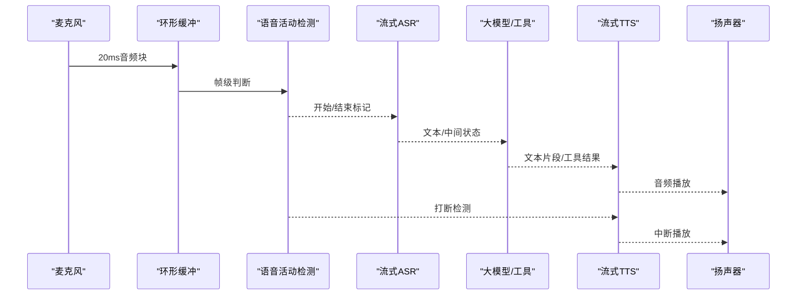

图表来源
- [11-real-time-audio-processing/docs/en.md:26-53](file://phases/06-speech-and-audio/11-real-time-audio-processing/docs/en.md#L26-L53)
- [12-voice-assistant-pipeline/docs/en.md:24-43](file://phases/06-speech-and-audio/12-voice-assistant-pipeline/docs/en.md#L24-L43)

## 详细组件分析

### 组件A：音频基础与STFT
- 关键概念：采样率与奈奎斯特定理、位深、DFT/FFT、窗函数、STFT。
- 工程要点：匹配下游模型采样率、抗混叠低通滤波、避免边缘泄漏。
- 实践建议：优先使用`torchaudio.transforms.Resample`进行重采样；使用`librosa`或`torchaudio`进行STFT；绘制频谱图辅助调试。

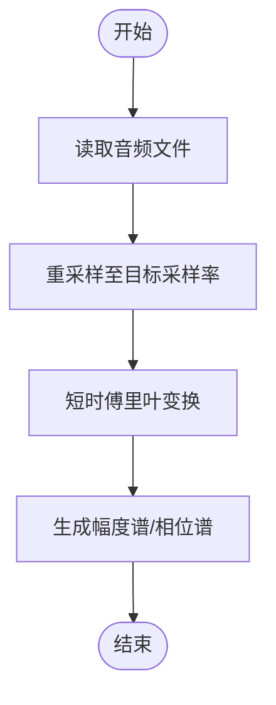

图表来源
- [01-audio-fundamentals/docs/en.md:54-98](file://phases/06-speech-and-audio/01-audio-fundamentals/docs/en.md#L54-L98)
- [02-spectrograms-mel-features/docs/en.md:40-73](file://phases/06-speech-and-audio/02-spectrograms-mel-features/docs/en.md#L40-L73)

章节来源
- [01-audio-fundamentals/docs/en.md:1-143](file://phases/06-speech-and-audio/01-audio-fundamentals/docs/en.md#L1-L143)
- [02-spectrograms-mel-features/docs/en.md:1-175](file://phases/06-speech-and-audio/02-spectrograms-mel-features/docs/en.md#L1-L175)

### 组件B：梅尔特征与MFCC
- 关键概念：梅尔刻度映射、三角滤波器组、对数压缩、MFCC。
- 工程要点：mel数量与采样率一致性、dB与log-mel差异、归一化漂移、填充泄漏。
- 实践建议：Whisper使用log-mel；对比不同窗长/步长对啁啾信号分辨率的影响。

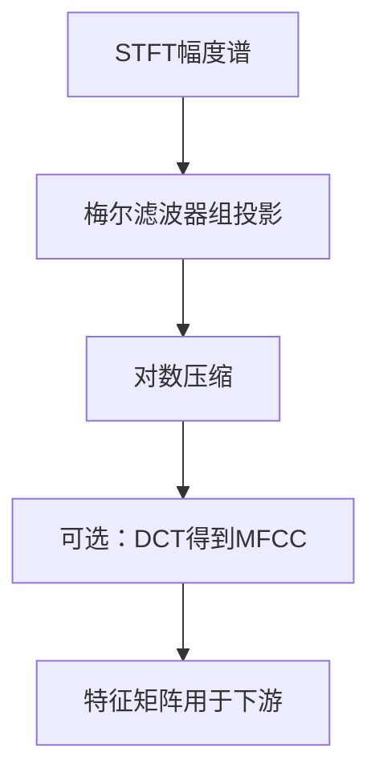

图表来源
- [02-spectrograms-mel-features/docs/en.md:74-121](file://phases/06-speech-and-audio/02-spectrograms-mel-features/docs/en.md#L74-L121)

章节来源
- [02-spectrograms-mel-features/docs/en.md:1-175](file://phases/06-speech-and-audio/02-spectrograms-mel-features/docs/en.md#L1-L175)

### 组件C：音频分类（CNN/Transformer/自监督）
- 技术路线：k-NN（MFCC均值）、2D CNN（log-mel）、AST（ViT）、BEATs（自监督预训练）。
- 数据与评估：类别不平衡、Mixup、SpecAugment；ESC-50/AudioSet基准；mAP、宏F1、每类召回率。
- 实践建议：从冻结骨干开始，先用BEATs/AST快速上车，再按需微调。

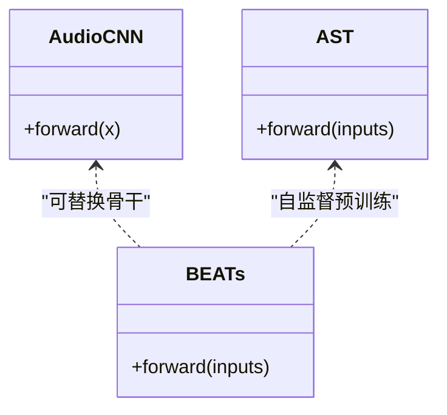

图表来源
- [03-audio-classification/docs/en.md:94-134](file://phases/06-speech-and-audio/03-audio-classification/docs/en.md#L94-L134)

章节来源
- [03-audio-classification/docs/en.md:1-180](file://phases/06-speech-and-audio/03-audio-classification/docs/en.md#L1-L180)

### 组件D：语音识别ASR（CTC/RNN-T/注意力）
- 三种范式：CTC（无自回归、流式）、RNN-T（联合预测器+拼接器）、注意力编码器-解码器（Whisper/SeamlessM4T）。
- 评估指标：WER（词级归一化）、CER、首token延迟、RTFx。
- 实践建议：Always VAD；强制语言标签；长文本分块；外部语言模型融合。

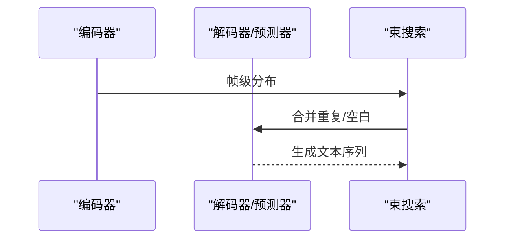

图表来源
- [04-speech-recognition-asr/docs/en.md:24-48](file://phases/06-speech-and-audio/04-speech-recognition-asr/docs/en.md#L24-L48)

章节来源
- [04-speech-recognition-asr/docs/en.md:1-182](file://phases/06-speech-and-audio/04-speech-recognition-asr/docs/en.md#L1-L182)

### 组件E：Whisper架构与微调
- 架构：标准Transformer编码器-解码器，30秒窗口，提示词格式（语言/任务/时间戳）。
- 微调：LoRA在q_proj/k_proj/v_proj；仅解码器或冻结编码器；Whisper tokenizer一致。
- 推理：WhisperX长文本分块+词级对齐+说话人分割；faster-whisper加速。

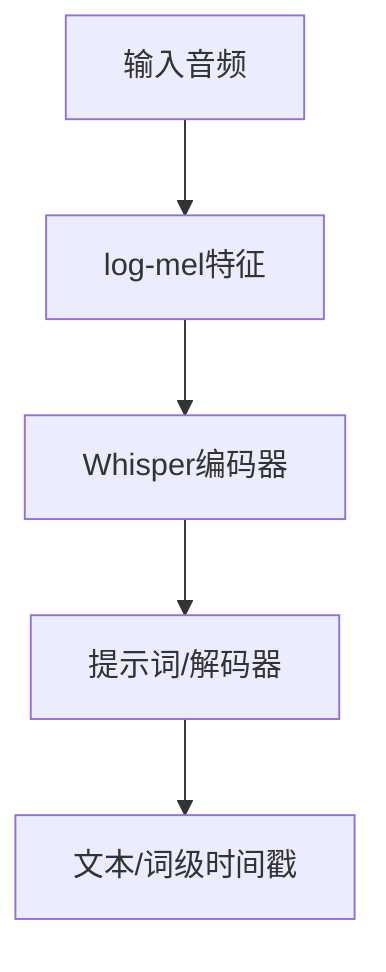

图表来源
- [05-whisper-architecture-finetuning/docs/en.md:24-48](file://phases/06-speech-and-audio/05-whisper-architecture-finetuning/docs/en.md#L24-L48)

章节来源
- [05-whisper-architecture-finetuning/docs/en.md:1-188](file://phases/06-speech-and-audio/05-whisper-architecture-finetuning/docs/en.md#L1-L188)

### 组件F：说话人识别与验证
- 管线：注册（平均嵌入）→ 验证（余弦相似度/PLDA）→ 阈值选择（EER）。
- 模型：ECAPA-TDNN、WavLM-SV、x-vector；AAM-softmax损失；评分归一化。
- 实务：通道不匹配、短说话、噪声注册、固定阈值。

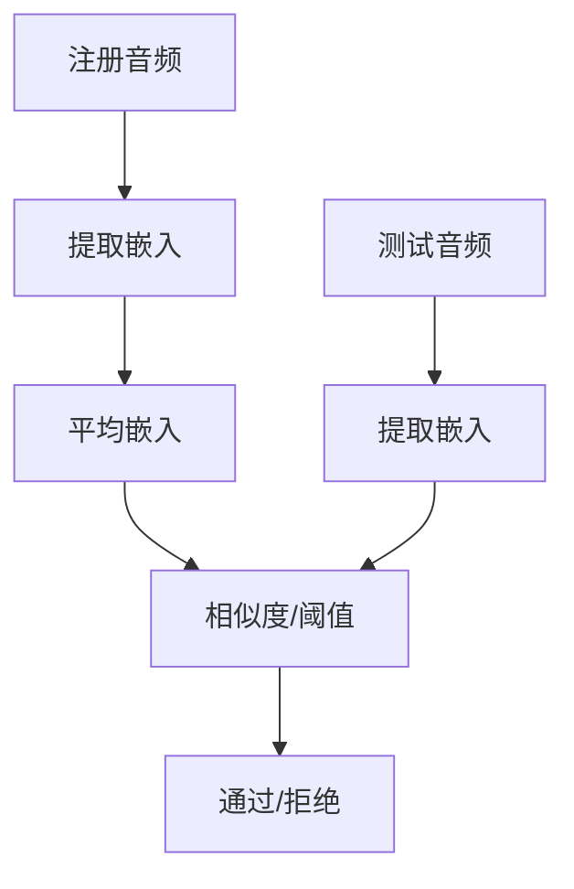

图表来源
- [06-speaker-recognition-verification/docs/en.md:22-46](file://phases/06-speech-and-audio/06-speaker-recognition-verification/docs/en.md#L22-L46)

章节来源
- [06-speaker-recognition-verification/docs/en.md:1-173](file://phases/06-speech-and-audio/06-speaker-recognition-verification/docs/en.md#L1-L173)

### 组件G：文本转语音TTS
- 路线：文本前端→声学模型（VITS/F5/Kokoro）→声码器（HiFi-GAN/神经编解码器）。
- 评估：UTMOS、SECS、Round-trip WER、TTFA。
- 实务：文本归一化、OOV处理、采样率匹配、裁剪。

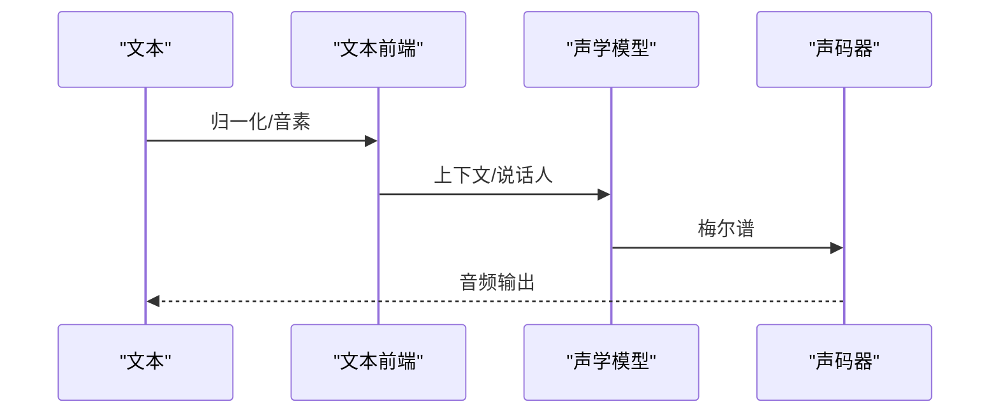

图表来源
- [07-text-to-speech/docs/en.md:22-48](file://phases/06-speech-and-audio/07-text-to-speech/docs/en.md#L22-L48)

章节来源
- [07-text-to-speech/docs/en.md:1-184](file://phases/06-speech-and-audio/07-text-to-speech/docs/en.md#L1-L184)

### 组件H：声音克隆与转换
- 克隆：F5-TTS/XTTS/OpenVoice零样本/少样本；参考文本必须严格对齐。
- 转换：KNN-VC/Diff-HierVC（识别-合成/离散潜变量）。
- 合规：水印（AudioSeal/WaveVerify）、同意门禁、检测（AASIST/RAWNet2）。

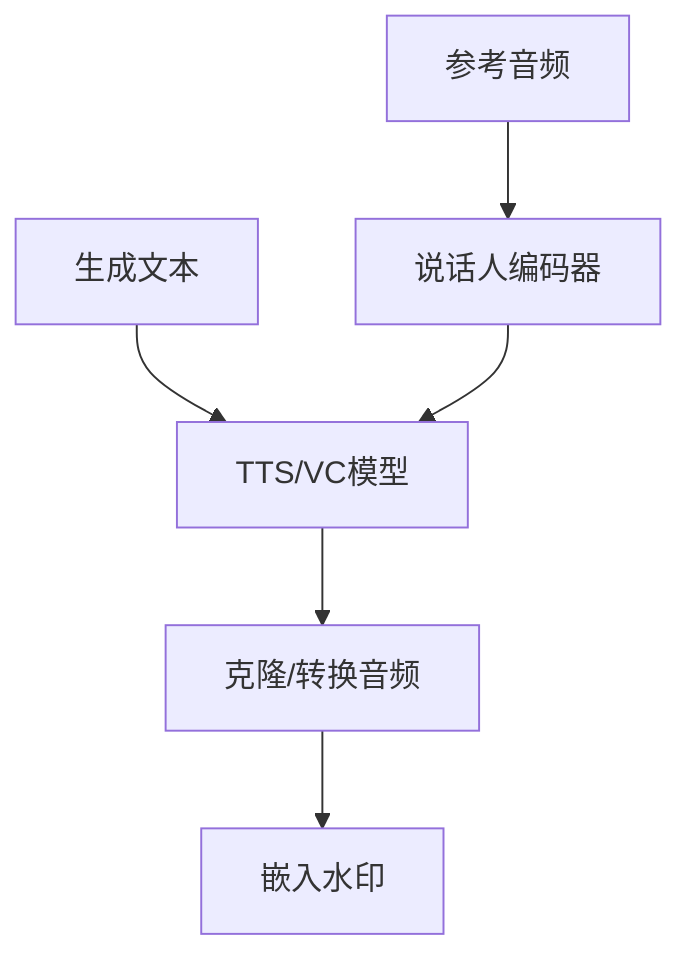

图表来源
- [08-voice-cloning-conversion/docs/en.md:27-46](file://phases/06-speech-and-audio/08-voice-cloning-conversion/docs/en.md#L27-L46)

章节来源
- [08-voice-cloning-conversion/docs/en.md:1-172](file://phases/06-speech-and-audio/08-voice-cloning-conversion/docs/en.md#L1-L172)

### 组件I：音乐生成
- 方法：Token-LM（MusicGen/ACE-Step）、扩散（Stable Audio）、混合（Suno/Udio）。
- 评估：FAD、CLAP、主观MOS；版权披露与许可策略。
- 实务：乐器/歌词条件、BPM控制、立体声重建、避免重复漂移。

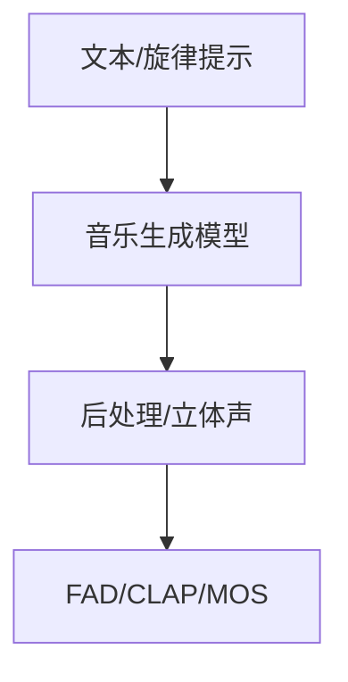

图表来源
- [09-music-generation/docs/en.md:22-44](file://phases/06-speech-and-audio/09-music-generation/docs/en.md#L22-L44)

章节来源
- [09-music-generation/docs/en.md:1-169](file://phases/06-speech-and-audio/09-music-generation/docs/en.md#L1-L169)

### 组件J：音频语言模型（ALM）
- 架构：音频编码器（Whisper/BEATs/CLAP）+投影+LLM（Qwen/GPT-4o）。
- 评测：MMAU-Pro、LongAudioBench；多音频子集尤为困难。
- 应用：合规审计、无障碍描述、内容审核、播客章节化。

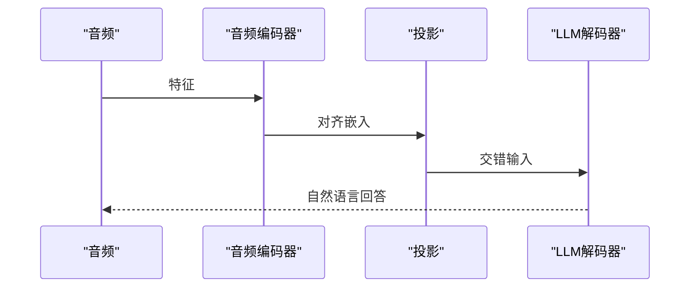

图表来源
- [10-audio-language-models/docs/en.md:25-37](file://phases/06-speech-and-audio/10-audio-language-models/docs/en.md#L25-L37)

章节来源
- [10-audio-language-models/docs/en.md:1-187](file://phases/06-speech-and-audio/10-audio-language-models/docs/en.md#L1-L187)

### 组件K：实时音频处理
- 关键瓶颈：麦克风→缓冲（20ms）、VAD（<1ms）、流式ASR（~150ms）、LLM首token（~100ms）、TTS首块（~100ms）、渲染（20ms）。
- 技术要点：环形缓冲、Silero VAD、流式ASR（Parakeet/Whisper-Streaming）、WebRTC Opus、回声抵消（AEC3）、打断处理。

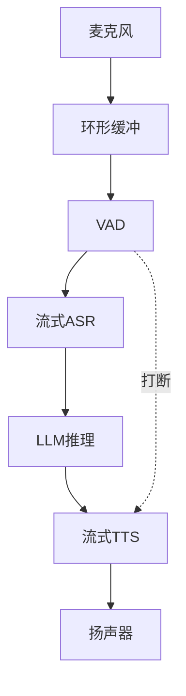

图表来源
- [11-real-time-audio-processing/docs/en.md:26-53](file://phases/06-speech-and-audio/11-real-time-audio-processing/docs/en.md#L26-L53)

章节来源
- [11-real-time-audio-processing/docs/en.md:1-175](file://phases/06-speech-and-audio/11-real-time-audio-processing/docs/en.md#L1-L175)

### 组件L：语音助手流水线
- 端到端：捕获→VAD→流式STT→工具调用→流式TTS→播放→打断。
- 质量目标：首字音频≤800ms；无漏词、无静音幻觉、无克隆泄露、无提示注入成功。
- 生产参考：LiveKit/Deepgram/GPT-4o/Cartesia 或 Pipecat/Whisper-Streaming/GPT-4o/Kokoro。

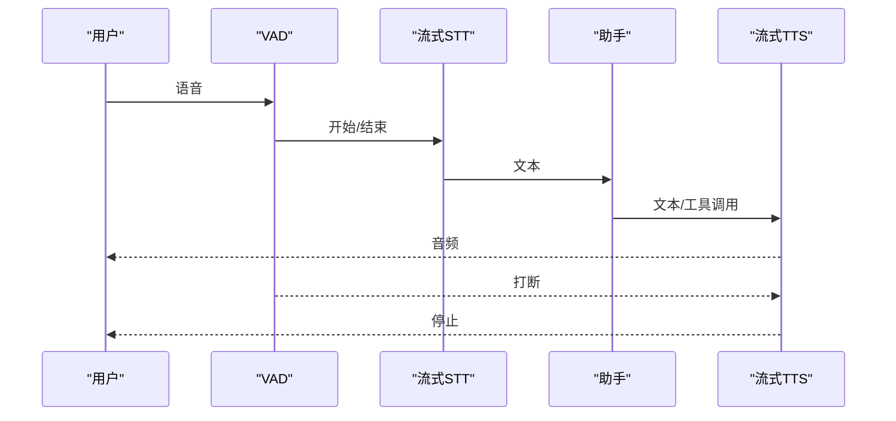

图表来源
- [12-voice-assistant-pipeline/docs/en.md:24-43](file://phases/06-speech-and-audio/12-voice-assistant-pipeline/docs/en.md#L24-L43)

章节来源
- [12-voice-assistant-pipeline/docs/en.md:1-178](file://phases/06-speech-and-audio/12-voice-assistant-pipeline/docs/en.md#L1-L178)

### 组件M：神经音频编解码器
- 核心思想：RVQ级联小码本；语义-音质分离（Mimi）。
- 任务映射：通用音乐→EnCodec；高保真→DAC；流式语音→SNAC/Mimi。
- 实务：帧率决定上下文长度；代码本0承载内容；匹配训练/推理帧率。

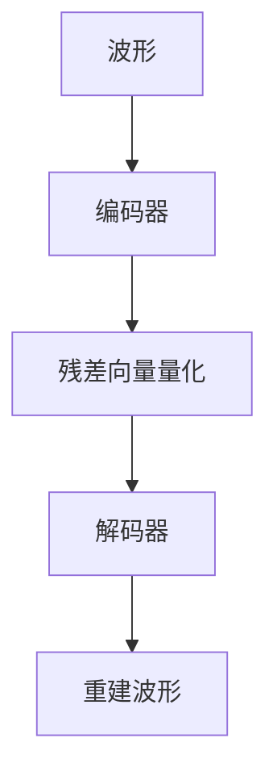

图表来源
- [13-neural-audio-codecs/docs/en.md:25-40](file://phases/06-speech-and-audio/13-neural-audio-codecs/docs/en.md#L25-L40)

章节来源
- [13-neural-audio-codecs/docs/en.md:1-186](file://phases/06-speech-and-audio/13-neural-audio-codecs/docs/en.md#L1-L186)

### 组件N：语音活动检测与轮流
- 三阶VAD：能量门→Silero→语义端点；静默挂起500-800ms；预滚300-500ms。
- 刷新技巧：VAD结束即发送flush触发STT立即输出，降低端到端延迟。

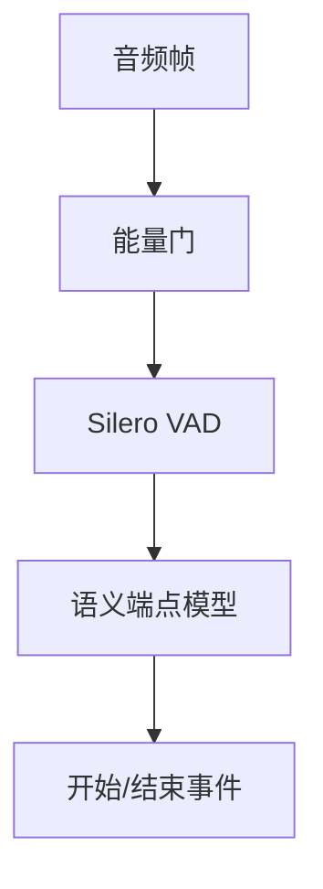

图表来源
- [14-voice-activity-detection-turn-taking/docs/en.md:24-43](file://phases/06-speech-and-audio/14-voice-activity-detection-turn-taking/docs/en.md#L24-L43)

章节来源
- [14-voice-activity-detection-turn-taking/docs/en.md:1-174](file://phases/06-speech-and-audio/14-voice-activity-detection-turn-taking/docs/en.md#L1-L174)

### 组件O：流式语音到语音（Moshe/Hibiki）
- Moshe：双Mimi流+内省文本，理论160ms，实际200ms；支持打断与回音。
- Hibiki：流式翻译，零对齐数据强化学习优化延迟。
- 适用场景：低延迟对话、实时翻译、研究演示。

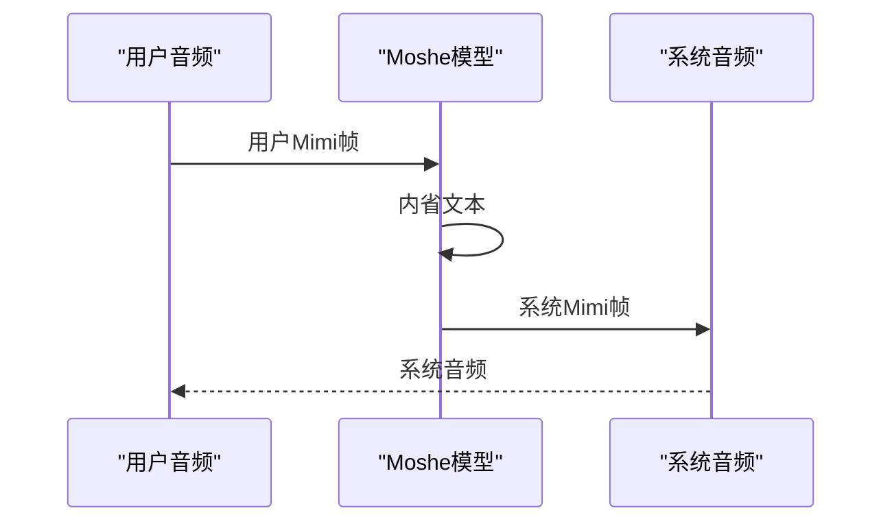

图表来源
- [15-streaming-speech-to-speech-moshi-hibiki/docs/en.md:22-48](file://phases/06-speech-and-audio/15-streaming-speech-to-speech-moshi-hibiki/docs/en.md#L22-L48)

章节来源
- [15-streaming-speech-to-speech-moshi-hibiki/docs/en.md:1-181](file://phases/06-speech-and-audio/15-streaming-speech-to-speech-moshi-hibiki/docs/en.md#L1-L181)

### 组件P：反欺骗与音频水印
- 检测：AASIST/RAWNet2/NeXt-TDNN；ASVspoof 5基准。
- 水印：AudioSeal/WaveVerify；C2PA溯源；联合训练生成器-检测器。
- 实务：水印+检测+签名缺一不可；校准域内阈值；规避音高偏移攻击。

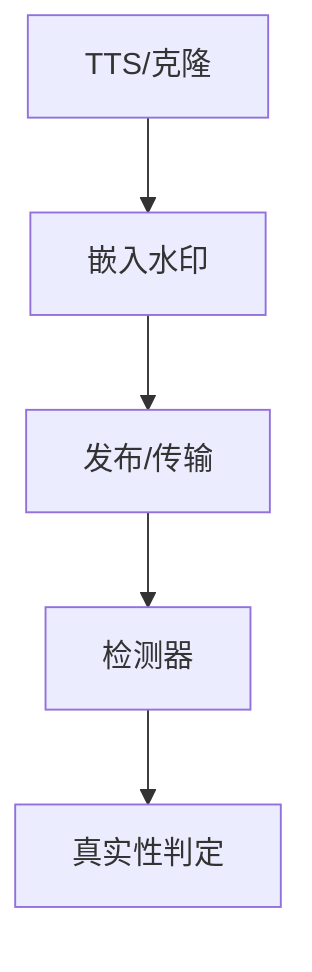

图表来源
- [16-anti-spoofing-audio-watermarking/docs/en.md:43-63](file://phases/06-speech-and-audio/16-anti-spoofing-audio-watermarking/docs/en.md#L43-L63)

章节来源
- [16-anti-spoofing-audio-watermarking/docs/en.md:1-193](file://phases/06-speech-and-audio/16-anti-spoofing-audio-watermarking/docs/en.md#L1-L193)

### 组件Q：音频评估指标
- ASR：WER/CER（词/字符级）、RTFx、首token延迟。
- TTS：MOS/UTMOS、SECS、Round-trip WER、TTFA。
- 克隆：SECS+MOS+CER三元组。
- 说话人：EER/minDCF。
- 分割：DER/JER。
- 分类：top-1/mAP/宏F1/每类召回率。
- 音乐：FAD、CLAP、主观MOS。
- ALM：MMAU-Pro、LongAudioBench、AudioCaps FENSE。
- 实时S2S：延迟P50/P95、WER/MOS、打断响应。

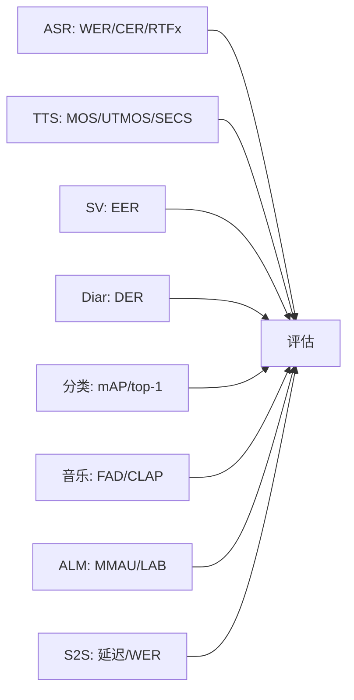

图表来源
- [17-audio-evaluation-metrics/docs/en.md:102-113](file://phases/06-speech-and-audio/17-audio-evaluation-metrics/docs/en.md#L102-L113)

章节来源
- [17-audio-evaluation-metrics/docs/en.md:1-225](file://phases/06-speech-and-audio/17-audio-evaluation-metrics/docs/en.md#L1-L225)

## 依赖关系分析
- 层次依赖：音频基础 → 特征提取 → 分类/识别 → 语音合成 → 克隆转换 → 音乐生成 → 多模态理解 → 实时处理 → 全双工对话 → 安全合规 → 评估度量。
- 横向耦合：VAD/ASR/TTS/工具调用/水印/评估贯穿所有流水线。
- 外部依赖：Whisper/Transformers/NeMo/Pyannote/Silero/AudioSeal/Leaderboards。

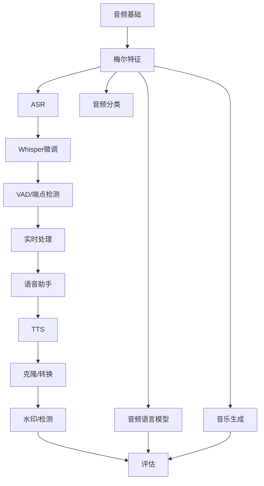

图表来源
- [01-audio-fundamentals/docs/en.md:22-47](file://phases/06-speech-and-audio/01-audio-fundamentals/docs/en.md#L22-L47)
- [11-real-time-audio-processing/docs/en.md:26-53](file://phases/06-speech-and-audio/11-real-time-audio-processing/docs/en.md#L26-L53)
- [12-voice-assistant-pipeline/docs/en.md:24-43](file://phases/06-speech-and-audio/12-voice-assistant-pipeline/docs/en.md#L24-L43)
- [17-audio-evaluation-metrics/docs/en.md:102-113](file://phases/06-speech-and-audio/17-audio-evaluation-metrics/docs/en.md#L102-L113)

## 性能考量
- 采样率与抗混叠：始终在降采样前低通滤波；匹配下游模型采样率。
- 特征稳定性：mel数量/采样率一致性；log-mel vs dB；归一化一致性。
- 推理效率：Whisper微调（LoRA）、faster-whisper、流式ASR、流式TTS、编解码器帧率。
- 实时性：缓冲区大小、VAD阈值、打断处理、网络抖动缓冲、回声抵消。
- 评估稳健性：报告分布（P50/P95/P99）、按子群体拆分、公开基准复现。

## 故障排查指南
- 常见问题清单
  - 采样率不匹配：上游16kHz，下游22.05kHz，导致特征错位。解决：统一采样率。
  - 未加VAD：Whisper在静音产生幻觉。解决：始终VAD门控。
  - 代码本/帧率不一致：Mimi 12.5Hz训练，EnCodec 75Hz推理，效果差。解决：保持一致。
  - 水印缺失：欧盟/加州法律要求。解决：AudioSeal嵌入+签名。
  - 阈值固定：不同环境阈值不同。解决：域内校准。
  - 评估指标误用：仅看平均WER，忽略子类/子人群。解决：分层报告。
- 快速定位
  - 使用日志记录各阶段耗时与吞吐（RTFx）。
  - 在开发集上运行公开基准（Open ASR/TTS Arena/MMAU）。
  - 对比不同窗长/步长/滤波器组对特征的影响。

章节来源
- [04-speech-recognition-asr/docs/en.md:146-151](file://phases/06-speech-and-audio/04-speech-recognition-asr/docs/en.md#L146-L151)
- [05-whisper-architecture-finetuning/docs/en.md:152-157](file://phases/06-speech-and-audio/05-whisper-architecture-finetuning/docs/en.md#L152-L157)
- [13-neural-audio-codecs/docs/en.md:149-154](file://phases/06-speech-and-audio/13-neural-audio-codecs/docs/en.md#L149-L154)
- [16-anti-spoofing-audio-watermarking/docs/en.md:155-161](file://phases/06-speech-and-audio/16-anti-spoofing-audio-watermarking/docs/en.md#L155-L161)
- [17-audio-evaluation-metrics/docs/en.md:184-190](file://phases/06-speech-and-audio/17-audio-evaluation-metrics/docs/en.md#L184-L190)

## 结论
本阶段构建了从底层信号到端到端应用的完整知识与工程框架。掌握音频基础、梅尔特征、分类/识别、TTS/克隆、音乐生成、多模态理解、实时处理、全双工对话、安全合规与评估指标，是交付高质量语音产品与服务的关键。建议以Whisper/TTS/编解码器为核心，结合VAD/ASR/TTS/工具链与水印/检测，建立可迭代的评估与发布流程。

## 附录
- 进阶阅读
  - Shannon采样定理、Smith数字信号处理、Heinrich Kuttruff房间声学、Steve Eddins FFT解读。
  - Davis MFCC、Stevens mel标度、OpenAI Whisper源码、librosa特征提取。
  - Gong AST、Chen BEATs、Park SpecAugment、Piczak ESC-50、Gemmeke AudioSet。
  - Graves CTC、Graves RNN-T、Radford Whisper、NVIDIA NeMo Parakeet。
  - Snyder x-vector、Desplanques ECAPA-TDNN、Chen WavLM、Bredin pyannote。
  - Shen Tacotron 2、Kim VITS、Chen F5-TTS、Kong HiFi-GAN、Kokoro。
  - Copet MusicGen、Evans Stable Audio、ACE-Step、Suno/Udio法律影响。
  - Chu Qwen2-Audio、NVIDIA Audio Flamingo、MMAU/LongAudioBench。
  - Kyutai Moshi、WaveVerify、SilentCipher、ASVspoof 5、C2PA。
  - jiwer WER/CER、UTMOS、FAD、Open ASR/TTS Arena/MMAU。