# 阶段7：变换器深度解析

<cite>
**本文引用的文件**
- [README.md](file://phases/07-transformers-deep-dive/README.md)
- [01-why-transformers/docs/en.md](file://phases/07-transformers-deep-dive/01-why-transformers/docs/en.md)
- [02-self-attention-from-scratch/docs/en.md](file://phases/07-transformers-deep-dive/02-self-attention-from-scratch/docs/en.md)
- [03-multi-head-attention/docs/en.md](file://phases/07-transformers-deep-dive/03-multi-head-attention/docs/en.md)
- [04-positional-encoding/docs/en.md](file://phases/07-transformers-deep-dive/04-positional-encoding/docs/en.md)
- [05-full-transformer/docs/en.md](file://phases/07-transformers-deep-dive/05-full-transformer/docs/en.md)
- [06-bert-masked-language-modeling/docs/en.md](file://phases/07-transformers-deep-dive/06-bert-masked-language-modeling/docs/en.md)
- [07-gpt-causal-language-modeling/docs/en.md](file://phases/07-transformers-deep-dive/07-gpt-causal-language-modeling/docs/en.md)
- [08-t5-bart-encoder-decoder/docs/en.md](file://phases/07-transformers-deep-dive/08-t5-bart-encoder-decoder/docs/en.md)
- [09-vision-transformers/docs/en.md](file://phases/07-transformers-deep-dive/09-vision-transformers/docs/en.md)
- [10-audio-transformers-whisper/docs/en.md](file://phases/07-transformers-deep-dive/10-audio-transformers-whisper/docs/en.md)
- [11-mixture-of-experts/docs/en.md](file://phases/07-transformers-deep-dive/11-mixture-of-experts/docs/en.md)
- [12-kv-cache-flash-attention/docs/en.md](file://phases/07-transformers-deep-dive/12-kv-cache-flash-attention/docs/en.md)
- [13-scaling-laws/docs/en.md](file://phases/07-transformers-deep-dive/13-scaling-laws/docs/en.md)
- [14-build-a-transformer-capstone/docs/en.md](file://phases/07-transformers-deep-dive/14-build-a-transformer-capstone/docs/en.md)
</cite>

## 目录
1. [引言](#引言)
2. [项目结构](#项目结构)
3. [核心组件](#核心组件)
4. [架构总览](#架构总览)
5. [详细组件分析](#详细组件分析)
6. [依赖关系分析](#依赖关系分析)
7. [性能考量](#性能考量)
8. [故障排查指南](#故障排查指南)
9. [结论](#结论)
10. [附录](#附录)

## 引言
本阶段系统性覆盖Transformer从底层注意力机制到端到端应用的完整知识体系，包含：自注意力从零实现、多头注意力、位置编码、完整Transformer块、BERT掩码语言建模、GPT因果语言建模、T5/BART编码器-解码器、视觉Transformer、音频变换器Whisper、专家混合（MoE）、KV缓存与Flash Attention、缩放定律、综合项目实战以及注意力变体与推测式解码等16门核心课程。目标是让学习者不仅“会用”，更能“深挖”Transformer的原理、优化与工程落地。

## 项目结构
该阶段位于“phases/07-transformers-deep-dive”，每个子课程由“课程编号-主题”命名，包含：
- docs/en.md：课程讲义与概念说明
- code/：可运行的示例代码（Python/NumPy/PyTorch）
- assets/：配套图示与资源
- outputs/：技能评估与提示词产物
- notebook/：可选的交互式笔记本

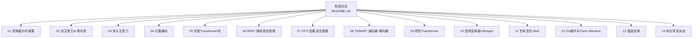

图表来源
- [README.md:1-6](file://phases/07-transformers-deep-dive/README.md#L1-L6)

章节来源
- [README.md:1-6](file://phases/07-transformers-deep-dive/README.md#L1-L6)

## 核心组件
本阶段围绕“注意力”这一核心机制展开，逐步构建从单头到多头、从绝对位置到旋转位置编码、从纯自注意力到编码器-解码器、再到多模态（图像、音频）与工程优化（MoE、KV缓存、Flash Attention、缩放定律）的知识闭环。关键组件包括：
- 自注意力与缩放点积注意力
- 多头注意力与分组查询注意力（GQA）
- 绝对正弦、旋转位置编码（RoPE）与线性偏差（ALiBi）
- Transformer块（预归一化、RMSNorm、SwiGLU、交叉注意力）
- 任务范式：MLM（BERT）、NCP（GPT）、Span Corruption（T5）、文本转文本（BART）
- 多模态扩展：ViT（图像）、Whisper（语音）
- 扩展与优化：MoE、KV缓存、Flash Attention、推测式解码
- 训练与推理：缩放定律、连续批处理、分页KV缓存、前缀缓存

章节来源
- [02-self-attention-from-scratch/docs/en.md:1-335](file://phases/07-transformers-deep-dive/02-self-attention-from-scratch/docs/en.md#L1-L335)
- [03-multi-head-attention/docs/en.md:1-164](file://phases/07-transformers-deep-dive/03-multi-head-attention/docs/en.md#L1-L164)
- [04-positional-encoding/docs/en.md:1-186](file://phases/07-transformers-deep-dive/04-positional-encoding/docs/en.md#L1-L186)
- [05-full-transformer/docs/en.md:1-175](file://phases/07-transformers-deep-dive/05-full-transformer/docs/en.md#L1-L175)
- [06-bert-masked-language-modeling/docs/en.md:1-163](file://phases/07-transformers-deep-dive/06-bert-masked-language-modeling/docs/en.md#L1-L163)
- [07-gpt-causal-language-modeling/docs/en.md:1-164](file://phases/07-transformers-deep-dive/07-gpt-causal-language-modeling/docs/en.md#L1-L164)
- [08-t5-bart-encoder-decoder/docs/en.md:1-165](file://phases/07-transformers-deep-dive/08-t5-bart-encoder-decoder/docs/en.md#L1-L165)
- [09-vision-transformers/docs/en.md:1-153](file://phases/07-transformers-deep-dive/09-vision-transformers/docs/en.md#L1-L153)
- [10-audio-transformers-whisper/docs/en.md:1-195](file://phases/07-transformers-deep-dive/10-audio-transformers-whisper/docs/en.md#L1-L195)
- [11-mixture-of-experts/docs/en.md:1-169](file://phases/07-transformers-deep-dive/11-mixture-of-experts/docs/en.md#L1-L169)
- [12-kv-cache-flash-attention/docs/en.md:1-239](file://phases/07-transformers-deep-dive/12-kv-cache-flash-attention/docs/en.md#L1-L239)
- [13-scaling-laws/docs/en.md:1-160](file://phases/07-transformers-deep-dive/13-scaling-laws/docs/en.md#L1-L160)
- [14-build-a-transformer-capstone/docs/en.md:1-175](file://phases/07-transformers-deep-dive/14-build-a-transformer-capstone/docs/en.md#L1-L175)

## 架构总览
下图展示了从注意力到端到端模型的关键路径：嵌入与位置编码 → 注意力层（自注意力/交叉注意力）→ 前馈网络（SwiGLU）→ 残差连接与归一化 → 输出头（LM或分类/回归）。

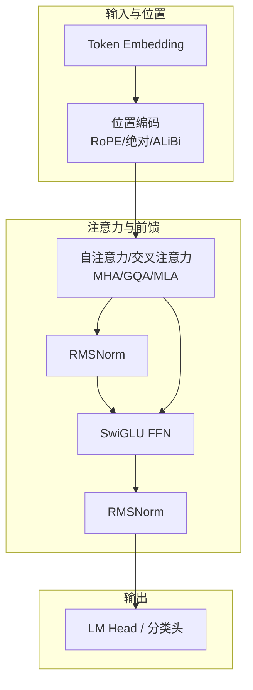

图表来源
- [05-full-transformer/docs/en.md:37-72](file://phases/07-transformers-deep-dive/05-full-transformer/docs/en.md#L37-L72)
- [04-positional-encoding/docs/en.md:24-78](file://phases/07-transformers-deep-dive/04-positional-encoding/docs/en.md#L24-L78)
- [03-multi-head-attention/docs/en.md:18-43](file://phases/07-transformers-deep-dive/03-multi-head-attention/docs/en.md#L18-L43)

## 详细组件分析

### 自注意力与缩放点积
- 核心思想：每个位置通过查询-键相似度计算注意力权重，再加权聚合值向量；为避免高维点积饱和，使用1/√d维度缩放。
- 关键流程：Q=XWq，K=XWk，V=XWv；S=QK^T/√d；P=softmax(S)；输出=P·V。
- 实现要点：数值稳定（减去最大值）、掩码（因果掩码）与可视化热图。

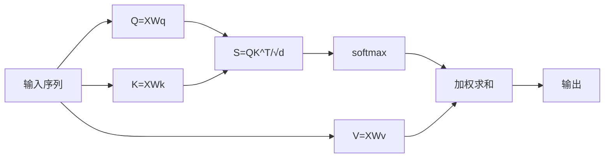

图表来源
- [02-self-attention-from-scratch/docs/en.md:145-168](file://phases/07-transformers-deep-dive/02-self-attention-from-scratch/docs/en.md#L145-L168)

章节来源
- [02-self-attention-from-scratch/docs/en.md:1-335](file://phases/07-transformers-deep-dive/02-self-attention-from-scratch/docs/en.md#L1-L335)

### 多头注意力与GQA/MLA
- 多头：将嵌入投影到多个子空间并行计算注意力，最后拼接并通过输出投影融合。
- GQA：每头独立的Q，K/V按更少的组共享，推理时显著降低KV缓存占用。
- MLA：将K/V压缩到低秩潜空间，推理时再解码，进一步节省内存。

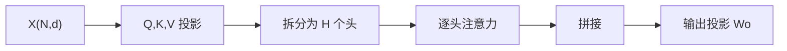

图表来源
- [03-multi-head-attention/docs/en.md:45-83](file://phases/07-transformers-deep-dive/03-multi-head-attention/docs/en.md#L45-L83)

章节来源
- [03-multi-head-attention/docs/en.md:1-164](file://phases/07-transformers-deep-dive/03-multi-head-attention/docs/en.md#L1-L164)

### 位置编码：绝对、RoPE与ALiBi
- 绝对正弦：在嵌入上加固定频率的sin/cos，简单但外推能力弱。
- RoPE：对Q/K进行基于位置的角度旋转，直接在点积中编码相对距离，现代主流。
- ALiBi：在注意力分数上加入与距离成比例的负偏置，无需额外嵌入，外推能力强。

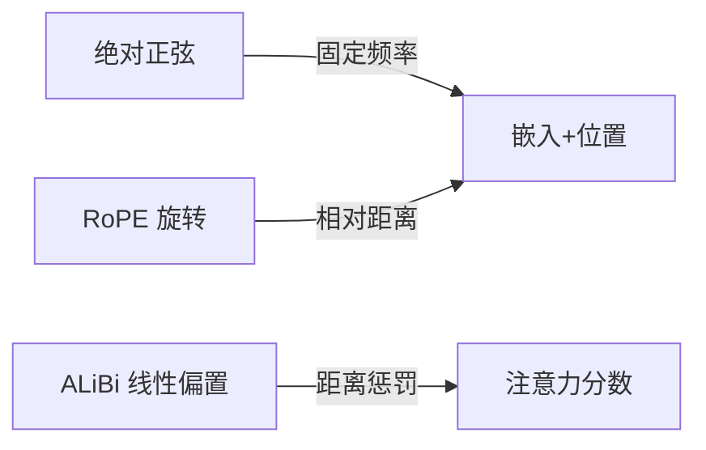

图表来源
- [04-positional-encoding/docs/en.md:24-78](file://phases/07-transformers-deep-dive/04-positional-encoding/docs/en.md#L24-L78)

章节来源
- [04-positional-encoding/docs/en.md:1-186](file://phases/07-transformers-deep-dive/04-positional-encoding/docs/en.md#L1-L186)

### 完整Transformer块（预归一化、RMSNorm、SwiGLU）
- 结构：LN → MHA → 残差 → LN → FFN（SwiGLU）→ 残差。
- 现代默认：RMSNorm替代LayerNorm，SwiGLU替代ReLU/GELU，RoPE替代绝对位置编码，GQA/MLA替代全量MHA。

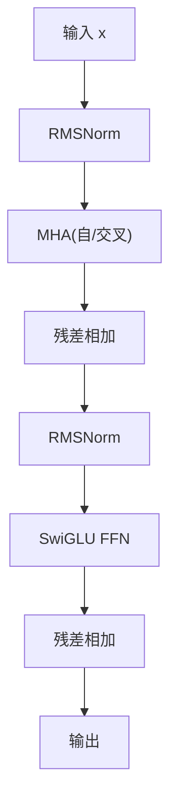

图表来源
- [05-full-transformer/docs/en.md:37-54](file://phases/07-transformers-deep-dive/05-full-transformer/docs/en.md#L37-L54)

章节来源
- [05-full-transformer/docs/en.md:1-175](file://phases/07-transformers-deep-dive/05-full-transformer/docs/en.md#L1-L175)

### BERT 掩码语言建模（MLM）
- 思想：随机遮蔽15%的token，训练模型从双向上下文预测被遮蔽项；80%替换为[MASK]，10%替换为随机词，10%保持原词。
- 现代化：RoPE、GeGLU、交替局部+全局注意力、8K上下文。

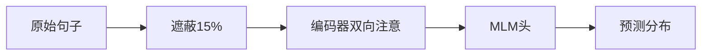

图表来源
- [06-bert-masked-language-modeling/docs/en.md:20-78](file://phases/07-transformers-deep-dive/06-bert-masked-language-modeling/docs/en.md#L20-L78)

章节来源
- [06-bert-masked-language-modeling/docs/en.md:1-163](file://phases/07-transformers-deep-dive/06-bert-masked-language-modeling/docs/en.md#L1-L163)

### GPT 因果语言建模（NCP）
- 核心：因果掩码确保每个位置仅关注过去；损失为移位后的交叉熵；推理时自回归生成。
- 解码策略：贪心、温度采样、Top-k、Top-p（核采样）、Min-p；2026默认min-p+温度0.7。

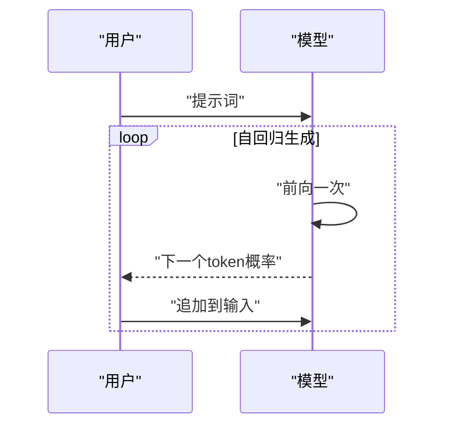

图表来源
- [07-gpt-causal-language-modeling/docs/en.md:37-81](file://phases/07-transformers-deep-dive/07-gpt-causal-language-modeling/docs/en.md#L37-L81)

章节来源
- [07-gpt-causal-language-modeling/docs/en.md:1-164](file://phases/07-transformers-deep-dive/07-gpt-causal-language-modeling/docs/en.md#L1-L164)

### T5 与 BART 编码器-解码器
- T5：将所有NLP任务统一为“文本到文本”，输入被随机span遮蔽，输出仅重建对应span。
- BART：多噪声去噪（遮蔽、删除、填充、打乱、旋转），解码器重建原文。
- 推理：与GPT一致，beam搜索在翻译/摘要等任务上更稳定。

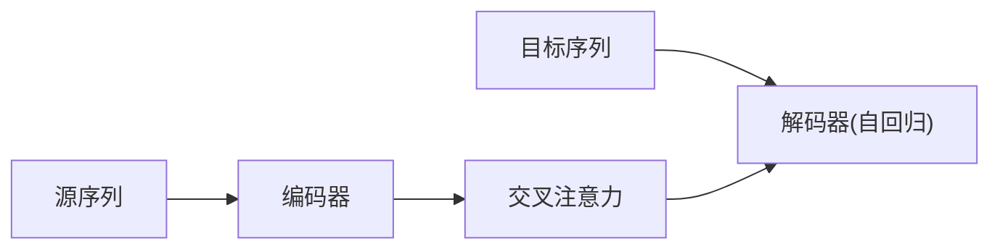

图表来源
- [08-t5-bart-encoder-decoder/docs/en.md:37-50](file://phases/07-transformers-deep-dive/08-t5-bart-encoder-decoder/docs/en.md#L37-L50)

章节来源
- [08-t5-bart-encoder-decoder/docs/en.md:1-165](file://phases/07-transformers-deep-dive/08-t5-bart-encoder-decoder/docs/en.md#L1-L165)

### 视觉Transformer（ViT）
- 将图像切分为固定大小的补丁，线性映射为嵌入，添加[CLS]与位置编码，送入标准Transformer编码器。
- 变体：DeiT（蒸馏）、Swin（窗口化）、DINOv2（自监督）、SAM3（分割）。

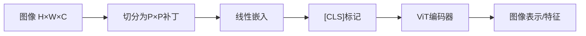

图表来源
- [09-vision-transformers/docs/en.md:20-51](file://phases/07-transformers-deep-dive/09-vision-transformers/docs/en.md#L20-L51)

章节来源
- [09-vision-transformers/docs/en.md:1-153](file://phases/07-transformers-deep-dive/09-vision-transformers/docs/en.md#L1-L153)

### 音频变换器 Whisper
- 输入：音频重采样与窗化，生成log-mel谱；卷积主干降采样；编码器处理时间步；解码器生成文本token（含任务控制token）。
- 大小：Tiny到Large-v3，Large-v3-turbo将解码器从32层降至4层以提速。

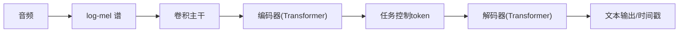

图表来源
- [10-audio-transformers-whisper/docs/en.md:22-61](file://phases/07-transformers-deep-dive/10-audio-transformers-whisper/docs/en.md#L22-L61)

章节来源
- [10-audio-transformers-whisper/docs/en.md:1-195](file://phases/07-transformers-deep-dive/10-audio-transformers-whisper/docs/en.md#L1-L195)

### 专家混合（MoE）
- 思想：将FFN替换为E个专家，路由选择k个专家，激活参数与计算均摊到k个专家。
- 平衡：辅助损失-free平衡（通过专家偏置调节top-k选择），共享专家捕获通用知识。
- 成本：所有专家权重常驻显存，需专家并行通信。

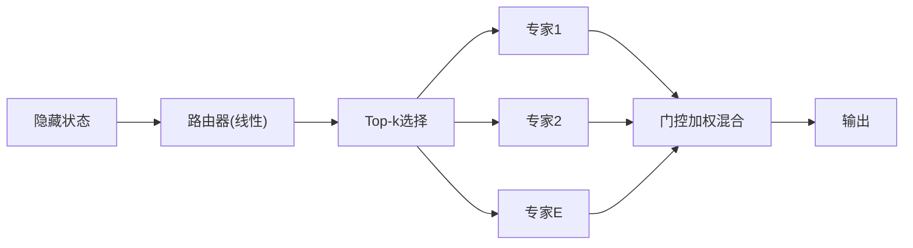

图表来源
- [11-mixture-of-experts/docs/en.md:18-52](file://phases/07-transformers-deep-dive/11-mixture-of-experts/docs/en.md#L18-L52)

章节来源
- [11-mixture-of-experts/docs/en.md:1-169](file://phases/07-transformers-deep-dive/11-mixture-of-experts/docs/en.md#L1-L169)

### KV缓存、Flash Attention与推理优化
- KV缓存：存储历史K/V，新token仅对缓存执行注意力，将生成复杂度从O(N^2)降至O(N)。
- Flash Attention：分块在片上内存完成softmax与乘法，减少HBM往返，显著提升吞吐。
- 推测式解码：廉价草稿模型提出N个token，大模型并行验证，典型k≈3–5。
- 连续批处理与分页KV缓存：动态调度请求、虚拟内存管理，提升吞吐与内存利用。

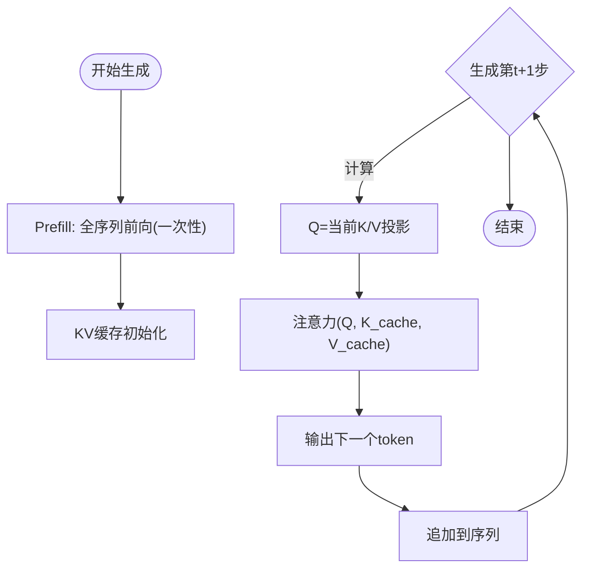

图表来源
- [12-kv-cache-flash-attention/docs/en.md:10-60](file://phases/07-transformers-deep-dive/12-kv-cache-flash-attention/docs/en.md#L10-L60)

章节来源
- [12-kv-cache-flash-attention/docs/en.md:1-239](file://phases/07-transformers-deep-dive/12-kv-cache-flash-attention/docs/en.md#L1-L239)

### 缩放定律
- 经典：L(N,D)=A/N^α + B/D^β + E；最优比约20 tokens/参数。
- 2026现实：面向推理成本优先，实际部署常采用更高D/N（如Llama 3 8B达~1875），以换取更低推理延迟与更好的性价比。
- 影响因素：数据质量、MoE（总参数与活跃FLOPs解耦）、后训练（SFT+RLHF）、多模态、合成数据与优化器（如Muon）。

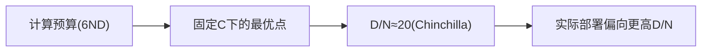

图表来源
- [13-scaling-laws/docs/en.md:29-51](file://phases/07-transformers-deep-dive/13-scaling-laws/docs/en.md#L29-L51)

章节来源
- [13-scaling-laws/docs/en.md:1-160](file://phases/07-transformers-deep-dive/13-scaling-laws/docs/en.md#L1-L160)

### 综合项目实战：从零构建Transformer
- 数据：Char-level分词（tinyshakespeare）。
- 模型：预归一化、RMSNorm、SwiGLU、因果MHA、 tied嵌入。
- 训练：AdamW、余弦学习率、梯度裁剪、bf16自动混合精度。
- 产出：训练损失收敛至~1.5以内，采样输出具备莎士比亚风格。

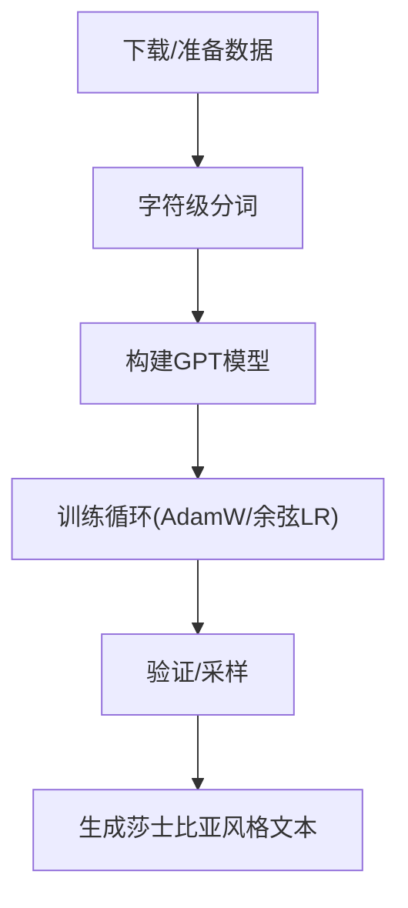

图表来源
- [14-build-a-transformer-capstone/docs/en.md:78-136](file://phases/07-transformers-deep-dive/14-build-a-transformer-capstone/docs/en.md#L78-L136)

章节来源
- [14-build-a-transformer-capstone/docs/en.md:1-175](file://phases/07-transformers-deep-dive/14-build-a-transformer-capstone/docs/en.md#L1-L175)

## 依赖关系分析
- 课程依赖：01为动机与瓶颈；02/03/04提供注意力基础；05整合为完整块；06/07/08分别覆盖三类任务范式；09/10扩展到视觉与音频；11/12/13引入MoE、KV缓存与缩放定律；14作为综合项目串联所有知识点。
- 工程依赖：PyTorch（nn.Module、scaled_dot_product_attention、RMSNorm、SwiGLU）、HuggingFace Transformers（模型加载与生成）、vLLM/TensorRT-LLM（生产推理栈）。

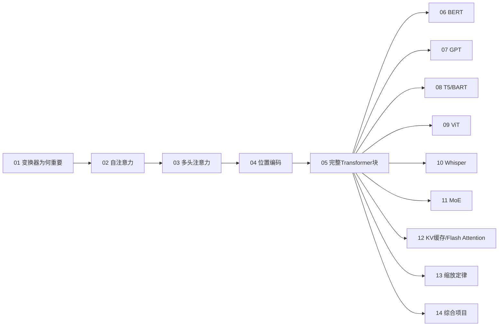

图表来源
- [README.md:1-6](file://phases/07-transformers-deep-dive/README.md#L1-L6)
- [02-self-attention-from-scratch/docs/en.md:1-335](file://phases/07-transformers-deep-dive/02-self-attention-from-scratch/docs/en.md#L1-L335)
- [03-multi-head-attention/docs/en.md:1-164](file://phases/07-transformers-deep-dive/03-multi-head-attention/docs/en.md#L1-L164)
- [04-positional-encoding/docs/en.md:1-186](file://phases/07-transformers-deep-dive/04-positional-encoding/docs/en.md#L1-L186)
- [05-full-transformer/docs/en.md:1-175](file://phases/07-transformers-deep-dive/05-full-transformer/docs/en.md#L1-L175)
- [06-bert-masked-language-modeling/docs/en.md:1-163](file://phases/07-transformers-deep-dive/06-bert-masked-language-modeling/docs/en.md#L1-L163)
- [07-gpt-causal-language-modeling/docs/en.md:1-164](file://phases/07-transformers-deep-dive/07-gpt-causal-language-modeling/docs/en.md#L1-L164)
- [08-t5-bart-encoder-decoder/docs/en.md:1-165](file://phases/07-transformers-deep-dive/08-t5-bart-encoder-decoder/docs/en.md#L1-L165)
- [09-vision-transformers/docs/en.md:1-153](file://phases/07-transformers-deep-dive/09-vision-transformers/docs/en.md#L1-L153)
- [10-audio-transformers-whisper/docs/en.md:1-195](file://phases/07-transformers-deep-dive/10-audio-transformers-whisper/docs/en.md#L1-L195)
- [11-mixture-of-experts/docs/en.md:1-169](file://phases/07-transformers-deep-dive/11-mixture-of-experts/docs/en.md#L1-L169)
- [12-kv-cache-flash-attention/docs/en.md:1-239](file://phases/07-transformers-deep-dive/12-kv-cache-flash-attention/docs/en.md#L1-L239)
- [13-scaling-laws/docs/en.md:1-160](file://phases/07-transformers-deep-dive/13-scaling-laws/docs/en.md#L1-L160)
- [14-build-a-transformer-capstone/docs/en.md:1-175](file://phases/07-transformers-deep-dive/14-build-a-transformer-capstone/docs/en.md#L1-L175)

## 性能考量
- 计算瓶颈：训练阶段FLOP受限；推理阶段内存与带宽受限（KV缓存、注意力矩阵）。
- 优化手段：
  - KV缓存：O(N^2)→O(N)，显著降低生成延迟。
  - Flash Attention：分块tile，减少HBM往返，提升吞吐。
  - GQA/MLA：降低KV缓存与带宽压力。
  - 推测式解码：以草稿模型换取更高吞吐。
  - 连续批处理与分页KV缓存：提升资源利用率与稳定性。
  - 缩放定律：在给定预算下选择最优(N,D)或过训练策略以优化推理成本。

## 故障排查指南
- 注意力数值不稳定：检查softmax前是否减去最大值；确认缩放因子1/√d正确。
- 掩码错误：因果掩码应为上三角负无穷；验证softmax后对应位置权重为0。
- 位置编码不生效：RoPE需对Q/K同时施加相同位置角度；确认旋转矩阵正确。
- KV缓存不一致：确保每层每头的K/V按生成顺序追加；验证读写索引一致。
- Flash Attention差异：注意tile边界与running softmax归一化；确认与标准实现bit等价。
- MoE负载不平衡：启用辅助损失free平衡（专家偏置）；监控专家使用率分布。
- 缩放定律偏离：检查数据质量、有效计算倍增（优化器/MoE/数据增强）与部署工作负载。

章节来源
- [12-kv-cache-flash-attention/docs/en.md:102-124](file://phases/07-transformers-deep-dive/12-kv-cache-flash-attention/docs/en.md#L102-L124)
- [11-mixture-of-experts/docs/en.md:44-62](file://phases/07-transformers-deep-dive/11-mixture-of-experts/docs/en.md#L44-L62)
- [04-positional-encoding/docs/en.md:133-136](file://phases/07-transformers-deep-dive/04-positional-encoding/docs/en.md#L133-L136)
- [07-gpt-causal-language-modeling/docs/en.md:85-94](file://phases/07-transformers-deep-dive/07-gpt-causal-language-modeling/docs/en.md#L85-L94)

## 结论
本阶段以“注意力”为核心，系统梳理了从理论到工程的完整路径：理解RNN瓶颈、掌握自注意力与多头注意力、引入位置编码、构建完整Transformer块、应用到不同任务范式（MLM、NCP、Span Corruption、文本转文本）、扩展到视觉与音频、并引入MoE、KV缓存、Flash Attention与缩放定律等工程优化。通过综合项目实战，学习者可以将所学串联为可运行的端到端系统，并为进一步探索前沿模型与工程实践打下坚实基础。

## 附录
- 学习建议：按顺序完成14门课程，先理解概念与实现，再动手工程化；结合练习与项目复盘。
- 进阶方向：探索更多注意力变体（稀疏注意力、线性注意力）、推理加速（分页KV缓存、前缀缓存、推测式解码）、多模态统一架构（CLIP、Flamingo、Video+Language）与高效训练（MoE、数据并行、流水并行）。