# 阶段8：生成式AI

<cite>
**本文引用的文件**
- [README.md](file://phases/08-generative-ai/README.md)
- [01-生成模型分类与历史/zh.md](file://phases/08-generative-ai/01-generative-models-taxonomy-history/docs/zh.md)
- [02-自编码器VAE/zh.md](file://phases/08-generative-ai/02-autoencoders-vae/docs/zh.md)
- [03-GAN生成器-判别器/zh.md](file://phases/08-generative-ai/03-gans-generator-discriminator/docs/zh.md)
- [04-条件GAN与Pix2Pix/zh.md](file://phases/08-generative-ai/04-conditional-gans-pix2pix/docs/zh.md)
- [05-StyleGAN/zh.md](file://phases/08-generative-ai/05-stylegan/docs/zh.md)
- [06-扩散模型DDPM从零实现/zh.md](file://phases/08-generative-ai/06-diffusion-ddpm-from-scratch/docs/zh.md)
- [07-潜在扩散Stable Diffusion/zh.md](file://phases/08-generative-ai/07-latent-diffusion-stable-diffusion/docs/zh.md)
- [08-ControlNetLoRA条件控制/zh.md](file://phases/08-generative-ai/08-controlnet-lora-conditioning/docs/zh.md)
- [09-修复填充编辑/zh.md](file://phases/08-generative-ai/09-inpainting-outpainting-editing/docs/zh.md)
- [10-视频生成/zh.md](file://phases/08-generative-ai/10-video-generation/docs/zh.md)
- [11-音频生成/zh.md](file://phases/08-generative-ai/11-audio-generation/docs/zh.md)
- [12-3D生成/zh.md](file://phases/08-generative-ai/12-3d-generation/docs/zh.md)
- [13-流匹配修正流/zh.md](file://phases/08-generative-ai/13-flow-matching-rectified-flows/docs/zh.md)
- [14-评估指标FIDCLIPScore/zh.md](file://phases/08-generative-ai/14-evaluation-fid-clip-score/docs/zh.md)
- [19-视觉自回归VAR/zh.md](file://phases/08-generative-ai/19-visual-autoregressive-var/docs/zh.md)
</cite>

## 目录
1. [简介](#简介)
2. [项目结构](#项目结构)
3. [核心组件](#核心组件)
4. [架构总览](#架构总览)
5. [详细组件分析](#详细组件分析)
6. [依赖分析](#依赖分析)
7. [性能考虑](#性能考虑)
8. [故障排查指南](#故障排查指南)
9. [结论](#结论)
10. [附录](#附录)

## 简介
本阶段系统性覆盖生成式AI从基础理论到工业落地的完整知识体系，共14门核心课程，总计约14小时。课程围绕“生成模型分类与历史”“VAE”“GAN”“条件GAN/Pix2Pix”“StyleGAN”“扩散模型/DDPM”“潜在扩散/Stable Diffusion”“ControlNet/LoRA/条件控制”“修复/填充/编辑”“视频生成”“音频生成”“3D生成”“流匹配/修正流”“评估指标（FID/CLIP Score）”“视觉自回归（VAR）”展开，既提供严谨的数学与算法讲解，又强调工程实践与生产部署要点。

## 项目结构
- 阶段入口：phases/08-generative-ai
- 课程组织：每个课程包含中文文档、可运行的Python示例、图表与技能输出文件
- 课程清单与时间概览：见阶段README

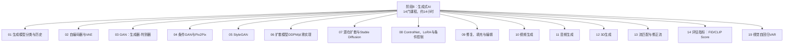

**章节来源**
- [README.md:1-25](file://phases/08-generative-ai/README.md#L1-L25)

## 核心组件
本阶段的核心组件可归纳为五大生成范式与若干关键工程模块：
- 五大家族与历史脉络：显式密度（自回归/流）、近似密度（VAE/扩散）、隐式密度（GAN）、基于分数/连续时间（流匹配/分数SDE）、基于离散token的自回归（VQ-VAE/量化器+Transformer）
- 关键技术栈：VAE编码器、U-Net/DiT、ControlNet、LoRA、IP-Adapter、文本条件化、CFG、流匹配、Rectified Flow、VAR
- 工程与评估：推理步数/采样器、蒸馏、量化、内存带宽瓶颈、FID/CLIP/MOS/CLAP等指标

**章节来源**
- [01-生成模型分类与历史/zh.md:18-61](file://phases/08-generative-ai/01-generative-models-taxonomy-history/docs/zh.md#L18-L61)
- [07-潜在扩散Stable Diffusion/zh.md:22-31](file://phases/08-generative-ai/07-latent-diffusion-stable-diffusion/docs/zh.md#L22-L31)

## 架构总览
生成式AI的工程流水线以“数据域分离 + 条件化 + 采样/蒸馏”为核心。以Stable Diffusion为例，典型流程如下：

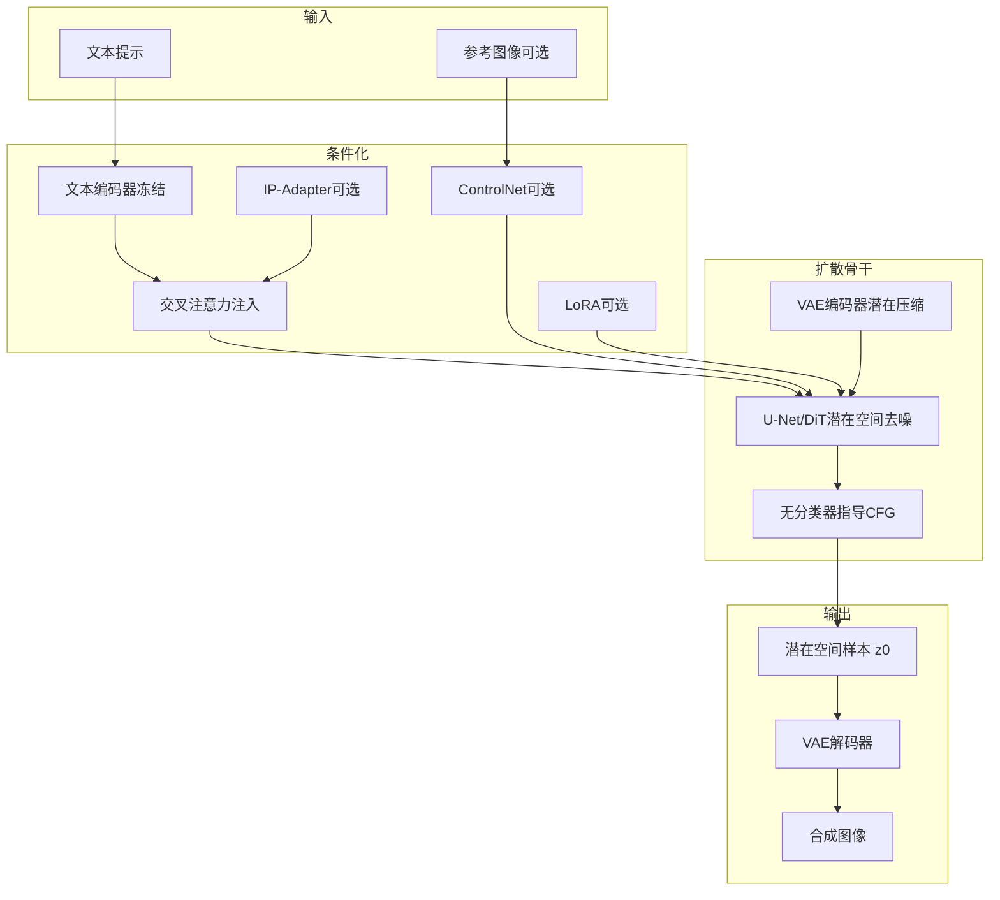

**图表来源**
- [07-潜在扩散Stable Diffusion/zh.md:28-85](file://phases/08-generative-ai/07-latent-diffusion-stable-diffusion/docs/zh.md#L28-L85)
- [08-ControlNetLoRA条件控制/zh.md:24-55](file://phases/08-generative-ai/08-controlnet-lora-conditioning/docs/zh.md#L24-L55)

**章节来源**
- [07-潜在扩散Stable Diffusion/zh.md:50-86](file://phases/08-generative-ai/07-latent-diffusion-stable-diffusion/docs/zh.md#L50-L86)
- [08-ControlNetLoRA条件控制/zh.md:69-94](file://phases/08-generative-ai/08-controlnet-lora-conditioning/docs/zh.md#L69-L94)

## 详细组件分析

### 生成模型分类与历史
- 五大家族与折衷：显式密度（自回归/流）、近似密度（VAE/扩散）、隐式密度（GAN）、基于分数/连续时间（流匹配/分数SDE）、基于离散token的自回归（VQ-VAE/量化器+Transformer）
- 历史里程碑：VAE、GAN、Glow、StyleGAN、DDPM、CLIP/DALL-E、SD1/2/XL/3、ControlNet/LoRA、流匹配、Sora/SD3/Kling等
- 五问题分诊法：建模对象、密度显式/隐式、采样形态、条件类型、评估指标

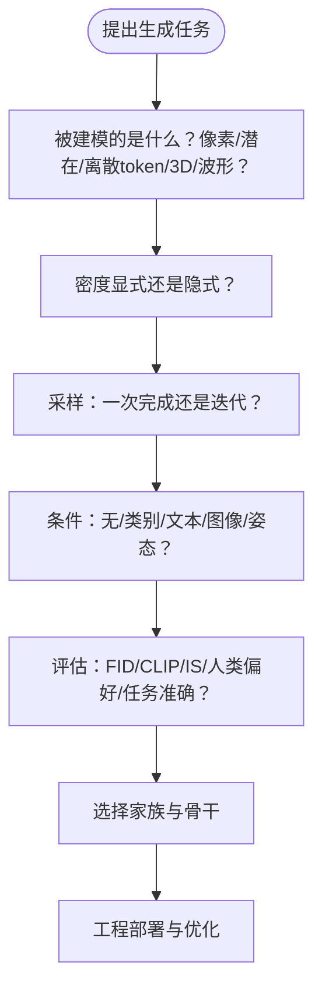

**章节来源**
- [01-生成模型分类与历史/zh.md:18-61](file://phases/08-generative-ai/01-generative-models-taxonomy-history/docs/zh.md#L18-L61)
- [01-生成模型分类与历史/zh.md:79-91](file://phases/08-generative-ai/01-generative-models-taxonomy-history/docs/zh.md#L79-L91)

### 自编码器与VAE
- 目标：在重建良好前提下，使编码空间平滑、可采样，用于潜在扩散的编码器
- 关键点：重参数化技巧、ELBO损失、KL正则、β-VAE、VQ-VAE
- 生产注意：VAE解码器内存峰值、bf16/fp32数值稳定性、切片/分块

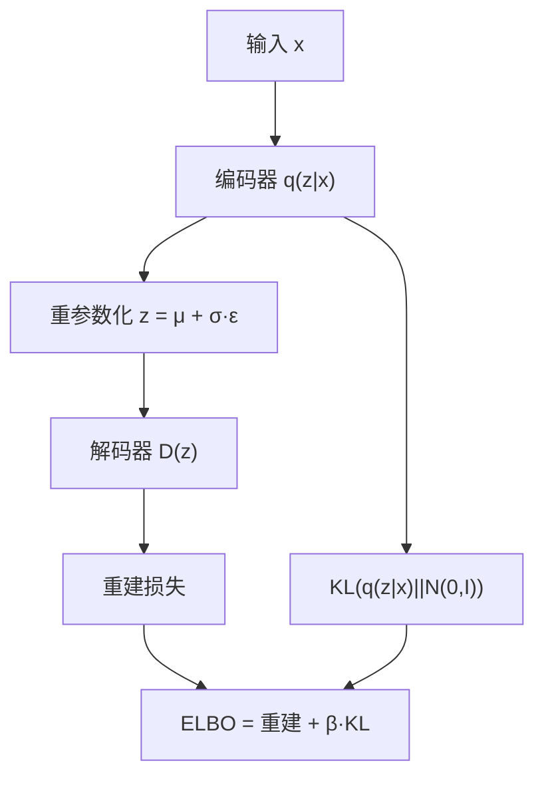

**图表来源**
- [02-自编码器VAE/zh.md:26-43](file://phases/08-generative-ai/02-autoencoders-vae/docs/zh.md#L26-L43)

**章节来源**
- [02-自编码器VAE/zh.md:10-18](file://phases/08-generative-ai/02-autoencoders-vae/docs/zh.md#L10-L18)
- [02-自编码器VAE/zh.md:142-148](file://phases/08-generative-ai/02-autoencoders-vae/docs/zh.md#L142-L148)

### GAN：生成器-判别器
- 目标：对抗训练，生成器学习数据分布，判别器区分真假
- 关键点：非饱和损失、极小极大、模式崩溃、梯度消失、谱归一化、Wasserstein
- 生产注意：单次前向、TTFT≈总延迟、静态批处理、蒸馏（SDXL-Turbo/LCM）

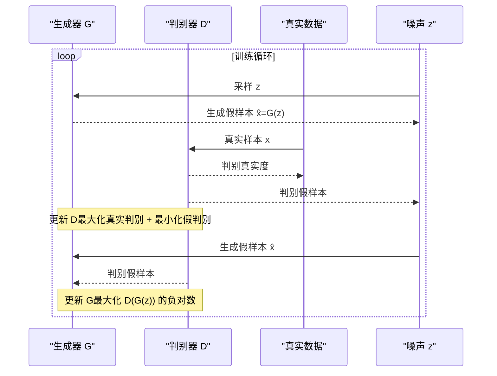

**图表来源**
- [03-GAN生成器-判别器/zh.md:16-42](file://phases/08-generative-ai/03-gans-generator-discriminator/docs/zh.md#L16-L42)

**章节来源**
- [03-GAN生成器-判别器/zh.md:103-110](file://phases/08-generative-ai/03-gans-generator-discriminator/docs/zh.md#L103-L110)
- [03-GAN生成器-判别器/zh.md:149-157](file://phases/08-generative-ai/03-gans-generator-discriminator/docs/zh.md#L149-L157)

### 条件GAN与Pix2Pix
- 目标：在给定条件（如输入图像）下生成目标（如照片）
- 关键点：条件G/D、U-Net生成器、PatchGAN判别器、L1一致性损失、Cycle一致性
- 生产注意：单次推理延迟显著低于扩散；适合狭窄任务与快速基线

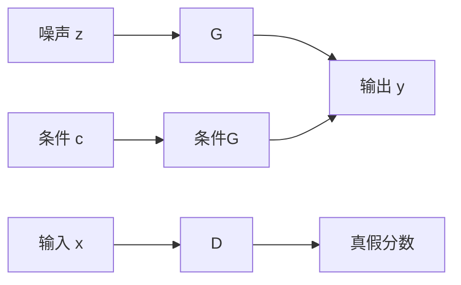

**图表来源**
- [04-条件GAN与Pix2Pix/zh.md:20-36](file://phases/08-generative-ai/04-conditional-gans-pix2pix/docs/zh.md#L20-L36)

**章节来源**
- [04-条件GAN与Pix2Pix/zh.md:88-103](file://phases/08-generative-ai/04-conditional-gans-pix2pix/docs/zh.md#L88-L103)

### StyleGAN
- 目标：将潜在z映射到风格空间W，逐层AdaIN注入，实现解耦与编辑
- 关键点：映射网络、AdaIN、逐层噪声、截断技巧、权重解调、无混叠卷积
- 生产注意：单次前向、极低TTFT、静态批处理、ψ截断控制多样性

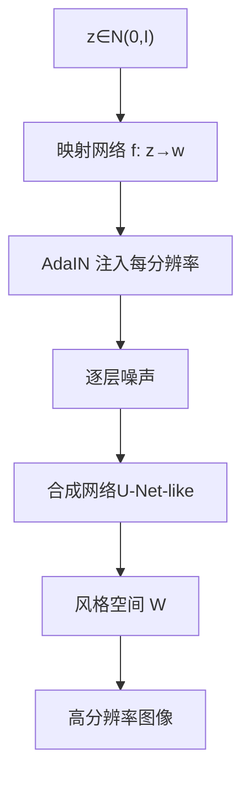

**图表来源**
- [05-StyleGAN/zh.md:22-37](file://phases/08-generative-ai/05-stylegan/docs/zh.md#L22-L37)

**章节来源**
- [05-StyleGAN/zh.md:85-91](file://phases/08-generative-ai/05-stylegan/docs/zh.md#L85-L91)
- [05-StyleGAN/zh.md:128-136](file://phases/08-generative-ai/05-stylegan/docs/zh.md#L128-L136)

### 扩散模型DDPM从零实现
- 目标：通过前向加噪与反向去噪，训练神经网络预测噪声，实现稳定训练与高质量采样
- 关键点：前向/反向过程、β调度、时间条件化、ε/v预测、CFG
- 生产注意：采样器家族（DDIM/DPM-Solver）、蒸馏、缓存与编译

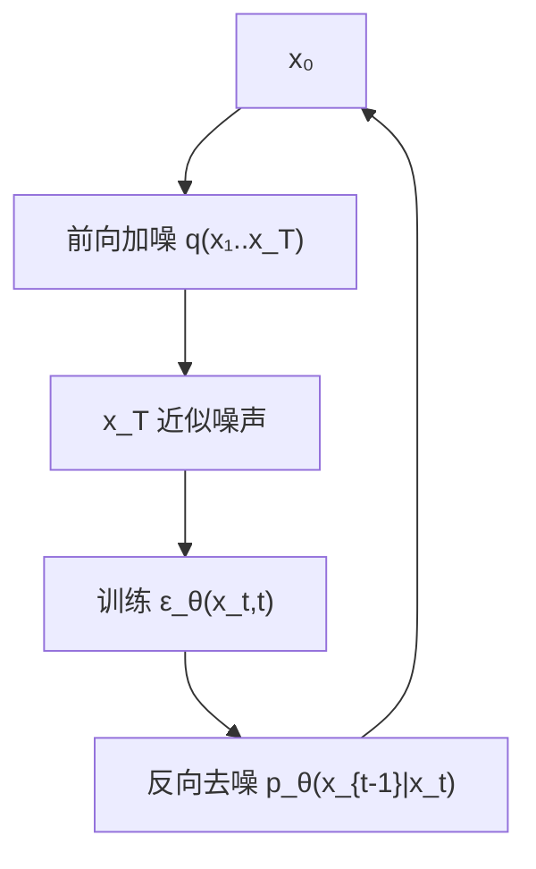

**图表来源**
- [06-扩散模型DDPM从零实现/zh.md:20-45](file://phases/08-generative-ai/06-diffusion-ddpm-from-scratch/docs/zh.md#L20-L45)

**章节来源**
- [06-扩散模型DDPM从零实现/zh.md:122-129](file://phases/08-generative-ai/06-diffusion-ddpm-from-scratch/docs/zh.md#L122-L129)
- [06-扩散模型DDPM从零实现/zh.md:167-176](file://phases/08-generative-ai/06-diffusion-ddpm-from-scratch/docs/zh.md#L167-L176)

### 潜在扩散与Stable Diffusion
- 目标：在VAE潜在空间中运行扩散，显著降低计算成本
- 关键点：两阶段（VAE+扩散）、文本条件化（交叉注意力）、CFG、DiT/MMDiT
- 生产注意：VAE缩放因子、混合潜在空间、LoRA/ControlNet/IP-Adapter组合

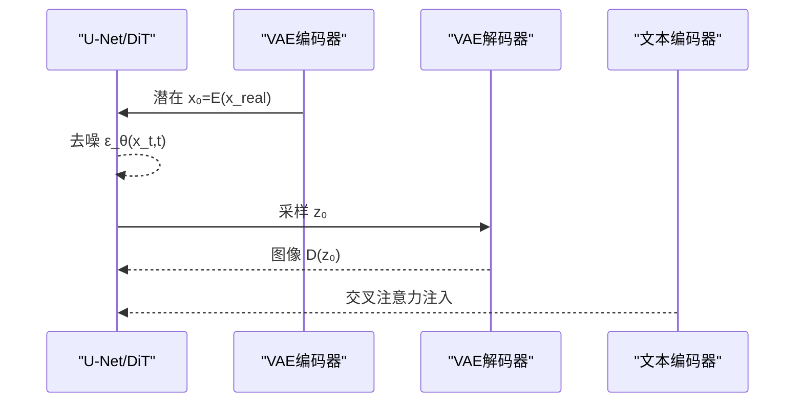

**图表来源**
- [07-潜在扩散Stable Diffusion/zh.md:22-31](file://phases/08-generative-ai/07-latent-diffusion-stable-diffusion/docs/zh.md#L22-L31)

**章节来源**
- [07-潜在扩散Stable Diffusion/zh.md:87-94](file://phases/08-generative-ai/07-latent-diffusion-stable-diffusion/docs/zh.md#L87-L94)
- [07-潜在扩散Stable Diffusion/zh.md:131-140](file://phases/08-generative-ai/07-latent-diffusion-stable-diffusion/docs/zh.md#L131-L140)

### ControlNet、LoRA与条件控制
- 目标：在不改动骨干的前提下，通过小模块实现精确控制与个性化
- 关键点：ControlNet（零卷积跳跃）、LoRA（低秩增量）、IP-Adapter（图像条件化）
- 生产注意：LoRA热切换、ControlNet通道预算、量化叠加

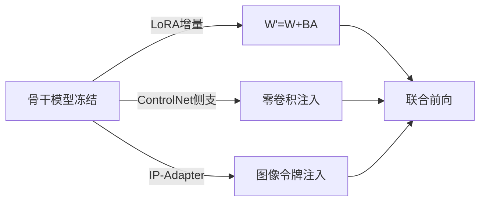

**图表来源**
- [08-ControlNetLoRA条件控制/zh.md:24-55](file://phases/08-generative-ai/08-controlnet-lora-conditioning/docs/zh.md#L24-L55)

**章节来源**
- [08-ControlNetLoRA条件控制/zh.md:95-102](file://phases/08-generative-ai/08-controlnet-lora-conditioning/docs/zh.md#L95-L102)
- [08-ControlNetLoRA条件控制/zh.md:139-148](file://phases/08-generative-ai/08-controlnet-lora-conditioning/docs/zh.md#L139-L148)

### 修复、填充与编辑
- 目标：在保留上下文前提下，对遮罩区域进行可控生成
- 关键点：9通道U-Net、SDEdit、InstructPix2Pix、RePaint、SAM遮罩
- 生产注意：遮罩膨胀、CFG与遮罩大小交互、Flux-Kontext单步编辑

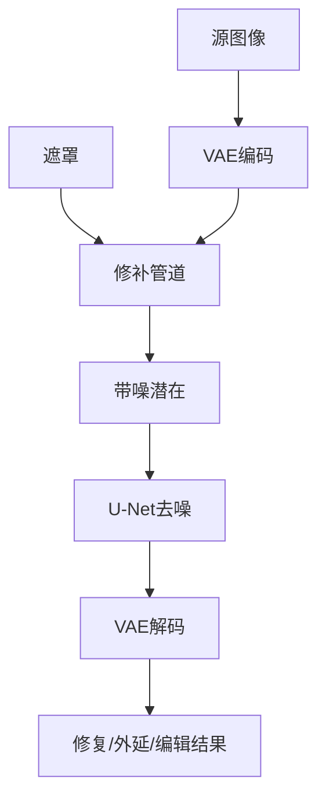

**图表来源**
- [09-修复填充编辑/zh.md:30-41](file://phases/08-generative-ai/09-inpainting-outpainting-editing/docs/zh.md#L30-L41)

**章节来源**
- [09-修复填充编辑/zh.md:93-100](file://phases/08-generative-ai/09-inpainting-outpainting-editing/docs/zh.md#L93-L100)
- [09-修复填充编辑/zh.md:139-147](file://phases/08-generative-ai/09-inpainting-outpainting-editing/docs/zh.md#L139-L147)

### 视频生成
- 目标：在时空补丁上应用扩散Transformer，实现长时序连贯生成
- 关键点：3D VAE、时空DiT、分解注意力（空间+时间）、文本条件化
- 生产注意：内存带宽瓶颈、张量并行、帧批处理、片段级预填充缓存

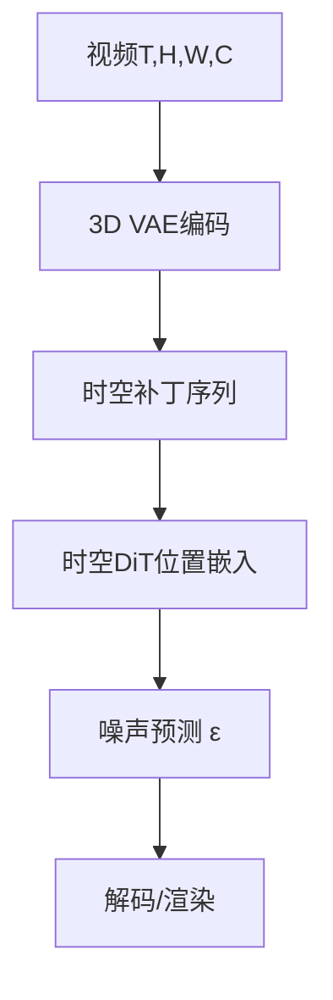

**图表来源**
- [10-视频生成/zh.md:25-44](file://phases/08-generative-ai/10-video-generation/docs/zh.md#L25-L44)

**章节来源**
- [10-视频生成/zh.md:91-98](file://phases/08-generative-ai/10-video-generation/docs/zh.md#L91-L98)
- [10-视频生成/zh.md:136-145](file://phases/08-generative-ai/10-video-generation/docs/zh.md#L136-L145)

### 音频生成
- 目标：神经编解码器将音频压缩为离散token，再由AR或扩散生成
- 关键点：编解码器（Encodec/SoundStream/DAC）、RVQ、Token-AR、流匹配
- 生产注意：流式传输（TPOT）挑战、边界伪影、数据许可与伦理

**图表来源**
- [11-音频生成/zh.md:24-44](file://phases/08-generative-ai/11-audio-generation/docs/zh.md#L24-L44)

**章节来源**
- [11-音频生成/zh.md:81-90](file://phases/08-generative-ai/11-audio-generation/docs/zh.md#L81-L90)
- [11-音频生成/zh.md:126-135](file://phases/08-generative-ai/11-audio-generation/docs/zh.md#L126-L135)

### 3D生成
- 目标：多视图扩散生成一致视图，再拟合为3D表示（3DGS/NeRF/网格）
- 关键点：3D高斯泼溅、多视图扩散、SDS、Triplane/LRM
- 生产注意：表示方式分叉（NeRF/3DGS/网格）、拓扑后处理、许可问题

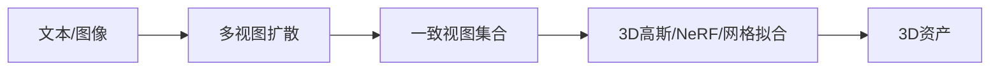

**图表来源**
- [12-3D生成/zh.md:35-57](file://phases/08-generative-ai/12-3d-generation/docs/zh.md#L35-L57)

**章节来源**
- [12-3D生成/zh.md:100-107](file://phases/08-generative-ai/12-3d-generation/docs/zh.md#L100-L107)
- [12-3D生成/zh.md:144-153](file://phases/08-generative-ai/12-3d-generation/docs/zh.md#L144-L153)

### 流匹配与修正流
- 目标：以更直的路径逼近数据分布，显著提速采样
- 关键点：流匹配（Lipman 2023）、Rectified Flow（Consistency/EDM）、蒸馏
- 应用：SD3/Flux/AudioCraft 2等采用流匹配

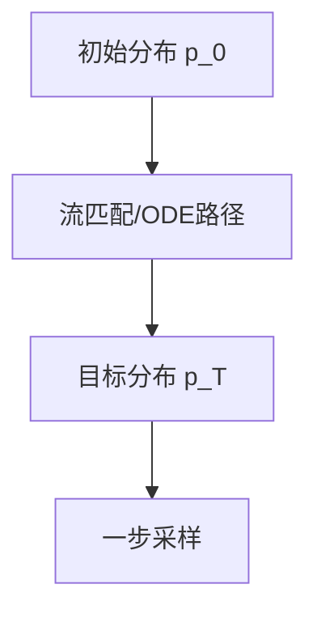

**图表来源**
- [13-流匹配修正流/zh.md:1-50](file://phases/08-generative-ai/13-flow-matching-rectified-flows/docs/zh.md#L1-L50)

**章节来源**
- [13-流匹配修正流/zh.md:1-50](file://phases/08-generative-ai/13-flow-matching-rectified-flows/docs/zh.md#L1-L50)

### 评估指标：FID、CLIP Score
- 指标：FID（真实vs生成分布距离）、CLIP Score（语义相似度）、IS、MOS、CLAP
- 注意：低样本噪声大、人类偏好主观性强，需结合多指标与A/B测试

**章节来源**
- [14-评估指标FIDCLIPScore/zh.md:1-157](file://phases/08-generative-ai/14-evaluation-fid-clip-score/docs/zh.md#L1-L157)

### 视觉自回归（VAR）
- 目标：在图像上引入自回归建模，探索像素/patch级因果生成
- 关注：与扩散/流匹配的关系、效率与质量权衡

**章节来源**
- [19-视觉自回归VAR/zh.md:1-157](file://phases/08-generative-ai/19-visual-autoregressive-var/docs/zh.md#L1-L157)

## 依赖分析
- 课程依赖：01（基础）→ 02（VAE）→ 06（DDPM）→ 07（SD）→ 08（ControlNet/LoRA）→ 09（Inpainting/Editing）→ 10（Video）→ 11（Audio）→ 12（3D）
- 工程依赖：VAE解码器激活峰值、注意力/卷积计算、内存带宽、量化/并行

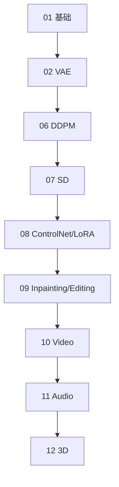

**图表来源**
- [README.md:7-22](file://phases/08-generative-ai/README.md#L7-L22)

**章节来源**
- [README.md:7-22](file://phases/08-generative-ai/README.md#L7-L22)

## 性能考虑
- 扩散推理：num_steps × step_cost + VAE解码；可通过采样器家族、蒸馏、缓存与编译优化
- 视频：内存带宽瓶颈，TP、帧批处理、片段级KV缓存
- 音频：流式传输（TPOT）挑战，AR路径更易流式，流匹配需分块重叠
- 3D：NeRF/3DGS/网格表示差异导致推理与渲染成本差异巨大
- GAN：单次前向、TTFT≈总延迟，静态批处理更优

**章节来源**
- [06-扩散模型DDPM从零实现/zh.md:167-176](file://phases/08-generative-ai/06-diffusion-ddpm-from-scratch/docs/zh.md#L167-L176)
- [10-视频生成/zh.md:136-145](file://phases/08-generative-ai/10-video-generation/docs/zh.md#L136-L145)
- [11-音频生成/zh.md:126-135](file://phases/08-generative-ai/11-audio-generation/docs/zh.md#L126-L135)
- [12-3D生成/zh.md:144-153](file://phases/08-generative-ai/12-3d-generation/docs/zh.md#L144-L153)
- [03-GAN生成器-判别器/zh.md:149-157](file://phases/08-generative-ai/03-gans-generator-discriminator/docs/zh.md#L149-L157)

## 故障排查指南
- VAE相关：后验崩溃、模糊样本、β过大/过早、潜在维度不足、解码器NaN（bf16/fp32）
- GAN相关：判别器过强、生成器记忆、BN统计量泄漏、一次采样对条件任务是谎言
- 条件任务：条件被忽略、L1权重不当、真实值泄漏、类别条件模式崩溃
- 扩散相关：调度不当、时间步嵌入脆弱、V预测/ε预测切换、CFG过高、1000步冗余
- 修补编辑：接缝、遮罩泄漏、CFG与遮罩大小交互、SDEdit保真度悬崖、提示不匹配
- 视频：独立逐帧采样闪烁、3D注意力OOM、数据字幕不足、首帧条件化、物理漂移
- 音频：编解码器质量限制、RVQ错误累积、音乐结构困难、边界伪影、伦理与许可
- 3D：视角不一致、背面幻觉、3DGS爆炸、拓扑问题、许可差异

**章节来源**
- [02-自编码器VAE/zh.md:95-101](file://phases/08-generative-ai/02-autoencoders-vae/docs/zh.md#L95-L101)
- [03-GAN生成器-判别器/zh.md:103-110](file://phases/08-generative-ai/03-gans-generator-discriminator/docs/zh.md#L103-L110)
- [04-条件GAN与Pix2Pix/zh.md:80-87](file://phases/08-generative-ai/04-conditional-gans-pix2pix/docs/zh.md#L80-L87)
- [06-扩散模型DDPM从零实现/zh.md:122-129](file://phases/08-generative-ai/06-diffusion-ddpm-from-scratch/docs/zh.md#L122-L129)
- [09-修复填充编辑/zh.md:93-100](file://phases/08-generative-ai/09-inpainting-outpainting-editing/docs/zh.md#L93-L100)
- [10-视频生成/zh.md:91-98](file://phases/08-generative-ai/10-video-generation/docs/zh.md#L91-L98)
- [11-音频生成/zh.md:81-89](file://phases/08-generative-ai/11-audio-generation/docs/zh.md#L81-L89)
- [12-3D生成/zh.md:100-107](file://phases/08-generative-ai/12-3d-generation/docs/zh.md#L100-L107)

## 结论
本阶段系统梳理了生成式AI从理论到工程的关键脉络：以VAE/扩散/流匹配为主干，结合GAN/自回归/离散token范式，辅以ControlNet/LoRA/条件控制与多模态融合，形成覆盖图像、视频、音频、3D的统一生成框架。课程强调“可运行示例 + 工程实践 + 生产推理”的闭环，帮助读者在理解原理的同时掌握落地能力。

## 附录
- 课程清单与时间概览：见阶段README
- 技能输出：每课提供可复用技能模板（如模型选择器、调试器、编辑流水线等）

**章节来源**
- [README.md:7-25](file://phases/08-generative-ai/README.md#L7-L25)