# 阶段9：强化学习

<cite>
**本文引用的文件**
- [README.md](file://phases/09-reinforcement-learning/README.md)
- [01-mdps-states-actions-rewards/docs/en.md](file://phases/09-reinforcement-learning/01-mdps-states-actions-rewards/docs/en.md)
- [01-mdps-states-actions-rewards/code/main.py](file://phases/09-reinforcement-learning/01-mdps-states-actions-rewards/code/main.py)
- [02-dynamic-programming/code/main.py](file://phases/09-reinforcement-learning/02-dynamic-programming/code/main.py)
- [03-monte-carlo-methods/code/main.py](file://phases/09-reinforcement-learning/03-monte-carlo-methods/code/main.py)
- [04-q-learning-sarsa/code/main.py](file://phases/09-reinforcement-learning/04-q-learning-sarsa/code/main.py)
- [05-dqn/code/main.py](file://phases/09-reinforcement-learning/05-dqn/code/main.py)
- [06-policy-gradients-reinforce/code/main.py](file://phases/09-reinforcement-learning/06-policy-gradients-reinforce/code/main.py)
- [07-actor-critic-a2c-a3c/code/main.py](file://phases/09-reinforcement-learning/07-actor-critic-a2c-a3c/code/main.py)
- [08-ppo/code/main.py](file://phases/09-reinforcement-learning/08-ppo/code/main.py)
- [09-reward-modeling-rlhf/code/main.py](file://phases/09-reinforcement-learning/09-reward-modeling-rlhf/code/main.py)
- [10-multi-agent-rl/code/main.py](file://phases/09-reinforcement-learning/10-multi-agent-rl/code/main.py)
- [11-sim-to-real-transfer/code/main.py](file://phases/09-reinforcement-learning/11-sim-to-real-transfer/code/main.py)
- [12-rl-for-games/code/main.py](file://phases/09-reinforcement-learning/12-rl-for-games/code/main.py)
</cite>

## 目录
1. [引言](#引言)
2. [项目结构](#项目结构)
3. [核心组件](#核心组件)
4. [架构总览](#架构总览)
5. [详细组件分析](#详细组件分析)
6. [依赖关系分析](#依赖关系分析)
7. [性能考量](#性能考量)
8. [故障排查指南](#故障排查指南)
9. [结论](#结论)
10. [附录](#附录)

## 引言
本阶段系统性覆盖强化学习的理论与实践，围绕“马尔可夫决策过程（MDP）”这一统一数学框架，逐步展开至动态规划、蒙特卡洛方法、时序差分学习（SARSA/Q-learning）、深度Q网络（DQN）、策略梯度（REINFORCE）、Actor-Critic（A2C/A3C）、近端策略优化（PPO）、奖励建模与RLHF、多智能体强化学习、从仿真到现实迁移以及强化学习在游戏中的应用等12门核心课程。通过小而强的环境（如4×4网格世界）与清晰的训练循环，帮助读者建立对RL算法的直观理解与工程直觉。

## 项目结构
- 该阶段位于 phases/09-reinforcement-learning，包含12个课程子目录，每个子目录下通常包含：
  - code/main.py：最小可运行示例
  - docs/en.md：课程讲义与概念说明
  - notebook/：Jupyter Notebook（部分课程）
  - outputs/：技能卡片输出（如skill-*.md）

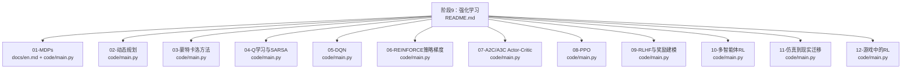

**图表来源**
- [README.md](file://phases/09-reinforcement-learning/README.md)
- [01-mdps-states-actions-rewards/docs/en.md](file://phases/09-reinforcement-learning/01-mdps-states-actions-rewards/docs/en.md)
- [01-mdps-states-actions-rewards/code/main.py](file://phases/09-reinforcement-learning/01-mdps-states-actions-rewards/code/main.py)
- [02-dynamic-programming/code/main.py](file://phases/09-reinforcement-learning/02-dynamic-programming/code/main.py)
- [03-monte-carlo-methods/code/main.py](file://phases/09-reinforcement-learning/03-monte-carlo-methods/code/main.py)
- [04-q-learning-sarsa/code/main.py](file://phases/09-reinforcement-learning/04-q-learning-sarsa/code/main.py)
- [05-dqn/code/main.py](file://phases/09-reinforcement-learning/05-dqn/code/main.py)
- [06-policy-gradients-reinforce/code/main.py](file://phases/09-reinforcement-learning/06-policy-gradients-reinforce/code/main.py)
- [07-actor-critic-a2c-a3c/code/main.py](file://phases/09-reinforcement-learning/07-actor-critic-a2c-a3c/code/main.py)
- [08-ppo/code/main.py](file://phases/09-reinforcement-learning/08-ppo/code/main.py)
- [09-reward-modeling-rlhf/code/main.py](file://phases/09-reinforcement-learning/09-reward-modeling-rlhf/code/main.py)
- [10-multi-agent-rl/code/main.py](file://phases/09-reinforcement-learning/10-multi-agent-rl/code/main.py)
- [11-sim-to-real-transfer/code/main.py](file://phases/09-reinforcement-learning/11-sim-to-real-transfer/code/main.py)
- [12-rl-for-games/code/main.py](file://phases/09-reinforcement-learning/12-rl-for-games/code/main.py)

**章节来源**
- [README.md](file://phases/09-reinforcement-learning/README.md)

## 核心组件
- MDP基础与网格世界环境：定义状态、动作、转移、奖励与折扣，提供随机策略与贪心策略的评估与可视化。
- 动态规划：价值迭代与策略迭代，展示如何求解确定性/随机GridWorld的最优价值函数与策略。
- 蒙特卡洛方法：首次访问MC策略评估与ε-贪婪控制，演示基于采样的策略优化。
- 时序差分学习：SARSA在线策略与Q-learning离线策略，对比探索与利用。
- 深度Q网络：使用小型神经网络近似Q值，结合经验回放与目标网络稳定训练。
- 策略梯度与REINFORCE：参数化策略（softmax），使用回报作为基线或无基线进行更新。
- Actor-Critic与A2C/A3C：分离策略（Actor）与价值（Critic），使用广义优势估计（GAE）进行稳定更新。
- PPO：多环境并行收集轨迹，使用重要性采样比率裁剪与价值损失联合优化。
- 奖励建模与RLHF：二元偏好学习（ Bradley-Terry）构建奖励模型，并用KL正则的PPO进行指令对齐。
- 多智能体RL：独立Q学习与联合Q学习，比较分布式与集中式视角下的协作效果。
- 仿真到现实迁移：域随机化（DR）在训练中引入不确定性，提升泛化能力。
- 游戏中的RL：问答任务上的GRPO与REINFORCE对比，强调组均值基线与KL正则的作用。

**章节来源**
- [01-mdps-states-actions-rewards/docs/en.md](file://phases/09-reinforcement-learning/01-mdps-states-actions-rewards/docs/en.md)
- [01-mdps-states-actions-rewards/code/main.py](file://phases/09-reinforcement-learning/01-mdps-states-actions-rewards/code/main.py)
- [02-dynamic-programming/code/main.py](file://phases/09-reinforcement-learning/02-dynamic-programming/code/main.py)
- [03-monte-carlo-methods/code/main.py](file://phases/09-reinforcement-learning/03-monte-carlo-methods/code/main.py)
- [04-q-learning-sarsa/code/main.py](file://phases/09-reinforcement-learning/04-q-learning-sarsa/code/main.py)
- [05-dqn/code/main.py](file://phases/09-reinforcement-learning/05-dqn/code/main.py)
- [06-policy-gradients-reinforce/code/main.py](file://phases/09-reinforcement-learning/06-policy-gradients-reinforce/code/main.py)
- [07-actor-critic-a2c-a3c/code/main.py](file://phases/09-reinforcement-learning/07-actor-critic-a2c-a3c/code/main.py)
- [08-ppo/code/main.py](file://phases/09-reinforcement-learning/08-ppo/code/main.py)
- [09-reward-modeling-rlhf/code/main.py](file://phases/09-reinforcement-learning/09-reward-modeling-rlhf/code/main.py)
- [10-multi-agent-rl/code/main.py](file://phases/09-reinforcement-learning/10-multi-agent-rl/code/main.py)
- [11-sim-to-real-transfer/code/main.py](file://phases/09-reinforcement-learning/11-sim-to-real-transfer/code/main.py)
- [12-rl-for-games/code/main.py](file://phases/09-reinforcement-learning/12-rl-for-games/code/main.py)

## 架构总览
以下图展示了从MDP抽象到具体算法实现的演进路径，以及各课程之间的递进关系。

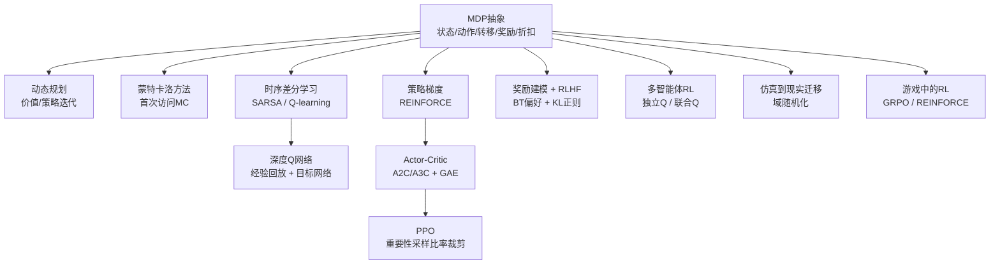

**图表来源**
- [01-mdps-states-actions-rewards/docs/en.md](file://phases/09-reinforcement-learning/01-mdps-states-actions-rewards/docs/en.md)
- [02-dynamic-programming/code/main.py](file://phases/09-reinforcement-learning/02-dynamic-programming/code/main.py)
- [03-monte-carlo-methods/code/main.py](file://phases/09-reinforcement-learning/03-monte-carlo-methods/code/main.py)
- [04-q-learning-sarsa/code/main.py](file://phases/09-reinforcement-learning/04-q-learning-sarsa/code/main.py)
- [05-dqn/code/main.py](file://phases/09-reinforcement-learning/05-dqn/code/main.py)
- [06-policy-gradients-reinforce/code/main.py](file://phases/09-reinforcement-learning/06-policy-gradients-reinforce/code/main.py)
- [07-actor-critic-a2c-a3c/code/main.py](file://phases/09-reinforcement-learning/07-actor-critic-a2c-a3c/code/main.py)
- [08-ppo/code/main.py](file://phases/09-reinforcement-learning/08-ppo/code/main.py)
- [09-reward-modeling-rlhf/code/main.py](file://phases/09-reinforcement-learning/09-reward-modeling-rlhf/code/main.py)
- [10-multi-agent-rl/code/main.py](file://phases/09-reinforcement-learning/10-multi-agent-rl/code/main.py)
- [11-sim-to-real-transfer/code/main.py](file://phases/09-reinforcement-learning/11-sim-to-real-transfer/code/main.py)
- [12-rl-for-games/code/main.py](file://phases/09-reinforcement-learning/12-rl-for-games/code/main.py)

## 详细组件分析

### MDP与网格世界（01）
- 核心概念：状态空间、动作集合、确定性/随机转移、即时奖励、折扣因子。
- 实现要点：网格世界的step函数封装了边界处理与终止条件；uniform_policy与greedy_policy用于策略采样；rollout执行交互并统计回报；policy_evaluation通过迭代求解V^π。
- 关键公式：贝尔曼方程的逐点更新，体现“一步奖励+折扣未来价值”。

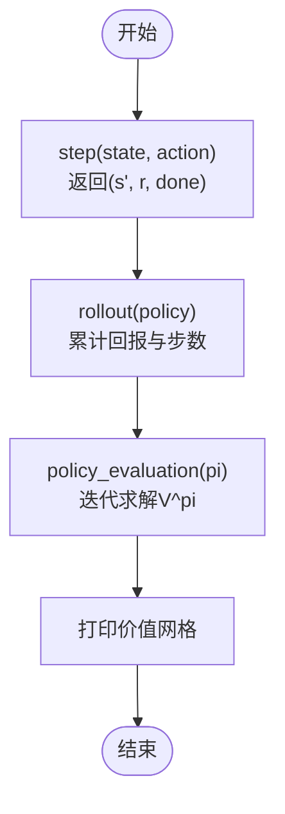

**图表来源**
- [01-mdps-states-actions-rewards/code/main.py](file://phases/09-reinforcement-learning/01-mdps-states-actions-rewards/code/main.py)

**章节来源**
- [01-mdps-states-actions-rewards/docs/en.md](file://phases/09-reinforcement-learning/01-mdps-states-actions-rewards/docs/en.md)
- [01-mdps-states-actions-rewards/code/main.py](file://phases/09-reinforcement-learning/01-mdps-states-actions-rewards/code/main.py)

### 动态规划（02）
- 算法：价值迭代与策略迭代，分别从价值函数与策略出发，交替更新直至收敛。
- 扩展：考虑动作滑移的随机环境，展示转移概率分布的建模方式。
- 输出：最优价值函数与对应贪心策略，支持箭头可视化。

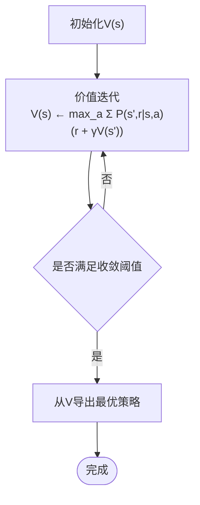

**图表来源**
- [02-dynamic-programming/code/main.py](file://phases/09-reinforcement-learning/02-dynamic-programming/code/main.py)

**章节来源**
- [02-dynamic-programming/code/main.py](file://phases/09-reinforcement-learning/02-dynamic-programming/code/main.py)

### 蒙特卡洛方法（03）
- 策略评估：首次访问MC，对每个状态仅使用其首次出现的回报进行均值更新。
- 控制：ε-贪婪策略，随时间衰减探索，使用回报到来（return-to-go）作为目标。
- 收敛性：随着采样增加，价值估计趋于真实值；策略逐步收敛到最优。

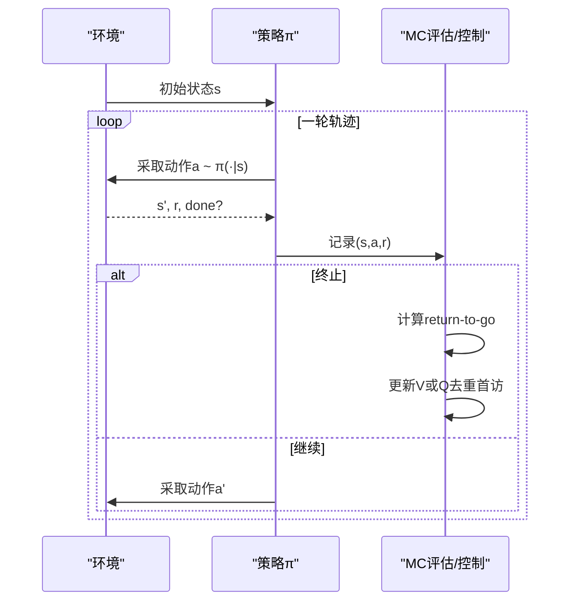

**图表来源**
- [03-monte-carlo-methods/code/main.py](file://phases/09-reinforcement-learning/03-monte-carlo-methods/code/main.py)

**章节来源**
- [03-monte-carlo-methods/code/main.py](file://phases/09-reinforcement-learning/03-monte-carlo-methods/code/main.py)

### Q学习与SARSA（04）
- 在线策略：SARSA使用当前策略产生的下一个动作进行TD目标更新。
- 离线策略：Q-learning使用最优动作进行TD目标更新，更稳健但需探索保证。
- 收敛性：在适当探索条件下，两者均能收敛到最优Q函数。

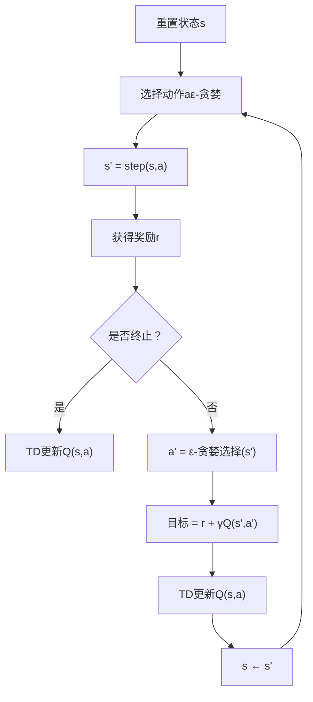

**图表来源**
- [04-q-learning-sarsa/code/main.py](file://phases/09-reinforcement-learning/04-q-learning-sarsa/code/main.py)

**章节来源**
- [04-q-learning-sarsa/code/main.py](file://phases/09-reinforcement-learning/04-q-learning-sarsa/code/main.py)

### DQN（05）
- 近似器：小型前馈网络参数化Q函数；状态特征为one-hot编码。
- 稳定技巧：经验回放（固定容量缓冲区）、目标网络定期同步。
- 训练：ε-贪婪探索，批量采样计算TD损失并反向传播。

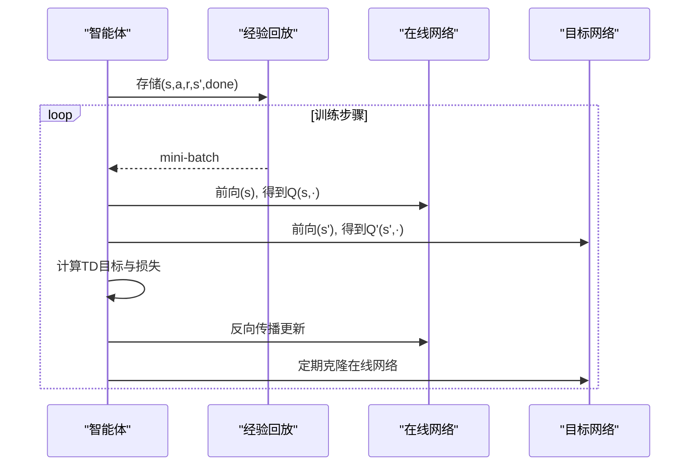

**图表来源**
- [05-dqn/code/main.py](file://phases/09-reinforcement-learning/05-dqn/code/main.py)

**章节来源**
- [05-dqn/code/main.py](file://phases/09-reinforcement-learning/05-dqn/code/main.py)

### REINFORCE策略梯度（06）
- 参数化策略：softmax动作概率，权重θ按策略梯度更新。
- 基线：可选基线降低方差；回报到来作为目标。
- 收敛性：在策略梯度定理基础上，通过采样近似期望梯度。

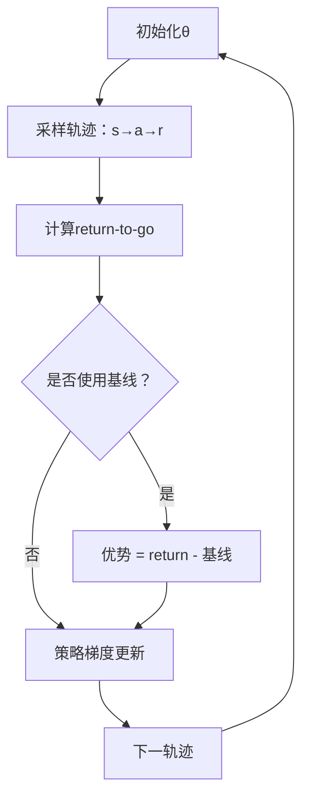

**图表来源**
- [06-policy-gradients-reinforce/code/main.py](file://phases/09-reinforcement-learning/06-policy-gradients-reinforce/code/main.py)

**章节来源**
- [06-policy-gradients-reinforce/code/main.py](file://phases/09-reinforcement-learning/06-policy-gradients-reinforce/code/main.py)

### Actor-Critic与A2C/A3C（07）
- 分离策略与价值：Actor（策略）与Critic（价值）共享状态特征。
- 优势估计：GAE结合TD误差，提供偏差-方差权衡的优势估计。
- 更新：Critic最小化目标与价值损失；Actor使用归一化优势进行策略梯度更新，并加入熵正则鼓励探索。

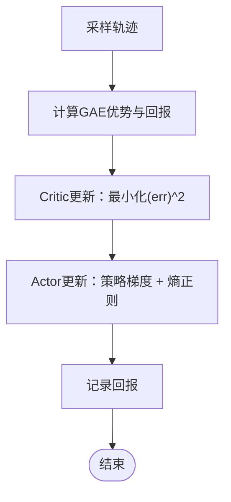

**图表来源**
- [07-actor-critic-a2c-a3c/code/main.py](file://phases/09-reinforcement-learning/07-actor-critic-a2c-a3c/code/main.py)

**章节来源**
- [07-actor-critic-a2c-a3c/code/main.py](file://phases/09-reinforcement-learning/07-actor-critic-a2c-a3c/code/main.py)

### PPO（08）
- 并行环境：多环境同时收集轨迹，提高样本效率。
- 重要性采样比率裁剪：限制策略更新幅度，避免大步更新导致性能退化。
- 更新：分批随机梯度下降，同时优化Actor与Critic，监控KL散度与裁剪比例。

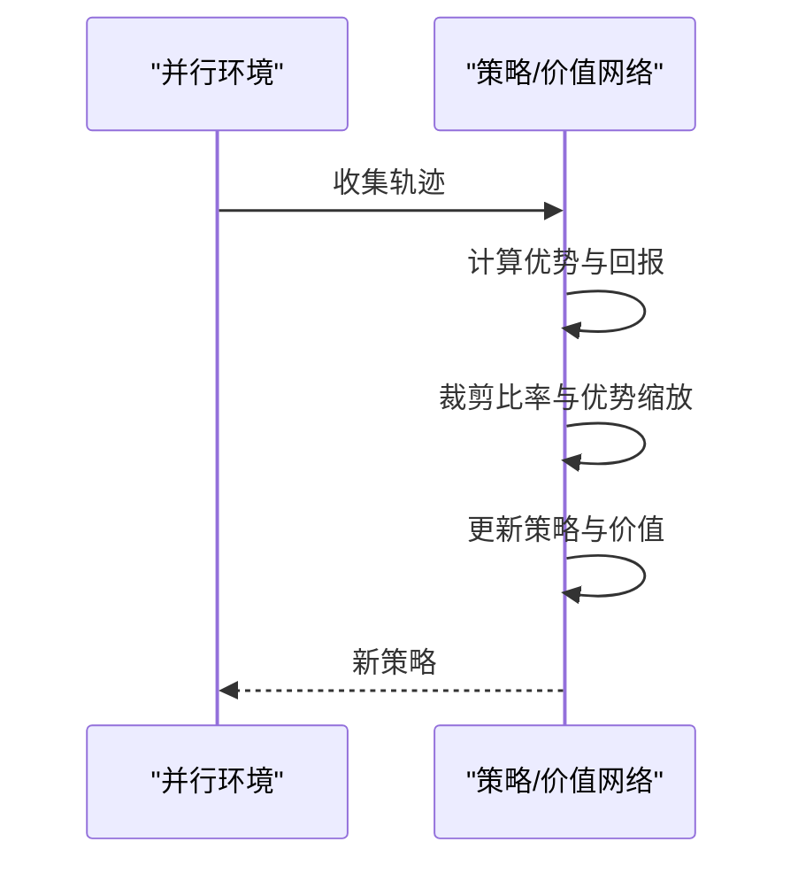

**图表来源**
- [08-ppo/code/main.py](file://phases/09-reinforcement-learning/08-ppo/code/main.py)

**章节来源**
- [08-ppo/code/main.py](file://phases/09-reinforcement-learning/08-ppo/code/main.py)

### 奖励建模与RLHF（09）
- 奖励模型：二元偏好学习（Bradley-Terry），对成对响应打分，得到奖励函数。
- RLHF：使用奖励模型作为奖励信号，结合KL正则约束策略变化，采用PPO进行指令对齐。

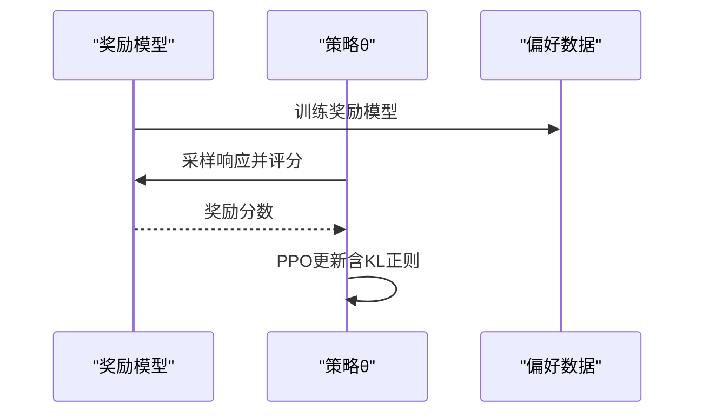

**图表来源**
- [09-reward-modeling-rlhf/code/main.py](file://phases/09-reinforcement-learning/09-reward-modeling-rlhf/code/main.py)

**章节来源**
- [09-reward-modeling-rlhf/code/main.py](file://phases/09-reinforcement-learning/09-reward-modeling-rlhf/code/main.py)

### 多智能体RL（10）
- 独立Q学习：每个智能体维护独立Q表，适合弱耦合协作。
- 联合Q学习：将两个智能体的动作组合为联合动作，便于协调但维度爆炸。
- 评估：对比不同方法在共享奖励下的平均回报。

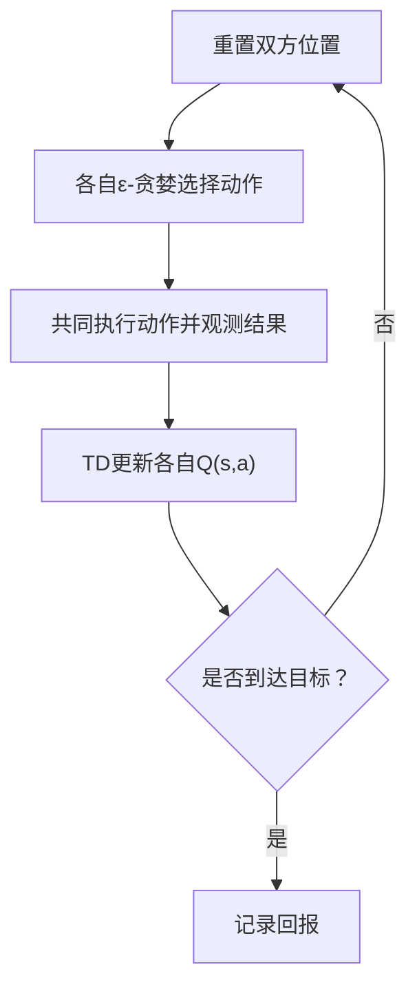

**图表来源**
- [10-multi-agent-rl/code/main.py](file://phases/09-reinforcement-learning/10-multi-agent-rl/code/main.py)

**章节来源**
- [10-multi-agent-rl/code/main.py](file://phases/09-reinforcement-learning/10-multi-agent-rl/code/main.py)

### 仿真到现实迁移（11）
- 训练：固定滑移概率或在训练中随机采样滑移范围（域随机化）。
- 评估：在不同滑移条件下评估策略性能，验证域随机化的鲁棒性。

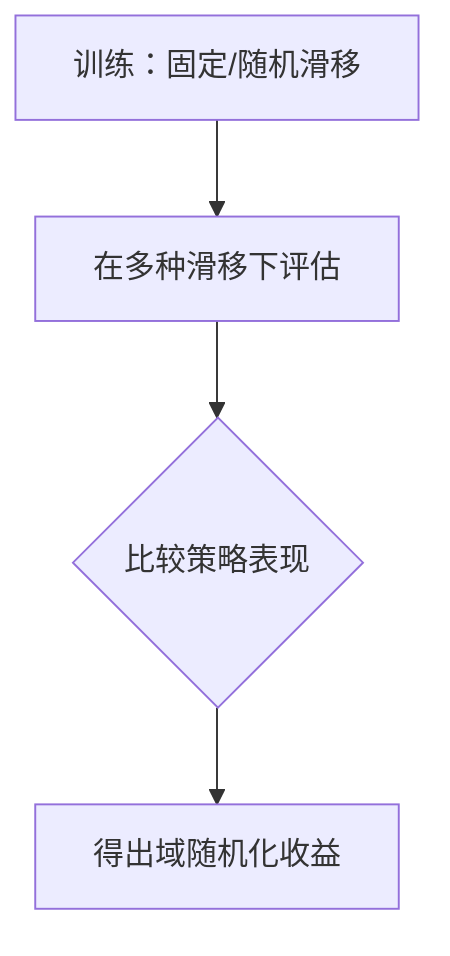

**图表来源**
- [11-sim-to-real-transfer/code/main.py](file://phases/09-reinforcement-learning/11-sim-to-real-transfer/code/main.py)

**章节来源**
- [11-sim-to-real-transfer/code/main.py](file://phases/09-reinforcement-learning/11-sim-to-real-transfer/code/main.py)

### 游戏中的RL（12）
- 任务：问答任务，正确答案得1，错误得0。
- 方法：GRPO使用组均值作为基线与组标准差归一化优势；REINFORCE直接使用奖励信号。
- 结果：GRPO在相同样本效率下通常取得更高准确率。

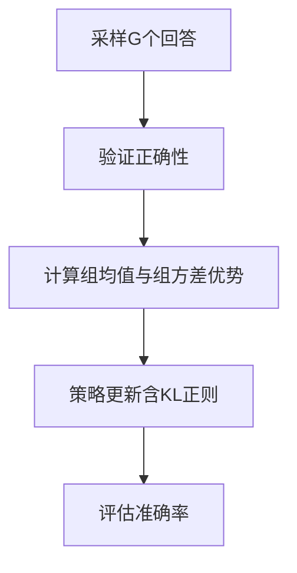

**图表来源**
- [12-rl-for-games/code/main.py](file://phases/09-reinforcement-learning/12-rl-for-games/code/main.py)

**章节来源**
- [12-rl-for-games/code/main.py](file://phases/09-reinforcement-learning/12-rl-for-games/code/main.py)

## 依赖关系分析
- 算法依赖：从MDP抽象出发，动态规划提供理论基础；蒙特卡洛与时序差分分别代表采样与自举两大范式；深度学习引入函数逼近；策略梯度与Actor-Critic进一步扩展到策略参数化；PPO在实践中成为主流优化器；奖励建模与RLHF将人类偏好纳入强化学习；多智能体RL扩展到多主体场景；仿真到现实迁移解决实际部署挑战；游戏应用展示在结构化任务中的有效性。
- 工具与库：各课程以纯Python实现，未显式依赖外部RL库，便于理解底层原理。

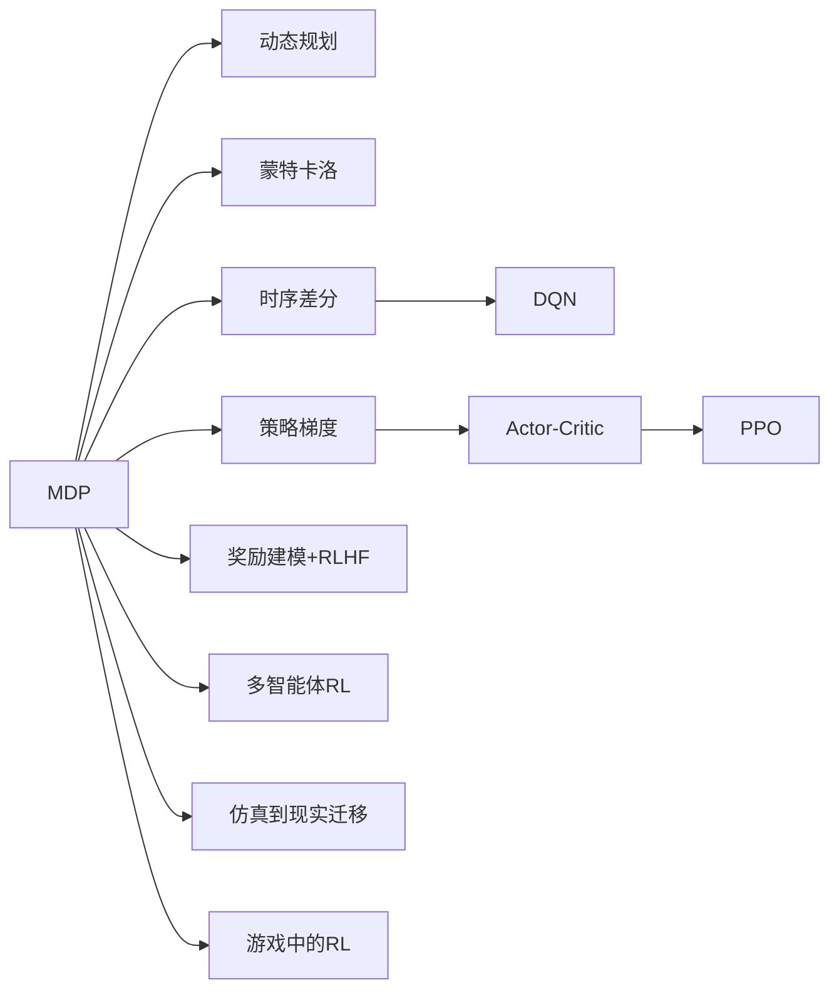

**图表来源**
- [01-mdps-states-actions-rewards/docs/en.md](file://phases/09-reinforcement-learning/01-mdps-states-actions-rewards/docs/en.md)
- [02-dynamic-programming/code/main.py](file://phases/09-reinforcement-learning/02-dynamic-programming/code/main.py)
- [03-monte-carlo-methods/code/main.py](file://phases/09-reinforcement-learning/03-monte-carlo-methods/code/main.py)
- [04-q-learning-sarsa/code/main.py](file://phases/09-reinforcement-learning/04-q-learning-sarsa/code/main.py)
- [05-dqn/code/main.py](file://phases/09-reinforcement-learning/05-dqn/code/main.py)
- [06-policy-gradients-reinforce/code/main.py](file://phases/09-reinforcement-learning/06-policy-gradients-reinforce/code/main.py)
- [07-actor-critic-a2c-a3c/code/main.py](file://phases/09-reinforcement-learning/07-actor-critic-a2c-a3c/code/main.py)
- [08-ppo/code/main.py](file://phases/09-reinforcement-learning/08-ppo/code/main.py)
- [09-reward-modeling-rlhf/code/main.py](file://phases/09-reinforcement-learning/09-reward-modeling-rlhf/code/main.py)
- [10-multi-agent-rl/code/main.py](file://phases/09-reinforcement-learning/10-multi-agent-rl/code/main.py)
- [11-sim-to-real-transfer/code/main.py](file://phases/09-reinforcement-learning/11-sim-to-real-transfer/code/main.py)
- [12-rl-for-games/code/main.py](file://phases/09-reinforcement-learning/12-rl-for-games/code/main.py)

## 性能考量
- 收敛速度：动态规划在小MDP上快速收敛；蒙特卡洛需要大量样本；时序差分与深度学习受超参数影响较大。
- 样本效率：PPO、A2C等基于策略的方法在连续动作与高维状态空间中更具优势；蒙特卡洛与Q学习在小规模离散MDP上高效。
- 稳定性：DQN的经验回放与目标网络、PPO的裁剪机制、REINFORCE的基线与方差缩减、Actor-Critic的GAE与熵正则均有助于稳定训练。
- 计算开销：多智能体与并行环境显著提升吞吐量，但也带来通信与同步成本。

## 故障排查指南
- 非马尔可夫状态：若历史信息对决策至关重要，应采用帧堆叠或循环网络记忆，确保状态具备马尔可夫性质。
- 稀疏奖励：通过塑造奖励或引入模仿信号（如行为克隆）缓解稀疏性问题。
- 奖励黑客：确保奖励函数直接反映最终目标，避免代理优化代理奖励而非真实目标。
- 折扣误设：无限时域任务应使用γ < 1或有限步长，否则价值发散。
- 奖励尺度：过大的奖励幅值会导致梯度爆炸，建议归一化到合理范围后再训练。

**章节来源**
- [01-mdps-states-actions-rewards/docs/en.md](file://phases/09-reinforcement-learning/01-mdps-states-actions-rewards/docs/en.md)

## 结论
本阶段以MDP为核心抽象，系统串联从理论到实践的关键算法，既强调数学严谨性，又注重工程可操作性。通过一系列小而精的实验，读者可以掌握RL的通用范式与关键技巧，并为后续高级主题（如大规模语言模型对齐、多智能体系统与安全治理）奠定坚实基础。

## 附录
- 术语速查：MDP、状态、策略、回报、价值、Q值、贝尔曼方程、折扣γ、动态规划、蒙特卡洛、时序差分、DQN、策略梯度、REINFORCE、Actor-Critic、A2C/A3C、PPO、奖励建模、RLHF、多智能体、仿真到现实迁移、游戏应用等。