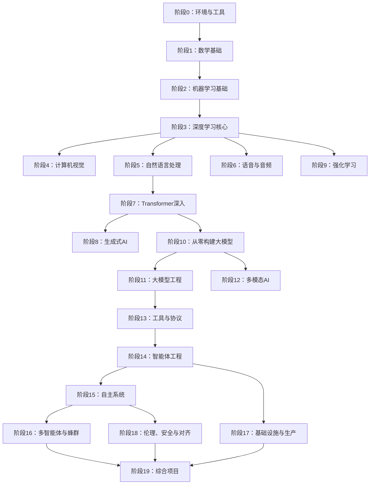
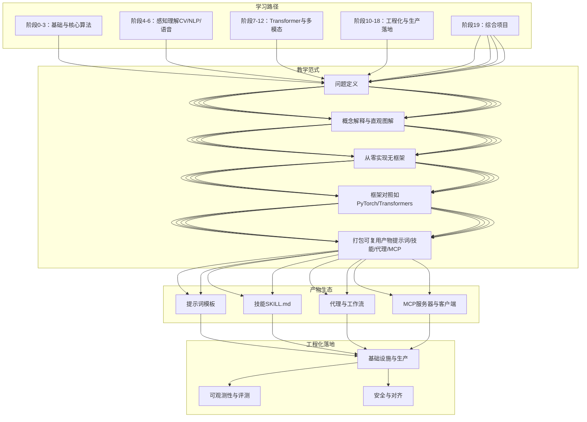
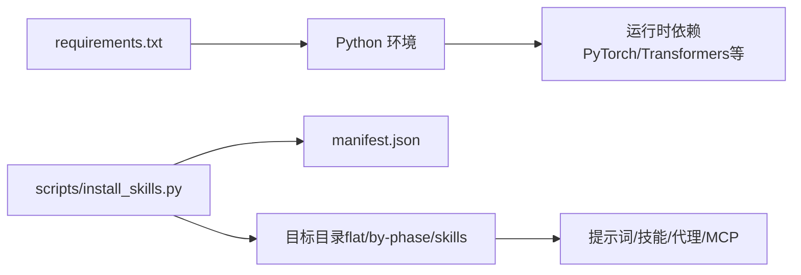

# 参考资料

<cite>
**本文引用的文件**
- [README.md](file://README.md)
- [ROADMAP.md](file://ROADMAP.md)
- [install_skills.py](file://scripts/install_skills.py)
- [requirements.txt](file://requirements.txt)
- [CONTRIBUTING.md](file://CONTRIBUTING.md)
- [glossary/README.md](file://glossary/README.md)
- [phases/00-setup-and-tooling/README.md](file://phases/00-setup-and-tooling/README.md)
- [phases/01-math-foundations/README.md](file://phases/01-math-foundations/README.md)
- [phases/02-ml-fundamentals/README.md](file://phases/02-ml-fundamentals/README.md)
- [phases/03-deep-learning-core/README.md](file://phases/03-deep-learning-core/README.md)
- [phases/10-llms-from-scratch/README.md](file://phases/10-llms-from-scratch/README.md)
- [phases/11-llm-engineering/README.md](file://phases/11-llm-engineering/README.md)
- [phases/14-agent-engineering/README.md](file://phases/14-agent-engineering/README.md)
- [phases/17-infrastructure-and-production/README.md](file://phases/17-infrastructure-and-production/README.md)
- [phases/18-ethics-safety-alignment/README.md](file://phases/18-ethics-safety-alignment/README.md)
</cite>

## 目录
1. [引言](#引言)
2. [项目结构](#项目结构)
3. [核心组件](#核心组件)
4. [架构总览](#架构总览)
5. [详细组件分析](#详细组件分析)
6. [依赖分析](#依赖分析)
7. [性能考虑](#性能考虑)
8. [故障排查指南](#故障排查指南)
9. [结论](#结论)
10. [附录](#附录)

## 引言
本参考资料面向“AI工程从零开始”学习路径，系统梳理课程体系、学习阶段与资源组织方式，帮助学习者按“入门—进阶—专家”的层级高效构建知识与实践能力。项目以“从零实现—框架对照—可复用产物”的教学范式贯穿始终，强调动手能力与工程化落地。

- 学习总量：约320小时（按课程说明），覆盖数学基础、机器学习、深度学习、计算机视觉、自然语言处理、语音音频、生成模型、强化学习、大模型训练与工程、多模态、智能体工程、基础设施与生产、伦理安全与对齐、以及总计503课的实战项目。
- 资源形态：每课产出可直接复用的提示词、技能、代理与MCP服务器等“可执行工具”，便于融入日常开发工作流。
- 获取方式：支持在线阅读、本地克隆运行、以及通过内置脚本批量安装课程产物到本地工作空间。

**章节来源**
- [README.md:19-46](file://README.md#L19-L46)
- [ROADMAP.md:7-8](file://ROADMAP.md#L7-L8)

## 项目结构
课程采用“阶段-课时”两级组织，每个阶段围绕一个核心主题，课时遵循统一的教学流程：问题—概念—从零实现—框架使用—打包产物。阶段之间形成线性递进关系，从数学基础到工程实践再到前沿探索与伦理安全。

**图示来源**
- [README.md:57-81](file://README.md#L57-L81)

**章节来源**
- [README.md:87-112](file://README.md#L87-L112)
- [ROADMAP.md:11-617](file://ROADMAP.md#L11-L617)

## 核心组件
- 阶段与课时：20个阶段，503课，涵盖从线性代数、概率统计到Agent工程与生产部署的完整链路。
- 教学范式：每课遵循“动机—问题—概念—从零实现—框架使用—打包产物”的闭环，强调先手写实现再框架对照。
- 产物生态：输出包括提示词、技能、代理、MCP服务器等，均可通过脚本安装到本地工作区，形成个人“AI工具箱”。

**章节来源**
- [README.md:161-184](file://README.md#L161-L184)
- [ROADMAP.md:11-617](file://ROADMAP.md#L11-L617)

## 架构总览
课程整体架构由“学习路径—教学范式—产物生态—工程化落地”四部分构成，既保证理论深度，又强调工程实践与可迁移能力。

**图示来源**
- [README.md:87-112](file://README.md#L87-L112)
- [ROADMAP.md:11-617](file://ROADMAP.md#L11-L617)

## 详细组件分析

### 阶段0：环境与工具
- 目标：完成开发环境、版本控制、GPU与云服务、API密钥管理、Jupyter、Python环境、Docker、编辑器配置、数据管理、终端与Shell、Linux基础、调试与性能剖析。
- 适合人群：零基础或需要快速搭建AI开发环境的学习者。
- 获取方式：在线阅读或本地克隆后按课时运行示例代码。

**章节来源**
- [phases/00-setup-and-tooling/README.md:1-6](file://phases/00-setup-and-tooling/README.md#L1-L6)
- [ROADMAP.md:11-27](file://ROADMAP.md#L11-L27)

### 阶段1：数学基础
- 内容：线性代数、微积分、概率与分布、信息论、降维、奇异值分解、张量运算、数值稳定性、距离与统计、采样方法、线性系统、凸优化、傅里叶变换、图论、随机过程。
- 学习难度：入门—进阶。
- 适用人群：希望建立AI算法直觉与数学根基的学习者。
- 获取方式：在线阅读或本地运行示例代码。

**章节来源**
- [phases/01-math-foundations/README.md:1-6](file://phases/01-math-foundations/README.md#L1-L6)
- [ROADMAP.md:28-54](file://ROADMAP.md#L28-L54)

### 阶段2：机器学习基础
- 内容：回归、分类、决策树、SVM、KNN、无监督学习、特征工程、模型评估、偏差-方差权衡、集成方法、超参数调优、ML流水线与实验跟踪、时间序列、异常检测、不平衡数据、特征选择。
- 学习难度：入门—进阶。
- 适用人群：希望掌握传统机器学习方法与工程实践的学习者。
- 获取方式：在线阅读或本地运行示例代码。

**章节来源**
- [phases/02-ml-fundamentals/README.md:1-6](file://phases/02-ml-fundamentals/README.md#L1-L6)
- [ROADMAP.md:55-77](file://ROADMAP.md#L55-L77)

### 阶段3：深度学习核心
- 内容：感知机、前向传播、反向传播、激活函数、损失函数、优化器、正则化、权重初始化、学习率调度、自建小框架、PyTorch与JAX入门、神经网络调试。
- 学习难度：入门—进阶。
- 适用人群：希望从底层理解神经网络的学习者。
- 获取方式：在线阅读或本地运行示例代码。

**章节来源**
- [phases/03-deep-learning-core/README.md:1-6](file://phases/03-deep-learning-core/README.md#L1-L6)
- [ROADMAP.md:78-95](file://ROADMAP.md#L78-L95)

### 阶段4：计算机视觉
- 内容：像素与颜色空间、卷积、CNN发展史、图像分类、迁移学习、目标检测YOLO、语义分割U-Net、实例分割Mask R-CNN、图像生成（GAN/扩散）、视频理解、3D视觉、ViT、边缘部署、自监督学习、开放词汇视觉、OCR与文档理解、检索与度量学习、姿态估计、高斯点阵、扩散-Transformer、SAM3、视觉-语言模型、单目深度、多目标跟踪、世界模型与视频扩散。
- 学习难度：进阶—专家。
- 适用人群：希望在视觉任务上建立系统能力的学习者。
- 获取方式：在线阅读或本地运行示例代码。

**章节来源**
- [ROADMAP.md:96-128](file://ROADMAP.md#L96-L128)

### 阶段5：自然语言处理（NLP）
- 内容：文本预处理、词袋与TF-IDF、词嵌入（Word2Vec/GloVe/FastText/子词）、情感分析、命名实体识别、词性标注与句法解析、文本分类（CNN/RNN）、序列到序列、注意力机制、机器翻译、文本摘要、问答系统、信息检索与搜索、主题建模、预Transformer文本生成、聊天机器人、多语言NLP、子词分词、结构化输出与约束解码、NLI与蕴含、嵌入模型深挖、RAG分块策略、共指消解、实体链接与消歧、KG构建、LLM评测（RAGAS/DeepEval/G-Eval）、长上下文评测（NIAH/RULER/LongBench/MRCR）、对话状态追踪。
- 学习难度：进阶—专家。
- 适用人群：希望在语言理解与生成任务上建立系统能力的学习者。
- 获取方式：在线阅读或本地运行示例代码。

**章节来源**
- [ROADMAP.md:129-162](file://ROADMAP.md#L129-L162)

### 阶段6：语音与音频
- 内容：波形与采样、梅尔频谱与音频特征、音频分类、语音识别（ASR，含Whisper）、说话人识别与验证、文本转语音（TTS）、声音克隆与转换、音乐生成、音语模型、实时音频处理、语音助手流水线、神经音频编解码（EnCodec/SNAC/Mimi/DAC）、语音活动检测与轮流、流式语音到语音（Moshi/Hibiki）、反欺骗与音频水印、音频评测指标（WER/MOS/MMAU）。
- 学习难度：进阶—专家。
- 适用人群：希望在语音与音频任务上建立系统能力的学习者。
- 获取方式：在线阅读或本地运行示例代码。

**章节来源**
- [ROADMAP.md:163-184](file://ROADMAP.md#L163-L184)

### 阶段7：Transformer深入
- 内容：RNN局限、自注意力从零实现、多头注意力、位置编码（正弦/旋转位置/ALiBi）、完整Transformer（编码器+解码器）、BERT掩码语言建模、GPT因果语言建模、Encoder-Decoder（T5/BART）、ViT、音频Transformer（Whisper）、MoE、KV缓存与Flash Attention、缩放定律、Transformer从零实现（总决）、注意力变体（滑动窗口/稀疏/微分）、推测式解码。
- 学习难度：进阶—专家。
- 适用人群：希望深入理解Transformer架构与推理优化的学习者。
- 获取方式：在线阅读或本地运行示例代码。

**章节来源**
- [ROADMAP.md:185-205](file://ROADMAP.md#L185-L205)

### 阶段8：生成式AI
- 内容：生成模型分类与历史、自编码器与VAE、GAN（生成器vs判别器）、条件GAN与Pix2Pix、StyleGAN、扩散模型（DDPM从零）、潜在扩散（Stable Diffusion）、控制与微调（ControlNet/LoRA）、修复与编辑（修补/外绘）、视频生成、音频生成、3D生成、流匹配与修正流、评估（FID/CLIP分数）、VAR（视觉自回归）。
- 学习难度：进阶—专家。
- 适用人群：希望在生成任务上建立系统能力的学习者。
- 获取方式：在线阅读或本地运行示例代码。

**章节来源**
- [ROADMAP.md:206-225](file://ROADMAP.md#L206-L225)

### 阶段9：强化学习
- 内容：MDP、动态规划、蒙特卡洛、TD学习（Q-Learning/SARSA）、DQN、策略梯度（REINFORCE）、Actor-Critic（A2C/A3C）、PPO、奖励建模与RLHF、多智能体RL、仿真到现实迁移、游戏RL。
- 学习难度：进阶—专家。
- 适用人群：希望在决策与控制任务上建立系统能力的学习者。
- 获取方式：在线阅读或本地运行示例代码。

**章节来源**
- [ROADMAP.md:226-242](file://ROADMAP.md#L226-L242)

### 阶段10：从零构建大模型
- 内容：分词器（BPE/WordPiece/SentencePiece）、从零构建分词器、预训练数据流水线、Mini GPT（124M）预训练、分布式训练（FSDP/DeepSpeed）、指令微调（SFT）、RLHF（奖励模型+PPO）、DPO（直接偏好优化）、宪法AI与自我改进、评测（基准/评测）、量化（INT8/GPTQ/AWQ/GGUF）、推理优化、完整LLM流水线、开源模型架构解读、推测式解码（EAGLE-3/EAGLE）、微分注意力（V2）、原生稀疏注意力（DeepSeek NSA）、多令牌预测（MTP）、双管道并行（DualPipe）、DeepSeek-V3架构解读、Jamba混合SSM-Transformer、异步与Hogwild推理、梯度检查点与激活重计算。
- 学习难度：专家。
- 适用人群：希望深入理解大模型训练与工程化的学习者。
- 获取方式：在线阅读或本地运行示例代码。

**章节来源**
- [phases/10-llms-from-scratch/README.md:1-6](file://phases/10-llms-from-scratch/README.md#L1-L6)
- [ROADMAP.md:243-271](file://ROADMAP.md#L243-L271)

### 阶段11：大模型工程
- 内容：提示词工程（技巧与模式）、少样本/思维链/思考树、结构化输出、嵌入与向量表示、上下文工程、RAG（检索增强生成）、高级RAG（分块/重排）、LoRA/QLoRA微调、函数调用与工具使用、评测与测试、缓存、限速与成本优化、安全护栏、生产应用、模型上下文协议（MCP）、提示与上下文缓存、LangGraph（状态机）、智能体框架取舍。
- 学习难度：进阶—专家。
- 适用人群：希望将大模型能力工程化落地的学习者。
- 获取方式：在线阅读或本地运行示例代码。

**章节来源**
- [phases/11-llm-engineering/README.md:1-6](file://phases/11-llm-engineering/README.md#L1-L6)
- [ROADMAP.md:272-291](file://ROADMAP.md#L272-L291)

### 阶段12：多模态AI
- 内容：ViT与Patch-token原语、对比学习视觉-语言预训练（CLIP）、BLIP-2与Q-Former桥接、Flamingo与门控交叉注意、LLaVA与视觉指令微调、任意分辨率视觉（Patch-n'-Pack/NaFlex）、开放权重VLM配方、LLaVA-OneVision（单/多/视频）、Qwen-VL家族与动态FPS视频、InternVL3原生多模态预训练、Chameleon早期融合仅token、Emu3下一token预测生成、Transfusion自回归+扩散、Show-o离散扩散统一、Janus-Pro解耦编码器、MIO任意到任意流式、视频-语言时空定位、百万token长视频理解、音语模型（Whisper到AF3）、全模态（Thinker-Talker）、具身VLA（RT-2/OpenVLA/π0/GR00T）、文档与图表理解、ColPali视觉原生文档RAG、跨模态检索与RAG、多模态代理与计算机使用（总决）。
- 学习难度：专家。
- 适用人群：希望在多模态理解与生成任务上建立系统能力的学习者。
- 获取方式：在线阅读或本地运行示例代码。

**章节来源**
- [ROADMAP.md:292-321](file://ROADMAP.md#L292-L321)

### 阶段13：工具与协议
- 内容：工具接口、函数调用深度解析、并行与流式工具调用、结构化输出、工具Schema设计、MCP基础、构建MCP服务端与客户端、MCP传输、MCP资源与提示、MCP采样、MCP根与启发、MCP异步任务、MCP应用、MCP安全（I：工具投毒）、MCP安全（II：OAuth 2.1）、MCP网关与注册表、MCP生产认证（注册/密钥轮换/受众固定）、A2A协议、OpenTelemetry GenAI、LLM路由层、技能与代理SDK、工具生态总决。
- 学习难度：进阶—专家。
- 适用人群：希望在智能体与外部系统对接方面建立系统能力的学习者。
- 获取方式：在线阅读或本地运行示例代码。

**章节来源**
- [ROADMAP.md:322-349](file://ROADMAP.md#L322-L349)

### 阶段14：智能体工程
- 内容：智能体循环、ReWOO与计划-执行、Reflexion与言语强化学习、思考树与LATS、自我精炼与CRITIC、工具使用与函数调用、记忆（虚拟上下文/MemGPT）、记忆块与睡眠-计算（Letta）、混合记忆（向量+图+KV，Mem0）、技能库与终身学习（Voyager）、HTN与进化搜索、Anthropic工作流模式、LangGraph（有状态图与持久执行）、AutoGen v0.4（演员模型）、CrewAI（角色crew与流程）、OpenAI/Anthropic代理SDK（交接/护栏/追踪）、Agno/Mastra（生产运行时）、基准（SWE-bench/GAIA/AgentBench）、WebArena/OSWorld、计算机使用代理（Claude/OpenAI CUA/Gemini）、语音代理（Pipecat/LiveKit）、OpenTelemetry GenAI语义约定、代理可观测性（Langfuse/Phoenix/Opik）、多智能体辩论与协作、失败模式（为何代理会崩溃）、提示注入与PVE防御、编排模式（监督者/蜂群/分层）、生产运行时（队列/事件/Cron）、以评测驱动的代理开发、代理工作台（为何能力强的模型仍会失败）、最小代理工作台、将代理指令作为可执行约束、仓库记忆与持久状态、代理初始化脚本、范围契约与任务边界、运行时反馈回路、验证闸、评审代理、多会话交接、真实仓库上的工作台、代理工作台总决（可复用打包）。
- 学习难度：专家。
- 适用人群：希望在智能体系统设计与工程化落地方面建立系统能力的学习者。
- 获取方式：在线阅读或本地运行示例代码。

**章节来源**
- [phases/14-agent-engineering/README.md:1-6](file://phases/14-agent-engineering/README.md#L1-L6)
- [ROADMAP.md:350-396](file://ROADMAP.md#L350-L396)

### 阶段15：自主系统
- 内容：从聊天机器人到长期智能体（METR）、STaR/V-STaR/Quiet-STaR（自教推理）、AlphaEvolve（进化式编程代理）、Darwin戈德尔机（自修改代理）、AI科学家v2（研讨会级研究）、自动化对齐研究（Anthropic AAR）、递归自我改进（能力与对齐）、有界自我改进设计、自主编码代理景观（SWE-bench/CodeAct）、Claude代码权限模式与自动模式、浏览器代理与间接提示注入、长期运行代理的持久执行、行动预算、迭代上限、成本治理、紧急开关、安全断路器、金丝雀令牌、提议-承诺、检查点与回滚、宪法AI与规则覆盖、Llama Guard与输入/输出分类、Anthropic负责任扩展政策v3.0、OpenAI准备框架与DeepMind FSF、METR时间尺度与外部评测、CAIS/CAISI与社会尺度风险。
- 学习难度：专家。
- 适用人群：希望在长期智能体与系统安全方面建立系统能力的学习者。
- 获取方式：在线阅读或本地运行示例代码。

**章节来源**
- [ROADMAP.md:397-423](file://ROADMAP.md#L397-L423)

### 阶段16：多智能体与蜂群
- 内容：为什么多智能体、FIPA-ACL传承与言语行为、通信协议、多智能体原语模型、监督者/编排者-工人模式、分层架构与分解漂移、心智社会与多智能体辩论、角色专业化（规划师/批评家/执行者/验证者）、并行蜂群与网络化架构、小组讨论与发言选择、交接与例行程序（无状态编排）、A2A协议、共享内存与黑板模式、共识与拜占庭容错、投票、自一致性与辩论拓扑、谈判与讨价还价、生成式代理与涌现仿真、心智理论与协同、蜂群优化（PSO/ACO）、多智能体RL（MADDPG/QMIX/MAPPO）、代理经济、令牌激励与声誉、生产规模化（队列/检查点/持久）、失败模式（MAST/群体思维/单一化/级联）、协调评测基准、案例研究与2026前沿。
- 学习难度：专家。
- 适用人群：希望在多智能体系统设计与工程化落地方面建立系统能力的学习者。
- 获取方式：在线阅读或本地运行示例代码。

**章节来源**
- [ROADMAP.md:424-453](file://ROADMAP.md#L424-L453)

### 阶段17：基础设施与生产
- 内容：托管LLM平台（Bedrock/Azure OpenAI/Vertex AI）、推理平台经济学（Fireworks/Together/Baseten/Modal）、Kubernetes GPU自动伸缩（Karpenter/KAI调度器）、vLLM服务内部（PagedAttention/连续批处理/分块预填充）、EAGLE-3推测式解码生产化、SGLang与RadixAttention（前缀密集工作负载）、TensorRT-LLM在Blackwell（FP8/NVFP4）、推理指标（TTFT/TPOT/ITL/Goodput/P99）、生产量化（AWQ/GPTQ/GGUF/FP8/NVFP4）、冷启动缓解（Serverless LLM）、多区域LLM服务与KV缓存局部性、边缘推理（ANE/Hexagon/WebGPU/Jetson）、LLM可观测性栈选择、提示缓存与语义缓存经济学、批处理API（50%折扣行业标准）、模型路由（成本削减原语）、预填充/解码分离（NVIDIA Dynamo/llm-d）、vLLM生产栈（LMCache KV卸载）、AI网关（LiteLLM/Portkey/Kong/Bifrost）、影子/金丝雀与渐进式部署、LLM特性A/B测试（GrowthBook/Statsig）、LLM API负载测试（k6/LLMPerf/GenAI-Perf）、AI SRE（多智能体应急响应）、LLM生产的混沌工程、安全（密钥/PII清洗/审计日志）、合规（SOC 2/HIPAA/GDPR/EU AI法案/ISO 42001）、LLM FinOps（单位经济与多租户归因）、自托管推理选择（llama.cpp/Ollama/TGI/vLLM/SGLang）。
- 学习难度：专家。
- 适用人群：希望在大规模生产部署与运维方面建立系统能力的学习者。
- 获取方式：在线阅读或本地运行示例代码。

**章节来源**
- [phases/17-infrastructure-and-production/README.md:1-6](file://phases/17-infrastructure-and-production/README.md#L1-L6)
- [ROADMAP.md:454-486](file://ROADMAP.md#L454-L486)

### 阶段18：伦理、安全与对齐
- 内容：指令跟随作为对齐信号、奖励黑客与Goodhart法则、直接偏好优化家族、顺从性作为RLHF放大、宪法AI与RLAIF、内隐优化与欺骗性对齐、沉睡代理（持久欺骗）、前沿模型中的上下文策划、对齐伪装、AI控制（安全地抵御子版本）、可扩展监督与弱到强泛化、红队（PAIR/自动化攻击）、多射击越狱、ASCII艺术与视觉越狱、间接提示注入、红队工具（Garak/Llama Guard/PyRIT）、WMDP与双重用途能力评测、前沿安全框架（RSP/PF/FSF）、模型福利研究、偏见与表征伤害、公平性准则（群体/个体/反事实）、LLMs的微分隐私、水印（SynthID/Stable Signature/C2PA）、监管框架（EU/US/UK/韩国）、EchoLeak与AI的CVE、模型/系统/数据集卡片、数据溯源与训练数据治理、对齐研究生态（MATS/Redwood/Apollo/METR）、审核系统（OpenAI/Perspective/Llama Guard）、双重用途风险（网络/生物/化学/核）。
- 学习难度：专家。
- 适用人群：希望在AI伦理、安全与对齐方面建立系统能力的学习者。
- 获取方式：在线阅读或本地运行示例代码。

**章节来源**
- [phases/18-ethics-safety-alignment/README.md:1-6](file://phases/18-ethics-safety-alignment/README.md#L1-L6)
- [ROADMAP.md:487-521](file://ROADMAP.md#L487-L521)

### 阶段19：综合项目
- 内容：终端原生编程代理、代码库RAG（跨仓库语义搜索）、实时语音助手（ASR→LLM→TTS）、多模态文档问答（视觉优先）、自主研究代理（AI-科学家级别）、DevOps故障排查代理（Kubernetes）、端到端微调流水线、生产RAG聊天机器人（受监管垂直领域）、代码迁移代理（仓库级升级）、多智能体软件工程团队、LLM可观测性与评测仪表盘、视频理解流水线（场景到问答）、MCP服务器（含注册与治理）、推测式解码推理服务器、宪法安全护栏+红队范围、GitHub Issue到PR自主代理、个人AI导师（自适应、多模态）、代理工作台循环契约、工具注册表与Schema校验、基于JSON-RPC 2.0的stdio传输、函数调用分发器、计划-执行控制流、验证闸与观测预算、沙箱运行器（黑名单与路径限制）、评测工作台（夹具任务）、基于OTel GenAI跨度与Prometheus指标的可观测性、在工作台上端到端编码代理演示、从零构建BPE分词器、滑动窗口标记化数据集、标记与位置嵌入、多头自注意力、Transformer模块从零实现、GPT模型组装、训练循环与评测、加载预训练权重、通过头替换进行分类器微调、通过监督微调进行指令微调、从零实现直接偏好优化、完整评测流水线、大型语料下载器、HDF5标记化语料、余弦学习率与线性预热、梯度裁剪与混合精度、梯度累积、检查点保存与恢复、从零实现数据并行与FSDP、语言模型评测工作台、假设生成器、文献检索、实验运行器、结果评测器、论文撰写器、批评循环、迭代调度器、端到端研究演示、视觉编码器补丁、视觉Transformer编码器、模态对齐投影层、交叉注意力融合、视觉-语言预训练、多模态评测、分块策略对比、BM25与稠密嵌入的混合检索、交叉编码器重排器、查询改写（HyDE/多查询/分解）、RAG评测（精确率/召回率/MRR/nDCG/可信度/答案相关性）、端到端RAG系统、任务规范格式、经典指标、代码执行指标、困惑度与校准、排行榜聚合、端到端评测运行器、从零实现集合通信、从零实现数据并行DDP、ZeRO参数状态切分、流水线并行与气泡分析、分片检查点与原子恢复、端到端分布式训练、越狱分类法、提示注入检测器、拒绝评测、内容分类器集成、宪法规则引擎、端到端安全闸。
- 学习难度：专家。
- 适用人群：具备扎实基础，希望以端到端项目整合所学知识的学习者。
- 获取方式：在线阅读或本地运行示例代码。

**章节来源**
- [ROADMAP.md:522-611](file://ROADMAP.md#L522-L611)

## 依赖分析
- 课程依赖：numpy、matplotlib、jupyter、torch、torchvision、torchaudio、transformers、datasets、tokenizers、accelerate、scikit-learn、pandas、pillow、librosa、soundfile、tiktoken、anthropic、openai 等。
- 安装方式：通过requirements.txt安装；也可按需单独安装特定模块。
- 工具脚本：install_skills.py用于将课程产物（提示词/技能/代理/MCP）批量安装到本地目录，支持类型过滤、阶段过滤、标签过滤、布局选择（flat/by-phase/skills）与强制覆盖。

**图示来源**
- [requirements.txt:1-19](file://requirements.txt#L1-L19)
- [install_skills.py:1-292](file://scripts/install_skills.py#L1-L292)

**章节来源**
- [requirements.txt:1-19](file://requirements.txt#L1-L19)
- [install_skills.py:1-292](file://scripts/install_skills.py#L1-L292)

## 性能考虑
- 推理优化：KV缓存、Flash Attention、推测式解码（EAGLE-3/EAGLE）、RadixAttention、前缀密集工作负载优化、PagedAttention、连续批处理、分块预填充。
- 分布式训练：数据并行（DDP）、流水线并行、ZeRO参数状态切分、FSDP、梯度累积与梯度检查点。
- 量化与精度：INT8、GPTQ、AWQ、GGUF、FP8、NVFP4、混合精度AMP。
- 指标与评测：TTFT、TPOT、ITL、Goodput、P99、FID、CLIP分数、困惑度与校准、排行榜聚合。
- 负载测试：k6、LLMPerf、GenAI-Perf。
- 观测性：OTel GenAI跨度、Prometheus指标、Langfuse/Phoenix/Opik。

**章节来源**
- [ROADMAP.md:454-486](file://ROADMAP.md#L454-L486)

## 故障排查指南
- 产物安装冲突：install_skills.py在目标目录存在同名文件且未使用--force时会报冲突错误；可通过--dry-run预览，或--force强制覆盖。
- 文件解析：install_skills.py解析frontmatter并推断阶段/课时号，若frontmatter缺失或不规范，可能影响过滤与布局。
- 依赖缺失：确保requirements.txt中依赖已安装；如出现兼容性问题，建议使用隔离环境并按需调整版本。
- 评测与监控：结合OTel GenAI与Prometheus指标定位性能瓶颈；利用Langfuse/Phoenix/Opik进行可观测性分析。

**章节来源**
- [install_skills.py:139-192](file://scripts/install_skills.py#L139-L192)
- [install_skills.py:229-292](file://scripts/install_skills.py#L229-L292)

## 结论
本参考资料系统梳理了“AI工程从零开始”的课程体系与学习路径，强调“从零实现—框架对照—可复用产物—工程化落地”的教学范式。通过阶段化、层次化的学习安排与丰富的实战项目，学习者可以循序渐进地构建从理论到工程的完整能力谱系，并最终具备独立设计与交付AI系统的素养。

## 附录

### 学习阶段与难度映射
- 入门级：阶段0（环境与工具）、阶段1（数学基础）、阶段2（机器学习基础）、阶段3（深度学习核心）。
- 进阶级：阶段4（计算机视觉）、阶段5（自然语言处理）、阶段6（语音与音频）、阶段7（Transformer深入）、阶段8（生成式AI）、阶段9（强化学习）、阶段10（从零构建大模型）、阶段11（大模型工程）、阶段12（多模态AI）、阶段13（工具与协议）。
- 专家级：阶段14（智能体工程）、阶段15（自主系统）、阶段16（多智能体与蜂群）、阶段17（基础设施与生产）、阶段18（伦理、安全与对齐）、阶段19（综合项目）。

**章节来源**
- [ROADMAP.md:11-617](file://ROADMAP.md#L11-L617)

### 产物安装与使用
- 安装命令：python3 scripts/install_skills.py <目标目录> [选项]
- 选项：--type（skill/prompt/agent/all）、--phase（阶段号）、--tag（标签）、--layout（flat/by-phase/skills）、--dry-run、--force、--json
- 输出：manifest.json记录清单与布局统计；目标目录按布局存放产物。

**章节来源**
- [install_skills.py:8-25](file://scripts/install_skills.py#L8-L25)
- [install_skills.py:229-292](file://scripts/install_skills.py#L229-L292)

### 术语与误解
- 术语表：glossary/terms.md 提供60+常见AI术语的准确释义与名称来源。
- 常见误解：glossary/myths.md 破除20条常见AI误解，帮助建立正确认知。

**章节来源**
- [glossary/README.md:1-12](file://glossary/README.md#L1-L12)