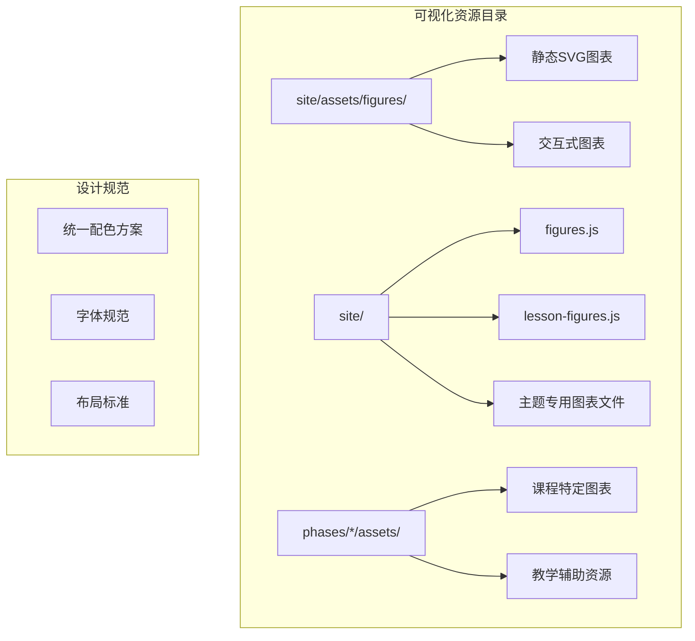
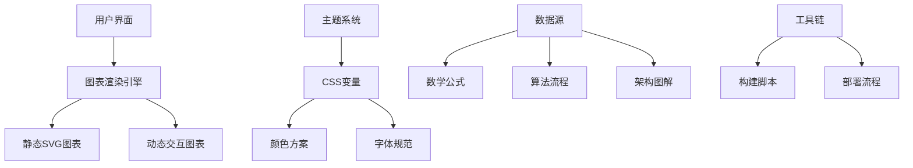
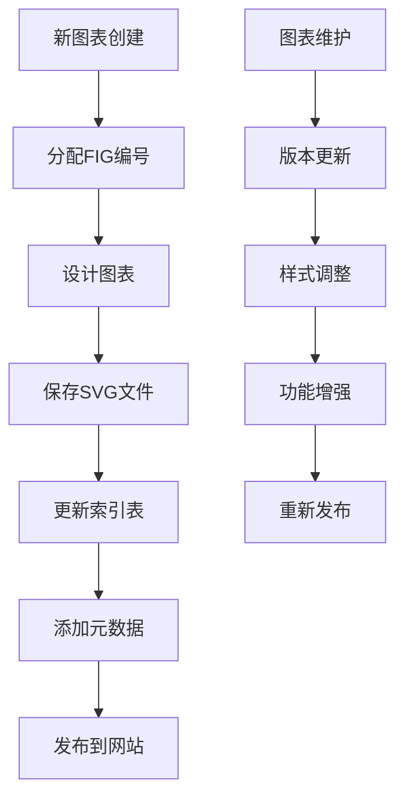
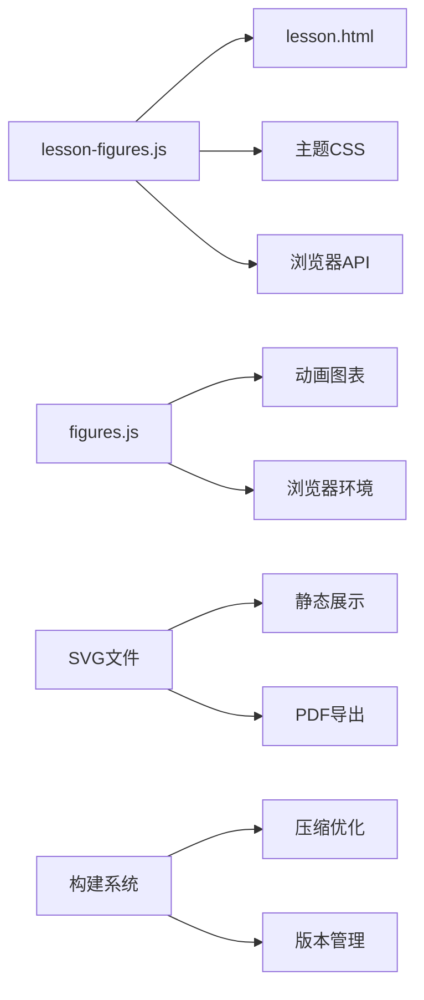

# 可视化资源

<cite>
**本文档引用的文件**
- [README.md](file://README.md)
- [site/assets/figures/INDEX.md](file://site/assets/figures/INDEX.md)
- [site/figures.js](file://site/figures.js)
- [site/lesson-figures.js](file://site/lesson-figures.js)
- [site/figures-math.js](file://site/figures-math.js)
- [site/figures-ml.js](file://site/figures-ml.js)
- [site/figures-dl.js](file://site/figures-dl.js)
- [site/figures-transformers.js](file://site/figures-transformers.js)
- [site/figures-vision-speech.js](file://site/figures-vision-speech.js)
- [site/figures-genai-rl.js](file://site/figures-genai-rl.js)
- [site/figures-infra.js](file://site/figures-infra.js)
- [site/figures-llms-systems.js](file://site/figures-llms-systems.js)
- [site/figures-agents-alignment.js](file://site/figures-agents-alignment.js)
- [site/figures-frontier.js](file://site/figures-frontier.js)
- [glossary/README.md](file://glossary/README.md)
</cite>

## 目录
1. [简介](#简介)
2. [项目结构](#项目结构)
3. [核心组件](#核心组件)
4. [架构概览](#架构概览)
5. [详细组件分析](#详细组件分析)
6. [依赖关系分析](#依赖关系分析)
7. [性能考虑](#性能考虑)
8. [故障排除指南](#故障排除指南)
9. [结论](#结论)

## 简介

本项目提供了丰富的可视化资源，用于支持AI工程学习过程中的概念理解、算法演示和架构展示。这些可视化资源采用统一的设计语言和交互模式，为学习者提供直观的学习辅助材料。

项目中的可视化资源主要分为两大类：

1. **静态概念图解**：通过SVG格式呈现的静态图表，用于解释核心概念和原理
2. **动态交互图表**：基于JavaScript的可交互可视化，支持参数调整和实时演示

所有图表都遵循统一的美学标准，使用Cream + Blueprint设计语言，确保视觉一致性。

## 项目结构

项目采用模块化的可视化资源组织方式：

**图表来源**
- [site/assets/figures/INDEX.md:1-44](file://site/assets/figures/INDEX.md#L1-L44)
- [README.md:161-184](file://README.md#L161-L184)

**章节来源**
- [site/assets/figures/INDEX.md:1-44](file://site/assets/figures/INDEX.md#L1-L44)
- [README.md:161-184](file://README.md#L161-L184)

## 核心组件

### 静态SVG图表系统

项目维护了一个完整的静态SVG图表索引，包含以下特点：

- **编号系统**：FIG编号全局唯一且单调递增
- **版本控制**：每个图表都有添加日期记录
- **设计规范**：遵循Blueprint设计语言标准
- **内容管理**：详细的注释说明图表用途

### 动态交互图表系统

交互式图表系统提供了丰富的学习体验：

- **无依赖设计**：纯JavaScript实现，无需外部库
- **主题适配**：自动跟随网站CSS变量主题
- **参数控制**：支持滑块、下拉菜单等交互控件
- **实时演示**：参数变化时即时更新图表

**章节来源**
- [site/figures.js:1-15](file://site/figures.js#L1-L15)
- [site/lesson-figures.js:1-8](file://site/lesson-figures.js#L1-L8)

## 架构概览

可视化系统的整体架构采用分层设计：

**图表来源**
- [site/figures.js:16-42](file://site/figures.js#L16-L42)
- [site/lesson-figures.js:9-43](file://site/lesson-figures.js#L9-L43)

## 详细组件分析

### 图表索引管理系统

图表索引系统提供了完整的图表生命周期管理：

**图表来源**
- [site/assets/figures/INDEX.md:26-40](file://site/assets/figures/INDEX.md#L26-L40)

### 交互式图表渲染引擎

交互式图表系统的核心渲染引擎具备以下特性：

#### 基础渲染功能
- **DOM操作**：使用原生JavaScript创建SVG元素
- **主题适配**：通过CSS变量实现深浅主题切换
- **动画支持**：基于requestAnimationFrame的流畅动画
- **响应式设计**：自适应不同屏幕尺寸

#### 交互控制组件
- **滑块控件**：支持数值范围选择
- **下拉菜单**：提供选项切换功能
- **状态显示**：实时显示计算结果
- **进度指示**：可视化参数变化效果

**章节来源**
- [site/lesson-figures.js:45-94](file://site/lesson-figures.js#L45-L94)

### 主题与设计规范

项目采用统一的设计语言确保视觉一致性：

#### 配色方案
- **主色调**：Blueprint Blue (#3553ff)
- **背景色**：Cream (#fafaf5)
- **文本色**：多种灰度级别
- **强调色**：Warning Yellow (#b8870f)

#### 字体规范
- **等宽字体**：JetBrains Mono用于技术内容
- **正文字体**：可变字体族
- **字号层次**：从10px到16px的完整体系
- **字重变化**：从400到700的粗细变化

**章节来源**
- [site/figures.js:44-48](file://site/figures.js#L44-L48)
- [site/lesson-figures.js:17-41](file://site/lesson-figures.js#L17-L41)

## 依赖关系分析

可视化资源系统与其他项目组件的关系：

**图表来源**
- [site/lesson-figures.js:706-732](file://site/lesson-figures.js#L706-L732)
- [site/figures.js:16-42](file://site/figures.js#L16-L42)

**章节来源**
- [site/lesson-figures.js:734-746](file://site/lesson-figures.js#L734-L746)

## 性能考虑

### 渲染性能优化

1. **懒加载机制**：仅在需要时渲染图表
2. **动画节流**：使用requestAnimationFrame避免过度重绘
3. **内存管理**：及时清理不再使用的DOM节点
4. **计算缓存**：避免重复计算相同的数据

### 文件大小优化

1. **SVG压缩**：移除不必要的元数据和注释
2. **代码分割**：按需加载不同类型的图表
3. **主题内联**：减少HTTP请求次数
4. **格式优化**：使用高效的SVG编码格式

## 故障排除指南

### 常见问题及解决方案

#### 图表不显示
- 检查浏览器是否支持SVG
- 确认CSS变量正确加载
- 验证JavaScript文件完整性

#### 交互功能失效
- 检查浏览器JavaScript执行权限
- 确认事件监听器正常工作
- 验证DOM元素存在性

#### 性能问题
- 检查动画帧率设置
- 优化复杂图表的渲染逻辑
- 减少不必要的DOM操作

**章节来源**
- [site/lesson-figures.js:716-731](file://site/lesson-figures.js#L716-L731)

## 结论

该项目的可视化资源系统展现了优秀的工程实践，通过统一的设计规范、灵活的交互模式和完善的管理流程，为AI工程学习提供了高质量的视觉辅助材料。系统的设计既保证了学习效果，又确保了良好的用户体验和技术可持续性。

未来可以考虑的功能扩展包括：
- 更多主题样式的支持
- 移动端优化改进
- 图表导出功能
- 多语言本地化支持