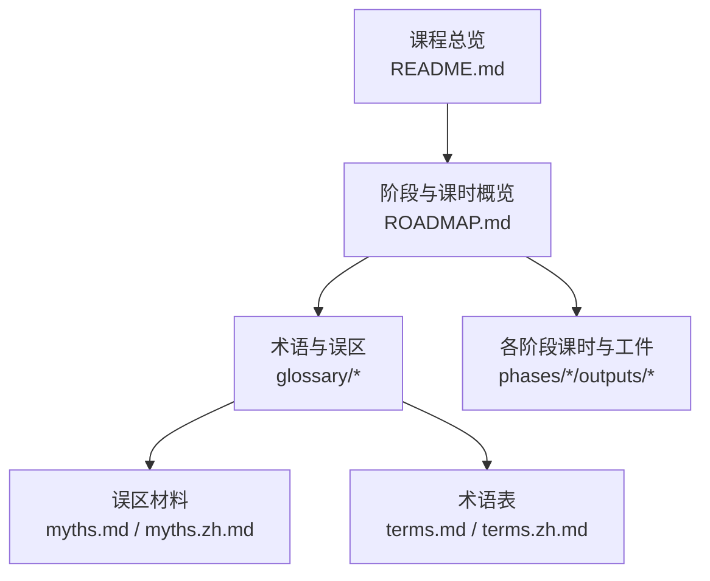
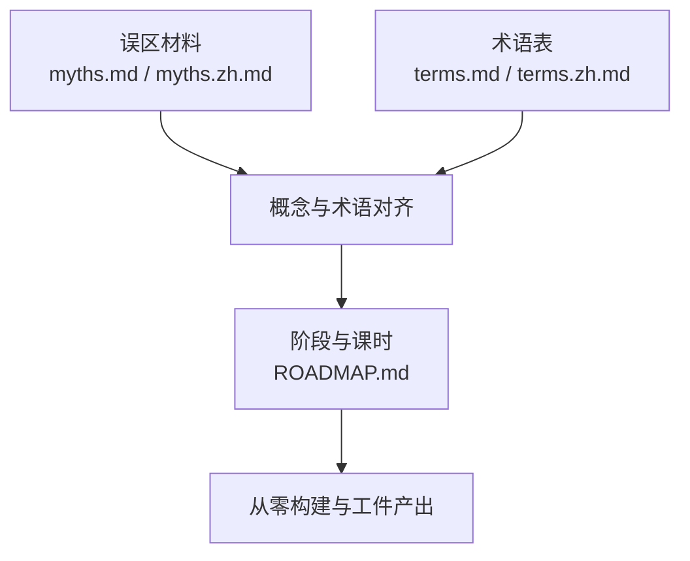

# 常见误区

<cite>
**本文引用的文件**
- [README.md](file://README.md)
- [ROADMAP.md](file://ROADMAP.md)
- [myths.md](file://glossary/myths.md)
- [myths.zh.md](file://glossary/myths.zh.md)
- [terms.md](file://glossary/terms.md)
- [terms.zh.md](file://glossary/terms.zh.md)
</cite>

## 目录
1. [引言](#引言)
2. [项目结构](#项目结构)
3. [核心组件](#核心组件)
4. [架构总览](#架构总览)
5. [详细组件分析](#详细组件分析)
6. [依赖分析](#依赖分析)
7. [性能考量](#性能考量)
8. [故障排查指南](#故障排查指南)
9. [结论](#结论)
10. [附录](#附录)

## 引言
本文件旨在系统性梳理与澄清学习者在AI工程学习过程中常遇的误区，覆盖理论、实践与行业偏见三大维度。内容来源于课程官方术语表与“误区”材料，强调以“实际做法”对齐“常见误解”，帮助读者建立稳健的知识框架与工程直觉。

## 项目结构
该仓库是一个系统化的AI工程课程，采用“阶段-课时”的组织方式，覆盖数学基础、机器学习、深度学习、计算机视觉、自然语言处理、语音音频、强化学习、大模型原理与工程、多模态、工具与协议、智能体工程、自治系统、多智能体与群集、基础设施与生产、伦理安全与对齐、以及总计数百个可执行工件的毕业项目。课程强调“从零构建”与“可复现工件”，便于读者对照自身学习路径与进度。

图表来源
- [README.md](file://README.md)
- [ROADMAP.md](file://ROADMAP.md)
- [myths.md](file://glossary/myths.md)
- [myths.zh.md](file://glossary/myths.zh.md)
- [terms.md](file://glossary/terms.md)
- [terms.zh.md](file://glossary/terms.zh.md)

章节来源
- [README.md](file://README.md)
- [ROADMAP.md](file://ROADMAP.md)

## 核心组件
- 误区澄清材料：系统列举20个常见误解，逐一给出“现实真相”与“为何重要”的解释，帮助纠正认知偏差。
- 术语表：对关键概念进行“常见说法—实际含义—命名缘由”的三段式说明，避免术语误用与浅层理解。
- 课程路线图：清晰标注各阶段与课时的完成状态与估算耗时，便于制定个人学习计划与进度管理。

章节来源
- [myths.md](file://glossary/myths.md)
- [myths.zh.md](file://glossary/myths.zh.md)
- [terms.md](file://glossary/terms.md)
- [terms.zh.md](file://glossary/terms.zh.md)
- [ROADMAP.md](file://ROADMAP.md)

## 架构总览
本课程以“阶段推进 + 课时闭环”的方式组织学习：每个课时包含“问题—概念—从零构建—使用成熟框架—产出可复用工件”的完整流程；术语与误区材料贯穿其中，帮助学习者在实践中不断校准认知。

图表来源
- [README.md](file://README.md)

## 详细组件分析

### 误区一：AI理解语言
- 错误观点：AI理解语言，能进行真正的推理与推理。
- 正确认知：LLM通过统计模式预测下一个token，没有信念或世界模型；输出看似理解，实为模式匹配的结果。
- 实际应用场景：在提示工程、RAG与安全护栏设计中，应将LLM视为强大的模式匹配器，而非推理引擎。
- 学习建议：通过术语表理解“自回归”“上下文窗口”等概念，避免将LLM当作“思考者”。

章节来源
- [myths.md](file://glossary/myths.md)
- [terms.md](file://glossary/terms.md)

### 误区二：参数越多越聪明
- 错误观点：参数规模越大，模型越智能。
- 正确认知：Chinchilla等研究表明，多数模型参数冗余且训练不足；数据质量与训练方法同样重要。
- 实际应用场景：在模型选型与预算规划中，优先考虑任务与数据质量，而非盲目追求更大模型。
- 学习建议：结合术语表中的“参数”“学习率”“优化器”等概念，理解训练与推理的权衡。

章节来源
- [myths.md](file://glossary/myths.md)
- [terms.md](file://glossary/terms.md)

### 误区三：神经网络是黑箱
- 错误观点：神经网络完全不可解释。
- 正确认知：注意力可视化、探针分类器与机制可解释性等工具可用于理解模型学习。
- 实际应用场景：在调试与优化中，利用注意力图与梯度分析定位问题。
- 学习建议：通过“注意力”“梯度”“归一化”等术语加深对模型内部机制的理解。

章节来源
- [myths.md](file://glossary/myths.md)
- [terms.md](file://glossary/terms.md)

### 误区四：AI会取代程序员
- 错误观点：AI将全面替代编程工作。
- 正确认知：AI改变了编程，提升了效率，但系统设计、架构与质量把控仍需人类主导。
- 实际应用场景：在智能体工程与工具协议中，LLM充当决策模块，工程能力决定最终系统质量。
- 学习建议：将AI工程理解为“编程+AI”的组合优势，而非替代关系。

章节来源
- [myths.md](file://glossary/myths.md)

### 误区五：做AI必须有数学博士
- 错误观点：需要高深数学背景才能从事AI工程。
- 正确认知：掌握高中数学与课程第一阶段的线性代数、微积分、概率与优化即可。
- 实际应用场景：在数学基础阶段打牢根基，后续深度学习与工程实践更顺畅。
- 学习建议：对照术语表中的“梯度”“矩阵”“概率分布”等概念，建立直观理解。

章节来源
- [myths.md](file://glossary/myths.md)
- [terms.md](file://glossary/terms.md)

### 误区六：GPT代表通用目的技术
- 错误观点：GPT是通用目的技术。
- 正确认知：GPT是生成式预训练Transformer，强调生成文本、预训练与Transformer架构。
- 实际应用场景：在模型选择与工程设计中，明确架构与任务的匹配关系。
- 学习建议：通过术语表理解“生成式”“预训练”“Transformer”等概念。

章节来源
- [myths.md](file://glossary/myths.md)
- [terms.md](file://glossary/terms.md)

### 误区七：温度提高创造力
- 错误观点：温度越高越“有创意”。
- 正确认知：温度是随机性调节器，高温度带来更随机输出，低温度更确定。
- 实际应用场景：在提示工程与输出稳定性之间平衡温度设置。
- 学习建议：结合术语表中的“温度”“softmax”“困惑度”等概念。

章节来源
- [myths.md](file://glossary/myths.md)
- [terms.md](file://glossary/terms.md)

### 误区八：微调能教模型新知识
- 错误观点：微调可让模型掌握新事实。
- 正确认知：微调调整使用既有知识的方式，新增事实需借助RAG。
- 实际应用场景：在问答与检索增强场景中，明确微调与RAG的边界。
- 学习建议：通过术语表中的“微调”“RAG”“检索”等概念建立系统化方法论。

章节来源
- [myths.md](file://glossary/myths.md)
- [terms.md](file://glossary/terms.md)

### 误区九：上下文窗口越大越好
- 错误观点：上下文越长越好。
- 正确认知：长上下文会退化，存在“中间丢失”问题；且成本更高、速度更慢。
- 实际应用场景：在提示设计与RAG策略中，优先选择高质量、精选内容。
- 学习建议：结合术语表中的“上下文窗口”“困惑度”“检索”等概念。

章节来源
- [myths.md](file://glossary/myths.md)
- [terms.md](file://glossary/terms.md)

### 误区十：AI智能体是自主的
- 错误观点：智能体具备目标、计划与自我意识。
- 正确认知：当前智能体是反应式循环系统，LLM仅是决策组件。
- 实际应用场景：在智能体工程中，重视循环、工具与安全护栏的设计。
- 学习建议：通过术语表中的“智能体”“函数调用”“守卫栏”等概念理解系统边界。

章节来源
- [myths.md](file://glossary/myths.md)
- [terms.md](file://glossary/terms.md)

### 误区十一：Transformer通过位置编码理解顺序
- 错误观点：Transformer天然理解序列顺序。
- 正确认知：位置编码是注入顺序信息的“补丁”，并非原生顺序理解。
- 实际应用场景：在注意力机制与位置编码设计中，理解其局限与改进方向。
- 学习建议：结合术语表中的“注意力”“位置编码”“自注意力”等概念。

章节来源
- [myths.md](file://glossary/myths.md)
- [terms.md](file://glossary/terms.md)

### 误区十二：预训练只是读互联网
- 错误观点：预训练只是“读互联网”。
- 正确认知：预训练是大规模语料上的下一个token预测，数据清洗与去重至关重要。
- 实际应用场景：在数据治理与模型训练中，重视数据质量与筛选策略。
- 学习建议：通过术语表中的“预训练”“困惑度”“数据增强”等概念。

章节来源
- [myths.md](file://glossary/myths.md)
- [terms.md](file://glossary/terms.md)

### 误区十三：RLHF实现对齐
- 错误观点：RLHF能实现普遍的人类价值观对齐。
- 正确认知：RLHF对特定人类偏好进行对齐，无法覆盖所有情境。
- 实际应用场景：在伦理与安全工程中，将RLHF视为工具之一，配合其他安全护栏。
- 学习建议：结合术语表中的“RLHF”“奖励模型”“对齐”等概念。

章节来源
- [myths.md](file://glossary/myths.md)
- [terms.md](file://glossary/terms.md)

### 误区十四：嵌入捕获语义
- 错误观点：嵌入直接表达“意义”。
- 正确认知：嵌入捕获统计共现模式，不是语义理解。
- 实际应用场景：在相似度搜索与检索中，避免过度解读“相似”的语义含义。
- 学习建议：通过术语表中的“嵌入”“余弦相似度”“语义搜索”等概念。

章节来源
- [myths.md](file://glossary/myths.md)
- [terms.md](file://glossary/terms.md)

### 误区十五：zero-shot意味着无需训练
- 错误观点：zero-shot不需要任何训练。
- 正确认知：zero-shot指推理时不给示例，但模型已接受过大规模训练。
- 实际应用场景：在提示工程与few-shot设计中，明确训练与推理的区别。
- 学习建议：结合术语表中的“zero-shot/few-shot/微调”等概念。

章节来源
- [myths.md](file://glossary/myths.md)
- [terms.md](file://glossary/terms.md)

### 误区十六：AI模型像人类一样学习
- 错误观点：AI学习方式与人类一致。
- 正确认知：人类从少量样本泛化，AI需要大量样本并在训练分布内泛化。
- 实际应用场景：在实验设计与模型选择中，避免对AI能力的过度拟人化期待。
- 学习建议：通过术语表中的“归纳偏置”“过拟合/欠拟合”等概念。

章节来源
- [myths.md](file://glossary/myths.md)
- [terms.md](file://glossary/terms.md)

### 误区十七：缩放定律意味着越大越好
- 错误观点：只要扩大规模，性能就会线性提升。
- 正确认知：缩放定律显示收益递减，且需配合数据与架构改进。
- 实际应用场景：在模型与系统设计中，综合考虑计算、数据与工程优化。
- 学习建议：结合术语表中的“缩放定律”“混合精度”“分布式训练”等概念。

章节来源
- [myths.md](file://glossary/myths.md)
- [terms.md](file://glossary/terms.md)

### 误区十八：开源AI等于开放权重
- 错误观点：开源AI即开放权重。
- 正确认知：多数“开源”模型仅开放权重，不开放训练代码与数据管线；真正开源更进一步。
- 实际应用场景：在模型复现与研究中，明确“开放权重”与“真正开源”的差异。
- 学习建议：通过术语表中的“开放权重/开源”“模型卡片”等概念。

章节来源
- [myths.md](file://glossary/myths.md)
- [terms.md](file://glossary/terms.md)

### 误区十九：提示工程不是工程
- 错误观点：提示工程只是“好好说话”。
- 正确认知：提示工程是系统设计，涉及分词、注意力、上下文窗口与输出解析。
- 实际应用场景：在LLM工程与产品集成中，将提示工程视为严谨的工程学科。
- 学习建议：结合术语表中的“提示工程”“系统提示”“思维链”等概念。

章节来源
- [myths.md](file://glossary/myths.md)
- [terms.md](file://glossary/terms.md)

### 误区二十：CNN过时，全靠Transformer
- 错误观点：CNN已被Transformer完全取代。
- 正确认知：ViT在某些基准上超越CNN，但CNN在推理速度、移动端部署与归纳偏置方面仍有优势。
- 实际应用场景：在视觉系统设计中，根据场景选择合适架构或混合方案。
- 学习建议：通过术语表中的“CNN/Transformer/ViT”“归纳偏置”等概念。

章节来源
- [myths.md](file://glossary/myths.md)
- [terms.md](file://glossary/terms.md)

## 依赖分析
- 术语与误区材料是课程认知层面的“导航系统”，贯穿各阶段与课时，帮助学习者在实践中不断校准理解。
- 课程路线图与阶段结构为学习路径提供“时间与进度”维度的支撑，便于制定个性化学习计划。

图表来源
- [myths.md](file://glossary/myths.md)
- [myths.zh.md](file://glossary/myths.zh.md)
- [terms.md](file://glossary/terms.md)
- [terms.zh.md](file://glossary/terms.zh.md)
- [ROADMAP.md](file://ROADMAP.md)

章节来源
- [ROADMAP.md](file://ROADMAP.md)

## 性能考量
- 认知成本与工程效率：通过术语与误区材料减少“错误路径”的试错成本，提升学习与工程效率。
- 实践导向：课程强调“从零构建—使用框架—产出工件”，有助于在真实项目中快速落地与迭代。

## 故障排查指南
- 若遇到“输出不符合预期”：回看“提示工程”“few-shot/zero-shot”“上下文窗口”等概念，检查提示设计与上下文长度。
- 若遇到“模型不稳定/发散”：回顾“梯度”“梯度爆炸/消失”“学习率”“归一化”等术语，定位训练问题。
- 若遇到“推理速度慢/显存不足”：结合“混合精度”“分布式训练”“KV缓存”“量化”等概念优化系统。

章节来源
- [terms.md](file://glossary/terms.md)

## 结论
本课程以“误区—术语—实践”的闭环结构，帮助学习者在理论与工程之间建立稳健桥梁。通过系统性澄清常见误区与提供权威术语解释，学习者能够更高效地构建可复现、可解释、可生产的AI系统。

## 附录
- 学习建议清单
  - 以术语表为“知识地图”，在每个阶段对照“常见说法—实际含义—命名缘由”加深理解。
  - 以误区材料为“认知刹车”，在工程实践中主动识别并纠正错误直觉。
  - 以课程路线图为“进度仪表盘”，结合估算耗时制定阶段性里程碑。
  - 在每个课时完成后，对照“从零构建—使用框架—产出工件”的闭环，沉淀可复用技能与提示。

章节来源
- [README.md](file://README.md)
- [ROADMAP.md](file://ROADMAP.md)
- [terms.md](file://glossary/terms.md)
- [myths.md](file://glossary/myths.md)