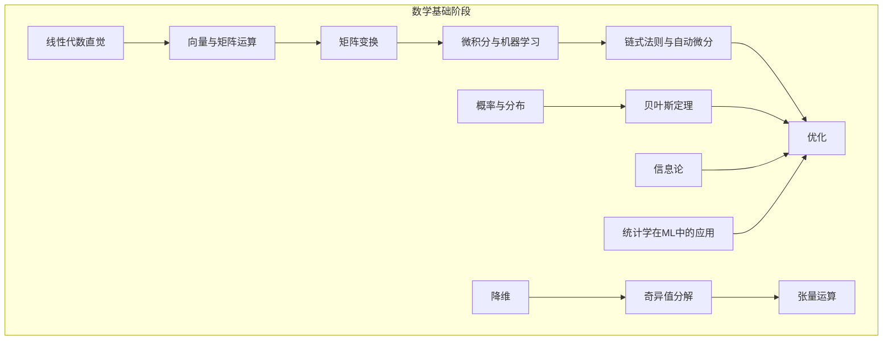
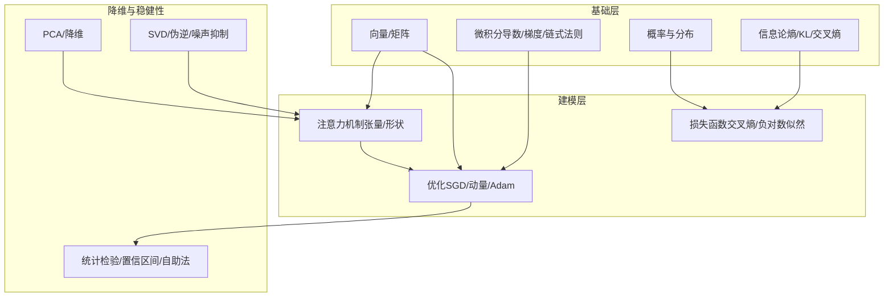
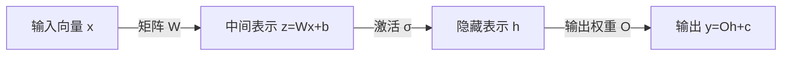
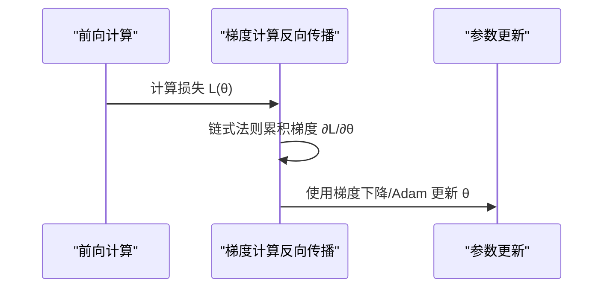
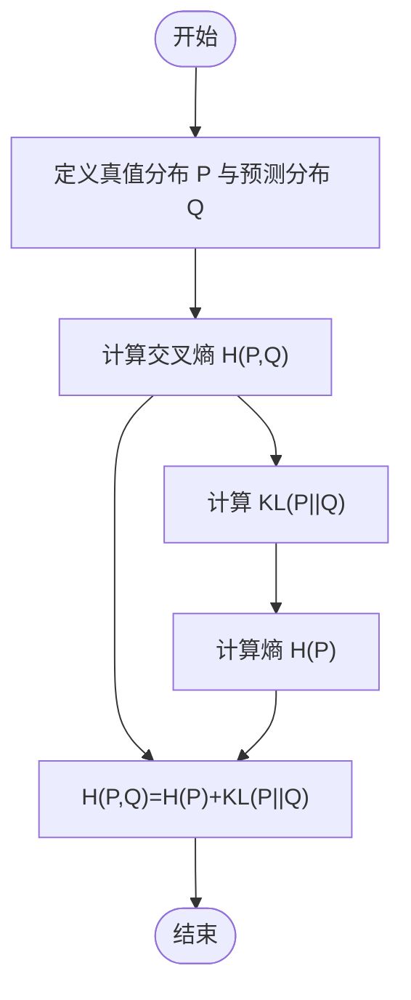
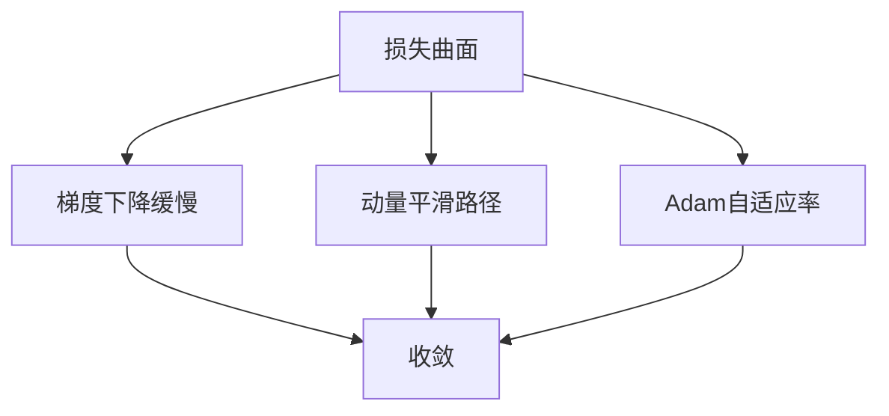
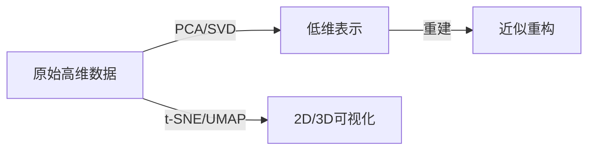
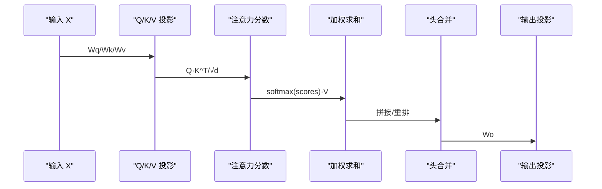
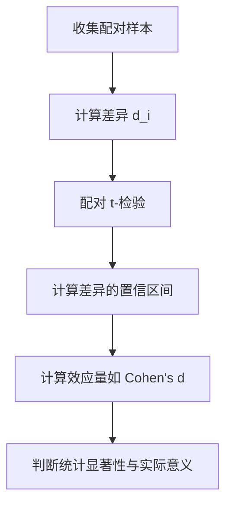
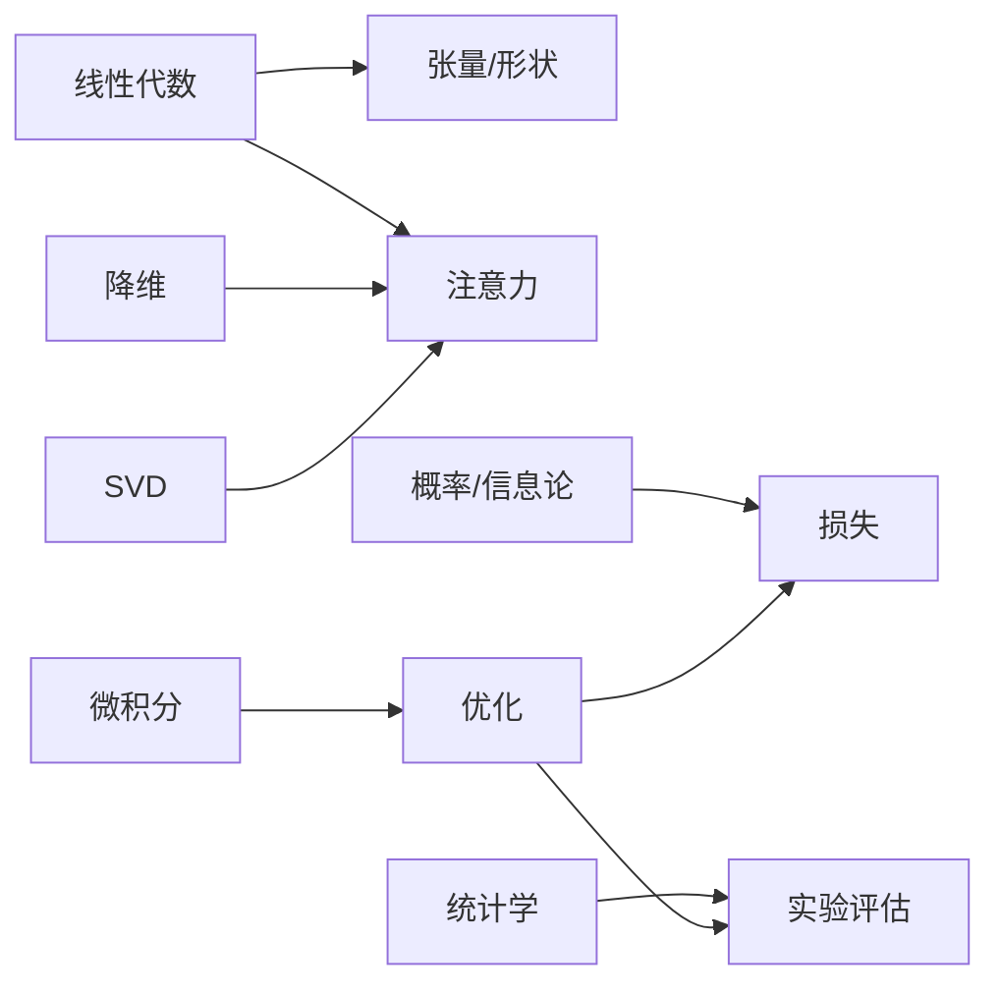

# 数学公式

<cite>
**本文引用的文件**
- [线性代数直觉（英文）](file://phases/01-math-foundations/01-linear-algebra-intuition/docs/en.md)
- [向量与矩阵运算（英文）](file://phases/01-math-foundations/02-vectors-matrices-operations/docs/en.md)
- [矩阵变换（英文）](file://phases/01-math-foundations/03-matrix-transformations/docs/en.md)
- [微积分与机器学习（英文）](file://phases/01-math-foundations/04-calculus-for-ml/docs/en.md)
- [链式法则与自动微分（英文）](file://phases/01-math-foundations/05-chain-rule-and-autodiff/docs/en.md)
- [概率与分布（英文）](file://phases/01-math-foundations/06-probability-and-distributions/docs/en.md)
- [贝叶斯定理（英文）](file://phases/01-math-foundations/07-bayes-theorem/docs/en.md)
- [优化（英文）](file://phases/01-math-foundations/08-optimization/docs/en.md)
- [信息论（英文）](file://phases/01-math-foundations/09-information-theory/docs/en.md)
- [降维（英文）](file://phases/01-math-foundations/10-dimensionality-reduction/docs/en.md)
- [奇异值分解（英文）](file://phases/01-math-foundations/11-singular-value-decomposition/docs/en.md)
- [张量运算（英文）](file://phases/01-math-foundations/12-tensor-operations/docs/en.md)
- [统计学在机器学习中的应用（英文）](file://phases/01-math-foundations/15-statistics-for-ml/docs/en.md)
- [向量与矩阵运算（Python 实现）](file://phases/01-math-foundations/02-vectors-matrices-operations/code/matrices.py)
- [张量类与形状追踪（Python 实现）](file://phases/01-math-foundations/12-tensor-operations/code/tensors.py)
- [数据索引与形状调试提示](file://site/data.js)
</cite>

## 目录
1. [简介](#简介)
2. [项目结构](#项目结构)
3. [核心组件](#核心组件)
4. [架构总览](#架构总览)
5. [详细组件分析](#详细组件分析)
6. [依赖关系分析](#依赖关系分析)
7. [性能考量](#性能考量)
8. [故障排查指南](#故障排查指南)
9. [结论](#结论)
10. [附录](#附录)

## 简介
本参考文档面向AI工程实践，系统梳理线性代数、微积分、概率论与统计学中的关键数学公式与定理，结合具体AI应用场景（如神经网络前向/反向传播、注意力机制、优化器、信息论损失、降维与低秩近似、张量形状管理等），给出：
- 公式与定理的符号说明、适用条件与几何/直观解释
- 推导要点与常见陷阱
- 在机器学习与深度学习中的落地用法与典型流程
- 形状追踪与数值稳定性建议

## 项目结构
该仓库将“数学基础”划分为若干阶段，每阶段围绕一个主题构建：从线性代数直觉、向量/矩阵运算，到微积分、概率与信息论，再到降维、SVD、张量与统计学。配套有：
- 教学文档（含公式、图示与练习）
- 从零实现的代码片段（便于理解内部机制）
- 可直接复用的提示词与技能清单（用于工程化辅助）

**章节来源**
- [线性代数直觉（英文）:1-464](file://phases/01-math-foundations/01-linear-algebra-intuition/docs/en.md#L1-L464)
- [向量与矩阵运算（英文）:1-628](file://phases/01-math-foundations/02-vectors-matrices-operations/docs/en.md#L1-L628)
- [微积分与机器学习（英文）:1-628](file://phases/01-math-foundations/04-calculus-for-ml/docs/en.md#L1-L628)
- [概率与分布（英文）:1-459](file://phases/01-math-foundations/06-probability-and-distributions/docs/en.md#L1-L459)
- [信息论（英文）:1-472](file://phases/01-math-foundations/09-information-theory/docs/en.md#L1-L472)
- [降维（英文）:1-375](file://phases/01-math-foundations/10-dimensionality-reduction/docs/en.md#L1-L375)
- [奇异值分解（英文）:1-551](file://phases/01-math-foundations/11-singular-value-decomposition/docs/en.md#L1-L551)
- [张量运算（英文）:1-345](file://phases/01-math-foundations/12-tensor-operations/docs/en.md#L1-L345)
- [统计学在机器学习中的应用（英文）:1-517](file://phases/01-math-foundations/15-statistics-for-ml/docs/en.md#L1-L517)

## 核心组件
- 线性代数：向量、矩阵、矩阵乘法、转置、行列式、逆、特征值/特征向量、正交性、投影、QR分解、SVD
- 微积分：导数、偏导、梯度、链式法则、Hessian、泰勒展开、数值微分、解析微分
- 概率与信息论：事件与样本空间、条件概率、PMF/PDF、期望与方差、联合/边缘分布、贝叶斯定理、熵、交叉熵、KL散度、互信息、困惑度
- 优化：梯度下降、动量、Adam、学习率调度、损失曲面、鞍点与平坦极小值
- 降维与低秩：PCA、t-SNE、UMAP、核PCA、截断SVD、伪逆、噪声抑制
- 张量与形状：多维数组、内存布局、步幅、广播、einsum、注意力形状追踪
- 统计学：描述性统计、相关系数、协方差矩阵、假设检验、置信区间、自助法、多重比较校正

**章节来源**
- [线性代数直觉（英文）:1-464](file://phases/01-math-foundations/01-linear-algebra-intuition/docs/en.md#L1-L464)
- [向量与矩阵运算（英文）:1-628](file://phases/01-math-foundations/02-vectors-matrices-operations/docs/en.md#L1-L628)
- [微积分与机器学习（英文）:1-628](file://phases/01-math-foundations/04-calculus-for-ml/docs/en.md#L1-L628)
- [概率与分布（英文）:1-459](file://phases/01-math-foundations/06-probability-and-distributions/docs/en.md#L1-L459)
- [贝叶斯定理（英文）:1-475](file://phases/01-math-foundations/07-bayes-theorem/docs/en.md#L1-L475)
- [优化（英文）:1-381](file://phases/01-math-foundations/08-optimization/docs/en.md#L1-L381)
- [信息论（英文）:1-472](file://phases/01-math-foundations/09-information-theory/docs/en.md#L1-L472)
- [降维（英文）:1-375](file://phases/01-math-foundations/10-dimensionality-reduction/docs/en.md#L1-L375)
- [奇异值分解（英文）:1-551](file://phases/01-math-foundations/11-singular-value-decomposition/docs/en.md#L1-L551)
- [张量运算（英文）:1-345](file://phases/01-math-foundations/12-tensor-operations/docs/en.md#L1-L345)
- [统计学在机器学习中的应用（英文）:1-517](file://phases/01-math-foundations/15-statistics-for-ml/docs/en.md#L1-L517)

## 架构总览
下图展示了从“线性代数直觉”到“深度学习训练”的数学链条：向量/矩阵作为数据与权重的基础，微积分提供梯度与优化方向，概率与信息论定义损失与不确定性，降维与SVD支撑模型压缩与鲁棒性，张量与形状管理贯穿端到端的数据流。

**图表来源**
- [线性代数直觉（英文）:1-464](file://phases/01-math-foundations/01-linear-algebra-intuition/docs/en.md#L1-L464)
- [微积分与机器学习（英文）:1-628](file://phases/01-math-foundations/04-calculus-for-ml/docs/en.md#L1-L628)
- [概率与分布（英文）:1-459](file://phases/01-math-foundations/06-probability-and-distributions/docs/en.md#L1-L459)
- [信息论（英文）:1-472](file://phases/01-math-foundations/09-information-theory/docs/en.md#L1-L472)
- [张量运算（英文）:1-345](file://phases/01-math-foundations/12-tensor-operations/docs/en.md#L1-L345)
- [统计学在机器学习中的应用（英文）:1-517](file://phases/01-math-foundations/15-statistics-for-ml/docs/en.md#L1-L517)

## 详细组件分析

### 线性代数：向量、矩阵与变换
- 向量与矩阵
  - 几何意义：向量是高维空间中的点/方向；矩阵是线性变换，将向量从一个空间映射到另一个空间
  - 运算：加法、标量乘法、逐元素乘法、矩阵乘法、转置、行列式、逆、单位阵
  - 形状规则：(m×n)@(n×p)=(m×p)，内维必须匹配
- 矩阵分解与几何解释
  - QR分解：正交因子×上三角，用于数值稳定求解线性系统与最小二乘
  - SVD：U×Σ×V^T，旋转→缩放→旋转，揭示矩阵作用下的椭球几何
- 应用
  - 神经网络前向：输出 = σ(权重×输入 + 偏置)
  - 注意力：Q/K/V 投影、注意力分数、加权求和、输出投影

**图表来源**
- [向量与矩阵运算（英文）:250-271](file://phases/01-math-foundations/02-vectors-matrices-operations/docs/en.md#L250-L271)
- [线性代数直觉（英文）:42-63](file://phases/01-math-foundations/01-linear-algebra-intuition/docs/en.md#L42-L63)

**章节来源**
- [线性代数直觉（英文）:1-464](file://phases/01-math-foundations/01-linear-algebra-intuition/docs/en.md#L1-L464)
- [向量与矩阵运算（英文）:1-628](file://phases/01-math-foundations/02-vectors-matrices-operations/docs/en.md#L1-L628)
- [矩阵变换（英文）:1-475](file://phases/01-math-foundations/03-matrix-transformations/docs/en.md#L1-L475)

### 微积分：导数、梯度与链式法则
- 导数与梯度
  - 导数：瞬时变化率；梯度：多变量函数的斜率向量
  - 几何：梯度指向函数增长最快的方向
- 链式法则
  - 复合函数求导的基石，反向传播即链式法则的系统化应用
- Hessian与泰勒展开
  - Hessian描述曲率；一阶泰勒近似对应梯度下降，二阶近似对应牛顿法
- 数值与解析微分
  - 数值微分（中心差分）稳定但慢；解析微分高效但需手工推导；自动微分在工程中平衡二者

**图表来源**
- [微积分与机器学习（英文）:326-351](file://phases/01-math-foundations/04-calculus-for-ml/docs/en.md#L326-L351)
- [链式法则与自动微分（英文）:1-475](file://phases/01-math-foundations/05-chain-rule-and-autodiff/docs/en.md#L1-L475)

**章节来源**
- [微积分与机器学习（英文）:1-628](file://phases/01-math-foundations/04-calculus-for-ml/docs/en.md#L1-L628)
- [链式法则与自动微分（英文）:1-475](file://phases/01-math-foundations/05-chain-rule-and-autodiff/docs/en.md#L1-L475)

### 概率与信息论：分布、熵与损失
- 概率基础
  - 事件、样本空间、条件概率、独立性、PMF/PDF、期望与方差
- 信息论
  - 信息含量 I(x)=-log p(x)；熵 H(P)=-Σ p(x)log p(x)；交叉熵 H(P,Q)；KL 散度 D(P||Q)=H(P,Q)-H(P)
  - 互信息 I(X;Y)=H(X)-H(X|Y)，衡量变量间共享的信息
  - 困惑度 Perplexity=exp(H(P,Q))
- 损失函数
  - 分类交叉熵等价于负对数似然；softmax+log_softmax保证数值稳定

**图表来源**
- [信息论（英文）:66-96](file://phases/01-math-foundations/09-information-theory/docs/en.md#L66-L96)

**章节来源**
- [概率与分布（英文）:1-459](file://phases/01-math-foundations/06-probability-and-distributions/docs/en.md#L1-L459)
- [信息论（英文）:1-472](file://phases/01-math-foundations/09-information-theory/docs/en.md#L1-L472)

### 优化：梯度下降、动量与自适应学习率
- 基本策略
  - 梯度下降：沿梯度反方向移动；学习率控制步长
  - 动量：累积历史梯度，加速收敛并抑制震荡
  - Adam：按参数维护一阶与二阶矩估计，自适应学习率
- 学习率调度
  - 步骤衰减、指数衰减、余弦退火、Warmup
- 高维损失曲面
  - 局部极小值通常不构成大问题；鞍点更常见，动量与小批量噪声有助于逃逸

**图表来源**
- [优化（英文）:179-194](file://phases/01-math-foundations/08-optimization/docs/en.md#L179-L194)

**章节来源**
- [优化（英文）:1-381](file://phases/01-math-foundations/08-optimization/docs/en.md#L1-L381)

### 降维与低秩近似：PCA、SVD、t-SNE、UMAP
- PCA：主成分是协方差矩阵的特征向量；解释方差比用于选择主成分数
- 截断SVD：最优低秩近似（Eckart-Young定理）；图像压缩、去噪、推荐系统（隐因子）
- t-SNE/UMAP：非线性降维，保留局部邻域结构；UMAP更快且更好保持全局结构
- 核PCA：通过核技巧处理非线性流形

**图表来源**
- [降维（英文）:45-69](file://phases/01-math-foundations/10-dimensionality-reduction/docs/en.md#L45-L69)
- [奇异值分解（英文）:141-157](file://phases/01-math-foundations/11-singular-value-decomposition/docs/en.md#L141-L157)

**章节来源**
- [降维（英文）:1-375](file://phases/01-math-foundations/10-dimensionality-reduction/docs/en.md#L1-L375)
- [奇异值分解（英文）:1-551](file://phases/01-math-foundations/11-singular-value-decomposition/docs/en.md#L1-L551)

### 张量与形状管理：einsum与注意力
- 张量与形状
  - 多维数组、步幅、内存布局（NCHW/NHWC）、视图与连续性
  - 广播规则：右对齐、任一边为1则兼容
- einsum
  - 用标签表达任意张量收缩、外积、转置、批量矩阵乘法
- 注意力机制
  - 输入投影、拆分头、计算注意力分数、加权求和、合并头、输出投影
  - 每一步都对应明确的张量形状与运算

**图表来源**
- [张量运算（英文）:237-257](file://phases/01-math-foundations/12-tensor-operations/docs/en.md#L237-L257)

**章节来源**
- [张量运算（英文）:1-345](file://phases/01-math-foundations/12-tensor-operations/docs/en.md#L1-L345)

### 统计学：评估与实验设计
- 描述性统计：均值、中位数、标准差、百分位、IQR
- 相关性：皮尔逊（线性）、斯皮尔曼（单调）
- 协方差矩阵：编码特征间的线性关系
- 假设检验：t检验（单样本/两样本/配对）、卡方检验、p值与置信区间
- 自助法：无分布假设估计置信区间
- 多重比较：Bonferroni 校正
- 实践要点：A/B测试需相同测试集、多指标评估、避免数据泄露

**图表来源**
- [统计学在机器学习中的应用（英文）:269-281](file://phases/01-math-foundations/15-statistics-for-ml/docs/en.md#L269-L281)

**章节来源**
- [统计学在机器学习中的应用（英文）:1-517](file://phases/01-math-foundations/15-statistics-for-ml/docs/en.md#L1-L517)

## 依赖关系分析
- 数学基础层层递进：线性代数是张量与注意力的根基；微积分驱动优化；概率与信息论定义损失；统计学保障实验可信度
- 工程实现与教学文档互补：代码示例帮助理解形状、广播、einsum与SVD等细节

**图表来源**
- [张量运算（英文）:1-345](file://phases/01-math-foundations/12-tensor-operations/docs/en.md#L1-L345)
- [统计学在机器学习中的应用（英文）:1-517](file://phases/01-math-foundations/15-statistics-for-ml/docs/en.md#L1-L517)

## 性能考量
- 数值稳定性
  - softmax/log_softmax 使用“减去最大logit”防止溢出
  - 交叉熵与KL散度的数值实现注意边界（概率为0或1）
  - SVD优先直接求解，避免形成 A^T A 导致条件数恶化
- 计算效率
  - 使用向量化与BLAS库（如NumPy/PyTorch）
  - 注意力中的einsum可统一表达多种矩阵乘法与收缩
- 内存与形状
  - 避免不必要的拷贝，使用view/reshape与contiguous
  - 广播减少显式扩展，但要确保轴对齐正确

[本节为通用指导，无需引用具体文件]

## 故障排查指南
- 形状错误（最常见）
  - 症状：报错“形状不匹配”或“期望4D输入”
  - 排查步骤：列出每一步的张量形状，确认矩阵乘法内维一致、广播规则满足、转置/重排是否正确
  - 参考提示：仓库提供了“张量形状调试提示”与“张量形状决策表”，可直接用于辅助排查
- 梯度异常
  - 检查损失是否为标量、是否对参数可微；确认反向传播是否完整
- 概率/信息论相关
  - softmax后取log时注意数值范围；交叉熵中若预测概率接近0/1，注意数值稳定性
- 降维与SVD
  - 观察奇异值谱，快速判断是否适合低秩近似；注意噪声抑制与重构误差

**章节来源**
- [张量运算（英文）:305-312](file://phases/01-math-foundations/12-tensor-operations/docs/en.md#L305-L312)
- [数据索引与形状调试提示:5276-5313](file://site/data.js#L5276-L5313)

## 结论
本参考文档将数学公式与AI工程实践紧密结合：从线性代数的几何直觉，到微积分的优化方向，再到概率与信息论的损失定义，以及降维与SVD的稳健性与压缩能力，最后落到张量与形状管理的工程细节。掌握这些公式与它们在端到端流水线中的角色，能够显著提升调试效率与模型可靠性。

[本节为总结性内容，无需引用具体文件]

## 附录
- 代码实现参考
  - 向量/矩阵类与基本运算：[向量与矩阵运算（Python 实现）:1-192](file://phases/01-math-foundations/02-vectors-matrices-operations/code/matrices.py#L1-L192)
  - 张量类与形状追踪：[张量类与形状追踪（Python 实现）:1-345](file://phases/01-math-foundations/12-tensor-operations/code/tensors.py#L1-L345)
- 提示与技能
  - 张量形状调试提示与决策表：见“附录”中“数据索引与形状调试提示”部分

**章节来源**
- [向量与矩阵运算（Python 实现）:1-192](file://phases/01-math-foundations/02-vectors-matrices-operations/code/matrices.py#L1-L192)
- [张量类与形状追踪（Python 实现）:1-345](file://phases/01-math-foundations/12-tensor-operations/code/tensors.py#L1-L345)
- [数据索引与形状调试提示:5276-5313](file://site/data.js#L5276-L5313)