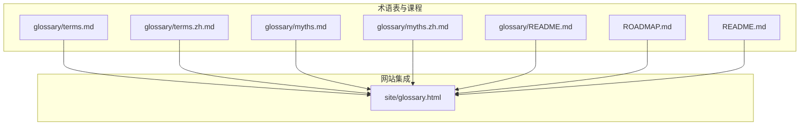
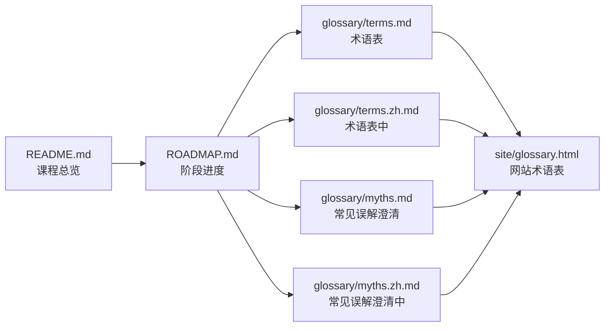
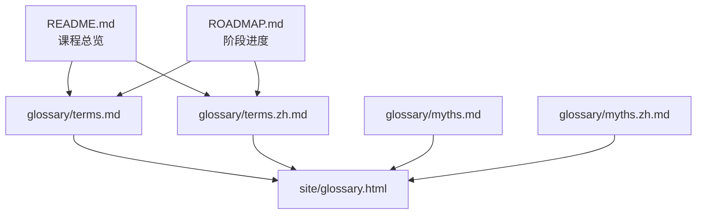

# 术语表

<cite>
**本文引用的文件**
- [术语表（英文）](file://glossary/terms.md)
- [术语表（中文）](file://glossary/terms.zh.md)
- [常见误解澄清（英文）](file://glossary/myths.md)
- [常见误解澄清（中文）](file://glossary/myths.zh.md)
- [术语表说明](file://glossary/README.md)
- [项目总览](file://README.md)
- [路线图](file://ROADMAP.md)
- [网站术语表页面](file://site/glossary.html)
</cite>

## 目录
1. [简介](#简介)
2. [项目结构](#项目结构)
3. [核心组成](#核心组成)
4. [架构概览](#架构概览)
5. [详细术语分析](#详细术语分析)
6. [依赖关系分析](#依赖关系分析)
7. [性能考量](#性能考量)
8. [故障排查指南](#故障排查指南)
9. [结论](#结论)
10. [附录](#附录)

## 简介
本术语表面向“AI工程”学习者与从业者，系统梳理AI工程领域的专业词汇、缩写词与技术术语，提供中英对照版本，确保术语的准确性与一致性。术语条目涵盖机器学习、深度学习、计算机视觉、自然语言处理、语音音频、生成式AI、强化学习、大模型工程、多模态、工具与协议、智能体工程、自治系统、多智能体与蜂群、基础设施与生产、伦理与对齐等主题，帮助读者建立统一、严谨、实用的AI工程词汇体系。

## 项目结构
术语表位于仓库的glossary目录，包含两套完整版本：
- 英文术语表：glossary/terms.md
- 中文术语表：glossary/terms.zh.md
- 常见误解澄清（英文）：glossary/myths.md
- 常见误解澄清（中文）：glossary/myths.zh.md
- 术语表说明：glossary/README.md

术语表与课程体系紧密关联，课程总览与路线图展示了20个阶段的完整知识树，术语表覆盖各阶段的核心概念，便于学习者在不同阶段查阅与巩固。

图表来源
- [术语表（英文）](file://glossary/terms.md)
- [术语表（中文）](file://glossary/terms.zh.md)
- [常见误解澄清（英文）](file://glossary/myths.md)
- [常见误解澄清（中文）](file://glossary/myths.zh.md)
- [术语表说明](file://glossary/README.md)
- [路线图](file://ROADMAP.md)
- [项目总览](file://README.md)
- [网站术语表页面](file://site/glossary.html)

章节来源
- [术语表说明](file://glossary/README.md)
- [项目总览](file://README.md)
- [路线图](file://ROADMAP.md)

## 核心组成
术语表采用统一的三段式结构：
- “人们说”：常见但往往不准确的理解
- “实际含义”：技术定义与真实机制
- “为什么这么叫”：术语来源与命名缘由（若适用）

该结构有助于消除误解、建立正确的技术直觉，并为后续深入学习打下基础。

章节来源
- [术语表（英文）](file://glossary/terms.md)
- [术语表（中文）](file://glossary/terms.zh.md)

## 架构概览
术语表与课程体系的关系如下：
- 课程总览展示20个阶段的知识树，术语表覆盖各阶段核心概念
- 术语表与路线图共同构成学习路径的“词汇—知识”双轴支撑
- 网站glossary.html页面整合术语表与路线图，提供在线查阅体验

图表来源
- [项目总览](file://README.md)
- [路线图](file://ROADMAP.md)
- [术语表（英文）](file://glossary/terms.md)
- [术语表（中文）](file://glossary/terms.zh.md)
- [常见误解澄清（英文）](file://glossary/myths.md)
- [常见误解澄清（中文）](file://glossary/myths.zh.md)
- [网站术语表页面](file://site/glossary.html)

## 详细术语分析

### 机器学习与深度学习基础
- 模型与训练
  - 模型参数（Parameter）：模型中可学习的数值，如权重与偏置；参数数量直接影响显存占用与推理成本
  - 激活函数（Activation Function）：在层间引入非线性，常见如ReLU、GELU、SiLU；选择影响梯度流动与训练稳定性
  - 优化器（Optimizer）：使用梯度更新参数，如SGD、Adam、AdamW；不同优化器在收敛速度、内存占用与超参敏感性方面有差异
  - 损失函数（Loss Function）：衡量预测与真实输出差距，如MSE、交叉熵、对比损失；损失函数定义“好”的标准
  - 梯度与梯度下降（Gradient、Gradient Descent）：梯度指向损失函数增长最快方向，梯度下降沿反方向更新参数
  - 归一化（Normalization）：批量归一化与层归一化稳定训练并允许更高学习率
  - 正则化（Regularization）：Dropout、权重衰减（L2）等防止过拟合
  - 学习率（Learning Rate）：控制参数更新步长，过高导致发散，过低导致收敛缓慢
  - 批次大小（Batch Size）：一次前向/反向传播处理的样本数，影响梯度估计稳定性与显存占用
  - 优化器AdamW：Adam的权重衰减解耦版本，常用于训练Transformer
  - 自动微分（Autograd）：动态/静态图自动计算梯度，支撑反向传播
  - 反向传播（Backpropagation）：链式法则从输出向输入逐层传播误差并更新权重
  - 过拟合与欠拟合（Overfitting、Underfitting）：前者在训练集表现好但在测试集差，后者训练损失高；可通过数据、正则化、模型复杂度与训练时长调节
  - 诱导偏置（Inductive Bias）：模型架构内置假设，如CNN强调局部模式、RNN强调顺序、Transformer强调全局注意力
  - JAX：函数式数值库，支持自动微分、JIT编译、向量化与多设备并行，用于大规模研究

- 代表性模型与范式
  - 感知机（Perceptron）：多层网络的起点，引入非线性后具备更强表达能力
  - 多层网络（Multi-Layer Networks）：前向传播与反向传播实现端到端训练
  - 卷积神经网络（CNN）：卷积操作检测局部模式，广泛用于图像任务
  - 注意力（Attention）：通过查询-键-值机制计算加权和，实现令牌间的全局交互
  - 自回归（Autoregressive）：基于历史上下文预测下一个令牌，如GPT、LLaMA、Claude
  - Transformer：以自注意力替代序列循环，实现大规模并行化
  - 生成对抗网络（GAN）：生成器与判别器对抗训练，生成逼真数据
  - 扩散模型（Diffusion Model）：逐步去噪过程，从噪声生成数据
  - 变分自编码器（VAE）：在潜空间中学习平滑分布，支持采样生成
  - CUDA：NVIDIA并行计算平台，支撑大规模矩阵运算

章节来源
- [术语表（英文）](file://glossary/terms.md)
- [术语表（中文）](file://glossary/terms.zh.md)

### 自然语言处理（NLP）
- 文本处理与表示
  - 分词（Tokenization）：将文本切分为子词单元，如BPE、WordPiece、SentencePiece
  - 嵌入（Embedding）：将离散项映射到稠密向量空间，相似项在空间中邻近
  - 词袋模型与TF-IDF：统计词频与逆文档频率，用于文本表示
  - 词嵌入（Word Embeddings）：Word2Vec、GloVe、FastText与子词嵌入
  - 语义相似度（Cosine Similarity）：余弦夹角衡量向量方向相似性
  - 信息检索（Information Retrieval）：基于向量相似度的检索与排序
  - 主题建模（Topic Modeling）：如LDA、BERTopic，用于发现文档主题
  - 核心消解（Coreference Resolution）：识别指称同一实体的不同表达
  - 实体链接（Entity Linking）：将文本中的实体映射到知识库
  - 关系抽取（Relation Extraction）：从文本中提取实体间关系并构建知识图谱
  - 结构化输出与受限解码（Structured Outputs & Constrained Decoding）：约束生成格式，提升可控性

- 语言模型与生成
  - 预训练（Pre-training）：在大规模语料上进行下一令牌预测，学习语法、事实与推理模式
  - 监督微调（SFT）：在指令-响应对上微调，使模型遵循指令
  - 强化学习从人类反馈（RLHF）：奖励模型+PPO优化，提升模型有用与无害
  - 直接偏好优化（DPO）：跳过奖励模型，直接优化偏好对
  - 零样本与少样本（Zero-shot、Few-shot）：无需或仅需少量示例即可完成任务
  - 思维链（Chain of Thought, CoT）：引导模型展示推理步骤，提升多步问题准确率
  - 温度（Temperature）：缩放logits后再softmax，控制输出随机性
  - 采样策略（Top-k、Top-p）：限制候选令牌集合，平衡多样性与合理性
  - 困惑度（Perplexity）：交叉熵指数，衡量模型不确定性
  - 精确率与召回率（Precision & Recall）：评估分类/检索性能，权衡假阳性与假阴性

- 检索增强生成（RAG）
  - 检索（Retrieval）：从知识库中找到与查询最相关的文档
  - 增强（Augmented）：将检索到的文档拼接到提示中
  - 生成（Generation）：基于上下文生成答案
  - 块切分（Chunking）：将长文档切分为可管理的片段，平衡粒度与上下文
  - 重排（Reranking）：对检索结果进行二次排序，提升相关性
  - 查询改写（Query Rewriting）：如HyDE，提升检索质量
  - 评估（ROUGE、困惑度等）：衡量生成质量与检索效果

章节来源
- [术语表（英文）](file://glossary/terms.md)
- [术语表（中文）](file://glossary/terms.zh.md)

### 计算机视觉（CV）
- 图像基础与卷积
  - 像素、通道与颜色空间：图像的基本组成单元
  - 卷积（Convolution）：滑动滤波器检测局部特征，逐步抽象为复杂模式
  - 经验转移（Transfer Learning）：利用预训练模型的通用特征，快速适配下游任务
  - 目标检测（YOLO）：端到端检测，实时性强
  - 语义分割（U-Net）：像素级分类，广泛用于医学影像
  - 实例分割（Mask R-CNN）：在检测基础上生成像素级掩码
  - 图像生成（GAN、扩散模型）：从噪声或潜在空间生成逼真图像
  - 视觉Transformer（ViT）：将图像切分为补丁，用注意力建模全局关系
  - 开放词汇（Open Vocabulary）：如CLIP，支持未见过类别
  - OCR与文档理解：光学字符识别与文档结构理解
  - 图像检索与度量学习：基于嵌入相似度的检索
  - 关键点检测与姿态估计：人体与物体关键点定位
  - 3D高斯点阵（3D Gaussian Splatting）：从稀疏点云重建3D场景
  - 扩散Transformer与流匹配：结合扩散与Transformer的生成范式
  - SAM 3与开放词汇分割：交互式分割与开放词汇能力
  - 视觉-语言模型（VLM）：多模态理解与生成
  - 单目深度估计与几何：从单张图像估计深度与几何
  - 多目标跟踪与视频记忆：视频序列中的目标追踪与记忆
  - 世界模型与视频扩散：模拟世界动态与生成视频

章节来源
- [术语表（英文）](file://glossary/terms.md)
- [术语表（中文）](file://glossary/terms.zh.md)

### 语音与音频（ASR/TTS/Audio）
- 音频基础：波形、采样与频域分析（FFT）
- 音频特征：梅尔刻度、频谱图与声学特征
- 语音识别（ASR）：端到端识别，如Whisper架构
- 说话人识别与验证：基于声纹的身份识别
- 文本转语音（TTS）：从文本合成自然语音
- 语音克隆与转换：音色与内容的分离与重构
- 音乐生成：基于音频的语言模型与生成
- 神经音频编解码：EnCodec、SNAC、Mimi、DAC等
- 语音活动检测与轮流：实时对话中的参与检测
- 流式语音到语音：Moshe、Hibiki等系统
- 音频评估指标：WER、MOS、MMAU等

章节来源
- [术语表（英文）](file://glossary/terms.md)
- [术语表（中文）](file://glossary/terms.zh.md)

### 生成式AI（Generative AI）
- 生成模型分类与历史：自回归、VAE、GAN、扩散模型等
- 自编码器与VAE：学习数据分布与潜空间
- GAN：生成器与判别器对抗训练
- 条件GAN与图像编辑：如Pix2Pix
- StyleGAN：风格迁移与高质量人脸生成
- 扩散模型：DDPM、潜扩散与Stable Diffusion
- 控制与条件：ControlNet、LoRA、条件生成
- 视频与3D生成：视频扩散、3D生成与流匹配
- 评估指标：FID、CLIP Score等

章节来源
- [术语表（英文）](file://glossary/terms.md)
- [术语表（中文）](file://glossary/terms.zh.md)

### 强化学习（RL）
- MDP、状态、动作与奖励：强化学习基础
- 动态规划与蒙特卡洛：策略与价值评估
- Q学习与SARSA：表格与函数逼近
- 深度Q网络（DQN）：深度学习与强化学习结合
- 策略梯度与REINFORCE：直接优化策略
- Actor-Critic与A2C/A3C：价值与策略联合优化
- PPO：近端策略优化，稳定高效
- 奖励建模与RLHF：人类偏好建模与强化学习
- 多智能体RL：团队协作与竞争
- 仿真到现实迁移：从仿真环境到物理世界的迁移

章节来源
- [术语表（英文）](file://glossary/terms.md)
- [术语表（中文）](file://glossary/terms.zh.md)

### 大语言模型（LLM）工程
- 令牌化：BPE、WordPiece、SentencePiece等
- 数据管线：大规模语料准备与处理
- 预训练：Mini GPT等小规模模型预训练
- 分布式训练：FSDP、DeepSpeed等
- 指令微调（SFT）：从预训练到聊天模型
- RLHF与DPO：偏好优化与对齐
- 自我改进：如Constitutional AI
- 评估：基准测试与评测框架
- 量化：INT8、GPTQ、AWQ、GGUF等
- 推理优化：KV缓存、Flash Attention等
- 完整LLM流水线：从训练到部署
- 开源模型架构：架构解析与实现要点
- 推断加速：推测解码、异步推理等
- 梯度检查点：节省显存的激活重计算

章节来源
- [术语表（英文）](file://glossary/terms.md)
- [术语表（中文）](file://glossary/terms.zh.md)

### 多模态AI（Multimodal）
- 视觉Transformer与补丁令牌：ViT与图像补丁处理
- CLIP对比学习：图像-文本对比预训练
- BLIP-2 Q-Former：跨模态桥接
- Flamingo与门控交叉注意力：多模态融合
- LLaVA与视觉指令微调：视觉问答与指令跟随
- 任意分辨率：Patch-n'-Pack与NaFlex
- 开源VLM配方：实际有效的关键因素
- LLaVA-OneVision：单模态、多模态与视频
- Qwen-VL家族与动态FPS：视频理解
- InternVL3：原生多模态预训练
- Chameleon：早期融合与令牌桥接
- Emu3：生成中的下一令牌预测
- Transfusion：自回归+扩散的统一
- Show-o：离散扩散统一
- Janus-Pro：解耦编码器
- MIO：任意到任意流式
- 视频-语言时序定位：时间对齐
- 百万令牌上下文：长视频理解
- 音频-语言模型：从Whisper到AF3
- 全能模型：Thinker-Talker流式
- 具身VLA：RT-2、OpenVLA、π0、GR00T
- 文档与图表理解：视觉理解
- ColPali：原生视觉RAG
- 多模态RAG与跨模态检索：跨模态检索
- 多模态智能体与计算机使用：端到端应用

章节来源
- [术语表（英文）](file://glossary/terms.md)
- [术语表（中文）](file://glossary/terms.zh.md)

### 工具与协议（Tools & Protocols）
- 工具接口：函数调用的结构化接口
- 函数调用深度解析：JSON Schema、工具注册与执行
- 并行与流式工具调用：提升响应速度与用户体验
- 结构化输出：约束生成格式
- 工具Schema设计：类型化与可组合性
- MCP（Model Context Protocol）：标准化的AI应用与工具连接协议
- MCP传输与资源：资源、提示与采样的标准化
- MCP异步任务与应用：生产级网关与注册中心
- MCP安全：工具投毒与OAuth 2.1
- A2A协议：智能体间通信
- OpenTelemetry GenAI：可观测性规范
- LLM路由层：负载均衡与成本优化
- 技能与智能体SDK：生态与运行时
- 工具生态系统：端到端能力集成

章节来源
- [术语表（英文）](file://glossary/terms.md)
- [术语表（中文）](file://glossary/terms.zh.md)

### 智能体工程（Agent Engineering）
- 智能体循环：ReWOO、计划-执行、反思与自精炼
- 工具使用与函数调用：结构化决策与执行
- 记忆：虚拟上下文、MemGPT、混合记忆（Mem0）
- 技能库与终身学习：Voyager等
- 规划：HTN、进化搜索
- 工作流模式：Anthropic模式
- LangGraph：状态图与持久执行
- AutoGen、CrewAI、OpenAI/Claude Agent SDK：主流框架
- 多智能体辩论与协作：群体智慧
- 失败模式：为何智能体会失效
- 提示注入与PVE防御：安全与鲁棒性
- 编排模式：监督者/编排者、蜂群、层级
- 生产运行时：队列、事件、定时
- 评估驱动的智能体开发：工作台与实验
- 多会话交接：状态与边界
- 真实仓库工作台：端到端工程化

章节来源
- [术语表（英文）](file://glossary/terms.md)
- [术语表（中文）](file://glossary/terms.zh.md)

### 自治系统（Autonomous Systems）
- 长期智能体：从聊天机器人到长期目标
- STaR、V-STaR、Quiet-STaR：自教推理
- AlphaEvolve：进化式编码代理
- Darwin戈德尔机：自修改智能体
- AI科学家v2：研究级工作坊
- 自动对齐研究：AAR
- 递归自我改进：能力与对齐的权衡
- 有界自我改进：安全设计
- 自主编码代理：SWE-bench、CodeAct
- Claude代码权限模式：自动模式
- 浏览器代理与间接提示注入
- 长期执行的持久性
- 成本治理：动作预算、迭代上限
- 切断开关、紧急停止、金丝雀令牌
- HITL：提议-提交
- 快照与回滚
- 宪法AI与规则覆盖
- Llama Guard：输入/输出分类
- Anthropic RSP、OpenAI准备框架、DeepMind FSF
- METR外部评估与社会风险

章节来源
- [术语表（英文）](file://glossary/terms.md)
- [术语表（中文）](file://glossary/terms.zh.md)

### 多智能体与蜂群（Multi-Agent & Swarms）
- 多智能体动机：协作、涌现与集体智能
- FIPA-ACL：通信协议与言语行为
- 多智能体原语模型：基础构件
- 监督者/编排者-工人模式：任务分解
- 层级架构与分解漂移：组织与协调
- 心智理论与协同：群体协调
- 角色专业化：规划师/批评者/执行者/验证者
- 并行蜂群与网络架构：分布式协调
- 群体聊天与发言选择：社交与共识
- 状态无关编排：交接与例行程序
- A2A协议：智能体间通信
- 共享内存与黑板：信息交换
- 共识与拜占庭容错：一致性
- 投票、自一致与辩论拓扑：决策机制
- 谈判与讨价还价：冲突解决
- 蜂群优化：PSO、ACO
- MARL：MADDPG、QMIX、MAPPO
- 智能体经济：激励与声誉
- 生产规模化：队列、检查点、持久性
- 失败模式：MAST、群体思维、单一化
- 评估与协调基准：性能度量
- 案例研究：2026前沿

章节来源
- [术语表（英文）](file://glossary/terms.md)
- [术语表（中文）](file://glossary/terms.zh.md)

### 基础设施与生产（Infrastructure & Production）
- 管理型LLM平台：Bedrock、Azure OpenAI、Vertex AI
- 推理平台经济学：Fireworks、Together、Baseten、Modal
- Kubernetes GPU自动伸缩：Karpenter、KAI调度器
- vLLM服务内部：PagedAttention、连续批处理、分块预填充
- EAGLE-3推测解码：生产级推理加速
- SGLang与RadixAttention：前缀重工作负载优化
- TensorRT-LLM在Blackwell：FP8与NVFP4
- 推理指标：TTFT、TPOT、ITL、Goodput、P99
- 生产量化：AWQ、GPTQ、GGUF、FP8、NVFP4
- 冷启动缓解：无服务器LLM
- 多区域服务与KV缓存本地性
- 边缘推理：ANE、Hexagon、WebGPU、Jetson
- LLM可观测性栈选择
- 提示缓存与语义缓存经济学
- 批量API：50%折扣行业标准
- 模型路由：成本削减原语
- 解耦预填充/解码：NVIDIA Dynamo与llm-d
- vLLM生产栈与LMCache：KV卸载
- AI网关：LiteLLM、Portkey、Kong、Bifrost
- 阴影、金丝雀与渐进部署
- A/B测试LLM功能：GrowthBook、Statsig
- LLM API负载测试：k6、LLMPerf、GenAI-Perf
- AI SRE：多智能体应急响应
- 混沌工程：LLM生产韧性
- 安全：密钥、PII清洗、审计日志
- 合规：SOC 2、HIPAA、GDPR、欧盟AI法案、ISO 42001
- FinOps：单位成本与多租户归因
- 自托管服务选择：llama.cpp、Ollama、TGI、vLLM、SGLang

章节来源
- [术语表（英文）](file://glossary/terms.md)
- [术语表（中文）](file://glossary/terms.zh.md)

### 伦理、安全与对齐（Ethics, Safety & Alignment）
- 对齐挑战：技术挑战与边缘案例
- RLHF对齐：人类偏好与奖励模型
- 偏见与代表性伤害：公平性与隐私
- 差分隐私：LLM隐私保护
- 水印与合成标识：溯源与合规
- 监管框架：欧盟、美国、英国、韩国
- EchoLeak与AI漏洞：安全评估
- 模型与数据集卡片：透明度
- 数据溯源与训练治理
- 对齐研究生态：前沿框架
- 审核系统：OpenAI Perspective、LlamaGuard
- 双刃风险：网络安全、生物、化学、核
- 伦理与安全：贯穿全课程的实践原则

章节来源
- [术语表（英文）](file://glossary/terms.md)
- [术语表（中文）](file://glossary/terms.zh.md)

### 常见误解澄清
术语表还收录了常见误解澄清，帮助纠正对AI的错误认知，例如：
- AI并非理解语言，而是统计模式匹配
- 参数越多不一定更聪明，数据质量与训练技术同样重要
- 神经网络并非黑箱，可解释性工具不断进步
- AI改变了编程而非取代程序员
- 做AI不需要数学博士学位，掌握必要数学即可
- GPT不代表通用目的技术
- Temperature是随机性而非创造力
- 微调不添加新知识，RAG更适合新增事实
- 更长上下文窗口并非更好，存在“中间迷失”
- 当前智能体并非自主，是循环+工具+护栏
- Transformer并非天然理解顺序，位置编码是注入顺序的手段
- 预训练并非只是读互联网，数据策划与过滤至关重要
- RLHF并非对齐的终极方案，只是工具之一
- 嵌入捕获统计共现，非语义理解
- Zero-shot并非无训练，仍基于预训练模式泛化
- AI模型学习方式与人类不同，类比有限
- 缩放定律并非越大越好，收益递减且需综合改进
- 开源AI与开放权重不同，前者更完整
- 提示工程是系统设计，非“好好说话”
- CNN并未过时，ViT与CNN各有优势
- 训练有用模型不一定需要海量算力，微调与LoRA可在单GPU完成

章节来源
- [常见误解澄清（英文）](file://glossary/myths.md)
- [常见误解澄清（中文）](file://glossary/myths.zh.md)

## 依赖关系分析
术语表与课程体系的耦合关系体现在：
- 术语表覆盖课程总览与路线图中的所有阶段与主题
- 网站glossary.html页面整合术语表与路线图，提供统一入口
- 术语表与常见误解澄清共同构成“词汇—认知”双重支撑

图表来源
- [项目总览](file://README.md)
- [路线图](file://ROADMAP.md)
- [术语表（英文）](file://glossary/terms.md)
- [术语表（中文）](file://glossary/terms.zh.md)
- [常见误解澄清（英文）](file://glossary/myths.md)
- [常见误解澄清（中文）](file://glossary/myths.zh.md)
- [网站术语表页面](file://site/glossary.html)

## 性能考量
- 术语表条目帮助建立正确的性能直觉，如：
  - 学习率与批次大小的权衡
  - 量化与蒸馏对推理速度与内存的影响
  - KV缓存与Flash Attention对生成延迟的改善
  - 推测解码与异步推理的吞吐提升
- 常见误解澄清提醒避免“参数越多越好”等误区，强调数据质量与工程优化的重要性

## 故障排查指南
- 若遇到训练崩溃（NaN）：检查学习率、梯度爆炸、数值稳定性与损失函数
- 若模型过拟合：增加数据、正则化、早停、数据增强或简化模型
- 若模型欠拟合：增加参数、延长训练、降低正则化或改进特征
- 若生成结果不稳定：调整温度、top-k/top-p采样策略
- 若检索效果差：优化块切分策略、重排器与查询改写
- 若推理延迟高：启用KV缓存、量化、推测解码与异步推理

章节来源
- [术语表（英文）](file://glossary/terms.md)
- [术语表（中文）](file://glossary/terms.zh.md)

## 结论
本术语表以统一的三段式结构，系统覆盖AI工程的各个领域，既保证术语的准确性，又强调实际含义与命名来源，辅以常见误解澄清，帮助学习者建立坚实、一致、实用的AI工程词汇体系。配合课程总览与路线图，术语表成为贯穿20个阶段学习路径的权威参考。

## 附录
- 在线查阅：访问网站glossary.html，可按主题或关键词检索术语
- 术语来源：glossary/terms.md与glossary/terms.zh.md
- 常见误解：glossary/myths.md与glossary/myths.zh.md
- 课程支撑：README.md与ROADMAP.md

章节来源
- [网站术语表页面](file://site/glossary.html)
- [术语表说明](file://glossary/README.md)
- [项目总览](file://README.md)
- [路线图](file://ROADMAP.md)