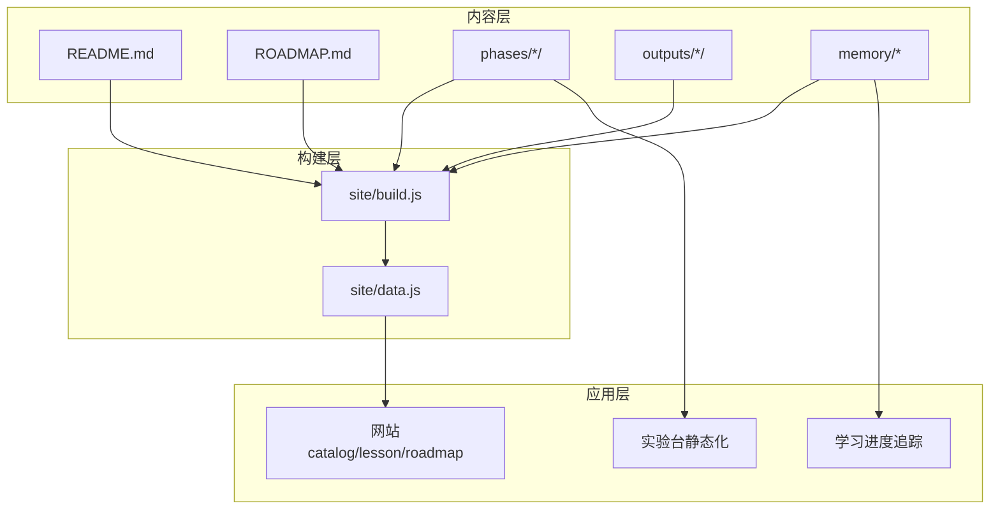
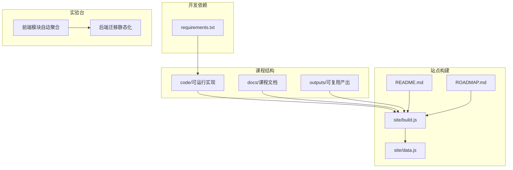

# 版本历史

<cite>
**本文引用的文件**
- [README.md](file://README.md)
- [ROADMAP.md](file://ROADMAP.md)
- [CHANGELOG.md](file://CHANGELOG.md)
- [CONTRIBUTING.md](file://CONTRIBUTING.md)
- [SPONSORS.md](file://SPONSORS.md)
- [site/data.js](file://site/data.js)
- [requirements.txt](file://requirements.txt)
- [memory/study_progress.md](file://memory/study_progress.md)
- [memory/MEMORY.md](file://memory/MEMORY.md)
</cite>

## 目录
1. [简介](#简介)
2. [项目结构](#项目结构)
3. [核心组件](#核心组件)
4. [架构总览](#架构总览)
5. [详细组件分析](#详细组件分析)
6. [依赖关系分析](#依赖关系分析)
7. [性能考量](#性能考量)
8. [故障排查指南](#故障排查指南)
9. [结论](#结论)
10. [附录](#附录)

## 简介
本版本历史与变更记录文档面向“AI工程从零开始”学习项目，系统梳理项目自启动以来的重大更新、功能新增、缺陷修复与性能改进，按时间顺序组织版本信息，并结合学习进度跟踪与记忆卡片，帮助学习者把握项目发展脉络与个人学习路径。文档同时收录里程碑事件、社区贡献与合作伙伴信息，确保版本信息的准确性与完整性。

## 项目结构
该项目采用“阶段-课程”的层级化组织方式，每个阶段包含若干课程，课程下包含可运行代码、文档与可复用产出（提示词、技能、代理、MCP服务器等）。网站数据由构建脚本解析主仓库中的说明与路线图生成，确保线上内容与本地仓库同步。

```mermaid
graph TB
A["根目录"] --> B["phases/<NN>-phase/"]
A --> C["site/"]
A --> D["memory/"]
A --> E["outputs/"]
A --> F["guardrails-sandbox/"]
A --> G["scripts/"]
A --> H["assets/"]
A --> I["glossary/"]
A --> J[".github/"]
B --> B1["phases/00-setup-and-tooling/"]
B --> B2["phases/01-math-foundations/"]
B --> B3["phases/02-ml-fundamentals/"]
B --> B4["phases/03-deep-learning-core/"]
B --> B5["phases/04-computer-vision/"]
B --> B6["phases/05-nlp-foundations-to-advanced/"]
B --> B7["phases/06-speech-and-audio/"]
B --> B8["phases/07-transformers-deep-dive/"]
B --> B9["phases/08-generative-ai/"]
B --> B10["phases/09-reinforcement-learning/"]
B --> B11["phases/10-llms-from-scratch/"]
B --> B12["phases/11-llm-engineering/"]
B --> B13["phases/12-multimodal-ai/"]
B --> B14["phases/14-agent-engineering/"]
B --> B15["phases/15-autonomous-systems/"]
B --> B16["phases/16-multi-agent-and-swarms/"]
B --> B17["phases/17-infrastructure-and-production/"]
B --> B18["phases/18-ethics-safety-alignment/"]
B --> B19["phases/19-capstone-projects/"]
C --> C1["data.js站点数据"]
C --> C2["build.js构建脚本"]
D --> D1["study_progress.md学习进度"]
D --> D2["MEMORY.md记忆卡片"]
E --> E1["prompts/"]
E --> E2["skills/"]
E --> E3["agents/"]
E --> E4["mcp-servers/"]
F --> F1["backend/"]
F --> F2["frontend/"]
G --> G1["scaffold-lesson.sh课程脚手架"]
G --> G2["deploy-learning-notes.sh部署脚本"]
```

图表来源
- [README.md](file://README.md)
- [ROADMAP.md](file://ROADMAP.md)
- [site/data.js](file://site/data.js)
- [memory/study_progress.md](file://memory/study_progress.md)
- [memory/MEMORY.md](file://memory/MEMORY.md)

章节来源
- [README.md](file://README.md)
- [ROADMAP.md](file://ROADMAP.md)
- [site/data.js](file://site/data.js)

## 核心组件
- 阶段与课程体系：20个阶段、503门课程，覆盖数学基础、机器学习、深度学习、计算机视觉、自然语言处理、语音音频、强化学习、大模型从零实现、大模型工程、多模态、智能体工程、自主系统、多智能体与集群、基础设施与生产、伦理安全与对齐、毕业项目等。
- 可复用产出：每门课程结束时输出可直接使用的提示词、技能、代理或MCP服务器，形成“可交付物”闭环。
- 网站与数据：通过构建脚本解析README与路线图生成站点数据，确保线上目录、课程状态与进度一致。
- 学习进度与记忆卡片：提供跨终端、跨会话的统一进度真相源，配合实验台迁移与静态化升级，保障学习连续性。

章节来源
- [README.md](file://README.md)
- [ROADMAP.md](file://ROADMAP.md)
- [site/data.js](file://site/data.js)
- [memory/study_progress.md](file://memory/study_progress.md)
- [memory/MEMORY.md](file://memory/MEMORY.md)

## 架构总览
项目采用“内容即数据”的架构：课程内容与状态写在仓库中，构建脚本将其转换为站点数据；学习进度与记忆卡片作为个人知识资产独立管理；实验台与前端逐步静态化，降低后端依赖，提升可移植性。

图表来源
- [README.md](file://README.md)
- [ROADMAP.md](file://ROADMAP.md)
- [site/build.js](file://site/build.js)
- [site/data.js](file://site/data.js)
- [memory/study_progress.md](file://memory/study_progress.md)

章节来源
- [README.md](file://README.md)
- [site/build.js](file://site/build.js)
- [site/data.js](file://site/data.js)

## 详细组件分析

### 版本与变更记录（按时间顺序）
- 未发布（Unreleased）
  - 新增课程脚手架脚本，一键生成标准课程目录与模板骨架。
  - 完善贡献流程模板与问题反馈模板，规范社区协作。
  - 新增本变更日志文件，统一记录增量变化。
  章节来源
  - [CHANGELOG.md](file://CHANGELOG.md)

- 2026年4月 — 计算机视觉阶段（Phase 4）完成
  - 新增28门课程，覆盖图像基础至多模态视觉（VLMs、3D、视频、自监督）。
  - 在路线图中新增阶段条目，链接至课程目录，网站可直接展示。
  - 对15+课程进行精度修正，涵盖形状计算器、骨干网络选择、分类诊断阈值、检测指标、扩散采样器、ViT审查规则、开放词汇堆叠优先级、CMER归一化、合成帧边界裁剪、3D旋转验证等细节。
  章节来源
  - [CHANGELOG.md](file://CHANGELOG.md)

- 2026年第一季度及更早
  - 新增阶段：0（工具与环境）、1（数学基础）、2（机器学习基础）、3（深度学习核心）的部分课程。
  - 内置Claude代码技能：定位水平与阶段自测问答。
  - 上线网站（aiengineeringfromscratch.com），包含目录、课程页、路线图、术语表。
  - 初始搭建20个阶段目录（phases/00-* 至 phases/19-*）。
  - 提供LESSON_TEMPLATE.md、CONTRIBUTING.md、ROADMAP.md、README.md等模板与规范。
  章节来源
  - [CHANGELOG.md](file://CHANGELOG.md)

### 学习进度跟踪与记忆卡片
- 学习进度文件提供跨终端、跨会话的唯一真相源，明确当前所学阶段、课程与实验台迁移情况。
- 实验台迁移（2026/07/01）：课程实验与检查点查看器全部静态化搬入学习笔记实验台，使用离线向量快照与JsonPlusSerializer预解码快照，实现零后端纯前端体验。
- 记忆卡片：强调HTML总结自动附带面试话术，便于复习与面试准备。
- 课程清单与实验模块：按阶段列出课程状态与对应实验模块，缺失模块需用户确认。
  
章节来源
- [memory/study_progress.md](file://memory/study_progress.md)
- [memory/MEMORY.md](file://memory/MEMORY.md)

### 社区贡献与合作伙伴
- 贡献指南强调：每次PR仅提交一门课程或一处修复，保持评审效率与贡献统计准确；严格遵循README与路线图的结构与状态符号，确保站点解析稳定。
- 赞助计划：提供分级赞助方案，支持维护与站点运营；明确硬性规则（如禁止在课程正文放置广告位、赞助商不参与内容创作、现金支付等），确保内容独立性与质量。
- 合作伙伴：网站展示赞助商徽标与致谢，按级别与协议上线；平台渠道（如X/LinkedIn）用于联合推广。

章节来源
- [CONTRIBUTING.md](file://CONTRIBUTING.md)
- [SPONSORS.md](file://SPONSORS.md)

### 里程碑事件
- 2026-04：计算机视觉阶段完成，课程数量与网站展示完善。
- 2026-07：实验台静态化迁移，学习笔记实验台模块数从1补齐到22个，嵌入离线向量与检查点快照。
- 2026-06：站点数据生成时间戳稳定，构建流程可靠。

章节来源
- [CHANGELOG.md](file://CHANGELOG.md)
- [memory/study_progress.md](file://memory/study_progress.md)
- [site/data.js](file://site/data.js)

## 依赖关系分析
- 课程依赖：每门课程包含code/、docs/、outputs/三个子目录，确保“从零实现—框架对比—可复用产出”的完整闭环。
- 网站依赖：构建脚本依赖README与ROADMAP的结构稳定性；站点数据依赖这些文件的格式一致性。
- 开发依赖：requirements.txt定义了训练与推理常用库（NumPy、Matplotlib、Jupyter、PyTorch生态、Transformers、Datasets、Tokenizers、加速库、Scikit-learn、Pandas、Pillow、Librosa、Soundfile、Tiktoken、Anthropic、OpenAI等）。
- 实验台依赖：前端实验台模块通过自动聚合导入，后端迁移为纯前端静态化，减少运行时依赖。

图表来源
- [README.md](file://README.md)
- [ROADMAP.md](file://ROADMAP.md)
- [site/build.js](file://site/build.js)
- [site/data.js](file://site/data.js)
- [requirements.txt](file://requirements.txt)

章节来源
- [README.md](file://README.md)
- [ROADMAP.md](file://ROADMAP.md)
- [requirements.txt](file://requirements.txt)
- [site/build.js](file://site/build.js)
- [site/data.js](file://site/data.js)

## 性能考量
- 实验台静态化：将课程实验与检查点查看器静态化，显著降低后端压力，提升加载速度与可移植性。
- 前端模块聚合：通过自动导入机制聚合多个实验模块，减少手动配置成本，提高开发效率。
- 依赖精简：在requirements.txt中明确列出核心依赖，避免不必要的包引入，优化安装与运行时性能。
- 站点构建：构建脚本稳定解析README与路线图，确保站点数据一致性与可预测性。

章节来源
- [memory/study_progress.md](file://memory/study_progress.md)
- [requirements.txt](file://requirements.txt)
- [site/build.js](file://site/build.js)

## 故障排查指南
- 站点数据异常：若site/data.js发生非时间戳以外的变更，请检查README与ROADMAP的结构是否符合解析要求（阶段标题格式、课程表格列结构、状态符号）。
- 课程脚手架问题：使用scaffold-lesson.sh生成课程目录时，确保LESSON_TEMPLATE.md存在且内容结构完整。
- 学习进度不同步：以memory/study_progress.md为准，浏览器localStorage与playground模块可能不可靠，建议在新终端打开前先读取该文件。
- 实验台迁移问题：静态化后若出现模块缺失或资源加载失败，检查前端模块导入路径与自动聚合逻辑。

章节来源
- [CONTRIBUTING.md](file://CONTRIBUTING.md)
- [memory/study_progress.md](file://memory/study_progress.md)
- [scripts/scaffold-lesson.sh](file://scripts/scaffold-lesson.sh)

## 结论
本版本历史与变更记录系统梳理了“AI工程从零开始”项目自启动以来的关键进展：从阶段与课程体系的逐步完善，到网站与学习工具链的落地，再到实验台静态化与记忆卡片的强化，形成了“内容—构建—应用—学习”的完整闭环。通过严格的贡献规范与赞助规则，项目在保持高质量的同时，持续扩展社区协作与可持续运营能力。学习者可据此快速定位学习路径、理解项目演进，并基于进度与记忆卡片高效推进学习。

## 附录
- 术语与术语表：glossary目录提供术语与反常识条目的中英对照，辅助理解专业概念。
- 输出索引：outputs目录集中管理课程产出（提示词、技能、代理、MCP服务器），便于检索与复用。
- 脚本工具：scripts目录包含课程脚手架、部署与锁屏部署脚本，简化开发与运维流程。

章节来源
- [README.md](file://README.md)
- [glossary/README.md](file://glossary/README.md)
- [outputs/index.json](file://outputs/index.json)
- [scripts/scaffold-lesson.sh](file://scripts/scaffold-lesson.sh)
- [scripts/deploy-learning-notes.sh](file://scripts/deploy-learning-notes.sh)
- [scripts/lock-and-deploy.sh](file://scripts/lock-and-deploy.sh)