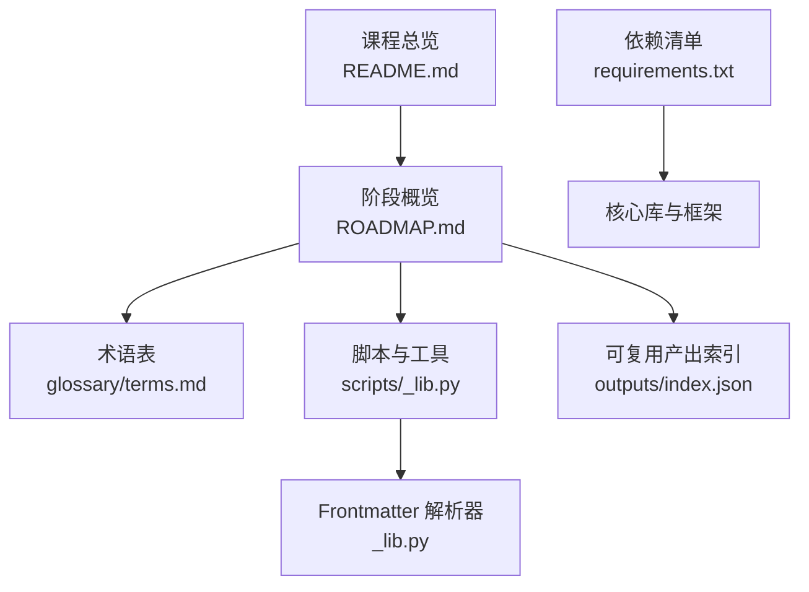
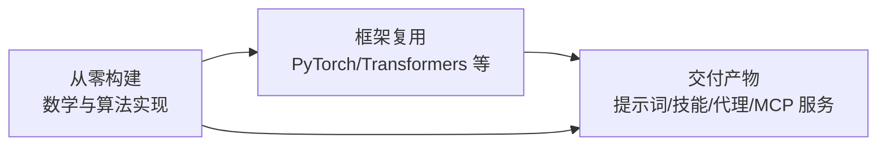
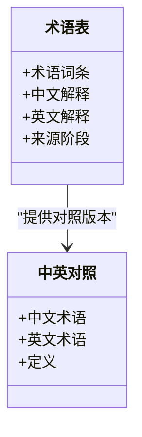
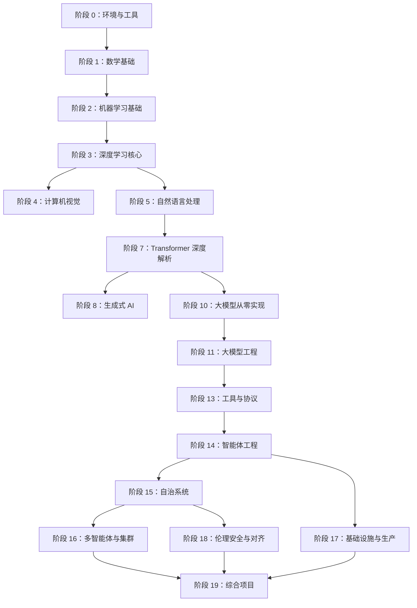
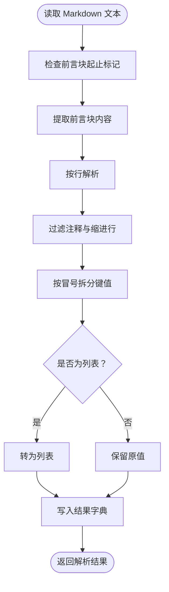
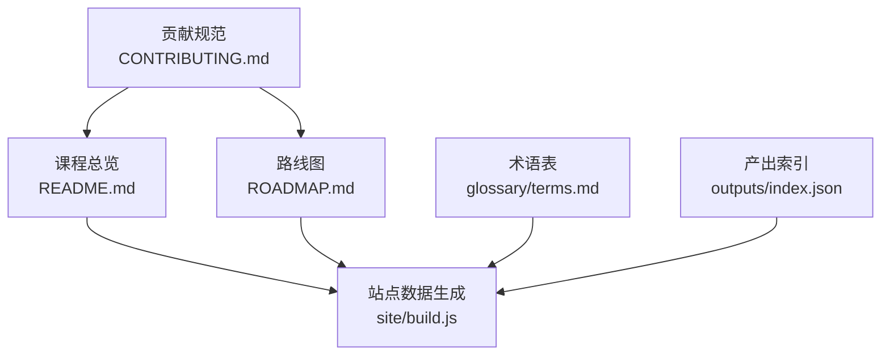

# 附录

<cite>
**本文档引用的文件**
- [README.md](file://README.md)
- [ROADMAP.md](file://ROADMAP.md)
- [terms.md](file://glossary/terms.md)
- [terms.zh.md](file://glossary/terms.zh.md)
- [_lib.py](file://scripts/_lib.py)
- [requirements.txt](file://requirements.txt)
- [CONTRIBUTING.md](file://CONTRIBUTING.md)
- [MEMORY.md](file://memory/MEMORY.md)
</cite>

## 目录
1. [简介](#简介)
2. [项目结构](#项目结构)
3. [核心组件](#核心组件)
4. [架构总览](#架构总览)
5. [详细组件分析](#详细组件分析)
6. [依赖关系分析](#依赖关系分析)
7. [性能考虑](#性能考虑)
8. [故障排查指南](#故障排查指南)
9. [结论](#结论)
10. [附录](#附录)

## 简介
本附录面向“AI 工程从零开始”课程体系，提供术语表与定义、数学公式与定理说明、参考资料与推荐阅读、版本历史与变更日志、索引与交叉引用、图表与可视化资源，以及面向工程实践的性能与故障排查建议。内容以仓库中的课程结构、术语表、路线图与脚本为依据，确保准确性与时效性。

## 项目结构
- 课程采用“阶段-课时”的层级组织，共 20 个阶段、503 门课，覆盖数学基础、机器学习、深度学习、计算机视觉、自然语言处理、语音音频、强化学习、大模型原理与工程、多模态、工具与协议、智能体工程、自治系统、多智能体与集群、基础设施与生产、伦理安全与对齐、以及 50+ 个综合项目。
- 每门课包含代码实现、英文讲义文档与可复用产出（提示词、技能、代理、MCP 服务等）。
- 术语表提供统一的 AI 工程词汇定义，支持中英对照。

**图表来源**
- [README.md](file://README.md)
- [ROADMAP.md](file://ROADMAP.md)
- [terms.md](file://glossary/terms.md)
- [_lib.py](file://scripts/_lib.py)
- [requirements.txt](file://requirements.txt)

**章节来源**
- [README.md](file://README.md)
- [ROADMAP.md](file://ROADMAP.md)

## 核心组件
- 术语表与定义：提供 AI 工程领域的专业词汇与缩写词的权威解释，便于跨阶段、跨课时的知识衔接。
- 路线图与进度：明确各阶段与课时的完成状态、估算耗时，支撑个人学习路径规划。
- 脚本与工具：包含 Frontmatter 解析器等辅助工具，保障网站与索引生成的稳定性。
- 依赖清单：列出课程与实验所需的 Python 包与版本范围，便于环境搭建与一致性管理。

**章节来源**
- [terms.md](file://glossary/terms.md)
- [terms.zh.md](file://glossary/terms.zh.md)
- [ROADMAP.md](file://ROADMAP.md)
- [_lib.py](file://scripts/_lib.py)
- [requirements.txt](file://requirements.txt)

## 架构总览
课程体系的“构建-使用-交付”闭环贯穿所有课时：先从零实现核心算法，再用主流框架复现，最后沉淀为可复用的提示词、技能、代理或 MCP 服务。

**图表来源**
- [README.md](file://README.md)

**章节来源**
- [README.md](file://README.md)

## 详细组件分析

### 术语表与定义
- 术语表覆盖从基础数学（向量、矩阵、特征值、范数、概率、信息论）到前沿技术（注意力、Transformer、RAG、Agent、Guardrails、MCP、MoE、Speculative Decoding、量化、KV Cache 等）的完整词汇体系。
- 中英对照版本便于国际化学习与交流。

**图表来源**
- [terms.md](file://glossary/terms.md)
- [terms.zh.md](file://glossary/terms.zh.md)

**章节来源**
- [terms.md](file://glossary/terms.md)
- [terms.zh.md](file://glossary/terms.zh.md)

### 路线图与进度
- 路线图以“完成/进行中/计划”三态标识各阶段与课时，总计约 314 小时（按个人节奏），并标注每课时的估算耗时，便于制定学习计划与时间管理。

**图表来源**
- [ROADMAP.md](file://ROADMAP.md)

**章节来源**
- [ROADMAP.md](file://ROADMAP.md)

### 脚本与工具
- Frontmatter 解析器：解析 Markdown 文档顶部的 YAML 前言块，支持裸字符串、单引号、双引号、列表与行内注释，用于产出元数据提取与索引生成。
- 该工具保证网站与索引生成流程的稳定性，避免因格式变化导致解析失败。

**图表来源**
- [_lib.py](file://scripts/_lib.py)

**章节来源**
- [_lib.py](file://scripts/_lib.py)

### 依赖清单与环境
- 依赖清单列出课程与实验所需的核心库（NumPy、Matplotlib、Jupyter、PyTorch 生态、Transformers、Datasets、Tokenizers、Scikit-learn、Pandas、Pillow、Librosa、Soundfile、Tiktoken、Anthropic、OpenAI 等），并给出最低版本要求，便于一致化环境搭建与问题定位。

**章节来源**
- [requirements.txt](file://requirements.txt)

## 依赖关系分析
- 课程内容与网站生成存在耦合：README 与 ROADMAP 的结构与状态符号直接影响站点数据生成；CONTRIBUTING 明确了维护这些文件时的格式约束。
- 产出索引与前端展示：顶层 outputs 目录与 site 构建脚本共同驱动网站内容呈现。

**图表来源**
- [CONTRIBUTING.md](file://CONTRIBUTING.md)
- [README.md](file://README.md)
- [ROADMAP.md](file://ROADMAP.md)
- [terms.md](file://glossary/terms.md)

**章节来源**
- [CONTRIBUTING.md](file://CONTRIBUTING.md)
- [README.md](file://README.md)
- [ROADMAP.md](file://ROADMAP.md)

## 性能考虑
- 训练与推理性能：量化（INT8/GPTQ/AWQ/GGUF）、混合精度（FP16/TF32）、分布式并行（FSDP/DDP/Pipeline Parallel）、KV Cache、Speculative Decoding、Flash Attention、RadixAttention、TensorRT-LLM 等技术在基础设施与生产阶段均有系统讲解，可据此优化端到端吞吐与延迟。
- 推理指标：TTFT、TPOT、ITL、Goodput、P99 等指标用于评估推理质量与稳定性。
- 成本优化：批量 API、模型路由、冷启动缓解、多区域部署与 KV 局部性、边缘推理等策略降低单位成本。

[本节为通用指导，不直接分析具体文件]

## 故障排查指南
- 常见数值问题：NaN 损失通常由学习率过高、梯度爆炸、log(0) 或除零引起，需优先检查学习率与数值稳定性。
- 训练崩溃：优先确认依赖版本与硬件驱动（CUDA/TensorRT）匹配；核对批大小与显存占用；检查数据加载与预处理逻辑。
- 网站与索引：若站点数据异常，检查 README/ROADMAP/术语表的表格与状态符号格式是否符合解析器预期；运行站点构建脚本后比对 site/data.js 的差异。

**章节来源**
- [terms.md](file://glossary/terms.md)
- [CONTRIBUTING.md](file://CONTRIBUTING.md)

## 结论
本附录整合了术语、路线图、工具与依赖，为学习者提供从概念到工程落地的完整参考。建议结合路线图制定阶段性目标，利用术语表统一认知，借助脚本与依赖清单保障环境一致性，并在实践中持续优化性能与可靠性。

[本节为总结性内容，不直接分析具体文件]

## 附录

### 术语表与定义（节选）
- Agent：LLM + 工具 + 循环的 while 循环实现，强调“决策-执行-观察-再决策”的迭代。
- Attention：通过 query 与 key 的点积计算注意力权重，对 value 做加权求和，实现 token 间的全局交互。
- RAG：检索（Retrieval）+ 增强（Augmented）+ 生成（Generation）的问答范式。
- Guardrails：围绕 LLM 的输入/输出验证层，用于阻断有害内容与提示注入。
- MCP（Model Context Protocol）：标准化的 AI 应用与外部数据源/工具连接协议，支持类型化工具、资源与提示。
- KV Cache：缓存先前 token 的 key/value，避免重复计算，显著提升推理速度。
- Speculative Decoding：通过草稿模型预测多步 token，经验证器校验后一次性提交，提升吞吐。
- 量化：将权重精度从 float32 降至 int8/int4，换取内存与吞吐收益。
- Transformer：以自注意力替代循环，实现并行化序列建模。

**章节来源**
- [terms.md](file://glossary/terms.md)
- [terms.zh.md](file://glossary/terms.zh.md)

### 数学公式与定理（节选）
- 矩阵与向量
  - 矩阵乘法：C[i, j] = Σ_k A[i, k] · B[k, j]
  - 特征值与特征向量：Av = λv
  - 范数：L2 范数 ||x||₂ = √Σ_i x_i²；余弦相似度 cosθ = (a·b)/(||a||·||b||)
- 概率与信息论
  - 交叉熵：H(p, q) = -Σ_x p(x) log q(x)
  - KL 散度：KL(p||q) = Σ_x p(x) log(p(x)/q(x))
  - 贝叶斯定理：P(A|B) = P(B|A)P(A)/P(B)
- 微积分与优化
  - 梯度下降：θ ← θ - α ∇θ f(θ)
  - 链式法则：∂z/∂x = (∂z/∂y)(∂y/∂x)
- 线性系统与降维
  - 线性系统 Ax = b 的求解与条件数
  - PCA：最大化投影方差，寻找主成分方向

[本节为概念性汇总，不直接分析具体文件]

### 参考资料与推荐阅读
- 课程内资源：各阶段讲义与课时文档，强调“从零构建—框架复用—交付产物”的闭环。
- 实践工具：PyTorch、Transformers、JAX、Jupyter、NumPy、Matplotlib、Scikit-learn、Pandas、Pillow、Librosa、Soundfile、Tiktoken、Anthropic、OpenAI 等。
- 项目与案例：终端原生编程代理、跨仓库语义搜索、实时语音助手、多模态文档问答、多智能体软件团队、LLM 观测与评估仪表盘、MCP 服务与治理、推测解码推理服务、宪法安全闸与红队、GitHub Issue 到 PR 自动化代理、个人 AI 导师等。

**章节来源**
- [README.md](file://README.md)
- [ROADMAP.md](file://ROADMAP.md)
- [requirements.txt](file://requirements.txt)

### 版本历史与变更日志
- 课程总览与路线图持续更新，状态符号（✅/🚧/⬚）与表格结构由站点构建脚本解析，确保网站与仓库同步。
- 贡献规范明确了维护 README/ROADMAP/术语表时的格式约束，避免破坏解析流程。

**章节来源**
- [ROADMAP.md](file://ROADMAP.md)
- [CONTRIBUTING.md](file://CONTRIBUTING.md)

### 索引与交叉引用
- 术语索引：按字母顺序组织，支持中英对照，便于快速检索。
- 阶段索引：按阶段编号与名称组织，配合路线图状态与耗时标注。
- 产出索引：顶层 outputs 目录与 site 构建脚本联动，生成可导航的产物索引。

**章节来源**
- [terms.md](file://glossary/terms.md)
- [ROADMAP.md](file://ROADMAP.md)
- [MEMORY.md](file://memory/MEMORY.md)

### 图表与可视化资源
- 课程阶段关系图：展示从数学基础到自治系统与生产的知识脉络。
- “构建-使用-交付”流程图：体现每课时的三段式结构。
- Frontmatter 解析流程图：说明解析器对 YAML 前言块的处理步骤。

**章节来源**
- [README.md](file://README.md)
- [ROADMAP.md](file://ROADMAP.md)
- [_lib.py](file://scripts/_lib.py)