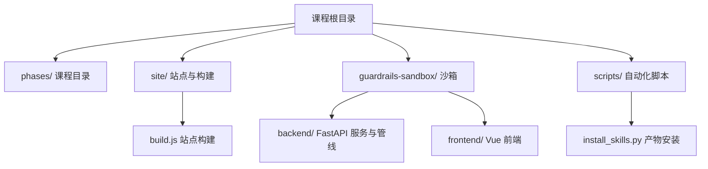
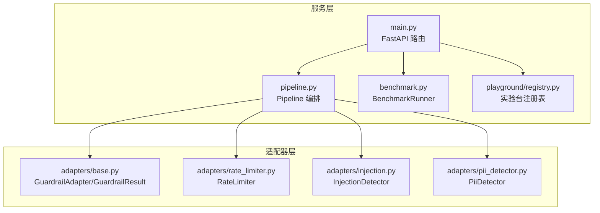
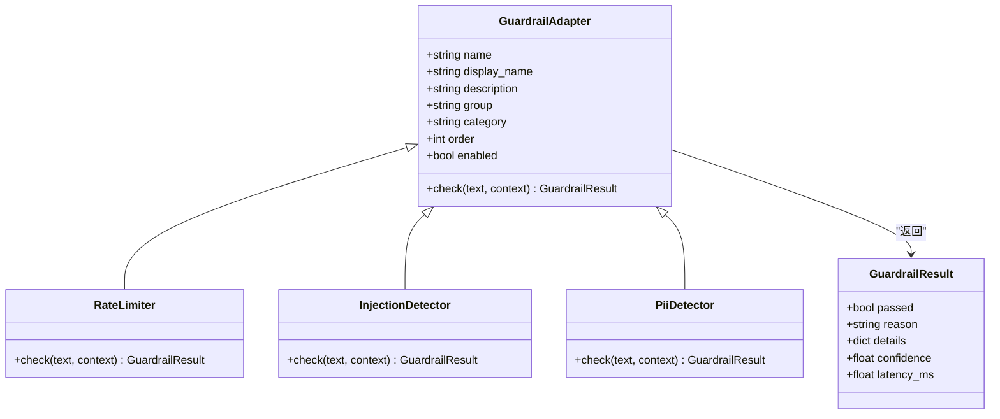
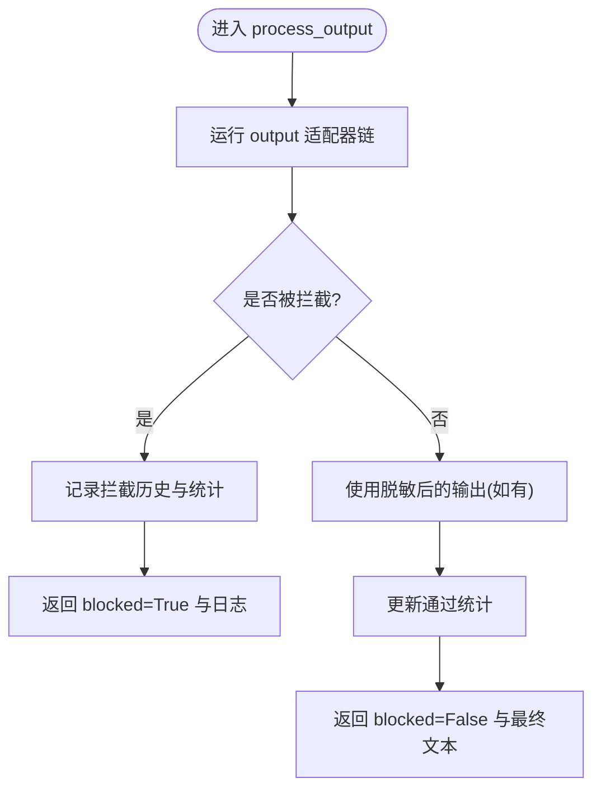
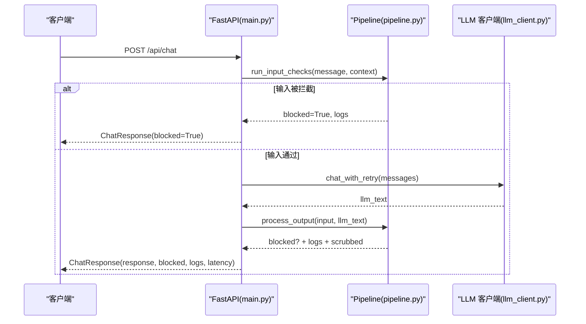
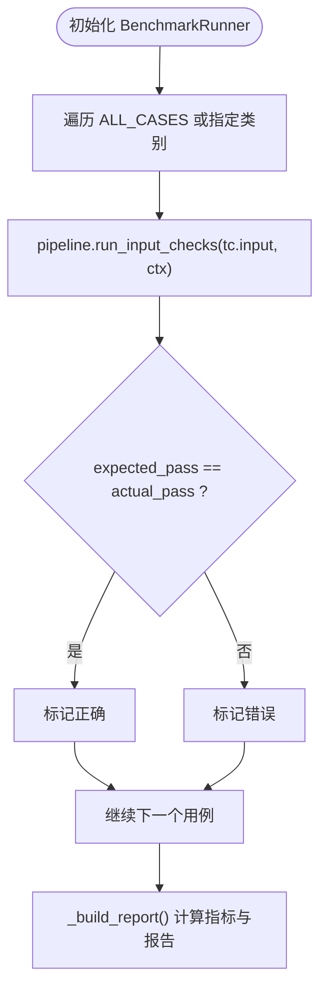
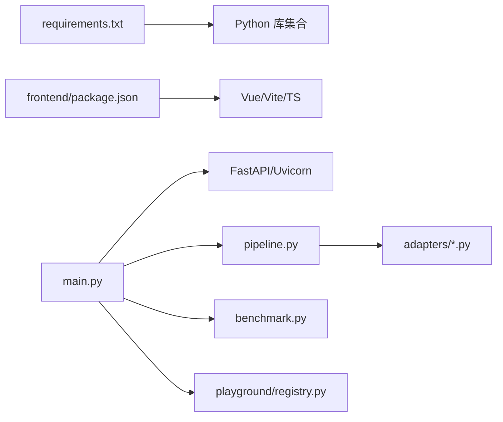

# 仓库Wiki系统

<cite>
**本文引用的文件**   
- [README.md](file://README.md)
- [AGENTS.md](file://AGENTS.md)
- [ROADMAP.md](file://ROADMAP.md)
- [requirements.txt](file://requirements.txt)
- [guardrails-sandbox/backend/main.py](file://guardrails-sandbox/backend/main.py)
- [guardrails-sandbox/backend/pipeline.py](file://guardrails-sandbox/backend/pipeline.py)
- [guardrails-sandbox/backend/adapters/base.py](file://guardrails-sandbox/backend/adapters/base.py)
- [guardrails-sandbox/backend/adapters/rate_limiter.py](file://guardrails-sandbox/backend/adapters/rate_limiter.py)
- [guardrails-sandbox/backend/adapters/injection.py](file://guardrails-sandbox/backend/adapters/injection.py)
- [guardrails-sandbox/backend/adapters/pii_detector.py](file://guardrails-sandbox/backend/adapters/pii_detector.py)
- [guardrails-sandbox/backend/benchmark.py](file://guardrails-sandbox/backend/benchmark.py)
- [guardrails-sandbox/frontend/package.json](file://guardrails-sandbox/frontend/package.json)
- [scripts/install_skills.py](file://scripts/install_skills.py)
</cite>

## 目录
1. [简介](#简介)
2. [项目结构](#项目结构)
3. [核心组件](#核心组件)
4. [架构总览](#架构总览)
5. [详细组件分析](#详细组件分析)
6. [依赖关系分析](#依赖关系分析)
7. [性能与可扩展性](#性能与可扩展性)
8. [故障排查指南](#故障排查指南)
9. [结论](#结论)
10. [附录](#附录)

## 简介
本仓库是一个“从原理到工程”的AI课程与工具集，包含20个阶段、数百课时的系统化内容，覆盖数学基础、机器学习、深度学习、计算机视觉、NLP、语音、Transformer、生成式AI、强化学习、大模型、多模态、工具协议、智能体工程、基础设施与生产实践、伦理与安全等。同时提供Guardrails交互式沙箱（后端FastAPI + 前端Vue）用于演示安全护栏管线、基准测试与实验台模块；并提供脚本将课程产出物（技能/提示词/智能体）安装到目标环境。

## 项目结构
- 课程组织：phases/<NN>-phase/<NN>-lesson 下统一包含 docs/en.md、code/、outputs/、quiz.json 等，遵循一致的契约。
- 站点与构建：site/ 由 build.js 解析 README 与 ROADMAP 生成 data.js，CI 自动同步。
- Guardrails 沙箱：guardrails-sandbox/backend 提供 FastAPI 服务、适配器管线、基准测试与实验台；frontend 为 Vue 应用。
- 自动化脚本：scripts/ 提供审计、计数、安装产物等能力。

**章节来源**
- [README.md:87-111](file://README.md#L87-L111)
- [AGENTS.md:15-34](file://AGENTS.md#L15-L34)
- [AGENTS.md:128-136](file://AGENTS.md#L128-L136)

## 核心组件
- 课程契约与规范：文档前导元数据、代码自终止、单元测试、问答题格式、提交与冲突解决规则。
- 站点构建与同步：README/ROADMAP 驱动站点数据生成，CI 自动修复与重建。
- Guardrails 沙箱：
  - 适配器基类与结果对象：统一的 check 接口与返回结构。
  - 管线编排：输入/输出检查、短路拦截、统计与历史。
  - API 路由：聊天、对比模式、开关、基准测试、MCP 代理、实验台。
  - 基准测试：用例执行、指标计算（TPR/FPR/准确率/F1）。
  - 实验台注册表：按 phase 分组、统一运行入口。
- 产物安装器：扫描 outputs 下的 skill/prompt/agent 文件，支持过滤与布局输出。

**章节来源**
- [AGENTS.md:63-113](file://AGENTS.md#L63-L113)
- [AGENTS.md:115-136](file://AGENTS.md#L115-L136)
- [guardrails-sandbox/backend/main.py:1-86](file://guardrails-sandbox/backend/main.py#L1-L86)
- [guardrails-sandbox/backend/pipeline.py:12-56](file://guardrails-sandbox/backend/pipeline.py#L12-L56)
- [guardrails-sandbox/backend/benchmark.py:10-27](file://guardrails-sandbox/backend/benchmark.py#L10-L27)
- [guardrails-sandbox/backend/playground/registry.py:48-84](file://guardrails-sandbox/backend/playground/registry.py#L48-L84)
- [scripts/install_skills.py:229-287](file://scripts/install_skills.py#L229-L287)

## 架构总览
Guardrails 沙箱采用“适配器 + 管线 + 服务”的分层设计：
- 适配器层：实现具体安全检查逻辑（速率限制、注入检测、PII 检测等），通过统一基类接入。
- 管线层：按类别与顺序调度适配器，支持短路拦截、统计与历史记录。
- 服务层：暴露 REST API，串联输入检查、LLM 调用、输出检查，并集成基准测试与实验台。

**图表来源**
- [guardrails-sandbox/backend/main.py:78-128](file://guardrails-sandbox/backend/main.py#L78-L128)
- [guardrails-sandbox/backend/pipeline.py:12-56](file://guardrails-sandbox/backend/pipeline.py#L12-L56)
- [guardrails-sandbox/backend/adapters/base.py:14-30](file://guardrails-sandbox/backend/adapters/base.py#L14-L30)
- [guardrails-sandbox/backend/adapters/rate_limiter.py:7-14](file://guardrails-sandbox/backend/adapters/rate_limiter.py#L7-L14)
- [guardrails-sandbox/backend/adapters/injection.py:44-51](file://guardrails-sandbox/backend/adapters/injection.py#L44-L51)
- [guardrails-sandbox/backend/adapters/pii_detector.py:19-26](file://guardrails-sandbox/backend/adapters/pii_detector.py#L19-L26)

## 详细组件分析

### 适配器基类与结果对象
- GuardrailAdapter：定义 name、display_name、description、group、category、order、enabled 等元信息，以及 check(text, context) 抽象方法。
- GuardrailResult：结构化返回 passed、reason、details、confidence、latency_ms。

**图表来源**
- [guardrails-sandbox/backend/adapters/base.py:14-30](file://guardrails-sandbox/backend/adapters/base.py#L14-L30)
- [guardrails-sandbox/backend/adapters/rate_limiter.py:7-14](file://guardrails-sandbox/backend/adapters/rate_limiter.py#L7-L14)
- [guardrails-sandbox/backend/adapters/injection.py:44-51](file://guardrails-sandbox/backend/adapters/injection.py#L44-L51)
- [guardrails-sandbox/backend/adapters/pii_detector.py:19-26](file://guardrails-sandbox/backend/adapters/pii_detector.py#L19-L26)

**章节来源**
- [guardrails-sandbox/backend/adapters/base.py:1-34](file://guardrails-sandbox/backend/adapters/base.py#L1-L34)

### 管线编排（Pipeline）
- 注册与排序：register(adapter) 后按 (order, name) 排序。
- 输入检查：run_input_checks 遍历 input 适配器，遇到未通过则短路返回。
- 输出检查：process_output 对 LLM 输出进行校验，支持脱敏文本回传。
- 统计与历史：by_layer 统计、block_history 保留最近若干条。

**图表来源**
- [guardrails-sandbox/backend/pipeline.py:129-160](file://guardrails-sandbox/backend/pipeline.py#L129-L160)
- [guardrails-sandbox/backend/pipeline.py:264-285](file://guardrails-sandbox/backend/pipeline.py#L264-L285)

**章节来源**
- [guardrails-sandbox/backend/pipeline.py:12-56](file://guardrails-sandbox/backend/pipeline.py#L12-L56)
- [guardrails-sandbox/backend/pipeline.py:129-160](file://guardrails-sandbox/backend/pipeline.py#L129-L160)
- [guardrails-sandbox/backend/pipeline.py:188-235](file://guardrails-sandbox/backend/pipeline.py#L188-L235)

### 服务层（FastAPI）
- 预加载模型：启动前加载本地语义模型，避免异步环境下载问题。
- 路由：
  - /api/chat：输入检查 → LLM 调用 → 输出检查 → 返回响应与延迟。
  - /api/chat/compare：无护栏 vs 有护栏对比。
  - /api/guardrails/*：获取适配器树、统计、历史、开关。
  - /api/benchmark：运行基准测试。
  - /api/mcp/*：通过 MCP SDK 调用外部工具。
  - /api/playground/*：实验台模块列表与运行。
  - /api/checkpoints/*：检查点数据库查看。

**图表来源**
- [guardrails-sandbox/backend/main.py:155-220](file://guardrails-sandbox/backend/main.py#L155-L220)
- [guardrails-sandbox/backend/pipeline.py:129-160](file://guardrails-sandbox/backend/pipeline.py#L129-L160)

**章节来源**
- [guardrails-sandbox/backend/main.py:61-86](file://guardrails-sandbox/backend/main.py#L61-L86)
- [guardrails-sandbox/backend/main.py:121-153](file://guardrails-sandbox/backend/main.py#L121-L153)
- [guardrails-sandbox/backend/main.py:223-256](file://guardrails-sandbox/backend/main.py#L223-L256)
- [guardrails-sandbox/backend/main.py:272-280](file://guardrails-sandbox/backend/main.py#L272-L280)
- [guardrails-sandbox/backend/main.py:324-356](file://guardrails-sandbox/backend/main.py#L324-L356)
- [guardrails-sandbox/backend/main.py:368-377](file://guardrails-sandbox/backend/main.py#L368-L377)
- [guardrails-sandbox/backend/main.py:389-403](file://guardrails-sandbox/backend/main.py#L389-L403)

### 基准测试引擎
- 用例执行：对每个用例仅运行输入检查（不调 LLM），对比预期与实际。
- 指标计算：准确率、TPR/FPR、精确率、F1、平均延迟等。
- 分类与分层统计：按类别与拦截层汇总。

**图表来源**
- [guardrails-sandbox/backend/benchmark.py:14-27](file://guardrails-sandbox/backend/benchmark.py#L14-L27)
- [guardrails-sandbox/backend/benchmark.py:82-168](file://guardrails-sandbox/backend/benchmark.py#L82-L168)

**章节来源**
- [guardrails-sandbox/backend/benchmark.py:10-27](file://guardrails-sandbox/backend/benchmark.py#L10-L27)
- [guardrails-sandbox/backend/benchmark.py:82-168](file://guardrails-sandbox/backend/benchmark.py#L82-L168)

### 实验台模块注册表
- 集中注册 PlaygroundModule，提供 list_grouped() 与 run(name, inputs)。
- 按 phase 分组展示，支持 input_schema 描述，便于前端渲染导航与表单。

**章节来源**
- [guardrails-sandbox/backend/playground/registry.py:48-84](file://guardrails-sandbox/backend/playground/registry.py#L48-L84)
- [guardrails-sandbox/backend/playground/registry.py:87-118](file://guardrails-sandbox/backend/playground/registry.py#L87-L118)

### 课程产物安装器
- 扫描 phases/**/outputs 下的 skill/prompt/agent 文件，解析 frontmatter。
- 支持类型、阶段、标签过滤，三种布局（flat/by-phase/skills），输出 manifest.json。

**章节来源**
- [scripts/install_skills.py:229-287](file://scripts/install_skills.py#L229-L287)
- [scripts/install_skills.py:91-136](file://scripts/install_skills.py#L91-L136)
- [scripts/install_skills.py:157-191](file://scripts/install_skills.py#L157-L191)
- [scripts/install_skills.py:200-226](file://scripts/install_skills.py#L200-L226)

## 依赖关系分析
- 运行时依赖：Python 生态库（numpy、torch、transformers、datasets、tokenizers、accelerate、scikit-learn、pandas、pillow、librosa、soundfile、tiktoken、anthropic、openai 等）。
- 前端依赖：Vue 3、Vite、TypeScript。
- 服务依赖：FastAPI、uvicorn、pydantic、CORS、MCP SDK（在沙箱中调用外部 MCP 服务器）。

**图表来源**
- [requirements.txt:1-19](file://requirements.txt#L1-L19)
- [guardrails-sandbox/frontend/package.json:1-21](file://guardrails-sandbox/frontend/package.json#L1-L21)
- [guardrails-sandbox/backend/main.py:78-86](file://guardrails-sandbox/backend/main.py#L78-L86)

**章节来源**
- [requirements.txt:1-19](file://requirements.txt#L1-L19)
- [guardrails-sandbox/frontend/package.json:1-21](file://guardrails-sandbox/frontend/package.json#L1-L21)

## 性能与可扩展性
- 适配器短路：输入/输出检查一旦失败立即返回，降低不必要开销。
- 统计与历史：by_layer 统计与 block_history 有助于定位瓶颈与误拦热点。
- 基准测试：提供 TPR/FPR/准确率/F1 等指标，便于评估不同适配器的效果与代价。
- 扩展建议：
  - 新增适配器：继承 GuardrailAdapter，实现 check，设置 group/category/order/name，并在 main 中 register。
  - 并行化：对独立适配器可考虑并发执行（注意上下文共享与线程安全）。
  - 缓存：对高成本适配器引入语义缓存或键值缓存，减少重复计算。
  - 配置化：将阈值、白名单、黑名单外置为配置，支持热更新。

[本节为通用指导，不直接分析具体文件]

## 故障排查指南
- 模型加载失败：启动时预加载本地模型，若离线不可用需确保缓存存在或网络可达。
- 适配器未生效：确认已 register 且 enabled=True，order 合理，category 匹配 input/output。
- 基准测试异常：检查用例 expected_pass 与实际逻辑一致性，关注 rate_limiter 状态隔离。
- 站点构建不一致：README 链接缺失会导致 site/data.js 无法解析，按 AGENTS.md 冲突解决流程修复。

**章节来源**
- [guardrails-sandbox/backend/main.py:61-76](file://guardrails-sandbox/backend/main.py#L61-L76)
- [guardrails-sandbox/backend/pipeline.py:18-23](file://guardrails-sandbox/backend/pipeline.py#L18-L23)
- [guardrails-sandbox/backend/benchmark.py:29-60](file://guardrails-sandbox/backend/benchmark.py#L29-L60)
- [AGENTS.md:161-183](file://AGENTS.md#L161-L183)

## 结论
该仓库以“从原理到工程”的课程体系为核心，辅以 Guardrails 沙箱与自动化脚本，形成“学-练-用-产”闭环。适配器+管线的解耦设计使安全策略易于扩展与评估；基准测试与实验台为教学与工程实践提供了直观工具。建议在持续演进中完善配置化与缓存机制，提升性能与可维护性。

[本节为总结性内容，不直接分析具体文件]

## 附录
- 课程契约要点：
  - 文档前导元数据、代码自终止、单元测试、问答题格式。
  - 提交规范、依赖白名单、禁止提交生成文件。
- 站点构建与 CI：
  - README/ROADMAP 驱动 data.js 生成，CI 自动修复与重建。
- 沙箱运行方式：
  - 启动 uvicorn 服务，访问 /api/* 端点；前端静态资源挂载于根路径。

**章节来源**
- [AGENTS.md:63-113](file://AGENTS.md#L63-L113)
- [AGENTS.md:115-136](file://AGENTS.md#L115-L136)
- [guardrails-sandbox/backend/main.py:406-421](file://guardrails-sandbox/backend/main.py#L406-L421)