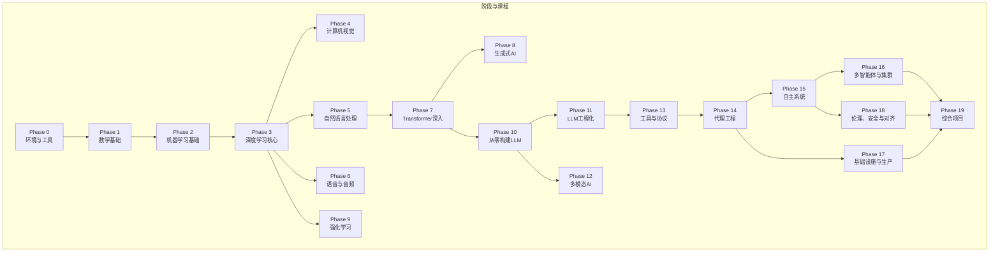
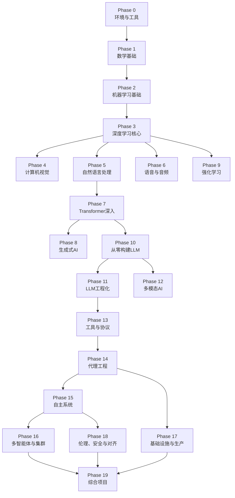
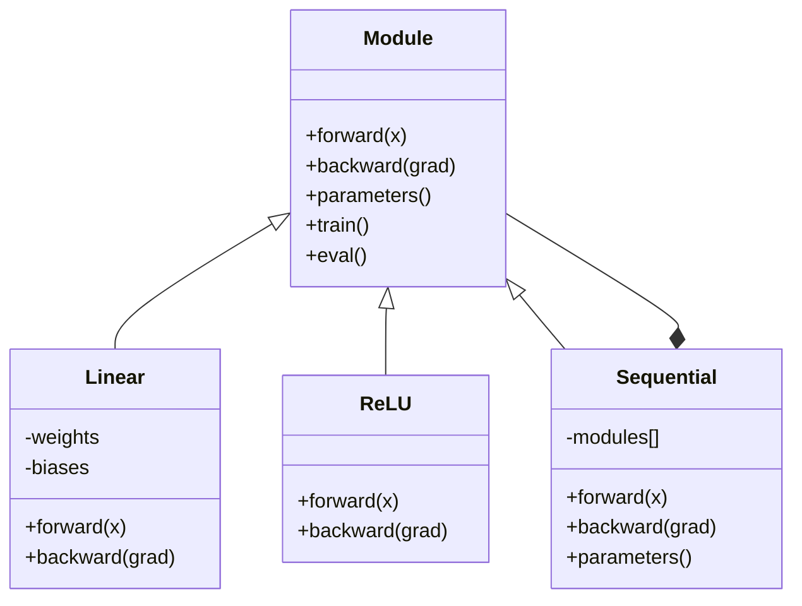
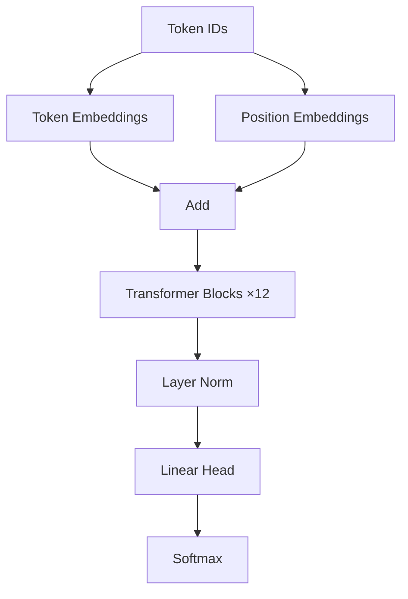
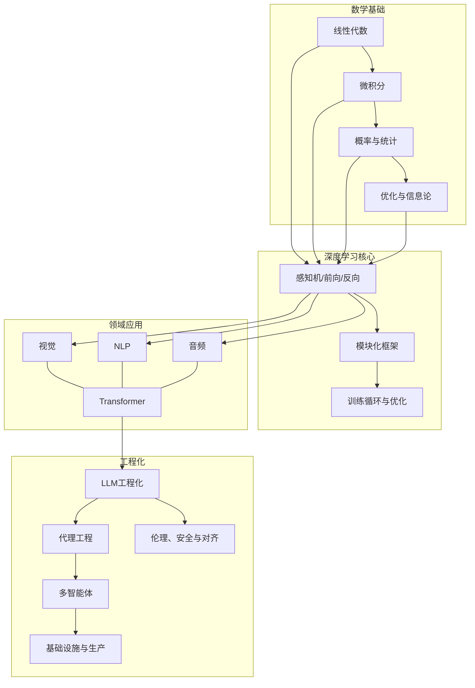

# 学习路径概览

<cite>
**本文引用的文件**
- [README.md](file://README.md)
- [ROADMAP.md](file://ROADMAP.md)
- [phases/00-setup-and-tooling/README.md](file://phases/00-setup-and-tooling/README.md)
- [phases/01-math-foundations/README.md](file://phases/01-math-foundations/README.md)
- [phases/02-ml-fundamentals/README.md](file://phases/02-ml-fundamentals/README.md)
- [phases/19-capstone-projects/README.md](file://phases/19-capstone-projects/README.md)
- [phases/01-math-foundations/01-linear-algebra-intuition/docs/en.md](file://phases/01-math-foundations/01-linear-algebra-intuition/docs/en.md)
- [phases/03-deep-learning-core/10-mini-framework/docs/en.md](file://phases/03-deep-learning-core/10-mini-framework/docs/en.md)
- [phases/10-llms-from-scratch/04-pre-training-mini-gpt/docs/en.md](file://phases/10-llms-from-scratch/04-pre-training-mini-gpt/docs/en.md)
- [site/data.js](file://site/data.js)
</cite>

## 目录
1. [引言](#引言)
2. [项目结构](#项目结构)
3. [核心组件](#核心组件)
4. [架构总览](#架构总览)
5. [详细组件分析](#详细组件分析)
6. [依赖分析](#依赖分析)
7. [性能考虑](#性能考虑)
8. [故障排除指南](#故障排除指南)
9. [结论](#结论)
10. [附录](#附录)

## 引言
本学习路径以“从零构建AI工程能力”为核心目标，围绕20个学习阶段（Phase 0–Phase 19）组织内容，形成一条线性且层层递进的学习路径。其设计理念强调：
- 数学基础是“地基”，贯穿始终；
- 深度学习与大模型技术为“主体”，逐步深入；
- 代理工程、多智能体与基础设施为“屋顶”，最终实现可落地的工程化系统；
- 跳过底层直接学习顶层内容会导致“断层式理解”，无法有效定位问题与优化系统。

该路径总计约320小时，适合希望系统掌握AI工程全流程的学习者。项目提供完整的课程结构、作业与可复用工具包，帮助学习者在实践中建立“从数学到代码再到系统的完整心智模型”。

## 项目结构
学习路径采用“阶段-课程”的两级目录结构，每个阶段包含若干课程，课程内含：
- 代码实现（Python、TypeScript、Rust、Julia）
- 教学文档（英文版）
- 输出产物（提示词、技能、代理、MCP服务器等）

图中展示了阶段间的线性与分支关系：数学基础贯穿全程；深度学习为核心主线；随后按领域（视觉、NLP、语音）与技术（Transformer、生成式AI、LLM工程）扩展；最后以代理工程、多智能体、基础设施与伦理安全收束，形成“地基—主体—屋顶”的完整体系。

**章节来源**
- [README.md:51-81](file://README.md#L51-L81)
- [ROADMAP.md:1-617](file://ROADMAP.md#L1-L617)

## 核心组件
- 阶段化课程体系：20个阶段，覆盖从环境搭建到综合项目的完整路径。
- 线性学习路径：强调“先打地基再盖楼”，避免跳跃导致的知识断层。
- 实践导向：每课均提供可运行的代码与可复用输出（提示词、技能、代理、MCP服务器）。
- 可视化进度与时间估算：ROADMAP提供每个阶段与课程的预估耗时，便于制定学习计划。

**章节来源**
- [README.md:145-184](file://README.md#L145-L184)
- [ROADMAP.md:7-8](file://ROADMAP.md#L7-L8)

## 架构总览
下图展示20个阶段之间的依赖关系与知识流向，体现“数学基础—深度学习—领域应用—工程化—代理与系统”的演进脉络。

**图示来源**
- [README.md:57-81](file://README.md#L57-L81)

**章节来源**
- [README.md:51-81](file://README.md#L51-L81)

## 详细组件分析

### 阶段0：环境与工具（Setup & Tooling）
- 目标：完成开发环境、版本控制、GPU/云资源、API密钥、Jupyter、Python环境、Docker、编辑器、数据管理、终端与Linux、调试与性能分析等基础能力。
- 前置条件：无（面向零基础入门）。
- 学习重点：工具链稳定、可重复、可移植，为后续所有阶段提供一致的实验与开发环境。

**章节来源**
- [phases/00-setup-and-tooling/README.md:1-6](file://phases/00-setup-and-tooling/README.md#L1-L6)
- [ROADMAP.md:11-27](file://ROADMAP.md#L11-L27)

### 阶段1：数学基础（Math Foundations）
- 目标：通过代码理解线性代数、微积分、概率统计、优化、信息论、图论等核心数学概念及其在AI中的直观意义。
- 前置条件：阶段0。
- 学习重点：向量与矩阵几何直觉、梯度与链式法则、贝叶斯思维、优化族方法、信息熵与KL散度、随机过程等。
- 设计理念：数学是AI的“第一性原理”。没有对矩阵变换、梯度下降、概率分布的直观理解，直接上手模型会缺乏“可解释性与可诊断性”。

**章节来源**
- [phases/01-math-foundations/README.md:1-6](file://phases/01-math-foundations/README.md#L1-L6)
- [phases/01-math-foundations/01-linear-algebra-intuition/docs/en.md:1-200](file://phases/01-math-foundations/01-linear-algebra-intuition/docs/en.md#L1-L200)
- [ROADMAP.md:28-54](file://ROADMAP.md#L28-L54)

### 阶段2：机器学习基础（ML Fundamentals）
- 目标：掌握经典机器学习算法与实践，包括回归、分类、决策树、SVM、聚类、集成方法、超参调优、评估指标等。
- 前置条件：阶段1。
- 学习重点：理论与实践结合，强调可解释性与工程化管线（特征工程、管道、实验跟踪）。

**章节来源**
- [phases/02-ml-fundamentals/README.md:1-6](file://phases/02-ml-fundamentals/README.md#L1-L6)
- [ROADMAP.md:55-77](file://ROADMAP.md#L55-L77)

### 阶段3：深度学习核心（Deep Learning Core）
- 目标：从零实现感知机、前向传播、反向传播、激活函数、损失函数、优化器、正则化、初始化、学习率调度等核心组件，并整合为可训练的小型框架。
- 前置条件：阶段1、阶段2。
- 学习重点：模块化抽象（Module）、容器（Sequential）、训练循环、梯度计算与优化流程。

**图示来源**
- [phases/03-deep-learning-core/10-mini-framework/docs/en.md:115-148](file://phases/03-deep-learning-core/10-mini-framework/docs/en.md#L115-L148)

**章节来源**
- [phases/03-deep-learning-core/10-mini-framework/docs/en.md:1-200](file://phases/03-deep-learning-core/10-mini-framework/docs/en.md#L1-L200)
- [ROADMAP.md:78-95](file://ROADMAP.md#L78-L95)

### 阶段4：计算机视觉（Computer Vision）
- 目标：从像素到理解，涵盖卷积、检测、分割、生成、视频理解、3D视觉、视觉Transformer、边缘部署、自监督学习、开放词汇理解、文档理解、检索与度量学习、姿态估计、世界模型等。
- 前置条件：阶段3。
- 学习重点：端到端视觉流水线、工程化部署与优化。

**章节来源**
- [ROADMAP.md:96-128](file://ROADMAP.md#L96-L128)

### 阶段5：自然语言处理（NLP）
- 目标：文本处理、词嵌入、序列建模、注意力机制、机器翻译、摘要、问答、信息检索、主题建模、结构化输出、RAG、长上下文评估、对话状态追踪等。
- 前置条件：阶段3。
- 学习重点：从传统方法到Transformer，再到现代LLM工程化实践。

**章节来源**
- [ROADMAP.md:129-162](file://ROADMAP.md#L129-L162)

### 阶段6：语音与音频（Speech & Audio）
- 目标：音频基础、频谱与梅尔特征、音频分类、语音识别（ASR）、Whisper架构与微调、说话人识别与验证、文本转语音（TTS）、语音克隆与转换、音乐生成、音频-语言模型、实时音频处理、语音助手流水线、神经音频编解码、语音活动检测与轮流、流式语音-语音、抗欺骗与水印、音频评估指标等。
- 前置条件：阶段3。
- 学习重点：跨模态与实时性挑战下的工程化方案。

**章节来源**
- [ROADMAP.md:163-184](file://ROADMAP.md#L163-L184)

### 阶段7：Transformer深入（Transformers Deep Dive）
- 目标：自注意力从零实现、多头注意力、位置编码、完整Transformer、BERT/GPT/T5等变体、视觉与音频Transformer、MoE、KV缓存与推理优化、缩放定律、推测式解码等。
- 前置条件：阶段3。
- 学习重点：理解注意力机制与推理优化的关键技术。

**章节来源**
- [ROADMAP.md:185-205](file://ROADMAP.md#L185-L205)

### 阶段8：生成式AI（Generative AI）
- 目标：生成模型分类与历史、自编码器与VAE、GAN、条件GAN、StyleGAN、扩散模型（DDPM）、潜在扩散（Stable Diffusion）、控制网络与LoRA、图像修复与编辑、视频生成、音频生成、3D生成、流匹配与修正流、评估指标（FID、CLIP Score）等。
- 前置条件：阶段3。
- 学习重点：从判别到生成、从像素到潜在空间的统一范式。

**章节来源**
- [ROADMAP.md:206-225](file://ROADMAP.md#L206-L225)

### 阶段9：强化学习（Reinforcement Learning）
- 目标：MDP、动态规划、蒙特卡洛、时序差分、DQN、策略梯度、Actor-Critic、PPO、奖励建模与RLHF、多智能体RL、仿真到现实迁移、游戏RL等。
- 前置条件：阶段3。
- 学习重点：从价值函数到策略优化，理解智能体与环境交互的闭环。

**章节来源**
- [ROADMAP.md:226-242](file://ROADMAP.md#L226-L242)

### 阶段10：从零构建LLM（LLMs from Scratch）
- 目标：分词器（BPE、WordPiece、SentencePiece）、数据流水线、预训练（Mini GPT 124M）、分布式训练（FSDP、DeepSpeed）、指令微调（SFT）、RLHF（奖励模型+PPO）、DPO、宪法AI与自我改进、评估（基准、评测）、量化（INT8、GPTQ、AWQ、GGUF）、推理优化、完整LLM流水线、架构剖析（如DeepSeek-V3、Jamba）、推测式解码、梯度检查点等。
- 前置条件：阶段7、阶段8。
- 学习重点：理解LLM内部机制与工程化落地。

**图示来源**
- [phases/10-llms-from-scratch/04-pre-training-mini-gpt/docs/en.md:48-72](file://phases/10-llms-from-scratch/04-pre-training-mini-gpt/docs/en.md#L48-L72)

**章节来源**
- [ROADMAP.md:243-271](file://ROADMAP.md#L243-L271)

### 阶段11：LLM工程化（LLM Engineering）
- 目标：提示词工程、少样本/思维链/思考树、结构化输出、嵌入与向量表示、上下文工程、RAG（检索增强生成）、高级RAG、LoRA/QLoRA微调、函数调用与工具使用、评估与测试、缓存与成本优化、安全护栏、生产级应用、MCP协议、提示与上下文缓存、LangGraph状态机、代理框架权衡等。
- 前置条件：阶段10。
- 学习重点：将LLM从研究原型转化为可运维、可观测、可扩展的生产系统。

**章节来源**
- [ROADMAP.md:272-291](file://ROADMAP.md#L272-L291)

### 阶段12：多模态AI（Multimodal AI）
- 目标：视觉Transformer与补丁-标记原语、对比学习视觉-语言预训练（CLIP）、跨模态桥接（BLIP-2/Q-Former）、视觉指令微调（LLaVA）、任意分辨率视觉（Patch-n'-Pack/Naflex）、开放权重VLM配方、LLaVA-OneVision单/多/视频、Qwen-VL系列与动态FPS视频、InternVL3原生多模态预训练、Chameleon早期融合、Emu3生成、Transfusion自回归+扩散、Show-o离散扩散统一、Janus-Pro解耦编码器、MIO任意到任意流式、视频-语言时序定位、百万令牌长视频理解、音频-语言模型（Whisper到AF3）、全模态（Thinker-Talker）、具身VLA（RT-2/OpenVLA/π0/GR00T）、文档与图表理解、ColPali视觉原生RAG、跨模态检索与RAG、多模态代理与计算机使用等。
- 前置条件：阶段4、阶段5、阶段6。
- 学习重点：跨模态对齐、生成与理解一体化、端到端多模态流水线。

**章节来源**
- [ROADMAP.md:292-321](file://ROADMAP.md#L292-L321)

### 阶段13：工具与协议（Tools & Protocols）
- 目标：工具接口、函数调用深度解析、并行与流式工具调用、结构化输出、工具模式设计、MCP基础、构建MCP服务端与客户端、传输层、资源与提示、采样、根与启发、异步任务、应用生态、安全（工具污染、OAuth 2.1）、网关与注册表、生产认证（注册、JWKS刷新、受众固定）、A2A协议、OpenTelemetry GenAI、LLM路由层、技能与代理SDK、工具生态综合项目等。
- 前置条件：阶段11。
- 学习重点：将外部能力以标准化协议接入LLM/代理系统。

**章节来源**
- [ROADMAP.md:322-349](file://ROADMAP.md#L322-L349)

### 阶段14：代理工程（Agent Engineering）
- 目标：代理循环、ReWOO/计划-执行、Reflexion/言语强化学习、思考树/LATS、自精炼/CRITIC、工具使用与函数调用、记忆（虚拟上下文、MemGPT、内存块、混合记忆）、技能库与终身学习（Voyager）、HTN与进化搜索、工作流模式（Anthropic）、LangGraph状态图与持久执行、AutoGen演员模型、CrewAI角色团队、OpenAI/Claude代理SDK、生产运行时（Agno/Mastra）、基准（SWE-bench/GAIA/AgentBench/WebArena/OSWorld）、计算机使用代理、语音代理、OpenTelemetry GenAI语义约定、代理可观测性（Langfuse/Phoenix/Opik）、多智能体辩论与协作、失败模式、提示注入防御、编排模式、生产运行时（队列/事件/定时）、评估驱动的代理开发、代理工作台（Why强大模型仍会失败）、最小代理工作台、代理指令作为可执行约束、仓库记忆与持久状态、初始化脚本、范围合约与任务边界、运行时反馈回路、验证门、评审代理、多会话交接、真实仓库上的工作台、综合项目等。
- 前置条件：阶段13。
- 学习重点：从纯代理循环到可扩展、可观测、可治理的工程化代理系统。

**章节来源**
- [ROADMAP.md:350-396](file://ROADMAP.md#L350-L396)

### 阶段15：自主系统（Autonomous Systems）
- 目标：从聊天机器人到长期代理（METR）、STaR/V-STaR/Quiet-STaR自教推理、AlphaEvolve进化编码代理、Darwin戈德尔机器自修改、AI科学家v2研讨会级研究、自动化对齐研究（Anthropic AAR）、递归自我改进与能力vs对齐、有界自我改进设计、自主编码代理景观（SWE-bench/CodeAct）、Claude代码权限模式与自动模式、浏览器代理与间接提示注入、长期代理的持久执行、行动预算、迭代上限、成本治理、紧急开关、电路断路器、金丝雀令牌、提议-承诺、检查点与回滚、宪法AI与规则覆盖、Llama Guard输入/输出分类、Anthropic负责任扩展政策v3.0、OpenAI准备框架与DeepMind FSF、METR时间尺度与外部评估、CAIS/CAISI社会尺度风险等。
- 前置条件：阶段14。
- 学习重点：长期目标、自我改进、安全治理与社会影响评估。

**章节来源**
- [ROADMAP.md:397-423](file://ROADMAP.md#L397-L423)

### 阶段16：多智能体与集群（Multi-Agent & Swarms）
- 目标：多智能体动机、FIPA-ACL传承与言语行为、通信协议、多智能体原语模型、监督者/编排者-工作者模式、分层架构与分解漂移、心智社会与多智能体辩论、角色专业化（规划师/批评者/执行者/验证者）、并行蜂群与网络化架构、小组讨论与发言者选择、交接与例行程序（无状态编排）、A2A协议、共享内存与黑板模式、共识与拜占庭容错、投票、自一致性与辩论拓扑、谈判与讨价还价、生成式代理与涌现模拟、心智理论与协同、群体优化（PSO/ACO）、多智能体RL（MADDPG/QMIX/MAPPO）、代理经济、令牌激励与声誉、生产规模化（队列、检查点、持久性）、失败模式（MAST/群体思维/单一化、级联）、协调基准与评估、案例研究与2026前沿等。
- 前置条件：阶段14、阶段15。
- 学习重点：从个体智能体到群体智能、从协作到涌现与治理。

**章节来源**
- [ROADMAP.md:424-453](file://ROADMAP.md#L424-L453)

### 阶段17：基础设施与生产（Infrastructure & Production）
- 目标：托管LLM平台（Bedrock/Azure OpenAI/Vertex AI）、推理平台经济学（Fireworks/Together/Baseten/Modal）、Kubernetes GPU自动伸缩（Karpenter/KAI调度器）、vLLM服务内部（PagedAttention、持续批处理、分块预填充）、EAGLE-3推测式解码生产化、SGLang与RadixAttention前缀重负载、TensorRT-LLM在Blackwell的FP8与NVFP4、推理指标（TTFT/TPOT/ITL/goodput/P99）、生产量化（AWQ/GPTQ/GGUF/FP8/NVFP4）、冷启动缓解、多区域LLM服务与KV缓存局部性、边缘推理（ANE/Hexagon/WebGPU/Jetson）、LLM可观测性栈选择、提示缓存与语义缓存经济学、批处理API（行业标准折扣50%）、模型路由作为降本原语、解耦预填充/解码（NVIDIA Dynamo与llm-d）、vLLM生产栈与LMCache KV卸载、AI网关（LiteLLM/Portkey/Kong/Bifrost）、影子/金丝雀与渐进式部署、LLM特性A/B测试（GrowthBook/Statsig）、LLM API负载测试（k6/LLMPerf/GenAI-Perf）、AI SRE（多智能体应急响应）、LLM生产的混沌工程、安全（密钥、PII清理、审计日志）、合规（SOC 2/HIPAA/GDPR/EU AI Act/ISO 42001）、LLM FinOps（单位经济与多租户归因）、自托管服务选择（llama.cpp/Ollama/TGI/vLLM/SGLang）等。
- 前置条件：阶段11、阶段14、阶段16。
- 学习重点：工程化落地、成本优化、可靠性与可观测性。

**章节来源**
- [ROADMAP.md:454-486](file://ROADMAP.md#L454-L486)

### 阶段18：伦理、安全与对齐（Ethics, Safety & Alignment）
- 目标：指令跟随作为对齐信号、奖励黑客与GDP定律、直接偏好优化家族、顺从性作为RLHF放大、宪法AI与RLAIF、内隐优化与欺骗性对齐、沉睡代理——持久欺骗、前沿模型中的上下文策划、对齐伪装、AI控制——安全尽管被颠覆、可扩展监督与弱到强泛化、红队——PAIR与自动化攻击、多投喂越狱、ASCII艺术与视觉越狱、间接提示注入、红队工具（Garak/Llama Guard/PyRIT）、WMDP与双重用途能力评估、前沿安全框架（RSP/PF/FSF）、模型福利研究、偏见与表征伤害、公平性准则（群体/个体/反事实）、LLMs的差分隐私、水印（SynthID/Stable Signature/C2PA）、监管框架（EU/US/UK/韩国）、EchoLeak与AI的CVE、模型/系统与数据集卡片、数据溯源与训练数据治理、对齐研究生态（MATS/Redwood/Apollo/METR）、审核系统（OpenAI/Perspective/Llama Guard）、双重用途风险（网络/生物/化学/核）等。
- 前置条件：阶段15、阶段16。
- 学习重点：安全护栏、伦理治理与社会影响评估。

**章节来源**
- [ROADMAP.md:487-521](file://ROADMAP.md#L487-L521)

### 阶段19：综合项目（Capstone Projects）
- 目标：通过真实项目整合所学，构建可交付的系统级作品，涵盖终端原生编程代理、代码库RAG、实时语音助手、多模态文档问答、自主研究代理、DevOps故障排查代理、端到端微调流水线、生产级RAG聊天机器人、代码迁移代理、多智能体软件工程团队、LLM可观测性与评估仪表盘、视频理解流水线、MCP服务器与注册表、推测式解码推理服务器、宪法安全防护与红队范围、GitHub Issue到PR自主代理、个性化AI导师、代理工作台循环契约、工具注册表与模式校验、基于JSON-RPC的stdio传输、函数调用分发器、计划-执行控制流、验证门与观测预算、沙箱运行器与黑名单路径限制、评估流水线与固定任务、OTel GenAI跨度与Prometheus指标、在工作台上端到端编码代理演示、从零构建BPE分词器、滑动窗口标记化数据集、标记与位置嵌入、多头自注意力、Transformer块、GPT模型组装、训练循环与评估、加载预训练权重、通过头替换进行分类器微调、通过监督微调进行指令微调、从零开始的直接偏好优化、完整评估流水线、大型语料下载器、HDF5标记化语料、余弦学习率与线性热身、梯度裁剪与混合精度、梯度累积、检查点保存与恢复、从零开始的数据并行与FSDP、语言模型评估流水线、假设生成器、文献检索、实验运行器、结果评估器、论文撰写器、批评循环、迭代调度器、端到端研究演示、视觉编码器补丁、视觉Transformer编码器、模态对齐投影层、交叉注意力融合、视觉-语言预训练、多模态评估、分块策略对比、BM25与稠密嵌入的混合检索、交叉编码器重排序、查询改写（HyDE/多查询/分解）、RAG评估（精确率、召回率、MRR、nDCG、可信度、答案相关性）、端到端RAG系统、任务规范格式、经典指标、代码执行指标、困惑度与校准、排行榜聚合、端到端评估运行器、从零开始的集合通信、从零开始的数据并行DDP、ZeRO参数状态切分、流水线并行与气泡分析、分片检查点与原子恢复、端到_end分布式训练、越狱分类法、提示注入检测器、拒绝评估、内容分类器集成、宪法规则引擎、端到端安全门等。
- 前置条件：阶段11–18。
- 学习重点：将数学、算法、工程、安全与伦理整合为可交付的系统作品。

**章节来源**
- [phases/19-capstone-projects/README.md:1-6](file://phases/19-capstone-projects/README.md#L1-L6)
- [ROADMAP.md:522-611](file://ROADMAP.md#L522-L611)

## 依赖分析
- 阶段间依赖：以“数学基础”为起点，深度学习为核心主线，随后按领域与技术分支扩展，最终汇聚于代理工程、多智能体、基础设施与伦理安全。
- 内部依赖：阶段内课程之间存在“前置条件”关系，例如“从零构建LLM”需要“Transformer深入”和“生成式AI”的知识；“代理工程”需要“LLM工程化”和“工具与协议”的支撑。
- 工程化依赖：基础设施与生产阶段承接代理工程与多智能体，确保系统可扩展、可观测、可治理。

**图示来源**
- [README.md:57-81](file://README.md#L57-L81)

**章节来源**
- [README.md:51-81](file://README.md#L51-L81)

## 性能考虑
- 时间估算：项目总计约320小时，按阶段与课程的预估时间累加而成，便于制定个人学习节奏。
- 学习节奏建议：
  - 建议每周投入8–12小时，分阶段推进，确保每个阶段都有充分实践与反思时间。
  - 对于已有数学或工程背景的学习者，可在阶段1基础上快速复习，直接进入阶段3或更高阶段。
  - 在阶段19综合项目中，优先选择与兴趣或职业方向相关的项目，以提升学习动机与产出质量。
- 工具与环境：阶段0提供的工具链是后续所有阶段的基础，务必确保本地环境稳定可用。

**章节来源**
- [ROADMAP.md:7-8](file://ROADMAP.md#L7-L8)
- [ROADMAP.md:11-27](file://ROADMAP.md#L11-L27)

## 故障排除指南
- 环境问题：若遇到依赖冲突或CUDA版本不匹配，参考阶段0的环境配置与最佳实践。
- 数学断层：若在深度学习或LLM阶段遇到困难，回到阶段1进行针对性复习，重点巩固线性代数与微积分。
- 工程化瓶颈：若在阶段17或阶段19遇到性能问题，回顾阶段7（Transformer深入）与阶段11（LLM工程化）中的推理优化与缓存策略。
- 安全与伦理：若在阶段18遇到伦理与安全问题，结合具体场景查阅相关章节并引入红队与安全护栏实践。

**章节来源**
- [ROADMAP.md:11-27](file://ROADMAP.md#L11-L27)
- [ROADMAP.md:243-271](file://ROADMAP.md#L243-L271)
- [ROADMAP.md:454-486](file://ROADMAP.md#L454-L486)
- [ROADMAP.md:487-521](file://ROADMAP.md#L487-L521)

## 结论
本学习路径以“数学基础—深度学习—领域应用—工程化—代理与系统”为主线，强调线性学习路径的重要性：数学是地基，代理与生产是屋顶，不可跳过底层直接学习顶层内容。通过20个阶段的系统化训练与阶段19的综合项目，学习者可以建立起从数学到代码再到系统的完整心智模型，并具备独立构建与运维复杂AI系统的能力。

## 附录
- 学习时长估算：约320小时（以阶段与课程预估时间累加）。
- 起点选择建议：
  - 零基础：从阶段0开始，确保工具链稳定后再进入阶段1。
  - 有数学基础：可跳过部分阶段1课程，直接进入阶段3或更高阶段。
  - 有工程经验：可跳过阶段0与部分阶段1课程，直接进入阶段3或更高阶段。
- 可复用输出：每课结束都会产出可安装/可复用的工具（提示词、技能、代理、MCP服务器），便于融入日常工作流。

**章节来源**
- [README.md:19-26](file://README.md#L19-L26)
- [ROADMAP.md:7-8](file://ROADMAP.md#L7-L8)