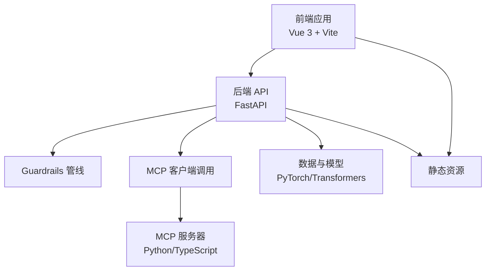
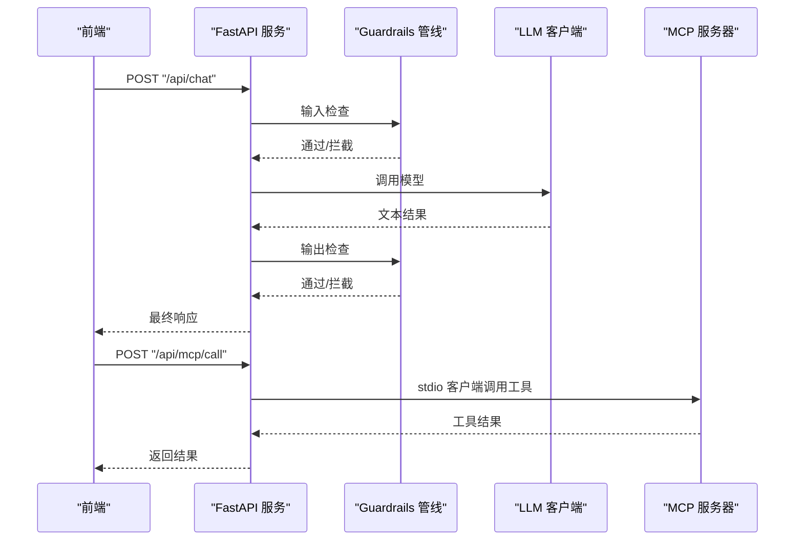
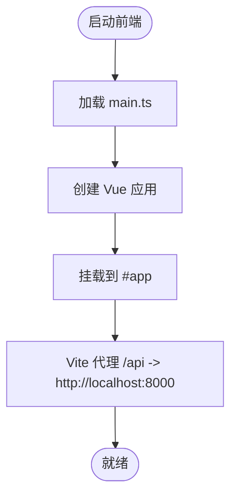
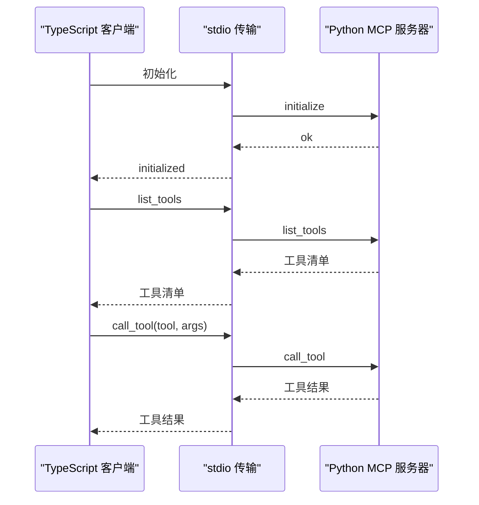
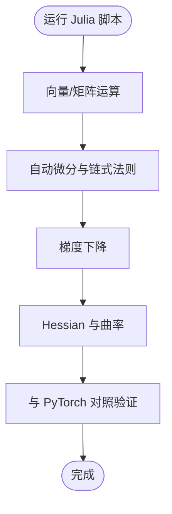
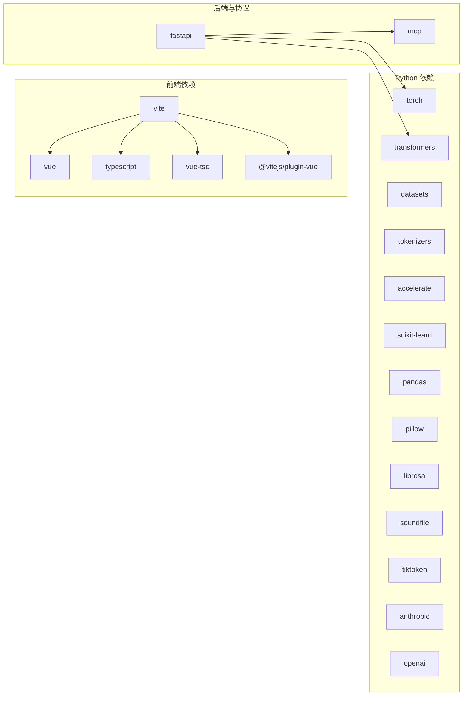

# 技术栈与工具

<cite>
**本文引用的文件**
- [requirements.txt](file://requirements.txt)
- [guardrails-sandbox/backend/main.py](file://guardrails-sandbox/backend/main.py)
- [guardrails-sandbox/frontend/package.json](file://guardrails-sandbox/frontend/package.json)
- [guardrails-sandbox/frontend/src/main.ts](file://guardrails-sandbox/frontend/src/main.ts)
- [guardrails-sandbox/frontend/vite.config.ts](file://guardrails-sandbox/frontend/vite.config.ts)
- [phases/11-llm-engineering/14-model-context-protocol/code/real_server.py](file://phases/11-llm-engineering/14-model-context-protocol/code/real_server.py)
- [phases/19-capstone-projects/13-mcp-server-with-registry/code/ts/README.md](file://phases/19-capstone-projects/13-mcp-server-with-registry/code/ts/README.md)
- [phases/00-setup-and-tooling/01-dev-environment/docs/zh.md](file://phases/00-setup-and-tooling/01-dev-environment/docs/zh.md)
- [phases/00-setup-and-tooling/08-editor-setup/docs/zh.md](file://phases/00-setup-and-tooling/08-editor-setup/docs/zh.md)
- [phases/01-math-foundations/05-chain-rule-and-autodiff/code/main.jl](file://phases/01-math-foundations/05-chain-rule-and-autodiff/code/main.jl)
- [phases/01-math-foundations/04-calculus-for-ml/code/main.jl](file://phases/01-math-foundations/04-calculus-for-ml/code/main.jl)
- [phases/01-math-foundations/02-vectors-matrices-operations/code/matrices.jl](file://phases/01-math-foundations/02-vectors-matrices-operations/code/matrices.jl)
</cite>

## 目录
1. [引言](#引言)
2. [项目结构](#项目结构)
3. [核心组件](#核心组件)
4. [架构总览](#架构总览)
5. [详细组件分析](#详细组件分析)
6. [依赖关系分析](#依赖关系分析)
7. [性能考量](#性能考量)
8. [故障排查指南](#故障排查指南)
9. [结论](#结论)
10. [附录](#附录)

## 引言
本文件系统性介绍本项目的“技术栈与开发工具”，涵盖以下方面：
- 四种编程语言的定位与分工：Python（主要实现）、TypeScript（前端与MCP客户端）、Rust（高性能实现）、Julia（数值计算）
- 核心依赖库：PyTorch、Transformers、FastAPI、Vue.js、MCP协议相关库
- 技术选型理由：性能、生态、易用性、跨学科覆盖
- 环境要求与安装指南
- 推荐开发工具与编辑器配置
- 跨语言学习价值与在AI工程中的应用

## 项目结构
本项目采用“多语言并用”的工程组织方式：
- Python：后端服务（FastAPI）、数据与模型处理、课程实验台（playground）
- TypeScript：前端应用（Vue 3 + Vite）、MCP客户端示例
- Rust：部分性能敏感课程与系统编程实践
- Julia：数学基础与数值计算课程，强调算法直观表达与高效率

```mermaid
graph TB
subgraph "后端服务"
PY["Python FastAPI 服务<br/>guardrails-sandbox/backend/main.py"]
MCP["MCP 服务器示例<br/>phases/.../real_server.py"]
end
subgraph "前端应用"
TS["TypeScript/Vue 前端<br/>guardrails-sandbox/frontend"]
VITE["Vite 构建与代理<br/>vite.config.ts"]
end
subgraph "数值计算"
JL["Julia 数值脚本<br/>phases/.../main.jl 等"]
end
subgraph "系统与工具"
RUST["Rust 示例代码<br/>phases/.../*.rs"]
ENV["开发环境与工具链<br/>uv/pnpm/cargo/juliaup"]
END
TS --> VITE
VITE --> PY
PY --> MCP
PY --> JL
RUST -. 性能/系统实践 .-> PY
```

图示来源
- [guardrails-sandbox/backend/main.py:1-421](file://guardrails-sandbox/backend/main.py#L1-L421)
- [guardrails-sandbox/frontend/vite.config.ts:1-26](file://guardrails-sandbox/frontend/vite.config.ts#L1-L26)
- [phases/11-llm-engineering/14-model-context-protocol/code/real_server.py:1-195](file://phases/11-llm-engineering/14-model-context-protocol/code/real_server.py#L1-L195)
- [phases/01-math-foundations/05-chain-rule-and-autodiff/code/main.jl:118-244](file://phases/01-math-foundations/05-chain-rule-and-autodiff/code/main.jl#L118-L244)

章节来源
- [guardrails-sandbox/backend/main.py:1-421](file://guardrails-sandbox/backend/main.py#L1-L421)
- [guardrails-sandbox/frontend/package.json:1-21](file://guardrails-sandbox/frontend/package.json#L1-L21)
- [guardrails-sandbox/frontend/vite.config.ts:1-26](file://guardrails-sandbox/frontend/vite.config.ts#L1-L26)
- [phases/11-llm-engineering/14-model-context-protocol/code/real_server.py:1-195](file://phases/11-llm-engineering/14-model-context-protocol/code/real_server.py#L1-L195)
- [phases/01-math-foundations/05-chain-rule-and-autodiff/code/main.jl:118-244](file://phases/01-math-foundations/05-chain-rule-and-autodiff/code/main.jl#L118-L244)

## 核心组件
- 后端服务（Python + FastAPI）
  - 提供聊天接口、Guardrails 管线、MCP 工具调用、课程实验台等能力
  - 通过静态文件挂载前端产物，统一对外提供 API 与界面
- 前端应用（TypeScript + Vue 3 + Vite）
  - 使用 Vite 构建，配置代理转发 /api 到后端
  - 通过 main.ts 启动应用
- MCP 协议实现
  - Python 端提供真实 MCP 服务器示例，TypeScript 端提供协议与传输骨架说明
- 数值计算（Julia）
  - 数学基础课程配套脚本，展示向量化、梯度、优化等核心概念
- 系统与工具
  - Rust 示例用于性能与系统编程实践
  - uv/pnpm/cargo/juliaup 管理多语言运行时与包

章节来源
- [guardrails-sandbox/backend/main.py:1-421](file://guardrails-sandbox/backend/main.py#L1-L421)
- [guardrails-sandbox/frontend/src/main.ts:1-5](file://guardrails-sandbox/frontend/src/main.ts#L1-L5)
- [guardrails-sandbox/frontend/vite.config.ts:1-26](file://guardrails-sandbox/frontend/vite.config.ts#L1-L26)
- [phases/11-llm-engineering/14-model-context-protocol/code/real_server.py:1-195](file://phases/11-llm-engineering/14-model-context-protocol/code/real_server.py#L1-L195)
- [phases/01-math-foundations/05-chain-rule-and-autodiff/code/main.jl:118-244](file://phases/01-math-foundations/05-chain-rule-and-autodiff/code/main.jl#L118-L244)

## 架构总览
整体架构围绕“后端服务 + 前端应用 + 协议与工具链”展开，后端负责业务逻辑与数据处理，前端负责交互与可视化，MCP 协议作为跨语言工具调用的桥梁。



图示来源
- [guardrails-sandbox/backend/main.py:1-421](file://guardrails-sandbox/backend/main.py#L1-L421)
- [guardrails-sandbox/frontend/vite.config.ts:1-26](file://guardrails-sandbox/frontend/vite.config.ts#L1-L26)
- [phases/11-llm-engineering/14-model-context-protocol/code/real_server.py:1-195](file://phases/11-llm-engineering/14-model-context-protocol/code/real_server.py#L1-L195)

## 详细组件分析

### 后端服务（FastAPI + Guardrails + MCP）
- 职责
  - 提供聊天接口与 Guardrails 输入/输出检查
  - 对比模式：无 Guardrails 与有 Guardrails 的响应对比
  - MCP 工具调用：通过 stdio 客户端连接本地 MCP 服务器
  - 课程实验台：按 phase 分组提供可运行模块
- 关键特性
  - CORS 支持、统计与阻断历史记录、基准测试接口
  - 预加载语义模型、离线缓存策略
  - 静态文件挂载，直接提供前端产物



图示来源
- [guardrails-sandbox/backend/main.py:155-220](file://guardrails-sandbox/backend/main.py#L155-L220)
- [guardrails-sandbox/backend/main.py:324-331](file://guardrails-sandbox/backend/main.py#L324-L331)
- [phases/11-llm-engineering/14-model-context-protocol/code/real_server.py:26-86](file://phases/11-llm-engineering/14-model-context-protocol/code/real_server.py#L26-L86)

章节来源
- [guardrails-sandbox/backend/main.py:1-421](file://guardrails-sandbox/backend/main.py#L1-L421)

### 前端应用（Vue 3 + Vite + TypeScript）
- 职责
  - 展示后端提供的 API 与 Guardrails 结果
  - 通过 Vite 代理将 /api 请求转发至后端
- 关键特性
  - 别名 @ 指向 src
  - 构建输出 dist，挂载为静态资源
  - 与后端同机部署时便于联调



图示来源
- [guardrails-sandbox/frontend/src/main.ts:1-5](file://guardrails-sandbox/frontend/src/main.ts#L1-L5)
- [guardrails-sandbox/frontend/vite.config.ts:1-26](file://guardrails-sandbox/frontend/vite.config.ts#L1-L26)
- [guardrails-sandbox/frontend/package.json:1-21](file://guardrails-sandbox/frontend/package.json#L1-L21)

章节来源
- [guardrails-sandbox/frontend/src/main.ts:1-5](file://guardrails-sandbox/frontend/src/main.ts#L1-L5)
- [guardrails-sandbox/frontend/vite.config.ts:1-26](file://guardrails-sandbox/frontend/vite.config.ts#L1-L26)
- [guardrails-sandbox/frontend/package.json:1-21](file://guardrails-sandbox/frontend/package.json#L1-L21)

### MCP 协议实现（Python 服务器 + TypeScript 客户端骨架）
- Python 服务器
  - 使用 FastMCP 快速搭建 stdio 传输的 MCP 服务器
  - 提供三个工具：课程搜索、阶段概要、成本估算
- TypeScript 客户端骨架
  - 说明手写 stdio JSON-RPC 的实现要点
  - 展示协议初始化、工具列举与调用、生命周期与能力声明



图示来源
- [phases/11-llm-engineering/14-model-context-protocol/code/real_server.py:189-195](file://phases/11-llm-engineering/14-model-context-protocol/code/real_server.py#L189-L195)
- [phases/19-capstone-projects/13-mcp-server-with-registry/code/ts/README.md:1-30](file://phases/19-capstone-projects/13-mcp-server-with-registry/code/ts/README.md#L1-L30)

章节来源
- [phases/11-llm-engineering/14-model-context-protocol/code/real_server.py:1-195](file://phases/11-llm-engineering/14-model-context-protocol/code/real_server.py#L1-L195)
- [phases/19-capstone-projects/13-mcp-server-with-registry/code/ts/README.md:1-30](file://phases/19-capstone-projects/13-mcp-server-with-registry/code/ts/README.md#L1-L30)

### 数值计算（Julia）
- 职责
  - 数学基础课程配套脚本，演示向量/矩阵操作、自动微分、梯度下降、Hessian 等
- 关键特性
  - 使用标准库实现，无需额外依赖
  - 与 Python/PyTorch 对照验证，确保数值一致性



图示来源
- [phases/01-math-foundations/05-chain-rule-and-autodiff/code/main.jl:118-244](file://phases/01-math-foundations/05-chain-rule-and-autodiff/code/main.jl#L118-L244)
- [phases/01-math-foundations/04-calculus-for-ml/code/main.jl:1-50](file://phases/01-math-foundations/04-calculus-for-ml/code/main.jl#L1-L50)
- [phases/01-math-foundations/02-vectors-matrices-operations/code/matrices.jl:1-157](file://phases/01-math-foundations/02-vectors-matrices-operations/code/matrices.jl#L1-L157)

章节来源
- [phases/01-math-foundations/05-chain-rule-and-autodiff/code/main.jl:118-244](file://phases/01-math-foundations/05-chain-rule-and-autodiff/code/main.jl#L118-L244)
- [phases/01-math-foundations/04-calculus-for-ml/code/main.jl:1-50](file://phases/01-math-foundations/04-calculus-for-ml/code/main.jl#L1-L50)
- [phases/01-math-foundations/02-vectors-matrices-operations/code/matrices.jl:1-157](file://phases/01-math-foundations/02-vectors-matrices-operations/code/matrices.jl#L1-L157)

## 依赖关系分析
- Python 核心依赖
  - 机器学习与深度学习：PyTorch、Transformers、Datasets、Tokenizers、Accelerate
  - 科学计算与可视化：NumPy、Matplotlib、Pandas、SciKit-learn
  - 媒体与音频：Pillow、Librosa、Soundfile
  - LLM 客户端：tiktoken、Anthropic、OpenAI
- 前端依赖
  - 运行时：Vue 3
  - 构建与类型：Vite、TypeScript、vue-tsc
  - 插件：@vitejs/plugin-vue
- 后端与协议
  - FastAPI 提供 API；MCP SDK 用于工具调用



图示来源
- [requirements.txt:1-19](file://requirements.txt#L1-L19)
- [guardrails-sandbox/frontend/package.json:11-19](file://guardrails-sandbox/frontend/package.json#L11-L19)
- [guardrails-sandbox/backend/main.py:10-18](file://guardrails-sandbox/backend/main.py#L10-L18)

章节来源
- [requirements.txt:1-19](file://requirements.txt#L1-L19)
- [guardrails-sandbox/frontend/package.json:11-19](file://guardrails-sandbox/frontend/package.json#L11-L19)
- [guardrails-sandbox/backend/main.py:10-18](file://guardrails-sandbox/backend/main.py#L10-L18)

## 性能考量
- Python
  - 使用 PyTorch 与 Accelerate 优化训练与推理性能
  - 通过离线缓存与预加载模型减少冷启动延迟
- 前端
  - Vite 构建优化与代理开发体验，生产构建输出 dist
- 协议与工具
  - MCP 通过 stdio 传输，避免网络开销，适合本地工具调用
- 数值计算
  - Julia 在数学密集任务上具备高效率与清晰语法，适合教学与原型验证

## 故障排查指南
- 后端 API 无法访问
  - 检查 FastAPI 是否在 0.0.0.0:8000 启动
  - 确认 CORS 配置允许前端域名
- 前端代理无效
  - 确认 vite.config.ts 中 /api 代理指向 http://localhost:8000
  - 确认前端已构建并挂载静态资源
- MCP 工具调用失败
  - 检查 Python MCP 服务器是否正常启动
  - 确认 stdio 客户端参数与工具名一致
- 数值计算不一致
  - 对照 Julia 与 PyTorch 的自动微分与梯度计算
  - 核对数值精度与数值稳定性（如 logsumexp 的稳定实现）

章节来源
- [guardrails-sandbox/backend/main.py:413-421](file://guardrails-sandbox/backend/main.py#L413-L421)
- [guardrails-sandbox/frontend/vite.config.ts:17-24](file://guardrails-sandbox/frontend/vite.config.ts#L17-L24)
- [phases/11-llm-engineering/14-model-context-protocol/code/real_server.py:189-195](file://phases/11-llm-engineering/14-model-context-protocol/code/real_server.py#L189-L195)
- [phases/01-math-foundations/05-chain-rule-and-autodiff/code/main.jl:118-244](file://phases/01-math-foundations/05-chain-rule-and-autodiff/code/main.jl#L118-L244)

## 结论
本项目通过“Python 主实现 + TypeScript 前端 + Rust 性能实践 + Julia 数值计算”的多语言组合，覆盖从基础数学到高级工程实践的完整学习路径。配合 FastAPI、Vue、MCP 等成熟生态，既保证了易用性与可维护性，又兼顾性能与跨学科融合。建议按照环境与工具链指南完成本地配置，再逐步深入各模块的学习与实践。

## 附录

### 环境要求与安装指南
- Python
  - 使用 uv 管理运行时与虚拟环境，安装 PyTorch 与核心依赖
- Node.js 与 TypeScript
  - 使用 fnm 安装 Node.js，pnpm 管理依赖，构建前端应用
- Rust
  - 使用 rustup 安装工具链，用于性能与系统编程课程
- Julia
  - 使用 juliaup 安装运行时，用于数学基础课程
- GPU（可选）
  - 安装带 CUDA 的 PyTorch，验证 GPU 可用性

章节来源
- [phases/00-setup-and-tooling/01-dev-environment/docs/zh.md:54-134](file://phases/00-setup-and-tooling/01-dev-environment/docs/zh.md#L54-L134)

### 推荐开发工具与编辑器配置
- VS Code
  - Python、Pylance、Jupyter、GitLens、Remote SSH、Debugpy、Black、Ruff
  - 设置：保存时格式化、类型检查、标尺、Notebook 输出滚动、自动保存
- 终端与 SSH
  - 配置 Remote SSH 免密登录，提升远程 GPU 机器开发效率

章节来源
- [phases/00-setup-and-tooling/08-editor-setup/docs/zh.md:52-105](file://phases/00-setup-and-tooling/08-editor-setup/docs/zh.md#L52-L105)
- [phases/00-setup-and-tooling/08-editor-setup/docs/zh.md:131-159](file://phases/00-setup-and-tooling/08-editor-setup/docs/zh.md#L131-L159)

### 跨语言学习价值与在AI工程中的应用
- 多语言互补：Python 专注实现与生态，TypeScript 专注前端与协议，Rust 专注性能与系统，Julia 专注数值计算
- 工程实践：通过 FastAPI、Vue、MCP 等实际项目加深理解
- 学习路径：从数学基础到工程落地，形成闭环