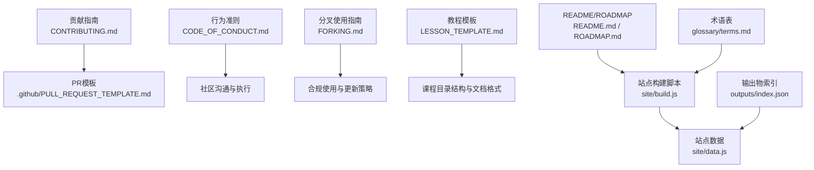
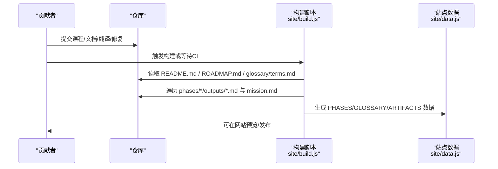
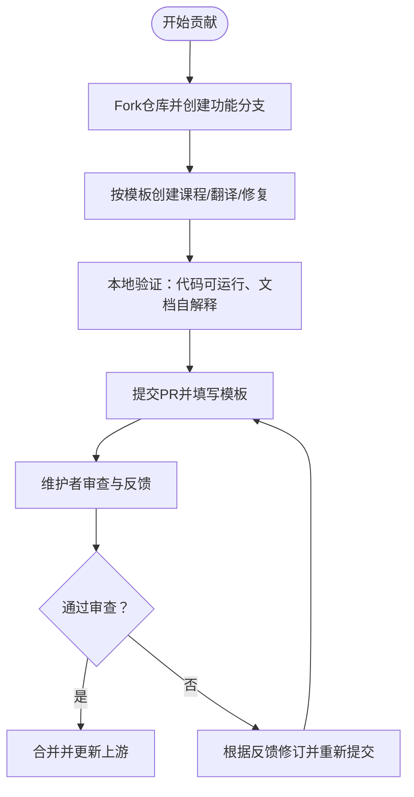
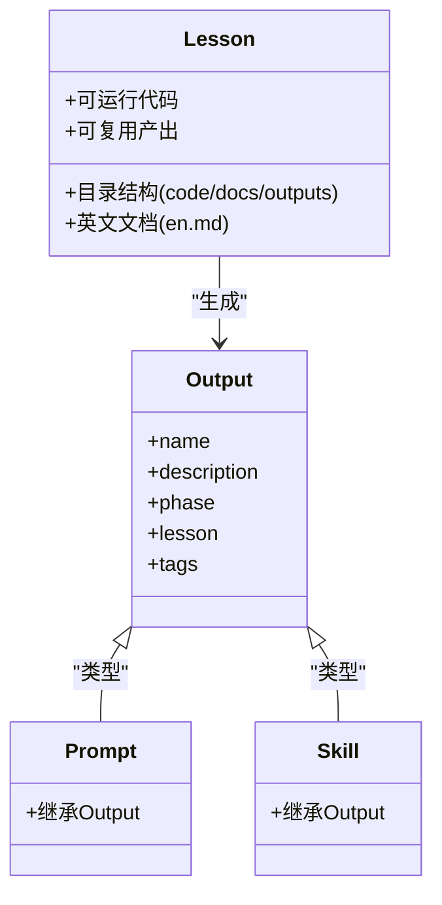
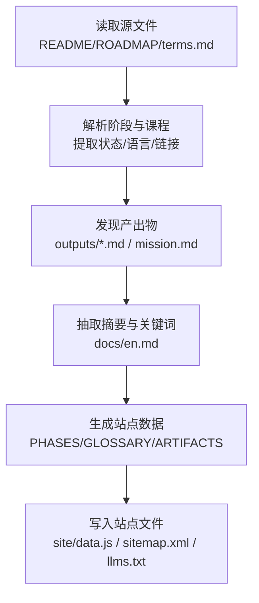
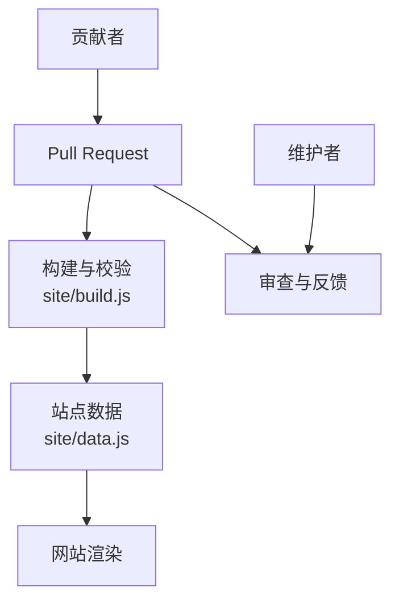

# 社区与贡献

<cite>
**本文引用的文件**
- [CONTRIBUTING.md](file://CONTRIBUTING.md)
- [CODE_OF_CONDUCT.md](file://CODE_OF_CONDUCT.md)
- [FORKING.md](file://FORKING.md)
- [.github/PULL_REQUEST_TEMPLATE.md](file://.github/PULL_REQUEST_TEMPLATE.md)
- [LESSON_TEMPLATE.md](file://LESSON_TEMPLATE.md)
- [README.md](file://README.md)
- [ROADMAP.md](file://ROADMAP.md)
- [site/build.js](file://site/build.js)
- [glossary/terms.md](file://glossary/terms.md)
- [outputs/index.json](file://outputs/index.json)
</cite>

## 目录
1. [引言](#引言)
2. [项目结构](#项目结构)
3. [核心组件](#核心组件)
4. [架构总览](#架构总览)
5. [详细组件分析](#详细组件分析)
6. [依赖关系分析](#依赖关系分析)
7. [性能考量](#性能考量)
8. [故障排查指南](#故障排查指南)
9. [结论](#结论)
10. [附录](#附录)

## 引言
本指南面向所有希望参与“从零开始的AI工程”开源项目的贡献者，系统阐述项目的协作模式、贡献流程、行为准则、社区资源与治理方式，并明确不同类型的贡献（代码、文档、翻译、测试、设计）的重要性与实践路径。项目采用MIT许可证，鼓励自由使用、修改与再分发；同时通过严格的构建与校验流程确保网站数据一致性与质量。

## 项目结构
- 贡献入口与协作规范
  - 贡献指南：定义可接受的贡献类型、目录结构、文档格式、代码风格与PR流程。
  - 行为准则：社区成员需遵守的言行标准与执行机制。
  - 分叉使用指南：团队/学校/训练营等场景下的合规使用与更新策略。
  - PR模板：标准化PR描述、检查清单与审查要点。
- 内容与课程体系
  - 课程总览与路线图：包含20个阶段、503门课程的进度状态与时间估算。
  - 教程模板：新课程的标准目录结构与文档格式。
  - 术语表：60+条AI术语的“常见误解 vs 实际含义”，用于统一认知。
- 网站构建与数据生成
  - 构建脚本：解析README、路线图与术语表，生成站点数据与索引文件。
  - 输出物索引：顶层输出物索引导入与版本管理。

**图表来源**
- [CONTRIBUTING.md](file://CONTRIBUTING.md)
- [.github/PULL_REQUEST_TEMPLATE.md](file://.github/PULL_REQUEST_TEMPLATE.md)
- [CODE_OF_CONDUCT.md](file://CODE_OF_CONDUCT.md)
- [FORKING.md](file://FORKING.md)
- [LESSON_TEMPLATE.md](file://LESSON_TEMPLATE.md)
- [README.md](file://README.md)
- [ROADMAP.md](file://ROADMAP.md)
- [site/build.js](file://site/build.js)
- [glossary/terms.md](file://glossary/terms.md)
- [outputs/index.json](file://outputs/index.json)

**章节来源**
- [CONTRIBUTING.md](file://CONTRIBUTING.md)
- [CODE_OF_CONDUCT.md](file://CODE_OF_CONDUCT.md)
- [FORKING.md](file://FORKING.md)
- [.github/PULL_REQUEST_TEMPLATE.md](file://.github/PULL_REQUEST_TEMPLATE.md)
- [LESSON_TEMPLATE.md](file://LESSON_TEMPLATE.md)
- [README.md](file://README.md)
- [ROADMAP.md](file://ROADMAP.md)
- [site/build.js](file://site/build.js)
- [glossary/terms.md](file://glossary/terms.md)
- [outputs/index.json](file://outputs/index.json)

## 核心组件
- 贡献类型与范围
  - 新增课程：遵循模板目录结构，提供可运行代码、英文文档与可复用产出。
  - 翻译：在课程docs目录下新增语言版本，保持与英文版结构一致。
  - 修复与改进：修复不可运行代码、优化解释、补充图表、更新过时信息。
  - 扩展练习与项目：连接多阶段的综合性任务。
- 质量与风格要求
  - 代码必须可运行，无注释，语言以“最佳工具”为准；先从零实现，再展示框架版本。
  - 文风直白、避免花哨装饰，遵循手册语调。
- PR流程
  - 分支命名、变更最小化（每PR仅一门课程）、本地验证、清晰描述与检查清单。

**章节来源**
- [CONTRIBUTING.md](file://CONTRIBUTING.md)
- [LESSON_TEMPLATE.md](file://LESSON_TEMPLATE.md)
- [.github/PULL_REQUEST_TEMPLATE.md](file://.github/PULL_REQUEST_TEMPLATE.md)

## 架构总览
站点数据由构建脚本统一生成，解析课程与术语，汇总可复用产出，最终写入站点数据文件，供前端渲染与检索。

**图表来源**
- [site/build.js](file://site/build.js)
- [README.md](file://README.md)
- [ROADMAP.md](file://ROADMAP.md)
- [glossary/terms.md](file://glossary/terms.md)

## 详细组件分析

### 贡献流程与PR规范
- 前置准备
  - 拉取上游最新代码，确保与主线同步。
  - 使用模板创建课程目录结构，编写英文文档，提供可运行代码。
- 提交PR
  - 在PR模板中勾选贡献类型、填写阶段/课程、检查清单逐项确认。
  - 保证每门课程独立提交，便于审查与计数。
- 审查与合并
  - 维护者关注：代码可运行、文档自解释、构建顺序正确、网站数据解析无误。

**图表来源**
- [CONTRIBUTING.md](file://CONTRIBUTING.md)
- [.github/PULL_REQUEST_TEMPLATE.md](file://.github/PULL_REQUEST_TEMPLATE.md)
- [site/build.js](file://site/build.js)

**章节来源**
- [CONTRIBUTING.md](file://CONTRIBUTING.md)
- [.github/PULL_REQUEST_TEMPLATE.md](file://.github/PULL_REQUEST_TEMPLATE.md)

### 课程开发与产出规范
- 目录结构
  - code/：至少包含一个可运行实现；支持Python/TypeScript/Rust/Julia。
  - docs/en.md：遵循模板的完整教学文档。
  - outputs/：产出提示词、技能、代理或MCP服务器的Markdown文件。
- 文档格式
  - 一到两行“金句式”摘要；问题-概念-从零实现-框架对比-产出-练习-术语-延伸阅读。
- 产出物格式
  - 提示词：包含name、description、phase、lesson等元数据。
  - 技能：包含name、description、version、phase、lesson、tags等元数据。

**图表来源**
- [LESSON_TEMPLATE.md](file://LESSON_TEMPLATE.md)
- [outputs/index.json](file://outputs/index.json)

**章节来源**
- [LESSON_TEMPLATE.md](file://LESSON_TEMPLATE.md)
- [outputs/index.json](file://outputs/index.json)

### 网站构建与数据一致性
- 解析规则
  - README支持多种阶段标题与表格形式；ROADMAP状态符号（✅🚧⬚）被严格保留。
  - 构建脚本解析阶段、课程、语言与状态，并提取课程摘要与关键词。
  - 发现phases/*/outputs/*.md与mission.md，抽取元数据并注入站点数据。
- 同步与校验
  - 自动生成sitemap与llms.txt；自动同步README中的统计徽章与统计数据。
  - 任何编辑后运行构建脚本，确保site/data.js仅显示时间戳变化。

**图表来源**
- [site/build.js](file://site/build.js)
- [README.md](file://README.md)
- [ROADMAP.md](file://ROADMAP.md)
- [glossary/terms.md](file://glossary/terms.md)

**章节来源**
- [site/build.js](file://site/build.js)
- [README.md](file://README.md)
- [ROADMAP.md](file://ROADMAP.md)
- [glossary/terms.md](file://glossary/terms.md)

### 行为准则与社区治理
- 承诺与标准
  - 承诺提供无骚扰的参与环境；鼓励包容、尊重、建设性反馈与同理心。
- 不可接受行为
  - 恶意攻击、骚扰、泄露隐私、其他不当行为。
- 执行与联系
  - 通过指定邮箱进行举报，所有投诉将被审阅调查。
- 归属
  - 采用Contributor Covenant 2.1版本。

**章节来源**
- [CODE_OF_CONDUCT.md](file://CODE_OF_CONDUCT.md)

### 许可证与合规使用
- 许可证
  - 项目采用MIT许可证，允许自由使用、复制、修改、分发与私有化使用。
- 分叉与使用指南
  - 团队/学校/训练营可自由分叉并定制；建议保留归属以促进生态发展。
  - 保持与上游同步的最佳实践：添加upstream远程、定期合并主干。

**章节来源**
- [FORKING.md](file://FORKING.md)

### 社区资源与参与方式
- 代码贡献
  - 新增课程、翻译、修复与改进、扩展练习与项目。
- 文档改进
  - 优化解释、补充图表、更新过时信息。
- Bug报告与功能建议
  - 通过Issues模板描述问题、期望与复现步骤；功能建议包含动机、影响面与验收条件。
- 讨论与协作
  - 在PR与Issue中保持开放、尊重与建设性的沟通。
- 审核过程
  - 维护者负责审查代码质量、文档完整性与网站数据一致性；贡献者配合修改与验证。

**章节来源**
- [CONTRIBUTING.md](file://CONTRIBUTING.md)
- [.github/PULL_REQUEST_TEMPLATE.md](file://.github/PULL_REQUEST_TEMPLATE.md)

### 成为课程贡献者与导师
- 成为贡献者
  - 从最小可行贡献开始（如修复一处错误、补充一个练习），逐步熟悉模板与流程。
  - 关注ROADMAP中标记为“计划中”的课程，认领并完成。
- 成为导师
  - 在社区中积极回答问题、协助审查PR、分享最佳实践。
  - 协助组织工作坊、培训与认证，推动知识传播与实践落地。

**章节来源**
- [ROADMAP.md](file://ROADMAP.md)
- [CONTRIBUTING.md](file://CONTRIBUTING.md)

## 依赖关系分析
- 贡献者与仓库
  - 贡献者通过PR向主仓库提交更改；构建脚本在CI中自动运行，确保数据一致性。
- 仓库与站点
  - README/ROADMAP/术语表与课程产出共同驱动站点数据；任何结构性变更需运行构建脚本。
- 维护者与审查
  - 维护者负责审查PR是否满足贡献指南与构建要求；贡献者负责修正问题直至通过。

**图表来源**
- [site/build.js](file://site/build.js)
- [README.md](file://README.md)
- [ROADMAP.md](file://ROADMAP.md)
- [glossary/terms.md](file://glossary/terms.md)

**章节来源**
- [site/build.js](file://site/build.js)
- [README.md](file://README.md)
- [ROADMAP.md](file://ROADMAP.md)
- [glossary/terms.md](file://glossary/terms.md)

## 性能考量
- 构建效率
  - 构建脚本按需解析与遍历，避免重复扫描；建议在本地先行验证，减少无效PR。
- 网站加载
  - 产出物与课程摘要、关键词的抽取有助于搜索与导航性能；保持文档简洁有助于SEO与检索。

## 故障排查指南
- 构建失败
  - 检查README/ROADMAP中的阶段标题与状态符号是否符合解析规则；确保表格列形状与语言标记正确。
  - 运行构建脚本后，确认仅site/data.js的时间戳变化，其他文件未被意外修改。
- PR被拒
  - 按照PR模板逐项检查；确保课程目录结构与文档格式符合模板；代码可运行且无注释。
- 网站数据不一致
  - 确认outputs/*.md与mission.md的元数据键值正确；必要时重新生成站点数据。

**章节来源**
- [CONTRIBUTING.md](file://CONTRIBUTING.md)
- [.github/PULL_REQUEST_TEMPLATE.md](file://.github/PULL_REQUEST_TEMPLATE.md)
- [site/build.js](file://site/build.js)

## 结论
本指南明确了“从零开始的AI工程”项目的协作模式与贡献路径：以课程为中心、以产出为导向、以构建脚本为质量保障、以行为准约为社区基石。欢迎各类贡献者加入，共同打造高质量、可持续的知识体系与开源生态。

## 附录
- 快速参考
  - 贡献类型：课程、翻译、修复、练习、项目、文档、测试、设计。
  - PR检查清单：代码可运行、文档自解释、先从零实现、遵循模板、单课程PR。
  - 网站数据：README/ROADMAP/术语表与课程产出共同驱动，构建脚本自动生成。