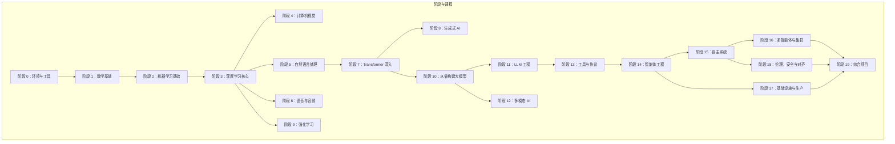
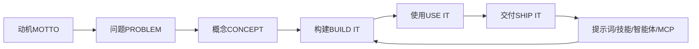
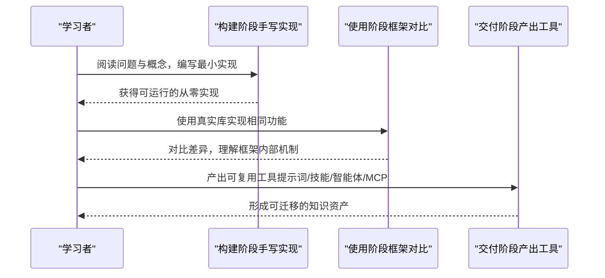
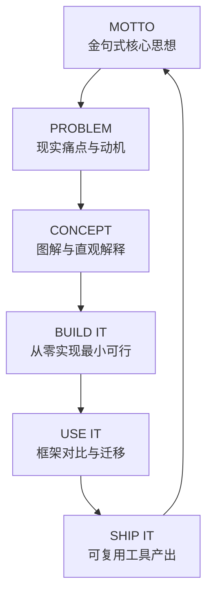
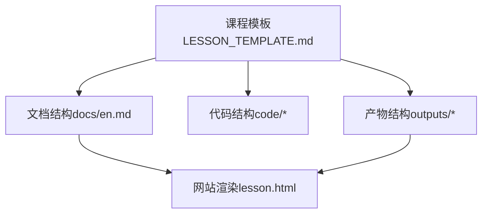
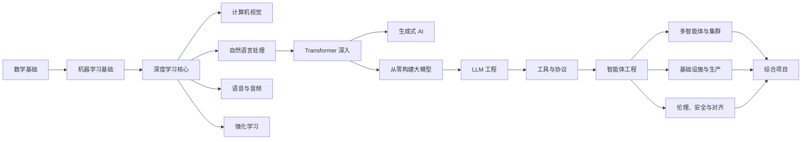

# 课程理念与方法

<cite>
**本文引用的文件**
- [README.md](file://README.md)
- [LESSON_TEMPLATE.md](file://LESSON_TEMPLATE.md)
- [ROADMAP.md](file://ROADMAP.md)
- [phases/01-math-foundations/01-linear-algebra-intuition/docs/en.md](file://phases/01-math-foundations/01-linear-algebra-intuition/docs/en.md)
- [phases/03-deep-learning-core/01-the-perceptron/docs/en.md](file://phases/03-deep-learning-core/01-the-perceptron/docs/en.md)
- [phases/14-agent-engineering/01-the-agent-loop/docs/en.md](file://phases/14-agent-engineering/01-the-agent-loop/docs/en.md)
- [phases/11-llm-engineering/14-model-context-protocol/code/real_server.py](file://phases/11-llm-engineering/14-model-context-protocol/code/real_server.py)
- [site/lesson.html](file://site/lesson.html)
</cite>

## 目录
1. [引言](#引言)
2. [项目结构](#项目结构)
3. [核心组件](#核心组件)
4. [架构总览](#架构总览)
5. [详细组件分析](#详细组件分析)
6. [依赖关系分析](#依赖关系分析)
7. [性能考量](#性能考量)
8. [故障排查指南](#故障排查指南)
9. [结论](#结论)
10. [附录](#附录)

## 引言
本课程以“从零到一”的工程化路径重构AI知识体系：通过“从头实现算法”与“使用现有框架验证”的双轨教学法，帮助学习者建立对底层原理的深度理解，并形成可复用的工程资产（提示词、技能、智能体、MCP 服务器）。课程采用统一的六步节奏：动机（MOTTO）、问题（PROBLEM）、概念（CONCEPT）、构建（BUILD IT）、使用（USE IT）、交付（SHIP IT），确保每节课既有理论洞察又有实践产出。

## 项目结构
- 课程组织遵循“阶段-课程”两级目录，每门课程独立封装，包含可运行代码、文档与可交付产物。
- 整体结构与流程图如下：

图表来源
- [README.md:57-81](file://README.md#L57-L81)

章节来源
- [README.md:87-111](file://README.md#L87-L111)

## 核心组件
- 双轨教学法（Build It / Use It）
  - 先“从零实现”：手写算法、理解变量与控制流，建立直觉与信心。
  - 再“使用框架验证”：用真实库（如 NumPy、PyTorch、sklearn）对比实现，印证原理并掌握工程化接口。
- 六步节奏（MOTTO → PROBLEM → CONCEPT → BUILD IT → USE IT → SHIP IT）
  - MOTTO：提炼一节课的“金句式”核心思想，贯穿始终。
  - PROBLEM：提出具体痛点与现实场景，说明“为何必须掌握它”。
  - CONCEPT：用图解与直观解释建立心智模型，不急于编码。
  - BUILD IT：逐步实现，从最简版本开始，强调可运行与可验证。
  - USE IT：展示框架实现，比较异同，建立“从原理到工程”的桥梁。
  - SHIP IT：产出可复用工具（提示词、技能、智能体、MCP 服务器等）。

章节来源
- [README.md:99-111](file://README.md#L99-L111)
- [LESSON_TEMPLATE.md:23-94](file://LESSON_TEMPLATE.md#L23-L94)

## 架构总览
课程理念在以下三个层面协同：
- 方法论层：双轨教学法与六步节奏，保证“理解—验证—产出”的闭环。
- 结构层：统一的课程模板与目录规范，确保跨阶段一致性与可扩展性。
- 工程层：每节课产出可复用工具，形成“知识→工具→产品”的转化路径。

图表来源
- [README.md:99-111](file://README.md#L99-L111)

## 详细组件分析

### 组件 A：双轨教学法（Build It / Use It）
- 设计要点
  - “从零实现”强调“亲手写代码”，帮助学习者看到变量、循环、条件分支如何构成算法。
  - “使用框架验证”强调“对照与迁移”，帮助学习者理解框架内部的实现细节。
- 实施策略
  - 在“构建”阶段提供最小可行实现，逐步增加复杂度。
  - 在“使用”阶段引入真实库，对比相同功能的不同实现，突出差异点与优势。
- 价值体现
  - 学习者不仅“知道怎么做”，更“知道为什么这样做”，从而具备解决未知问题的能力。

图表来源
- [README.md:99-111](file://README.md#L99-L111)
- [phases/01-math-foundations/01-linear-algebra-intuition/docs/en.md:185-420](file://phases/01-math-foundations/01-linear-algebra-intuition/docs/en.md#L185-L420)
- [phases/03-deep-learning-core/01-the-perceptron/docs/en.md:327-352](file://phases/03-deep-learning-core/01-the-perceptron/docs/en.md#L327-L352)

章节来源
- [README.md:99-111](file://README.md#L99-L111)
- [phases/01-math-foundations/01-linear-algebra-intuition/docs/en.md:185-420](file://phases/01-math-foundations/01-linear-algebra-intuition/docs/en.md#L185-L420)
- [phases/03-deep-learning-core/01-the-perceptron/docs/en.md:327-352](file://phases/03-deep-learning-core/01-the-perceptron/docs/en.md#L327-L352)

### 组件 B：六步节奏（MOTTO → PROBLEM → CONCEPT → BUILD IT → USE IT → SHIP IT）
- 设计要点
  - 每节课以“金句式”动机开头，快速抓住注意力。
  - 通过“问题”与“概念”建立认知框架，再进入“构建”与“使用”的实践闭环。
  - 以“交付”收束，确保每节课都有可复用成果。
- 实施策略
  - 严格遵循模板结构：Problem、Concept、Build It、Use It、Ship It、Exercises、Key Terms、Further Reading。
  - 在“构建”阶段强调“可运行性”，在“使用”阶段强调“可迁移性”。

图表来源
- [LESSON_TEMPLATE.md:23-94](file://LESSON_TEMPLATE.md#L23-L94)
- [README.md:99-111](file://README.md#L99-L111)

章节来源
- [LESSON_TEMPLATE.md:23-94](file://LESSON_TEMPLATE.md#L23-L94)
- [README.md:99-111](file://README.md#L99-L111)

### 组件 C：可复用工具理念（提示词、技能、智能体、MCP 服务器）
- 设计要点
  - 每节课结束即“交付”，产出可直接使用的工具：提示词、技能、智能体、MCP 服务器。
  - 通过统一的输出规范（如 YAML 头部、描述与用途）确保可检索、可安装、可复用。
- 实施策略
  - 在“构建”阶段同步思考“如何包装为工具”，在“使用”阶段验证工具可用性，在“交付”阶段固化为标准产物。
  - 以真实案例驱动：如 MCP 服务器示例，提供搜索课程、阶段概要、成本估算等工具。

图表来源
- [phases/11-llm-engineering/14-model-context-protocol/code/real_server.py:1-195](file://phases/11-llm-engineering/14-model-context-protocol/code/real_server.py#L1-L195)

章节来源
- [README.md:161-183](file://README.md#L161-L183)
- [phases/11-llm-engineering/14-model-context-protocol/code/real_server.py:1-195](file://phases/11-llm-engineering/14-model-context-protocol/code/real_server.py#L1-L195)

### 组件 D：课程结构的标准化设计与跨阶段一致性
- 设计要点
  - 统一的课程模板与目录规范，确保各阶段课程在结构、语言与产出上保持一致。
  - 通过“前置要求”与“时间估计”帮助学习者制定个性化路径。
- 实施策略
  - 模板强制包含：类型（Build/Learn）、语言、前置要求、时间、Problem、Concept、Build It、Use It、Ship It、练习、术语、延伸阅读。
  - 网站侧通过解析模板与状态标记，生成进度可视化与交互式导航。

图表来源
- [LESSON_TEMPLATE.md:5-21](file://LESSON_TEMPLATE.md#L5-L21)
- [site/lesson.html:2358-2385](file://site/lesson.html#L2358-L2385)

章节来源
- [LESSON_TEMPLATE.md:5-21](file://LESSON_TEMPLATE.md#L5-L21)
- [site/lesson.html:2358-2385](file://site/lesson.html#L2358-L2385)

### 组件 E：避免短视频与复制粘贴部署的教学原则
- 设计要点
  - 强调“动手”而非“观看”，强调“理解”而非“搬运”，确保学习者在实践中建立深度认知。
  - 通过“构建—使用—交付”的闭环，让学习者在完成真实任务中获得成就感与迁移能力。
- 实施策略
  - 在课程中明确指出“无短视频、无复制粘贴、无手把手”的原则，引导学习者专注于可运行的代码与可验证的结果。

章节来源
- [README.md:43-45](file://README.md#L43-L45)

## 依赖关系分析
- 课程依赖关系
  - 前置阶段为后续阶段奠定基础，如“数学基础”支撑“机器学习基础”“深度学习核心”，“工具与协议”支撑“智能体工程”“多模态 AI”等。
  - 课程模板与网站渲染之间存在依赖：模板决定文档结构，网站解析模板与状态生成可视化界面。
- 工具依赖关系
  - 每节课的“构建”与“使用”部分相互依赖：前者为后者提供对照对象，后者为前者提供工程化落地。

图表来源
- [README.md:57-81](file://README.md#L57-L81)

章节来源
- [ROADMAP.md:1-617](file://ROADMAP.md#L1-L617)

## 性能考量
- 学习效率
  - 通过“从零实现”与“框架对比”的双轨教学，减少“似懂非懂”的认知负担，提高迁移效率。
  - 六步节奏确保每节课都有明确的产出，有助于维持学习动力与进度感。
- 工程效率
  - 每节课产出的工具（提示词、技能、智能体、MCP）可直接复用，降低重复开发成本。
  - 标准化的课程模板与网站渲染流程，便于规模化维护与扩展。

## 故障排查指南
- 常见问题与对策
  - “学了但不会用”：回到“使用”环节，对比从零实现与框架实现的差异，补足工程化细节。
  - “理解了但写不出”：回到“构建”环节，从最小可行实现开始，逐步增加复杂度。
  - “产出不完整”：检查“交付”环节是否按模板要求完成，确保输出文件命名与格式正确。
- 诊断工具
  - 网站侧的测验与问答模块可用于阶段性自检，帮助识别薄弱环节。
  - 课程模板中的“练习”与“关键术语”可用于巩固与回顾。

章节来源
- [site/lesson.html:2842-2880](file://site/lesson.html#L2842-L2880)
- [site/lesson.html:3250-3260](file://site/lesson.html#L3250-L3260)

## 结论
本课程以“双轨教学法”和“六步节奏”为核心，结合“可复用工具”的理念，构建了从理解到工程落地的完整闭环。通过标准化的课程结构与严格的实施流程，学习者不仅能够深入理解AI原理，还能在每节课结束时获得可迁移的工具资产，真正实现“学以致用”。

## 附录
- 课程示例参考
  - 线性代数直觉：从零实现向量与矩阵运算，再与NumPy/PyTorch对比，最后产出几何直觉型提示词。
  - 感知机：从零实现感知机与权重更新规则，演示XOR不可分的证明，再过渡到两层网络与反向传播。
  - 智能体循环：从零实现ReAct循环，再对比主流SDK的实现差异，最终产出可复用的技能包。

章节来源
- [phases/01-math-foundations/01-linear-algebra-intuition/docs/en.md:185-420](file://phases/01-math-foundations/01-linear-algebra-intuition/docs/en.md#L185-L420)
- [phases/03-deep-learning-core/01-the-perceptron/docs/en.md:327-352](file://phases/03-deep-learning-core/01-the-perceptron/docs/en.md#L327-L352)
- [phases/14-agent-engineering/01-the-agent-loop/docs/en.md:75-106](file://phases/14-agent-engineering/01-the-agent-loop/docs/en.md#L75-L106)