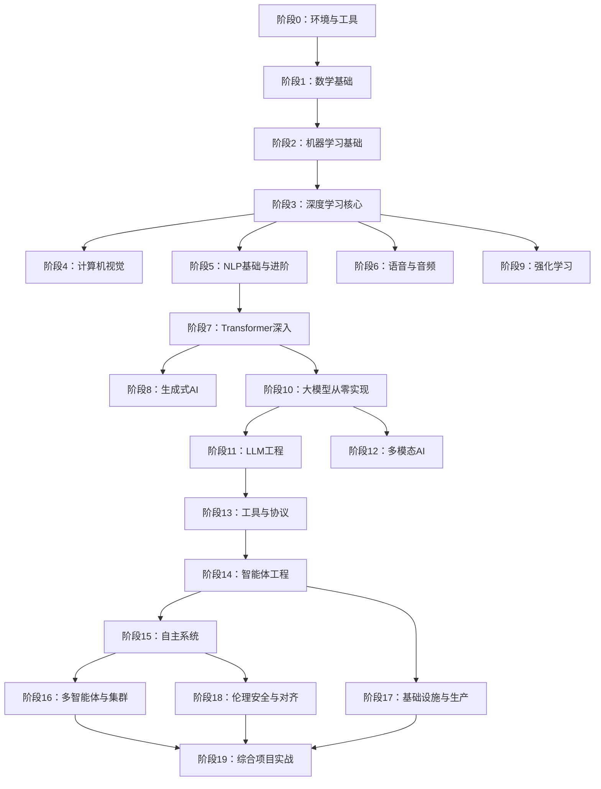
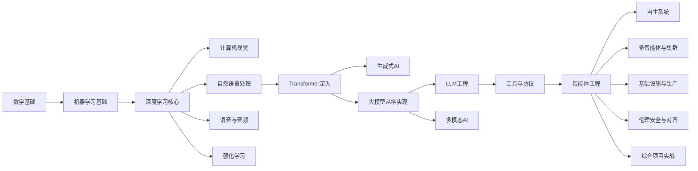

# 项目介绍

<cite>
**本文档引用的文件**
- [README.md](file://README.md)
- [ROADMAP.md](file://ROADMAP.md)
- [CONTRIBUTING.md](file://CONTRIBUTING.md)
- [LESSON_TEMPLATE.md](file://LESSON_TEMPLATE.md)
- [requirements.txt](file://requirements.txt)
- [phases/01-math-foundations/01-linear-algebra-intuition/docs/en.md](file://phases/01-math-foundations/01-linear-algebra-intuition/docs/en.md)
- [phases/03-deep-learning-core/01-the-perceptron/docs/en.md](file://phases/03-deep-learning-core/01-the-perceptron/docs/en.md)
- [phases/10-llms-from-scratch/01-tokenizers/docs/en.md](file://phases/10-llms-from-scratch/01-tokenizers/docs/en.md)
</cite>

## 目录
1. [引言](#引言)
2. [项目结构](#项目结构)
3. [核心组件](#核心组件)
4. [架构总览](#架构总览)
5. [详细组件分析](#详细组件分析)
6. [依赖关系分析](#依赖关系分析)
7. [性能考量](#性能考量)
8. [故障排查指南](#故障排查指南)
9. [结论](#结论)
10. [附录](#附录)

## 引言
本项目旨在“从零开始构建”AI工程能力，填补“84%学生使用AI工具但只有18%感到专业准备”的巨大差距。我们提供线性递进的20个阶段、503门课程与完整学习路径，覆盖数学基础、机器学习、深度学习、计算机视觉、自然语言处理、语音音频、强化学习、生成式AI、大模型从零到一、工程化与生产、智能体与多智能体、基础设施与安全对齐等全栈主题。每门课程均强调“先手写实现，再框架对照”，确保你不仅会用，更知其所以然。

项目采用“Build It / Use It / Ship It”的统一节奏：先用纯手工代码实现核心算法，再用真实框架（如PyTorch、sklearn、Hugging Face等）复现同一逻辑，最后产出可直接复用的提示词、技能、代理或MCP服务器等“可执行工具包”。项目完全开源，采用MIT许可证，欢迎社区贡献与协作。

## 项目结构
- 阶段化组织：20个阶段层层递进，从环境搭建、数学基础、机器学习，到深度学习、视觉、NLP、语音、RL、生成式AI、大模型从零实现、LLM工程、多模态、工具协议、智能体工程、自主系统、多智能体与集群、基础设施与生产、伦理安全与对齐，直至综合项目实战。
- 课程结构：每个课程位于独立目录，包含代码（Python、TypeScript、Rust、Julia）、文档（英文）、输出产物（提示词、技能、代理、MCP服务器等），遵循统一模板与规范。
- 网站与数据：README与ROADMAP驱动网站生成，包含阶段与课程状态、时长估算、语言标注等，确保线上展示与仓库内容一致。

图表来源
- [README.md:57-81](file://README.md#L57-L81)
- [ROADMAP.md:1-617](file://ROADMAP.md#L1-L617)

章节来源
- [README.md:241-241](file://README.md#L241-L241)
- [ROADMAP.md:1-617](file://ROADMAP.md#L1-L617)

## 核心组件
- 课程体系与节奏：每门课程遵循“动机—问题—概念—动手实现—框架对照—交付产物—练习与术语”的完整闭环，确保学习效果可检验、可迁移。
- 多语言实现：Python用于通用数值计算与教学；TypeScript用于前端与协议生态；Rust用于高性能推理与安全；Julia用于科学计算与可视化。不同领域选择最佳语言，提升学习效率与工程实践贴合度。
- 开源与MIT许可：项目完全开源，MIT许可允许自由使用、修改与分发，便于在教育、研究与工业场景中广泛采用。
- 可复用产物：每门课程结束即交付一个“可执行工具包”，包括提示词、技能、代理、MCP服务器等，形成个人AI工具集，真正“学以致用”。

章节来源
- [README.md:19-26](file://README.md#L19-L26)
- [README.md:87-112](file://README.md#L87-L112)
- [CONTRIBUTING.md:25-96](file://CONTRIBUTING.md#L25-L96)
- [LESSON_TEMPLATE.md:5-22](file://LESSON_TEMPLATE.md#L5-L22)

## 架构总览
本项目以“从零到一”的工程化思维贯穿始终：先用纯手工代码实现核心算法，再用真实框架验证与对比，最终沉淀为可复用的工程资产。这种“Build It / Use It / Ship It”的三段式流程，帮助学习者建立“自底向上”的知识结构，避免“只会调API却不知原理”的断层。

图表来源
- [README.md:87-112](file://README.md#L87-L112)
- [phases/01-math-foundations/01-linear-algebra-intuition/docs/en.md:1-464](file://phases/01-math-foundations/01-linear-algebra-intuition/docs/en.md#L1-L464)
- [phases/03-deep-learning-core/01-the-perceptron/docs/en.md:1-383](file://phases/03-deep-learning-core/01-the-perceptron/docs/en.md#L1-L383)

章节来源
- [README.md:87-112](file://README.md#L87-L112)

## 详细组件分析

### 教学理念与目标
- 填补专业准备缺口：针对“84%使用AI工具但18%具备专业准备”的现状，项目通过系统化、工程化的“从零实现”训练，补齐理论与实践之间的鸿沟。
- “从零开始构建”：强调手写实现所有核心算法，确保学习者理解底层机制，而非停留在API调用层面。
- 全栈覆盖：从数学基础到工程落地，从单模型到多模态与智能体，再到生产与安全，形成完整AI工程师的知识与能力谱系。

章节来源
- [README.md:19-26](file://README.md#L19-L26)

### 课程结构与范式
- 统一模板：课程目录包含code/、docs/、outputs/三部分，文档遵循“标题—动机—问题—概念—动手实现—框架对照—交付产物—练习—术语—延伸阅读”的结构，保证一致性与可扩展性。
- 多语言实现：鼓励按领域选择最佳语言，例如Python用于数值与教学、TypeScript用于协议与前端、Rust用于高性能推理、Julia用于科学计算与可视化。
- 交付产物：每门课结束即产出可复用工具，形成个人AI工具集，便于在实际工作中直接应用。

章节来源
- [LESSON_TEMPLATE.md:5-22](file://LESSON_TEMPLATE.md#L5-L22)
- [LESSON_TEMPLATE.md:23-94](file://LESSON_TEMPLATE.md#L23-L94)
- [CONTRIBUTING.md:25-96](file://CONTRIBUTING.md#L25-L96)

### 数学基础与直觉
- 线性代数直觉：以几何视角解释向量、矩阵、点积、投影、Gram-Schmidt正交化等概念，强调这些操作在AI中的具体意义（嵌入、注意力、LoRA等），并通过Python与Julia实现加深理解。
- 从零实现：提供向量与矩阵类的完整实现，演示权重矩阵如何将输入映射到输出，为后续神经网络与Transformer打下坚实基础。

章节来源
- [phases/01-math-foundations/01-linear-algebra-intuition/docs/en.md:1-464](file://phases/01-math-foundations/01-linear-algebra-intuition/docs/en.md#L1-L464)

### 深度学习核心与感知机
- 感知机与边界：以最简学习器为入口，解释权重、偏置与决策边界的几何含义，演示单层感知机无法解决非线性可分问题（如XOR），从而引出多层网络的必要性。
- 自动微分与反向传播：通过平滑激活函数与链式法则，演示误差如何从输出层反传至隐藏层，完成权重自动调整，为后续反向传播与优化奠定基础。

章节来源
- [phases/03-deep-learning-core/01-the-perceptron/docs/en.md:1-383](file://phases/03-deep-learning-core/01-the-perceptron/docs/en.md#L1-L383)

### 大模型从零实现与分词器
- 分词器三大家族：BPE（字节级BPE）、WordPiece（BERT）、SentencePiece（Unigram/BPE），解释它们的合并策略差异、词汇表大小权衡与多语言表现。
- 工程化落地：从零实现BPE训练与编码解码流程，对比tiktoken与Hugging Face等工业级实现，理解词汇表规模、压缩比与推理成本之间的权衡。

章节来源
- [phases/10-llms-from-scratch/01-tokenizers/docs/en.md:1-479](file://phases/10-llms-from-scratch/01-tokenizers/docs/en.md#L1-L479)

### 语言选择与工程实践
- Python：通用数值计算、教学与原型开发的首选，配合NumPy、Matplotlib、Pandas、Scikit-learn等生态。
- TypeScript：前端与协议生态（如MCP、Agent SDK）的重要语言，适合构建跨平台工具与客户端。
- Rust：高性能推理、安全与内存控制的关键语言，适用于生产级服务端与边缘部署。
- Julia：科学计算与可视化优势明显，适合快速验证算法与进行数值实验。

章节来源
- [requirements.txt:1-19](file://requirements.txt#L1-L19)
- [phases/10-llms-from-scratch/01-tokenizers/docs/en.md:1-479](file://phases/10-llms-from-scratch/01-tokenizers/docs/en.md#L1-L479)

### 学习路径与受众定位
- 阶段化学习：20个阶段从环境搭建到综合项目实战，数学是地基，智能体与生产是屋顶，跳过底层直接上层会导致“顶层崩溃”。
- 时长与强度：约314小时总时长，按个人节奏推进；每个阶段与课程均有预估时长，便于制定学习计划。
- 受众覆盖：既适合零基础入门者，也适合已有一定经验的开发者，通过“找自己的起点”功能与“检查理解”练习，实现个性化路径规划。

章节来源
- [ROADMAP.md:7-7](file://ROADMAP.md#L7-L7)
- [README.md:135-144](file://README.md#L135-L144)

## 依赖关系分析
- 课程依赖：高阶课程通常依赖低阶课程的前置知识（如深度学习依赖线性代数、NLP依赖文本处理等），确保学习顺序合理且知识连贯。
- 工具链依赖：项目使用NumPy、PyTorch、Transformers、Datasets、Tokenizers、Scikit-learn等主流库作为“Use It”阶段的对照实现，帮助学习者理解从零实现与工业实践的差异。
- 多语言协同：不同课程根据主题选择最适合的语言实现，形成“语言-任务”的最优匹配，提升学习效率与工程贴合度。

图表来源
- [ROADMAP.md:1-617](file://ROADMAP.md#L1-L617)

章节来源
- [requirements.txt:1-19](file://requirements.txt#L1-L19)
- [ROADMAP.md:1-617](file://ROADMAP.md#L1-L617)

## 性能考量
- 词汇表规模与推理成本：更大的词汇表能减少token数量、缩短序列长度、提升推理速度，但也增加嵌入矩阵参数与内存占用。需结合任务与硬件条件权衡。
- 多语言压缩比：针对非英语语言，更大词汇表与专门的子词策略能显著降低“多语言税”，提升上下文窗口的有效信息密度。
- 工业级实现对比：tiktoken、Hugging Face Tokenizers等库在吞吐与稳定性方面远超教学实现，适合生产环境部署。

章节来源
- [phases/10-llms-from-scratch/01-tokenizers/docs/en.md:164-189](file://phases/10-llms-from-scratch/01-tokenizers/docs/en.md#L164-L189)

## 故障排查指南
- 文档与模板一致性：贡献时需保持README与ROADMAP的解析格式不变，确保网站生成脚本正常工作。
- 课程结构完整性：确保每门课程包含code/、docs/、outputs/三部分，文档遵循统一模板，语言标注与依赖声明清晰。
- 代码可运行性：每段代码应可直接运行，无注释干扰，解释留于文档，确保学习者专注理解而非调试语法。

章节来源
- [CONTRIBUTING.md:7-24](file://CONTRIBUTING.md#L7-L24)
- [CONTRIBUTING.md:136-164](file://CONTRIBUTING.md#L136-L164)
- [LESSON_TEMPLATE.md:96-104](file://LESSON_TEMPLATE.md#L96-L104)

## 结论
本项目以“从零开始构建”为核心理念，通过系统化的20个阶段、503门课程与“Build It / Use It / Ship It”的教学范式，填补AI学习者从“会用”到“精通”的关键缺口。借助多语言实现与开源MIT许可，学习者既能掌握底层原理，又能获得可复用的工程资产，最终成长为具备完整AI工程能力的专业人才。

## 附录
- 项目特色
  - 完整学习路径：覆盖AI工程全栈主题，从数学基础到生产落地。
  - 工程化导向：强调手写实现与框架对照，确保知其所以然。
  - 可复用产物：每门课交付可直接使用的提示词、技能、代理或MCP服务器。
  - 开源与协作：MIT许可，欢迎社区贡献与翻译。

章节来源
- [README.md:19-26](file://README.md#L19-L26)
- [README.md:161-184](file://README.md#L161-L184)
- [CONTRIBUTING.md:1-164](file://CONTRIBUTING.md#L1-L164)