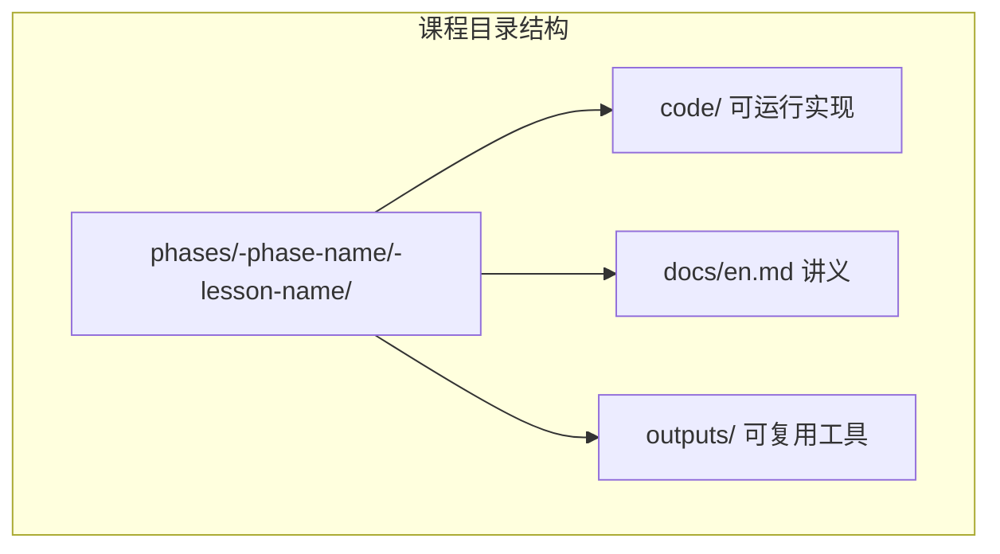
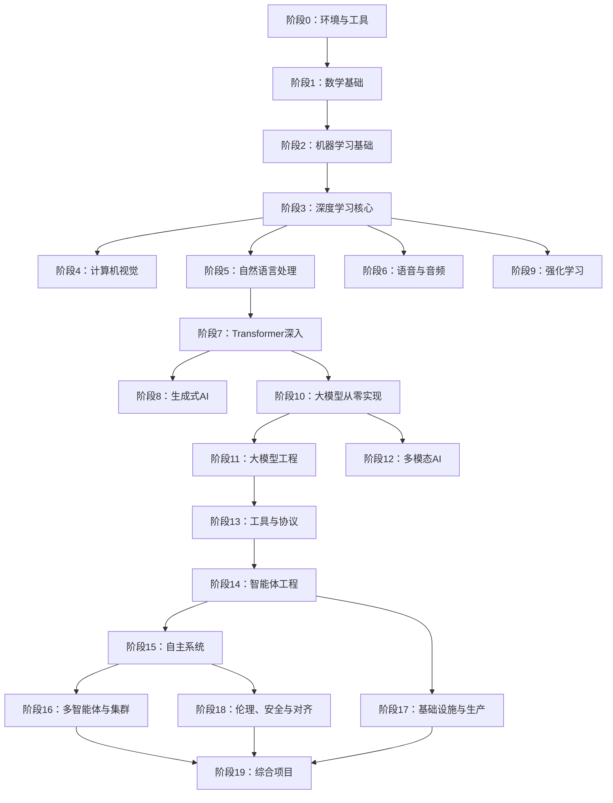
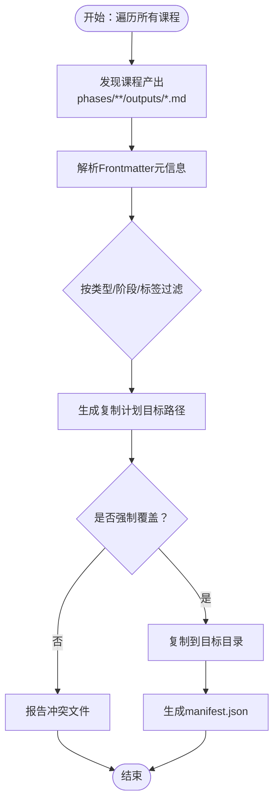
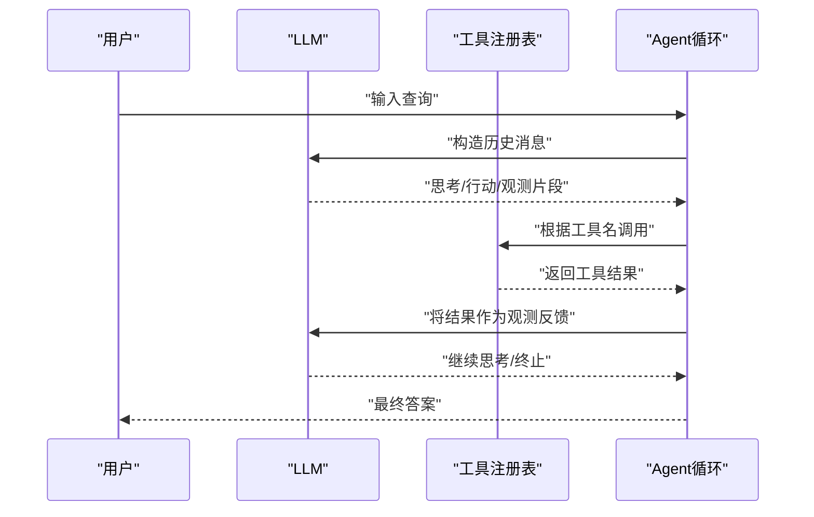
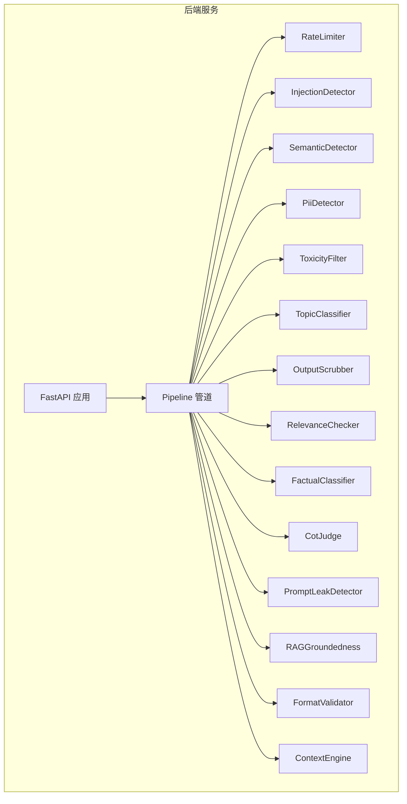

# 项目概述

<cite>
**本文引用的文件**
- [README.md](file://README.md)
- [ROADMAP.md](file://ROADMAP.md)
- [CONTRIBUTING.md](file://CONTRIBUTING.md)
- [LESSON_TEMPLATE.md](file://LESSON_TEMPLATE.md)
- [install_skills.py](file://scripts/install_skills.py)
- [index.json](file://outputs/index.json)
- [main.py](file://guardrails-sandbox/backend/main.py)
- [LICENSE](file://LICENSE)
- [CODE_OF_CONDUCT.md](file://CODE_OF_CONDUCT.md)
- [phases/14-agent-engineering/01-the-agent-loop/docs/en.md](file://phases/14-agent-engineering/01-the-agent-loop/docs/en.md)
- [phases/14-agent-engineering/01-the-agent-loop/outputs/skill-agent-loop.md](file://phases/14-agent-engineering/01-the-agent-loop/outputs/skill-agent-loop.md)
</cite>

## 目录
1. [引言](#引言)
2. [项目结构](#项目结构)
3. [核心组件](#核心组件)
4. [架构总览](#架构总览)
5. [详细组件分析](#详细组件分析)
6. [依赖关系分析](#依赖关系分析)
7. [性能考量](#性能考量)
8. [故障排查指南](#故障排查指南)
9. [结论](#结论)
10. [附录](#附录)

## 引言
本项目以“从零开始构建”为核心教学理念，系统性地覆盖从数学基础到高级AI系统的完整学习路径。项目目标是帮助学习者不仅“学会使用”，更要“理解原理”，通过亲手实现算法与系统，建立对现代AI技术的深度认知。项目提供503门课程，分为20个阶段，涵盖数学、机器学习、深度学习、计算机视觉、自然语言处理、语音音频、强化学习、大模型训练与工程、多模态、工具协议、智能体工程、自主系统、多智能体与集群、基础设施与生产、伦理安全与对齐，以及57个端到端的综合项目。

项目强调“可复用工具”的产出：每门课程结束时都会生成可直接使用的提示词、技能、智能体或MCP服务器，形成个人可迁移的知识资产。课程采用统一的“构建-使用-交付”流程，先手写实现，再用主流框架对照验证，最后沉淀为可安装的工具包。

开源方面，项目采用MIT许可证，鼓励社区贡献与二次开发；同时提供完整的贡献指南与行为准则，确保协作高效、包容。

**章节来源**
- [README.md:1-26](file://README.md#L1-L26)
- [README.md:31-112](file://README.md#L31-L112)
- [ROADMAP.md:1-10](file://ROADMAP.md#L1-L10)

## 项目结构
项目采用“阶段-课程”的层级化组织方式，每个课程包含以下标准结构：
- code/：可运行的实现（支持Python、TypeScript、Rust、Julia）
- docs/en.md：课程讲义（英文）
- outputs/：课程产出的提示词、技能、智能体或MCP服务器等可复用工具

课程遵循统一的六步流程：动机（MOTTO）→问题（PROBLEM）→概念（CONCEPT）→构建（BUILD IT）→使用（USE IT）→交付（SHIP IT），确保学习闭环与可迁移能力。

**图表来源**
- [LESSON_TEMPLATE.md:5-21](file://LESSON_TEMPLATE.md#L5-L21)

**章节来源**
- [LESSON_TEMPLATE.md:23-94](file://LESSON_TEMPLATE.md#L23-L94)
- [README.md:87-112](file://README.md#L87-L112)

## 核心组件
- 20个阶段的线性课程体系：从环境搭建、数学基础、机器学习、深度学习，到计算机视觉、NLP、语音音频、强化学习、大模型工程、多模态、工具协议、智能体工程、自主系统、多智能体与集群、基础设施与生产、伦理安全与对齐，最终到57个综合项目。
- 503门课程：总计约1050小时学习量，覆盖四门编程语言（Python、TypeScript、Rust、Julia），强调从底层原理到上层应用的贯通。
- 可复用工具交付：每门课程产出提示词、技能、智能体或MCP服务器，形成个人工具集；通过脚本批量安装与管理。
- 开源与社区：MIT许可，开放贡献流程，提供贡献指南、行为准则与模板。

**章节来源**
- [ROADMAP.md:7-10](file://ROADMAP.md#L7-L10)
- [README.md:161-184](file://README.md#L161-L184)
- [CONTRIBUTING.md:25-72](file://CONTRIBUTING.md#L25-L72)

## 架构总览
课程体系采用“阶段递进、课程标准化”的总体架构。阶段之间存在明确的前置依赖关系，确保学习顺序合理且知识衔接紧密。课程内部遵循“构建-使用-交付”的闭环，保证理论与实践结合。

**图表来源**
- [README.md:57-81](file://README.md#L57-L81)

**章节来源**
- [README.md:51-81](file://README.md#L51-L81)

## 详细组件分析

### 教学方法：“从零开始构建”
- 先手写实现：每门课程要求学员先从零实现核心算法或系统，确保对原理的透彻理解。
- 再框架对照：随后使用主流框架（如PyTorch、sklearn等）进行相同任务，比较实现差异，加深对框架内部机制的理解。
- 最后交付工具：将实现封装为可复用的提示词、技能、智能体或MCP服务器，便于在实际工作中直接使用。

该方法的优势在于：避免“只会调API”的浅层理解，培养“知其所以然”的工程能力。

**章节来源**
- [README.md:31-46](file://README.md#L31-L46)
- [README.md:89-112](file://README.md#L89-L112)

### 课程产出与工具生态
- 提示词（Prompts）：针对具体任务的专家级提示，可直接粘贴到任意AI助手。
- 技能（Skills）：可在Claude、Cursor、Codex、OpenClaw、Hermes等智能体中安装使用的技能包。
- 智能体（Agents）：可作为自主工作者部署，课程中已实现Agent Loop等核心循环。
- MCP服务器（Model Context Protocol Servers）：可接入任何MCP兼容客户端，课程中专门讲解MCP协议与实现。

项目提供安装脚本，支持按类型、阶段、标签筛选，将产出批量安装到目标目录，并生成清单文件，便于追踪与管理。

**图表来源**
- [install_skills.py:91-137](file://scripts/install_skills.py#L91-L137)
- [install_skills.py:174-192](file://scripts/install_skills.py#L174-L192)
- [install_skills.py:200-227](file://scripts/install_skills.py#L200-L227)

**章节来源**
- [README.md:161-184](file://README.md#L161-L184)
- [install_skills.py:1-292](file://scripts/install_skills.py#L1-L292)
- [index.json:1-2](file://outputs/index.json#L1-L2)

### 智能体工程：ReAct循环与工作流
以“智能体工程”阶段的“Agent Loop”为例，课程强调ReAct循环的三个核心部分：观察、思考、行动，并指出现代原生推理通道替代了早期的显式“思考令牌”。课程还明确了Agent Loop的五个必备要素：消息缓冲区、工具注册表、停止条件、步数预算、观测格式化器。

**图表来源**
- [phases/14-agent-engineering/01-the-agent-loop/docs/en.md:25-74](file://phases/14-agent-engineering/01-the-agent-loop/docs/en.md#L25-L74)

**章节来源**
- [phases/14-agent-engineering/01-the-agent-loop/docs/en.md:1-136](file://phases/14-agent-engineering/01-the-agent-loop/docs/en.md#L1-L136)
- [phases/14-agent-engineering/01-the-agent-loop/outputs/skill-agent-loop.md:1-34](file://phases/14-agent-engineering/01-the-agent-loop/outputs/skill-agent-loop.md#L1-L34)

### 安全与合规：守卫沙箱与MCP集成
项目提供“守卫沙箱”后端，内置多种适配器（限流、注入检测、语义检测、PII检测、毒性过滤、主题分类、输出清洗、相关性检查、事实分类、思维链评测、提示泄露检测、RAG一致性、格式校验、上下文引擎等），并通过管道（Pipeline）串联，支持输入/输出守卫、阻断历史统计、基准测试、MCP工具调用等功能。

**图表来源**
- [guardrails-sandbox/backend/main.py:24-58](file://guardrails-sandbox/backend/main.py#L24-L58)
- [guardrails-sandbox/backend/main.py:155-221](file://guardrails-sandbox/backend/main.py#L155-L221)

**章节来源**
- [guardrails-sandbox/backend/main.py:1-421](file://guardrails-sandbox/backend/main.py#L1-L421)

### 开源与社区贡献
- 许可证：MIT，允许自由使用、修改与分发。
- 贡献指南：规范课程结构、文档格式、输出产物命名与Frontmatter字段，确保网站解析稳定。
- 行为准则：倡导包容、尊重、建设性的社区文化。

**章节来源**
- [LICENSE:1-22](file://LICENSE#L1-L22)
- [CONTRIBUTING.md:1-24](file://CONTRIBUTING.md#L1-L24)
- [CODE_OF_CONDUCT.md:1-31](file://CODE_OF_CONDUCT.md#L1-L31)

## 依赖关系分析
- 阶段依赖：课程之间存在严格的前置依赖，确保学习顺序合理。例如，智能体工程需要大模型工程与工具协议的基础。
- 课程内依赖：每门课程的“构建-使用-交付”流程相互依赖，构建阶段的实现为使用阶段提供对照，交付阶段的产物服务于后续课程与项目。
- 工具依赖：安装脚本依赖课程产出的Frontmatter元信息，用于筛选与归档；输出索引文件用于快速检索与汇总。

**图表来源**
- [README.md:89-112](file://README.md#L89-L112)
- [install_skills.py:91-137](file://scripts/install_skills.py#L91-L137)
- [index.json:1-2](file://outputs/index.json#L1-L2)

**章节来源**
- [README.md:87-112](file://README.md#L87-L112)
- [install_skills.py:1-292](file://scripts/install_skills.py#L1-L292)

## 性能考量
- 学习效率：课程总数与阶段数量庞大，建议按“定位-跳转-复习”的策略进行个性化学习，减少无效重复。
- 实践成本：课程强调“从零构建”，需准备合适的开发环境与计算资源（CPU/GPU/云），并掌握容器化与调试技巧。
- 工具复用：通过安装脚本批量管理可复用工具，降低重复劳动，提升工程效率。
- 生产实践：基础设施与生产阶段涵盖推理平台经济学、量化、批处理API、模型路由、可观测性、安全与合规等主题，为工程落地提供参考。

[本节为通用指导，不直接分析具体文件]

## 故障排查指南
- 安装冲突：当目标目录存在同名文件时，安装脚本会报告冲突并阻止覆盖，可通过强制选项解决或调整布局。
- 课程缺失：若某门课程尚未完成，可在路线图中查看状态（完成/进行中/计划），并选择其他课程作为补充。
- 前置不足：若遇到难以理解的课程，回溯到前置阶段（如数学基础、机器学习基础）进行补强。
- 社区支持：遵守行为准则，通过Pull Request提交修复或改进，参与讨论与评审。

**章节来源**
- [install_skills.py:245-263](file://scripts/install_skills.py#L245-L263)
- [ROADMAP.md:11-617](file://ROADMAP.md#L11-L617)
- [CONTRIBUTING.md:136-164](file://CONTRIBUTING.md#L136-L164)

## 结论
本项目以“从零开始构建”为核心理念，通过系统化的20个阶段与503门课程，将AI从底层数学到上层工程的全栈知识串联起来。每门课程都强调手写实现、框架对照与工具交付，确保学习者不仅“会用”，更能“懂原理、可迁移、可复用”。开源与社区贡献机制进一步增强了项目的可持续性与影响力。建议学习者结合自身背景，利用“定位-跳转-复习”策略，按阶段推进，逐步构建属于自己的AI工具集与工程能力。

[本节为总结性内容，不直接分析具体文件]

## 附录
- 课程模板与规范：提供标准的课程结构、文档格式与输出产物命名规则，确保一致性与可维护性。
- 路线图与进度：提供详细的阶段与课程状态，帮助学习者规划学习路径与时间投入。

**章节来源**
- [LESSON_TEMPLATE.md:1-134](file://LESSON_TEMPLATE.md#L1-L134)
- [ROADMAP.md:1-617](file://ROADMAP.md#L1-L617)