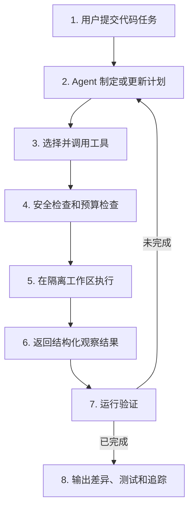
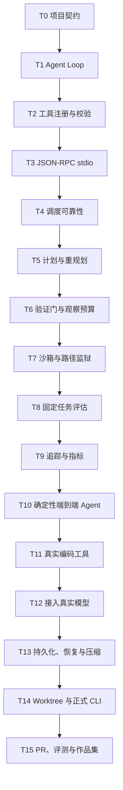

# Terminal Coding Agent 项目驱动学习总纲

> 目标：用一个可运行、可测试、可解释的终端编码 Agent，串起 Agent 工程师面试所需的核心知识。主干保持稳定，后续专题只作为枝丫挂接到明确的主干里程碑。

**状态：** T0.5 `validate_request()` 已讲完并暂停；下次从 T0.6 `FakeCodingAgent.run()` 继续  
**主项目目录：** `projects/terminal-coding-agent/`  
**参考实现：** `phases/19-capstone-projects/01-terminal-native-coding-agent/`  
**基础课程：** `phases/19-capstone-projects/20-*` 至 `29-*`  
**主干预计：** 约 33.5 小时  
**Python 预备：** 约 4–6 小时，不改变 T0–T15 主干编号  
**第一个端到端版本：** 约 16 小时后完成

## 一、这份计划怎么用

1. 本文是长期维护的知识地图，不是一次性任务清单。
2. `T0` 到 `T15` 是 Agent 主干，编号和依赖顺序保持稳定；`P0.1–P0.8` 是 Python 初学者预备阶段。
3. 每次只推进一个 30–60 分钟学习单元；90 分钟里程碑拆成上下两次完成。
4. 每个里程碑都必须留下可运行代码、测试、学习记录和一段面试回答。
5. 枝丫必须挂到已完成的主干节点，不能抢在主干前面学习。
6. 新技术出现时，优先替换枝丫中的实现，不轻易改动主干契约。
7. 教师负责解释、拆步、示范和验收；学习者负责关键设计判断和核心代码，不能只看完整答案。
8. 每个小节讲完后暂停，只有学习者明确说“继续”才进入下一小节。

## 二、最终要做成什么

输入一个本地 Git 仓库和自然语言任务，Agent 能够：

1. 理解任务并生成可执行计划。
2. 搜索、读取和修改代码。
3. 运行测试并读取失败信息。
4. 根据观察结果继续、重试、重新规划或停止。
5. 对工具参数、目录范围、执行时间和输出大小进行限制。
6. 在独立 worktree 中工作，不污染用户当前分支。
7. 在进程中断后恢复计划和执行状态。
8. 记录工具调用、模型消耗、失败原因和完整追踪。
9. 用固定任务集衡量通过率、延迟和成本。
10. 最终输出代码差异、测试结果、追踪包，并可选创建 PR。

## 三、先看完整流程

面试时先按这八步从上到下讲，再展开某一层。不要一上来就讲框架名。

## 四、系统分层

| 层 | 负责什么 | 主干节点 |
|---|---|---|
| 入口层 | 接收仓库、任务、配置和中断信号 | T0、T14 |
| 控制层 | Agent Loop、计划、执行、观察、恢复 | T1、T5、T10 |
| 模型层 | 屏蔽模型供应商差异，产生结构化决策 | T12 |
| 工具层 | 注册、校验、调度 read/edit/search/test/git | T2、T3、T4、T11 |
| 安全层 | 白名单、路径监狱、超时、输出和权限限制 | T6、T7、T14 |
| 状态层 | 计划、消息、检查点、上下文压缩和恢复 | T13 |
| 质量层 | 验证、固定任务评估、追踪、指标和成本 | T8、T9、T15 |

## 五、主干依赖图

## 六、阶段总览

| 阶段 | 里程碑 | 阶段结果 | 时间 |
|---|---|---|---:|
| P. Python 预备 | P0.1–P0.8 | 能阅读并修改 T0 所需的最小 Python 语法 | 4–6 小时 |
| A. 定义边界 | T0 | 确定项目契约、目录和验收方式 | 1 小时 |
| B. 手写内核 | T1–T4 | 不依赖模型也能运行的 Agent 工程内核 | 6 小时 |
| C. 控制与安全 | T5–T7 | 可重规划、可限制、可安全执行 | 4.5 小时 |
| D. 质量闭环 | T8–T10 | 可评估、可观测的确定性端到端 Agent | 4.5 小时 |
| E. 真实编码能力 | T11–T13 | 能调用真实模型处理真实仓库并恢复 | 9 小时 |
| F. 生产化交付 | T14–T15 | 隔离运行、输出 PR、形成面试作品集 | 8.5 小时 |
| **合计** | **T0–T15** | **完整主干** | **约 33.5 小时** |

## 七、Python 预备阶段

P0 不单独学习一整套 Python，只补当前 Agent 项目需要的语法：

1. **P0.1：** Python 文件、从上到下执行、变量、字符串和 `print()`。
2. **P0.2：** 布尔值、比较、`if/else` 和缩进。
3. **P0.3：** 函数、参数、`return` 和局部变量。
4. **P0.4：** 列表、字典、循环和结构化数据。
5. **P0.5：** 类、对象、`self` 和 `dataclass`。
6. **P0.6：** `Enum` 和受限状态值。
7. **P0.7：** 自定义异常、`raise`、`try/except` 和模块导入。
8. **P0.8：** `unittest`、断言和异常测试。

每个小节直接使用 Terminal Coding Agent 中的任务、状态或错误场景练习。P0.8 完成后返回 T0，不另起无关项目。

## 八、主干里程碑

### T0 项目契约与最小骨架

#### T0 内部学习路线

1. **T0.1 输入契约 `TaskRequest`：** 任务编号、仓库路径和任务目标；理解 `dataclass(frozen=True)` 与 `Path`。
2. **T0.2 状态与输出契约：** `TaskStatus`、`TaskResult`、`None` 和 `to_dict()`。
3. **T0.3 结构化错误：** `ErrorCode`、`AgentError`、`retryable` 和 `details`。
4. **T0.4 结果一致性：** 使用 `__post_init__` 阻止“成功但带错误”等矛盾结果。
5. **T0.5 请求校验：** `validate_request()` 依次检查任务编号、目标和仓库目录。
6. **T0.6 假 Agent：** `FakeCodingAgent.run()` 如何连接输入校验与统一结果。
7. **T0.7 CLI 边界：** `argparse`、JSON 序列化以及成功/失败退出码。
8. **T0.8 契约测试与验收：** 运行 8 个测试，回顾完整数据流和面试表达。

- **目标：** 冻结输入、输出、状态、错误和目录结构，建立只能运行假策略的空骨架。
- **为什么：** 后续所有枝丫都要依赖稳定接口，否则每接一个模型或工具都要重写系统。
- **前置知识：** Python 基础、类型提示、单元测试、Git 基础。
- **学习者负责：** 定义一次任务的输入、成功结果、失败结果和停止条件。
- **教师负责：** 解释架构全貌，搭建最小目录和测试入口，避免提前加入复杂功能。
- **交付物：** 项目 README、类型契约、空 Agent、第一组契约测试。
- **验收：** 假任务可启动并确定性退出；非法输入返回结构化错误；测试命令退出 0。
- **关联课程：** Phase 19 综合项目 01；Phase 14 第 01 课。
- **面试要点：** “先冻结 Harness 与工具的契约，再选择模型和框架。”
- **可挂枝丫：** 配置文件格式、TypeScript 版本。
- **时间：** 1 小时。

### T1 Agent Harness Loop

- **目标：** 手写 `PLAN -> ACT -> OBSERVE -> VERIFY -> DONE/PAUSE` 状态机。
- **为什么：** Agent 的核心不是模型调用，而是模型外部那个能控制状态、预算和停止条件的循环。
- **前置知识：** T0；已学过 Agent Loop、LangGraph 状态流转。
- **学习者负责：** 画状态转移并实现一个关键转换。
- **教师负责：** 解释拉取点、生命周期事件、轮次预算和暂停语义。
- **交付物：** 可注入假策略的 Harness、事件流、轮次/时间预算测试。
- **验收：** 正常完成、预算暂停、策略错误三条路径都能确定性复现。
- **关联课程：** Phase 19 第 20 课。
- **面试要点：** “模型负责提出下一步，Harness 负责决定这一步是否以及如何发生。”
- **可挂枝丫：** LangGraph 实现、生命周期 Hook 系统。
- **时间：** 1.5 小时。

### T2 工具注册表与参数校验

- **目标：** 建立 `工具名 -> 参数模式 -> 处理器` 注册表和 JSON Schema 子集校验器。
- **为什么：** 模型输出是不可信输入；如果工具参数无法验证，执行层就没有可靠边界。
- **前置知识：** T1；字典、数据类、递归数据结构。
- **学习者负责：** 设计一个工具定义并实现一个校验规则。
- **教师负责：** 解释工具描述、参数模式、精确错误路径和重复注册风险。
- **交付物：** ToolSpec、Registry、Validator、错误信封。
- **验收：** 未知工具、缺少字段、类型错误、额外字段和重复注册均有测试。
- **关联课程：** Phase 19 第 21 课；Phase 14 工具调用课程。
- **面试要点：** “Schema 既是模型的说明书，也是运行时的安全边界。”
- **可挂枝丫：** 完整 JSON Schema、动态插件发现。
- **时间：** 1.5 小时。

### T3 JSON-RPC 2.0 over stdio

- **目标：** 手写请求、响应、通知、批处理和标准错误映射。
- **为什么：** 将 Harness 与工具进程解耦，理解 MCP 等协议底层在解决什么问题。
- **前置知识：** T2；JSON、stdin/stdout、进程通信基础。
- **学习者负责：** 实现请求与通知的区分以及一个错误映射。
- **教师负责：** 解释关联 ID、通知不返回响应、流污染和传输边界。
- **交付物：** stdio Client/Server、JSON-RPC 错误模型、自终止演示。
- **验收：** 损坏的一行不会阻塞后续请求；通知不产生响应；响应 ID 正确匹配。
- **关联课程：** Phase 19 第 22 课；Phase 13 工具与协议。
- **面试要点：** “协议负责消息形状，注册表负责工具形状，二者不应混成一层。”
- **可挂枝丫：** MCP stdio、Streamable HTTP、取消通知。
- **时间：** 1.5 小时。

### T4 工具调用调度器

- **目标：** 集中实现超时、错误归一化、有限重试、幂等和并发上限。
- **为什么：** 可靠性策略散落在每个工具里会产生不一致行为和重复副作用。
- **前置知识：** T3；异常、并发、退避和幂等概念。
- **学习者负责：** 对错误分类并决定哪些错误能重试。
- **教师负责：** 连接之前学过的 Actor、邮箱、DLQ、异步完成和幂等知识。
- **交付物：** Dispatcher、统一 ToolResult、RetryPolicy、IdempotencyStore。
- **验收：** 临时错误退避重试；永久错误不重试；慢调用超时；相同幂等键不重复执行。
- **关联课程：** Phase 19 第 23 课；现有 learning-records 0001–0004。
- **面试要点：** “DLQ 保存待处置失败，重试策略处理临时失败，两者不是同一个队列。”
- **可挂枝丫：** Actor Runtime、异步任务队列、DLQ 管理台。
- **时间：** 1.5 小时。

### T5 Plan / Execute / Replan

- **目标：** 把任务拆成类型化步骤，执行失败后基于观察更新剩余计划。
- **为什么：** 固定脚本只能执行预设路径；Agent 必须能够根据环境反馈调整动作。
- **前置知识：** T4；状态机、计划和执行的区别。
- **学习者负责：** 定义 PlanStep、状态和重新规划触发条件。
- **教师负责：** 解释计划差异、游标、硬预算，以及为什么计划不是思维链。
- **交付物：** Planner 接口、Executor、PlanDiff、重规划预算。
- **验收：** 步骤成功按序推进；受控失败触发重规划；超过重规划次数停止。
- **关联课程：** Phase 19 第 24 课；Phase 14 ReWOO、HTN、LangGraph。
- **面试要点：** “计划是可审计的执行状态，不需要保存模型的私有推理过程。”
- **可挂枝丫：** 人工审批、LangGraph、HTN、并行计划、Reviewer Agent。
- **时间：** 1.5 小时。

### T6 验证门与观察预算

- **目标：** 在工具执行前串联白名单、参数、预算和新鲜度检查，并限制模型看到的输出。
- **为什么：** 允许调用不等于允许无限执行；工具结果也可能撑爆上下文或污染后续判断。
- **前置知识：** T5；短路逻辑、token/字符预算。
- **学习者负责：** 决定门的顺序和拒绝原因格式。
- **教师负责：** 区分执行权限、观察权限和最终结果验证。
- **交付物：** GateChain、GateDecision、ObservationLedger。
- **验收：** 最便宜的门先执行；拒绝不触发工具；累计观察超限后停止继续读取。
- **关联课程：** Phase 19 第 25 课；Phase 14 验证门与作用域契约。
- **面试要点：** “安全检查发生在执行前，结果验证发生在执行后，观察预算控制模型能看到多少。”
- **可挂枝丫：** 人工授权、策略配置、敏感信息脱敏。
- **时间：** 1.5 小时。

### T7 沙箱运行器与路径监狱

- **目标：** 限制可执行命令、文件路径、执行时间、输出大小和 shell 模式。
- **为什么：** 模型生成的命令不能直接获得宿主机的无限权限。
- **前置知识：** T6；子进程、路径解析、退出码。
- **学习者负责：** 编写越界路径和危险命令测试。
- **教师负责：** 解释路径监狱与真正 OS/容器沙箱的边界，避免虚假安全感。
- **交付物：** SandboxRunner、PathJail、结构化 SandboxResult。
- **验收：** 根目录外路径被拒绝；超时进程被终止；输出被截断；正常测试命令可运行。
- **关联课程：** Phase 19 第 26 课；Phase 17 隔离与生产基础设施。
- **面试要点：** “应用层 denylist 只是第一层，生产环境还需要容器、权限和网络隔离。”
- **可挂枝丫：** Docker/devcontainer、E2B、网络策略、macOS/Linux 权限模型。
- **时间：** 1.5 小时。

### T8 固定任务评估框架

- **目标：** 用固定仓库任务、确定性验证器和结构化报告衡量 Agent。
- **为什么：** “Agent 说完成了”不能作为成功标准，提示或模型升级也不能靠主观感觉评估。
- **前置知识：** T7；测试夹具、统计基础。
- **学习者负责：** 设计两个任务和它们的成功判定。
- **教师负责：** 解释 pass@1、pass@k、保留集、方差、延迟和成本指标。
- **交付物：** FixtureTask、VerifierRegistry、EvalHarness、JSON 报告。
- **验收：** 每次加载相同任务；验证器不依赖模型自述；报告包含通过率、延迟和成本。
- **关联课程：** Phase 19 第 27 课；Phase 14 评估驱动开发、SWE-bench。
- **面试要点：** “先固定任务和验证器，再比较提示、模型或框架。”
- **可挂枝丫：** SWE-bench 子集、回归看板、模型 A/B 测试。
- **时间：** 1.5 小时。

### T9 OpenTelemetry 追踪与指标

- **目标：** 为会话、模型调用、工具调用和验证决策建立 trace/span，并记录 token、成本和延迟。
- **为什么：** Agent 是多轮分布式执行过程，普通聊天日志无法回答失败发生在哪一步。
- **前置知识：** T8；结构化日志、上下文管理器。
- **学习者负责：** 设计一次工具调用需要记录的最小字段。
- **教师负责：** 解释 trace、span、parent、事件和指标的区别。
- **交付物：** JSONL Exporter、SpanBuilder、MetricsRegistry、追踪样例。
- **验收：** 每个工具调用恰好一个 span；异常写入错误状态；token 和延迟可聚合。
- **关联课程：** Phase 19 第 28 课；OpenTelemetry GenAI 语义约定。
- **面试要点：** “Trace 回答一次任务发生了什么，Metric 回答一批任务整体表现如何。”
- **可挂枝丫：** OTel SDK、OTLP、Langfuse、Grafana。
- **时间：** 1.5 小时。

### T10 确定性端到端 Coding Agent

- **目标：** 用确定性策略串起计划、门、沙箱、工具、观察、验证、评估和追踪。
- **为什么：** 先排除模型随机性，才能验证 Harness 的各个接缝是否正确。
- **前置知识：** T1–T9。
- **学习者负责：** 实现策略中的一个状态和端到端失败分析。
- **教师负责：** 组织集成顺序，定位跨模块错误，带做第一次系统复盘。
- **交付物：** 能修复固定 Python Bug 的完整本地 Agent。
- **验收：** 在步骤预算内修复任务；测试通过；无非法工具；每步都有 trace；评估计为通过。
- **关联课程：** Phase 19 第 29 课。
- **面试要点：** “确定性策略与 LLM 共用同一 Harness 契约，因此能先测试框架，再替换决策器。”
- **可挂枝丫：** AutoGen/LangGraph 对照实现、多人审批演示。
- **时间：** 1.5 小时。

> 完成 T10 后得到第一个真正端到端版本。它还不聪明，但工程链路已经闭合。

### T11 真实编码工具表面

- **目标：** 实现可用于真实仓库的 `read_file`、`edit_file`、`ripgrep`、`run_tests` 和受限 `git`。
- **为什么：** 编码 Agent 的效果很大程度由工具的粒度、输出格式和失败语义决定。
- **前置知识：** T10；文件系统、diff、Git、测试命令。
- **学习者负责：** 定义每个工具的输入、输出和边界，完成至少两个核心工具。
- **教师负责：** 示范结构化结果、diff 预览、搜索截断和测试结果摘要。
- **交付物：** 五个真实工具、共享 ToolResult、集成测试仓库。
- **验收：** 所有路径受限；编辑前后可生成 diff；搜索和测试大输出可截断且保留关键信息。
- **关联课程：** Phase 13 工具系统；综合项目 01 的工具表面。
- **面试要点：** “工具应返回供模型决策的结构化观察，而不是把整段 stdout 原样塞回上下文。”
- **可挂枝丫：** tree-sitter、语义代码搜索、LSP、更多语言测试器。
- **时间：** 3 小时。

### T12 模型适配器与真实 Tool Calling

- **目标：** 定义与供应商无关的 ModelAdapter，并接入一个真实模型完成工具调用循环。
- **为什么：** Harness 不应被某个模型 SDK 的消息格式、tool call 形状或流式事件绑死。
- **前置知识：** T11；LLM 消息、结构化输出、函数调用。
- **学习者负责：** 将供应商响应转换为统一的 ModelDecision。
- **教师负责：** 解释 system/user/tool 消息、调用 ID、停止原因、重试和成本记账。
- **交付物：** FakeModelAdapter、一个真实 ProviderAdapter、录制响应测试。
- **验收：** 假模型测试离线通过；真实模型能搜索、读取、编辑并验证一个小任务；API 错误不会破坏状态。
- **关联课程：** Phase 11 函数调用；Phase 14 模型路由与 Agent Loop。
- **面试要点：** “把供应商差异收敛到 Adapter，Harness 只依赖统一决策协议。”
- **可挂枝丫：** OpenAI、Anthropic、Gemini、本地 vLLM、多模型路由。
- **时间：** 3 小时。

### T13 持久化、崩溃恢复与上下文压缩

- **目标：** 原子保存计划、步骤、观察和预算，在中断后恢复；超出上下文阈值时压缩旧观察。
- **为什么：** 长任务一定会遇到进程退出、网络失败和上下文增长，不能从头再跑或无限堆消息。
- **前置知识：** T12；序列化、检查点、消息历史。
- **学习者负责：** 决定哪些状态必须持久化，哪些状态可以重建。
- **教师负责：** 解释事件日志与快照、恢复幂等、压缩前后不变量和信息丢失风险。
- **交付物：** StateStore、Checkpoint、Resume、ContextCompactor。
- **验收：** 任意步骤后强制退出可继续；已成功副作用不重复；压缩后保留当前计划、关键错误和文件引用。
- **关联课程：** Phase 14 记忆、LangGraph checkpoint、Agent 状态管理。
- **面试要点：** “恢复不仅是加载聊天记录，还要恢复计划游标、预算和已执行副作用。”
- **可挂枝丫：** SQLite 事件存储、长期记忆、跨会话技能库。
- **时间：** 3 小时。

### T14 Git Worktree 隔离与正式 CLI

- **目标：** 每个任务创建独立 worktree，提供稳定 CLI、取消、状态显示和清理流程。
- **为什么：** 真实编码 Agent 必须与用户当前工作区隔离，并能处理中断和残留资源。
- **前置知识：** T13；Git 分支/worktree、信号处理。
- **学习者负责：** 定义任务生命周期和成功/失败时的清理规则。
- **教师负责：** 解释隔离边界、Ctrl-C、孤儿任务、清理失败和恢复入口。
- **交付物：** `agent run/status/resume/clean` CLI、WorktreeManager。
- **验收：** 原分支不被修改；中断后状态可查；恢复继续同一 worktree；清理不删除用户目录。
- **关联课程：** 综合项目 01；Phase 17 生产基础设施。
- **面试要点：** “Worktree 隔离 Git 状态，容器隔离操作系统权限，两者解决的问题不同。”
- **可挂枝丫：** Ink/Textual TUI、容器沙箱、远程任务队列。
- **时间：** 3.5 小时。

### T15 PR 输出、最终评测与作品集

- **目标：** 生成最终差异摘要、测试证据、追踪包和评估报告，并可选推送分支、创建 PR。
- **为什么：** 面试作品需要证明系统能交付结果、解释失败并量化效果，而不只是展示一次成功 Demo。
- **前置知识：** T14；GitHub 工作流、评估和技术表达。
- **学习者负责：** 运行保留任务集，分析三个失败案例，完成架构讲解。
- **教师负责：** 补齐测试、威胁模型、成本分析、README 和面试追问。
- **交付物：** 可演示 CLI、架构图、评估报告、trace 样例、失败复盘、项目 README、面试题库。
- **验收：** 保留任务集可重复运行；报告包含成功率、延迟、成本；三类失败有根因；2–3 分钟可讲清系统。
- **关联课程：** 综合项目 01；Phase 14/17 的评估、部署、可观测性与安全课程。
- **面试要点：** “先讲契约和故障边界，再讲模型效果；能复现和解释失败才算可生产化。”
- **可挂枝丫：** GitHub Issue-to-PR、Reviewer Agent、云端队列、公开基准。
- **时间：** 5 小时。

## 九、枝丫登记表

枝丫不要求全部完成。根据目标岗位 JD 选择，完成主干后再深入。

| 枝丫 | 挂接点 | 延伸内容 | 预计时间 | 适合的面试方向 |
|---|---|---|---:|---|
| B1 多模型供应商 | T12 | Anthropic、Gemini、本地 vLLM、路由与降级 | 每个 2–4 小时 | 模型平台、成本优化 |
| B2 MCP | T3、T11 | MCP stdio、能力协商、Streamable HTTP | 4–6 小时 | Tool/MCP 平台 |
| B3 Actor 并发运行时 | T4 | 邮箱、隔离、请求回复、并发工具执行、DLQ | 3–5 小时 | 分布式 Agent |
| B4 高级规划 | T5 | LangGraph、人工审批、HTN、并行计划 | 4–6 小时 | 工作流编排 |
| B5 多 Agent 审查 | T10、T15 | Planner/Coder/Reviewer、终止和冲突处理 | 4–8 小时 | Multi-Agent |
| B6 长期记忆 | T13 | 事件存储、摘要、检索、技能库 | 4–6 小时 | Memory/Context |
| B7 强沙箱 | T7、T14 | 容器、网络隔离、权限授权、E2B/Daytona | 6–10 小时 | 安全、基础设施 |
| B8 代码智能 | T11 | tree-sitter、LSP、语义搜索、依赖图 | 4–8 小时 | Coding Agent |
| B9 生产可观测性 | T9 | OTel SDK、OTLP、Langfuse、告警 | 3–5 小时 | Agent 平台/SRE |
| B10 大型评测 | T8、T15 | SWE-bench 子集、A/B、回归和成本曲线 | 8–20 小时 | Eval/研究工程 |
| B11 TUI | T14 | 流式工具日志、计划面板、预算和取消 | 5–8 小时 | 开发者工具 |
| B12 Issue-to-PR | T15 | Webhook、任务队列、GitHub App、PR 回写 | 5–8 小时 | 自主软件工程 |

### 新增枝丫的规则

新增任何专题时，先写清楚：

1. 它解决的具体问题是什么。
2. 它挂接到哪个已完成的 `T` 节点。
3. 它复用哪个稳定接口。
4. 它是否改变默认主流程。
5. 它新增哪些测试和面试能力。

如果必须重写三个以上已完成主干节点，说明它不是枝丫，而是新的主项目。

## 十、知识覆盖地图

| 面试主题 | 主干覆盖 | 完成标准 |
|---|---|---|
| Agent Loop | T1、T10 | 能画出状态流转并解释停止条件 |
| Tool Calling | T2–T4、T11 | 能解释 schema、调度、错误和幂等 |
| MCP/协议 | T3 | 能区分协议、传输、工具注册表 |
| Planning | T5 | 能区分固定工作流、计划与重规划 |
| Reliability | T4、T13 | 能解释重试、DLQ、恢复和副作用 |
| Safety | T6、T7、T14 | 能分层解释校验、路径监狱、容器与权限 |
| Memory/Context | T13 | 能解释检查点、压缩和长期记忆边界 |
| Evaluation | T8、T15 | 能设计固定任务、验证器和指标 |
| Observability | T9、T15 | 能区分日志、trace、metric 和成本记账 |
| Multi-Agent | T4 基础，B5 深入 | 能说明何时值得拆 Agent，何时只是增加复杂度 |
| 框架选型 | T5、T10、T12 | 能比较自研 Harness、LangGraph、Actor Model |
| 生产系统设计 | T13–T15 | 能回答隔离、恢复、扩缩容、权限和成本问题 |

## 十一、每次学习的固定节奏

每次控制在 30–60 分钟：

1. **5 分钟：** 回忆上一步，不看答案说出输入、输出和故障边界。
2. **10 分钟：** 从总流程图定位今天只改哪一层，解释必要术语。
3. **25–35 分钟：** 学习者完成一个关键判断或核心代码，教师实时引导。
4. **10 分钟：** 运行测试，故意制造一个失败并定位原因。
5. **5 分钟：** 用面试语言复述，更新学习记录和主干进度。

不会采用两种极端方式：一次性贴出整个项目，也不会把每个小概念拆成无休止的问答。

## 十二、阶段验收点

| 验收点 | 完成节点 | 此时已经具备的能力 |
|---|---|---|
| G1 工程内核 | T4 | 手写 Agent Loop、工具协议和可靠调度 |
| G2 端到端 MVP | T10 | 用确定性策略修复固定代码任务，并完整验证和追踪 |
| G3 真实 Agent | T13 | 接入真实模型处理真实工具，支持中断恢复和压缩 |
| G4 面试作品 | T15 | 隔离运行、量化评测、交付差异/PR，并能系统讲解 |

## 十三、项目级 Definition of Done

只有同时满足以下条件，主干才算毕业：

- 给定仓库和任务，Agent 能完成至少一种真实代码修改并通过测试。
- 所有工具输入都有校验，所有执行都有超时和结构化结果。
- 文件操作不能越过任务工作区，危险操作有明确拒绝记录。
- 模型或进程失败后能够从检查点恢复，已完成副作用不会重复执行。
- 每次运行都有 trace ID；模型、工具、门和验证步骤均可追踪。
- 固定任务集可重复运行，报告成功率、延迟、token 和成本。
- 原始 Git 工作区不被 Agent 直接修改。
- README 能说明架构、运行方式、限制、评测结果和安全边界。
- 学习者能在 2–3 分钟内回答“请设计一个 Coding Agent”。

## 十四、主要风险与处理方式

| 风险 | 处理方式 |
|---|---|
| 一开始就接真实模型，问题无法定位 | T1–T10 全部使用确定性 Fake/Policy |
| 沉迷框架 API，原理仍然是黑箱 | 主干先手写契约，框架只作为枝丫映射 |
| 工具输出过大导致上下文失控 | T6 观察预算、T11 截断摘要、T13 压缩 |
| 把路径检查误认为真正沙箱 | T7 明确能力边界，T14/B7 再加隔离层 |
| 只做成功 Demo，没有客观效果 | T8 先建评估，T15 使用保留任务集 |
| 分支专题太多导致主线再次断裂 | 未完成当前验收点前不启动枝丫 |
| 会写代码但面试讲不清 | 每个 T 节点强制生成一段面试回答和一次追问 |

## 十五、时间预期

- **每周 5 小时：** 主干约 7 周。
- **每周 10 小时：** 主干约 3–4 周。
- **每天 2 小时：** 主干约 17–20 天。
- **逐项深挖全部枝丫：** 额外约 55–90 小时，不建议面试前全部完成。
- **面试冲刺优先级：** 先完成 T0–T15，再按目标岗位选择 2–3 个枝丫。

## 十六、作品集最终材料

1. 可运行的 Terminal Coding Agent 源码和测试。
2. 一张从任务输入到验证输出的架构图。
3. 一份安全边界和威胁模型。
4. 一份固定任务评估报告。
5. 一次完整运行的 trace 样例。
6. 三个失败案例复盘：工具失败、模型误判、上下文/预算失败。
7. 10 个项目相关面试题及个人回答。
8. 一段 2–3 分钟项目介绍和一段 10 分钟系统设计展开。

## 十七、下一步

先完成 `P0.1–P0.6`，再回到 `T0` 的理解验收，随后进入 `T1 Agent Harness Loop`。不会提前接入模型或工具系统。

## 修订记录

| 日期 | 版本 | 说明 |
|---|---|---|
| 2026-07-22 | v0.1 | 建立 T0–T15 稳定主干和 B1–B12 枝丫挂接表 |
| 2026-07-22 | v0.2 | T0 契约、假 Agent、CLI 和契约测试实现完成 |
| 2026-07-22 | v0.3 | 根据 Python 初学者基础增加 P0.1–P0.6 预备阶段 |
| 2026-07-23 | v0.4 | 按实际练习拆分为 P0.1–P0.8，明确 P0.7 为异常处理 |
| 2026-07-23 | v0.5 | 增加 T0.1–T0.8 内部学习路线 |
