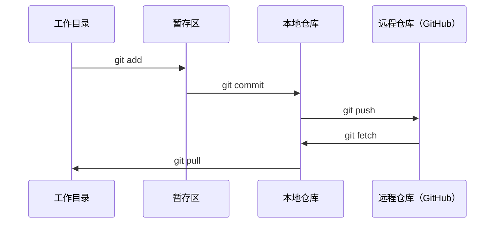

# Git 与协作

> 版本控制不可选。你在这里构建的每个实验、每个模型、每节课都会被追踪。

**Type:** Learn
**Languages:** --
**Prerequisites:** Phase 0, Lesson 01
**Time:** ~30 分钟

## 学习目标

- 配置 git 身份标识，使用 add、commit 和 push 的日常工作流
- 创建和合并分支，在不破坏主分支的情况下进行独立实验
- 编写 `.gitignore`，排除模型检查点和大尺寸二进制文件
- 使用 `git log` 浏览提交历史，理解项目演进过程

## 问题所在

你将在 20 个阶段中编写数百个代码文件。没有版本控制，你会丢失工作成果、破坏无法撤销的内容，并且无法与他人协作。

Git 是工具。GitHub 是代码存放的地方。本节课只覆盖本课程所需的内容，不多不少。

## 核心概念



需要记住三点：
1. 经常保存（`git commit`）
2. 推送到远程（`git push`）
3. 创建分支做实验（`git checkout -b experiment`）

## 动手操作

### 步骤 1：配置 git

```bash
git config --global user.name "你的名字"
git config --global user.email "you@example.com"
```

### 步骤 2：日常工作流

```bash
git status
git add file.py
git commit -m "添加感知机实现"
git push origin main
```

### 步骤 3：创建实验分支

```bash
git checkout -b experiment/new-optimizer

# ... 做修改、提交 ...

git checkout main
git merge experiment/new-optimizer
```

### 步骤 4：与本课程仓库协作

```bash
git clone https://github.com/rohitg00/ai-engineering-from-scratch.git
cd ai-engineering-from-scratch

git checkout -b my-progress
# 学习课程，提交你的代码
git push origin my-progress
```

## 使用方式

在本课程中，你只需要以下命令：

| 命令 | 使用时机 |
|---------|------|
| `git clone` | 获取课程仓库 |
| `git add` + `git commit` | 保存你的工作 |
| `git push` | 备份到 GitHub |
| `git checkout -b` | 尝试新功能而不破坏主分支 |
| `git log --oneline` | 查看已完成的工作 |

仅此而已。本课程不需要 rebase、cherry-pick 或 submodule。

## 练习

1. 克隆本仓库，创建一个名为 `my-progress` 的分支，创建一个文件，提交并推送
2. 创建一个 `.gitignore`，排除模型检查点文件（`.pt`、`.pth`、`.safetensors`）
3. 使用 `git log --oneline` 查看本仓库的提交历史，了解课程是如何添加的

## 关键术语

| 术语 | 大家说的 | 实际含义 |
|------|----------------|----------------------|
| Commit | "保存" | 整个项目在某个时间点的快照 |
| Branch | "一份副本" | 指向某个提交的指针，随着你的工作向前移动 |
| Merge | "合并代码" | 将一个分支的更改应用到另一个分支 |
| Remote | "云端" | 托管在其他地方的仓库副本（GitHub、GitLab） |
