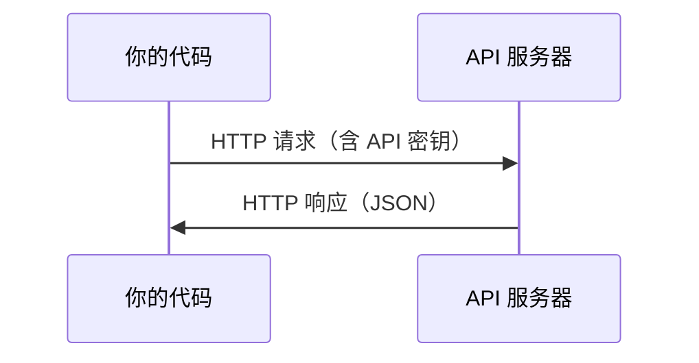

# API 与密钥

> 每个 AI API 的工作方式都一样：发送请求，获取响应。细节会变，但模式不变。

**Type:** Build
**Languages:** Python, TypeScript
**Prerequisites:** Phase 0, Lesson 01
**Time:** ~30 minutes

## 学习目标

- 使用环境变量和 `.env` 文件安全地存储 API 密钥
- 使用 Anthropic Python SDK 和原始 HTTP 两种方式调用 LLM API
- 比较基于 SDK 和原始 HTTP 的请求/响应格式以进行调试
- 识别并处理常见的 API 错误，包括身份验证和速率限制

## 问题

从第 11 阶段开始，你将调用 LLM API（Anthropic、OpenAI、Google）。在第 13-16 阶段，你将构建在循环中使用这些 API 的智能体。你需要了解 API 密钥的工作原理、如何安全地存储它们，以及如何进行第一次 API 调用。

## 概念



每次 API 调用包含：
1. 端点（URL）
2. API 密钥（身份验证）
3. 请求体（你想要的内容）
4. 响应体（你得到的结果）

## 动手实践

### 步骤 1：安全存储 API 密钥

永远不要将 API 密钥写在代码中。请使用环境变量。

```bash
export ANTHROPIC_API_KEY="sk-ant-..."
export OPENAI_API_KEY="sk-..."
```

或者使用 `.env` 文件（将其添加到 `.gitignore`）：

```
ANTHROPIC_API_KEY=sk-ant-...
OPENAI_API_KEY=sk-...
```

### 步骤 2：第一次 API 调用（Python）

```python
import anthropic

client = anthropic.Anthropic()

response = client.messages.create(
    model="claude-sonnet-4-20250514",
    max_tokens=256,
    messages=[{"role": "user", "content": "What is a neural network in one sentence?"}]
)

print(response.content[0].text)
```

### 步骤 3：第一次 API 调用（TypeScript）

```typescript
import Anthropic from "@anthropic-ai/sdk";

const client = new Anthropic();

const response = await client.messages.create({
  model: "claude-sonnet-4-20250514",
  max_tokens: 256,
  messages: [{ role: "user", content: "What is a neural network in one sentence?" }],
});

console.log(response.content[0].text);
```

### 步骤 4：原始 HTTP（不使用 SDK）

```python
import os
import urllib.request
import json

url = "https://api.anthropic.com/v1/messages"
headers = {
    "Content-Type": "application/json",
    "x-api-key": os.environ["ANTHROPIC_API_KEY"],
    "anthropic-version": "2023-06-01",
}
body = json.dumps({
    "model": "claude-sonnet-4-20250514",
    "max_tokens": 256,
    "messages": [{"role": "user", "content": "What is a neural network in one sentence?"}],
}).encode()

req = urllib.request.Request(url, data=body, headers=headers, method="POST")
with urllib.request.urlopen(req) as resp:
    result = json.loads(resp.read())
    print(result["content"][0]["text"])
```

这就是 SDK 在底层所做的工作。理解原始 HTTP 调用有助于调试。

## 应用

在本课程中：

| API | 何时需要 | 免费额度 |
|-----|---------|---------|
| Anthropic (Claude) | 第 11-16 阶段（智能体、工具） | 注册赠送 $5 额度 |
| OpenAI | 第 11 阶段（对比） | 注册赠送 $5 额度 |
| Hugging Face | 第 4-10 阶段（模型、数据集） | 免费 |

你不需要现在就全部配置好。在课程需要时再设置即可。

## 交付物

本课程产出：
- `outputs/prompt-api-troubleshooter.md` - 诊断常见 API 错误

## 练习

1. 获取 Anthropic API 密钥并进行第一次 API 调用
2. 尝试原始 HTTP 版本，并与 SDK 版本的响应格式进行比较
3. 故意使用错误的 API 密钥，阅读错误信息

## 关键术语

| 术语 | 人们常说的 | 实际含义 |
|------|-----------|---------|
| API key | "API 的密码" | 标识你的账户并授权请求的唯一字符串 |
| Rate limit | "他们在限流我" | 每分钟/小时的最大请求数，用于防止滥用并确保公平使用 |
| Token | "一个词"（在 API 上下文中） | 计费单位：输入和输出的 token 会被分别计数和收费 |
| Streaming | "实时响应" | 逐词获取响应，而不是等待完整响应 |
