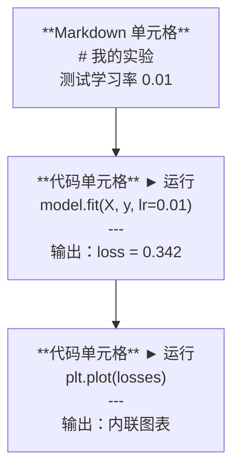
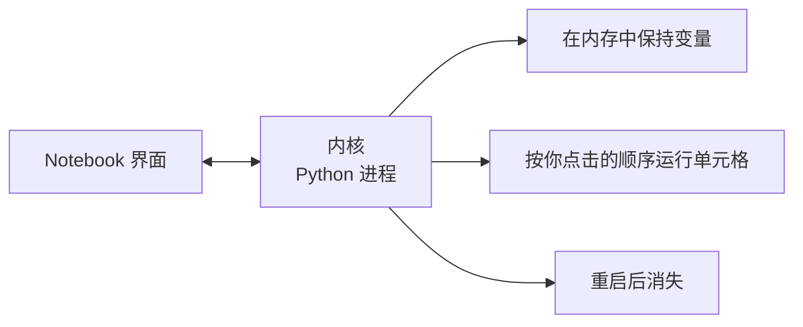

# Jupyter Notebook

> Notebook 是 AI 工程的工作台。你在这里进行原型开发，然后将可用的代码迁移到生产环境。

**Type:** Build
**Languages:** Python
**Prerequisites:** Phase 0, Lesson 01
**Time:** ~30 minutes

## 学习目标

- 安装并启动 JupyterLab、Jupyter Notebook 或带有 Jupyter 扩展的 VS Code
- 使用魔法命令（`%timeit`、`%%time`、`%matplotlib inline`）进行基准测试和行内可视化
- 区分何时使用 notebook 和何时使用脚本，并应用"在 notebook 中探索，用脚本交付"的工作流程
- 识别并避免常见的 notebook 陷阱：乱序执行、隐藏状态和内存泄漏

## 问题

每一篇 AI 论文、教程和 Kaggle 竞赛都在使用 Jupyter notebook。它们让你可以分块运行代码、在行内查看输出、将代码与解释混合在一起，并快速迭代。如果你尝试不借助 notebook 学习 AI，就像做数学作业却没有草稿纸一样。

但 notebook 也有实际的陷阱。人们用它来做所有事情，包括那些它完全不擅长的事情。知道何时使用 notebook 和何时使用脚本，将为你省去日后的调试噩梦。

## 概念

Notebook 是一个由单元格组成的列表。每个单元格要么是代码，要么是文本。



内核是一个在后台运行的 Python 进程。当你运行一个单元格时，它会将代码发送给内核，由内核执行代码并发回结果。所有单元格共享同一个内核，因此变量在单元格之间保持持久。



那个"按你点击的顺序"的部分既是超能力，也是自毁的扳机。

## 动手实践

### 步骤 1：选择你的界面

三种选择，同一格式：

| 界面 | 安装方式 | 最适合 |
|-----------|---------|----------|
| JupyterLab | `pip install jupyterlab` 然后 `jupyter lab` | 完整的 IDE 体验，多标签页、文件浏览器、终端 |
| Jupyter Notebook | `pip install notebook` 然后 `jupyter notebook` | 简单、轻量，一次一个 notebook |
| VS Code | 安装 "Jupyter" 扩展 | 已在编辑器中，Git 集成、调试功能 |

三者都能读写相同的 `.ipynb` 文件。选择你喜欢的即可。JupyterLab 在 AI 工作中最为常见。

```bash
pip install jupyterlab
jupyter lab
```

### 步骤 2：值得掌握的键盘快捷键

你可以在两种模式之间切换。按 `Escape` 进入命令模式（左侧蓝色边框），按 `Enter` 进入编辑模式（绿色边框）。

**命令模式（最常用）：**

| 按键 | 功能 |
|-----|--------|
| `Shift+Enter` | 运行单元格，移动到下一个 |
| `A` | 在上方插入单元格 |
| `B` | 在下方插入单元格 |
| `DD` | 删除单元格 |
| `M` | 转换为 Markdown |
| `Y` | 转换为代码 |
| `Z` | 撤销单元格操作 |
| `Ctrl+Shift+H` | 显示所有快捷键 |

**编辑模式：**

| 按键 | 功能 |
|-----|--------|
| `Tab` | 自动补全 |
| `Shift+Tab` | 显示函数签名 |
| `Ctrl+/` | 切换注释 |

`Shift+Enter` 是你每天会用上千次的快捷键。先记住它。

### 步骤 3：单元格类型

**代码单元格**运行 Python 并显示输出：

```python
import numpy as np
data = np.random.randn(1000)
data.mean(), data.std()
```

输出：`(0.0032, 0.9987)`

**Markdown 单元格**渲染格式化文本。用它们来记录你正在做什么以及为什么这么做。支持标题、粗体、斜体、LaTeX 数学公式（`$E = mc^2$`）、表格和图片。

### 步骤 4：魔法命令

这些不是 Python 语法。它们是 Jupyter 特有的命令，以 `%`（行魔法）或 `%%`（单元格魔法）开头。

**计时你的代码：**

```python
%timeit np.random.randn(10000)
```

输出：`45.2 us +/- 1.3 us per loop`

```python
%%time
model.fit(X_train, y_train, epochs=10)
```

输出：`Wall time: 2.34 s`

`%timeit` 多次运行代码并取平均值。`%%time` 只运行一次。使用 `%timeit` 进行微基准测试，使用 `%%time` 进行训练运行计时。

**启用内联图表：**

```python
%matplotlib inline
```

现在每个 `plt.plot()` 或 `plt.show()` 都会直接在 notebook 中渲染。

**无需离开 notebook 即可安装包：**

```python
!pip install scikit-learn
```

`!` 前缀可以运行任何 shell 命令。

**检查环境变量：**

```python
%env CUDA_VISIBLE_DEVICES
```

### 步骤 5：内联显示富文本输出

Notebook 会自动显示单元格中的最后一个表达式。但你也可以手动控制：

```python
import pandas as pd

df = pd.DataFrame({
    "model": ["Linear", "Random Forest", "Neural Net"],
    "accuracy": [0.72, 0.89, 0.94],
    "training_time": [0.1, 2.3, 45.6]
})
df
```

这会渲染一个格式化的 HTML 表格，而不是纯文本输出。图表也是如此：

```python
import matplotlib.pyplot as plt

plt.figure(figsize=(8, 4))
plt.plot([1, 2, 3, 4], [1, 4, 2, 3])
plt.title("Inline Plot")
plt.show()
```

图表会直接出现在单元格下方。这就是 notebook 在 AI 工作中占主导地位的原因。你可以同时看到数据、图表和代码。

对于图片：

```python
from IPython.display import Image, display
display(Image(filename="architecture.png"))
```

### 步骤 6：Google Colab

Colab 是一个免费的云端 Jupyter notebook。它为你提供了 GPU、预装好的库和 Google Drive 集成。无需任何设置。

1. 访问 [colab.research.google.com](https://colab.research.google.com)
2. 上传本课程中的任意 `.ipynb` 文件
3. Runtime > Change runtime type > T4 GPU（免费）

Colab 与本地 Jupyter 的区别：
- 文件在会话之间不会持久保存（保存到 Drive 或下载）
- 预装：numpy、pandas、matplotlib、torch、tensorflow、sklearn
- 使用 `from google.colab import files` 上传/下载文件
- 使用 `from google.colab import drive; drive.mount('/content/drive')` 持久化存储
- 免费版在 90 分钟无操作后会话超时

## 应用

### Notebook 与脚本：何时使用哪种

| 使用 notebook 的场景 | 使用脚本的场景 |
|-------------------|-----------------|
| 探索数据集 | 训练流水线 |
| 原型开发模型 | 可复用的工具函数 |
| 可视化结果 | 包含 `if __name__` 的代码 |
| 解释你的工作 | 按计划运行的代码 |
| 快速实验 | 生产代码 |
| 课程练习 | 包和库 |

规则是：**在 notebook 中探索，用脚本交付**。

AI 中的常见工作流程：
1. 在 notebook 中探索数据
2. 在 notebook 中构建模型原型
3. 一旦可用，将代码迁移到 `.py` 文件中
4. 将这些 `.py` 文件导入回 notebook 进行进一步实验

### 常见陷阱

**乱序执行。** 你先运行了单元格 5，然后是单元格 2，然后是单元格 7。Notebook 在你的机器上能正常工作，但当别人从头到尾运行时却会报错。修复方法：分享前执行 Kernel > Restart & Run All。

**隐藏状态。** 你删除了一个单元格，但它创建的变量仍在内存中。Notebook 看起来很干净，却依赖于一个幽灵单元格。修复方法：定期重启内核。

**内存泄漏。** 加载了一个 4GB 的数据集，训练了一个模型，又加载了另一个数据集。没有任何资源被释放。修复方法：使用 `del variable_name` 和 `gc.collect()`，或者重启内核。

## 交付物

本课程产出：
- `outputs/prompt-notebook-helper.md` 用于调试 notebook 问题

## 练习

1. 打开 JupyterLab，创建一个 notebook，使用 `%timeit` 比较列表推导式和 numpy 在创建 100,000 个随机数数组时的性能
2. 创建一个包含 Markdown 和代码单元格的 notebook，加载一个 CSV 文件，显示数据框，并绘制图表。然后运行 Kernel > Restart & Run All 验证它可以从头到尾正常运行
3. 从 `code/notebook_tips.py` 中取出代码，粘贴到 Colab notebook 中，并使用免费 GPU 运行

## 关键术语

| 术语 | 人们常说的 | 实际含义 |
|------|-----------|---------|
| Kernel | "执行我代码的东西" | 一个独立的 Python 进程，负责执行单元格并在内存中保持变量 |
| Cell | "一个代码块" | Notebook 中可独立运行的单元，可以是代码或 Markdown |
| Magic command | "Jupyter 小技巧" | 以 `%` 或 `%%` 为前缀的特殊命令，用于控制 notebook 环境 |
| `.ipynb` | "Notebook 文件" | 包含单元格、输出和元数据的 JSON 文件。全称是 IPython Notebook |

## 扩展阅读

- [JupyterLab 文档](https://jupyterlab.readthedocs.io/) 了解完整功能集
- [Google Colab 常见问题](https://research.google.com/colaboratory/faq.html) 了解 Colab 特定的限制和功能
- [28 个 Jupyter Notebook 技巧](https://www.dataquest.io/blog/jupyter-notebook-tips-tricks-shortcuts/) 了解高级用户的快捷键
