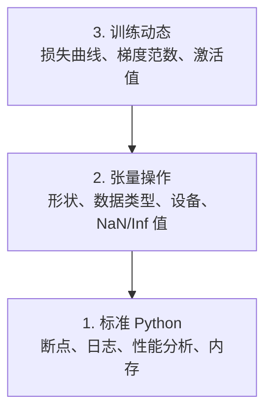

# 调试与性能分析

> 最糟糕的 AI 错误不会导致崩溃。它们会在垃圾数据上默默训练，然后报告一条完美的损失曲线。

**Type:** Build
**Language:** Python
**Prerequisites:** Lesson 1 (Dev Environment), basic PyTorch familiarity
**Time:** ~60 分钟

## 学习目标

- 使用条件 `breakpoint()` 和 `debug_print` 在训练过程中检查张量的形状、数据类型和 NaN 值
- 使用 `cProfile`、`line_profiler` 和 `tracemalloc` 分析训练循环，找出性能瓶颈
- 检测常见的 AI 错误：形状不匹配、NaN 损失、数据泄漏和设备不匹配的张量
- 设置 TensorBoard 以可视化损失曲线、权重直方图和梯度分布

## 问题

AI 代码的失败方式与普通代码不同。Web 应用崩溃时会给出堆栈跟踪。而配置错误的训练循环会运行 8 小时，烧掉 200 美元的 GPU 费用，然后产生一个预测每个输入平均值的模型。代码从未报错。错误是一个在错误设备上的张量、一个忘记的 `.detach()`，或者标签泄漏到了特征中。

你需要能够在你浪费时间和算力之前捕捉这些静默失败的调试工具。

## 核心理念

AI 调试在三个层面上进行：



大多数人直接跳到第 3 层（盯着 TensorBoard 看）。但 80% 的 AI 错误发生在第 1 层和第 2 层。

## 动手实践

### 第一部分：打印调试（是的，它很有效）

打印调试经常被轻视。但事实并非如此——对于张量代码，有针对性的打印语句比逐步执行调试器更好，因为你需要同时看到形状、数据类型和值的范围。

```python
def debug_print(name, tensor):
    print(f"{name}: shape={tensor.shape}, dtype={tensor.dtype}, "
          f"device={tensor.device}, "
          f"min={tensor.min().item():.4f}, max={tensor.max().item():.4f}, "
          f"mean={tensor.mean().item():.4f}, "
          f"has_nan={tensor.isnan().any().item()}")
```

在每次可疑操作后调用此函数。找到错误后删除这些打印语句。就这么简单。

### 第二部分：Python 调试器（pdb 和 breakpoint）

内置调试器在 AI 工作中被低估了。在你的训练循环中插入 `breakpoint()`，然后交互式地检查张量。

```python
def training_step(model, batch, criterion, optimizer):
    inputs, labels = batch
    outputs = model(inputs)
    loss = criterion(outputs, labels)

    if loss.item() > 100 or torch.isnan(loss):
        breakpoint()

    loss.backward()
    optimizer.step()
```

当调试器将你带入交互环境时，有用的命令：

- `p outputs.shape` 检查形状
- `p loss.item()` 查看损失值
- `p torch.isnan(outputs).sum()` 统计 NaN 数量
- `p model.fc1.weight.grad` 检查梯度
- `c` 继续执行，`q` 退出

这就是条件式调试。只有当某些看起来不对时你才停下来。对于一个 10,000 步的训练来说，这很关键。

### 第三部分：Python 日志记录

当你的调试超出快速检查的范畴时，用日志记录替代打印语句。

```python
import logging

logging.basicConfig(
    level=logging.INFO,
    format="%(asctime)s [%(levelname)s] %(message)s",
    handlers=[
        logging.FileHandler("training.log"),
        logging.StreamHandler()
    ]
)
logger = logging.getLogger(__name__)

logger.info("Starting training: lr=%.4f, batch_size=%d", lr, batch_size)
logger.warning("Loss spike detected: %.4f at step %d", loss.item(), step)
logger.error("NaN loss at step %d, stopping", step)
```

日志记录提供了时间戳、严重级别和文件输出。当训练在凌晨 3 点失败时，你需要一个日志文件，而不是已经滚动出屏幕的终端输出。

### 第四部分：代码计时

了解时间花在哪里是优化的第一步。

```python
import time

class Timer:
    def __init__(self, name=""):
        self.name = name

    def __enter__(self):
        self.start = time.perf_counter()
        return self

    def __exit__(self, *args):
        elapsed = time.perf_counter() - self.start
        print(f"[{self.name}] {elapsed:.4f}s")

with Timer("data loading"):
    batch = next(dataloader_iter)

with Timer("forward pass"):
    outputs = model(batch)

with Timer("backward pass"):
    loss.backward()
```

常见的发现：数据加载占了训练时间的 60%。解决方法是 DataLoader 中的 `num_workers > 0`，而不是换一块更快的 GPU。

### 第五部分：cProfile 和 line_profiler

当你需要比手动计时更强大的工具时：

```bash
python -m cProfile -s cumtime train.py
```

这会显示按累积时间排序的每个函数调用信息。对于逐行性能分析：

```bash
pip install line_profiler
```

```python
@profile
def train_step(model, data, target):
    output = model(data)
    loss = F.cross_entropy(output, target)
    loss.backward()
    return loss

# 运行方式：kernprof -l -v train.py
```

### 第六部分：内存性能分析

#### 使用 tracemalloc 分析 CPU 内存

```python
import tracemalloc

tracemalloc.start()

# 你的代码在这里
model = build_model()
data = load_dataset()

snapshot = tracemalloc.take_snapshot()
top_stats = snapshot.statistics("lineno")
for stat in top_stats[:10]:
    print(stat)
```

#### 使用 memory_profiler 分析 CPU 内存

```bash
pip install memory_profiler
```

```python
from memory_profiler import profile

@profile
def load_data():
    raw = read_csv("data.csv")       # 观察内存在此处跃升
    processed = preprocess(raw)       # 以及此处
    return processed
```

运行 `python -m memory_profiler your_script.py` 查看逐行内存使用情况。

#### 使用 PyTorch 分析 GPU 内存

```python
import torch

if torch.cuda.is_available():
    print(torch.cuda.memory_summary())

    print(f"Allocated: {torch.cuda.memory_allocated() / 1e9:.2f} GB")
    print(f"Cached: {torch.cuda.memory_reserved() / 1e9:.2f} GB")
```

当你遇到 OOM（内存不足）时：

1. 减小批次大小（首先要尝试的，永远如此）
2. 使用 `torch.cuda.empty_cache()` 释放缓存的内存
3. 对大型中间变量使用 `del tensor` 后跟 `torch.cuda.empty_cache()`
4. 使用混合精度（`torch.cuda.amp`）将内存使用减半
5. 对非常深的模型使用梯度检查点

### 第七部分：常见 AI 错误及如何捕获它们

#### 形状不匹配

最频繁的错误。张量形状为 `[batch, features]`，而模型期望的是 `[batch, channels, height, width]`。

```python
def check_shapes(model, sample_input):
    print(f"Input: {sample_input.shape}")
    hooks = []

    def make_hook(name):
        def hook(module, inp, out):
            in_shape = inp[0].shape if isinstance(inp, tuple) else inp.shape
            out_shape = out.shape if hasattr(out, "shape") else type(out)
            print(f"  {name}: {in_shape} -> {out_shape}")
        return hook

    for name, module in model.named_modules():
        hooks.append(module.register_forward_hook(make_hook(name)))

    with torch.no_grad():
        model(sample_input)

    for h in hooks:
        h.remove()
```

用一个样本批次运行一次。它会映射你模型中每个形状变换。

#### NaN 损失

NaN 损失意味着某些东西爆炸了。常见原因：

- 学习率过高
- 自定义损失函数中除以零
- 对零或负数取对数
- RNN 中的梯度爆炸

```python
def detect_nan(model, loss, step):
    if torch.isnan(loss):
        print(f"NaN loss at step {step}")
        for name, param in model.named_parameters():
            if param.grad is not None:
                if torch.isnan(param.grad).any():
                    print(f"  NaN gradient in {name}")
                if torch.isinf(param.grad).any():
                    print(f"  Inf gradient in {name}")
        return True
    return False
```

#### 数据泄漏

你的模型在测试集上达到了 99% 的准确率。听起来很棒。但这是一个错误。

```python
def check_data_leakage(train_set, test_set, id_column="id"):
    train_ids = set(train_set[id_column].tolist())
    test_ids = set(test_set[id_column].tolist())
    overlap = train_ids & test_ids
    if overlap:
        print(f"DATA LEAKAGE: {len(overlap)} samples in both train and test")
        return True
    return False
```

还要检查时间泄漏：使用未来数据预测过去。在分割之前按时间戳排序。

#### 设备不匹配

不同设备上的张量（CPU vs GPU）会导致运行时错误。但有时某个张量会悄悄留在 CPU 上，而其他所有东西都在 GPU 上，训练只是变慢而已。

```python
def check_devices(model, *tensors):
    model_device = next(model.parameters()).device
    print(f"Model device: {model_device}")
    for i, t in enumerate(tensors):
        if t.device != model_device:
            print(f"  WARNING: tensor {i} on {t.device}, model on {model_device}")
```

### 第八部分：TensorBoard 基础

TensorBoard 可以展示训练过程中随时间变化的情况。

```bash
pip install tensorboard
```

```python
from torch.utils.tensorboard import SummaryWriter

writer = SummaryWriter("runs/experiment_1")

for step in range(num_steps):
    loss = train_step(model, batch)

    writer.add_scalar("loss/train", loss.item(), step)
    writer.add_scalar("lr", optimizer.param_groups[0]["lr"], step)

    if step % 100 == 0:
        for name, param in model.named_parameters():
            writer.add_histogram(f"weights/{name}", param, step)
            if param.grad is not None:
                writer.add_histogram(f"grads/{name}", param.grad, step)

writer.close()
```

启动 TensorBoard：

```bash
tensorboard --logdir=runs
```

需要关注的内容：

- **损失没有下降**：学习率过低，或者模型架构有问题
- **损失剧烈震荡**：学习率过高
- **损失变成 NaN**：数值不稳定（参见上面的 NaN 部分）
- **训练损失下降，验证损失上升**：过拟合
- **权重直方图收缩到零**：梯度消失
- **梯度直方图爆炸**：需要梯度裁剪

### 第九部分：VS Code 调试器

对于交互式调试，配置 VS Code 的 `launch.json`：

```json
{
    "version": "0.2.0",
    "configurations": [
        {
            "name": "Debug Training",
            "type": "debugpy",
            "request": "launch",
            "program": "${file}",
            "console": "integratedTerminal",
            "justMyCode": false
        }
    ]
}
```

点击边距设置断点。使用变量面板检查张量属性。调试控制台允许你在执行过程中运行任意 Python 表达式。

对于逐步检查数据预处理流程非常有用，你可以观察每个变换步骤。

## 实际应用

以下是能够捕获大多数 AI 错误的调试工作流程：

1. **训练前**：使用样本批次运行 `check_shapes`。验证输入和输出维度是否符合预期。
2. **前 10 步**：对损失、输出和梯度使用 `debug_print`。确认没有 NaN 且值在合理范围内。
3. **训练过程中**：记录损失、学习率和梯度范数。使用 TensorBoard 进行可视化。
4. **出问题时**：在故障点插入 `breakpoint()`。交互式检查张量。
5. **性能方面**：对数据加载、前向传播和反向传播分别计时。如果接近 OOM，分析内存使用情况。

## 交付

运行调试工具脚本：

```bash
python phases/00-setup-and-tooling/12-debugging-and-profiling/code/debug_tools.py
```

参见 `outputs/prompt-debug-ai-code.md` 获取帮助诊断 AI 特定错误的提示词。

## 练习

1. 运行 `debug_tools.py` 并阅读每个部分的输出。修改虚拟模型以引入 NaN（提示：在前向传播中除以零），观察检测器如何捕获它。
2. 使用 `cProfile` 分析训练循环，找出最慢的函数。
3. 使用 `tracemalloc` 找出数据加载流程中分配内存最多的那一行代码。
4. 为一个简单的训练运行设置 TensorBoard，并判断模型是否过拟合。
5. 在训练循环中使用 `breakpoint()`。练习在调试器提示符下检查张量形状、设备和梯度值。
