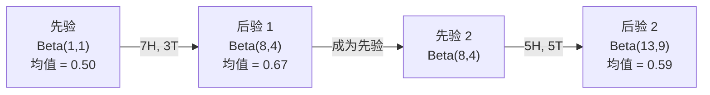

# 贝叶斯定理

> 概率是关于你预期的事。贝叶斯定理是关于你学到的事。

**类型：** 构建
**语言：** Python
**前置知识：** 阶段 1，第 06 课（概率基础）
**时间：** ~75 分钟

## 学习目标

- 运用贝叶斯定理从先验、似然和证据计算后验概率
- 从头构建一个带有拉普拉斯平滑和对数空间计算的朴素贝叶斯文本分类器
- 比较 MLE 和 MAP 估计，解释 MAP 如何对应 L2 正则化
- 使用 Beta-二项共轭先验实现 A/B 测试的顺序贝叶斯更新

## 问题

一项医学检测的准确率是 99%。你检测结果为阳性。你实际患病的概率是多少？

大多数人会说 99%。真正的答案取决于这种疾病有多罕见。如果每 10,000 人中只有 1 人患病，阳性结果只意味着大约 1% 的患病概率。另外 99% 的阳性结果是来自健康人的假警报。

这不是一个陷阱问题。这就是贝叶斯定理。每一个垃圾邮件过滤器、每一项医学诊断、每一个量化不确定性的机器学习模型都在使用这种精确的推理。你从一个信念开始。你看到证据。你进行更新。

如果你在不理解这一点的情况下构建 ML 系统，你会误解模型输出、设置错误的阈值，并发布过于自信的预测。

## 概念

### 从联合概率到贝叶斯

你已经从第 06 课知道条件概率是：

```
P(A|B) = P(A and B) / P(B)
```

对称地：

```
P(B|A) = P(A and B) / P(A)
```

两个表达式共享同一个分子：P(A and B)。令它们相等并重新排列：

```
P(A and B) = P(A|B) * P(B) = P(B|A) * P(A)

因此：

P(A|B) = P(B|A) * P(A) / P(B)
```

这就是贝叶斯定理。四个量，一个方程。

### 四个部分

| 部分 | 名称 | 含义 |
|------|------|------|
| P(A\|B) | 后验概率 | 在看到证据 B 后你对 A 的更新信念 |
| P(B\|A) | 似然 | 如果 A 为真，证据 B 出现的概率 |
| P(A) | 先验概率 | 在看到任何证据之前你对 A 的信念 |
| P(B) | 证据 | 在所有可能性下看到 B 的总概率 |

证据项 P(B) 充当归一化因子。你可以使用全概率公式展开它：

```
P(B) = P(B|A) * P(A) + P(B|not A) * P(not A)
```

### 医学检测示例

一种疾病影响每 10,000 人中的 1 人。检测准确率为 99%（捕捉 99% 的患者，假阳性率为 1%）。

```
P(患病)          = 0.0001     （先验：疾病罕见）
P(阳性|患病)     = 0.99       （似然：检测能捕捉到它）
P(阳性|健康)     = 0.01       （假阳性率）

P(阳性) = P(阳性|患病) * P(患病) + P(阳性|健康) * P(健康)
        = 0.99 * 0.0001 + 0.01 * 0.9999
        = 0.000099 + 0.009999
        = 0.010098

P(患病|阳性) = P(阳性|患病) * P(患病) / P(阳性)
             = 0.99 * 0.0001 / 0.010098
             = 0.0098
             = 0.98%
```

不到 1%。先验占主导地位。当一种情况很罕见时，即使准确的检测也会产生大部分假阳性。这就是为什么医生会要求进行确认检测。

### 垃圾邮件过滤器示例

你收到一封包含"彩票"一词的电子邮件。它是垃圾邮件吗？

```
P(垃圾)              = 0.3      （30% 的电子邮件是垃圾邮件）
P("彩票"|垃圾)       = 0.05     （5% 的垃圾邮件包含"彩票"）
P("彩票"|非垃圾)     = 0.001    （0.1% 的合法邮件包含"彩票"）

P("彩票") = 0.05 * 0.3 + 0.001 * 0.7
          = 0.015 + 0.0007
          = 0.0157

P(垃圾|"彩票") = 0.05 * 0.3 / 0.0157
               = 0.955
               = 95.5%
```

一个词就将概率从 30% 变为 95.5%。真实的垃圾邮件过滤器会同时对数百个词应用贝叶斯。

### 朴素贝叶斯：独立性假设

朴素贝叶斯通过假设所有特征在给定类别的情况下条件独立，将这一点扩展到多个特征：

```
P(类别 | 特征_1, 特征_2, ..., 特征_n)
  = P(类别) * P(特征_1|类别) * P(特征_2|类别) * ... * P(特征_n|类别)
    / P(特征_1, 特征_2, ..., 特征_n)
```

"朴素"的部分就是独立性假设。在文本中，词的出现并不是独立的（"新"和"约"是相关的）。但这个假设在实践中出奇地好用，因为分类器只需要对类别进行排序，而不是产生校准的概率。

由于分母对所有类别都相同，你可以跳过它，只比较分子：

```
score(类别) = P(类别) * P(特征_i | 类别) 的乘积
```

选择得分最高的类别。

### 最大似然估计（MLE）

如何从训练数据中得到 P(特征|类别)？计数。

```
P("免费"|垃圾) = （包含"免费"的垃圾邮件数量）/（垃圾邮件总数）
```

这就是 MLE：选择使观测数据最有可能的参数值。你正在最大化似然函数，对于离散计数来说，它简化为相对频率。

问题：如果一个词在训练期间从未在垃圾邮件中出现过，MLE 会赋予它零概率。一个未见过的词就会杀死整个乘积。用拉普拉斯平滑修复这个问题：

```
P(词|类别) = (count(词, 类别) + 1) / (类别中总词数 + 词汇量大小)
```

给每个计数加 1 确保没有概率为零。

### 最大后验估计（MAP）

MLE 问：什么参数能最大化 P(数据|参数)？

MAP 问：什么参数能最大化 P(参数|数据)？

通过贝叶斯定理：

```
P(参数|数据) 与 P(数据|参数) * P(参数) 成正比
```

MAP 在参数本身之上增加了一个先验。如果你相信参数应该很小，你会将其编码为惩罚大数值的先验。这在 ML 中与 L2 正则化完全相同。岭回归中的"岭"惩罚实际上就是权重上的高斯先验。

| 估计方法 | 优化目标 | ML 等价 |
|--------|---------|--------|
| MLE | P(数据\|参数) | 无正则化训练 |
| MAP | P(数据\|参数) * P(参数) | L2 / L1 正则化 |

### 贝叶斯 vs 频率学派：实际区别

频率学派将参数视为固定的未知量。他们问："如果我多次重复这个实验，会发生什么？"

贝叶斯学派将参数视为分布。他们问："根据我所观察到的，我对参数的信念是什么？"

对于构建 ML 系统，实际区别是：

| 方面 | 频率学派 | 贝叶斯学派 |
|------|---------|----------|
| 输出 | 点估计 | 值的分布 |
| 不确定性 | 置信区间（关于过程） | 可信区间（关于参数） |
| 小数据 | 可能过拟合 | 先验充当正则化 |
| 计算 | 通常更快 | 通常需要采样（MCMC） |

大多数生产环境中的 ML 是频率学派的（SGD、点估计）。贝叶斯方法在需要校准不确定性（医疗决策、安全关键系统）或数据稀缺（少样本学习、冷启动）时表现出色。

### 为什么贝叶斯思维对 ML 很重要

这种联系比类比更深：

**先验就是正则化。** 权重上的高斯先验是 L2 正则化。拉普拉斯先验是 L1。每次你添加正则化项时，你都在做出一个关于你期望的参数值的贝叶斯陈述。

**后验就是不确定性。** 一个预测概率本身并不能告诉你模型对该估计有多大信心。贝叶斯方法给你一个分布："我认为 P(垃圾) 在 0.8 到 0.95 之间。"

**贝叶斯更新就是在线学习。** 今天的后验成为明天的先验。当你的模型看到新数据时，它会增量地更新其信念，而不是从头开始重新训练。

**模型比较是贝叶斯式的。** 贝叶斯信息准则（BIC）、边际似然和贝叶斯因子都使用贝叶斯推理在模型之间进行选择，而不会过拟合。

```figure
bayes-update
```

## 构建

### 步骤 1：贝叶斯定理函数

```python
def bayes(prior, likelihood, false_positive_rate):
    evidence = likelihood * prior + false_positive_rate * (1 - prior)
    posterior = likelihood * prior / evidence
    return posterior

result = bayes(prior=0.0001, likelihood=0.99, false_positive_rate=0.01)
print(f"P(sick|positive) = {result:.4f}")
```

### 步骤 2：朴素贝叶斯分类器

```python
import math
from collections import defaultdict

class NaiveBayes:
    def __init__(self, smoothing=1.0):
        self.smoothing = smoothing
        self.class_counts = defaultdict(int)
        self.word_counts = defaultdict(lambda: defaultdict(int))
        self.class_word_totals = defaultdict(int)
        self.vocab = set()

    def train(self, documents, labels):
        for doc, label in zip(documents, labels):
            self.class_counts[label] += 1
            words = doc.lower().split()
            for word in words:
                self.word_counts[label][word] += 1
                self.class_word_totals[label] += 1
                self.vocab.add(word)

    def predict(self, document):
        words = document.lower().split()
        total_docs = sum(self.class_counts.values())
        vocab_size = len(self.vocab)
        best_class = None
        best_score = float("-inf")
        for cls in self.class_counts:
            score = math.log(self.class_counts[cls] / total_docs)
            for word in words:
                count = self.word_counts[cls].get(word, 0)
                total = self.class_word_totals[cls]
                score += math.log((count + self.smoothing) / (total + self.smoothing * vocab_size))
            if score > best_score:
                best_score = score
                best_class = cls
        return best_class
```

对数概率可以防止下溢。将许多小概率相乘会产生浮点数无法表示的数字。对对数概率求和在数值上更稳定，且在数学上等价。

### 步骤 3：在垃圾邮件数据上训练

```python
train_docs = [
    "win free money now",
    "free lottery ticket winner",
    "claim your prize today free",
    "urgent offer free cash",
    "congratulations you won free",
    "meeting tomorrow at noon",
    "project update attached",
    "can we schedule a call",
    "quarterly report review",
    "lunch on thursday sounds good",
    "team standup notes attached",
    "please review the pull request",
]

train_labels = [
    "spam", "spam", "spam", "spam", "spam",
    "ham", "ham", "ham", "ham", "ham", "ham", "ham",
]

classifier = NaiveBayes()
classifier.train(train_docs, train_labels)

test_messages = [
    "free money waiting for you",
    "meeting rescheduled to friday",
    "you won a free prize",
    "please review the attached report",
]

for msg in test_messages:
    print(f"  '{msg}' -> {classifier.predict(msg)}")
```

### 步骤 4：检查学习到的概率

```python
def show_top_words(classifier, cls, n=5):
    vocab_size = len(classifier.vocab)
    total = classifier.class_word_totals[cls]
    probs = {}
    for word in classifier.vocab:
        count = classifier.word_counts[cls].get(word, 0)
        probs[word] = (count + classifier.smoothing) / (total + classifier.smoothing * vocab_size)
    sorted_words = sorted(probs.items(), key=lambda x: x[1], reverse=True)
    for word, prob in sorted_words[:n]:
        print(f"    {word}: {prob:.4f}")

print("\nTop spam words:")
show_top_words(classifier, "spam")
print("\nTop ham words:")
show_top_words(classifier, "ham")
```

## 使用

Scikit-learn 提供了可直接用于生产的朴素贝叶斯实现：

```python
from sklearn.feature_extraction.text import CountVectorizer
from sklearn.naive_bayes import MultinomialNB
from sklearn.metrics import classification_report

vectorizer = CountVectorizer()
X_train = vectorizer.fit_transform(train_docs)
clf = MultinomialNB()
clf.fit(X_train, train_labels)

X_test = vectorizer.transform(test_messages)
predictions = clf.predict(X_test)
for msg, pred in zip(test_messages, predictions):
    print(f"  '{msg}' -> {pred}")
```

同样的算法。CountVectorizer 处理分词和词汇表构建。MultinomialNB 在内部处理平滑和对数概率。你从头编写的版本用 40 行代码做了同样的事。

## 交付

这里构建的 NaiveBayes 类展示了完整的流水线：分词、带拉普拉斯平滑的概率估计、对数空间预测。`code/bayes.py` 中的代码端到端运行，除了 Python 标准库外没有其他依赖。

### 共轭先验

当先验和后验属于相同的分布族时，该先验被称为"共轭"的。这使得贝叶斯更新在代数上非常简洁——你无需数值积分就能得到闭式后验。

| 似然 | 共轭先验 | 后验 | 示例 |
|-----|---------|------|------|
| 伯努利分布 | Beta(a, b) | Beta(a + 成功数, b + 失败数) | 硬币翻转偏差估计 |
| 正态分布（已知方差） | 正态(mu_0, sigma_0) | 正态(加权均值, 更小方差) | 传感器校准 |
| 泊松分布 | Gamma(a, b) | Gamma(a + 计数之和, b + n) | 到达率建模 |
| 多项分布 | Dirichlet(alpha) | Dirichlet(alpha + 计数) | 主题建模、语言模型 |

为什么这很重要：没有共轭先验，你需要蒙特卡洛采样或变分推断来近似后验。有了共轭先验，你只需要更新两个数字。

Beta 分布是实践中最常见的共轭先验。Beta(a, b) 表示你对概率参数的信念。均值是 a/(a+b)。a+b 越大，分布越集中（越有信心）。

Beta 先验的特殊情况：
- Beta(1, 1) = 均匀分布。你对参数没有意见。
- Beta(10, 10) = 在 0.5 处有峰值。你强烈相信参数接近 0.5。
- Beta(1, 10) = 向 0 倾斜。你相信参数很小。

更新规则极其简单：

```
先验：     Beta(a, b)
数据：      s 次成功，f 次失败
后验：     Beta(a + s, b + f)
```

没有积分。没有采样。只是加法。

### 顺序贝叶斯更新

贝叶斯推理本质上是顺序的。今天的后验成为明天的先验。这就是真实系统如何增量学习，而无需重新处理所有历史数据。

具体例子：估计一枚硬币是否公平。

**第 1 天：还没有数据。**
从 Beta(1, 1) 开始——均匀先验。你没有意见。
- 先验均值：0.5
- 先验在 [0, 1] 上是平坦的

**第 2 天：观察到 7 次正面，3 次反面。**
后验 = Beta(1 + 7, 1 + 3) = Beta(8, 4)
- 后验均值：8/12 = 0.667
- 证据表明硬币偏向正面

**第 3 天：再观察到 5 次正面，5 次反面。**
使用昨天的后验作为今天的先验。
后验 = Beta(8 + 5, 4 + 5) = Beta(13, 9)
- 后验均值：13/22 = 0.591
- 平衡的新数据将估计拉回到 0.5



观测的顺序并不重要。Beta(1,1) 同时用所有 12 次正面和 8 次反面更新得到 Beta(13, 9)——结果相同。顺序更新和批量更新在数学上是等价的。但顺序更新让你可以在每一步做出决定，而无需存储原始数据。

这是生产环境中 ML 系统在线学习的基础。bandit 的汤普森采样、增量推荐系统和流式异常检测器都使用这种模式。

### 与 A/B 测试的联系

A/B 测试是披着外衣的贝叶斯推理。

设置：你正在测试两种按钮颜色。变体 A（蓝色）和变体 B（绿色）。你想知道哪个获得更多点击。

贝叶斯 A/B 测试：

1. **先验。** 两个变体都从 Beta(1, 1) 开始。没有先验偏好。
2. **数据。** 变体 A：1000 次浏览中 50 次点击。变体 B：1000 次浏览中 65 次点击。
3. **后验。**
   - A：Beta(1 + 50, 1 + 950) = Beta(51, 951)。均值 = 0.051
   - B：Beta(1 + 65, 1 + 935) = Beta(66, 936)。均值 = 0.066
4. **决策。** 计算 P(B > A)——B 的真实转化率高于 A 的概率。

分析计算 P(B > A) 很难。但蒙特卡洛方法使其变得简单：

```
1. 从 Beta(51, 951) 抽取 100,000 个样本  -> samples_A
2. 从 Beta(66, 936) 抽取 100,000 个样本  -> samples_B
3. P(B > A) = B > A 的样本比例
```

如果 P(B > A) > 0.95，你发布变体 B。如果在 0.05 和 0.95 之间，你继续收集数据。如果 P(B > A) < 0.05，你发布变体 A。

与频率学派 A/B 测试相比的优势：
- 你得到一个直接的概率陈述："B 更好的可能性是 97%"
- 没有 p 值的混淆。没有"无法拒绝零假设"的含糊其辞。
- 你可以随时检查结果，而不会膨胀假阳性率（没有"偷看问题"）
- 你可以纳入先验知识（例如，之前的测试表明转化率通常在 3-8%）

| 方面 | 频率学派 A/B | 贝叶斯 A/B |
|------|-------------|-----------|
| 输出 | p 值 | P(B > A) |
| 解释 | "如果 A=B，这些数据有多令人惊讶？" | "B 比 A 好的可能性有多大？" |
| 提前停止 | 膨胀假阳性率 | 在任何时候都是安全的（给定精心选择的先验和正确指定的模型） |
| 先验知识 | 不使用 | 编码为 Beta 先验 |
| 决策规则 | p < 0.05 | P(B > A) > 阈值 |

## 练习

1. **多次检测。** 一个病人在两项独立的检测中都呈阳性（两者准确率均为 99%，疾病患病率为万分之一）。两次检测后 P(患病) 是多少？使用第一次检测的后验作为第二次的先验。

2. **平滑的影响。** 使用 0.01、0.1、1.0 和 10.0 的平滑值运行垃圾邮件分类器。顶级词的概率如何变化？如果平滑值 = 0 且有一个词只出现在正常邮件中，会发生什么？

3. **添加特征。** 扩展 NaiveBayes 类，使其除了词频外还使用消息长度（短/长）作为特征。从训练数据中估计 P(短|垃圾) 和 P(短|正常)，并将其纳入预测分数。

4. **手动 MAP。** 给定观测数据（10 次硬币投掷中 7 次正面），使用 Beta(2,2) 先验计算偏差的 MAP 估计。与 MLE 估计（7/10）进行比较。

## 关键术语

| 术语 | 人们说的话 | 实际含义 |
|------|----------|---------|
| 先验 | "我的初始猜测" | 观察证据前的 P(假设)。在 ML 中：正则化项。 |
| 似然 | "数据拟合得有多好" | P(证据\|假设)。在特定假设下观测数据的概率。 |
| 后验 | "我更新的信念" | P(假设\|证据)。先验乘以似然，然后归一化。 |
| 证据 | "归一化常数" | 所有假设下的 P(数据)。确保后验总和为 1。 |
| 朴素贝叶斯 | "那个简单的文本分类器" | 假设特征在给定类别的情况下独立的分类器。尽管假设错误但效果很好。 |
| 拉普拉斯平滑 | "加一平滑" | 给每个特征添加小计数以防止未见过数据的零概率。 |
| MLE | "就用频率" | 选择最大化 P(数据\|参数) 的参数。没有先验。小数据可能过拟合。 |
| MAP | "带先验的 MLE" | 选择最大化 P(数据\|参数) * P(参数) 的参数。等价于正则化的 MLE。 |
| 对数概率 | "在对数空间中工作" | 使用 log(P) 而不是 P 来避免多个小数相乘时的浮点下溢。 |
| 假阳性 | "错误警报" | 检测结果呈阳性，但真实状态是阴性。驱动了基础率谬误。 |

## 进一步阅读

- [3Blue1Brown：贝叶斯定理](https://www.youtube.com/watch?v=HZGCoVF3YvM) - 用医学检测示例进行可视化解释
- [Stanford CS229：生成式学习算法](https://cs229.stanford.edu/notes2022fall/cs229-notes2.pdf) - 朴素贝叶斯及其与判别模型的联系
- [Think Bayes](https://greenteapress.com/wp/think-bayes/) - 免费书籍，用 Python 代码讲解贝叶斯统计
- [scikit-learn 朴素贝叶斯](https://scikit-learn.org/stable/modules/naive_bayes.html) - 生产级实现以及何时使用每个变体
