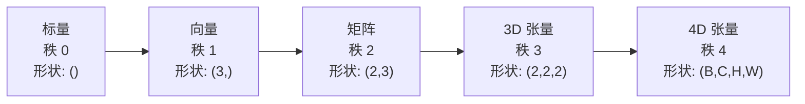
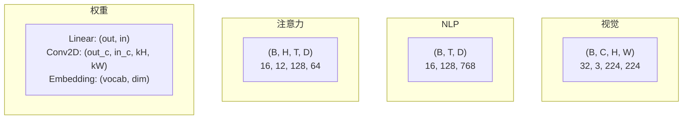
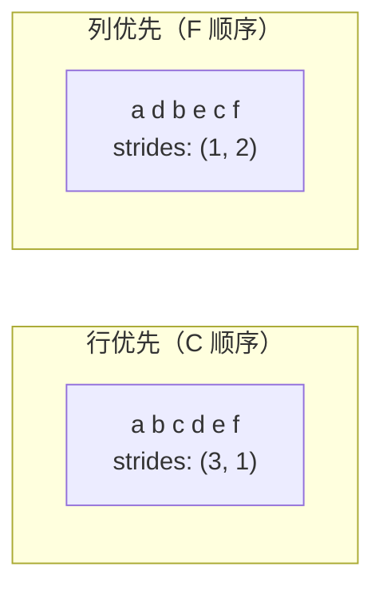
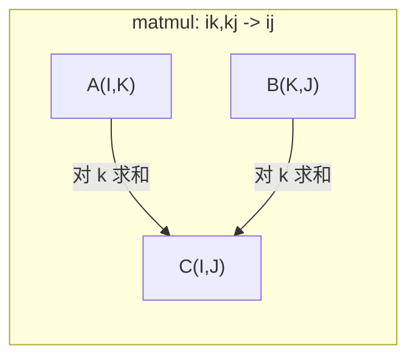

# 张量运算

> 张量是数据与深度学习之间的共同语言。每张图像、每个句子、每个梯度都通过它们流动。

**类型：** 构建
**语言：** Python
**前置知识：** 阶段 1，第 01 课（线性代数直觉）、第 02 课（向量、矩阵与运算）
**时间：** ~90 分钟

## 学习目标

- 从头实现一个带有 shape、strides、reshape、transpose 和逐元素运算的张量类
- 应用广播规则对不同形状的张量进行运算，无需复制数据
- 编写 einsum 表达式用于点积、矩阵乘法、外积和批量运算
- 追踪多头注意力中每一步的确切张量形状

## 问题

你构建了一个 Transformer。前向传播看起来很整洁。你运行它，得到：`RuntimeError: mat1 and mat2 shapes cannot be multiplied (32x768 and 512x768)`。你盯着形状。你尝试转置。现在它说`Expected 4D input (got 3D input)`。你添加了一个 unsqueeze。又有东西坏了。

形状错误是深度学习代码中最常见的错误。它们在概念上并不难——每个操作都有一个形状约束——但它们的传播速度很快。一个 Transformer 有几十个 reshape、transpose 和 broadcast 链在一起。一个错误的轴就会导致错误级联。更糟糕的是，有些形状错误根本不会抛出错误。它们通过沿错误维度广播或在错误轴上求和来静默地产生垃圾输出。

矩阵处理两组事物之间的成对关系。真实数据不适合两个维度。一批 32 张 224x224 的 RGB 图像是一个 4D 张量：`(32, 3, 224, 224)`。具有 12 个头的自注意力也是 4D 的：`(batch, heads, seq_len, head_dim)`。你需要一种能推广到任意数量维度的数据结构，且其操作能整洁地跨所有维度组合。这种结构就是张量。掌握它的运算后，形状错误就会变得很容易调试。

## 概念

### 张量是什么

张量是一个具有统一数据类型的多维数字数组。维度的数量称为**秩**（或**阶**）。每个维度是一个**轴**。**形状**是一个元组，列出了每个轴上的大小。



总元素数 = 所有大小的乘积。形状为 `(2, 3, 4)` 包含 `2 * 3 * 4 = 24` 个元素。

### 深度学习中张量的形状

不同的数据类型按照惯例映射到特定的张量形状。



PyTorch 使用 NCHW（通道优先）。TensorFlow 默认 NHWC（通道在后）。不匹配的布局会导致静默减速或错误。

### 内存布局如何工作

内存中的 2D 数组是一个 1D 字节序列。**Strides**（步幅）告诉你沿着每个轴移动一步需要跳过多少个元素。



转置不会移动数据。它交换步幅，使张量变成**非连续的**——行的元素在内存中不再相邻。

### 广播规则

广播让你对不同形状的张量进行运算，而无需复制数据。从右侧对齐形状。两个维度在相等或其中一个为 1 时兼容。维度较少的张量在左侧填充 1。

```
张量 A:     (8, 1, 6, 1)
张量 B:        (7, 1, 5)
填充后 B:  (1, 7, 1, 5)
结果:       (8, 7, 6, 5)
```

### Einsum：通用张量运算

爱因斯坦求和用字母标记每个轴。在输入中但不在输出中的轴会被求和。两者都有的轴被保留。



关键模式：`i,i->`（点积），`i,j->ij`（外积），`ii->`（迹），`ij->ji`（转置），`bij,bjk->bik`（批量矩阵乘法），`bhtd,bhsd->bhts`（注意力分数）。

```figure
tensor-broadcast
```

## 构建

代码位于 `code/tensors.py`。每个步骤引用了该实现。

### 步骤 1：张量存储和步幅

张量存储一个扁平的数字列表加上形状元数据。步幅告诉索引逻辑如何将多维索引映射到扁平位置。

```python
class Tensor:
    def __init__(self, data, shape=None):
        if isinstance(data, (list, tuple)):
            self._data, self._shape = self._flatten_nested(data)
        elif isinstance(data, np.ndarray):
            self._data = data.flatten().tolist()
            self._shape = tuple(data.shape)
        else:
            self._data = [data]
            self._shape = ()

        if shape is not None:
            total = reduce(lambda a, b: a * b, shape, 1)
            if total != len(self._data):
                raise ValueError(
                    f"Cannot reshape {len(self._data)} elements into shape {shape}"
                )
            self._shape = tuple(shape)

        self._strides = self._compute_strides(self._shape)

    @staticmethod
    def _compute_strides(shape):
        if len(shape) == 0:
            return ()
        strides = [1] * len(shape)
        for i in range(len(shape) - 2, -1, -1):
            strides[i] = strides[i + 1] * shape[i + 1]
        return tuple(strides)
```

对于形状 `(3, 4)`，步幅是 `(4, 1)`——跳过 4 个元素前进一行，跳过 1 个元素前进一列。

### 步骤 2：Reshape、squeeze、unsqueeze

Reshape 在不改变元素顺序的情况下改变形状。元素总数必须保持不变。对一个维度使用 `-1` 来推断其大小。

```python
t = Tensor(list(range(12)), shape=(2, 6))
r = t.reshape((3, 4))
r = t.reshape((-1, 3))
```

Squeeze 移除大小为 1 的轴。Unsqueeze 插入一个。Unsqueeze 对广播至关重要——一个偏置向量 `(D,)` 加到批次 `(B, T, D)` 上需要 unsqueeze 到 `(1, 1, D)`。

```python
t = Tensor(list(range(6)), shape=(1, 3, 1, 2))
s = t.squeeze()
v = Tensor([1, 2, 3])
u = v.unsqueeze(0)
```

### 步骤 3：Transpose 和 permute

Transpose 交换两个轴。Permute 重新排列所有轴。这就是你在 NCHW 和 NHWC 之间转换的方式。

```python
mat = Tensor(list(range(6)), shape=(2, 3))
tr = mat.transpose(0, 1)

t4d = Tensor(list(range(24)), shape=(1, 2, 3, 4))
perm = t4d.permute((0, 2, 3, 1))
```

在 transpose 或 permute 之后，张量在内存中是非连续的。在 PyTorch 中，`view` 在非连续张量上会失败——使用 `reshape` 或先调用 `.contiguous()`。

### 步骤 4：逐元素运算和规约

逐元素运算（add、multiply、subtract）独立应用于每个元素并保持形状。规约（sum、mean、max）折叠一个或多个轴。

```python
a = Tensor([[1, 2], [3, 4]])
b = Tensor([[10, 20], [30, 40]])
c = a + b
d = a * 2
s = a.sum(axis=0)
```

CNN 中的全局平均池化：`(B, C, H, W).mean(axis=[2, 3])` 生成 `(B, C)`。NLP 中的序列均值池化：`(B, T, D).mean(axis=1)` 生成 `(B, D)`。

### 步骤 5：使用 NumPy 的广播

`tensors.py` 中的 `demo_broadcasting_numpy()` 函数展示了核心模式。

```python
activations = np.random.randn(4, 3)
bias = np.array([0.1, 0.2, 0.3])
result = activations + bias

images = np.random.randn(2, 3, 4, 4)
scale = np.array([0.5, 1.0, 1.5]).reshape(1, 3, 1, 1)
result = images * scale

a = np.array([1, 2, 3]).reshape(-1, 1)
b = np.array([10, 20, 30, 40]).reshape(1, -1)
outer = a * b
```

通过广播实现成对距离：将 `(M, 2)` reshape 为 `(M, 1, 2)`，`(N, 2)` reshape 为 `(1, N, 2)`，相减，平方，沿最后一个轴求和，取平方根。结果：`(M, N)`。

### 步骤 6：Einsum 运算

`demo_einsum()` 和 `demo_einsum_gallery()` 函数遍历所有常见模式。

```python
a = np.array([1.0, 2.0, 3.0])
b = np.array([4.0, 5.0, 6.0])
dot = np.einsum("i,i->", a, b)

A = np.array([[1, 2], [3, 4], [5, 6]], dtype=float)
B = np.array([[7, 8, 9], [10, 11, 12]], dtype=float)
matmul = np.einsum("ik,kj->ij", A, B)

batch_A = np.random.randn(4, 3, 5)
batch_B = np.random.randn(4, 5, 2)
batch_mm = np.einsum("bij,bjk->bik", batch_A, batch_B)
```

收缩的计算成本是所有索引大小（保留的和求和的）的乘积。对于 B=32, I=128, J=64, K=128 的 `bij,bjk->bik`：`32 * 128 * 64 * 128 = 33,554,432` 次乘加。

### 步骤 7：通过 einsum 实现注意力机制

`demo_attention_einsum()` 函数端到端地实现了多头注意力。

```python
B, H, T, D = 2, 4, 8, 16
E = H * D

X = np.random.randn(B, T, E)
W_q = np.random.randn(E, E) * 0.02

Q = np.einsum("bte,ek->btk", X, W_q)
Q = Q.reshape(B, T, H, D).transpose(0, 2, 1, 3)

scores = np.einsum("bhtd,bhsd->bhts", Q, K) / np.sqrt(D)
weights = softmax(scores, axis=-1)
attn_output = np.einsum("bhts,bhsd->bhtd", weights, V)

concat = attn_output.transpose(0, 2, 1, 3).reshape(B, T, E)
output = np.einsum("bte,ek->btk", concat, W_o)
```

每一步都是一个张量运算：投影（通过 einsum 的矩阵乘法）、头部拆分（reshape + transpose）、注意力分数（通过 einsum 的批量矩阵乘法）、加权和（通过 einsum 的批量矩阵乘法）、头部合并（transpose + reshape）、输出投影（通过 einsum 的矩阵乘法）。

## 使用

### 手写版 vs NumPy

| 操作 | 手写版（Tensor 类） | NumPy |
|------|-------------------|-------|
| 创建 | `Tensor([[1,2],[3,4]])` | `np.array([[1,2],[3,4]])` |
| Reshape | `t.reshape((3,4))` | `a.reshape(3,4)` |
| Transpose | `t.transpose(0,1)` | `a.T` 或 `a.transpose(0,1)` |
| Squeeze | `t.squeeze(0)` | `np.squeeze(a, 0)` |
| Sum | `t.sum(axis=0)` | `a.sum(axis=0)` |
| Einsum | N/A | `np.einsum("ij,jk->ik", a, b)` |

### 手写版 vs PyTorch

```python
import torch

t = torch.tensor([[1, 2, 3], [4, 5, 6]], dtype=torch.float32)
t.shape
t.stride()
t.is_contiguous()

t.reshape(3, 2)
t.unsqueeze(0)
t.transpose(0, 1)
t.transpose(0, 1).contiguous()

torch.einsum("ik,kj->ij", A, B)
```

PyTorch 增加了 autograd、GPU 支持和优化的 BLAS 内核。形状语义是相同的。如果你理解了手写版，PyTorch 的形状错误就会变得可读。

### 每个神经网络层作为张量运算

| 操作 | 张量形式 | Einsum |
|------|---------|--------|
| Linear 层 | `Y = X @ W.T + b` | `"bd,od->bo"` + 偏置 |
| 注意力 QKV | `Q = X @ W_q` | `"btd,dh->bth"` |
| 注意力分数 | `Q @ K.T / sqrt(d)` | `"bhtd,bhsd->bhts"` |
| 注意力输出 | `softmax(scores) @ V` | `"bhts,bhsd->bhtd"` |
| Batch norm | `(X - mu) / sigma * gamma` | 逐元素 + 广播 |
| Softmax | `exp(x) / sum(exp(x))` | 逐元素 + 规约 |

## 交付

本课程生成两个可复用的提示：

1. **`outputs/prompt-tensor-shapes.md`** -- 一个用于调试张量形状不匹配的系统性提示。包含每个常用操作（matmul、broadcast、cat、Linear、Conv2d、BatchNorm、softmax）的决策表和修复查找表。

2. **`outputs/prompt-tensor-debugger.md`** -- 一个一步步的调试提示，当形状错误阻碍你时，你可以粘贴到任何 AI 助手中。提供错误消息和张量形状，返回精确的修复方案。

## 练习

1. **简单 -- Reshape 往返。** 取一个形状为 `(2, 3, 4)` 的张量。将其 reshape 为 `(6, 4)`，然后为 `(24,)`，然后回到 `(2, 3, 4)`。通过在每一步打印扁平数据来验证元素顺序是否保持。

2. **中等 -- 实现广播。** 扩展 `Tensor` 类，添加 `broadcast_to(shape)` 方法，将大小为 1 的维度扩展到匹配目标形状。然后修改 `_elementwise_op` 以在操作前自动广播。测试形状 `(3, 1)` 和 `(1, 4)` 生成 `(3, 4)`。

3. **困难 -- 从头构建 einsum。** 实现一个基本的 `einsum(subscripts, *tensors)` 函数，至少处理：点积（`i,i->`）、矩阵乘法（`ij,jk->ik`）、外积（`i,j->ij`）和转置（`ij->ji`）。解析下标字符串，识别收缩的索引，并遍历所有索引组合。将结果与 `np.einsum` 比较。

4. **困难 -- 注意力形状追踪器。** 编写一个函数，以 `batch_size`、`seq_len`、`embed_dim` 和 `num_heads` 为输入，并打印多头注意力中每一步的确切形状：输入、Q/K/V 投影、头部拆分、注意力分数、softmax 权重、加权和、头部合并、输出投影。验证结果与 `demo_attention_einsum()` 输出一致。

## 关键术语

| 术语 | 人们说的话 | 实际含义 |
|------|----------|---------|
| 张量 | "矩阵但更多维度" | 具有统一类型和定义好的形状、步幅和运算的多维数组 |
| 秩 | "维度的数量" | 轴的数量。矩阵的秩是 2，不等于其矩阵秩 |
| 形状 | "张量的大小" | 列出每个轴大小的元组。`(2, 3)` 表示 2 行、3 列 |
| 步幅 | "内存如何布局" | 沿着每个轴前进一步需要跳过的元素数量 |
| 广播 | "形状不同时也能工作" | 一组严格的规则：从右侧对齐，维度必须相等或其中一个为 1 |
| 连续 | "张量是正常的" | 元素按顺序存储在内存中，与逻辑布局相比没有空隙或重排 |
| Einsum | "写 matmul 的一种花哨方式" | 一种通用记法，可以用一行表达任何张量收缩、外积、迹或转置 |
| View | "和 reshape 一样" | 共享相同内存缓冲区但具有不同形状/步幅元数据的张量。在非连续数据上失败 |
| 收缩 | "对索引求和" | 张量之间的共享索引被乘法和求和的一般运算，产生较低秩的结果 |
| NCHW / NHWC | "PyTorch vs TensorFlow 格式" | 图像张量的内存布局约定。NCHW 在空间维度之前放置通道，NHWC 放在之后 |

## 进一步阅读

- [NumPy 广播](https://numpy.org/doc/stable/user/basics.broadcasting.html) -- 带可视化示例的规范规则
- [PyTorch 张量视图](https://pytorch.org/docs/stable/tensor_view.html) -- 视图何时工作，何时复制
- [einops](https://github.com/arogozhnikov/einops) -- 使张量重塑可读且安全的库
- [图解 Transformer](https://jalammar.github.io/illustrated-transformer/) -- 可视化流经注意力的张量形状
- [NumPy 中的爱因斯坦求和](https://numpy.org/doc/stable/reference/generated/numpy.einsum.html) -- 带示例的完整 einsum 文档
