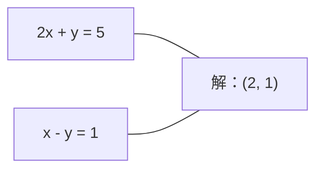
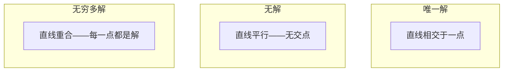

# 线性系统

> 求解 Ax = b 是数学中最古老的问题，而它至今仍在驱动你的神经网络。

**类型：** 构建
**语言：** Python
**前置条件：** 阶段 1，课程 01（线性代数直觉）、02（向量与矩阵）、03（矩阵变换）
**时间：** ~120 分钟

## 学习目标

- 使用带部分主元的高斯消元法和回代求解 Ax = b
- 用 LU、QR 和 Cholesky 分解对矩阵进行分解，并解释每种方法何时适用
- 推导最小二乘法的正规方程，并将其与线性回归和岭回归联系起来
- 使用条件数诊断病态系统，并应用正则化使其稳定

## 问题

每当你训练线性回归时，你就在求解一个线性系统。每当你计算最小二乘拟合时，你就在求解一个线性系统。每当你神经网络层计算 `y = Wx + b` 时，它就在求值一个线性系统的一侧。当你添加正则化时，你就在修改这个系统。当你使用高斯过程时，你就在分解一个矩阵。当你对马氏距离求逆协方差矩阵时，你就在求解一个线性系统。

方程 Ax = b 无处不在。A 是已知系数的矩阵。b 是已知输出的向量。x 是你要找的未知向量。在线性回归中，A 是你的数据矩阵，b 是你的目标向量，x 是权重向量。整个模型简化为：找到 x 使得 Ax 尽可能接近 b。

本课程从头构建求解该方程的每一种主要方法。你将理解为什么有些方法快速而另一些稳定，为什么有些只适用于方阵系统而另一些可以处理超定系统，以及为什么矩阵的条件数决定了你的答案是否有意义。

## 概念

### Ax = b 的几何意义

线性方程组有几何解释。每个方程定义了一个超平面。解是所有超平面相交的点（或点的集合）。

```
2x + y = 5          二维中的两条直线。
x - y  = 1          它们在 x=2, y=1 处相交。
```



可能发生三种情况：



在矩阵形式中，"唯一解"意味着 A 可逆。"无解"意味着系统不一致。"无穷多解"意味着 A 有零空间。大多数 ML 问题属于"无精确解"类别，因为你的方程数（数据点）多于未知数（参数）。这就是最小二乘法发挥作用的地方。

### 列视角 vs 行视角

有两种方式来解读 Ax = b。

**行视角。** A 的每一行定义一个方程。每个方程是一个超平面。解是它们全部相交的地方。

**列视角。** A 的每一列是一个向量。问题变成：A 的列向量的什么线性组合能产生 b？

```
A = | 2  1 |    b = | 5 |
    | 1 -1 |        | 1 |

行视角：同时求解 2x + y = 5 和 x - y = 1。

列视角：找 x1、x2 使得：
  x1 * [2, 1] + x2 * [1, -1] = [5, 1]
  2 * [2, 1] + 1 * [1, -1] = [4+1, 2-1] = [5, 1]   验证通过。
```

列视角更为基础。如果 b 位于 A 的列空间中，系统有解。如果 b 不在其中，你在列空间中找到最近的点。那个最近的点就是最小二乘解。

### 高斯消元法

高斯消元将 Ax = b 转换为一个上三角系统 Ux = c，然后通过回代求解。它是最直接的方法。

算法：

```
1. 对于每一列 k（主元列）：
   a. 在列 k 的第 k 行及以下找到最大元素（部分主元）。
   b. 将该行与第 k 行交换。
   c. 对于第 k 行以下的每一行 i：
      - 计算乘数 m = A[i][k] / A[k][k]
      - 从第 i 行中减去 m 乘以第 k 行。
2. 回代：从最后一个方程向上求解。
```

示例：

```
原始：
| 2  1  1 | 8 |       R2 = R2 - (2)R1     | 2  1   1 |  8 |
| 4  3  3 |20 |  -->  R3 = R3 - (1)R1 --> | 0  1   1 |  4 |
| 2  3  1 |12 |                            | 0  2   0 |  4 |

                       R3 = R3 - (2)R2     | 2  1   1 |  8 |
                                       --> | 0  1   1 |  4 |
                                           | 0  0  -2 | -4 |

回代：
  -2 * x3 = -4    -->  x3 = 2
  x2 + 2  = 4     -->  x2 = 2
  2*x1 + 2 + 2 = 8 --> x1 = 2
```

高斯消元法的计算代价为 O(n^3) 次运算。对于一个 1000x1000 的系统，大约需要十亿次浮点运算。很快，但如果你需要求解多个具有相同 A 的系统，你可以做得更好。

### 部分主元：为什么它很重要

没有主元，高斯消元可能失败或产生垃圾。如果主元为零，你会除以零。如果它很小，你会放大舍入误差。

```
坏主元：                        使用部分主元：
| 0.001  1 | 1.001 |            先交换行：
| 1      1 | 2     |            | 1      1 | 2     |
                                 | 0.001  1 | 1.001 |
m = 1/0.001 = 1000              m = 0.001/1 = 0.001
R2 = R2 - 1000*R1               R2 = R2 - 0.001*R1
| 0.001  1     | 1.001   |      | 1      1     | 2     |
| 0     -999   | -999.0  |      | 0      0.999 | 0.999 |

x2 = 1.000（正确）             x2 = 1.000（正确）
x1 = (1.001 - 1)/0.001          x1 = (2 - 1)/1 = 1.000（正确）
   = 0.001/0.001 = 1.000        由于乘数很小，结果是稳定的。
```

在精度有限的浮点算术中，没有主元的版本可能丢失有效数字。部分主元始终选择最大的可用主元以最小化误差放大。

### LU 分解

LU 分解将 A 分解为一个下三角矩阵 L 和一个上三角矩阵 U：A = LU。L 矩阵存储高斯消元中的乘数。U 矩阵是消元的结果。

```
A = L @ U

| 2  1  1 |   | 1  0  0 |   | 2  1   1 |
| 4  3  3 | = | 2  1  0 | @ | 0  1   1 |
| 2  3  1 |   | 1  2  1 |   | 0  0  -2 |
```

为什么不直接消元而要分解？因为一旦你有了 L 和 U，对任何新的 b 求解 Ax = b 只需要 O(n^2) 的代价：

```
Ax = b
LUx = b
令 y = Ux：
  Ly = b    （前代，O(n^2)）
  Ux = y    （回代，O(n^2)）
```

O(n^3) 的代价在分解时一次性支付。后续每次求解都是 O(n^2)。如果你需要求解 1000 个具有相同 A 但不同 b 向量的系统，LU 总的计算量节省了约 1000/3 倍。

使用部分主元时，你得到 PA = LU，其中 P 是记录行交换的置换矩阵。

### QR 分解

QR 分解将 A 分解为一个正交矩阵 Q 和一个上三角矩阵 R：A = QR。

正交矩阵具有性质 Q^T Q = I。其列是标准正交向量。乘以 Q 可以保持长度和角度。

```
A = Q @ R

Q 有标准正交列：Q^T Q = I
R 是上三角矩阵

求解 Ax = b：
  QRx = b
  Rx = Q^T b    （只需乘以 Q^T，无需求逆）
  回代得到 x。
```

对于求解最小二乘问题，QR 在数值上比 LU 更稳定。Gram-Schmidt 过程逐列构建 Q：

```
给定 A 的列 a1, a2, ...：

q1 = a1 / ||a1||

q2 = a2 - (a2 . q1) * q1        （减去在 q1 上的投影）
q2 = q2 / ||q2||                （归一化）

q3 = a3 - (a3 . q1) * q1 - (a3 . q2) * q2
q3 = q3 / ||q3||

R[i][j] = qi . aj    对于 i <= j
```

每一步移除沿所有先前 q 向量的分量，只留下新的正交方向。

### Cholesky 分解

当 A 是对称的（A = A^T）且正定的（所有特征值为正）时，你可以将其分解为 A = L L^T，其中 L 是下三角矩阵。这就是 Cholesky 分解。

```
A = L @ L^T

| 4  2 |   | 2  0 |   | 2  1 |
| 2  5 | = | 1  2 | @ | 0  2 |

L[i][i] = sqrt(A[i][i] - sum(L[i][k]^2 for k < i))
L[i][j] = (A[i][j] - sum(L[i][k]*L[j][k] for k < j)) / L[j][j]    对于 i > j
```

Cholesky 的速度是 LU 的两倍，存储需求减半。它只适用于对称正定矩阵，但这类矩阵经常出现：

- 协方差矩阵是对称半正定的（通过正则化变为正定）。
- 高斯过程中的核矩阵是对称正定的。
- 凸函数在最小值处的 Hessian 矩阵是对称正定的。
- A^T A 总是对称半正定的。

在高斯过程中，你用 Cholesky 分解核矩阵 K，然后求解 K alpha = y 得到预测均值。Cholesky 因子还给出了边缘似然的对数行列式：log det(K) = 2 * sum(log(diag(L)))。

### 最小二乘法：当 Ax = b 没有精确解时

如果 A 是 m x n 且 m > n（方程数多于未知数），系统是超定的。没有精确解。相反，你最小化平方误差：

```
minimize ||Ax - b||^2

这是平方残差之和：
  sum((A[i,:] @ x - b[i])^2 for i in range(m))
```

最小化器满足正规方程：

```
A^T A x = A^T b
```

推导：展开 ||Ax - b||^2 = (Ax - b)^T (Ax - b) = x^T A^T A x - 2 x^T A^T b + b^T b。对 x 取梯度，设为零：2 A^T A x - 2 A^T b = 0。

```
原始系统（超定，4 个方程，2 个未知数）：
| 1  1 |         | 3 |
| 1  2 | x     = | 5 |       没有精确的 x 能满足所有 4 个方程。
| 1  3 |         | 6 |
| 1  4 |         | 8 |

正规方程：
A^T A = | 4  10 |    A^T b = | 22 |
        | 10 30 |            | 63 |

求解：x = [1.5, 1.7]

这就是线性回归。x[0] 是截距，x[1] 是斜率。
```

### 正规方程 = 线性回归

这种联系是精确的。在线性回归中，数据矩阵 X 每行一个样本，每列一个特征。目标向量 y 每个样本一个条目。权重向量 w 满足：

```
X^T X w = X^T y
w = (X^T X)^(-1) X^T y
```

这是线性回归的闭式解。每次调用 `sklearn.linear_model.LinearRegression.fit()` 都会计算这个（或通过 QR 或 SVD 的等价形式）。

在矩阵中添加正则化项 lambda * I，你就得到了岭回归：

```
(X^T X + lambda * I) w = X^T y
w = (X^T X + lambda * I)^(-1) X^T y
```

正则化使矩阵的条件更好（更容易精确求逆），并通过将权重向零收缩来防止过拟合。当 lambda > 0 时，矩阵 X^T X + lambda * I 总是对称正定的，因此你可以使用 Cholesky 来求解它。

### 伪逆（Moore-Penrose）

伪逆 A+ 将矩阵求逆推广到非方阵和奇异矩阵。对于任意矩阵 A：

```
x = A+ b

其中 A+ = V Sigma+ U^T    （通过 SVD 计算）
```

Sigma+ 是对每个非零奇异值取倒数并转置结果而形成的。如果 A = U Sigma V^T，那么 A+ = V Sigma+ U^T。

```
A = U Sigma V^T        （SVD）

Sigma = | 5  0 |       Sigma+ = | 1/5  0  0 |
        | 0  2 |                | 0  1/2  0 |
        | 0  0 |

A+ = V Sigma+ U^T
```

伪逆给出最小范数最小二乘解。如果系统：
- 有唯一解：A+ b 给出这个解。
- 无解：A+ b 给出最小二乘解。
- 有无穷多解：A+ b 给出 ||x|| 最小的那个。

NumPy 的 `np.linalg.lstsq` 和 `np.linalg.pinv` 都在内部使用 SVD。

### 条件数

条件数衡量解对输入微小变化的敏感程度。对于矩阵 A，条件数是：

```
kappa(A) = ||A|| * ||A^(-1)|| = sigma_max / sigma_min
```

其中 sigma_max 和 sigma_min 是最大和最小奇异值。

```
良态（kappa ~ 1）：                       病态（kappa ~ 10^15）：
b 的微小变化 -->                            b 的微小变化 -->
x 的微小变化                                x 的巨大变化

| 2  0 |   kappa = 2/1 = 2                 | 1   1          |   kappa ~ 10^15
| 0  1 |   求解安全                         | 1   1+10^(-15) |   解是垃圾
```

经验法则：
- kappa < 100：安全，解是准确的。
- kappa ~ 10^k：你从浮点算术中丢失约 k 位精度。
- kappa ~ 10^16（对于 float64）：解毫无意义。矩阵实际上奇异。

在 ML 中，当特征近似共线性时会出现病态。正则化（添加 lambda * I）将条件数从 sigma_max / sigma_min 改善为 (sigma_max + lambda) / (sigma_min + lambda)。

### 迭代方法：共轭梯度

对于非常大的稀疏系统（数百万个未知数），LU 或 Cholesky 等直接方法代价过高。迭代方法通过在多次迭代中改进猜测来逼近解。

共轭梯度（CG）在 A 对称正定时求解 Ax = b。它在至多 n 次迭代中找到精确解（在精确算术中），但如果 A 的特征值聚集在一起，通常收敛得更快。

```
算法概览：
  x0 = 初始猜测（通常为零）
  r0 = b - A x0           （残差）
  p0 = r0                 （搜索方向）

  对于 k = 0, 1, 2, ...：
    alpha = (rk . rk) / (pk . A pk)
    x_{k+1} = xk + alpha * pk
    r_{k+1} = rk - alpha * A pk
    beta = (r_{k+1} . r_{k+1}) / (rk . rk)
    p_{k+1} = r_{k+1} + beta * pk
    if ||r_{k+1}|| < 容差：停止
```

CG 用于：
- 大规模优化（Newton-CG 方法）
- 求解 PDE 离散化
- 核方法，其中核矩阵太大而无法分解
- 其他迭代求解器的预处理

收敛速度取决于条件数。条件更好的系统收敛更快，这也是正则化有帮助的另一个原因。

### 全貌：何时使用哪种方法

| 方法 | 要求 | 代价 | 用例 |
|------|------|------|------|
| 高斯消元 | 方阵、非奇异 A | O(n^3) | 一次性求解方阵系统 |
| LU 分解 | 方阵、非奇异 A | O(n^3) 分解 + O(n^2) 求解 | 相同 A 的多次求解 |
| QR 分解 | 任意 A（m >= n） | O(mn^2) | 最小二乘法，数值稳定 |
| Cholesky | 对称正定 A | O(n^3/3) | 协方差矩阵、高斯过程、岭回归 |
| 正规方程 | 超定（m > n） | O(mn^2 + n^3) | 线性回归（小 n） |
| SVD / 伪逆 | 任意 A | O(mn^2) | 秩亏系统、最小范数解 |
| 共轭梯度 | 对称正定、稀疏 A | O(n * k * nnz) | 大型稀疏系统，k = 迭代次数 |

### 与 ML 的联系

本课程中的每种方法都出现在生产 ML 中：

**线性回归。** 闭式解求解正规方程 X^T X w = X^T y。这通过 Cholesky（如果 n 很小）或 QR（如果数值稳定性重要）或 SVD（如果矩阵可能秩亏）完成。

**岭回归。** 向 X^T X 添加 lambda * I。正则化系统 (X^T X + lambda * I) w = X^T y 总是可解的，通过 Cholesky 求解，因为当 lambda > 0 时 X^T X + lambda * I 是对称正定的。

**高斯过程。** 预测均值需要求解 K alpha = y，其中 K 是核矩阵。K 的 Cholesky 分解是标准方法。对数边缘似然使用 log det(K) = 2 sum(log(diag(L)))。

**神经网络初始化。** 正交初始化使用 QR 分解创建列向量标准正交的权重矩阵。这可以防止深度网络中的信号坍缩。

**预处理。** 大规模优化器使用不完全 Cholesky 或不完全 LU 作为共轭梯度求解器的预处理。

**特征工程。** X^T X 的条件数告诉你特征是否共线性。如果 kappa 很大，删除特征或添加正则化。

```figure
linear-system-conditioning
```

## 构建

### 第 1 步：带部分主元的高斯消元

```python
import numpy as np

def gaussian_elimination(A, b):
    n = len(b)
    Ab = np.hstack([A.astype(float), b.reshape(-1, 1).astype(float)])

    for k in range(n):
        max_row = k + np.argmax(np.abs(Ab[k:, k]))
        Ab[[k, max_row]] = Ab[[max_row, k]]

        if abs(Ab[k, k]) < 1e-12:
            raise ValueError(f"主元 {k} 处矩阵奇异或接近奇异")

        for i in range(k + 1, n):
            m = Ab[i, k] / Ab[k, k]
            Ab[i, k:] -= m * Ab[k, k:]

    x = np.zeros(n)
    for i in range(n - 1, -1, -1):
        x[i] = (Ab[i, -1] - Ab[i, i+1:n] @ x[i+1:n]) / Ab[i, i]

    return x
```

### 第 2 步：LU 分解

```python
def lu_decompose(A):
    n = A.shape[0]
    L = np.eye(n)
    U = A.astype(float).copy()
    P = np.eye(n)

    for k in range(n):
        max_row = k + np.argmax(np.abs(U[k:, k]))
        if max_row != k:
            U[[k, max_row]] = U[[max_row, k]]
            P[[k, max_row]] = P[[max_row, k]]
            if k > 0:
                L[[k, max_row], :k] = L[[max_row, k], :k]

        for i in range(k + 1, n):
            L[i, k] = U[i, k] / U[k, k]
            U[i, k:] -= L[i, k] * U[k, k:]

    return P, L, U

def lu_solve(P, L, U, b):
    n = len(b)
    Pb = P @ b.astype(float)

    y = np.zeros(n)
    for i in range(n):
        y[i] = Pb[i] - L[i, :i] @ y[:i]

    x = np.zeros(n)
    for i in range(n - 1, -1, -1):
        x[i] = (y[i] - U[i, i+1:] @ x[i+1:]) / U[i, i]

    return x
```

### 第 3 步：Cholesky 分解

```python
def cholesky(A):
    n = A.shape[0]
    L = np.zeros_like(A, dtype=float)

    for i in range(n):
        for j in range(i + 1):
            s = A[i, j] - L[i, :j] @ L[j, :j]
            if i == j:
                if s <= 0:
                    raise ValueError("矩阵不是正定的")
                L[i, j] = np.sqrt(s)
            else:
                L[i, j] = s / L[j, j]

    return L
```

### 第 4 步：通过正规方程的最小二乘法

```python
def least_squares_normal(A, b):
    AtA = A.T @ A
    Atb = A.T @ b
    return gaussian_elimination(AtA, Atb)

def ridge_regression(A, b, lam):
    n = A.shape[1]
    AtA = A.T @ A + lam * np.eye(n)
    Atb = A.T @ b
    L = cholesky(AtA)
    y = np.zeros(n)
    for i in range(n):
        y[i] = (Atb[i] - L[i, :i] @ y[:i]) / L[i, i]
    x = np.zeros(n)
    for i in range(n - 1, -1, -1):
        x[i] = (y[i] - L.T[i, i+1:] @ x[i+1:]) / L.T[i, i]
    return x
```

### 第 5 步：条件数

```python
def condition_number(A):
    U, S, Vt = np.linalg.svd(A)
    return S[0] / S[-1]
```

## 应用

将各部分组合起来，对真实数据进行线性回归和岭回归：

```python
np.random.seed(42)
X_raw = np.random.randn(100, 3)
w_true = np.array([2.0, -1.0, 0.5])
y = X_raw @ w_true + np.random.randn(100) * 0.1

X = np.column_stack([np.ones(100), X_raw])

w_ols = least_squares_normal(X, y)
print(f"OLS 权重（我们的）：    {w_ols}")

w_np = np.linalg.lstsq(X, y, rcond=None)[0]
print(f"OLS 权重（numpy）：   {w_np}")
print(f"最大差异：{np.max(np.abs(w_ols - w_np)):.2e}")

w_ridge = ridge_regression(X, y, lam=1.0)
print(f"Ridge 权重（我们的）：  {w_ridge}")

from sklearn.linear_model import Ridge
ridge_sk = Ridge(alpha=1.0, fit_intercept=False)
ridge_sk.fit(X, y)
print(f"Ridge 权重（sklearn）： {ridge_sk.coef_}")
```

## 交付物

本课程产出：
- `code/linear_systems.py`：包含从头实现的高斯消元、LU 分解、Cholesky 分解、最小二乘法和岭回归
- 一个工作演示，展示正规方程和 sklearn 的 LinearRegression 产生相同的权重

## 练习题

1. 使用你的高斯消元、你的 LU 求解器和 `np.linalg.solve` 求解系统 `[[1,2,3],[4,5,6],[7,8,10]] x = [6, 15, 27]`。验证三者都在浮点容差内给出相同答案。

2. 生成一个 50x5 的随机矩阵 X 和目标值 y = X @ w_true + noise。使用正规方程、QR（通过 `np.linalg.qr`）、SVD（通过 `np.linalg.svd`）和 `np.linalg.lstsq` 求解 w。比较所有四个解。测量 X^T X 的条件数，并解释它如何影响你信任哪种方法。

3. 通过使两列几乎相同（例如，第 2 列 = 第 1 列 + 1e-10 * noise）来创建一个近奇异矩阵。计算其条件数。在有和无正则化（添加 0.01 * I）的情况下求解 Ax = b。比较解和残差。解释为什么正则化有帮助。

4. 对一个 100x100 的随机对称正定矩阵实现共轭梯度算法。计算收敛到 1e-8 容差所需的迭代次数。与理论最大值 n 次迭代进行比较。

5. 在大小为 10、50、200、500 的对称正定矩阵上，对你的 Cholesky 求解器、你的 LU 求解器和 `np.linalg.solve` 计时。绘制结果。验证 Cholesky 大约比 LU 快 2 倍。

## 关键术语

| 术语 | 人们说的 | 实际含义 |
|------|---------|---------|
| 线性系统 | "求解 x" | 一组线性方程 Ax = b。求解 x 意味着在变换 A 下找到产生输出 b 的输入。 |
| 高斯消元 | "行化简" | 使用行操作系统地消去对角线下的元素，产生可通过回代求解的上三角系统。O(n^3)。 |
| 部分主元 | "为稳定性交换行" | 在列 k 中消元之前，将该列中绝对值最大的行交换到主元位置。防止除以小数。 |
| LU 分解 | "分解为三角矩阵" | 将 A 写为 A = LU，其中 L 是下三角矩阵（存储乘数），U 是上三角矩阵（消元后的矩阵）。将 O(n^3) 的代价分摊到多次求解中。 |
| QR 分解 | "正交分解" | 将 A 写为 A = QR，其中 Q 有标准正交列，R 是上三角矩阵。对最小二乘法来说比 LU 更稳定。 |
| Cholesky 分解 | "矩阵的平方根" | 对于对称正定 A，写为 A = LL^T。代价是 LU 的一半。用于协方差矩阵、核矩阵和岭回归。 |
| 最小二乘法 | "无法精确时的最佳拟合" | 当系统超定时（方程数多于未知数），最小化平方残差和 ||Ax - b||^2。 |
| 正规方程 | "微积分捷径" | A^T A x = A^T b。将 ||Ax - b||^2 的梯度设为零。这就是线性回归的闭式解。 |
| 伪逆 | "非方阵的求逆" | A+ = V Sigma+ U^T 通过 SVD。为任何矩阵（方阵或矩形、奇异或非奇异）给出最小范数最小二乘解。 |
| 条件数 | "这个答案有多可信" | kappa = sigma_max / sigma_min。衡量对输入扰动的敏感性。丢失约 log10(kappa) 位精度。 |
| 岭回归 | "正则化最小二乘法" | 求解 (X^T X + lambda I) w = X^T y。添加 lambda I 改善条件数并将权重向零收缩。防止过拟合。 |
| 共轭梯度 | "大型矩阵的迭代 Ax=b" | 对称正定系统的迭代求解器。至多在 n 步内收敛。对于分解代价过高的稀疏大型系统很实用。 |
| 超定系统 | "数据多于参数" | m 乘 n 系统中 m > n。不存在精确解。最小二乘法找到最佳近似。这是每个回归问题。 |
| 回代 | "从下往上求解" | 给定上三角系统，先解最后一个方程，然后向后代入。O(n^2)。 |
| 前代 | "从上往下求解" | 给定下三角系统，先解第一个方程，然后向前代入。O(n^2)。用于 LU 求解的 L 步骤。 |

## 延伸阅读

- [MIT 18.06：线性代数](https://ocw.mit.edu/courses/18-06-linear-algebra-spring-2010/)（Gilbert Strang）-- 关于线性系统和矩阵分解的权威课程
- [数值线性代数](https://people.maths.ox.ac.uk/trefethen/text.html)（Trefethen & Bau）-- 理解数值稳定性、条件性和算法失败原因的标准参考
- [矩阵计算](https://www.cs.cornell.edu/cv/GolubVanLoan4/golubandvanloan.htm)（Golub & Van Loan）-- 每个矩阵算法的百科全书式参考
- [3Blue1Brown：逆矩阵](https://www.3blue1brown.com/lessons/inverse-matrices) -- 求解 Ax = b 的几何含义的直观解释
