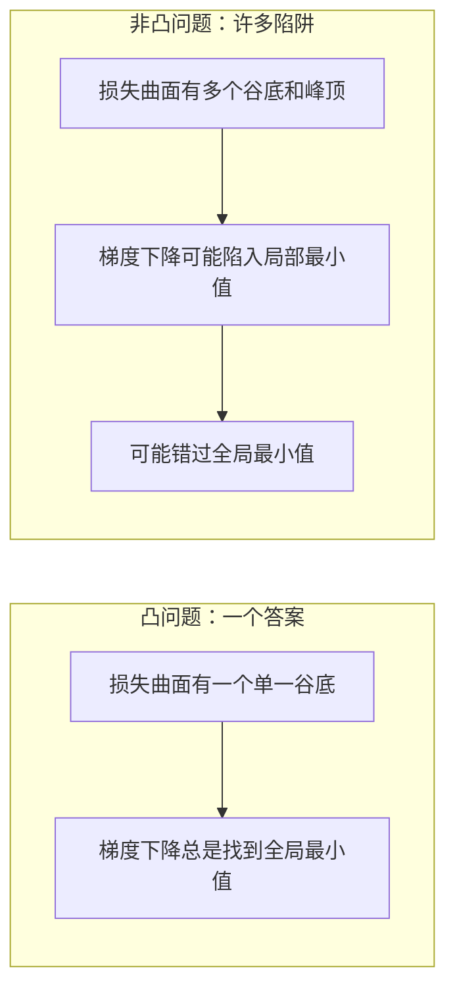
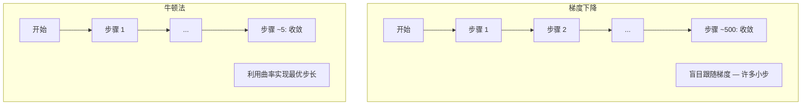
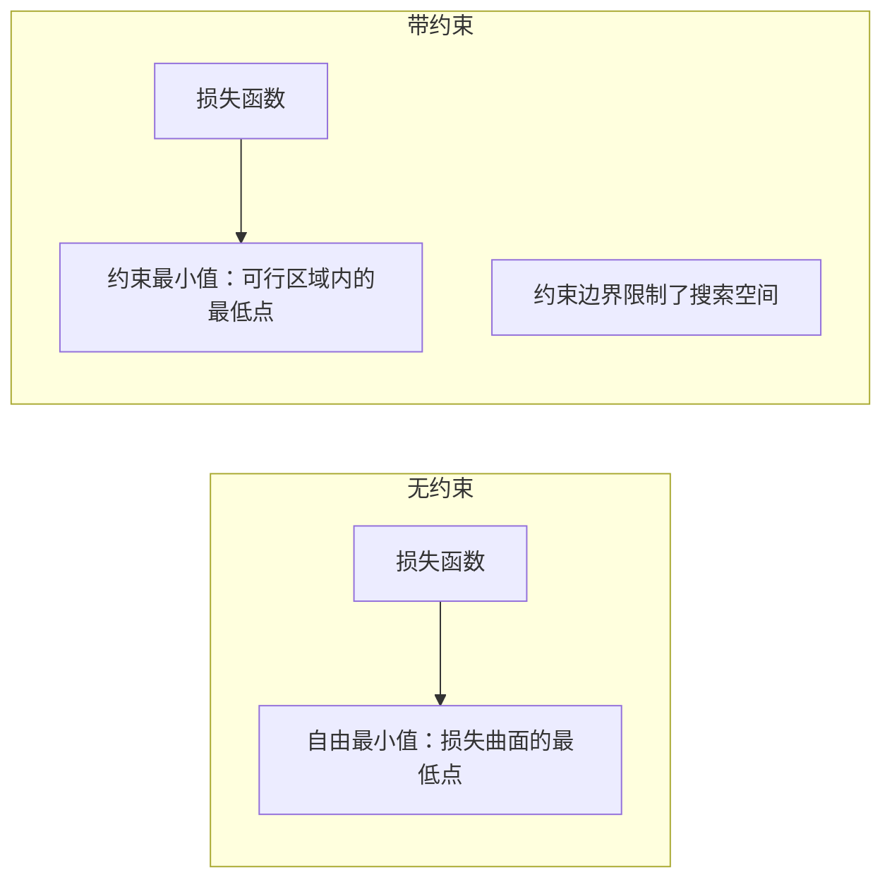
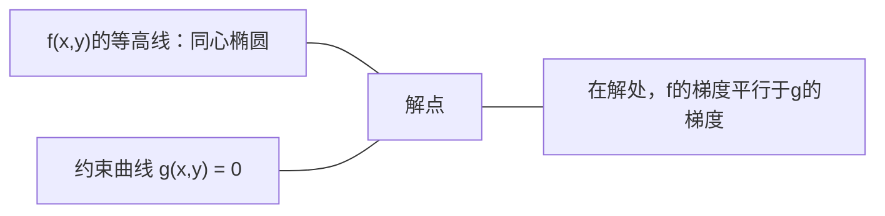

# 凸优化

> 凸问题只有一个谷底。神经网络有数百万个。了解其中的区别至关重要。

**类型：** 构建
**语言：** Python
**前置知识：** 第一阶段，第04课（机器学习微积分），第08课（优化）
**时间：** ~90分钟

## 学习目标

- 使用定义、二阶导数和海森矩阵准则检验函数是否为凸函数
- 实现牛顿法并将其二次收敛速度与梯度下降进行比较
- 使用拉格朗日乘数法求解带约束优化问题并解释KKT条件
- 解释为什么神经网络损失景观是非凸的，但SGD仍能找到良好的解

## 问题

第08课教你梯度下降、动量和Adam。这些优化器可以在任何表面上沿下山方向行走。但它们没有任何保证。在非凸景观上进行梯度下降可能陷入糟糕的局部最小值、卡在鞍点或永远振荡。你仍然使用它们，因为神经网络是非凸的，没有替代方案。

但机器学习中的许多问题是凸的。线性回归、逻辑回归、支持向量机、LASSO、岭回归。对于这些问题，存在更强大的方法：具有数学保证的优化。凸问题恰好有一个谷底。任何沿下山方向行走的算法都将达到全局最小值。无需重新启动。无需学习率调度。无需祈祷。

理解凸性有三个作用。第一，它告诉你问题是容易的（凸）还是困难的（非凸）。第二，它为你提供更快的工具，如牛顿法，用于凸问题。第三，它解释了贯穿ML的概念：作为约束的正则化、SVM中的对偶性，以及深度学习为何在违反凸性提供的所有良好性质时仍然有效。

## 概念

### 凸集

如果对于集合S中的任意两点，它们之间的线段完全位于S中，则集合S是凸的。

| 凸集 | 非凸集 |
|---|---|
| **矩形**：内部的任意两点可以通过一条保持在内的线段连接 | **星形/月牙形**：两个内点之间的线段可能穿出集合 |
| **三角形**：对所有内点同样成立 | **甜甜圈/环面**：空洞导致某些线段离开集合 |
| 任意两点之间的线段保持在集合内 | 某些点对之间的线段会离开集合 |

形式化检验：对于S中的任意点x、y和任意t in [0, 1]，点tx + (1-t)y也在S中。

凸集的例子：
- 一条直线、一个平面、整个R^n空间
- 一个球（圆、球体、超球体）
- 半空间：{x : a^T x <= b}
- 任意多个凸集的交集

非凸集的例子：
- 甜甜圈（环面）
- 两个不相交圆的并集
- 任何有"凹痕"或"空洞"的集合

### 凸函数

如果函数f的定义域是凸集，并且对于定义域中的任意两点x、y和任意t in [0, 1]：

```
f(tx + (1-t)y) <= t*f(x) + (1-t)*f(y)
```

则函数f是凸的。

几何意义：图形上任意两点之间的线段位于图形之上或与图形重合。

| 性质 | 凸函数 | 非凸函数 |
|---|---|---|
| **线段检验** | 图形上任意两点之间的线段位于曲线**之上或与之重合** | 某些点之间的线段会**低于**曲线 |
| **形状** | 单一碗状/谷状向上弯曲 | 多个峰谷，曲率混合 |
| **局部最小值** | 每个局部最小值都是全局最小值 | 可能存在多个不同高度的局部最小值 |

常见的凸函数：
- f(x) = x^2（抛物线）
- f(x) = |x|（绝对值）
- f(x) = e^x（指数函数）
- f(x) = max(0, x)（ReLU，虽然分段线性）
- f(x) = -log(x) for x > 0（负对数）
- 任何线性函数 f(x) = a^T x + b（既是凸的也是凹的）

### 凸性检验

三种实用检验方法，从最简单到最严格。

**检验1：二阶导数检验（一维）。** 如果对所有x有f''(x) >= 0，则f是凸的。

- f(x) = x^2: f''(x) = 2 >= 0。凸函数。
- f(x) = x^3: f''(x) = 6x。当x < 0时为负。非凸函数。
- f(x) = e^x: f''(x) = e^x > 0。凸函数。

**检验2：海森矩阵检验（多变量）。** 如果对所有x，海森矩阵H(x)是半正定的，则f是凸的。海森矩阵是二阶偏导数组成的矩阵。

**检验3：定义检验。** 直接检验不等式 f(tx + (1-t)y) <= t*f(x) + (1-t)*f(y)。适用于导数难以计算的函数。

### 凸性的重要性

凸优化的核心定理：

**对于凸函数，每个局部最小值都是全局最小值。**

这意味着梯度下降不会被困住。任何下坡路径都通向相同的答案。该算法保证收敛到最优解。



后果：
- 无需随机重启
- 无需复杂的学习率调度
- 可以证明收敛性（速度取决于函数性质）
- 解是唯一的（平坦区域除外）

### ML中的凸与非凸

| 问题 | 凸？ | 原因 |
|---------|---------|-----|
| 线性回归（MSE） | 是 | 损失关于权重是二次的 |
| 逻辑回归 | 是 | 对数损失关于权重是凸的 |
| SVM（合页损失） | 是 | 线性函数的最大值 |
| LASSO（L1回归） | 是 | 凸函数之和仍是凸的 |
| 岭回归（L2） | 是 | 二次 + 二次 = 凸 |
| 神经网络（任何损失） | 否 | 非线性激活产生非凸景观 |
| k-means聚类 | 否 | 离散分配步骤 |
| 矩阵分解 | 否 | 未知数的乘积 |

具有凸损失的线性模型是凸的。一旦你添加带有非线性激活的隐藏层，凸性就被破坏了。

### 海森矩阵

函数f: R^n -> R的海森矩阵H是n x n的二阶偏导数矩阵。

```
H[i][j] = d^2 f / (dx_i dx_j)
```

对于f(x, y) = x^2 + 3xy + y^2：

```
df/dx = 2x + 3y       d^2f/dx^2 = 2      d^2f/dxdy = 3
df/dy = 3x + 2y       d^2f/dydx = 3      d^2f/dy^2 = 2

H = [ 2  3 ]
    [ 3  2 ]
```

海森矩阵告诉你曲率信息：
- 所有特征值为正：函数在每个方向都向上弯曲（在该点凸）
- 所有特征值为负：函数在每个方向都向下弯曲（凹，局部最大值）
- 符号混合：鞍点（在某些方向向上弯曲，在另一些方向向下弯曲）
- 特征值为零：该方向平坦（退化）

对于凸性，海森矩阵必须在所有点（而不仅仅是一个点）上是半正定的（所有特征值 >= 0）。

### 牛顿法

梯度下降使用一阶信息（梯度）。牛顿法使用二阶信息（海森矩阵）。它在当前点拟合一个二次近似，并直接跳到该二次函数的最小值。

```
更新规则：
  x_new = x - H^(-1) * gradient

与梯度下降比较：
  x_new = x - lr * gradient
```

牛顿法用逆海森矩阵替换了标量学习率。这根据局部曲率自动调整步长和方向。



优点：
- 在最小值附近具有二次收敛性（误差每一步平方）
- 无需调整学习率
- 尺度不变性（无论你如何参数化问题都有效）

缺点：
- 计算海森矩阵需要O(n^2)内存和O(n^3)求逆
- 对于具有100万个权重的神经网络，那是10^12个条目和10^18次操作
- 不适用于深度学习

### 带约束优化

无约束优化：对所有x最小化f(x)。
带约束优化：在约束条件下最小化f(x)。

实际问题都有约束。你想最小化成本，但预算有限。你想最小化误差，但模型复杂度受限。



### 拉格朗日乘数法

拉格朗日乘数法将带约束问题转化为无约束问题。

问题：在g(x) = 0的约束下最小化f(x)。

解法：引入一个新变量（拉格朗日乘子lambda）并求解无约束问题：

```
L(x, lambda) = f(x) + lambda * g(x)
```

在解处，L的梯度为零：

```
dL/dx = df/dx + lambda * dg/dx = 0
dL/dlambda = g(x) = 0
```

几何直觉：在约束最小值处，f的梯度必须与约束g的梯度平行。如果它们不平行，你可以沿着约束曲面移动并进一步减小f。



示例：在x + y = 1的约束下最小化f(x,y) = x^2 + y^2。

```
L = x^2 + y^2 + lambda(x + y - 1)

dL/dx = 2x + lambda = 0  =>  x = -lambda/2
dL/dy = 2y + lambda = 0  =>  y = -lambda/2
dL/dlambda = x + y - 1 = 0

从前两个方程：x = y
代入：2x = 1，所以 x = y = 0.5, lambda = -1
```

直线x + y = 1上离原点最近的点是(0.5, 0.5)。

### KKT条件

Karush-Kuhn-Tucker条件将拉格朗日乘数法扩展到不等式约束。

问题：在g_i(x) <= 0, i = 1, ..., m的约束下最小化f(x)。

KKT条件（最优性的必要条件）：

```
1. 驻点条件：    df/dx + sum(lambda_i * dg_i/dx) = 0
2. 原始可行性：  g_i(x) <= 0  对所有i
3. 对偶可行性：  lambda_i >= 0  对所有i
4. 互补松弛性：  lambda_i * g_i(x) = 0  对所有i
```

互补松弛性是关键洞见：要么约束是活动的（g_i = 0，解位于边界上），要么乘子为零（该约束不重要）。不影响解的约束其lambda = 0。

KKT条件是SVM的核心。支持向量是那些约束为活动的数据点（lambda > 0）。所有其他数据点的lambda = 0，不影响决策边界。

### 正则化作为带约束优化

L1和L2正则化并不是任意技巧。它们是伪装下的带约束优化问题。

**L2正则化（岭回归）：**

```
minimize  Loss(w)  subject to  ||w||^2 <= t

等价的无约束形式：
minimize  Loss(w) + lambda * ||w||^2
```

约束||w||^2 <= t定义了一个球（二维中是圆，三维中是球体）。解是损失等高线首次接触该球的位置。

**L1正则化（LASSO）：**

```
minimize  Loss(w)  subject to  ||w||_1 <= t

等价的无约束形式：
minimize  Loss(w) + lambda * ||w||_1
```

约束||w||_1 <= t定义了一个菱形（二维中是旋转的正方形）。

| 性质 | L2约束（圆形） | L1约束（菱形） |
|---|---|---|
| **约束形状** | 圆形（更高维是球体） | 菱形（二维中是旋转的正方形） |
| **损失等高线接触点** | 光滑边界 — 圆上的任意点 | 角点 — 与坐标轴对齐 |
| **解的行为** | 权重小但不为零 | 某些权重恰好为零（稀疏） |
| **结果** | 权重收缩 | 特征选择 |

这解释了为什么L1产生稀疏模型（特征选择），而L2只收缩权重。菱形的角点与坐标轴对齐。损失等高线更可能接触到角点，使一个或多个权重恰好为零。

### 对偶性

每个带约束优化问题（原始问题）都有一个伴随问题（对偶问题）。对于凸问题，原始问题和对偶问题具有相同的最优值。这就是强对偶性。

拉格朗日对偶函数：

```
原始问题：在g(x) <= 0的约束下最小化f(x)
拉格朗日函数：L(x, lambda) = f(x) + lambda * g(x)
对偶函数：d(lambda) = min_x L(x, lambda)
对偶问题：在lambda >= 0的约束下最大化d(lambda)
```

对偶性的重要性：
- 对偶问题有时比原始问题更容易求解
- SVM在其对偶形式中求解，问题依赖于数据点之间的点积（实现了核技巧）
- 对偶提供了原始最优值的下界，可用于检查解的质量

对于SVM特别地：

```
原始问题：找到最大化间隔2/||w||的w, b，约束为
        y_i(w^T x_i + b) >= 1 对所有i

对偶问题：最大化 sum(alpha_i) - 0.5 * sum_ij(alpha_i * alpha_j * y_i * y_j * x_i^T x_j)
        约束为 alpha_i >= 0 且 sum(alpha_i * y_i) = 0

对偶问题只涉及点积 x_i^T x_j。
将x_i^T x_j替换为K(x_i, x_j)即可得到核技巧。
```

### 深度学习在非凸性下为何有效

神经网络损失函数是极度非凸的。按照所有经典标准，优化它们应该会失败。然而随机梯度下降可靠地找到了良好的解。几个因素解释了这一点。

**大多数局部最小值已经足够好。** 在高维空间中，随机临界点（梯度为零的点）绝大多数是鞍点，而不是局部最小值。存在的少数局部最小值往往具有接近全局最小值的损失值。当参数空间有数百万维时，陷入糟糕的局部最小值是极不可能的。

**鞍点，而非局部最小值，才是真正的障碍。** 在一个具有n个参数的函数中，鞍点具有正负曲率方向的混合。对于高维中的随机临界点，所有n个特征值为正（局部最小值）的概率大约是2^(-n)。几乎所有的临界点都是鞍点。SGD的噪声帮助逃离它们。

**过参数化平滑了损失景观。** 参数多于训练样本的网络具有更平滑、连接性更好的损失曲面。更宽的网络有更少的糟糕局部最小值。这是反直觉的，但经验上是一致的。

**损失景观结构：**

| 性质 | 低维空间 | 高维空间 |
|---|---|---|
| **景观** | 许多孤立的峰和谷 | 平滑连接的谷地 |
| **最小值** | 许多孤立的局部最小值 | 很少有糟糕的局部最小值；大多数接近最优 |
| **导航** | 难以找到全局最小值 | 许多路径通向良好的解 |
| **临界点** | 局部最小值和鞍点的混合 | 绝大多数是鞍点，而非局部最小值 |

**随机噪声作为隐式正则化。** 小批量SGD添加了噪声，防止收敛到尖锐的最小值。尖锐的最小值过拟合；平坦的最小值泛化更好。噪声使优化偏向损失景观中的平坦区域。

### 实践中的二阶方法

纯牛顿法对于大型模型是不切实际的。几种近似方法使二阶信息变得可用。

**L-BFGS（有限记忆BFGS）：** 使用最后m个梯度差来近似逆海森矩阵。需要O(mn)内存而不是O(n^2)。适用于最多约10,000个参数的问题。用于经典ML（逻辑回归、CRF），但不用于深度学习。

**自然梯度：** 使用Fisher信息矩阵（对数似然的期望海森矩阵）代替标准海森矩阵。这考虑了概率分布的几何结构。K-FAC（Kronecker分解近似曲率）将Fisher矩阵近似为Kronecker积，使其适用于神经网络。

**无海森优化：** 使用共轭梯度法求解Hx = g，而无需显式构建H。只需要海森-向量乘积，可以通过自动微分在O(n)时间内计算。

**对角近似：** Adam的二阶矩是海森矩阵对角线的对角近似。AdaHessian通过使用Hutchinson估计量利用实际海森对角线元素来扩展这一点。

| 方法 | 内存 | 每步成本 | 何时使用 |
|--------|--------|--------------|-------------|
| 梯度下降 | O(n) | O(n) | 基线，大型模型 |
| 牛顿法 | O(n^2) | O(n^3) | 小型凸问题 |
| L-BFGS | O(mn) | O(mn) | 中型凸问题 |
| Adam | O(n) | O(n) | 深度学习默认选择 |
| K-FAC | O(n) | O(n) per layer | 研究，大批量训练 |

```figure
convex-vs-nonconvex
```

## 构建

### 步骤1：凸性检查器

构建一个函数，通过采样点并检查定义来经验性地测试凸性。

```python
import random
import math

def check_convexity(f, dim, bounds=(-5, 5), samples=1000):
    violations = 0
    for _ in range(samples):
        x = [random.uniform(*bounds) for _ in range(dim)]
        y = [random.uniform(*bounds) for _ in range(dim)]
        t = random.uniform(0, 1)
        mid = [t * xi + (1 - t) * yi for xi, yi in zip(x, y)]
        lhs = f(mid)
        rhs = t * f(x) + (1 - t) * f(y)
        if lhs > rhs + 1e-10:
            violations += 1
    return violations == 0, violations
```

### 步骤2：二维牛顿法

使用显式海森矩阵实现牛顿法。比较收敛速度与梯度下降。

```python
def newtons_method(f, grad_f, hessian_f, x0, steps=50, tol=1e-12):
    x = list(x0)
    history = [x[:]]
    for _ in range(steps):
        g = grad_f(x)
        H = hessian_f(x)
        det = H[0][0] * H[1][1] - H[0][1] * H[1][0]
        if abs(det) < 1e-15:
            break
        H_inv = [
            [H[1][1] / det, -H[0][1] / det],
            [-H[1][0] / det, H[0][0] / det],
        ]
        dx = [
            H_inv[0][0] * g[0] + H_inv[0][1] * g[1],
            H_inv[1][0] * g[0] + H_inv[1][1] * g[1],
        ]
        x = [x[0] - dx[0], x[1] - dx[1]]
        history.append(x[:])
        if sum(gi ** 2 for gi in g) < tol:
            break
    return history
```

### 步骤3：拉格朗日乘子求解器

使用梯度下降在拉格朗日函数上求解带约束优化。

```python
def lagrange_solve(f_grad, g_val, g_grad, x0, lr=0.01,
                   lr_lambda=0.01, steps=5000):
    x = list(x0)
    lam = 0.0
    history = []
    for _ in range(steps):
        fg = f_grad(x)
        gv = g_val(x)
        gg = g_grad(x)
        x = [
            xi - lr * (fgi + lam * ggi)
            for xi, fgi, ggi in zip(x, fg, gg)
        ]
        lam = lam + lr_lambda * gv
        history.append((x[:], lam, gv))
    return history
```

### 步骤4：比较一阶与二阶方法

在同一个二次函数上运行梯度下降和牛顿法。统计收敛所需的步数。

```python
def quadratic(x):
    return 5 * x[0] ** 2 + x[1] ** 2

def quadratic_grad(x):
    return [10 * x[0], 2 * x[1]]

def quadratic_hessian(x):
    return [[10, 0], [0, 2]]
```

牛顿法将在1步内收敛（对于二次函数是精确的）。梯度下降将需要数百步，因为海森矩阵的特征值相差5倍，产生了拉长的谷地。

## 使用

凸性分析在选择ML模型和求解器时直接适用。

对于凸问题（逻辑回归、SVM、LASSO）：
- 使用专用求解器（liblinear、CVXPY、scipy.optimize.minimize with method='L-BFGS-B'）
- 期望唯一的全局解
- 二阶方法实用且快速

对于非凸问题（神经网络）：
- 使用一阶方法（SGD、Adam）
- 接受解依赖于初始化和随机性
- 使用过参数化、噪声和学习率调度作为隐式正则化
- 不要浪费时间寻找全局最小值。一个好的局部最小值就足够了。

```python
from scipy.optimize import minimize

result = minimize(
    fun=lambda w: sum((y - X @ w) ** 2) + 0.1 * sum(w ** 2),
    x0=np.zeros(d),
    method='L-BFGS-B',
    jac=lambda w: -2 * X.T @ (y - X @ w) + 0.2 * w,
)
```

对于SVM，对偶形式让你可以使用核技巧：

```python
from sklearn.svm import SVC

svm = SVC(kernel='rbf', C=1.0)
svm.fit(X_train, y_train)
print(f"支持向量数: {svm.n_support_}")
```

## 练习

1. **凸性画廊。** 使用检查器测试这些函数的凸性：f(x) = x^4, f(x) = sin(x), f(x,y) = x^2 + y^2, f(x,y) = x*y, f(x) = max(x, 0)。解释每个结果为什么有道理。

2. **牛顿法与梯度下降竞赛。** 在f(x,y) = 50*x^2 + y^2上从起始点(10, 10)运行两种方法。每种方法需要多少步才能达到损失 < 1e-10？当条件数（海森矩阵最大与最小特征值之比）增加时，梯度下降会发生什么？

3. **拉格朗日乘子几何。** 在x + 2y = 4的约束下最小化f(x,y) = (x-3)^2 + (y-3)^2。通过检查在解处f的梯度是否平行于g的梯度来验证解。

4. **正则化约束。** 实现L1约束优化：在|x| + |y| <= 1的约束下最小化(x-3)^2 + (y-2)^2。证明解有一个坐标为0（菱形约束产生的稀疏性）。

5. **海森矩阵特征值分析。** 计算Rosenbrock函数在(1,1)和(-1,1)处的海森矩阵。计算两个点的特征值。特征值告诉你在最小值附近和远离最小值时的曲率情况。

## 关键术语

| 术语 | 含义 |
|------|---------------|
| 凸集 | 集合中任意两点之间的线段保持在该集合内的集合 |
| 凸函数 | 图形上任意两点之间的线段位于图形之上或与之重合的函数。等价地，海森矩阵处处半正定 |
| 局部最小值 | 比所有邻近点都低的点。对于凸函数，每个局部最小值都是全局最小值 |
| 全局最小值 | 函数在其整个定义域上的最低点 |
| 海森矩阵 | 所有二阶偏导数组成的矩阵。编码了曲率信息 |
| 半正定 | 所有特征值都非负的矩阵。"二阶导数 >= 0"的多维类比 |
| 条件数 | 海森矩阵最大与最小特征值之比。高条件数意味着拉长的谷地和缓慢的梯度下降 |
| 牛顿法 | 使用逆海森矩阵来确定步长和方向的二阶优化器。在最小值附近具有二次收敛性 |
| 拉格朗日乘子 | 为将带约束优化问题转化为无约束问题而引入的变量 |
| KKT条件 | 带不等式约束的最优性的必要条件。推广了拉格朗日乘数法 |
| 互补松弛性 | 在解处，要么约束是活动的，要么其乘子为零。不会两者都非零 |
| 对偶性 | 每个带约束问题都有一个伴随的对偶问题。对于凸问题，两者具有相同的最优值 |
| 强对偶性 | 原始和对偶最优值相等。对于满足Slater条件的凸问题成立 |
| L-BFGS | 近似二阶方法，存储最后m个梯度差而不是完整的海森矩阵 |
| 鞍点 | 梯度为零但在某些方向是最小值而在另一些方向是最大值的点 |
| 过参数化 | 使用比训练样本更多的参数。平滑了损失景观并减少了糟糕的局部最小值 |

## 拓展阅读

- [Boyd & Vandenberghe: Convex Optimization](https://web.stanford.edu/~boyd/cvxbook/) - 标准教科书，免费在线获取
- [Bottou, Curtis, Nocedal: Optimization Methods for Large-Scale Machine Learning (2018)](https://arxiv.org/abs/1606.04838) - 桥接凸优化理论和深度学习实践
- [Choromanska et al.: The Loss Surfaces of Multilayer Networks (2015)](https://arxiv.org/abs/1412.0233) - 为什么非凸神经网络景观并不像看起来那么糟糕
- [Nocedal & Wright: Numerical Optimization](https://link.springer.com/book/10.1007/978-0-387-40065-5) - 关于牛顿法、L-BFGS和带约束优化的综合参考
