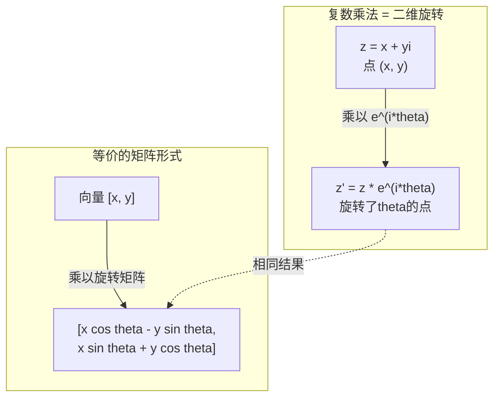
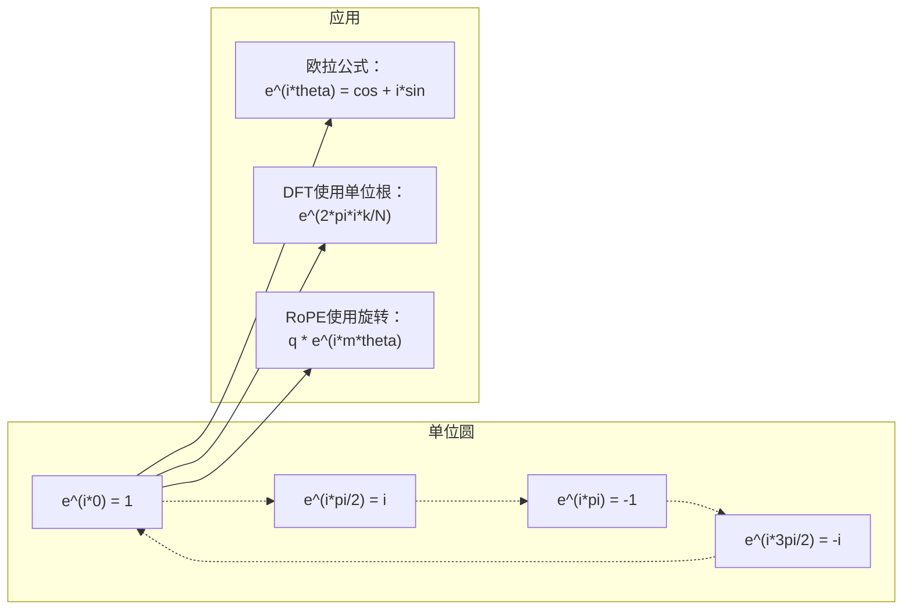

# AI中的复数

> -1的平方根不是想象的。它是旋转、频率和信号处理一半工作的关键。

**类型：** 学习
**语言：** Python
**前置知识：** 第一阶段，第01-04课（线性代数、微积分）
**时间：** ~60分钟

## 学习目标

- 执行复数算术运算（加、乘、除、共轭），包括矩形和极坐标形式
- 应用欧拉公式在复指数和三角函数之间进行转换
- 使用复单位根实现离散傅里叶变换
- 解释复数旋转如何构成Transformer中RoPE和正弦位置编码的基础

## 问题

你打开一篇关于傅里叶变换的论文，到处都是`i`。你查看Transformer位置编码，看到不同频率的`sin`和`cos`——它们是复指数的实部和虚部。你阅读关于量子计算的内容，发现一切都用复向量空间表示。

复数看起来很抽象。一个建立在-1平方根之上的数系感觉像一个数学技巧。但它不是技巧。它是旋转和振荡的自然语言。每当有物体旋转、振动或振荡时，复数就是正确的工具。

不理解复数，你就无法理解离散傅里叶变换。无法理解FFT。无法理解RoPE（旋转位置编码）在现代语言模型中如何工作。无法理解原始Transformer论文中的正弦位置编码为什么使用那些频率。

这节课从头构建复数算术，将其与几何联系起来，并展示复数在机器学习中的确切应用位置。

## 概念

### 什么是复数？

一个复数有两个部分：实部和虚部。

```
z = a + bi

其中：
  a 是实部
  b 是虚部
  i 是虚数单位，定义为 i^2 = -1
```

就是这样。你将数轴扩展成一个平面。实数位于一个轴上。虚数位于另一个轴上。每个复数都是这个平面中的一个点。

### 复数算术

**加法。** 实部相加，虚部相加。

```
(a + bi) + (c + di) = (a + c) + (b + d)i

示例：(3 + 2i) + (1 + 4i) = 4 + 6i
```

**乘法。** 使用分配律，并记住 i^2 = -1。

```
(a + bi)(c + di) = ac + adi + bci + bdi^2
                 = ac + adi + bci - bd
                 = (ac - bd) + (ad + bc)i

示例：(3 + 2i)(1 + 4i) = 3 + 12i + 2i + 8i^2
                            = 3 + 14i - 8
                            = -5 + 14i
```

**共轭。** 翻转虚部的符号。

```
(a + bi) 的共轭 = a - bi
```

复数与其共轭的乘积总是实数：

```
(a + bi)(a - bi) = a^2 + b^2
```

**除法。** 分子和分母同时乘以分母的共轭。

```
(a + bi) / (c + di) = (a + bi)(c - di) / (c^2 + d^2)
```

这消除了分母中的虚部，得到一个干净的复数。

### 复平面

复平面将每个复数映射到一个二维点。水平轴是实轴，垂直轴是虚轴。

```
z = 3 + 2i  对应于点 (3, 2)
z = -1 + 0i 对应于实轴上的点 (-1, 0)
z = 0 + 4i  对应于虚轴上的点 (0, 4)
```

一个复数同时是一个点和一个从原点出发的向量。这种双重解释使复数对几何学非常有用。

### 极坐标形式

平面中的任何点都可以用其到原点的距离和与正实轴的夹角来描述。

```
z = r * (cos(theta) + i*sin(theta))

其中：
  r = |z| = sqrt(a^2 + b^2)     （幅度，或模）
  theta = atan2(b, a)             （相位，或辐角）
```

矩形形式（a + bi）适合加法。极坐标形式（r, theta）适合乘法。

**极坐标形式下的乘法。** 幅度相乘，角度相加。

```
z1 = r1 * e^(i*theta1)
z2 = r2 * e^(i*theta2)

z1 * z2 = (r1 * r2) * e^(i*(theta1 + theta2))
```

这就是为什么复数非常适合旋转。乘以幅度为1的复数就是纯粹的旋转。

### 欧拉公式

连接复指数和三角函数的桥梁：

```
e^(i*theta) = cos(theta) + i*sin(theta)
```

这是本节课最重要的公式。当theta = pi时：

```
e^(i*pi) = cos(pi) + i*sin(pi) = -1 + 0i = -1

因此：e^(i*pi) + 1 = 0
```

五个基本常数（e、i、pi、1、0）在一个方程中联系起来。

### 欧拉公式对ML的重要性

欧拉公式表明，`e^(i*theta)`随着theta的变化描绘出单位圆。在theta = 0时，你位于(1, 0)。在theta = pi/2时，你位于(0, 1)。在theta = pi时，你位于(-1, 0)。在theta = 3*pi/2时，你位于(0, -1)。完整旋转是theta = 2*pi。

这意味着复指数就是旋转。而旋转在信号处理和ML中无处不在。

### 与二维旋转的联系

将复数(x + yi)乘以e^(i*theta)将点(x, y)绕原点旋转角度theta。

```
通过复数乘法旋转：
  (x + yi) * (cos(theta) + i*sin(theta))
  = (x*cos(theta) - y*sin(theta)) + (x*sin(theta) + y*cos(theta))i

通过矩阵乘法旋转：
  [cos(theta)  -sin(theta)] [x]   [x*cos(theta) - y*sin(theta)]
  [sin(theta)   cos(theta)] [y] = [x*sin(theta) + y*cos(theta)]
```

它们产生完全相同的结果。复数乘法就是二维旋转。旋转矩阵只是用矩阵符号表示的复数乘法。



### 相量和旋转信号

复指数e^(i*omega*t)是一个以角频率omega绕单位圆旋转的点。随着t增加，该点描绘出圆的轨迹。

这个旋转点的实部是cos(omega*t)。虚部是sin(omega*t)。正弦信号是一个旋转复数的投影。

```
e^(i*omega*t) = cos(omega*t) + i*sin(omega*t)

实部：      cos(omega*t)    -- 余弦波
虚部： sin(omega*t)    -- 正弦波
```

这就是相量表示。你不再追踪一条波动的正弦曲线，而是追踪一个平稳旋转的箭头。相移变成角度偏移。幅度变化变成幅度改变。信号相加变成向量相加。

### 单位根

N次单位根是单位圆上等间距的N个点：

```
w_k = e^(2*pi*i*k/N)    for k = 0, 1, 2, ..., N-1
```

对于N = 4，单位根是：1, i, -1, -i（四个罗盘点）。
对于N = 8，你得到四个罗盘点加上四个对角线方向。

单位根是离散傅里叶变换的基础。DFT将信号分解为这N个等间距频率的分量。

### 与DFT的联系

信号x[0], x[1], ..., x[N-1]的离散傅里叶变换为：

```
X[k] = sum_{n=0}^{N-1} x[n] * e^(-2*pi*i*k*n/N)
```

每个X[k]度量信号与第k个单位根——频率为k的复正弦波——的相关程度。DFT将信号分解为N个旋转相量，并告诉你每个相量的幅度和相位。

### 为什么i不是想象的

"虚数"这个说法是一个历史意外。笛卡尔轻蔑地使用了它。但i并不比负数在人们最初拒绝它们时更"虚"。负数回答"3减去5得多少？"这个问题。虚数单位回答"什么数的平方等于-1？"这个问题。

更有用的是：i是一个90度旋转算子。将实数乘以i一次，你旋转90度到虚轴。再乘以i一次（i^2），你再旋转90度——现在你指向负实轴方向。这就是为什么i^2 = -1。它并不神秘。它是由两个四分之一圈组成的半圈。

这就是为什么复数在工程中无处不在。任何旋转的东西——电磁波、量子态、信号振荡、位置编码——都可以自然地用复数描述。

### 复指数与三角函数

在欧拉公式之前，工程师将信号写为A*cos(omega*t + phi)——幅度A、频率omega、相位phi。这虽然可行，但使算术运算变得繁琐。将两个不同相位的余弦相加需要三角恒等式。

使用复指数，同样的信号是A*e^(i*(omega*t + phi))。两个信号相加只是两个复数相加。相乘（调制）只是幅度相乘和角度相加。相移变成角度加法。频移变成乘以相量。

整个信号处理领域转向了复指数表示法，因为数学更加简洁。"实际信号"始终只是复数表示的实部。虚部作为辅助记账信息被携带，使所有代数运算自然地执行。

### 与Transformer的联系

**正弦位置编码**（原始Transformer论文）：

```
PE(pos, 2i) = sin(pos / 10000^(2i/d))
PE(pos, 2i+1) = cos(pos / 10000^(2i/d))
```

sin和cos对是不同频率复指数的实部和虚部。每个频率提供了编码位置的不同的"分辨率"。低频变化缓慢（粗略位置）。高频变化迅速（精细位置）。它们共同为每个位置提供了独特的频率指纹。

**RoPE（旋转位置嵌入）** 更进一步。它显式地将查询和键向量乘以复数旋转矩阵。两个标记之间的相对位置变成了一个旋转角度。注意力使用这些旋转后的向量进行计算，使模型通过复数乘法对相对位置敏感。

| 操作 | 代数形式 | 几何意义 |
|-----------|---------------|-------------------|
| 加法 | (a+c) + (b+d)i | 平面中的向量加法 |
| 乘法 | (ac-bd) + (ad+bc)i | 旋转和缩放 |
| 共轭 | a - bi | 关于实轴反射 |
| 幅度 | sqrt(a^2 + b^2) | 到原点的距离 |
| 相位 | atan2(b, a) | 与正实轴的夹角 |
| 除法 | 乘以共轭 | 反向旋转和重新缩放 |
| 幂 | r^n * e^(i*n*theta) | 旋转n次，按r^n缩放 |



```figure
roots-of-unity
```

## 构建

### 步骤1：复数类

构建一个支持算术运算、幅度、相位以及矩形和极坐标形式之间转换的复数类。

```python
import math

class Complex:
    def __init__(self, real, imag=0.0):
        self.real = real
        self.imag = imag

    def __add__(self, other):
        return Complex(self.real + other.real, self.imag + other.imag)

    def __mul__(self, other):
        r = self.real * other.real - self.imag * other.imag
        i = self.real * other.imag + self.imag * other.real
        return Complex(r, i)

    def __truediv__(self, other):
        denom = other.real ** 2 + other.imag ** 2
        r = (self.real * other.real + self.imag * other.imag) / denom
        i = (self.imag * other.real - self.real * other.imag) / denom
        return Complex(r, i)

    def magnitude(self):
        return math.sqrt(self.real ** 2 + self.imag ** 2)

    def phase(self):
        return math.atan2(self.imag, self.real)

    def conjugate(self):
        return Complex(self.real, -self.imag)
```

### 步骤2：极坐标转换和欧拉公式

```python
def to_polar(z):
    return z.magnitude(), z.phase()

def from_polar(r, theta):
    return Complex(r * math.cos(theta), r * math.sin(theta))

def euler(theta):
    return Complex(math.cos(theta), math.sin(theta))
```

验证：`euler(theta).magnitude()` 应始终为 1.0。`euler(0)` 应得到 (1, 0)。`euler(pi)` 应得到 (-1, 0)。

### 步骤3：旋转

将点(x, y)旋转角度theta就是一次复数乘法：

```python
point = Complex(3, 4)
rotated = point * euler(math.pi / 4)
```

幅度保持不变。只有角度发生变化。

### 步骤4：基于复数算术的DFT

```python
def dft(signal):
    N = len(signal)
    result = []
    for k in range(N):
        total = Complex(0, 0)
        for n in range(N):
            angle = -2 * math.pi * k * n / N
            total = total + Complex(signal[n], 0) * euler(angle)
        result.append(total)
    return result
```

这是O(N^2)的DFT。每个输出X[k]是信号样本乘以单位根后的总和。

### 步骤5：逆DFT

逆DFT从其频谱重建原始信号。与前向DFT相比，唯一的变化是：翻转指数中的符号并除以N。

```python
def idft(spectrum):
    N = len(spectrum)
    result = []
    for n in range(N):
        total = Complex(0, 0)
        for k in range(N):
            angle = 2 * math.pi * k * n / N
            total = total + spectrum[k] * euler(angle)
        result.append(Complex(total.real / N, total.imag / N))
    return result
```

这给你完美的重建。应用DFT，然后IDFT，你将得到机器精度范围内的原始信号。没有任何信息丢失。

### 步骤6：单位根

```python
def roots_of_unity(N):
    return [euler(2 * math.pi * k / N) for k in range(N)]
```

验证两个性质：
- 每个根的幅度恰好为1。
- 所有N个根的和为零（它们通过对称性相互抵消）。

这些性质使DFT可逆。单位根构成了频域的正交基。

## 使用

Python内建了复数支持。字面量`j`表示虚数单位。

```python
z = 3 + 2j
w = 1 + 4j

print(z + w)
print(z * w)
print(abs(z))

import cmath
print(cmath.phase(z))
print(cmath.exp(1j * cmath.pi))
```

对于数组，numpy原生处理复数：

```python
import numpy as np

z = np.array([1+2j, 3+4j, 5+6j])
print(np.abs(z))
print(np.angle(z))
print(np.conj(z))
print(np.real(z))
print(np.imag(z))

signal = np.sin(2 * np.pi * 5 * np.linspace(0, 1, 128))
spectrum = np.fft.fft(signal)
freqs = np.fft.fftfreq(128, d=1/128)
```

## 交付

运行 `code/complex_numbers.py` 生成 `outputs/skill-complex-arithmetic.md`。

## 练习

1. **手算复数算术。** 计算(2 + 3i) * (4 - i)并用代码验证。然后计算(5 + 2i) / (1 - 3i)。在复平面上画出两个结果，并检查乘法是否旋转和缩放了第一个数。

2. **旋转序列。** 从点(1, 0)开始。乘以e^(i*pi/6)十二次。验证12次乘法后你回到(1, 0)。打印每一步的坐标，确认它们描绘出一个正十二边形。

3. **已知信号的DFT。** 创建一个信号，它是sin(2*pi*3*t)和0.5*sin(2*pi*7*t)的和，在32个点处采样。运行你的DFT。验证幅度谱在频率3和7处有峰值，且7处的峰值高度是3处峰值的一半。

4. **单位根可视化。** 计算8次单位根。验证它们的和为零。验证将任何根乘以本原根e^(2*pi*i/8)会得到下一个根。

5. **旋转矩阵等价性。** 对10个随机角度和10个随机点，验证复数乘法与使用2x2旋转矩阵进行矩阵向量乘法得到相同的结果。打印最大数值差异。

## 关键术语

| 术语 | 含义 |
|------|---------------|
| 复数 | 形如a + bi的数，其中a是实部，b是虚部，i^2 = -1 |
| 虚数单位 | 数i，定义为i^2 = -1。在哲学意义上并不"虚"——它是一个旋转算子 |
| 复平面 | x轴为实轴、y轴为虚轴的二维平面。也称为阿甘平面 |
| 幅度（模） | 到原点的距离：sqrt(a^2 + b^2)。写作|z| |
| 相位（辐角） | 与正实轴的夹角：atan2(b, a)。写作arg(z) |
| 共轭 | 关于实轴的镜像：a + bi的共轭是a - bi |
| 极坐标形式 | 将z表示为r * e^(i*theta)而不是a + bi。使乘法变得简单 |
| 欧拉公式 | e^(i*theta) = cos(theta) + i*sin(theta)。连接指数函数和三角函数 |
| 相量 | 表示正弦信号的旋转复数 e^(i*omega*t) |
| 单位根 | 在k = 0到N-1时，N个复数e^(2*pi*i*k/N)。单位圆上N个等间距的点 |
| DFT | 离散傅里叶变换。使用单位根将信号分解为复正弦分量 |
| RoPE | 旋转位置嵌入。使用复数乘法在Transformer注意力中编码相对位置 |

## 拓展阅读

- [Visual Introduction to Euler's Formula](https://betterexplained.com/articles/intuitive-understanding-of-eulers-formula/) - 无需繁琐符号建立几何直觉
- [Su et al.: RoFormer (2021)](https://arxiv.org/abs/2104.09864) - 介绍使用复数旋转的旋转位置嵌入的论文
- [Vaswani et al.: Attention Is All You Need (2017)](https://arxiv.org/abs/1706.03762) - 具有正弦位置编码的原始Transformer论文
- [3Blue1Brown: Euler's formula with introductory group theory](https://www.youtube.com/watch?v=mvmuCPvRoWQ) - 为什么e^(i*pi) = -1的视觉解释
- [Needham: Visual Complex Analysis](https://global.oup.com/academic/product/visual-complex-analysis-9780198534464) - 最好的复数可视化教材，充满几何洞见
- [Strang: Introduction to Linear Algebra, Ch. 10](https://math.mit.edu/~gs/linearalgebra/) - 线性代数和特征值背景下的复数
