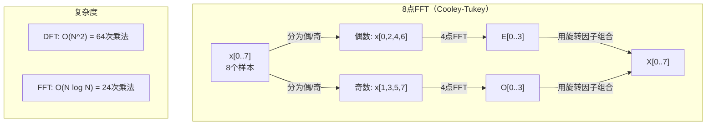
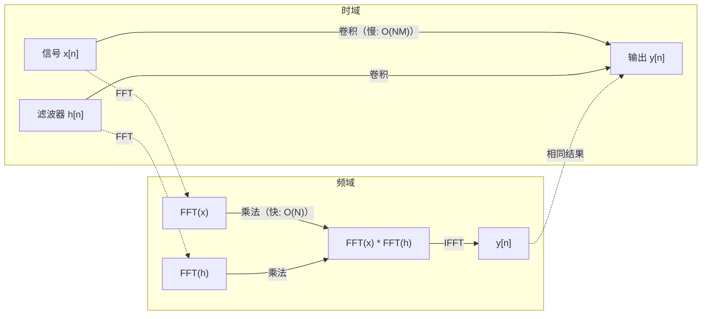

# 傅里叶变换

> 每个信号都是正弦波的和。傅里叶变换告诉你它们是什么。

**类型：** 构建
**语言：** Python
**前置知识：** 第一阶段，第01-04课，第19课（复数）
**时间：** ~90分钟

## 学习目标

- 从头实现DFT并验证其与O(N log N)的Cooley-Tukey FFT的一致性
- 解释频率系数：从信号中提取幅度、相位和功率谱
- 应用卷积定理，通过FFT乘法执行卷积
- 将傅里叶频率分解与Transformer位置编码和CNN卷积层联系起来

## 问题

音频录音是一系列随时间变化的气压测量值。股票价格是一系列随天数变化的值。图像是像素强度在空间上的网格。这些都是时域（或空域）中的数据。你可以看到值随某种索引变化。

但许多模式在时域中是看不见的。这个音频信号是纯音还是和弦？这个股票价格有每周周期吗？这个图像有重复纹理吗？这些问题都是关于频率内容的，时域隐藏了这些信息。

傅里叶变换将数据从时域转换到频域。它接收一个信号并将其分解为不同频率的正弦波。每个正弦波都有一个幅度（有多强）和一个相位（从哪里开始）。傅里叶变换告诉你两者。

这对ML很重要，因为频域思维无处不在。卷积神经网络执行卷积运算，这在频域中是乘法。Transformer位置编码使用频率分解来表示位置。音频模型（语音识别、音乐生成）在频谱图上操作——这是声音的频率表示。时间序列模型寻找周期模式。理解傅里叶变换为你提供了处理所有这些问题的词汇。

## 概念

### DFT定义

给定N个样本x[0], x[1], ..., x[N-1]，离散傅里叶变换产生N个频率系数X[0], X[1], ..., X[N-1]：

```
X[k] = sum_{n=0}^{N-1} x[n] * e^(-2*pi*i*k*n/N)

对于 k = 0, 1, ..., N-1
```

每个X[k]是一个复数。其幅度|X[k]|告诉你频率k的幅度。其相位angle(X[k])告诉你该频率的相位偏移。

关键洞见：`e^(-2*pi*i*k*n/N)` 是一个频率为k的旋转相量。DFT计算信号与N个等间距频率中每一个的相关性。如果信号在频率k处有能量，相关性就大。如果没有，就接近于零。

### 每个系数的含义

**X[0]：直流分量。** 这是所有样本的和——与均值成正比。它代表信号的常数（零频率）偏移。

```
X[0] = sum_{n=0}^{N-1} x[n] * e^0 = 所有样本的和
```

**X[k]，1 <= k <= N/2：正频率。** X[k]表示每N个样本k周期的频率。更高的k意味着更高的频率（更快的振荡）。

**X[N/2]：奈奎斯特频率。** 用N个样本可以表示的最高频率。超过这个频率，你会得到混叠——高频伪装成低频。

**X[k]，N/2 < k < N：负频率。** 对于实值信号，X[N-k] = conj(X[k])。负频率是正频率的镜像。这就是为什么有用信息在前N/2 + 1个系数中。

### 逆DFT

逆DFT从其频率系数重建原始信号：

```
x[n] = (1/N) * sum_{k=0}^{N-1} X[k] * e^(2*pi*i*k*n/N)

对于 n = 0, 1, ..., N-1
```

与前向DFT的唯一区别：指数中的符号为正（而非负），并且有一个1/N的归一化因子。

逆DFT是完美的重建。没有信息丢失。你可以从时域到频域再回来而没有任何误差。DFT是一个基变换——它用不同的坐标系重新表达相同的信息。

### FFT：使其快速

上述定义的DFT是O(N^2)的：对于N个输出系数中的每一个，你求和N个输入样本。对于N = 100万，那是10^12次操作。

快速傅里叶变换（FFT）在O(N log N)内计算出相同的结果。对于N = 100万，那大约是2000万次操作而不是一万亿。这就是频率分析变得实用的原因。

Cooley-Tukey算法（最常见的FFT）通过分治策略工作：

1. 将信号分为偶数索引和奇数索引的样本。
2. 递归计算每一半的DFT。
3. 使用"旋转因子"e^(-2*pi*i*k/N)组合两个半尺寸的DFT。

```
X[k] = E[k] + e^(-2*pi*i*k/N) * O[k]          对于 k = 0, ..., N/2 - 1
X[k + N/2] = E[k] - e^(-2*pi*i*k/N) * O[k]    对于 k = 0, ..., N/2 - 1

其中 E = 偶数索引样本的DFT
      O = 奇数索引样本的DFT
```

对称性意味着每个递归层级执行O(N)工作，共有log2(N)层。总计：O(N log N)。



FFT要求信号长度为2的幂。实践中，信号会被零填充到下一个2的幂。

### 频谱分析

**功率谱**是|X[k]|^2——每个频率系数的幅度平方。它显示每个频率有多少能量。

**相位谱**是angle(X[k])——每个频率的相位偏移。对于大多数分析任务，你关心的是功率谱而忽略相位。

```
频率k处的功率：  P[k] = |X[k]|^2 = X[k].real^2 + X[k].imag^2
频率k处的相位：  phi[k] = atan2(X[k].imag, X[k].real)
```

### 频率分辨率

DFT的频率分辨率取决于样本数N和采样率fs。

```
区间k的频率：      f_k = k * fs / N
频率分辨率：    delta_f = fs / N
最大频率：       f_max = fs / 2  (奈奎斯特)
```

要分辨靠得很近的两个频率，你需要更多样本。要捕获高频，你需要更高的采样率。

### 卷积定理

这是信号处理中最重要的结果之一，且与CNN直接相关。

**时域中的卷积等于频域中的逐点乘法。**

```
x * h = IFFT(FFT(x) . FFT(h))

其中 * 是卷积，. 是逐元素乘法
```

为什么这很重要：

- 长度为N和M的两个信号的直接卷积需要O(N*M)次操作。
- 基于FFT的卷积需要O(N log N)：变换两者，相乘，逆变换回去。
- 对于大核，FFT卷积速度显著更快。
- 这正是卷积层中具有大感受野时发生的事情。

注意：DFT计算的是循环卷积（信号会环绕）。对于线性卷积（无环绕），在计算之前将两个信号零填充到长度N + M - 1。



### 加窗

DFT假设信号是周期性的——它将N个样本视为无限重复信号的一个周期。如果信号的起始值和结束值不同，这会在边界处产生不连续性，表现为虚假的高频内容。这称为频谱泄漏。

加窗通过在计算DFT之前将信号两端逐渐减小到零来减少泄漏。

常见的窗函数：

| 窗函数 | 形状 | 主瓣宽度 | 旁瓣电平 | 使用场景 |
|--------|-------|----------------|-----------------|----------|
| 矩形 | 平坦（无窗） | 最窄 | 最高（-13 dB） | 信号在N个样本中恰好是周期性的 |
| Hann | 升余弦 | 适中 | 低（-31 dB） | 通用频谱分析 |
| Hamming | 修正余弦 | 适中 | 更低（-42 dB） | 音频处理，语音分析 |
| Blackman | 三余弦 | 宽 | 非常低（-58 dB） | 当旁瓣抑制至关重要时 |

```
Hann窗：    w[n] = 0.5 * (1 - cos(2*pi*n / (N-1)))
Hamming窗： w[n] = 0.54 - 0.46 * cos(2*pi*n / (N-1))
```

通过在DFT之前将窗函数与信号逐元素相乘来应用：`X = DFT(x * w)`。

### DFT性质

| 性质 | 时域 | 频域 |
|----------|-------------|-----------------|
| 线性 | a*x + b*y | a*X + b*Y |
| 时移 | x[n - k] | X[f] * e^(-2*pi*i*f*k/N) |
| 频移 | x[n] * e^(2*pi*i*f0*n/N) | X[f - f0] |
| 卷积 | x * h | X * H（逐点） |
| 乘法 | x * h（逐点） | X * H（循环卷积，缩放1/N） |
| 帕塞瓦尔定理 | sum |x[n]|^2 | (1/N) * sum |X[k]|^2 |
| 共轭对称（实输入） | x[n]为实 | X[k] = conj(X[N-k]) |

帕塞瓦尔定理说明总能量在两个域中是相同的。能量通过变换守恒。

### 与位置编码的联系

原始Transformer使用正弦位置编码：

```
PE(pos, 2i)   = sin(pos / 10000^(2i/d_model))
PE(pos, 2i+1) = cos(pos / 10000^(2i/d_model))
```

每个维度对(2i, 2i+1)以不同的频率振荡。频率从高（维度0,1）到低（最后维度）呈几何级数分布。这给每个位置在所有频带上提供了独特的模式——类似于傅里叶系数唯一标识信号的方式。

这提供的关键性质：

- **唯一性：** 没有两个位置具有相同的编码。
- **有界值：** sin和cos始终在[-1, 1]内。
- **相对位置：** 位置p+k的编码可以表示为位置p编码的线性函数。模型可以学习关注相对位置。

### 与CNN的联系

卷积层通过将学习到的滤波器（核）在信号或图像上滑动来应用于输入。数学上，这就是卷积运算。

根据卷积定理，这等价于：
1. 对输入进行FFT
2. 对核进行FFT
3. 在频域中相乘
4. 对结果进行IFFT

标准的CNN实现使用直接卷积（对于小的3x3核更快）。但对于大核或全局卷积，基于FFT的方法显著更快。一些架构（如FNet）完全用FFT替代注意力，以O(N log N)而非O(N^2)的复杂度实现了有竞争力的准确性。

### 频谱图和短时傅里叶变换

单次FFT给出整个信号的频率内容，但对你来说当这些频率出现时毫无信息。一个啁啾信号（频率随时间增加的信号）和一个和弦（所有频率同时出现）可以有相同的幅度谱。

短时傅里叶变换（STFT）通过在信号的重叠窗口上计算FFT来解决这个问题。结果是频谱图：一个二维表示，时间在一个轴上，频率在另一个轴上。每个点的强度显示在该时刻该频率的能量。

```
STFT过程：
1. 选择窗口大小（例如，1024个样本）
2. 选择跳跃大小（例如，256个样本——75%重叠）
3. 对于每个窗口位置：
   a. 提取加窗的片段
   b. 应用Hann/Hamming窗
   c. 计算FFT
   d. 将幅度谱存储为频谱图的一列
```

频谱图是音频ML模型的标准输入表示。语音识别模型（Whisper、DeepSpeech）在梅尔频谱图上操作——频率被映射到梅尔标度的频谱图，这更符合人类对音高的感知。

### 混叠

如果信号包含高于fs/2（奈奎斯特频率）的频率，以速率fs采样将产生混叠副本。一个以100 Hz采样的90 Hz信号看起来与10 Hz信号完全相同。仅从样本本身无法区分它们。

```
示例：
  真实信号：90 Hz正弦波
  采样率：100 Hz
  表观频率：100 - 90 = 10 Hz

  以100 Hz采样率采样90 Hz信号得到的样本
  与10 Hz信号的样本完全相同。
  没有任何数学方法可以恢复原始的90 Hz。
```

这就是为什么模数转换器包含抗混叠滤波器，在采样前去除奈奎斯特频率以上的频率。在ML中，当在没有适当低通滤波的情况下对特征图进行降采样时会出现混叠——一些架构通过抗混叠池化层来解决这个问题。

### 零填充不会提高分辨率

一个常见的误解：在FFT之前对信号进行零填充可以提高频率分辨率。实际上并不会。零填充在现有频率区间之间进行插值，给你一个更平滑的频谱外观。但它不能揭示原始样本中不存在的频率细节。

真正的频率分辨率仅取决于观测时间T = N / fs。要分辨间隔为delta_f的两个频率，你至少需要T = 1 / delta_f秒的数据。再多的零填充也无法改变这个基本极限。

```figure
fourier-synthesis
```

## 构建

### 步骤1：从头实现DFT

O(N^2)的DFT直接来自定义。

```python
import math

class Complex:
    ...

def dft(x):
    N = len(x)
    result = []
    for k in range(N):
        total = Complex(0, 0)
        for n in range(N):
            angle = -2 * math.pi * k * n / N
            w = Complex(math.cos(angle), math.sin(angle))
            xn = x[n] if isinstance(x[n], Complex) else Complex(x[n])
            total = total + xn * w
        result.append(total)
    return result
```

### 步骤2：逆DFT

相同的结构，正指数，除以N。

```python
def idft(X):
    N = len(X)
    result = []
    for n in range(N):
        total = Complex(0, 0)
        for k in range(N):
            angle = 2 * math.pi * k * n / N
            w = Complex(math.cos(angle), math.sin(angle))
            total = total + X[k] * w
        result.append(Complex(total.real / N, total.imag / N))
    return result
```

### 步骤3：FFT（Cooley-Tukey）

递归FFT要求长度为2的幂。分成偶数和奇数，递归，用旋转因子组合。

```python
def fft(x):
    N = len(x)
    if N <= 1:
        return [x[0] if isinstance(x[0], Complex) else Complex(x[0])]
    if N % 2 != 0:
        return dft(x)

    even = fft([x[i] for i in range(0, N, 2)])
    odd = fft([x[i] for i in range(1, N, 2)])

    result = [Complex(0)] * N
    for k in range(N // 2):
        angle = -2 * math.pi * k / N
        twiddle = Complex(math.cos(angle), math.sin(angle))
        t = twiddle * odd[k]
        result[k] = even[k] + t
        result[k + N // 2] = even[k] - t
    return result
```

### 步骤4：频谱分析辅助函数

```python
def power_spectrum(X):
    return [xk.real ** 2 + xk.imag ** 2 for xk in X]

def convolve_fft(x, h):
    N = len(x) + len(h) - 1
    padded_N = 1
    while padded_N < N:
        padded_N *= 2

    x_padded = x + [0.0] * (padded_N - len(x))
    h_padded = h + [0.0] * (padded_N - len(h))

    X = fft(x_padded)
    H = fft(h_padded)

    Y = [xk * hk for xk, hk in zip(X, H)]

    y = idft(Y)
    return [y[n].real for n in range(N)]
```

## 使用

在实际工作中，使用numpy的FFT，它在底层由高度优化的C库支持。

```python
import numpy as np

signal = np.sin(2 * np.pi * 5 * np.arange(256) / 256)
spectrum = np.fft.fft(signal)
freqs = np.fft.fftfreq(256, d=1/256)

power = np.abs(spectrum) ** 2

positive_freqs = freqs[:len(freqs)//2]
positive_power = power[:len(power)//2]
```

对于加窗和更高级的频谱分析：

```python
from scipy.signal import windows, stft

window = windows.hann(256)
windowed = signal * window
spectrum = np.fft.fft(windowed)
```

对于卷积：

```python
from scipy.signal import fftconvolve

result = fftconvolve(signal, kernel, mode='full')
```

对于频谱图：

```python
from scipy.signal import stft

frequencies, times, Zxx = stft(signal, fs=sample_rate, nperseg=256)
spectrogram = np.abs(Zxx) ** 2
```

频谱图矩阵的形状为(n_frequencies, n_time_frames)。每列是一个时间窗口的功率谱。这就是音频ML模型作为输入消费的内容。

## 交付

运行 `code/fourier.py` 生成 `outputs/prompt-spectral-analyzer.md`。

## 练习

1. **纯音识别。** 创建一个包含单个未知频率（1到50 Hz之间）正弦波的信号，以128 Hz采样1秒。使用你的DFT识别该频率。验证答案是否匹配。现在添加标准差为0.5的高斯噪声并重复。噪声如何影响频谱？

2. **FFT与DFT验证。** 生成长度为64的随机信号。计算DFT（O(N^2)）和FFT。验证所有系数匹配到1e-10以内。在长度为256、512、1024和2048的信号上对比两种函数的时间。绘制DFT时间与FFT时间的比率图。

3. **卷积定理的实例证明。** 创建信号x = [1, 2, 3, 4, 0, 0, 0, 0]和滤波器h = [1, 1, 1, 0, 0, 0, 0, 0]。直接计算它们的循环卷积（嵌套循环）。然后通过FFT计算（变换、相乘、逆变换）。验证结果匹配。现在通过适当的零填充进行线性卷积。

4. **加窗效果。** 创建一个信号，它是10 Hz和12 Hz（非常接近）两个正弦波的和。以128 Hz采样1秒。计算无窗、Hann窗和Hamming窗下的功率谱。哪个窗口最容易区分这两个峰值？为什么？

5. **位置编码分析。** 为d_model = 128和max_pos = 512生成正弦位置编码。对每对位置(p1, p2)，计算其编码的点积。证明点积仅依赖于|p1 - p2|，而不依赖于绝对位置。随着距离增加，点积会发生什么变化？

## 关键术语

| 术语 | 含义 |
|------|---------------|
| DFT（离散傅里叶变换） | 将N个时域样本转换为N个频域系数。每个系数是与该频率复正弦波的相关性 |
| FFT（快速傅里叶变换） | 计算DFT的O(N log N)算法。Cooley-Tukey算法递归拆分偶/奇索引 |
| 逆DFT | 从频率系数重建时域信号。与DFT公式相同，但指数符号翻转和1/N缩放 |
| 频率区间 | DFT输出中的每个索引k代表频率k*fs/N Hz。"区间"是离散的频率槽 |
| 直流分量 | X[0]，零频率系数。与信号均值成正比 |
| 奈奎斯特频率 | fs/2，在采样率fs下可表示的最高频率。超过此频率会出现混叠 |
| 功率谱 | |X[k]|^2，每个频率系数的幅度平方。显示频率间能量分布 |
| 相位谱 | angle(X[k])，每个频率分量的相位偏移。在分析中通常忽略 |
| 频谱泄漏 | 将非周期信号视为周期性导致产生的虚假频率内容。通过加窗减少 |
| 窗函数 | 在DFT之前应用的锥形函数（Hann、Hamming、Blackman），用于减少频谱泄漏 |
| 旋转因子 | 用于在FFT蝶形计算中组合子DFT的复指数e^(-2*pi*i*k/N) |
| 卷积定理 | 时域中的卷积等于频域中的逐点乘法。信号处理和CNN的基础 |
| 循环卷积 | 信号环绕的卷积。这是DFT自然计算的方式 |
| 线性卷积 | 无环绕的标准卷积。通过在DFT之前零填充实现 |
| 帕塞瓦尔定理 | 傅里叶变换中总能量守恒。sum |x[n]|^2 = (1/N) sum |X[k]|^2 |
| 混叠 | 当采样率不足时，奈奎斯特频率以上的频率表现为较低频率 |

## 拓展阅读

- [Cooley & Tukey: An Algorithm for the Machine Calculation of Complex Fourier Series (1965)](https://www.ams.org/journals/mcom/1965-19-090/S0025-5718-1965-0178586-1/) - 改变了计算领域的原始FFT论文
- [3Blue1Brown: But what is the Fourier Transform?](https://www.youtube.com/watch?v=spUNpyF58BY) - 最好的傅里叶变换视觉介绍
- [Lee-Thorp et al.: FNet: Mixing Tokens with Fourier Transforms (2021)](https://arxiv.org/abs/2105.03824) - 在Transformer中用FFT替换自注意力
- [Smith: The Scientist and Engineer's Guide to Digital Signal Processing](http://www.dspguide.com/) - 免费在线教科书，深入介绍FFT、加窗和频谱分析
- [Vaswani et al.: Attention Is All You Need (2017)](https://arxiv.org/abs/1706.03762) - 从傅里叶频率分解推导出的正弦位置编码
- [Radford et al.: Whisper (2022)](https://arxiv.org/abs/2212.04356) - 使用梅尔频谱图作为输入表示的语音识别
