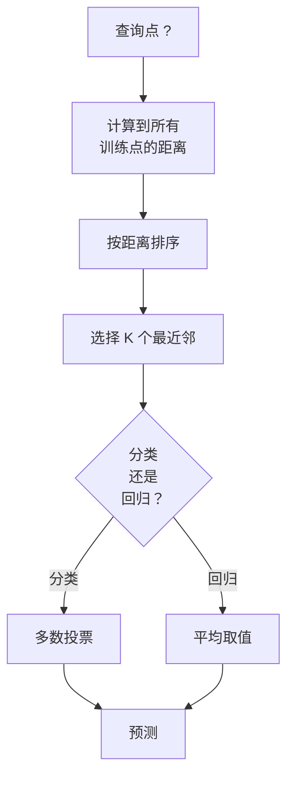
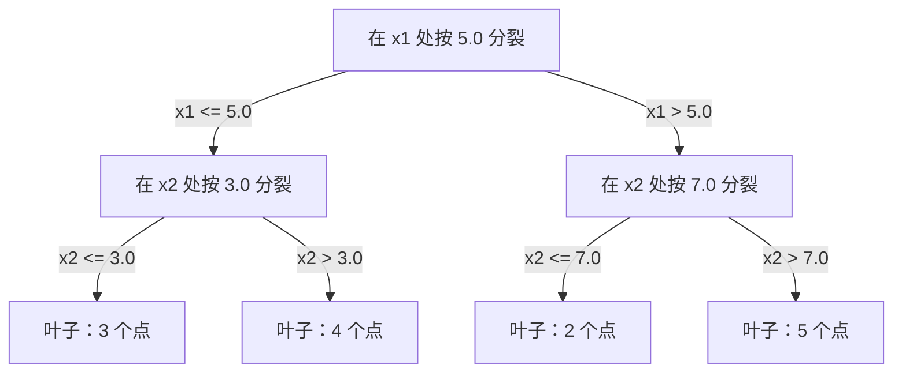

# K-近邻与距离

> 存储一切。通过查看邻居来预测。实际上有效的最简单算法。

**类型：** 构建
**语言：** Python
**前置知识：** 阶段 1（第 14 课 范数与距离）
**时间：** ~90 分钟

## 学习目标

- 从头实现 KNN 分类和回归，支持可配置的 K 和距离加权投票
- 比较 L1、L2、余弦和闵可夫斯基距离度量，并为给定数据类型选择合适的度量
- 解释维度诅咒，并演示为什么 KNN 在高维空间中性能下降
- 构建 KD 树以实现高效的最近邻搜索，并分析它何时优于暴力搜索

## 问题

你有一个数据集。一个新数据点到达。你需要对其进行分类或预测其值。与其从数据中学习参数（如线性回归或 SVM），你只需找到与新点最接近的 K 个训练点，并让它们投票。

这就是 K-近邻算法。没有训练阶段。没有参数要学习。没有损失函数要最小化。你存储整个训练集，并在预测时计算距离。

这听起来太简单以至于不能工作。但 KNN 对许多问题出奇地有竞争力，特别是中小型数据集，并且深入理解它揭示了基本概念：距离度量的选择（与阶段 1 第 14 课相关）、维度诅咒以及懒学习和急切学习之间的区别。

KNN 也以不同的名称出现在现代 AI 的各个地方。向量数据库在嵌入上做 KNN 搜索。检索增强生成（RAG）找到最接近的 K 个文档块。推荐系统找到相似的用户或物品。算法是一样的。规模和数据结构不同。

## 概念

### KNN 的工作原理

给定一个带标签的数据集和一个新的查询点：

1. 计算查询点到数据集中每个点的距离
2. 按距离排序
3. 取最接近的 K 个点
4. 对于分类：K 个邻居的多数投票
5. 对于回归：K 个邻居值的平均值（或加权平均值）



这就是整个算法。没有拟合。没有梯度下降。没有 epoch。

### 选择 K

K 是唯一的超参数。它控制偏差-方差权衡：

| K | 行为 |
|---|------|
| K = 1 | 决策边界跟随每个点。训练误差为零。高方差。过拟合 |
| 小 K（3-5）| 对局部结构敏感。可以捕捉复杂的边界 |
| 大 K | 更平滑的边界。对噪声更鲁棒。可能欠拟合 |
| K = N | 对每个点预测多数类。最大偏差 |

常见的起点是对于 N 个点的数据集，K = sqrt(N)。对于二分类使用奇数的 K 以避免平局。


### 距离度量

距离函数定义了"近"的含义。不同的度量产生不同的邻居、不同的预测。

**L2（欧几里得）** 是默认值。直线距离。

```
d(a, b) = sqrt(sum((a_i - b_i)^2))
```

对特征尺度敏感。在使用 L2 进行 KNN 之前，始终标准化特征。

**L1（曼哈顿）** 求和绝对差。比 L2 对离群点更鲁棒，因为它不平方差值。

```
d(a, b) = sum(|a_i - b_i|)
```

**余弦距离** 衡量向量之间的角度，忽略幅度。对于文本和嵌入数据至关重要。

```
d(a, b) = 1 - (a . b) / (||a|| * ||b||)
```

**闵可夫斯基距离** 用参数 p 概括了 L1 和 L2。

```
d(a, b) = (sum(|a_i - b_i|^p))^(1/p)

p=1: 曼哈顿距离
p=2: 欧几里得距离
p->inf: 切比雪夫距离（最大绝对差）
```

使用哪种度量取决于数据：

| 数据类型 | 最佳度量 | 原因 |
|---------|---------|------|
| 数值特征，相似尺度 | L2（欧几里得） | 默认，适用于空间数据 |
| 数值特征，有离群点 | L1（曼哈顿） | 鲁棒，不放大大的差异 |
| 文本嵌入 | 余弦 | 幅度是噪声，方向是意义 |
| 高维稀疏 | 余弦或 L1 | L2 受维度诅咒影响 |
| 混合类型 | 自定义距离 | 按特征类型组合度量 |

### 加权 KNN

标准 KNN 对所有 K 个邻居赋予相同的权重。但距离 0.1 的邻居应该比距离 5.0 的更重要。

**距离加权 KNN** 以距离的倒数对每个邻居加权：

```
weight_i = 1 / (distance_i + epsilon)

对于分类：加权投票
对于回归：加权平均 = sum(w_i * y_i) / sum(w_i)
```

epsilon 防止查询点与训练点完全匹配时除以零。

加权 KNN 对 K 的选择不那么敏感，因为无论 K 值如何，远处的邻居贡献都非常小。

### 维度诅咒

KNN 性能在高维空间中下降。这不是一个模糊的担忧。这是一个数学事实。

**问题 1：距离收敛。** 随着维度增加，最大距离与最小距离之比趋近于 1。所有点与查询点的距离变得几乎相等。

```
在 d 维中，对于随机均匀点：

d=2:    max_dist / min_dist = 变化很大
d=100:  max_dist / min_dist ~ 1.01
d=1000: max_dist / min_dist ~ 1.001

当所有距离几乎相等时，"最近"毫无意义。
```

**问题 2：体积爆炸。** 要在固定比例的数据中捕获 K 个邻居，你需要将搜索半径扩展到覆盖特征空间中更大的部分。"邻域"在高维空间中包含了大部分空间。

**问题 3：角落主导。** 在 d 维单位超立方体中，大部分体积集中在靠近角落的地方，而不是中心。内切于立方体的球体随着 d 的增长只包含极小部分的体积。

实际后果：KNN 在约 20-50 个特征以下表现良好。超过这个范围，你需要先进行降维（PCA、UMAP、t-SNE）再应用 KNN，或者需要使用利用数据更低内在维度的基于树的搜索结构。

### KD 树：快速最近邻搜索

暴力 KNN 计算查询点到每个训练点的距离。每个查询 O(n * d)。对于大数据集，这太慢了。

KD 树递归地沿特征轴划分空间。在每一层，它沿着一个维度在中位数处分裂。



要找到最近邻，遍历树到包含查询点的叶子，然后回溯，只有当相邻分区可能包含更近的点时才检查它们。

平均查询时间：低维为 O(log n)。但 KD 树在高维（d > 20）中退化为 O(n)，因为回溯越来越少地减少分支。

### 球树：适用于中等维度

球树将数据划分为嵌套的超球体，而不是轴向对齐的盒子。每个节点定义一个球（中心 + 半径），包含该子树中的所有点。

相对于 KD 树的优势：
- 在中等维度（最高约 50）中效果更好
- 处理非轴向对齐的结构
- 更紧密的边界体积意味着在搜索过程中修剪更多分支

KD 树和球树都是精确算法。对于真正的大规模搜索（数百万个点，数百个维度），使用近似最近邻方法（HNSW、IVF、乘积量化）。这些在阶段 1 第 14 课中有所介绍。

### 懒学习 vs 急切学习

KNN 是一个懒学习器：它在训练时不工作，所有工作在预测时完成。大多数其他算法（线性回归、SVM、神经网络）是急切学习器：它们在训练时进行大量计算以构建一个紧凑的模型，然后预测很快。

| 方面 | 懒（KNN） | 急切（SVM、神经网络） |
|------|----------|-------------------|
| 训练时间 | O(1) 只存储数据 | O(n * epochs) |
| 预测时间 | 每个查询 O(n * d) | O(d) 或 O(参数) |
| 预测时的内存 | 存储整个训练集 | 只存储模型参数 |
| 适应新数据 | 立即添加点 | 重新训练模型 |
| 决策边界 | 隐式，即时计算 | 显式，训练后固定 |

懒学习适合以下情况：
- 数据集频繁变化（无需重新训练即可添加/移除点）
- 你只需要对极少数查询进行预测
- 你想要零训练时间
- 数据集足够小，暴力搜索很快

### KNN 回归

KNN 回归不使用多数投票，而是对 K 个邻居的目标值取平均。

```
prediction = (1/K) * sum(y_i for i in K nearest neighbors)

或者采用距离加权：
prediction = sum(w_i * y_i) / sum(w_i)
其中 w_i = 1 / distance_i
```

KNN 回归产生分段常数（或加权后分段平滑）的预测。它不能外推到训练数据范围之外。如果训练目标都在 0 到 100 之间，KNN 永远不会预测 200。

```figure
knn-smoothness
```

## 构建

### 步骤 1：距离函数

实现 L1、L2、余弦和闵可夫斯基距离。这些直接与阶段 1 第 14 课相关。

```python
import math

def l2_distance(a, b):
    return math.sqrt(sum((ai - bi) ** 2 for ai, bi in zip(a, b)))

def l1_distance(a, b):
    return sum(abs(ai - bi) for ai, bi in zip(a, b))

def cosine_distance(a, b):
    dot_val = sum(ai * bi for ai, bi in zip(a, b))
    norm_a = math.sqrt(sum(ai ** 2 for ai in a))
    norm_b = math.sqrt(sum(bi ** 2 for bi in b))
    if norm_a == 0 or norm_b == 0:
        return 1.0
    return 1.0 - dot_val / (norm_a * norm_b)

def minkowski_distance(a, b, p=2):
    if p == float('inf'):
        return max(abs(ai - bi) for ai, bi in zip(a, b))
    return sum(abs(ai - bi) ** p for ai, bi in zip(a, b)) ** (1 / p)
```

### 步骤 2：KNN 分类器和回归器

构建完整的 KNN，支持可配置的 K、距离度量和可选的距禿加权。

```python
class KNN:
    def __init__(self, k=5, distance_fn=l2_distance, weighted=False,
                 task="classification"):
        self.k = k
        self.distance_fn = distance_fn
        self.weighted = weighted
        self.task = task
        self.X_train = None
        self.y_train = None

    def fit(self, X, y):
        self.X_train = X
        self.y_train = y

    def predict(self, X):
        return [self._predict_one(x) for x in X]
```

### 步骤 3：KD 树实现高效搜索

从头构建一个 KD 树，递归地在每个维度的中位数处分裂。

```python
class KDTree:
    def __init__(self, X, indices=None, depth=0):
        # 递归地划分数据
        self.axis = depth % len(X[0])
        # 在当前轴的中位数处分裂
        ...

    def query(self, point, k=1):
        # 遍历到叶子，然后回溯
        ...
```

见 `code/knn.py` 获取带所有辅助方法和演示的完整实现。

### 步骤 4：特征缩放

KNN 需要特征缩放，因为距离对特征的大小敏感。一个范围从 0 到 1000 的特征会压倒一个范围从 0 到 1 的特征。

```python
def standardize(X):
    n = len(X)
    d = len(X[0])
    means = [sum(X[i][j] for i in range(n)) / n for j in range(d)]
    stds = [
        max(1e-10, (sum((X[i][j] - means[j]) ** 2 for i in range(n)) / n) ** 0.5)
        for j in range(d)
    ]
    return [[((X[i][j] - means[j]) / stds[j]) for j in range(d)] for i in range(n)], means, stds
```

## 使用

使用 scikit-learn：

```python
from sklearn.neighbors import KNeighborsClassifier
from sklearn.preprocessing import StandardScaler
from sklearn.pipeline import Pipeline

clf = Pipeline([
    ("scaler", StandardScaler()),
    ("knn", KNeighborsClassifier(n_neighbors=5, metric="euclidean")),
])
clf.fit(X_train, y_train)
print(f"精度: {clf.score(X_test, y_test):.4f}")
```

当数据集足够大且维度足够低时，Scikit-learn 会自动使用 KD 树或球树。对于高维数据，它会回退到暴力搜索。你可以使用 `algorithm` 参数控制这一点。

对于大规模最近邻搜索（数百万个向量），使用 FAISS、Annoy 或向量数据库：

```python
import faiss

index = faiss.IndexFlatL2(dimension)
index.add(embeddings)
distances, indices = index.search(query_vectors, k=5)
```

## 练习

1. 在一个具有 3 个类别的 2D 数据集上实现 KNN 分类。为 K=1、K=5、K=15 和 K=N 绘制决策边界。观察从过拟合到欠拟合的转变。

2. 生成 1000 个随机点，维度为 2、5、10、50、100 和 500。对每个维度，计算最大成对距离与最小成对距离的比率。绘制比率与维度的关系，以可视化维度诅咒。

3. 在一个文本分类问题（使用 TF-IDF 向量）上比较 L1、L2 和余弦距离的 KNN。哪种度量给出最佳精度？为什么余弦往往在文本上胜出？

4. 实现一个 KD 树，并测量在 1k、10k 和 100k 个点（2D、10D 和 50D）的数据集上与暴力搜索相比的查询时间。在什么维度上 KD 树不再比暴力搜索快？

5. 为 y = sin(x) + 噪声构建一个加权 KNN 回归器。与未加权的 KNN 比较 K=3、10、30 时的表现。展示加权产生更平滑的预测，特别是对于较大的 K。

## 关键术语

| 术语 | 实际含义 |
|------|---------|
| K-近邻 | 非参数算法，通过找到查询点的 K 个最近训练点来进行预测 |
| 懒学习 | 训练时不做计算。所有工作在预测时完成。KNN 是典型例子 |
| 急切学习 | 训练时进行大量计算以构建紧凑的模型。大多数 ML 算法是急切的 |
| 维度诅咒 | 在高维空间中，距离收敛，邻域扩展到覆盖大部分空间，使 KNN 失效 |
| KD 树 | 递归沿特征轴划分空间的二叉树。低维中 O(log n) 查询 |
| 球树 | 嵌套超球体的树。在中等维度（最高约 50）比 KD 树效果更好 |
| 加权 KNN | 以距离的倒数对邻居加权。更近的邻居对预测的影响更大 |
| 特征缩放 | 将特征归一化到可比的范围。对于像 KNN 这样基于距离的方法必不可少 |
| 多数投票 | 通过计数 K 个邻居中最常见的类别来进行分类 |
| 暴力搜索 | 计算到每个训练点的距离。每个查询 O(n*d)。精确但对大 n 慢 |
| 近似最近邻 | 比精确搜索快得多地找到近似最近点的算法（HNSW、LSH、IVF） |
| Voronoi 图 | 空间中每个区域包含比任何其他训练点更靠近一个训练点的所有点的划分。K=1 的 KNN 产生 Voronoi 边界 |

## 进一步阅读

- [Cover & Hart：最近邻模式分类（1967）](https://ieeexplore.ieee.org/document/1053964) - 基础的 KNN 论文，证明其错误率最多为贝叶斯最优的两倍
- [Friedman, Bentley, Finkel：对数期望时间内寻找最佳匹配的算法（1977）](https://dl.acm.org/doi/10.1145/355744.355745) - 原始的 KD 树论文
- [Beyer 等："最近邻"何时有意义？（1999）](https://link.springer.com/chapter/10.1007/3-540-49257-7_15) - 对最近邻维度诅咒的形式化分析
- [scikit-learn 最近邻文档](https://scikit-learn.org/stable/modules/neighbors.html) - 带算法选择的实用指南
- [FAISS：高效相似度搜索库](https://github.com/facebookresearch/faiss) - Meta 的十亿级近似最近邻搜索库
