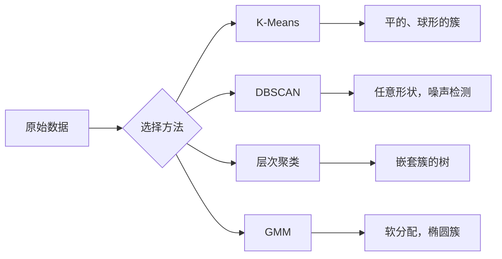

# 无监督学习

> 没有标签，没有老师。算法自己发现结构。

**类型：** 构建
**语言：** Python
**前置知识：** 阶段 1（范数与距离、概率与分布），阶段 2 第 1-6 课
**时间：** ~90 分钟

## 学习目标

- 从头实现 K-Means、DBSCAN 和高斯混合模型，并比较它们的聚类行为
- 使用轮廓系数和肘部法评估聚类质量，以选择最优 K
- 解释 DBSCAN 何时优于 K-Means，并识别哪种算法处理非球形簇和离群点
- 构建一个使用聚类方法标记偏离正常模式的点的异常检测流水线

## 问题

到目前为止，每个 ML 课程都假设有标签数据："这是一个输入，这是正确的输出。"在现实世界中，标签是昂贵的。一家医院有数百万条患者记录，但没有人手动为每条记录标注疾病类别。一个电商网站有数百万个用户会话，但没有人手工标记客户细分。一个安全团队有网络日志，但没有人标记每个异常。

无监督学习无需被告知要找什么就发现了模式。它对相似的数据点进行分组，发现隐藏的结构，并呈现异常。如果说监督学习是用带答案的教科书学习，那么无监督学习就是盯着原始数据直到模式自己显现出来。

难点是：没有标签，你无法直接度量"对"或"错"。你需要不同的工具来评估你的算法找到的结构是否有意义。

## 概念

### 聚类：将相似的事物分组

聚类将每个数据点分配到一个组（簇），使得同一组内的点比与其他组的点更相似。问题总是："相似"意味着什么？



### K-Means：主力算法

K-Means 将数据划分成恰好 K 个簇。每个簇有一个质心（其质量中心），每个点属于最近的质心。

Lloyd 算法：

1. 随机选择 K 个点作为初始质心
2. 将每个数据点分配到最近的质心
3. 将每个质心重新计算为其分配点的均值
4. 重复步骤 2-3 直到分配不再变化

目标函数（惯性）衡量每个点到其分配质心的总平方距离。K-Means 最小化这个值，但只找到局部最小值。不同的初始化可能产生不同的结果。

### 选择 K

两种标准方法：

**肘部法：** 对 K = 1, 2, 3, ..., n 运行 K-Means。绘制惯性 vs K。寻找"肘部"，即添加更多簇不再显著减少惯性的位置。

**轮廓系数：** 对每个点，衡量它与其自身簇的相似度（a）与最近的其他簇的相似度（b）。轮廓系数为 (b - a) / max(a, b)，范围从 -1（错误簇）到 +1（良好聚类）。对所有点取平均值得到全局分数。

### DBSCAN：基于密度的聚类

K-Means 假设簇是球形的，并要求你事先选择 K。DBSCAN 不做这两种假设。它将簇视为由稀疏区域分隔的密集区域。

两个参数：
- **eps**：邻域半径
- **min_samples**：形成密集区域所需的最小点数

三种类型的点：
- **核心点**：在 eps 距离内至少有 min_samples 个邻居
- **边界点**：在核心点的 eps 内，但本身不是核心点
- **噪声点**：既不是核心也不是边界。这些是离群点。

DBSCAN 将彼此在 eps 内的核心点连接到同一簇。边界点加入附近核心点的簇。噪声点不属于任何簇。

优势：发现任何形状的簇，自动确定簇的数量，识别离群点。弱点：难以处理密度不同的簇。

### 层次聚类

构建一个嵌套簇的树（树状图）。

凝聚式（自底向上）：
1. 从每个点作为自己的簇开始
2. 合并最近的两个簇
3. 重复直到只剩一个簇
4. 在期望的水平切割树状图得到 K 个簇

簇之间的"接近程度"可以通过以下方式衡量：
- **单链**：两个簇中任意两点之间的最小距离
- **全链**：两个簇中任意两点之间的最大距离
- **平均链**：所有点对之间的平均距离
- **Ward 方法**：导致簇内总方差增加最小的合并

### 高斯混合模型（GMM）

K-Means 给出硬分配：每个点恰好属于一个簇。GMM 给出软分配：每个点有属于每个簇的概率。

GMM 假设数据由 K 个高斯分布的混合生成，每个高斯分布有自己的均值和协方差。期望最大化（EM）算法在以下之间交替：

- **E 步**：计算每个点属于每个高斯分布的概率
- **M 步**：更新每个高斯分布的均值、协方差和混合权重，以最大化数据的似然

GMM 可以建模椭圆簇（不仅仅是 K-Means 那样的球形），并且自然地处理重叠的簇。

### 何时使用哪种

| 方法 | 最适合 | 避免当 |
|------|--------|--------|
| K-Means | 大数据集，球形簇，已知 K | 不规则形状，存在离群点 |
| DBSCAN | 未知 K，任意形状，异常检测 | 不同密度，非常高维 |
| 层次聚类 | 小数据集，需要树状图，未知 K | 大数据集（O(n^2) 内存） |
| GMM | 重叠簇，需要软分配 | 非常大的数据集，太多维度 |

### 基于聚类的异常检测

聚类自然支持异常检测：
- **K-Means**：远离任何质心的点是异常
- **DBSCAN**：噪声点根据定义就是异常
- **GMM**：在所有高斯分布下概率低的点是异常

```figure
kmeans-step
```

## 构建

### 步骤 1：从头实现 K-Means

```python
import math
import random


def euclidean_distance(a, b):
    return math.sqrt(sum((ai - bi) ** 2 for ai, bi in zip(a, b)))


def kmeans(data, k, max_iterations=100, seed=42):
    random.seed(seed)
    n_features = len(data[0])

    centroids = random.sample(data, k)

    for iteration in range(max_iterations):
        clusters = [[] for _ in range(k)]
        assignments = []

        for point in data:
            distances = [euclidean_distance(point, c) for c in centroids]
            nearest = distances.index(min(distances))
            clusters[nearest].append(point)
            assignments.append(nearest)

        new_centroids = []
        for cluster in clusters:
            if len(cluster) == 0:
                new_centroids.append(random.choice(data))
                continue
            centroid = [
                sum(point[j] for point in cluster) / len(cluster)
                for j in range(n_features)
            ]
            new_centroids.append(centroid)

        if all(
            euclidean_distance(old, new) < 1e-6
            for old, new in zip(centroids, new_centroids)
        ):
            print(f"  在第 {iteration + 1} 次迭代时收敛")
            break

        centroids = new_centroids

    return assignments, centroids
```

### 步骤 2：肘部法和轮廓系数

```python
def compute_inertia(data, assignments, centroids):
    total = 0.0
    for point, cluster_id in zip(data, assignments):
        total += euclidean_distance(point, centroids[cluster_id]) ** 2
    return total


def silhouette_score(data, assignments):
    n = len(data)
    if n < 2:
        return 0.0

    clusters = {}
    for i, c in enumerate(assignments):
        clusters.setdefault(c, []).append(i)

    if len(clusters) < 2:
        return 0.0

    scores = []
    for i in range(n):
        own_cluster = assignments[i]
        own_members = [j for j in clusters[own_cluster] if j != i]

        if len(own_members) == 0:
            scores.append(0.0)
            continue

        a = sum(euclidean_distance(data[i], data[j]) for j in own_members) / len(own_members)

        b = float("inf")
        for cluster_id, members in clusters.items():
            if cluster_id == own_cluster:
                continue
            avg_dist = sum(euclidean_distance(data[i], data[j]) for j in members) / len(members)
            b = min(b, avg_dist)

        if max(a, b) == 0:
            scores.append(0.0)
        else:
            scores.append((b - a) / max(a, b))

    return sum(scores) / len(scores)


def find_best_k(data, max_k=10):
    print("肘部法：")
    inertias = []
    for k in range(1, max_k + 1):
        assignments, centroids = kmeans(data, k)
        inertia = compute_inertia(data, assignments, centroids)
        inertias.append(inertia)
        print(f"  K={k}: inertia={inertia:.2f}")

    print("\n轮廓系数：")
    for k in range(2, max_k + 1):
        assignments, centroids = kmeans(data, k)
        score = silhouette_score(data, assignments)
        print(f"  K={k}: silhouette={score:.4f}")

    return inertias
```

### 步骤 3：从头实现 DBSCAN

```python
def dbscan(data, eps, min_samples):
    n = len(data)
    labels = [-1] * n
    cluster_id = 0

    def region_query(point_idx):
        neighbors = []
        for i in range(n):
            if euclidean_distance(data[point_idx], data[i]) <= eps:
                neighbors.append(i)
        return neighbors

    visited = [False] * n

    for i in range(n):
        if visited[i]:
            continue
        visited[i] = True

        neighbors = region_query(i)

        if len(neighbors) < min_samples:
            labels[i] = -1
            continue

        labels[i] = cluster_id
        seed_set = list(neighbors)
        seed_set.remove(i)

        j = 0
        while j < len(seed_set):
            q = seed_set[j]

            if not visited[q]:
                visited[q] = True
                q_neighbors = region_query(q)
                if len(q_neighbors) >= min_samples:
                    for nb in q_neighbors:
                        if nb not in seed_set:
                            seed_set.append(nb)

            if labels[q] == -1:
                labels[q] = cluster_id

            j += 1

        cluster_id += 1

    return labels
```

### 步骤 4：高斯混合模型（EM 算法）

```python
def gmm(data, k, max_iterations=100, seed=42):
    random.seed(seed)
    n = len(data)
    d = len(data[0])

    indices = random.sample(range(n), k)
    means = [list(data[i]) for i in indices]
    variances = [1.0] * k
    weights = [1.0 / k] * k

    def gaussian_pdf(x, mean, variance):
        d = len(x)
        coeff = 1.0 / ((2 * math.pi * variance) ** (d / 2))
        exponent = -sum((xi - mi) ** 2 for xi, mi in zip(x, mean)) / (2 * variance)
        return coeff * math.exp(max(exponent, -500))

    for iteration in range(max_iterations):
        responsibilities = []
        for i in range(n):
            probs = []
            for j in range(k):
                probs.append(weights[j] * gaussian_pdf(data[i], means[j], variances[j]))
            total = sum(probs)
            if total == 0:
                total = 1e-300
            responsibilities.append([p / total for p in probs])

        old_means = [list(m) for m in means]

        for j in range(k):
            r_sum = sum(responsibilities[i][j] for i in range(n))
            if r_sum < 1e-10:
                continue

            weights[j] = r_sum / n

            for dim in range(d):
                means[j][dim] = sum(
                    responsibilities[i][j] * data[i][dim] for i in range(n)
                ) / r_sum

            variances[j] = sum(
                responsibilities[i][j]
                * sum((data[i][dim] - means[j][dim]) ** 2 for dim in range(d))
                for i in range(n)
            ) / (r_sum * d)
            variances[j] = max(variances[j], 1e-6)

        shift = sum(
            euclidean_distance(old_means[j], means[j]) for j in range(k)
        )
        if shift < 1e-6:
            print(f"  GMM 在第 {iteration + 1} 次迭代时收敛")
            break

    assignments = []
    for i in range(n):
        assignments.append(responsibilities[i].index(max(responsibilities[i])))

    return assignments, means, weights, responsibilities
```

### 步骤 5：生成测试数据并运行一切

```python
def make_blobs(centers, n_per_cluster=50, spread=0.5, seed=42):
    random.seed(seed)
    data = []
    true_labels = []
    for label, (cx, cy) in enumerate(centers):
        for _ in range(n_per_cluster):
            x = cx + random.gauss(0, spread)
            y = cy + random.gauss(0, spread)
            data.append([x, y])
            true_labels.append(label)
    return data, true_labels


def make_moons(n_samples=200, noise=0.1, seed=42):
    random.seed(seed)
    data = []
    labels = []
    n_half = n_samples // 2
    for i in range(n_half):
        angle = math.pi * i / n_half
        x = math.cos(angle) + random.gauss(0, noise)
        y = math.sin(angle) + random.gauss(0, noise)
        data.append([x, y])
        labels.append(0)
    for i in range(n_half):
        angle = math.pi * i / n_half
        x = 1 - math.cos(angle) + random.gauss(0, noise)
        y = 1 - math.sin(angle) - 0.5 + random.gauss(0, noise)
        data.append([x, y])
        labels.append(1)
    return data, labels


if __name__ == "__main__":
    centers = [[2, 2], [8, 3], [5, 8]]
    data, true_labels = make_blobs(centers, n_per_cluster=50, spread=0.8)

    print("=== 在 3 个斑块上运行 K-Means ===")
    assignments, centroids = kmeans(data, k=3)
    print(f"  质心: {[[round(c, 2) for c in cent] for cent in centroids]}")
    sil = silhouette_score(data, assignments)
    print(f"  轮廓系数: {sil:.4f}")

    print("\n=== 肘部法 ===")
    find_best_k(data, max_k=6)

    print("\n=== 在 3 个斑块上运行 DBSCAN ===")
    db_labels = dbscan(data, eps=1.5, min_samples=5)
    n_clusters = len(set(db_labels) - {-1})
    n_noise = db_labels.count(-1)
    print(f"  找到 {n_clusters} 个簇，{n_noise} 个噪声点")

    print("\n=== 在 3 个斑块上运行 GMM ===")
    gmm_assignments, gmm_means, gmm_weights, _ = gmm(data, k=3)
    print(f"  均值: {[[round(m, 2) for m in mean] for mean in gmm_means]}")
    print(f"  权重: {[round(w, 3) for w in gmm_weights]}")
    gmm_sil = silhouette_score(data, gmm_assignments)
    print(f"  轮廓系数: {gmm_sil:.4f}")

    print("\n=== 在月牙形数据上运行 DBSCAN（非球形簇）===")
    moon_data, moon_labels = make_moons(n_samples=200, noise=0.1)
    moon_db = dbscan(moon_data, eps=0.3, min_samples=5)
    n_moon_clusters = len(set(moon_db) - {-1})
    n_moon_noise = moon_db.count(-1)
    print(f"  找到 {n_moon_clusters} 个簇，{n_moon_noise} 个噪声点")

    print("\n=== 在月牙形数据上运行 K-Means（将无法分离）===")
    moon_km, moon_centroids = kmeans(moon_data, k=2)
    moon_sil = silhouette_score(moon_data, moon_km)
    print(f"  轮廓系数: {moon_sil:.4f}")
    print("  K-Means 在月牙形数据上分割效果差，因为它们不是球形的")

    print("\n=== 使用 DBSCAN 进行异常检测 ===")
    anomaly_data = list(data)
    anomaly_data.append([20.0, 20.0])
    anomaly_data.append([-5.0, -5.0])
    anomaly_data.append([15.0, 0.0])
    anomaly_labels = dbscan(anomaly_data, eps=1.5, min_samples=5)
    anomalies = [
        anomaly_data[i]
        for i in range(len(anomaly_labels))
        if anomaly_labels[i] == -1
    ]
    print(f"  检测到 {len(anomalies)} 个异常")
    for a in anomalies[-3:]:
        print(f"    点 {[round(v, 2) for v in a]}")
```

## 使用

使用 scikit-learn，相同的算法是一行代码：

```python
from sklearn.cluster import KMeans, DBSCAN, AgglomerativeClustering
from sklearn.mixture import GaussianMixture
from sklearn.metrics import silhouette_score as sklearn_silhouette

km = KMeans(n_clusters=3, random_state=42).fit(data)
db = DBSCAN(eps=1.5, min_samples=5).fit(data)
agg = AgglomerativeClustering(n_clusters=3).fit(data)
gmm_model = GaussianMixture(n_components=3, random_state=42).fit(data)
```

从头编写的版本确切地展示了这些库计算了什么。K-Means 在分配和重新计算之间迭代。DBSCAN 从密集种子中生长簇。GMM 在期望和最大化之间交替。库版本增加了数值稳定性、更智能的初始化（K-Means++）和 GPU 加速，但核心逻辑是相同的。

## 交付

本课程生成 K-Means、DBSCAN 和 GMM 的从头实现。聚类代码可以作为更高级无监督方法的基础重用。

## 练习

1. 实现 K-Means++ 初始化：不是随机选择质心，而是先随机选一个，然后每个后续质心以与最近现有质心的平方距离成正比的概率选择。与随机初始化比较收敛速度。

2. 在代码中添加凝聚层次聚类。实现 Ward 链接并生成树状图（作为嵌套的合并列表）。在不同层次切割它，并与 K-Means 结果进行比较。

3. 构建一个简单的异常检测流水线：在相同数据上运行 DBSCAN 和 GMM，标记两种方法都认为是离群点的点（DBSCAN 中的噪声，GMM 中的低概率）。衡量重叠度，并讨论方法何时不一致。

## 关键术语

| 术语 | 人们说的话 | 实际含义 |
|------|----------|---------|
| 聚类 | "将相似的事物分组" | 将数据划分成子集，使得组内相似度超过组间相似度，由特定的距离度量衡量 |
| 质心 | "簇的中心" | 分配给一个簇的所有点的均值；K-Means 用作簇的代表 |
| 惯性 | "簇有多紧密" | 每个点到其分配质心的平方距离之和；越低越紧密 |
| 轮廓系数 | "簇的分离程度" | 对每个点，(b - a) / max(a, b)，其中 a 是平均簇内距离，b 是平均最近簇距离 |
| 核心点 | "密集区域中的点" | 在 DBSCAN 中，在 eps 距离内至少有 min_samples 个邻居的点 |
| EM 算法 | "软 K-Means" | 期望最大化：迭代计算成员概率（E 步）并更新分布参数（M 步） |
| 树状图 | "簇的树" | 显示层次聚类中簇被合并的顺序和距离的树状图 |
| 异常 | "离群点" | 不符合预期模式的数据点，被 DBSCAN 识别为噪声或被 GMM 识别为低概率 |

## 进一步阅读

- [Stanford CS229 - 无监督学习](https://cs229.stanford.edu/notes2022fall/main_notes.pdf) - Andrew Ng 关于聚类和 EM 的讲义
- [scikit-learn 聚类指南](https://scikit-learn.org/stable/modules/clustering.html) - 所有聚类算法的实用比较，带可视化示例
- [DBSCAN 原始论文（Ester 等，1996）](https://www.aaai.org/Papers/KDD/1996/KDD96-037.pdf) - 引入基于密度聚类的论文
