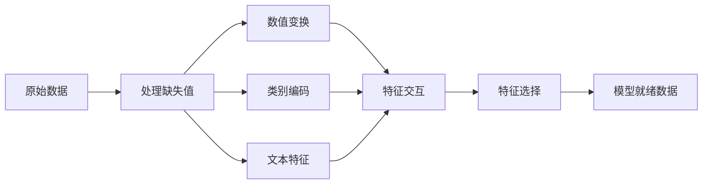

# 特征工程与选择

> 一个好的特征胜过一千个数据点。

**类型：** 构建
**语言：** Python
**前置知识：** 第一阶段（机器学习统计学、线性代数），第二阶段第1-7课
**时间：** 约90分钟

## 学习目标

- 实现数值变换（标准化、最小-最大缩放、对数变换、分箱）并解释每种方法的适用场景
- 构建独热编码、标签编码和目标编码，识别目标编码中的数据泄漏风险
- 从头构建TF-IDF向量化器，并解释为何它在文本分类中优于原始词频统计
- 应用基于过滤器的特征选择（方差阈值、相关性、互信息）来降维

## 问题

你有一个数据集。你选择了一个算法。你训练了模型。结果平平。你尝试了更高级的算法。仍然平平。你花了一周时间调参。只是略有改善。

然后有人对原始数据进行了更好的特征变换，一个简单的逻辑回归就击败了你精心调优的梯度提升集成模型。

这种情况经常发生。在经典机器学习中，数据的表示比算法的选择更重要。一个使用"房屋面积"和"卧室数量"的房价模型，无论学习器多么复杂，都会击败使用"原始地址字符串"的模型。算法只能处理你提供给它的信息。

特征工程是将原始数据转换为更易于模型发现模式的表示形式的过程。特征选择是丢弃那些只增加噪音而不增加信号的冗余特征的过程。这两者结合在一起，是经典机器学习中最高杠杆率的活动。

## 概念

### 特征处理流程



### 数值特征

原始数值很少能直接用于模型。常见的变换：

**缩放：** 将特征放在同一量级上，使基于距离的算法（K-Means、KNN、SVM）平等对待所有特征。最小-最大缩放映射到[0, 1]。标准化（z-score）映射到均值=0、标准差=1。

**对数变换：** 压缩右偏分布（收入、人口、词频）。将乘法关系变为加法关系。

**分箱：** 将连续值转换为类别。当特征与目标之间的关系是非线性但呈阶梯状时很有用（例如年龄分组）。

**多项式特征：** 创建x^2、x^3、x1*x2项。让线性模型能够捕捉非线性关系，代价是增加特征数量。

### 类别特征

模型需要数值。类别需要编码。

**独热编码：** 为每个类别创建一个二值列。"颜色=红/蓝/绿"变成三列：is_red、is_blue、is_green。适用于低基数的类别特征，但在类别很多时会爆炸式增长。

**标签编码：** 将每个类别映射为一个整数：红=0、蓝=1、绿=2。会引入错误的顺序关系（模型可能认为绿>蓝>红）。仅适用于基于树的模型（这些模型在单个值上进行分裂）。

**目标编码：** 将每个类别替换为该类别目标变量的均值。功能强大但有风险：数据泄漏风险高。必须仅在训练数据上计算并应用于测试数据。

### 文本特征

**词频向量化器：** 统计每个单词在文档中出现的次数。"the cat sat on the mat"变成{the: 2, cat: 1, sat: 1, on: 1, mat: 1}。

**TF-IDF：** 词频-逆文档频率。根据单词在整个文档集中的独特性来加权。像"the"这样的常见词权重低。罕见、有区分度的词权重高。

```
TF(词, 文档) = 词在文档中的出现次数 / 文档总词数
IDF(词) = log(总文档数 / 包含该词的文档数)
TF-IDF = TF * IDF
```

### 缺失值

真实数据总会有空缺。策略：

- **删除行：** 仅当缺失数据稀少且随机时
- **均值/中位数填充：** 简单，保持分布形状（中位数对异常值更鲁棒）
- **众数填充：** 用于类别特征
- **指示列：** 在填充前添加一个二值列"此值是否缺失"。数据缺失这一事实本身可能含有信息
- **前向/后向填充：** 用于时间序列数据

### 特征交互

有时关系存在于组合之中。"身高"和"体重"单独来看不如"BMI = 体重/身高^2"有预测力。特征交互会成倍增加特征空间，因此要使用领域知识来选择正确的交互。

### 特征选择

特征并非越多越好。不相关的特征会增加噪音、增加训练时间，并可能导致过拟合。

**过滤方法（模型前）：**
- 相关性：移除彼此高度相关的特征（冗余）
- 互信息：衡量知道一个特征能多大程度减少目标的不确定性
- 方差阈值：移除几乎不变的特征

**包装方法（基于模型）：**
- L1正则化（Lasso）：将不相关特征的权重精确地推到零
- 递归特征消除：训练，移除最不重要的特征，重复

**为什么选择很重要：** 一个拥有10个良好特征的模型通常会击败一个拥有10个良好特征加上90个噪音特征的模型。噪音特征给模型提供了在训练数据模式上过拟合的机会，而这些模式无法泛化。

```figure
feature-scaling
```

## 构建

### 第1步：从头实现数值变换

```python
import math


def min_max_scale(values):
    min_val = min(values)
    max_val = max(values)
    if max_val == min_val:
        return [0.0] * len(values)
    return [(v - min_val) / (max_val - min_val) for v in values]


def standardize(values):
    n = len(values)
    mean = sum(values) / n
    variance = sum((v - mean) ** 2 for v in values) / n
    std = math.sqrt(variance) if variance > 0 else 1.0
    return [(v - mean) / std for v in values]


def log_transform(values):
    return [math.log(v + 1) for v in values]


def bin_values(values, n_bins=5):
    min_val = min(values)
    max_val = max(values)
    bin_width = (max_val - min_val) / n_bins
    if bin_width == 0:
        return [0] * len(values)
    result = []
    for v in values:
        bin_idx = int((v - min_val) / bin_width)
        bin_idx = min(bin_idx, n_bins - 1)
        result.append(bin_idx)
    return result


def polynomial_features(row, degree=2):
    n = len(row)
    result = list(row)
    if degree >= 2:
        for i in range(n):
            result.append(row[i] ** 2)
        for i in range(n):
            for j in range(i + 1, n):
                result.append(row[i] * row[j])
    return result
```

### 第2步：从头实现类别编码

```python
def one_hot_encode(values):
    categories = sorted(set(values))
    cat_to_idx = {cat: i for i, cat in enumerate(categories)}
    n_cats = len(categories)

    encoded = []
    for v in values:
        row = [0] * n_cats
        row[cat_to_idx[v]] = 1
        encoded.append(row)

    return encoded, categories


def label_encode(values):
    categories = sorted(set(values))
    cat_to_int = {cat: i for i, cat in enumerate(categories)}
    return [cat_to_int[v] for v in values], cat_to_int


def target_encode(feature_values, target_values, smoothing=10):
    global_mean = sum(target_values) / len(target_values)

    category_stats = {}
    for feat, target in zip(feature_values, target_values):
        if feat not in category_stats:
            category_stats[feat] = {"sum": 0.0, "count": 0}
        category_stats[feat]["sum"] += target
        category_stats[feat]["count"] += 1

    encoding = {}
    for cat, stats in category_stats.items():
        cat_mean = stats["sum"] / stats["count"]
        weight = stats["count"] / (stats["count"] + smoothing)
        encoding[cat] = weight * cat_mean + (1 - weight) * global_mean

    return [encoding[v] for v in feature_values], encoding
```

### 第3步：从头实现文本特征

```python
def count_vectorize(documents):
    vocab = {}
    idx = 0
    for doc in documents:
        for word in doc.lower().split():
            if word not in vocab:
                vocab[word] = idx
                idx += 1

    vectors = []
    for doc in documents:
        vec = [0] * len(vocab)
        for word in doc.lower().split():
            vec[vocab[word]] += 1
        vectors.append(vec)

    return vectors, vocab


def tfidf(documents):
    n_docs = len(documents)

    vocab = {}
    idx = 0
    for doc in documents:
        for word in doc.lower().split():
            if word not in vocab:
                vocab[word] = idx
                idx += 1

    doc_freq = {}
    for doc in documents:
        seen = set()
        for word in doc.lower().split():
            if word not in seen:
                doc_freq[word] = doc_freq.get(word, 0) + 1
                seen.add(word)

    vectors = []
    for doc in documents:
        words = doc.lower().split()
        word_count = len(words)
        tf_map = {}
        for word in words:
            tf_map[word] = tf_map.get(word, 0) + 1

        vec = [0.0] * len(vocab)
        for word, count in tf_map.items():
            tf = count / word_count
            idf = math.log(n_docs / doc_freq[word])
            vec[vocab[word]] = tf * idf
        vectors.append(vec)

    return vectors, vocab
```

### 第4步：从头实现缺失值填充

```python
def impute_mean(values):
    present = [v for v in values if v is not None]
    if not present:
        return [0.0] * len(values), 0.0
    mean = sum(present) / len(present)
    return [v if v is not None else mean for v in values], mean


def impute_median(values):
    present = sorted(v for v in values if v is not None)
    if not present:
        return [0.0] * len(values), 0.0
    n = len(present)
    if n % 2 == 0:
        median = (present[n // 2 - 1] + present[n // 2]) / 2
    else:
        median = present[n // 2]
    return [v if v is not None else median for v in values], median


def impute_mode(values):
    present = [v for v in values if v is not None]
    if not present:
        return values, None
    counts = {}
    for v in present:
        counts[v] = counts.get(v, 0) + 1
    mode = max(counts, key=counts.get)
    return [v if v is not None else mode for v in values], mode


def add_missing_indicator(values):
    return [0 if v is not None else 1 for v in values]
```

### 第5步：从头实现特征选择

```python
def correlation(x, y):
    n = len(x)
    mean_x = sum(x) / n
    mean_y = sum(y) / n
    cov = sum((xi - mean_x) * (yi - mean_y) for xi, yi in zip(x, y)) / n
    std_x = math.sqrt(sum((xi - mean_x) ** 2 for xi in x) / n)
    std_y = math.sqrt(sum((yi - mean_y) ** 2 for yi in y) / n)
    if std_x == 0 or std_y == 0:
        return 0.0
    return cov / (std_x * std_y)


def mutual_information(feature, target, n_bins=10):
    feat_min = min(feature)
    feat_max = max(feature)
    bin_width = (feat_max - feat_min) / n_bins if feat_max != feat_min else 1.0
    feat_binned = [
        min(int((f - feat_min) / bin_width), n_bins - 1) for f in feature
    ]

    n = len(feature)
    target_classes = sorted(set(target))

    feat_bins = sorted(set(feat_binned))
    p_feat = {}
    for b in feat_bins:
        p_feat[b] = feat_binned.count(b) / n

    p_target = {}
    for t in target_classes:
        p_target[t] = target.count(t) / n

    mi = 0.0
    for b in feat_bins:
        for t in target_classes:
            joint_count = sum(
                1 for fb, tv in zip(feat_binned, target) if fb == b and tv == t
            )
            p_joint = joint_count / n
            if p_joint > 0:
                mi += p_joint * math.log(p_joint / (p_feat[b] * p_target[t]))

    return mi


def variance_threshold(features, threshold=0.01):
    n_features = len(features[0])
    n_samples = len(features)
    selected = []

    for j in range(n_features):
        col = [features[i][j] for i in range(n_samples)]
        mean = sum(col) / n_samples
        var = sum((v - mean) ** 2 for v in col) / n_samples
        if var >= threshold:
            selected.append(j)

    return selected


def remove_correlated(features, threshold=0.9):
    n_features = len(features[0])
    n_samples = len(features)

    to_remove = set()
    for i in range(n_features):
        if i in to_remove:
            continue
        col_i = [features[r][i] for r in range(n_samples)]
        for j in range(i + 1, n_features):
            if j in to_remove:
                continue
            col_j = [features[r][j] for r in range(n_samples)]
            corr = abs(correlation(col_i, col_j))
            if corr >= threshold:
                to_remove.add(j)

    return [i for i in range(n_features) if i not in to_remove]
```

### 第6步：完整流程与演示

```python
import random


def make_housing_data(n=200, seed=42):
    random.seed(seed)
    data = []
    for _ in range(n):
        sqft = random.uniform(500, 5000)
        bedrooms = random.choice([1, 2, 3, 4, 5])
        age = random.uniform(0, 50)
        neighborhood = random.choice(["downtown", "suburbs", "rural"])
        has_pool = random.choice([True, False])

        sqft_with_missing = sqft if random.random() > 0.05 else None
        age_with_missing = age if random.random() > 0.08 else None

        price = (
            50 * sqft
            + 20000 * bedrooms
            - 1000 * age
            + (50000 if neighborhood == "downtown" else 10000 if neighborhood == "suburbs" else 0)
            + (15000 if has_pool else 0)
            + random.gauss(0, 20000)
        )

        data.append({
            "sqft": sqft_with_missing,
            "bedrooms": bedrooms,
            "age": age_with_missing,
            "neighborhood": neighborhood,
            "has_pool": has_pool,
            "price": price,
        })
    return data


if __name__ == "__main__":
    data = make_housing_data(200)

    print("=== 原始数据样本 ===")
    for row in data[:3]:
        print(f"  {row}")

    sqft_raw = [d["sqft"] for d in data]
    age_raw = [d["age"] for d in data]
    prices = [d["price"] for d in data]

    print("\n=== 缺失值处理 ===")
    sqft_missing = sum(1 for v in sqft_raw if v is None)
    age_missing = sum(1 for v in age_raw if v is None)
    print(f"  sqft缺失: {sqft_missing}/{len(sqft_raw)}")
    print(f"  age缺失: {age_missing}/{len(age_raw)}")

    sqft_indicator = add_missing_indicator(sqft_raw)
    age_indicator = add_missing_indicator(age_raw)
    sqft_imputed, sqft_fill = impute_median(sqft_raw)
    age_imputed, age_fill = impute_mean(age_raw)
    print(f"  sqft用中位数填充: {sqft_fill:.0f}")
    print(f"  age用均值填充: {age_fill:.1f}")

    print("\n=== 数值变换 ===")
    sqft_scaled = standardize(sqft_imputed)
    age_scaled = min_max_scale(age_imputed)
    sqft_log = log_transform(sqft_imputed)
    age_binned = bin_values(age_imputed, n_bins=5)
    print(f"  sqft标准化: 均值={sum(sqft_scaled)/len(sqft_scaled):.4f}, 标准差={math.sqrt(sum(v**2 for v in sqft_scaled)/len(sqft_scaled)):.4f}")
    print(f"  age最小-最大: [{min(age_scaled):.2f}, {max(age_scaled):.2f}]")
    print(f"  age分箱: {sorted(set(age_binned))}")

    print("\n=== 类别编码 ===")
    neighborhoods = [d["neighborhood"] for d in data]

    ohe, ohe_cats = one_hot_encode(neighborhoods)
    print(f"  独热编码类别: {ohe_cats}")
    print(f"  样本编码: {neighborhoods[0]} -> {ohe[0]}")

    le, le_map = label_encode(neighborhoods)
    print(f"  标签编码映射: {le_map}")

    te, te_map = target_encode(neighborhoods, prices, smoothing=10)
    print(f"  目标编码: {({k: round(v) for k, v in te_map.items()})}")

    print("\n=== 文本特征 ===")
    descriptions = [
        "large modern house with pool",
        "small cozy cottage near downtown",
        "spacious family home with large yard",
        "modern apartment downtown with view",
        "rustic cabin in rural area",
    ]
    cv, cv_vocab = count_vectorize(descriptions)
    print(f"  词汇表大小: {len(cv_vocab)}")
    print(f"  文档0非零特征数: {sum(1 for v in cv[0] if v > 0)}")

    tf, tf_vocab = tfidf(descriptions)
    print(f"  TF-IDF词汇表大小: {len(tf_vocab)}")
    top_words = sorted(tf_vocab.keys(), key=lambda w: tf[0][tf_vocab[w]], reverse=True)[:3]
    print(f"  文档0最高TF-IDF词: {top_words}")

    print("\n=== 多项式特征 ===")
    sample_row = [sqft_scaled[0], age_scaled[0]]
    poly = polynomial_features(sample_row, degree=2)
    print(f"  输入: {[round(v, 4) for v in sample_row]}")
    print(f"  多项式: {[round(v, 4) for v in poly]}")
    print(f"  特征: [x1, x2, x1^2, x2^2, x1*x2]")

    print("\n=== 特征选择 ===")
    feature_matrix = [
        [sqft_scaled[i], age_scaled[i], float(sqft_indicator[i]), float(age_indicator[i])]
        + ohe[i]
        for i in range(len(data))
    ]

    print(f"  总特征数: {len(feature_matrix[0])}")

    surviving_var = variance_threshold(feature_matrix, threshold=0.01)
    print(f"  方差阈值(0.01)后: 保留{len(surviving_var)}个特征")

    surviving_corr = remove_correlated(feature_matrix, threshold=0.9)
    print(f"  相关性过滤(0.9)后: 保留{len(surviving_corr)}个特征")

    binary_prices = [1 if p > sum(prices) / len(prices) else 0 for p in prices]
    print("\n  与目标的互信息:")
    feature_names = ["sqft", "age", "sqft_missing", "age_missing"] + [f"neigh_{c}" for c in ohe_cats]
    for j in range(len(feature_matrix[0])):
        col = [feature_matrix[i][j] for i in range(len(feature_matrix))]
        mi = mutual_information(col, binary_prices, n_bins=10)
        print(f"    {feature_names[j]}: MI={mi:.4f}")

    print("\n  与价格的相关性:")
    for j in range(len(feature_matrix[0])):
        col = [feature_matrix[i][j] for i in range(len(feature_matrix))]
        corr = correlation(col, prices)
        print(f"    {feature_names[j]}: r={corr:.4f}")
```

## 使用

使用scikit-learn，这些变换可以组合成管道：

```python
from sklearn.preprocessing import StandardScaler, OneHotEncoder, PolynomialFeatures
from sklearn.impute import SimpleImputer
from sklearn.feature_extraction.text import TfidfVectorizer
from sklearn.feature_selection import mutual_info_classif, VarianceThreshold
from sklearn.compose import ColumnTransformer
from sklearn.pipeline import Pipeline

numeric_pipe = Pipeline([
    ("imputer", SimpleImputer(strategy="median")),
    ("scaler", StandardScaler()),
])

categorical_pipe = Pipeline([
    ("encoder", OneHotEncoder(sparse_output=False)),
])

preprocessor = ColumnTransformer([
    ("num", numeric_pipe, ["sqft", "age"]),
    ("cat", categorical_pipe, ["neighborhood"]),
])
```

从头实现的版本展示了每个变换内部的具体操作。库版本增加了边缘情况处理、稀疏矩阵支持和管道组合，但数学原理是相同的。

## 交付

本课程产出：
- `outputs/prompt-feature-engineer.md` - 一个系统化地从原始数据中工程化特征的系统提示词

## 练习

1. 在数值变换中添加鲁棒缩放（使用中位数和四分位距代替均值和标准差）。在含有极端异常值的数据上将其与标准缩放进行比较。
2. 实现留一法目标编码：对每一行，计算排除该行自身目标值后的目标均值。展示这如何相比朴素目标编码减少过拟合。
3. 构建一个自动特征选择流程，结合方差阈值、相关性过滤和互信息排序。将其应用于房价数据集并比较使用所有特征与使用选定特征的模型性能（使用简单线性回归）。

## 关键术语

| 术语 | 通俗说法 | 实际含义 |
|------|---------|---------|
| 特征工程 | "创建新列" | 将原始数据转换为能向模型暴露模式的表示形式 |
| 标准化 | "使其正态化" | 减去均值并除以标准差，使特征均值为0、标准差为1 |
| 独热编码 | "创建哑变量" | 为每个类别创建一个二值列，每行恰好有一个列为1 |
| 目标编码 | "利用答案来编码" | 将每个类别替换为该类别的平均目标值，通过平滑防止过拟合 |
| TF-IDF | "花哨的词频统计" | 词频乘以逆文档频率：根据词在整个语料库中的独特性加权 |
| 填充 | "填补空白" | 用估计值（均值、中位数、众数或模型预测值）替换缺失值 |
| 特征选择 | "丢弃差列" | 移除增加噪音或冗余的特征，只保留含有目标信号的列 |
| 互信息 | "一件事能告诉你多少关于另一件事的信息" | 衡量观测变量X能减少变量Y不确定性的程度 |
| 数据泄漏 | "意外作弊" | 在训练中使用了预测时无法获得的信息，导致虚假的乐观结果 |

## 扩展阅读

- [Feature Engineering and Selection (Max Kuhn & Kjell Johnson)](http://www.feat.engineering/) - 免费在线书籍，涵盖特征工程的全景
- [scikit-learn Preprocessing Guide](https://scikit-learn.org/stable/modules/preprocessing.html) - 所有标准变换的实用参考
- [Target Encoding Done Right (Micci-Barreca, 2001)](https://dl.acm.org/doi/10.1145/507533.507538) - 带平滑的目标编码原始论文
