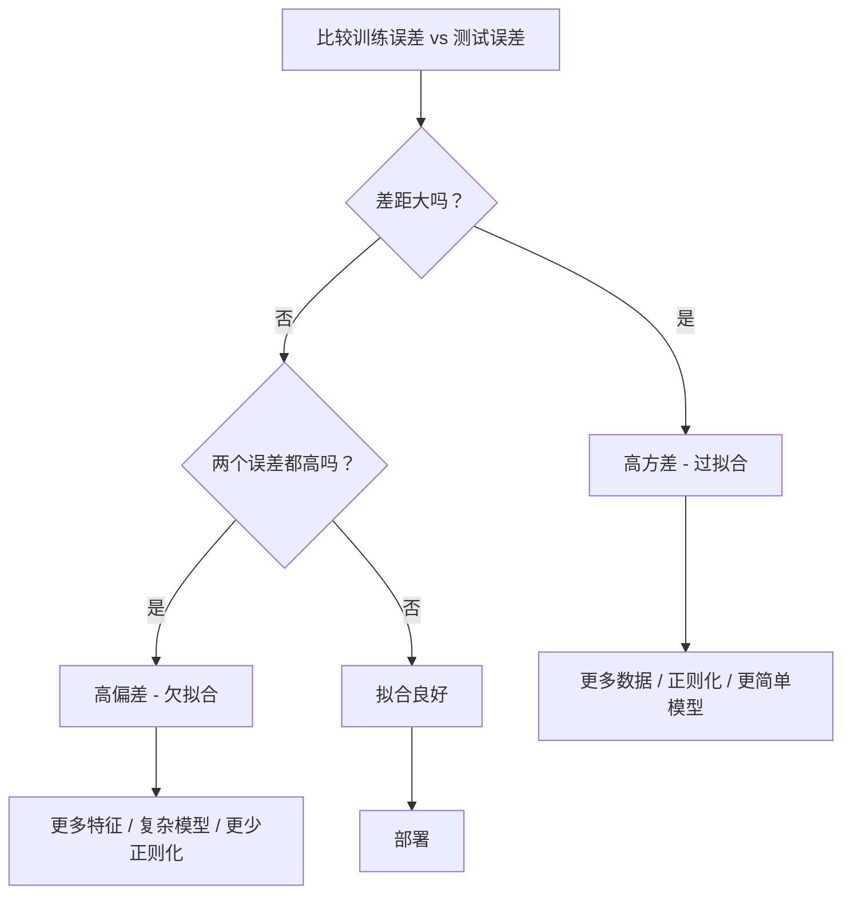
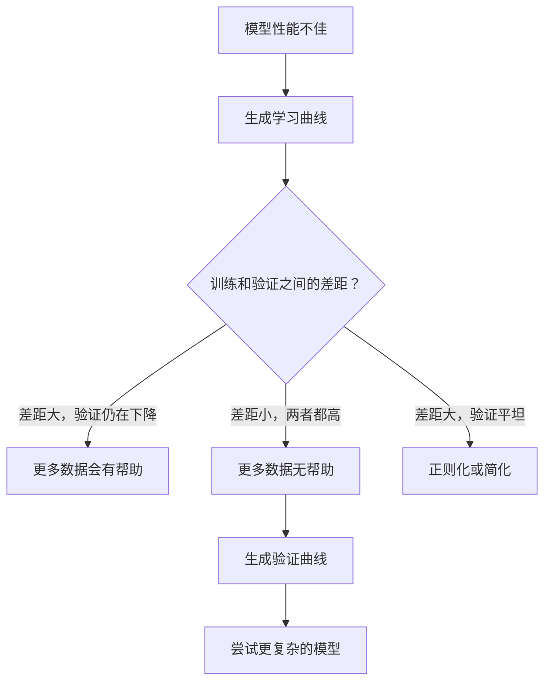

# 偏差-方差权衡

> 每个模型误差都来自三个来源之一：偏差、方差或噪音。你只能控制前两个。

**类型：** 学习
**语言：** Python
**前置知识：** 第二阶段，第01-09课（ML基础、回归、分类、评估）
**时间：** 约75分钟

## 学习目标

- 推导期望预测误差的偏差-方差分解，并解释不可约噪音的作用
- 利用训练和测试误差模式诊断模型是高偏差还是高方差
- 解释正则化技术（L1、L2、dropout、早停）如何用偏差换取方差
- 实现可视化不同复杂度模型下偏差-方差权衡的实验

## 问题

你训练了一个模型。它在测试数据上有一些误差。这些误差从哪里来？

如果你的模型太简单（在曲线数据集上做线性回归），它会始终错过真实的模式。这是偏差。如果你的模型太复杂（在15个数据点上拟合20次多项式），它会完美拟合训练数据，但对新数据给出截然不同的预测。这是方差。

对于固定的模型容量，你无法同时最小化两者。压低偏差，方差就上升。压低方差，偏差就上升。理解这种权衡是机器学习中最有用的诊断技能。它告诉你是应该让模型更复杂还是更简单，是应该获取更多数据还是设计更好的特征，是应该增加正则化还是减少正则化。

## 概念

### 偏差：系统性误差

偏差衡量模型平均预测与真实值之间的差距。如果你用同一个模型在从同一分布中抽取的许多不同训练集上训练，并对预测取平均，偏差就是这个平均值与真实值之间的差距。

高偏差意味着模型太死板，无法捕捉真实模式。对抛物线拟合一条直线，无论你给多少数据，总会错过曲线。这就是欠拟合。

```
高偏差（欠拟合）：
  模型总是大致预测相同的错误结果。
  训练误差：高
  测试误差：高
  两者差距：小
```

### 方差：对训练数据的敏感度

方差衡量当你使用不同数据子集训练时，预测的变化程度。如果训练集的微小变化导致模型的大幅变化，则方差很高。

高方差意味着模型拟合的是训练数据中的噪音，而不是底层信号。一个20次多项式会穿过的每个训练点，但在它们之间剧烈振荡。这就是过拟合。

```
高方差（过拟合）：
  模型完美拟合训练数据但在新数据上失败。
  训练误差：低
  测试误差：高
  两者差距：大
```

### 分解

对于任何点x，平方损失下的期望预测误差可以精确分解：

```
期望误差 = 偏差^2 + 方差 + 不可约噪音

其中：
  偏差^2   = (E[f_hat(x)] - f(x))^2
  方差     = E[(f_hat(x) - E[f_hat(x)])^2]
  噪音    = E[(y - f(x))^2]             (sigma^2)
```

- `f(x)` 是真实函数
- `f_hat(x)` 是模型的预测
- `E[...]` 是对不同训练集的期望
- `y` 是观测标签（真实函数加噪音）

噪音项是不可约的。没有模型能在有噪音的数据上做得比sigma^2更好。你的工作是在偏差^2和方差之间找到正确的平衡。

### 模型复杂度 vs 误差


经典的U形曲线：

| 复杂度 | 偏差 | 方差 | 总误差 |
|-----------|------|----------|-------------|
| 太低 | 高 | 低 | 高（欠拟合） |
| 刚好 | 适度 | 适度 | 最低 |
| 太高 | 低 | 高 | 高（过拟合） |

### 正则化作为偏差-方差控制

正则化故意增加偏差以减少方差。它约束模型使其无法追逐噪音。

- **L2（岭回归）：** 将所有权重向零收缩。保留所有特征但减少其影响。
- **L1（Lasso）：** 将某些权重精确推到零。执行特征选择。
- **Dropout：** 在训练期间随机禁用神经元。强制冗余表示。
- **早停：** 在模型完全拟合训练数据之前停止训练。

正则化强度（lambda、dropout率、epoch数）直接控制你在偏差-方差曲线上的位置。更多正则化意味着更多偏差、更少方差。

### 双重下降：现代视角

经典理论说：过了最佳平衡点后，更高的复杂度总是有害的。但2019年以来的研究表明了一些出乎意料的发现。如果你继续增加模型容量，远远越过插值阈值（模型拥有足够参数完美拟合训练数据的点），测试误差可能会再次下降。


这种"双重下降"现象解释了为什么严重过参数化的神经网络（参数远多于训练样本）仍然能良好泛化。经典的偏差-方差权衡并非错误，但在现代框架下是不完整的。

关于双重下降的关键观察：
- 它发生在线性模型、决策树和神经网络中
- 更多数据在插值区域实际上可能有害（样本层面的双重下降）
- 更多训练轮次也可能导致它（轮次层面的双重下降）
- 正则化能平滑峰值但不能消除它

为什么会这样？在插值阈值处，模型刚好有足够的容量来拟合所有训练点。它被迫采用一个非常具体的解决方案穿过每个点，数据中的微小扰动会导致拟合的巨大变化。这就是方差达到峰值的地方。过了阈值后，模型有许多可能的解决方案可以完美拟合数据。学习算法（例如带有隐式正则化的梯度下降）倾向于选择其中最简单的。这种对简单解的隐式偏向就是过参数化模型能够泛化的原因。

| 框架 | 参数 vs 样本 | 行为 |
|--------|----------------------|----------|
| 欠参数化 | p << n | 经典权衡适用 |
| 插值阈值 | p ~ n | 方差达到峰值，测试误差飙升 |
| 过参数化 | p >> n | 隐式正则化启动，测试误差下降 |

实际应用：如果你使用神经网络或大型树集成，不要停在插值阈值。要么远低于它（使用显式正则化），要么远超过它。最差的位置就是在阈值处。

### 诊断你的模型



| 症状 | 诊断 | 修复 |
|---------|-----------|-----|
| 高训练误差，高测试误差 | 偏差 | 更多特征、复杂模型、更少正则化 |
| 低训练误差，高测试误差 | 方差 | 更多数据、正则化、更简单模型、dropout |
| 低训练误差，低测试误差 | 拟合良好 | 交付 |
| 训练误差下降，测试误差上升 | 过拟合进行中 | 早停 |

### 实用策略

**当偏差是问题时：**
- 添加多项式或交互特征
- 使用更灵活的模型（树集成代替线性模型）
- 减少正则化强度
- 训练更长时间（如果尚未收敛）

**当方差是问题时：**
- 获取更多训练数据
- 使用Bagging（随机森林）
- 增加正则化（更高的lambda、更多dropout）
- 特征选择（移除噪音特征）
- 使用交叉验证及早发现

### 集成方法与方差降低

集成方法是应对方差最实用的工具。

**Bagging（自助聚合）** 在训练数据的不同自助采样上训练多个模型，然后平均它们的预测。每个单独的模型有高方差，但平均值具有低得多的方差。随机森林是将bagging应用于决策树。

为什么它在数学上有效：如果你平均N个独立的预测，每个方差为sigma^2，则平均值的方差为sigma^2 / N。模型并非真正独立（它们都看到相似的数据），所以减少量小于1/N，但仍然很显著。

**Boosting** 通过顺序构建模型来减少偏差，每个新模型专注于当前集成所犯的错误。梯度提升和AdaBoost是主要例子。如果添加过多模型，Boosting可能会过拟合，因此需要早停或正则化。

| 方法 | 主要效果 | 偏差变化 | 方差变化 |
|--------|---------------|-------------|-----------------|
| Bagging | 减少方差 | 不变 | 降低 |
| Boosting | 减少偏差 | 降低 | 可能增加 |
| Stacking | 减少两者 | 取决于元学习器 | 取决于基模型 |
| Dropout | 隐式bagging | 轻微增加 | 降低 |

**实用规则：** 如果基模型具有高方差（深层树、高次多项式），使用bagging。如果基模型具有高偏差（浅层桩、简单线性模型），使用boosting。

### 学习曲线

学习曲线绘制训练和验证误差随训练集大小的变化。它们是你拥有的最实用的诊断工具。与单次训练/测试比较不同，学习曲线展示了模型的轨迹，并告诉你更多数据是否会有帮助。


如何解读：

| 场景 | 训练误差 | 验证误差 | 差距 | 含义 | 怎么办 |
|----------|---------------|-----------------|-----|---------------|------------|
| 高偏差 | 高 | 高 | 小 | 模型无法捕捉模式 | 更多特征、复杂模型、更少正则化 |
| 高方差 | 低 | 高 | 大 | 模型记忆训练数据 | 更多数据、正则化、更简单模型 |
| 良好拟合 | 适度 | 适度 | 小 | 模型泛化良好 | 交付 |
| 高方差在改善 | 低 | 随数据增加而下降 | 缩小 | 数据可修复的方差问题 | 收集更多数据 |
| 高偏差平坦 | 高 | 高且平坦 | 小且平坦 | 更多数据无用 | 改变模型架构 |

关键洞察：如果两条曲线都已趋于平稳，差距小但两个误差都高，更多数据是无用的。你需要一个更好的模型。如果差距大且仍在缩小，更多数据会有所帮助。

### 如何生成学习曲线

有两种方法：

**方法1：改变训练集大小，固定模型。** 保持模型和超参数不变。在训练数据的递增子集上训练。在每个大小上测量训练误差和验证误差。这是标准的学习曲线。

**方法2：改变模型复杂度，固定数据。** 保持数据不变。遍历复杂度参数（多项式次数、树深度、层数）。在每个复杂度上测量训练误差和验证误差。这是验证曲线，直接展示了偏差-方差权衡。

两种方法相互补充。第一种告诉你更多数据是否会有所帮助。第二种告诉你不同的模型是否会有所帮助。在决定下一步之前运行两者。



```figure
bias-variance
```

## 构建

`code/bias_variance.py`中的代码运行完整的偏差-方差分解实验。以下是逐步方法。

### 第1步：从已知函数生成合成数据

我们使用 `f(x) = sin(1.5x) + 0.5x` 加上高斯噪音。知道真实函数让我们能计算精确的偏差和方差。

```python
def true_function(x):
    return np.sin(1.5 * x) + 0.5 * x

def generate_data(n_samples=30, noise_std=0.5, x_range=(-3, 3), seed=None):
    rng = np.random.RandomState(seed)
    x = rng.uniform(x_range[0], x_range[1], n_samples)
    y = true_function(x) + rng.normal(0, noise_std, n_samples)
    return x, y
```

### 第2步：自助采样和多项式拟合

对每个多项式次数，我们抽取多个自助训练集，拟合多项式，并在固定的测试网格上记录预测。这给出了每个测试点上预测的分布。

```python
def fit_polynomial(x_train, y_train, degree, lam=0.0):
    X = np.column_stack([x_train ** d for d in range(degree + 1)])
    if lam > 0:
        penalty = lam * np.eye(X.shape[1])
        penalty[0, 0] = 0
        w = np.linalg.solve(X.T @ X + penalty, X.T @ y_train)
    else:
        w = np.linalg.lstsq(X, y_train, rcond=None)[0]
    return w
```

我们在200个不同的自助样本上拟合。每个自助样本来自相同的底层分布，但包含不同的点。

### 第3步：计算偏差^2、方差分解

有了每个测试点上的200组预测，我们直接从定义计算分解：

```python
mean_pred = predictions.mean(axis=0)
bias_sq = np.mean((mean_pred - y_true) ** 2)
variance = np.mean(predictions.var(axis=0))
total_error = np.mean(np.mean((predictions - y_true) ** 2, axis=1))
```

- `mean_pred` 是从自助样本估计的 `E[f_hat(x)]`
- `bias_sq` 是平均预测与真实值之间的平方差距
- `variance` 是跨自助样本预测的平均离散程度
- `total_error` 应大约等于 `bias^2 + variance + noise`

### 第4步：学习曲线

学习曲线遍历训练集大小，同时保持模型复杂度固定。它们显示你的模型是数据受限还是容量受限。

```python
def demo_learning_curves():
    sizes = [10, 15, 20, 30, 50, 75, 100, 150, 200, 300]
    degree = 5

    for n in sizes:
        train_errors = []
        test_errors = []
        for seed in range(50):
            x_train, y_train = generate_data(n_samples=n, seed=seed * 100)
            w = fit_polynomial(x_train, y_train, degree)
            train_pred = predict_polynomial(x_train, w)
            train_mse = np.mean((train_pred - y_train) ** 2)
            test_pred = predict_polynomial(x_test, w)
            test_mse = np.mean((test_pred - y_test) ** 2)
            train_errors.append(train_mse)
            test_errors.append(test_mse)
        # 对多次运行取平均得到学习曲线点
```

对于高方差模型（小数据上的5次多项式），你看到：
- 训练误差开始低，随着更多数据使记忆更难而增加
- 测试误差开始高，随着模型获得更多信号而降低
- 差距随数据增多而缩小

对于高偏差模型（1次多项式），两个误差迅速收敛到相同的较高值，更多数据无帮助。

### 第5步：正则化扫描

代码还包括 `demo_regularization_sweep()`，它固定一个高次多项式（15次）并扫描岭回归正则化强度从0.001到100。这从不同角度展示了偏差-方差权衡：我们不改变模型复杂度，而是改变约束强度。

```python
def demo_regularization_sweep():
    alphas = [0.001, 0.005, 0.01, 0.05, 0.1, 0.5, 1.0, 5.0, 10.0, 50.0, 100.0]
    for alpha in alphas:
        results = bias_variance_decomposition([15], lam=alpha)
        r = results[15]
        print(f"alpha={alpha:.3f}  bias={r['bias_sq']:.4f}  var={r['variance']:.4f}")
```

在低alpha时，15次多项式几乎是未约束的。方差占主导，因为模型追逐每个自助样本中的噪音。在高alpha时，惩罚如此之强，模型实际上变成了一个接近常数的函数。偏差占主导。最优alpha处于这两个极端之间。

这是与改变多项式次数相同的U形曲线，但通过一个连续旋钮而不是离散旋钮来控制。在实践中，正则化是控制权衡的首选方式，因为它允许精细控制而不改变特征集。

## 使用

sklearn提供了 `learning_curve` 和 `validation_curve` 来自动化这些诊断，无需编写自助循环。

### 验证曲线：扫描模型复杂度

```python
from sklearn.model_selection import validation_curve
from sklearn.pipeline import make_pipeline
from sklearn.preprocessing import PolynomialFeatures
from sklearn.linear_model import Ridge

degrees = list(range(1, 16))
train_scores_all = []
val_scores_all = []

for d in degrees:
    pipe = make_pipeline(PolynomialFeatures(d), Ridge(alpha=0.01))
    train_scores, val_scores = validation_curve(
        pipe, X, y, param_name="polynomialfeatures__degree",
        param_range=[d], cv=5, scoring="neg_mean_squared_error"
    )
    train_scores_all.append(-train_scores.mean())
    val_scores_all.append(-val_scores.mean())
```

这直接给出了偏差-方差权衡曲线。验证分数在相对于训练分数最差的地方，方差占主导。两者都差的地方，偏差占主导。

### 学习曲线：扫描训练集大小

```python
from sklearn.model_selection import learning_curve

pipe = make_pipeline(PolynomialFeatures(5), Ridge(alpha=0.01))
train_sizes, train_scores, val_scores = learning_curve(
    pipe, X, y, train_sizes=np.linspace(0.1, 1.0, 10),
    cv=5, scoring="neg_mean_squared_error"
)
train_mse = -train_scores.mean(axis=1)
val_mse = -val_scores.mean(axis=1)
```

绘制 `train_mse` 和 `val_mse` 对 `train_sizes` 的图。形状告诉你关于模型的一切。

### 带正则化扫描的交叉验证

```python
from sklearn.model_selection import cross_val_score

alphas = [0.001, 0.01, 0.1, 1.0, 10.0, 100.0]
for alpha in alphas:
    pipe = make_pipeline(PolynomialFeatures(10), Ridge(alpha=alpha))
    scores = cross_val_score(pipe, X, y, cv=5, scoring="neg_mean_squared_error")
    print(f"alpha={alpha:>7.3f}  MSE={-scores.mean():.4f} +/- {scores.std():.4f}")
```

这为固定模型复杂度扫描正则化强度。你会看到相同的偏差-方差权衡：低alpha意味着高方差，高alpha意味着高偏差。

### 综合：一个完整的诊断工作流程

在实践中，你按顺序运行这些诊断：

1. 训练模型。计算训练和测试误差。
2. 如果两者都高：你有偏差问题。跳到第4步。
3. 如果训练低但测试高：你有方差问题。生成学习曲线，看更多数据是否有帮助。如果没有，正则化。
4. 生成验证曲线，扫描你的主要复杂度参数。找到最佳平衡点。
5. 在最佳平衡点，生成学习曲线。如果差距仍然很大，你需要更多数据或正则化。
6. 使用 `cross_val_score` 尝试不同alpha值的岭回归/Lasso。选择交叉验证误差最低的alpha。

这大多数表格数据集只需要10-15分钟的计算时间，却省去了数小时的猜测。

## 交付

本课程产出：`outputs/prompt-model-diagnostics.md`

## 练习

1. 使用 `noise_std=0`（无噪音）运行分解。不可约误差项发生了什么？最优复杂度变化了吗？
2. 将训练集大小从30增加到300。这如何影响方差分量？最优多项式次数偏移了吗？
3. 在实验中添加L2正则化（岭回归）。对于固定的高次多项式（15次），将lambda从0扫描到100。绘制偏差^2和方差作为lambda函数的图。
4. 将真实函数从多项式改为 `sin(x)`。偏差-方差分解如何变化？是否仍然有明确的最优次数？
5. 实现一个简单的bootstrap聚合（bagging）包装器：在自助样本上训练10个模型并平均预测。展示这减少了方差而不显著增加偏差。

## 关键术语

| 术语 | 通俗说法 | 实际含义 |
|------|---------|---------|
| 偏差 | "模型太简单" | 来自错误假设的系统性误差。平均模型预测与真实值之间的差距。 |
| 方差 | "模型过拟合了" | 来自对训练数据敏感度的误差。不同训练集上预测的变化程度。 |
| 不可约误差 | "数据中的噪音" | 来自真实数据生成过程中的随机性的误差。没有模型能消除它。 |
| 欠拟合 | "学得不够" | 模型具有高偏差。即使在训练数据上也错过了真实模式。 |
| 过拟合 | "记住了数据" | 模型具有高方差。拟合了训练数据中无法泛化的噪音。 |
| 正则化 | "约束模型" | 添加惩罚以减少模型复杂度，用偏差换取更低的方差。 |
| 双重下降 | "更多参数可能有帮助" | 当模型容量远超插值阈值时，测试误差再次下降。 |
| 模型复杂度 | "模型的灵活程度" | 模型拟合任意模式的能力。由架构、特征或正则化控制。 |

## 扩展阅读

- [Hastie, Tibshirani, Friedman: Elements of Statistical Learning, Ch. 7](https://hastie.su.domains/ElemStatLearn/) -- 偏差-方差分解的权威论述
- [Belkin et al., Reconciling modern machine learning practice and the bias-variance trade-off (2019)](https://arxiv.org/abs/1812.11118) -- 双重下降论文
- [Nakkiran et al., Deep Double Descent (2019)](https://arxiv.org/abs/1912.02292) -- 轮次层面和样本层面的双重下降
- [Scott Fortmann-Roe: Understanding the Bias-Variance Tradeoff](http://scott.fortmann-roe.com/docs/BiasVariance.html) -- 清晰的视觉解释
