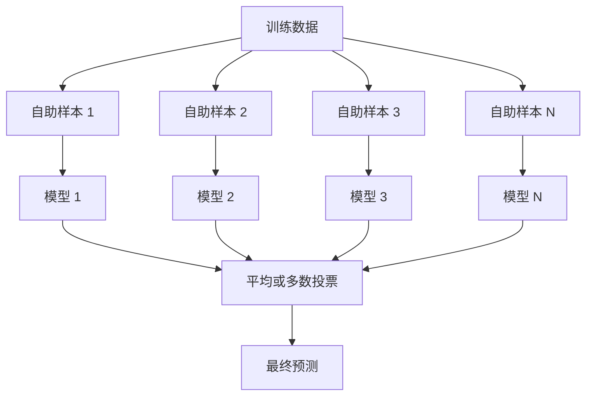
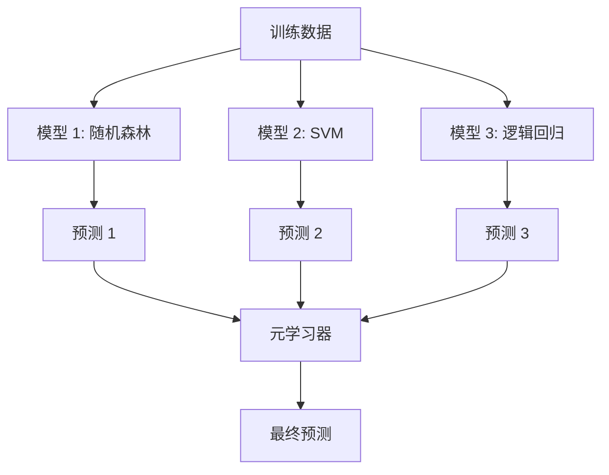

# 集成方法

> 一组弱学习器，正确组合后，就变成了一个强学习器。这不是比喻。这是一个定理。

**类型：** 构建
**语言：** Python
**前置知识：** 第二阶段，第10课（偏差-方差权衡）
**时间：** 约120分钟

## 学习目标

- 从头实现AdaBoost和梯度提升，并解释提升如何顺序减少偏差
- 构建bagging集成，并展示平均去相关的模型如何在增加偏差的情况下降低方差
- 比较bagging、boosting和stacking，说明每种方法针对的是哪个误差分量
- 评估集成多样性，并解释为什么多数投票的准确率会随着更多独立的弱学习器而提高

## 问题

单个决策树训练快、易于解释，但会过拟合。单个线性模型在复杂边界上欠拟合。你可以花几天时间精心设计完美的模型架构。或者你可以组合一堆不完美的模型，得到比其中任何一个都更好的结果。

集成方法正是这样做的。它们是在表格数据上赢得Kaggle比赛最可靠的技术，驱动着大多数生产ML系统，并且生动地展示了偏差-方差权衡的实际应用。Bagging降低方差。Boosting降低偏差。Stacking学习在哪些输入上信任哪些模型。

## 概念

### 为什么集成有效

假设你有N个独立的分类器，每个的准确率p > 0.5。多数投票的准确率为：

```
P(多数正确) = sum over k > N/2 of C(N,k) * p^k * (1-p)^(N-k)
```

对于21个每个准确率60%的分类器，多数投票的准确率约为74%。有101个时，升至84%。当模型犯了不同的错误时，错误相互抵消。

关键要求是**多样性**。如果所有模型犯相同的错误，组合它们无济于事。集成通过以下方式产生多样性：

- 不同的训练子集（bagging）
- 不同的特征子集（随机森林）
- 顺序错误修正（boosting）
- 不同的模型家族（stacking）

### Bagging（自助聚合）

Bagging通过在每个模型的训练数据的不同自助采样上训练来创建多样性。



自助采样是从原始数据中有放回地抽取，大小与原始数据相同。约63.2%的唯一样本出现在每个自助样本中。剩余的36.8%（袋外样本）提供了一个免费的验证集。

Bagging降低方差而不显著增加偏差。每个单独的树对其自助样本过拟合，但过拟合对每棵树是不同的，所以平均抵消了噪音。

**随机森林**是bagging加上一个额外的技巧：在每个分裂点，只考虑特征的随机子集。这迫使树之间更加多样化。候选特征数通常是分类的`sqrt(n_features)`和回归的`n_features / 3`。

### Boosting（顺序错误修正）

Boosting顺序训练模型。每个新模型专注于前一个模型犯错的样本。


Boosting降低偏差。每个新模型修正当前集成到目前为止的系统性错误。最终预测是所有模型的加权和，其中更好的模型获得更高的权重。

权衡：如果运行太多轮次，boosting可能过拟合，因为它持续拟合更难的样本，其中一些可能是噪音。

### AdaBoost

AdaBoost（自适应提升）是第一个实用的提升算法。它适用于任何基学习器，通常是决策桩（深度为1的树）。

算法：

```
1. 初始化样本权重：对所有i，w_i = 1/N

2. 对于 t = 1 到 T：
   a. 在加权数据上训练弱学习器 h_t
   b. 计算加权误差：
      err_t = sum(w_i * I(h_t(x_i) != y_i)) / sum(w_i)
   c. 计算模型权重：
      alpha_t = 0.5 * ln((1 - err_t) / err_t)
   d. 更新样本权重：
      w_i = w_i * exp(-alpha_t * y_i * h_t(x_i))
   e. 归一化权重使其和为1

3. 最终预测：H(x) = sign(sum(alpha_t * h_t(x)))
```

误差更低的模型获得更高的alpha。被错误分类的样本获得更高权重，使下一个模型专注于它们。

### 梯度提升

梯度提升将boosting推广到任意损失函数。它不重新加权样本，而是将每个新模型拟合到当前集成的残差（损失函数的负梯度）上。

```
1. 初始化：F_0(x) = argmin_c sum(L(y_i, c))

2. 对于 t = 1 到 T：
   a. 计算伪残差：
      r_i = -dL(y_i, F_{t-1}(x_i)) / dF_{t-1}(x_i)
   b. 将树 h_t 拟合到残差 r_i
   c. 找到最优步长：
      gamma_t = argmin_gamma sum(L(y_i, F_{t-1}(x_i) + gamma * h_t(x_i)))
   d. 更新：
      F_t(x) = F_{t-1}(x) + learning_rate * gamma_t * h_t(x)

3. 最终预测：F_T(x)
```

对于平方误差损失，伪残差就是实际的残差：`r_i = y_i - F_{t-1}(x_i)`。每棵树实际上是在拟合前一个集成的误差。

学习率（收缩）控制每棵树的贡献。更小的学习率需要更多的树，但泛化更好。典型值：0.01到0.3。

### XGBoost：为什么它主导表格数据

XGBoost（极端梯度提升）是具有工程优化的梯度提升，使其快速、准确且抗过拟合：

- **正则化目标：** 叶子权重上的L1和L2惩罚防止单棵树过于自信
- **二阶近似：** 使用损失的一阶和二阶导数，给出更好的分裂决策
- **稀疏感知分裂：** 通过在每个分裂点为缺失数据学习最佳方向来原生处理缺失值
- **列采样：** 像随机森林一样，在每个分裂点对特征进行采样以增加多样性
- **加权分位数草图：** 在分布式数据上高效找到连续特征的分裂点
- **缓存感知块结构：** 内存布局针对CPU缓存行优化

对于表格数据，XGBoost（及其后继者LightGBM）始终优于神经网络。这种情况短期内不会改变。如果你的数据适合一张有行有列的表格，从梯度提升开始。

### Stacking（元学习）

Stacking使用多个基模型的预测作为元学习器的特征。



元学习器学习在哪些输入上信任哪个基模型。如果随机森林在某些区域更好而SVM在其他区域更好，元学习器将学会相应地路由。

为避免数据泄漏，基模型预测必须通过在训练集上的交叉验证生成。你永远不会在同一数据上训练基模型并生成元特征。

### 投票

最简单的集成。直接组合预测。

- **硬投票：** 对类别标签进行多数投票。
- **软投票：** 平均预测概率，选择平均概率最高的类别。通常更好，因为它使用了置信度信息。

## 构建

### 第1步：决策桩（基学习器）

`code/ensembles.py`中的代码从头实现了所有内容。我们从决策桩开始：只有一次分裂的树。

```python
class DecisionStump:
    def __init__(self):
        self.feature_idx = None
        self.threshold = None
        self.polarity = 1
        self.alpha = None

    def fit(self, X, y, weights):
        n_samples, n_features = X.shape
        best_error = float("inf")

        for f in range(n_features):
            thresholds = np.unique(X[:, f])
            for thresh in thresholds:
                for polarity in [1, -1]:
                    pred = np.ones(n_samples)
                    pred[polarity * X[:, f] < polarity * thresh] = -1
                    error = np.sum(weights[pred != y])
                    if error < best_error:
                        best_error = error
                        self.feature_idx = f
                        self.threshold = thresh
                        self.polarity = polarity

    def predict(self, X):
        n = X.shape[0]
        pred = np.ones(n)
        idx = self.polarity * X[:, self.feature_idx] < self.polarity * self.threshold
        pred[idx] = -1
        return pred
```

### 第2步：从头实现AdaBoost

```python
class AdaBoostScratch:
    def __init__(self, n_estimators=50):
        self.n_estimators = n_estimators
        self.stumps = []
        self.alphas = []

    def fit(self, X, y):
        n = X.shape[0]
        weights = np.full(n, 1 / n)

        for _ in range(self.n_estimators):
            stump = DecisionStump()
            stump.fit(X, y, weights)
            pred = stump.predict(X)

            err = np.sum(weights[pred != y])
            err = np.clip(err, 1e-10, 1 - 1e-10)

            alpha = 0.5 * np.log((1 - err) / err)
            weights *= np.exp(-alpha * y * pred)
            weights /= weights.sum()

            stump.alpha = alpha
            self.stumps.append(stump)
            self.alphas.append(alpha)

    def predict(self, X):
        total = sum(a * s.predict(X) for a, s in zip(self.alphas, self.stumps))
        return np.sign(total)
```

### 第3步：从头实现梯度提升

```python
class GradientBoostingScratch:
    def __init__(self, n_estimators=100, learning_rate=0.1, max_depth=3):
        self.n_estimators = n_estimators
        self.lr = learning_rate
        self.max_depth = max_depth
        self.trees = []
        self.initial_pred = None

    def fit(self, X, y):
        self.initial_pred = np.mean(y)
        current_pred = np.full(len(y), self.initial_pred)

        for _ in range(self.n_estimators):
            residuals = y - current_pred
            tree = SimpleRegressionTree(max_depth=self.max_depth)
            tree.fit(X, residuals)
            update = tree.predict(X)
            current_pred += self.lr * update
            self.trees.append(tree)

    def predict(self, X):
        pred = np.full(X.shape[0], self.initial_pred)
        for tree in self.trees:
            pred += self.lr * tree.predict(X)
        return pred
```

### 第4步：与sklearn对比

代码验证了我们从头实现的方法产生与sklearn的`AdaBoostClassifier`和`GradientBoostingClassifier`相似的准确率，并并排比较所有方法。

## 使用

### 何时使用每种方法

| 方法 | 降低 | 最适合 | 注意 |
|--------|---------|----------|---------------|
| Bagging / 随机森林 | 方差 | 噪音数据、多特征 | 对偏差无帮助 |
| AdaBoost | 偏差 | 干净数据、简单基学习器 | 对异常值和噪音敏感 |
| 梯度提升 | 偏差 | 表格数据、比赛 | 训练慢，不调参容易过拟合 |
| XGBoost / LightGBM | 两者 | 生产表格ML | 超参数多 |
| Stacking | 两者 | 获取最后1-2%准确率 | 复杂，元学习器有过拟合风险 |
| 投票 | 方差 | 快速组合多样模型 | 仅当模型多样时有帮助 |

### 表格数据生产栈

对于大多数表格预测问题，这是尝试的顺序：

1. **LightGBM或XGBoost**，使用默认参数
2. 调优n_estimators、learning_rate、max_depth、min_child_weight
3. 如果你需要最后0.5%，用3-5个多样模型构建stacking集成
4. 全程使用交叉验证

表格数据上的神经网络几乎总是比梯度提升差，尽管持续有研究尝试。TabNet、NODE和类似架构偶尔能匹配但很少有超过调优好的XGBoost。

## 交付

本课程产出 `outputs/prompt-ensemble-selector.md` —— 一个帮你为给定数据集选择正确集成方法的提示词。描述你的数据（大小、特征类型、噪音水平、类别平衡）和你解决的问题。该提示词会带你走过一个决策清单，推荐方法，建议起始超参数，并提醒该方法的常见错误。同时产出 `outputs/skill-ensemble-builder.md` 包含完整的选择指南。

## 练习

1. 修改AdaBoost实现以跟踪每轮后的训练准确率。绘制准确率对估计器数量的图。什么时候收敛？
2. 通过向回归树添加随机特征子采样来从头实现随机森林。训练100棵树，使用 `max_features=sqrt(n_features)` 并平均预测。将方差减少与单棵树进行比较。
3. 在梯度提升实现中添加早停：跟踪每轮后的验证损失，当连续10轮没有改善时停止。实际需要多少棵树？
4. 使用三个基模型（逻辑回归、决策树、K近邻）和一个逻辑回归元学习器构建stacking集成。使用5折交叉验证生成元特征。与每个单独的基模型比较。
5. 使用默认参数在相同数据集上运行XGBoost。将其准确率与你的从头实现的梯度提升进行比较。计时两者。速度差异有多大？

## 关键术语

| 术语 | 通俗说法 | 实际含义 |
|------|---------|---------|
| Bagging | "在随机子集上训练" | 自助聚合：在自助采样上训练模型，平均预测以降低方差 |
| Boosting | "专注于困难样本" | 顺序训练模型，每个修正当前集成的错误，以降低偏差 |
| AdaBoost | "重新加权数据" | 通过样本权重更新进行提升；被错误分类的点对下一个学习器获得更高权重 |
| 梯度提升 | "拟合残差" | 通过将每个新模型拟合到损失函数的负梯度来进行提升 |
| XGBoost | "Kaggle武器" | 带正则化、二阶优化和系统级速度技巧的梯度提升 |
| Stacking | "模型之上有模型" | 将基模型的预测用作元学习器的输入特征 |
| 随机森林 | "许多随机化的树" | Bagging与决策树相结合，在每个分裂点添加随机特征子采样以增加多样性 |
| 集成多样性 | "犯不同的错误" | 模型在误差上必须不相关，集成才能优于个体 |
| 袋外误差 | "免费验证" | 不在自助抽取中的样本（~36.8%）作为验证集，无需单独保留 |

## 扩展阅读

- [Schapire & Freund: Boosting: Foundations and Algorithms](https://mitpress.mit.edu/9780262526036/) -- AdaBoost创造者所著
- [Friedman: Greedy Function Approximation: A Gradient Boosting Machine (2001)](https://statweb.stanford.edu/~jhf/ftp/trebst.pdf) -- 原始梯度提升论文
- [Chen & Guestrin: XGBoost (2016)](https://arxiv.org/abs/1603.02754) -- XGBoost论文
- [Wolpert: Stacked Generalization (1992)](https://www.sciencedirect.com/science/article/abs/pii/S0893608005800231) -- 原始stacking论文
- [scikit-learn Ensemble Methods](https://scikit-learn.org/stable/modules/ensemble.html) -- 实用参考
