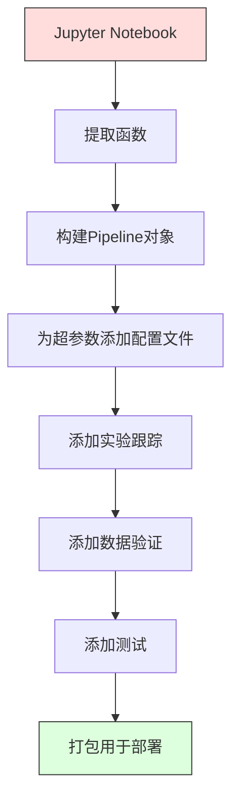

# ML 管道

> 一个模型不是一个产品。管道才是。管道是从原始数据到部署预测的一切，每一步都必须是可复现的。

**类型：** 构建
**语言：** Python
**前置知识：** 第二阶段，第12课（超参数调优）
**时间：** 约120分钟

## 学习目标

- 从头构建一个ML管道，将填充、缩放、编码和模型训练链接到一个可复现的单一对象中
- 识别数据泄漏场景，并解释管道如何通过仅在训练数据上拟合变换器来防止数据泄漏
- 构建一个对数值和类别特征应用不同预处理的ColumnTransformer
- 实现管道序列化，并演示相同的拟合管道在训练和生产中产生完全相同的结果

## 问题

你有一个加载数据、用中位数填充缺失值、缩放特征、训练模型并打印准确率的笔记本。它能工作。你交付了它。

一个月后，有人重新训练模型并得到不同的结果。中位数是在包括测试数据的完整数据集上计算的（数据泄漏）。缩放参数没有保存，所以推理使用了不同的统计量。特征工程代码在训练和服务之间被复制粘贴，副本出现了分歧。一个类别列在生产中获得了编码器从未见过的新值。

这些不是假设。它们是ML系统在生产中失败的最常见原因。管道通过将每个变换步骤打包成一个单一的、有序的、可复现的对象来解决所有这些问题。

## 概念

### 什么是管道

管道是一个有序的数据变换序列后跟一个模型。每一步接收前一步的输出作为输入。整个管道在训练数据上拟合一次。在推理时，相同的拟合管道变换新数据并产生预测。


管道保证：
- 变换仅在训练数据上拟合（无泄漏）
- 在推理时应用相同的变换
- 整个对象可以被序列化并作为一个制品部署
- 交叉验证按折应用管道，防止细微的泄漏

### 数据泄漏：无声的杀手

数据泄漏发生在测试集或未来数据的信息污染了训练时。管道防止了最常见的形式。

**有泄漏（错误）：**
```python
X = df.drop("target", axis=1)
y = df["target"]

scaler = StandardScaler()
X_scaled = scaler.fit_transform(X)

X_train, X_test = X_scaled[:800], X_scaled[800:]
y_train, y_test = y[:800], y[800:]
```

缩放器看到了测试数据。均值和标准差包含了测试样本。这夸大了准确率估计。

**正确：**
```python
X_train, X_test = X[:800], X[800:]

scaler = StandardScaler()
X_train_scaled = scaler.fit_transform(X_train)
X_test_scaled = scaler.transform(X_test)
```

使用管道，你不需要考虑这一点。管道自动处理。

### sklearn Pipeline

sklearn的`Pipeline`链接变换器和估计器。它暴露了`.fit()`、`.predict()`和`.score()`方法，按顺序应用所有步骤。

```python
from sklearn.pipeline import Pipeline
from sklearn.preprocessing import StandardScaler
from sklearn.linear_model import LogisticRegression

pipe = Pipeline([
    ("scaler", StandardScaler()),
    ("model", LogisticRegression()),
])

pipe.fit(X_train, y_train)
predictions = pipe.predict(X_test)
```

当你调用 `pipe.fit(X_train, y_train)` 时：
1. 缩放器在X_train上调用 `fit_transform`
2. 模型在缩放后的X_train上调用 `fit`

当你调用 `pipe.predict(X_test)` 时：
1. 缩放器在X_test上调用 `transform`（不是 `fit_transform`）
2. 模型在缩放后的X_test上调用 `predict`

缩放器在拟合期间从未看到测试数据。这就是全部要点。

### ColumnTransformer：不同列的不同管道

真实数据集有需要不同预处理的数值和类别列。`ColumnTransformer` 处理这个问题。

```python
from sklearn.compose import ColumnTransformer
from sklearn.preprocessing import StandardScaler, OneHotEncoder
from sklearn.impute import SimpleImputer

numeric_pipe = Pipeline([
    ("impute", SimpleImputer(strategy="median")),
    ("scale", StandardScaler()),
])

categorical_pipe = Pipeline([
    ("impute", SimpleImputer(strategy="most_frequent")),
    ("encode", OneHotEncoder(handle_unknown="ignore")),
])

preprocessor = ColumnTransformer([
    ("num", numeric_pipe, ["age", "income", "score"]),
    ("cat", categorical_pipe, ["city", "gender", "plan"]),
])

full_pipeline = Pipeline([
    ("preprocess", preprocessor),
    ("model", GradientBoostingClassifier()),
])
```

OneHotEncoder中的 `handle_unknown="ignore"` 对生产环境至关重要。当出现新类别时（模型从未见过的城市），它会生成一个零向量而不是崩溃。

### 实验跟踪

管道使训练可复现，但你还需要跨实验跟踪发生了什么：使用了哪些超参数、哪个数据集版本、指标是什么、运行的是哪个代码。

**MLflow** 是最常见的开源解决方案：

```python
import mlflow

with mlflow.start_run():
    mlflow.log_param("max_depth", 5)
    mlflow.log_param("n_estimators", 100)
    mlflow.log_param("learning_rate", 0.1)

    pipe.fit(X_train, y_train)
    accuracy = pipe.score(X_test, y_test)

    mlflow.log_metric("accuracy", accuracy)
    mlflow.sklearn.log_model(pipe, "model")
```

每次运行都记录了参数、指标、制品和完整模型。你可以比较运行、复现任何实验并部署任何模型版本。

**Weights & Biases (wandb)** 提供带托管仪表板的相同功能：

```python
import wandb

wandb.init(project="my-pipeline")
wandb.config.update({"max_depth": 5, "n_estimators": 100})

pipe.fit(X_train, y_train)
accuracy = pipe.score(X_test, y_test)

wandb.log({"accuracy": accuracy})
```

### 模型版本管理

在实验跟踪之后，你需要管理模型版本。哪个模型在生产中？哪个在预发布？哪个是上周的？

MLflow的模型注册表提供：
- **版本跟踪：** 每个保存的模型获得一个版本号
- **阶段转换：** "预发布"、"生产"、"已归档"
- **审批流程：** 模型必须被显式提升到生产
- **回滚：** 即时切换回之前的版本

### 使用DVC进行数据版本管理

代码用git版本管理。数据也应该被版本管理，但git无法处理大文件。DVC（数据版本控制）解决了这个问题。

```
dvc init
dvc add data/training.csv
git add data/training.csv.dvc data/.gitignore
git commit -m "跟踪训练数据"
dvc push
```

DVC将实际数据存储在远程存储（S3、GCS、Azure）中，并在git中保留一个记录哈希的小型`.dvc`文件。当你检出git提交时，`dvc checkout`恢复使用的确切数据。

这意味着每个git提交同时固定了代码和数据。完全可复现。

### 可复现实验

一个可复现的实验需要四件事：

1. **固定的随机种子：** 为numpy、random和框架（torch、sklearn）设置种子
2. **锁定的依赖：** requirements.txt或poetry.lock，带确切版本
3. **版本管理的数据：** DVC或类似工具
4. **配置文件：** 所有超参数在配置中，不硬编码

```python
import numpy as np
import random

def set_seed(seed=42):
    random.seed(seed)
    np.random.seed(seed)
    try:
        import torch
        torch.manual_seed(seed)
        torch.cuda.manual_seed_all(seed)
        torch.backends.cudnn.deterministic = True
    except ImportError:
        pass
```

### 从笔记本到生产管道



典型的演进过程：

1. **笔记本探索：** 快速实验、可视化、特征思路
2. **提取函数：** 将预处理、特征工程、评估移到模块中
3. **构建Pipeline：** 将变换链接到sklearn Pipeline或自定义类中
4. **配置管理：** 将所有超参数移到YAML/JSON配置中
5. **实验跟踪：** 添加MLflow或wandb日志
6. **数据验证：** 在训练前检查模式、分布和缺失值模式
7. **测试：** 变换器的单元测试、完整管道的集成测试
8. **部署：** 序列化管道，包装成API（FastAPI、Flask），容器化

### 常见管道错误

| 错误 | 为什么不好 | 修复 |
|---------|-------------|-----|
| 在分割前对整个数据拟合 | 数据泄漏 | 使用Pipeline配合cross_val_score |
| 管道外的特征工程 | 训练与服务的不同变换 | 将所有变换放在Pipeline中 |
| 未处理未知类别 | 生产中出现新值时崩溃 | OneHotEncoder(handle_unknown="ignore") |
| 硬编码列名 | 模式更改时中断 | 使用配置中的列名列表 |
| 无数据验证 | 坏数据上静默的预测错误 | 在预测前添加模式检查 |
| 训练/服务不一致 | 模型在生产中看到不同特征 | 两者使用同一个Pipeline对象 |

## 构建

`code/pipeline.py`中的代码从头构建了一个完整的ML管道：

### 第1步：自定义变换器

```python
class CustomTransformer:
    def __init__(self):
        self.means = None
        self.stds = None

    def fit(self, X):
        self.means = np.mean(X, axis=0)
        self.stds = np.std(X, axis=0)
        self.stds[self.stds == 0] = 1.0
        return self

    def transform(self, X):
        return (X - self.means) / self.stds

    def fit_transform(self, X):
        return self.fit(X).transform(X)
```

### 第2步：从头实现Pipeline

```python
class PipelineFromScratch:
    def __init__(self, steps):
        self.steps = steps

    def fit(self, X, y=None):
        X_current = X.copy()
        for name, step in self.steps[:-1]:
            X_current = step.fit_transform(X_current)
        name, model = self.steps[-1]
        model.fit(X_current, y)
        return self

    def predict(self, X):
        X_current = X.copy()
        for name, step in self.steps[:-1]:
            X_current = step.transform(X_current)
        name, model = self.steps[-1]
        return model.predict(X_current)
```

### 第3步：使用Pipeline进行交叉验证

代码展示了使用管道进行交叉验证如何防止数据泄漏：缩放器在每折的训练数据上单独拟合。

### 第4步：使用sklearn的完整生产管道

一个完整的管道，包含ColumnTransformer、多种预处理路径和一个模型，使用适当的交叉验证和实验日志记录进行训练。

## 交付

本课程产出：
- `outputs/prompt-ml-pipeline.md` -- 一个构建和调试ML管道的技能
- `code/pipeline.py` -- 一个从头到sklearn的完整管道

## 练习

1. 构建一个处理包含3个数值列和2个类别列的数据集的管道。使用ColumnTransformer对数值列应用中位数填充+缩放，对类别列应用众数填充+独热编码。使用5折交叉验证训练。
2. 故意引入数据泄漏：在分割前在整个数据集上拟合缩放器。比较交叉验证分数（有泄漏）与管道交叉验证分数（无泄漏）。差异有多大？
3. 使用 `joblib.dump` 序列化你的管道。在单独的脚本中加载它并运行预测。验证预测是否相同。
4. 向管道添加一个创建多项式特征（2次）的自定义变换器，用于两个最重要的数值列。它应该在管道中的什么位置？
5. 为管道设置MLflow跟踪。使用不同超参数运行5次实验。使用MLflow UI（`mlflow ui`）比较运行并选择最佳模型。

## 关键术语

| 术语 | 通俗说法 | 实际含义 |
|------|---------|---------|
| 管道 | "变换链 + 模型" | 拟合后的变换器和模型的有序序列，作为一个单元应用以防止泄漏 |
| 数据泄漏 | "测试信息泄漏到训练中" | 使用训练集之外的信息来构建模型，夸大性能估计 |
| ColumnTransformer | "每列不同的预处理" | 将不同的管道应用于不同的列子集，组合结果 |
| 实验跟踪 | "记录你的运行" | 记录每次训练运行的参数、指标、制品和代码版本 |
| MLflow | "跟踪和部署模型" | 用于实验跟踪、模型注册和部署的开源平台 |
| DVC | "数据的Git" | 大数据文件的版本控制系统，在git中存储哈希，在远程存储中存储数据 |
| 模型注册表 | "模型版本目录" | 跟踪带有阶段标签（预发布、生产、已归档）的模型版本的系统 |
| 训练/服务偏差 | "在笔记本中能工作" | 训练期间和推理期间数据处理方式的不同，导致静默错误 |
| 可复现性 | "相同代码，相同结果" | 从相同代码、数据和配置获得相同结果的能力 |

## 扩展阅读

- [scikit-learn Pipeline docs](https://scikit-learn.org/stable/modules/compose.html) -- 官方管道参考
- [MLflow documentation](https://mlflow.org/docs/latest/index.html) -- 实验跟踪和模型注册表
- [DVC documentation](https://dvc.org/doc) -- 数据版本管理
- [Sculley et al., Hidden Technical Debt in Machine Learning Systems (2015)](https://papers.nips.cc/paper/2015/hash/86df7dcfd896fcaf2674f757a2463eba-Abstract.html) -- ML系统复杂性的开创性论文
- [Google ML Best Practices: Rules of ML](https://developers.google.com/machine-learning/guides/rules-of-ml) -- 生产ML实用建议
