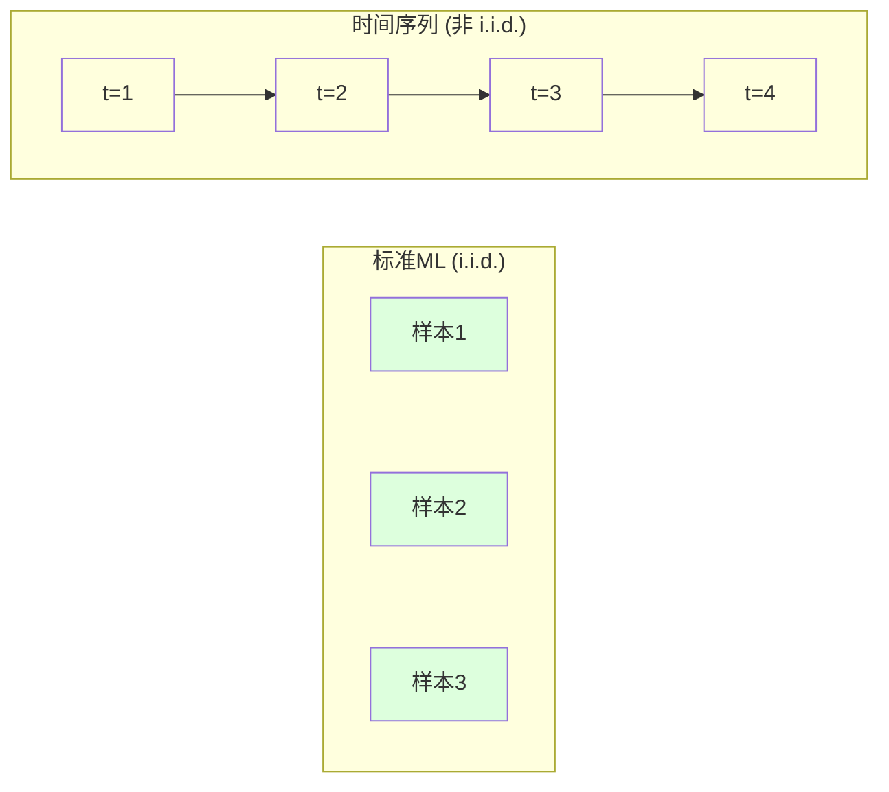
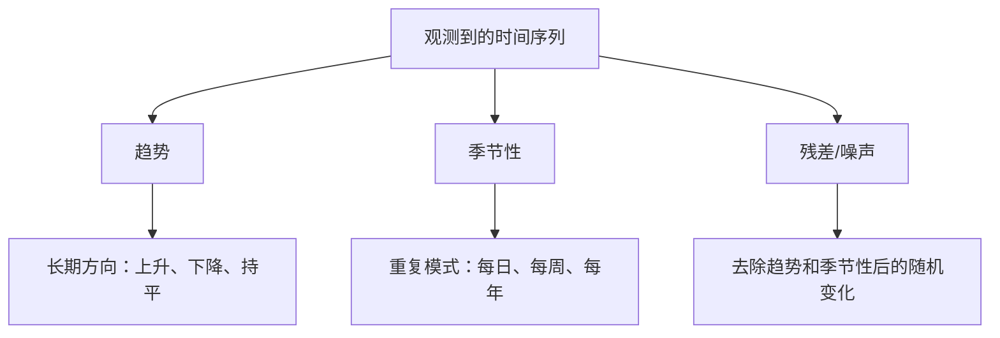
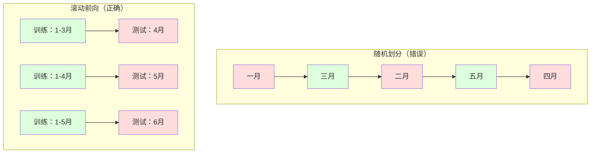

# 时间序列基础

> 过去的表现确实可以预测未来的结果——前提是你先检查了平稳性。

**类型：** 构建
**语言：** Python
**前置知识：** 第二阶段，第01-09课
**时间：** 约90分钟

## 学习目标

- 将时间序列分解为趋势、季节性和残差分量，并检验平稳性
- 实现滞后特征和滚动统计量，将时间序列转化为监督学习问题
- 构建滚动前向验证框架，防止未来数据泄露到训练集中
- 解释为什么随机训练/测试划分对时间序列无效，并展示与正确时间划分的性能差距

## 问题

你拥有按时间顺序排列的数据。每日销售额、每小时温度、每分钟CPU使用率、每周股票价格。你想预测下一个值、下一周、下一季度。

你拿出标准的ML工具包：随机训练/测试划分、交叉验证、特征矩阵输入、预测输出。每一步都是错的。

时间序列打破了标准ML所依赖的假设。样本不是独立的——今天的温度取决于昨天的。随机划分会将未来信息泄露到过去。在回测中表现出色的特征在生产中失效，因为它们依赖于随时间变化的模式。

一个在随机交叉验证中获得95%准确率的模型，在正确基于时间的评估中可能只有55%。这种差异并非技术细节。它区分了纸上谈兵的模型和真正可用的模型。

本课涵盖基础知识：时间数据为何不同，如何诚实地评估模型，以及如何将时间序列转化为标准ML模型可以使用的特征。

## 概念

### 时间序列为何不同

标准ML假设i.i.d.——独立同分布。每个样本从同一分布中独立抽取。时间序列同时违反了两者：

- **不独立。** 今天的股价取决于昨天的。本周的销售额与上周相关。
- **不同分布。** 分布随时间变化。十二月的销售额看起来与三月的不同。

这些违反不是小问题。它们改变了你构建特征、评估模型以及选择算法的方式。



在标准ML中，样本是可互换的。打乱它们不会有任何变化。在时间序列中，顺序就是一切。打乱会破坏信号。

### 时间序列的组成部分

每个时间序列都是以下分量的组合：



- **趋势**：长期方向。每年增长10%的收入。全球温度上升。
- **季节性**：固定间隔的重复模式。零售额在十二月激增。空调使用量在七月达到峰值。
- **残差**：去除趋势和季节性后剩余的部分。如果残差看起来像白噪声，说明分解捕捉到了信号。

### 平稳性

如果一个时间序列的统计属性（均值、方差、自相关）不随时间变化，则称其为平稳的。大多数预测方法都假设平稳性。

**为什么重要：** 非平稳序列的均值会发生漂移。在一月数据上训练的模型学习到的均值与二月将展现的均值不同。它会系统性地出错。

**如何检查：** 在窗口上计算滚动均值和滚动标准差。如果它们漂移，则序列是非平稳的。

**如何修正：** 差分。不对原始值建模，而是对连续值之间的变化建模：

```
diff[t] = value[t] - value[t-1]
```

如果一轮差分不能使序列平稳，则再次应用（二阶差分）。大多数现实世界的序列最多需要两轮差分。

**示例：**

原始序列：[100, 102, 106, 112, 120]
一阶差分：[2, 4, 6, 8]（仍在上升趋势）
二阶差分：[2, 2, 2]（常数——平稳）

原始序列有二次趋势。一阶差分将其转化为线性趋势。二阶差分使其平坦。在实践中，你很少需要超过两轮差分。

**正式检验：** 扩展迪基-富勒（ADF）检验是平稳性的标准统计检验。原假设是"序列是非平稳的"。p值低于0.05意味着你可以拒绝原假设并得出平稳性结论。我们不从头实现ADF（它需要渐近分布表），但我们代码中的滚动统计方法提供了实用的可视化检查。

### 自相关

自相关衡量时间t的值与时间t-k（过去k步）的值之间的相关程度。自相关函数（ACF）绘制了每个滞后k对应的相关性。

**ACF告诉你：**
- 序列的记忆长度。如果ACF在滞后5后降至零，那么5步之前的值就无关紧要了。
- 是否存在季节性。如果ACF在滞后12处有尖峰（月度数据），则存在年度季节性。
- 需要创建多少个滞后特征。使用直到ACF变得可忽略的滞后值。

**PACF（偏自相关函数）** 去除了间接相关。如果今天与3天前相关仅仅是因为两者都与昨天相关，那么PACF在滞后3处将为零，而ACF在滞后3处则不会。

### 滞后特征：将时间序列转化为监督学习

标准ML模型需要特征矩阵X和目标y。时间序列只给了你一列值。桥梁就是滞后特征。

取序列[10, 12, 14, 13, 15]并创建滞后1和滞后2特征：

| lag_2 | lag_1 | target |
|-------|-------|--------|
| 10    | 12    | 14     |
| 12    | 14    | 13     |
| 14    | 13    | 15     |

现在你有了一个标准的回归问题。任何ML模型（线性回归、随机森林、梯度提升）都可以从滞后值中预测目标。

你可以工程化的额外特征：
- **滚动统计量：** 过去k个值的均值、标准差、最小值、最大值
- **日历特征：** 星期几、月份、是否节假日、是否周末
- **差分值：** 与前一步的变化
- **扩展统计量：** 累积均值、累积和
- **比率特征：** 当前值 / 滚动均值（距离近期平均值的程度）
- **交互特征：** lag_1 * day_of_week（工作日对动量的影响）

**需要多少个滞后值？** 使用自相关函数。如果ACF在滞后10之前都显著，则至少使用10个滞后值。如果存在每周季节性，则包括滞后7（可能还有14）。更多的滞后值给模型提供了更多的历史信息，但也增加了需要拟合的特征数量，从而提高过拟合风险。

**目标对齐陷阱。** 在创建滞后特征时，目标必须是时间t的值，所有特征必须使用时间t-1或更早的值。如果你不小心将时间t的值作为特征包含在内，你就有了一个完美的预测器——和一个完全无用的模型。这是时间序列特征工程中最常见的错误。

### 滚动前向验证

这是本课最重要的概念。标准k折交叉验证将样本随机分配到训练集和测试集。对于时间序列，这会将未来信息泄露到过去。



滚动前向验证：
1. 在截至时间t的数据上训练
2. 预测时间t+1（或t+1到t+k，对于多步预测）
3. 向前滑动窗口
4. 重复

每个测试折只包含位于所有训练数据之后的数据。没有未来信息泄露。这给了你一个诚实的模型部署后性能评估。

**扩展窗口**使用所有历史数据进行训练（窗口增长）。**滑动窗口**使用固定大小的训练窗口（窗口滑动）。当你相信旧数据仍然相关时使用扩展窗口。当世界在变化而旧数据有害时使用滑动窗口。

### ARIMA直观理解

ARIMA是经典的时间序列模型。它有三个组成部分：

- **AR（自回归）：** 从过去的值进行预测。AR(p)使用最后p个值。
- **I（差分）：** 通过差分实现平稳性。I(d)应用d轮差分。
- **MA（移动平均）：** 从过去的预测误差进行预测。MA(q)使用最后q个误差。

ARIMA(p, d, q)结合了所有三个。你根据ACF/PACF分析或自动搜索（auto-ARIMA）选择p, d, q。

我们不从头实现ARIMA——它需要超出本课范围的数据优化。关键洞见是理解每个组成部分的作用，以便你能够解释ARIMA的结果并知道何时使用它。

### 何时使用什么

| 方法 | 最适合 | 处理季节性 | 处理外部特征 |
|----------|---------|-------------------|------------------------|
| 滞后特征 + ML | 具有许多外部特征的表格数据 | 配合日历特征 | 是 |
| ARIMA | 单变量序列，短期 | SARIMA变体 | 否（ARIMAX有限支持） |
| 指数平滑 | 简单趋势 + 季节性 | 是（Holt-Winters） | 否 |
| Prophet | 业务预测，节假日 | 是（傅里叶项） | 有限 |
| 神经网络（LSTM, Transformer） | 长序列，多个序列 | 可习得 | 是 |

对于大多数实际问题，滞后特征 + 梯度提升是最强的起点。它自然地处理外部特征，不需要平稳性，并且易于调试。

### 预测范围与策略

单步预测预测前进一步。多步预测预测多步。有三种策略：

**递归（迭代）：** 预测前一步，将预测作为下一步的输入。简单但误差会累积——每个预测都使用前一个预测，因此错误会不断叠加。

**直接：** 为每个预测范围训练单独的模型。模型1预测t+1，模型5预测t+5。没有误差累积，但每个模型的训练样本更少，且它们不共享信息。

**多输出：** 训练一个模型同时输出所有预测范围。跨预测范围共享信息，但需要支持多输出的模型（或自定义损失函数）。

对于大多数实际问题，短范围（1-5步）使用递归，较长范围使用直接。

### 时间序列的常见错误

| 错误 | 原因 | 如何修正 |
|---------|---------------|-----------|
| 随机训练/测试划分 | 标准ML的习惯 | 使用滚动前向或时间划分 |
| 使用未来特征 | 不小心包含了时间t的特征 | 审计每个特征的时间对齐 |
| 过拟合季节性 | 模型记忆了日历模式 | 在测试集中保留一个完整的季节周期 |
| 忽略尺度变化 | 收入翻倍但模式不变 | 对百分比变化而非绝对值建模 |
| 过多滞后特征 | "历史越长越好" | 使用ACF确定相关滞后 |
| 不做差分 | "模型会自己搞明白" | 树模型能处理趋势；线性模型需要平稳性 |

## 构建它

`code/time_series.py`中的代码从头实现了核心构建块。

### 滞后特征创建器

```python
def make_lag_features(series, n_lags):
    n = len(series)
    X = np.full((n, n_lags), np.nan)
    for lag in range(1, n_lags + 1):
        X[lag:, lag - 1] = series[:-lag]
    valid = ~np.isnan(X).any(axis=1)
    return X[valid], series[valid]
```

这将一维序列转换为特征矩阵，其中每行以最后`n_lags`个值作为特征，当前值作为目标。

### 滚动前向交叉验证

```python
def walk_forward_split(n_samples, n_splits=5, min_train=50):
    assert min_train < n_samples, "min_train must be less than n_samples"
    step = max(1, (n_samples - min_train) // n_splits)
    for i in range(n_splits):
        train_end = min_train + i * step
        test_end = min(train_end + step, n_samples)
        if train_end >= n_samples:
            break
        yield slice(0, train_end), slice(train_end, test_end)
```

每个划分确保训练数据严格位于测试数据之前。训练窗口随着每折而扩展。

### 简单自回归模型

纯AR模型就是在滞后特征上进行线性回归：

```python
class SimpleAR:
    def __init__(self, n_lags=5):
        self.n_lags = n_lags
        self.weights = None
        self.bias = None

    def fit(self, series):
        X, y = make_lag_features(series, self.n_lags)
        # Solve via normal equations
        X_b = np.column_stack([np.ones(len(X)), X])
        theta = np.linalg.lstsq(X_b, y, rcond=None)[0]
        self.bias = theta[0]
        self.weights = theta[1:]
        return self
```

这在概念上与第02课的线性回归相同，但应用于同一变量的时间滞后版本。

### 平稳性检验

代码计算滚动统计量以可视化和数值化评估平稳性：

```python
def check_stationarity(series, window=50):
    rolling_mean = np.array([
        series[max(0, i - window):i].mean()
        for i in range(1, len(series) + 1)
    ])
    rolling_std = np.array([
        series[max(0, i - window):i].std()
        for i in range(1, len(series) + 1)
    ])
    return rolling_mean, rolling_std
```

如果滚动均值漂移或滚动标准差变化，则序列是非平稳的。应用差分并再次检验。

代码还通过比较序列的前半部分和后半部分来检验平稳性。如果均值差异超过半个标准差或方差比超过2倍，则标记为非平稳。

### 自相关

```python
def autocorrelation(series, max_lag=20):
    n = len(series)
    mean = series.mean()
    var = series.var()
    acf = np.zeros(max_lag + 1)
    for k in range(max_lag + 1):
        cov = np.mean((series[:n-k] - mean) * (series[k:] - mean))
        acf[k] = cov / var if var > 0 else 0
    return acf
```

## 使用它

使用sklearn，你可以将滞后特征直接用于任何回归器：

```python
from sklearn.linear_model import Ridge
from sklearn.ensemble import GradientBoostingRegressor

X, y = make_lag_features(series, n_lags=10)

for train_idx, test_idx in walk_forward_split(len(X)):
    model = Ridge(alpha=1.0)
    model.fit(X[train_idx], y[train_idx])
    predictions = model.predict(X[test_idx])
```

对于ARIMA，使用statsmodels：

```python
from statsmodels.tsa.arima.model import ARIMA

model = ARIMA(train_series, order=(5, 1, 2))
fitted = model.fit()
forecast = fitted.forecast(steps=30)
```

`time_series.py`中的代码演示了两种方法，并使用滚动前向验证进行比较。

### sklearn的TimeSeriesSplit

sklearn提供了实现滚动前向验证的`TimeSeriesSplit`：

```python
from sklearn.model_selection import TimeSeriesSplit

tscv = TimeSeriesSplit(n_splits=5)
for train_index, test_index in tscv.split(X):
    X_train, X_test = X[train_index], X[test_index]
    y_train, y_test = y[train_index], y[test_index]
    model.fit(X_train, y_train)
    score = model.score(X_test, y_test)
```

这相当于我们自己实现的`walk_forward_split`，但集成在sklearn的交叉验证框架中。你可以将其与`cross_val_score`一起使用：

```python
from sklearn.model_selection import cross_val_score

scores = cross_val_score(model, X, y, cv=TimeSeriesSplit(n_splits=5))
print(f"Mean score: {scores.mean():.4f} +/- {scores.std():.4f}")
```

### 评估指标

时间序列预测使用回归指标，但带有时间感知的上下文：

- **MAE（平均绝对误差）：** |y_true - y_pred|的平均值。易于以原始单位解释。"平均而言，预测偏差3.2度。"
- **RMSE（均方根误差）：** 均方误差的平方根。比MAE更严厉地惩罚大误差。当大错误比许多小错误更糟糕时使用。
- **MAPE（平均绝对百分比误差）：** |error / true_value|的平均值 * 100。尺度无关，适合比较不同序列。但当真实值为零时未定义。
- **朴素基线比较：** 始终与简单基线进行比较。季节性朴素基线预测一个周期前的值（昨天、上周）。如果你的模型不能击败朴素基线，那就有问题了。

### 滚动特征

代码演示了如何在滞后特征的基础上添加滚动统计量（窗口为7天和14天的均值、标准差、最小值、最大值）。这些为模型提供了关于近期趋势和波动性的信息，而单独的滞后特征无法捕捉这些信息。

例如，如果滚动均值在上升，则表明存在上升趋势。如果滚动标准差在增加，则表明波动性在增长。这些是树模型可以学习但线性模型无法捕捉的模式类型。

## 交付

本课产出：
- `outputs/prompt-time-series-advisor.md`——用于定义时间序列问题的提示词
- `code/time_series.py`——滞后特征、滚动前向验证、AR模型、平稳性检验

### 你必须击败的基线

在构建任何模型之前，建立基线：

1. **最后一个值（持久性）。** 预测明天将与今天相同。对于许多序列来说，这出奇地难以击败。
2. **季节性朴素。** 预测今天将与上周（或去年）的同一天相同。如果你的模型不能击败这个，它除了季节性之外没有学到任何有用的模式。
3. **移动平均。** 预测最后k个值的平均值。平滑了噪声，但不能捕捉突然变化。

如果你花哨的ML模型输给了季节性朴素基线，那你就有bug了。最常见的原因：特征中的未来信息泄露、错误的评估方法，或者序列确实是随机的、不可预测的。

### 实用技巧

1. **从绘图开始。** 在任何建模之前，绘制原始序列。寻找趋势、季节性、异常值、结构性断裂（行为的突然变化）。30秒的可视化检查通常比一小时的自动化分析告诉你更多。

2. **先差分，后建模。** 如果序列有明显趋势，在创建滞后特征之前先进行差分。树模型可以处理趋势，但线性模型不能，而差分从不会有坏处。

3. **至少保留一个完整的季节周期。** 如果你有每周季节性，测试集需要至少一个完整的星期。如果是月度，至少需要一个完整的月份。否则你无法评估模型是否捕捉到了季节性模式。

4. **在生产中监控。** 时间序列模型会随着世界的变化而随时间退化。以滚动方式跟踪预测误差。当误差开始增加时，在最近的数据上重新训练模型。

5. **警惕制度变化。** 在疫情前数据上训练的模型无法预测疫情后的行为。将已知制度变化的指标作为特征包含在内，或者使用遗忘旧数据的滑动窗口。

6. **对偏斜序列进行对数变换。** 收入、价格和计数通常是右偏的。取对数可以稳定方差，并使乘法模式变为加法模式，线性模型可以处理这些。在对数空间进行预测，然后取指数恢复原始单位。

## 练习

1. **平稳性实验。** 生成一个具有线性趋势的序列。用滚动统计量检验平稳性。应用一阶差分。再次检验。二次趋势需要多少轮差分才能平稳？

2. **滞后选择。** 在季节性序列（周期=7）上计算ACF。哪些滞后的自相关最高？仅使用这些滞后（不是连续滞后）创建滞后特征。与使用滞后1到7相比，准确率是否提高？

3. **滚动前向 vs 随机划分。** 在滞后特征上训练Ridge回归。用随机80/20划分和滚动前向验证进行评估。随机划分高估了性能多少？

4. **特征工程。** 在滞后特征的基础上添加滚动均值（窗口=7）、滚动标准差（窗口=7）和星期几特征。使用滚动前向验证比较有无这些额外特征的准确率。

5. **多步预测。** 修改AR模型以预测5步而不是1步。比较两种策略：（a）预测一步，将预测作为下一步的输入（递归），和（b）为每个预测范围训练单独的模型（直接）。哪种更准确？

## 关键术语

| 术语 | 人们说的意思 | 实际含义 |
|------|----------------|----------------------|
| 平稳性 | "统计量不随时间变化" | 均值、方差和自相关结构随时间保持恒定的序列 |
| 差分 | "减去连续值" | 计算y[t] - y[t-1]以去除趋势并实现平稳性 |
| 自相关（ACF） | "序列与自身的相关" | 时间序列与其滞后副本之间的相关性，作为滞后的函数 |
| 偏自相关（PACF） | "仅直接相关" | 去除所有更短滞后影响后，在滞后k处的自相关 |
| 滞后特征 | "过去的值作为输入" | 使用y[t-1]， y[t-2]， ...， y[t-k]作为特征来预测y[t] |
| 滚动前向验证 | "尊重时间的交叉验证" | 训练数据在时间顺序上始终先于测试数据的评估方式 |
| ARIMA | "经典时间序列模型" | 自回归积分滑动平均：结合过去值（AR）、差分（I）和过去误差（MA） |
| 季节性 | "重复的日历模式" | 时间序列中与日历周期（日、周、年）相关的规律、可预测的循环 |
| 趋势 | "长期方向" | 序列水平随时间持续增加或减少 |
| 扩展窗口 | "使用所有历史数据" | 滚动前向验证中训练集随每折增长 |
| 滑动窗口 | "固定大小的历史" | 滚动前向验证中训练集是向前滑动的固定长度窗口 |

## 延伸阅读

- [Hyndman and Athanasopoulos, Forecasting: Principles and Practice (3rd ed.)](https://otexts.com/fpp3/)——最好的免费时间序列预测教科书
- [scikit-learn Time Series Split](https://scikit-learn.org/stable/modules/generated/sklearn.model_selection.TimeSeriesSplit.html)——sklearn的滚动前向划分器
- [statsmodels ARIMA docs](https://www.statsmodels.org/stable/generated/statsmodels.tsa.arima.model.ARIMA.html)——带诊断的ARIMA实现
- [Makridakis et al., The M5 Competition (2022)](https://www.sciencedirect.com/science/article/pii/S0169207021001874)——展示ML方法与统计方法的大规模预测竞赛
