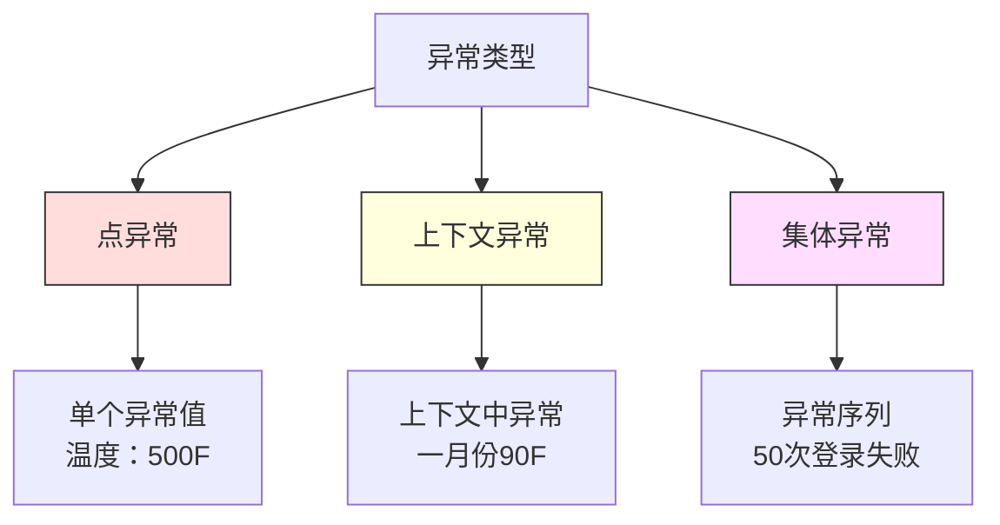
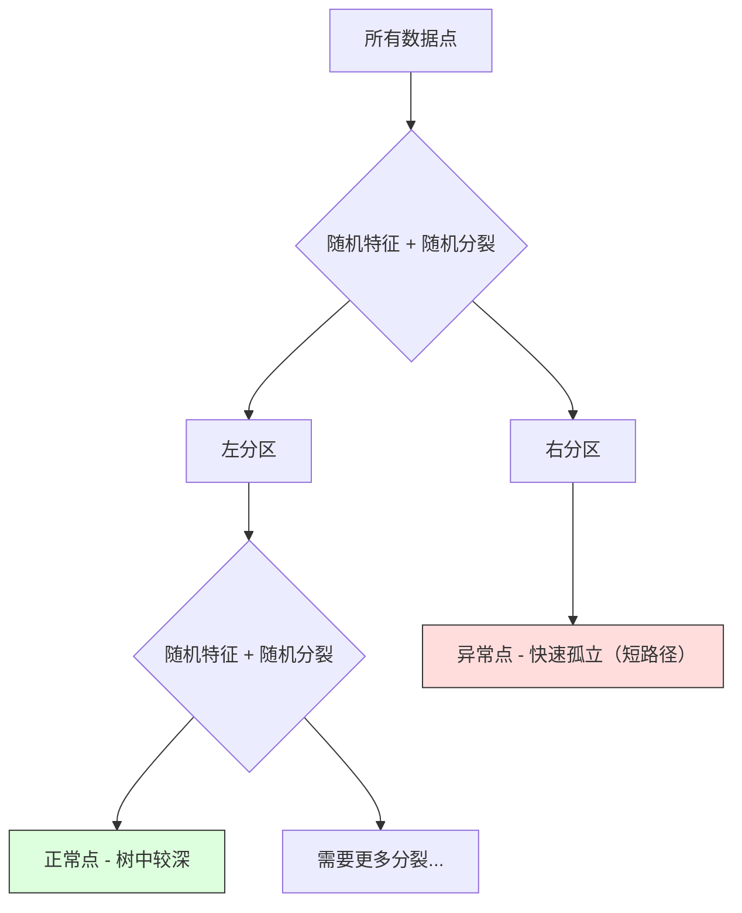

# 异常检测

> 正常很容易定义。异常就是一切不合常规的。

**类型：** 构建
**语言：** Python
**前置知识：** 第二阶段，第01-09课
**时间：** 约75分钟

## 学习目标

- 从头实现Z-score、IQR和孤立森林异常检测方法
- 区分点异常、上下文异常和集体异常，并为每种类型选择合适的检测方法
- 解释为什么异常检测被定义为对正常数据建模而非对异常进行分类
- 比较无监督异常检测与监督分类，并评估新异常覆盖率和精确率之间的权衡

## 问题

一张信用卡下午2点在纽约被使用，然后在下午2:05在东京被使用。一个工厂传感器读数为150度，而正常范围是80-120。一台服务器在日平均值为200的情况下发送了50,000个请求每秒。

这些都是异常。找到它们至关重要。欺诈造成数十亿的损失。设备故障导致停机。网络入侵导致数据泄露。

挑战在于：你很少有标记的异常样本。欺诈仅占交易的0.1%。设备故障每年发生几次。你无法训练标准的分类器，因为"异常"类几乎没有可学习的内容。即使你有一些标签，你见过的异常也不是你将会遇到的唯一类型。明天的欺诈手法与今天的不同。

异常检测反其道而行之。不是学习什么是异常的，而是学习什么是正常的。任何偏离正常的东西都是可疑的。这种方法无需标签即可工作，能适应新型异常，并可扩展到海量数据集。

## 概念

### 异常的类型

并非所有异常都是一样的：

- **点异常。** 一个无论上下文如何都显得不寻常的单个数据点。500度的温度读数。一笔来自通常消费50美元的账户的50,000美元交易。
- **上下文异常。** 一个在给定上下文中不寻常的数据点。90度在夏天是正常的，在冬天就是异常的。相同的数值，不同的上下文。
- **集体异常。** 一组作为整体不寻常的数据点序列，即使每个单独的点可能是正常的。五次登录失败是正常的。连续五十次就是暴力攻击。

大多数方法检测点异常。上下文异常需要时间或位置特征。集体异常需要序列感知方法。



### 无监督框架

在标准分类中，你有两个类别的标签。在异常检测中，你通常面临三种情况之一：

1. **完全无监督。** 没有任何标签。你在所有数据上拟合检测器，并希望异常足够稀少，不会破坏"正常"模型。
2. **半监督。** 你有一个干净的正常数据集。你在这个干净集上拟合，并对所有其他数据进行评分。这是可能情况下最强的设置。
3. **弱监督。** 你有少量标记的异常。将它们用于评估，而非训练。以无监督方式训练，然后在标记子集上测量精确率和召回率。

关键洞见：异常检测与分类有根本不同。你在建模正常数据的分布，而不是两个类别之间的决策边界。

### 监督 vs 无监督：权衡

如果你确实有标记的异常，应该将它们用于训练（监督分类）还是仅用于评估（无监督检测）？

**监督（视为分类）：**
- 能捕捉你之前见过的确切类型的异常
- 对已知异常类型有更高的精确率
- 完全遗漏新型异常
- 需要在新异常类型出现时重新训练
- 需要足够的异常样本（通常太少）

**无监督（对正常建模，标记偏差）：**
- 能捕捉任何偏离正常的情况，包括新型异常
- 不需要标记的异常
- 误报率更高（不是所有不寻常的都是坏的）
- 对分布漂移更鲁棒

在实践中，最好的系统结合两者：无监督检测提供广泛覆盖，监督模型负责已知的高优先级异常类型，人工审核负责模棱两可的情况。

### Z-Score方法

最简单的方法。计算每个特征的均值和标准差。标记任何距离均值超过k个标准差的点。

```text
z_score = (x - mean) / std
anomaly if |z_score| > threshold
```

默认阈值为3.0（对于高斯分布，99.7%的正常数据落在3个标准差内）。

**优点：** 简单。快速。可解释（"该值距离正常值4.5个标准差"）。

**缺点：** 假设数据服从正态分布。对训练数据中的异常值敏感（异常值会移动均值并夸大标准差，使它们更难检测）。在多模态分布上失效。

**何时效果良好：** 数据大致呈钟形的单特征监控。服务器响应时间、制造公差、具有稳定基线的传感器读数。

**何时失效：** 多聚类数据（两个具有不同基线温度的办公地点）、偏斜数据（1000美元罕见但并非异常的交易金额）、训练数据中包含异常值的数据。

### IQR方法

比Z-score更鲁棒。使用四分位距代替均值和标准差。

```
Q1 = 第25百分位数
Q3 = 第75百分位数
IQR = Q3 - Q1
lower_bound = Q1 - factor * IQR
upper_bound = Q3 + factor * IQR
anomaly if x < lower_bound or x > upper_bound
```

默认因子为1.5。

**优点：** 对异常值鲁棒（百分位数不受极端值影响）。适用于偏斜分布。无正态性假设。

**缺点：** 仅适用于单变量（每个特征独立应用）。无法检测仅在特征组合考虑时才不寻常的异常（一个点可能在每个单独特征上都是正常的，但在联合空间中却是异常的）。

**实用说明：** IQR中的1.5因子对应箱线图中的须线。须线之外的点是潜在异常值。使用3.0代替1.5会使检测器更保守（更少的标记，更少的误报）。合适的因子取决于你对误报的容忍度。

### 孤立森林

关键洞见：异常点数量少且与众不同。在数据的随机划分中，异常点更容易被孤立——它们需要更少的随机分裂就能与其余数据分离。



**工作原理：**
1. 构建许多随机树（一个孤立森林）
2. 在每个节点，选择一个随机特征和一个介于特征最小值和最大值之间的随机分裂值
3. 继续分裂直到每个点被孤立（在自己的叶节点中）
4. 异常点在所有树中的平均路径长度更短

**为什么有效：** 正常点位于密集区域。需要许多随机分裂才能将一个点与其邻居分离。异常点位于稀疏区域。一两次随机分裂就足以孤立它们。

异常分数基于所有树的平均路径长度，用随机二叉搜索树的期望路径长度进行归一化：

```
score(x) = 2^(-average_path_length(x) / c(n))
```

其中`c(n)`是n个样本的期望路径长度。分数接近1表示异常。分数接近0.5表示正常。分数接近0表示非常正常（深埋在密集簇中）。

**优点：** 无分布假设。适用于高维数据。可扩展性好（每棵树使用子样本，因此呈次线性）。处理混合特征类型。

**缺点：** 在密集区域中难以检测异常（掩蔽效应）。当许多特征无关时，随机分裂效果较差。

**关键超参数：**
- `n_estimators`：树的数量。100通常足够。更多树给出更稳定的分数但计算更慢。
- `max_samples`：每棵树的样本数。原始论文中默认为256。较小的值使单棵树不太准确但增加了多样性。子采样是孤立森林快速的原因——每棵树只看到数据的一小部分。
- `contamination`：预期的异常比例。仅用于设置阈值。不影响分数本身。

### 局部异常因子（LOF）

LOF比较一个点周围的局部密度与其邻居周围的密度。稀疏区域中被密集区域包围的点是异常的。

**工作原理：**
1. 对于每个点，找到其k个最近邻居
2. 计算局部可达密度（邻域有多密集）
3. 将每个点的密度与其邻居的密度进行比较
4. 如果一个点的密度远低于其邻居，则它是异常值

**LOF分数：**
- LOF接近1.0表示与邻居密度相似（正常）
- LOF大于1.0表示密度低于邻居（潜在异常）
- LOF远大于1.0（例如，2.0以上）表示密度显著更低（可能是异常）

"局部"部分至关重要。考虑一个具有两个簇的数据集：一个密集的1000点簇和一个稀疏的50点簇。稀疏簇边缘的一个点从全局来看并不异常——它有50个邻居。但如果其紧邻的邻居密度高于它，则它在局部上是不寻常的。LOF捕捉到了全局方法遗漏的这种细微差别。

**优点：** 检测局部异常（在其邻域中不寻常的点，即使从全局来看并不异常）。适用于不同密度的簇。

**缺点：** 在大数据集上慢（朴素实现为O(n^2)）。对k的选择敏感。在非常高的维度上效果不佳（维数灾难影响距离计算）。

### 方法对比

| 方法 | 假设 | 速度 | 处理高维 | 检测局部异常 |
|--------|------------|-------|-------------------|------------------------|
| Z-score | 正态分布 | 非常快 | 是（逐特征） | 否 |
| IQR | 无（逐特征） | 非常快 | 是（逐特征） | 否 |
| 孤立森林 | 无 | 快 | 是 | 部分 |
| LOF | 距离有意义 | 慢 | 较差 | 是 |

### 评估挑战

评估异常检测器比评估分类器更困难：

- **极端类别不平衡。** 在0.1%异常的情况下，对所有数据预测"正常"能得到99.9%的准确率。准确率毫无意义。
- **AUROC具有误导性。** 在严重不平衡的情况下，即使在实用阈值下模型遗漏了大多数异常，AUROC仍可能看起来不错。
- **更好的指标：** Precision@k（在排名前k的标记项中，有多少是真正的异常）、AUPRC（精确率-召回率曲线下面积）以及在固定误报率下的召回率。


### 异常检测流程

在实践中，异常检测遵循以下工作流：

1. **收集基线数据。** 理想情况下，选择你知道没有（或几乎没有）异常的时期。
2. **特征工程。** 原始特征加上派生特征（滚动统计量、时间特征、比率）。
3. **训练检测器。** 在基线数据上拟合。模型学习"正常"的样子。
4. **对新数据评分。** 每个新观测值得到一个异常分数。
5. **阈值选择。** 选择分数截断点。这是一个业务决策：更高的阈值意味着更少的误报但更多的遗漏异常。
6. **警报与调查。** 被标记的点进入人工审核或自动响应。
7. **反馈收集。** 记录标记项是真正异常还是误报。使用这些数据来评估检测器并随时间调整阈值。

这个流程永远不会"完成"。数据分布会变化，新的异常类型会出现，阈值需要调整。将异常检测视为一个活的系统，而非一次性的模型。

## 构建它

`code/anomaly_detection.py`中的代码从头实现了Z-score、IQR和孤立森林。

### Z-Score检测器

```python
def zscore_detect(X, threshold=3.0):
    mean = X.mean(axis=0)
    std = X.std(axis=0)
    std[std == 0] = 1.0
    z = np.abs((X - mean) / std)
    return z.max(axis=1) > threshold
```

简单且向量化。如果任何特征超过阈值，则标记该点。

### IQR检测器

```python
def iqr_detect(X, factor=1.5):
    q1 = np.percentile(X, 25, axis=0)
    q3 = np.percentile(X, 75, axis=0)
    iqr = q3 - q1
    iqr[iqr == 0] = 1.0
    lower = q1 - factor * iqr
    upper = q3 + factor * iqr
    outside = (X < lower) | (X > upper)
    return outside.any(axis=1)
```

### 从头实现孤立森林

从头实现构建了随机划分特征空间的孤立树：

```python
class IsolationTree:
    def __init__(self, max_depth):
        self.max_depth = max_depth

    def fit(self, X, depth=0):
        n, p = X.shape
        if depth >= self.max_depth or n <= 1:
            self.is_leaf = True
            self.size = n
            return self
        self.is_leaf = False
        self.feature = np.random.randint(p)
        x_min = X[:, self.feature].min()
        x_max = X[:, self.feature].max()
        if x_min == x_max:
            self.is_leaf = True
            self.size = n
            return self
        self.threshold = np.random.uniform(x_min, x_max)
        left_mask = X[:, self.feature] < self.threshold
        self.left = IsolationTree(self.max_depth).fit(X[left_mask], depth + 1)
        self.right = IsolationTree(self.max_depth).fit(X[~left_mask], depth + 1)
        return self
```

隔离一个点的路径长度决定了其异常分数。路径越短，越异常。

`IsolationForest`类包装了多棵树：

```python
class IsolationForest:
    def __init__(self, n_estimators=100, max_samples=256, seed=42):
        self.n_estimators = n_estimators
        self.max_samples = max_samples

    def fit(self, X):
        sample_size = min(self.max_samples, X.shape[0])
        max_depth = int(np.ceil(np.log2(sample_size)))
        for _ in range(self.n_estimators):
            idx = rng.choice(X.shape[0], size=sample_size, replace=False)
            tree = IsolationTree(max_depth=max_depth)
            tree.fit(X[idx])
            self.trees.append(tree)

    def anomaly_score(self, X):
        avg_path = average path length across all trees
        scores = 2.0 ** (-avg_path / c(max_samples))
        return scores
```

归一化因子`c(n)`是在具有n个元素的二叉搜索树中不成功搜索的期望路径长度。它等于`2 * H(n-1) - 2*(n-1)/n`，其中`H`是调和数。这种归一化确保分数在不同大小的数据集之间具有可比性。

### 演示场景

代码生成了多个测试场景：

1. **带异常值的单个簇。** 一个二维高斯簇，其中注入远离中心的异常点。所有方法在这里都应有效。
2. **多模态数据。** 三个不同大小和密度的簇。簇之间的点是异常的。Z-score表现不佳，因为逐特征的范围很宽。
3. **高维数据。** 50个特征，但异常点仅在其中5个特征上有所不同。测试方法能否在特征子集中找到异常点。

每个演示使用精确率、召回率、F1和Precision@k比较所有方法。

## 使用它

使用sklearn（使用库实现，而非从头实现）：

```python
from sklearn.ensemble import IsolationForest
from sklearn.neighbors import LocalOutlierFactor

iso = IsolationForest(n_estimators=100, contamination=0.05, random_state=42)
iso.fit(X_train)
predictions = iso.predict(X_test)

lof = LocalOutlierFactor(n_neighbors=20, contamination=0.05, novelty=True)
lof.fit(X_train)
predictions = lof.predict(X_test)
```

注意`contamination`设置了预期的异常比例。正确设置它很重要——太低会遗漏异常，太高会造成误报。

`anomaly_detection.py`中的代码将从头实现与sklearn在相同数据上进行了比较。

### sklearn的Contamination参数

sklearn中的`contamination`参数决定了将连续异常分数转换为二元预测的阈值。它不会改变底层分数。

```python
iso_5 = IsolationForest(contamination=0.05)
iso_10 = IsolationForest(contamination=0.10)
```

两者产生相同的异常分数。但`iso_5`标记前5%，而`iso_10`标记前10%。如果你不知道真正的异常率（通常不知道），将contamination设置为"auto"并直接使用原始分数。根据误报和漏报之间的成本权衡设置你自己的阈值。

### One-Class SVM

另一个值得了解的无监督异常检测器。One-Class SVM在高维特征空间中（使用核技巧）在正常数据周围拟合一个边界。

```python
from sklearn.svm import OneClassSVM

oc_svm = OneClassSVM(kernel="rbf", gamma="auto", nu=0.05)
oc_svm.fit(X_train)
predictions = oc_svm.predict(X_test)
```

`nu`参数近似于异常的比例。One-Class SVM在中小型数据集上表现良好，但不能扩展到非常大的数据（核矩阵呈二次增长）。

### 自编码器方法（预览）

自编码器是学习压缩和重建数据的神经网络。在正常数据上训练。在测试时，异常点具有高重建误差，因为网络只学会了重建正常模式。

这将在第三阶段（深度学习）中介绍，但原理是相同的：对正常内容建模，标记偏差。

### 集成异常检测

正如集成方法改进了分类（第11课），组合多个异常检测器也改进了检测。最简单的方法：

1. 运行多个检测器（Z-score, IQR, 孤立森林, LOF）
2. 将每个检测器的分数归一化到[0, 1]
3. 对归一化分数取平均
4. 标记平均分数超过阈值的点

这减少了误报，因为不同方法有不同的失败模式。被所有四种方法标记的点几乎肯定是异常的。仅被一种方法标记的点可能只是该方法的怪癖。

更复杂的集成根据每个检测器的估计可靠性（在已知异常的验证集上测量，如果可用）为其分配权重。

### 生产考虑因素

1. **阈值漂移。** 随着数据分布变化，固定的阈值会过时。监控异常分数的分布并定期调整。
2. **警报疲劳。** 太多误报会导致操作员停止关注。从高阈值开始（更少、更可靠的警报），随着信任的建立再降低阈值。
3. **集成方法。** 在生产中，组合多个检测器。仅在多种方法一致认为异常时才标记点。这显著减少了误报。
4. **特征工程。** 原始特征通常不够。添加滚动统计量、比率、距上次事件的时间以及领域特定特征。好的特征集比检测器的选择更重要。
5. **反馈循环。** 当操作员调查标记项并确认或驳回时，将其反馈到系统中。随时间积累标记数据以评估和改善检测器。

## 交付

本课产出：
- `outputs/skill-anomaly-detector.md`——用于选择正确检测器的决策技能
- `code/anomaly_detection.py`——从头实现的Z-score、IQR和孤立森林，以及与sklearn的比较

### 选择阈值

异常分数是连续的。你需要一个阈值来做二元决策。这是业务决策，而非技术决策。

考虑两种场景：
- **欺诈检测。** 遗漏欺诈代价高昂（退单、客户信任）。误报需要分析师花5分钟调查。设置较低的阈值以捕捉更多欺诈，接受更多误报。
- **设备维护。** 误报意味着不必要的停机，成本为50,000美元。遗漏故障意味着500,000美元的维修费。设置阈值以平衡这些成本。

在这两种情况下，最优阈值取决于误报和漏报之间的成本比率。绘制不同阈值下的精确率和召回率，叠加成本函数，选择成本最低的点。

### 扩展至生产

对于生产中的实时异常检测：

1. **批量训练，在线评分。** 定期（每天、每周）在最近的正常数据上训练模型。在每个新观测值到达时对其评分。
2. **特征计算必须匹配。** 如果你使用30天的滚动统计量进行训练，你需要30天的历史数据来计算新观测值的特征。缓冲所需的历史数据。
3. **分数分布监控。** 随时间追踪异常分数的分布。如果中位数分数向上漂移，要么是数据在变化，要么是模型已过时。
4. **可解释性。** 当你标记一个异常时，说明原因。Z-score："特征X高于正常值4.2个标准差。"孤立森林："该点平均在3.1次分裂后被隔离（正常点需要8.5次）。"

## 练习

1. **阈值调优。** 以0.5为步长，在1.0到5.0的阈值范围内运行Z-score检测器。绘制每个阈值下的精确率和召回率。你的数据的甜点在哪里？

2. **多变量异常。** 创建每个特征单独看起来正常但组合起来异常（例如，远离主簇对角线的点）的二维数据。展示逐特征的Z-score会遗漏这些，但孤立森林能捕捉到。

3. **从头实现LOF。** 使用k最近邻实现局部异常因子。与相同数据上的sklearn的LocalOutlierFactor进行比较。使用k=10和k=50——k的选择如何影响结果？

4. **流式异常检测。** 修改Z-score检测器以在流式设置中工作：在新点到达时更新运行均值和方差（Welford在线算法）。与相同数据上的批量Z-score进行比较。

5. **真实世界评估。** 取一个已知异常的数据集（例如，来自Kaggle的信用卡欺诈）。使用precision@100、precision@500和AUPRC评估所有四种方法。哪种方法效果最好？为什么？

## 关键术语

| 术语 | 人们说的意思 | 实际含义 |
|------|----------------|----------------------|
| 异常 | "异常值，不寻常的点" | 显著偏离正常数据预期模式的数据点 |
| 点异常 | "单个奇怪的数值" | 无论上下文如何都不寻常的单个观测值 |
| 上下文异常 | "正常值，错误的上下文" | 在给定上下文（时间、位置等）下不寻常，但在其他上下文中可能正常的观测值 |
| 孤立森林 | "用随机分裂找异常值" | 一组随机树，用比正常点更少的分裂即可孤立异常点 |
| 局部异常因子 | "与邻居比较密度" | 标记其局部密度远低于邻居密度的点的方法 |
| Z-score | "距离均值的标准差数" | (x - mean) / std，以标准差为单位衡量点距离中心多远 |
| IQR | "四分位距" | Q3 - Q1，衡量中间50%数据的分散程度，用于鲁棒的异常值检测 |
| Contamination | "预期异常比例" | 告诉检测器应将多少比例的数据标记为异常的超参数 |
| Precision@k | "前k个标记中有多少是真实的" | 仅在最可疑的前k个点上计算的精确率，适用于不平衡的异常检测 |
| AUPRC | "精确率-召回率曲线下面积" | 汇总所有阈值下精确率-召回率表现的指标，对不平衡数据优于AUROC |

## 延伸阅读

- [Liu et al., Isolation Forest (2008)](https://cs.nju.edu.cn/zhouzh/zhouzh.files/publication/icdm08b.pdf)——原始孤立森林论文
- [Breunig et al., LOF: Identifying Density-Based Local Outliers (2000)](https://dl.acm.org/doi/10.1145/342009.335388)——原始LOF论文
- [scikit-learn Outlier Detection docs](https://scikit-learn.org/stable/modules/outlier_detection.html)——所有sklearn异常检测器概览
- [Chandola et al., Anomaly Detection: A Survey (2009)](https://dl.acm.org/doi/10.1145/1541880.1541882)——异常检测方法的综合调查
- [Goldstein and Uchida, A Comparative Evaluation of Unsupervised Anomaly Detection Algorithms (2016)](https://journals.plos.org/plosone/article?id=10.1371/journal.pone.0152173)——10种方法在真实数据集上的实证比较
