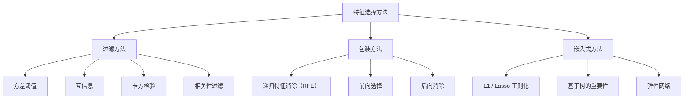
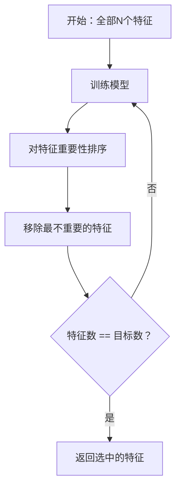
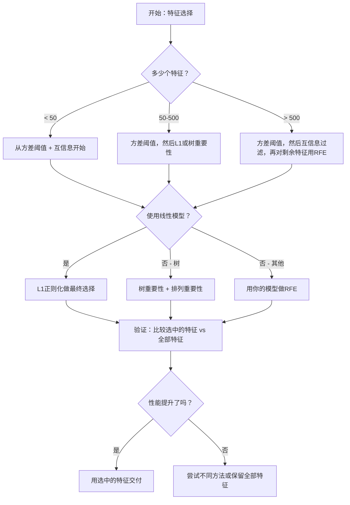

# 特征选择

> 更多的特征并不更好。正确的特征才更好。

**类型：** 构建
**语言：** Python
**前置知识：** 第二阶段，第01-09课，第08课（特征工程）
**时间：** 约75分钟

## 学习目标

- 从头实现过滤方法（方差阈值、互信息、卡方检验）和包装方法（RFE、前向选择）
- 解释为什么互信息能捕捉相关性无法捕捉的非线性特征-目标关系
- 比较L1正则化（嵌入式选择）与RFE（包装式选择）并评估它们的计算权衡
- 构建一个结合多种方法的特征选择流程，并在保留数据上展示泛化性能的提升

## 问题

你有500个特征。你的模型训练缓慢，不断过拟合，而且没人能解释它学到了什么。你添加更多特征希望能提高性能。结果却更糟。

这就是维数灾难的真实体现。随着特征数量的增长，特征空间的体积呈爆炸式增长。数据点变得稀疏。点之间的距离趋于收敛。模型需要指数级更多的数据来发现真正的模式。噪声特征淹没了信号特征。过拟合成为常态。

特征选择是解药。剥离噪声。去除冗余。保留携带目标实际信息的特征。结果是：更快的训练速度、更好的泛化能力以及你能够实际解释的模型。

目标不是使用所有可用信息。而是使用正确的信息。

## 概念

### 特征选择的三大类别

每种特征选择方法都属于以下三类之一：



**过滤方法**使用统计指标独立地对每个特征进行评分。它们不使用模型。速度快，但会遗漏特征间的交互。

**包装方法**训练一个模型来评估特征子集。它们使用模型性能作为评分标准。结果更好，但成本高，因为需要多次重新训练模型。

**嵌入式方法**在模型训练过程中选择特征。L1正则化将权重驱动为零。决策树在最有用的特征上分裂。选择发生在拟合过程中，而不是作为一个单独的步骤。

### 方差阈值

最简单的过滤方法。如果一个特征在样本之间几乎没有变化，它几乎不携带任何信息。

考虑一个在1000个样本中有999个为0.0的特征。其方差接近零。没有模型能用它来区分不同类别。移除它。

```
variance(x) = mean((x - mean(x))^2)
```

设置一个阈值（例如0.01）。丢弃所有方差低于该阈值的特征。这在不看目标变量的情况下移除了常数或接近常数的特征。

何时使用：作为其他方法之前的预处理步骤。它以近乎零的成本捕获明显无用的特征。

局限性：一个特征可以有高方差但仍然只是纯噪声。方差阈值是必要的但不够充分。

### 互信息

互信息衡量知道特征X的值在多大程度上减少了对目标Y的不确定性。

```
I(X; Y) = sum_x sum_y p(x, y) * log(p(x, y) / (p(x) * p(y)))
```

如果X和Y是独立的，则p(x, y) = p(x) * p(y)，所以对数项为零且I(X; Y) = 0。X告诉你关于Y的信息越多，互信息就越高。

与相关性相比的关键优势：互信息捕捉非线性关系。一个特征可能与目标有零相关但具有高互信息，因为这种关系是二次的或周期性的。

对于连续特征，先离散化为箱（基于直方图的估计）。箱的数量会影响估计——太少的箱会丢失信息，太多的箱会增加噪声。常用选择：sqrt(n)个箱或Sturges规则（1 + log2(n)）。


### 递归特征消除（RFE）

RFE是一种包装方法。它使用模型自身的特征重要性进行迭代剪枝：

1. 使用所有特征训练模型
2. 按重要性对特征排序（线性模型的系数，树的杂质减少量）
3. 移除最不重要的特征
4. 重复直到剩下所需数量的特征



RFE考虑了特征交互，因为模型同时看到所有剩余的特征。移除一个特征会改变其他特征的重要性。这使其比过滤方法更彻底。

代价：你训练模型的次数为N - 目标数。如果500个特征的目标是10个，那就是490次训练。对于昂贵的模型，这很慢。你可以通过每步移除多个特征来加速（例如每轮移除底部10%）。

### L1（Lasso）正则化

L1正则化将权重的绝对值添加到损失函数中：

```
loss = prediction_error + alpha * sum(|w_i|)
```

alpha参数控制特征被剪枝的激进程度。更高的alpha意味着更多的权重精确地变为零。

为什么会精确地变为零？L1惩罚在权重空间中创建了一个菱形约束区域。最优解往往落在这个菱形的某个角上，其中一个或多个权重为零。L2正则化（Ridge）创建一个圆形约束，权重会缩小但很少变为零。

这是嵌入式特征选择：模型在训练过程中学习忽略哪些特征。权重为零的特征被有效地移除。

优点：单次训练运行，能处理相关特征（选择一个并将其他置零），内置于大多数线性模型实现中。

局限性：仅适用于线性模型。无法捕捉非线性特征重要性。

### 基于树的特征重要性

决策树及其集成（随机森林、梯度提升）自然地排列特征。每次分裂都会减少杂质（分类用基尼或熵，回归用方差）。产生更大杂质减少的特征更重要。

对于具有T棵树的随机森林：

```
importance(feature_j) = (1/T) * sum over all trees of
    sum over all nodes splitting on feature_j of
        (n_samples * impurity_decrease)
```

这为每个特征给出一个归一化的重要性分数。它自动处理非线性关系和特征交互。

注意：基于树的重要性偏向于具有许多唯一值的特征（高基数）。一个随机ID列看起来很重要，因为它能完美地划分每个样本。使用排列重要性作为合理性检查。

### 排列重要性

一种与模型无关的方法：

1. 训练模型并记录在验证数据上的基线性能
2. 对于每个特征：随机打乱其值，测量性能的下降
3. 下降的幅度越大，特征越重要

如果打乱一个特征不影响性能，则模型不依赖它。如果性能崩溃，则该特征至关重要。

排列重要性避免了基于树的重要性的基数偏差。但它很慢：每个特征需要一次完整的评估，并重复多次以获取稳定性。

### 对比表

| 方法 | 类型 | 速度 | 非线性 | 特征交互 |
|--------|------|-------|-----------|---------------------|
| 方差阈值 | 过滤 | 非常快 | 否 | 否 |
| 互信息 | 过滤 | 快 | 是 | 否 |
| 相关性过滤 | 过滤 | 快 | 否 | 否 |
| RFE | 包装 | 慢 | 取决于模型 | 是 |
| L1 / Lasso | 嵌入式 | 快 | 否（线性） | 否 |
| 树重要性 | 嵌入式 | 中等 | 是 | 是 |
| 排列重要性 | 与模型无关 | 慢 | 是 | 是 |

### 决策流程图



## 构建它

### 第1步：生成具有已知特征结构的合成数据

```python
import numpy as np


def make_feature_selection_data(n_samples=500, seed=42):
    rng = np.random.RandomState(seed)

    x1 = rng.randn(n_samples)
    x2 = rng.randn(n_samples)
    x3 = rng.randn(n_samples)
    x4 = x1 + 0.1 * rng.randn(n_samples)
    x5 = x2 + 0.1 * rng.randn(n_samples)

    informative = np.column_stack([x1, x2, x3, x4, x5])

    correlated = np.column_stack([
        x1 * 0.9 + 0.1 * rng.randn(n_samples),
        x2 * 0.8 + 0.2 * rng.randn(n_samples),
        x3 * 0.7 + 0.3 * rng.randn(n_samples),
        x1 * 0.5 + x2 * 0.5 + 0.1 * rng.randn(n_samples),
        x2 * 0.6 + x3 * 0.4 + 0.1 * rng.randn(n_samples),
    ])

    noise = rng.randn(n_samples, 10) * 0.5

    X = np.hstack([informative, correlated, noise])
    y = (2 * x1 - 1.5 * x2 + x3 + 0.5 * rng.randn(n_samples) > 0).astype(int)

    feature_names = (
        [f"info_{i}" for i in range(5)]
        + [f"corr_{i}" for i in range(5)]
        + [f"noise_{i}" for i in range(10)]
    )

    return X, y, feature_names
```

我们知道真实情况：特征0-4是信息性的（其中3和4是0和1的相关副本），特征5-9与信息性特征相关，特征10-19是纯噪声。一个好的选择方法应将0-4排得最高，10-19排得最低。

### 第2步：方差阈值

```python
def variance_threshold(X, threshold=0.01):
    variances = np.var(X, axis=0)
    mask = variances > threshold
    return mask, variances
```

### 第3步：互信息（离散化）

```python
def discretize(x, n_bins=10):
    min_val, max_val = x.min(), x.max()
    if max_val == min_val:
        return np.zeros_like(x, dtype=int)
    bin_edges = np.linspace(min_val, max_val, n_bins + 1)
    binned = np.digitize(x, bin_edges[1:-1])
    return binned


def mutual_information(X, y, n_bins=10):
    n_samples, n_features = X.shape
    mi_scores = np.zeros(n_features)

    y_vals, y_counts = np.unique(y, return_counts=True)
    p_y = y_counts / n_samples

    for f in range(n_features):
        x_binned = discretize(X[:, f], n_bins)
        x_vals, x_counts = np.unique(x_binned, return_counts=True)
        p_x = dict(zip(x_vals, x_counts / n_samples))

        mi = 0.0
        for xv in x_vals:
            for yi, yv in enumerate(y_vals):
                joint_mask = (x_binned == xv) & (y == yv)
                p_xy = np.sum(joint_mask) / n_samples
                if p_xy > 0:
                    mi += p_xy * np.log(p_xy / (p_x[xv] * p_y[yi]))
        mi_scores[f] = mi

    return mi_scores
```

### 第4步：递归特征消除

```python
def simple_logistic_importance(X, y, lr=0.1, epochs=100):
    n_samples, n_features = X.shape
    w = np.zeros(n_features)
    b = 0.0

    for _ in range(epochs):
        z = X @ w + b
        pred = 1.0 / (1.0 + np.exp(-np.clip(z, -500, 500)))
        error = pred - y
        w -= lr * (X.T @ error) / n_samples
        b -= lr * np.mean(error)

    return w, b


def rfe(X, y, n_features_to_select=5, lr=0.1, epochs=100):
    n_total = X.shape[1]
    remaining = list(range(n_total))
    rankings = np.ones(n_total, dtype=int)
    rank = n_total

    while len(remaining) > n_features_to_select:
        X_subset = X[:, remaining]
        w, _ = simple_logistic_importance(X_subset, y, lr, epochs)
        importances = np.abs(w)

        least_idx = np.argmin(importances)
        original_idx = remaining[least_idx]
        rankings[original_idx] = rank
        rank -= 1
        remaining.pop(least_idx)

    for idx in remaining:
        rankings[idx] = 1

    selected_mask = rankings == 1
    return selected_mask, rankings
```

### 第5步：L1特征选择

```python
def soft_threshold(w, alpha):
    return np.sign(w) * np.maximum(np.abs(w) - alpha, 0)


def l1_feature_selection(X, y, alpha=0.1, lr=0.01, epochs=500):
    n_samples, n_features = X.shape
    w = np.zeros(n_features)
    b = 0.0

    for _ in range(epochs):
        z = X @ w + b
        pred = 1.0 / (1.0 + np.exp(-np.clip(z, -500, 500)))
        error = pred - y

        gradient_w = (X.T @ error) / n_samples
        gradient_b = np.mean(error)

        w -= lr * gradient_w
        w = soft_threshold(w, lr * alpha)
        b -= lr * gradient_b

    selected_mask = np.abs(w) > 1e-6
    return selected_mask, w
```

### 第6步：基于树的重要性（简单决策树）

```python
def gini_impurity(y):
    if len(y) == 0:
        return 0.0
    classes, counts = np.unique(y, return_counts=True)
    probs = counts / len(y)
    return 1.0 - np.sum(probs ** 2)


def best_split(X, y, feature_idx):
    values = np.unique(X[:, feature_idx])
    if len(values) <= 1:
        return None, -1.0

    best_threshold = None
    best_gain = -1.0
    parent_gini = gini_impurity(y)
    n = len(y)

    for i in range(len(values) - 1):
        threshold = (values[i] + values[i + 1]) / 2.0
        left_mask = X[:, feature_idx] <= threshold
        right_mask = ~left_mask

        n_left = np.sum(left_mask)
        n_right = np.sum(right_mask)

        if n_left == 0 or n_right == 0:
            continue

        gain = parent_gini - (n_left / n) * gini_impurity(y[left_mask]) - (n_right / n) * gini_impurity(y[right_mask])

        if gain > best_gain:
            best_gain = gain
            best_threshold = threshold

    return best_threshold, best_gain


def tree_importance(X, y, n_trees=50, max_depth=5, seed=42):
    rng = np.random.RandomState(seed)
    n_samples, n_features = X.shape
    importances = np.zeros(n_features)

    for _ in range(n_trees):
        sample_idx = rng.choice(n_samples, size=n_samples, replace=True)
        feature_subset = rng.choice(n_features, size=max(1, int(np.sqrt(n_features))), replace=False)

        X_boot = X[sample_idx]
        y_boot = y[sample_idx]

        tree_imp = _build_tree_importance(X_boot, y_boot, feature_subset, max_depth)
        importances += tree_imp

    total = importances.sum()
    if total > 0:
        importances /= total

    return importances


def _build_tree_importance(X, y, feature_subset, max_depth, depth=0):
    n_features = X.shape[1]
    importances = np.zeros(n_features)

    if depth >= max_depth or len(np.unique(y)) <= 1 or len(y) < 4:
        return importances

    best_feature = None
    best_threshold = None
    best_gain = -1.0

    for f in feature_subset:
        threshold, gain = best_split(X, y, f)
        if gain > best_gain:
            best_gain = gain
            best_feature = f
            best_threshold = threshold

    if best_feature is None or best_gain <= 0:
        return importances

    importances[best_feature] += best_gain * len(y)

    left_mask = X[:, best_feature] <= best_threshold
    right_mask = ~left_mask

    importances += _build_tree_importance(X[left_mask], y[left_mask], feature_subset, max_depth, depth + 1)
    importances += _build_tree_importance(X[right_mask], y[right_mask], feature_subset, max_depth, depth + 1)

    return importances
```

### 第7步：运行所有方法并比较

代码文件在相同的合成数据集上运行所有五种方法，并打印比较表，显示每种方法选择了哪些特征。

## 使用它

使用scikit-learn，特征选择内置在流程中：

```python
from sklearn.feature_selection import (
    VarianceThreshold,
    mutual_info_classif,
    RFE,
    SelectFromModel,
)
from sklearn.linear_model import Lasso, LogisticRegression
from sklearn.ensemble import RandomForestClassifier

vt = VarianceThreshold(threshold=0.01)
X_filtered = vt.fit_transform(X)

mi_scores = mutual_info_classif(X, y)
top_k = np.argsort(mi_scores)[-10:]

rfe_selector = RFE(LogisticRegression(), n_features_to_select=10)
rfe_selector.fit(X, y)
X_rfe = rfe_selector.transform(X)

lasso_selector = SelectFromModel(Lasso(alpha=0.01))
lasso_selector.fit(X, y)
X_lasso = lasso_selector.transform(X)

rf = RandomForestClassifier(n_estimators=100)
rf.fit(X, y)
importances = rf.feature_importances_
```

从头实现展示了每种方法内部的确切操作。方差阈值只是计算`var(X, axis=0)`并应用掩码。互信息是在列联表中计算联合频率和边际频率。RFE是一个训练、排序和剪枝的循环。L1是带软阈值步骤的梯度下降。树重要性是跨分裂累积的杂质减少量。没有魔法——只是统计和循环。

sklearn版本增加了鲁棒性（例如，`mutual_info_classif`使用k-NN密度估计而不是分箱）、速度（C实现）和流程集成。

## 交付

本课产出：
- `outputs/skill-feature-selector.md`——快速参考决策树，用于选择正确的特征选择方法

## 练习

1. **前向选择**：实现RFE的对立面。从零个特征开始。每一步，添加最能提高模型性能的特征。当添加特征不再有帮助时停止。将选中的特征与RFE结果进行比较。哪种更快？哪种结果更好？

2. **稳定性选择**：运行L1特征选择50次，每次在随机的80%数据子样本上运行，并使用略有不同的alpha值。统计每个特征被选中的频率。在超过80%的运行中被选中的特征是"稳定的"。将稳定特征与单次运行的L1选择进行比较。哪种更可靠？

3. **多重共线性检测**：计算所有特征的相关系数矩阵。实现一个函数，给定一个相关阈值（例如0.9），从每个高度相关的对中移除一个特征（保留与目标互信息更高的那个）。在合成数据集上测试，并验证它移除了冗余的相关特征。

4. **特征选择流程**：将方差阈值、互信息过滤和RFE链接成一个单一的流程。先移除近零方差的特征，然后按互信息保留前50%，最后对剩余特征运行RFE。将此流程与在所有特征上单独运行RFE进行比较。流程更快吗？精度相同吗？

5. **从头实现排列重要性**：实现排列重要性。对于每个特征，打乱其值10次，测量F1分数平均下降值。将排名与基于树的重要性进行比较。找到它们不一致的案例并解释原因（提示：相关特征）。

## 关键术语

| 术语 | 人们说的意思 | 实际含义 |
|------|----------------|----------------------|
| 过滤方法 | "独立地对特征评分" | 使用统计指标对特征排序而不训练模型的特征选择方法，单独评估每个特征 |
| 包装方法 | "用模型来选择特征" | 通过训练模型并使用其性能作为选择标准来评估特征子集的特征选择方法 |
| 嵌入式方法 | "模型在训练过程中选择特征" | 作为模型拟合一部分发生的特征选择，如L1正则化将权重驱动为零 |
| 互信息 | "一个变量告诉你多少关于另一个变量的信息" | 衡量在知道X的情况下关于Y的不确定性减少量，捕捉线性和非线性依赖关系 |
| 递归特征消除 | "训练、排序、剪枝、重复" | 一种迭代包装方法，训练模型，移除最不重要的特征，并重复直到达到目标数量 |
| L1 / Lasso 正则化 | "消灭特征的惩罚" | 将权重绝对值之和添加到损失函数中，将不重要特征的权重精确地驱动为零 |
| 方差阈值 | "移除常数特征" | 丢弃跨样本方差低于指定阈值的特征，过滤掉不携带信息的特征 |
| 特征重要性 | "哪些特征最重要" | 表示每个特征对模型预测贡献程度的分数，从分裂增益（树）或系数幅度（线性）计算 |
| 排列重要性 | "打乱并测量损失" | 通过随机打乱每个特征的值并测量模型性能的下降来评估特征重要性 |
| 维数灾难 | "特征太多，数据不够" | 添加特征呈指数级增加特征空间体积的现象，使数据变得稀疏且距离失去意义 |

## 延伸阅读

- [An Introduction to Variable and Feature Selection (Guyon & Elisseeff, 2003)](https://jmlr.org/papers/v3/guyon03a.html)——特征选择方法的基础性调查，至今仍被广泛引用
- [scikit-learn Feature Selection Guide](https://scikit-learn.org/stable/modules/feature_selection.html)——过滤、包装和嵌入式方法的实用参考，含代码示例
- [Stability Selection (Meinshausen & Buhlmann, 2010)](https://arxiv.org/abs/0809.2932)——将子采样与特征选择相结合，获得鲁棒、可重复的结果
- [Beware Default Random Forest Importances (Strobl et al., 2007)](https://bmcbioinformatics.biomedcentral.com/articles/10.1186/1471-2105-8-25)——展示基于树的重要性的基数偏差，并提出条件重要性作为替代方案
