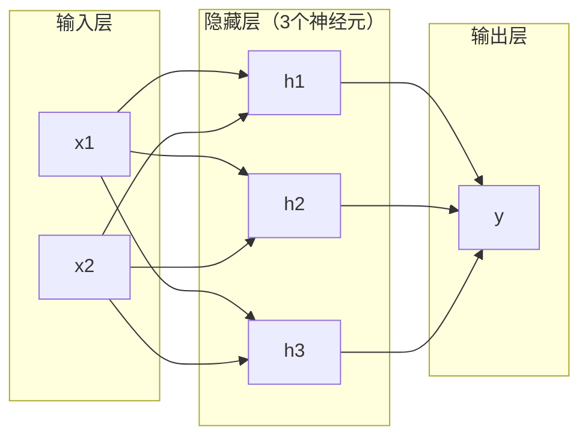
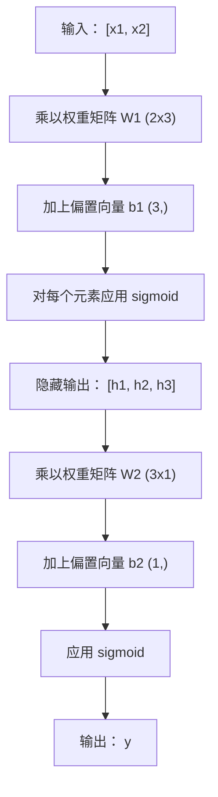

# 多层网络与前向传播

> 一个神经元画一条直线。把它们堆叠起来，你就能画出任何形状。

**类型：** 构建
**语言：** Python
**前置知识：** 阶段 01（数学基础），课程 03.01（感知机）
**时间：** ~90 分钟

## 学习目标

- 使用 Layer 和 Network 类从零构建一个多层网络，完成完整的前向传播
- 追踪矩阵维度在网络各层中的变化，识别形状不匹配
- 解释堆叠非线性激活函数如何使网络能够学习弯曲的决策边界
- 使用 2-2-1 架构配合手动调整的 sigmoid 权重解决 XOR 问题

## 问题

单个神经元就是一个画线器。仅此而已。一条穿过数据的直线。AI 中的每一个实际问题——图像识别、语言理解、下围棋——都需要曲线。将神经元堆叠成层，你就能得到曲线。

1969 年，Minsky 和 Papert 证明了这种局限性是致命的：单层网络无法学习 XOR。不是"难以学习"——而是数学上无法做到。XOR 真值表将 [0,1] 和 [1,0] 放在一边，[0,0] 和 [1,1] 放在另一边。没有一条直线能够分开它们。

这导致了神经网络研究资金中断超过十年。解决方案事后看来很明显：停止使用单层。将神经元堆叠成层。让第一层将输入空间雕刻成新的特征，让第二层将这些特征组合成任何单条直线都无法做出的决策。

这个堆叠就是多层网络。它是当今生产中所有深度学习模型的基础。前向传播——数据从输入经过隐藏层流向输出——是你需要构建的第一个东西，没有它其他一切都无法工作。

## 概念

### 层：输入层、隐藏层、输出层

一个多层网络有三种类型的层：

**输入层**——并不是真正的层。它保存你的原始数据。两个特征意味着两个输入节点。这里不进行计算。

**隐藏层**——工作发生的地方。每个神经元接收前一层所有输出，应用权重和偏置，然后将结果通过激活函数传递。"隐藏"是因为你在训练数据中永远看不到这些值。

**输出层**——最终答案。对于二分类，一个带 sigmoid 的神经元。对于多分类，每个类别一个神经元。



这是一个 2-3-1 网络。两个输入，三个隐藏神经元，一个输出。每条连接都携带一个权重。每个神经元（除输入外）都携带一个偏置。

每一层产生一个称为隐藏状态的数字向量。对于文本，隐藏状态增加维度——将一个词编码为 768 个数字以捕获语义含义。对于图像，它们降低维度——将数百万像素压缩成可管理的表示。隐藏状态是学习发生的地方。

### 神经元与激活函数

每个神经元做三件事：

1. 将每个输入乘以相应的权重
2. 将所有乘积相加并加上偏置
3. 将和通过激活函数传递

目前，激活函数是 sigmoid：

```
sigmoid(z) = 1 / (1 + e^(-z))
```

Sigmoid 将任何数压缩到 (0, 1) 范围。大的正输入推向 1。大的负输入推向 0。零映射到 0.5。这条平滑曲线使学习成为可能——与感知机的硬阶梯不同，sigmoid 处处都有梯度。

### 前向传播：数据如何流动

前向传播将输入数据逐层推过网络，直到到达输出。前向传播期间没有学习发生。它纯粹是计算：乘、加、激活、重复。



在每一层，三个操作依次进行：

```
z = W * input + b       （线性变换）
a = sigmoid(z)           （激活函数）
```

前一层的输出成为下一层的输入。这就是完整的前向传播。

### 矩阵维度

追踪维度是深度学习中最关键的调试技能。以下是 2-3-1 网络：

| 步骤 | 操作 | 维度 | 结果形状 |
|------|----------|------------|-------------|
| 输入 | x | -- | (2,) |
| 隐藏层线性 | W1 * x + b1 | W1: (3, 2), b1: (3,) | (3,) |
| 隐藏层激活 | sigmoid(z1) | -- | (3,) |
| 输出层线性 | W2 * h + b2 | W2: (1, 3), b2: (1,) | (1,) |
| 输出层激活 | sigmoid(z2) | -- | (1,) |

规则：第 k 层的权重矩阵 W 的形状为 (neurons_in_layer_k, neurons_in_layer_k_minus_1)。行数匹配当前层。列数匹配前一层。如果形状不匹配，那就是一个 bug。

### 万能逼近定理

1989 年，George Cybenko 证明了一个了不起的结果：一个具有单隐藏层和足够多神经元的神经网络可以以任意精度逼近任何连续函数。

这并不意味着单隐藏层永远是最好的。它意味着该架构在理论上是可行的。在实践中，更深的网络（更多层，每层更少的神经元）用更少的总参数就能学习相同的函数，而浅而宽的网络则需要更多参数。这就是深度学习有效的原因。

直觉：隐藏层中的每个神经元学习一个"凸起"或特征。足够多的凸起放置在正确的位置可以逼近任何平滑曲线。神经元越多，凸起越多，逼近效果越好。


### 可组合性

神经网络是可组合的。你可以堆叠它们、链接它们、并行运行它们。Whisper 模型使用编码器网络处理音频，使用单独的解码器网络生成文本。现代 LLM 是仅解码器架构。BERT 是仅编码器架构。T5 是编码器-解码器架构。架构选择决定了模型能做什么。

```figure
mlp-forward
```

## 构建

纯 Python。不使用 numpy。每个矩阵操作都从头编写。

### 步骤 1：Sigmoid 激活函数

```python
import math

def sigmoid(x):
    x = max(-500.0, min(500.0, x))
    return 1.0 / (1.0 + math.exp(-x))
```

限制在 [-500, 500] 范围内防止溢出。`math.exp(500)` 很大但有限。`math.exp(1000)` 是无穷大。

### 步骤 2：Layer 类

深度学习中最重要的操作是矩阵乘法。每一层、每个注意力头、每次前向传播——本质上都是矩阵乘法。一个线性层接收输入向量，乘以权重矩阵，然后加上偏置向量：y = Wx + b。这一个方程占据了神经网络 90% 的计算量。

一个层持有一个权重矩阵和一个偏置向量。它的 forward 方法接收一个输入向量并返回激活后的输出。

```python
class Layer:
    def __init__(self, n_inputs, n_neurons, weights=None, biases=None):
        if weights is not None:
            self.weights = weights
        else:
            import random
            self.weights = [
                [random.uniform(-1, 1) for _ in range(n_inputs)]
                for _ in range(n_neurons)
            ]
        if biases is not None:
            self.biases = biases
        else:
            self.biases = [0.0] * n_neurons

    def forward(self, inputs):
        self.last_input = inputs
        self.last_output = []
        for neuron_idx in range(len(self.weights)):
            z = sum(
                w * x for w, x in zip(self.weights[neuron_idx], inputs)
            )
            z += self.biases[neuron_idx]
            self.last_output.append(sigmoid(z))
        return self.last_output
```

权重矩阵的形状为 (n_neurons, n_inputs)。每一行是一个神经元在所有输入上的权重。forward 方法遍历神经元，计算加权和加偏置，应用 sigmoid，并收集结果。

### 步骤 3：Network 类

网络是一个层的列表。前向传播将它们链接起来：第 k 层的输出馈入第 k+1 层。

```python
class Network:
    def __init__(self, layers):
        self.layers = layers

    def forward(self, inputs):
        current = inputs
        for layer in self.layers:
            current = layer.forward(current)
        return current
```

这就是完整的前向传播。四行逻辑。数据进入，流经每一层，从另一端出来。

### 步骤 4：手动调整权重的 XOR

在课程 01 中，我们通过组合 OR、NAND 和 AND 感知机解决了 XOR。现在用我们的 Layer 和 Network 类做同样的事情。2-2-1 架构：两个输入，两个隐藏神经元，一个输出。

```python
hidden = Layer(
    n_inputs=2,
    n_neurons=2,
    weights=[[20.0, 20.0], [-20.0, -20.0]],
    biases=[-10.0, 30.0],
)

output = Layer(
    n_inputs=2,
    n_neurons=1,
    weights=[[20.0, 20.0]],
    biases=[-30.0],
)

xor_net = Network([hidden, output])

xor_data = [
    ([0, 0], 0),
    ([0, 1], 1),
    ([1, 0], 1),
    ([1, 1], 0),
]

for inputs, expected in xor_data:
    result = xor_net.forward(inputs)
    predicted = 1 if result[0] >= 0.5 else 0
    print(f"  {inputs} -> {result[0]:.6f} (四舍五入： {predicted}, 期望值： {expected})")
```

大权重（20, -20）使 sigmoid 表现得像一个阶梯函数。第一个隐藏神经元近似 OR。第二个近似 NAND。输出神经元将它们组合成 AND，这就是 XOR。

### 步骤 5：圆形分类

一个更难的问题：将二维点分类为以原点为中心、半径为 0.5 的圆的内部或外部。这需要弯曲的决策边界——单个感知机无法做到。

```python
import random
import math

random.seed(42)

data = []
for _ in range(200):
    x = random.uniform(-1, 1)
    y = random.uniform(-1, 1)
    label = 1 if (x * x + y * y) < 0.25 else 0
    data.append(([x, y], label))

circle_net = Network([
    Layer(n_inputs=2, n_neurons=8),
    Layer(n_inputs=8, n_neurons=1),
])
```

使用随机权重，网络无法很好地进行分类。但前向传播仍然可以运行。这就是关键所在——前向传播只是计算。学习正确的权重是反向传播的工作，将在课程 03 中介绍。

```python
correct = 0
for inputs, expected in data:
    result = circle_net.forward(inputs)
    predicted = 1 if result[0] >= 0.5 else 0
    if predicted == expected:
        correct += 1

print(f"随机权重准确率： {correct}/{len(data)} ({100*correct/len(data):.1f}%)")
```

随机权重的准确率很低——通常比猜测多数类还要差。经过训练（课程 03）后，这个具有 8 个隐藏神经元的相同架构将绘制出一个弯曲的边界，将内部与外部隔开。

## 使用

PyTorch 用四行代码完成了上述所有操作：

```python
import torch
import torch.nn as nn

model = nn.Sequential(
    nn.Linear(2, 8),
    nn.Sigmoid(),
    nn.Linear(8, 1),
    nn.Sigmoid(),
)

x = torch.tensor([[0.0, 0.0], [0.0, 1.0], [1.0, 0.0], [1.0, 1.0]])
output = model(x)
print(output)
```

`nn.Linear(2, 8)` 就是你的 Layer 类：形状为 (8, 2) 的权重矩阵，形状为 (8,) 的偏置向量。`nn.Sigmoid()` 是按元素应用的 sigmoid 函数。`nn.Sequential` 就是你的 Network 类：按顺序链接各层。

区别在于速度和规模。PyTorch 在 GPU 上运行，处理数百万样本的批次，并自动为反向传播计算梯度。但前向传播的逻辑与你刚刚从零构建的完全相同。

## 交付

本课程产出一个可复用的提示词，用于设计网络架构：

- `outputs/prompt-network-architect.md`

当你需要决定使用多少层、每层多少个神经元以及哪些激活函数时，可以使用它。

## 练习

1. 构建一个 2-4-2-1 网络（两个隐藏层），在 XOR 数据上使用随机权重运行前向传播。打印中间隐藏层的输出，观察表示在各层如何变换。

2. 将圆形分类器中的隐藏层大小从 8 改为 2，再改为 32。每次使用随机权重运行前向传播。隐藏神经元数量的变化是否改变了输出范围或分布？为什么？

3. 在 Network 类上实现一个 `count_parameters` 方法，返回可训练权重和偏置的总数。在 784-256-128-10 网络（经典的 MNIST 架构）上测试它。它有多少个参数？

4. 为 3-4-4-2 网络构建前向传播。输入 RGB 颜色值（归一化到 0-1），观察两个输出。这是一个简单的两类颜色分类器的架构。

5. 将 sigmoid 替换为"泄露阶梯"函数：如果 z < 0 返回 0.01 * z，否则返回 1.0。使用步骤 4 中相同的手动调整权重在 XOR 上运行前向传播。它还能工作吗？为什么平滑的 sigmoid 优于硬截断？

## 关键术语

| 术语 | 人们怎么说 | 实际含义 |
|------|-----------|---------|
| 前向传播 | "运行模型" | 将输入推过每一层——乘以权重、加偏置、激活——产生输出 |
| 隐藏层 | "中间部分" | 输入和输出之间的任何层，其值在数据中不可直接观测 |
| 多层网络 | "深度神经网络" | 顺序堆叠的神经元层，每一层的输出馈入下一层的输入 |
| 激活函数 | "非线性" | 在线性变换之后应用的函数，为决策边界引入曲线 |
| Sigmoid | "S 曲线" | sigma(z) = 1/(1+e^(-z))，将任何实数压缩到 (0,1)，处处平滑可微 |
| 权重矩阵 | "参数" | 形状为 (当前层神经元数, 前一层神经元数) 的矩阵 W，包含可学习的连接强度 |
| 偏置向量 | "偏移量" | 矩阵乘法后添加的向量，使神经元即使在所有输入为零时也能激活 |
| 万能逼近 | "神经网络可以学习任何东西" | 一个具有足够神经元的单隐藏层可以逼近任何连续函数——但"足够"可能意味着数十亿 |
| 线性变换 | "矩阵乘法步骤" | z = W * x + b，激活之前的计算，将输入映射到一个新空间 |
| 决策边界 | "分类器切换的地方" | 输入空间中网络输出越过分类阈值的曲面 |

## 延伸阅读

- Michael Nielsen, "Neural Networks and Deep Learning", 第 1-2 章 (http://neuralnetworksanddeeplearning.com/) —— 关于前向传播和网络结构最清晰的免费解释，带有交互式可视化
- Cybenko, "Approximation by Superpositions of a Sigmoidal Function" (1989) —— 原始的万能逼近定理论文，出人意料地易读
- 3Blue1Brown, "But what is a neural network?" (https://www.youtube.com/watch?v=aircAruvnKk) —— 20 分钟的可视化讲解，涵盖层、权重和前向传播，帮助你建立正确的思维模型
- Goodfellow, Bengio, Courville, "Deep Learning", 第 6 章 (https://www.deeplearningbook.org/) —— 多层网络的标准参考，免费在线
