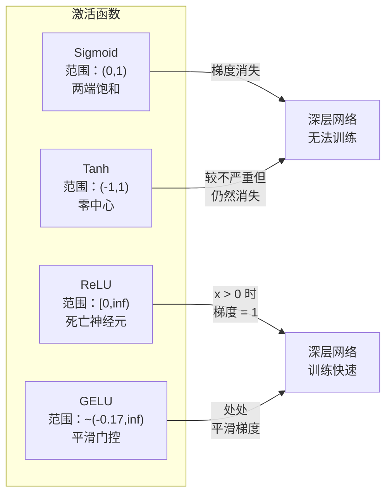
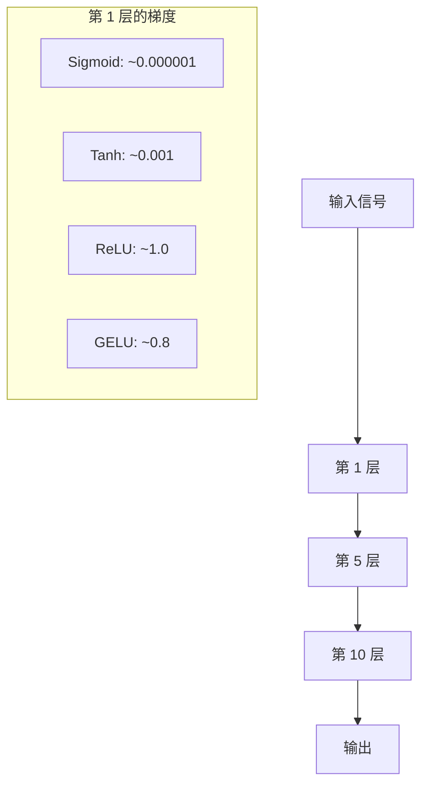
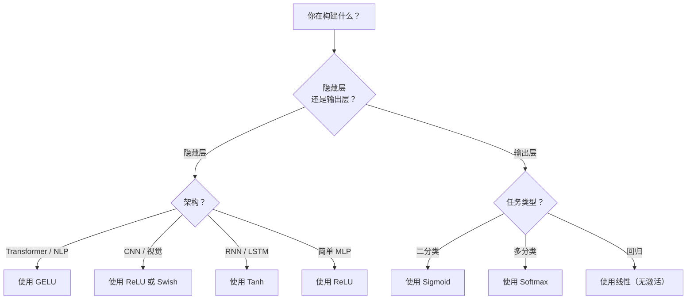

# 激活函数

> 没有非线性，你的 100 层网络就是一个花哨的矩阵乘法。激活函数是让神经网络能够用曲线思考的大门。

**类型：** 构建
**语言：** Python
**前置知识：** 课程 03.03（反向传播）
**时间：** ~75 分钟

## 学习目标

- 从零实现 sigmoid、tanh、ReLU、Leaky ReLU、GELU、Swish 和 softmax 及其导数
- 通过测量 10 层以上不同激活函数的激活值大小来诊断梯度消失问题
- 检测 ReLU 网络中的死亡神经元，并解释为什么 GELU 避免了这种故障模式
- 为给定架构（Transformer、CNN、RNN、输出层）选择正确的激活函数

## 问题

堆叠两个线性变换：y = W2(W1x + b1) + b2。展开它：y = W2W1x + W2b1 + b2。这就是 y = Ax + c——一个单一的线性变换。无论堆叠多少个线性层，结果都会退化成一个矩阵乘法。你的 100 层网络与单层具有相同的表示能力。

这不是一个理论上的好奇心。这意味着一个深度线性网络根本无法学习 XOR，无法对螺旋数据集进行分类，无法识别面部。没有激活函数，深度就是幻觉。

激活函数打破了线性。它们通过非线性函数扭曲每层的输出，使网络能够弯曲决策边界、逼近任意函数并真正学习。但选错了激活函数，你的梯度会消失为零（深层网络中的 sigmoid），爆炸到无穷大（没有仔细初始化的无界激活函数），或者你的神经元永久死亡（具有大负偏置的 ReLU）。激活函数的选择直接决定了你的网络是否能够学习。

## 概念

### 为什么非线性是必要的

矩阵乘法是可组合的。将一个向量先乘以矩阵 A 再乘以矩阵 B 等同于乘以 AB。这意味着堆叠十个线性层在数学上等同于一个具有一个大矩阵的线性层。所有的参数、所有的深度——都浪费了。你需要一些东西来打破这个链条。这就是激活函数的作用。

以下是证明。一个线性层计算 f(x) = Wx + b。堆叠两个：

```
第 1 层：h = W1 * x + b1
第 2 层：y = W2 * h + b2
```

代入：

```
y = W2 * (W1 * x + b1) + b2
y = (W2 * W1) * x + (W2 * b1 + b2)
y = A * x + c
```

一个层。在层之间插入一个非线性激活 g()：

```
h = g(W1 * x + b1)
y = W2 * h + b2
```

现在代入被打破了。W2 * g(W1 * x + b1) + b2 不能简化为一个单一的线性变换。网络可以表示非线性函数。每一层带有激活函数的层都增加了表示能力。

### Sigmoid

神经网络最初的激活函数。

```
sigmoid(x) = 1 / (1 + e^(-x))
```

输出范围：(0, 1)。平滑、可微，将任何实数映射到类似概率的值。

导数：

```
sigmoid'(x) = sigmoid(x) * (1 - sigmoid(x))
```

这个导数的最大值是 0.25，在 x = 0 处。在反向传播中，梯度通过层相乘。十层 sigmoid 意味着梯度最多乘以 0.25 十次：

```
0.25^10 = 0.000000953674
```

不到原始信号的百万分之一。这就是梯度消失问题。早期层中的梯度变得如此之小，以至于权重几乎不更新。网络看似在学习——损失在后期层中减少——但前几层是冻结的。深度 sigmoid 网络根本无法训练。

额外的问题：sigmoid 输出总是正的（0 到 1），这意味着权重上的梯度总是相同的符号。这导致在梯度下降过程中出现锯齿形振荡。

### Tanh

Sigmoid 的居中版本。

```
tanh(x) = (e^x - e^(-x)) / (e^x + e^(-x))
```

输出范围：(-1, 1)。零中心，消除了锯齿形问题。

导数：

```
tanh'(x) = 1 - tanh(x)^2
```

最大导数为 1.0，在 x = 0 处——比 sigmoid 好四倍。但梯度消失问题仍然存在。对于大的正输入或负输入，导数趋近于零。十层仍然会压扁梯度，只是不那么激进。

### ReLU：突破性进展

整流线性单元（Rectified Linear Unit）。由 Nair 和 Hinton 在 2010 年推广到深度学习（这个函数本身可以追溯到 Fukushima 1969 年的工作），它改变了一切。

```
relu(x) = max(0, x)
```

输出范围：[0, 无穷大)。导数非常简单：

```
relu'(x) = 1  如果 x > 0
            0  如果 x <= 0
```

对于正输入没有梯度消失。梯度正好是 1，直接传递过去。这就是为什么深层网络变得可训练——ReLU 在各层之间保持梯度大小。

但有一个故障模式：死亡神经元问题。如果一个神经元的加权输入总是负的（由于大的负偏置或不幸的权重初始化），它的输出总是零，它的梯度总是零，它永远不会更新。它永久性地死亡。在实践中，ReLU 网络中 10-40% 的神经元可能在训练期间死亡。

### Leaky ReLU

对死亡神经元最简单的修复。

```
leaky_relu(x) = x        如果 x > 0
                 alpha * x  如果 x <= 0
```

其中 alpha 是一个小常数，通常为 0.01。负侧有一个小斜率而不是零，所以死亡神经元仍然可以获得梯度信号并可以恢复。

### GELU：现代默认选择

高斯误差线性单元（Gaussian Error Linear Unit）。由 Hendrycks 和 Gimpel 在 2016 年提出。BERT、GPT 和大多数现代 Transformer 的默认激活函数。

```
gelu(x) = x * Phi(x)
```

其中 Phi(x) 是标准正态分布的累积分布函数。实践中使用的近似：

```
gelu(x) ~= 0.5 * x * (1 + tanh(sqrt(2/pi) * (x + 0.044715 * x^3)))
```

GELU 处处平滑，允许小的负值（不像 ReLU 硬裁剪到零），并具有概率解释：它根据每个输入在高斯分布下为正的可能性来加权输入。这种平滑门控在 Transformer 架构中优于 ReLU，因为它提供了更好的梯度流并完全避免了死亡神经元问题。

### Swish / SiLU

由 Ramachandran 等人在 2017 年通过自动搜索发现的自门控激活函数。

```
swish(x) = x * sigmoid(x)
```

Swish 形式上是 x * sigmoid(x)。Google 通过在激活函数空间上的自动搜索发现了它——一个神经网络正在设计神经网络的部分。

与 GELU 一样，它是平滑的、非单调的，并允许小的负值。区别很微妙：Swish 使用 sigmoid 进行门控，而 GELU 使用高斯 CDF。在实践中，性能几乎相同。Swish 用于 EfficientNet 和一些视觉模型。GELU 在语言模型中占主导地位。

### Softmax：输出激活函数

不在隐藏层中使用。Softmax 将原始分数（logits）向量转换为概率分布。

```
softmax(x_i) = e^(x_i) / sum(e^(x_j) 对所有 j)
```

每个输出都在 0 和 1 之间。所有输出之和为 1。这使其成为多分类的标准最终激活函数。最大的 logit 获得最高的概率，但与 argmax 不同，softmax 是可微的，并保留关于相对置信度的信息。

### 形状对比



### 梯度流对比



### 何时使用哪种激活函数



```figure
softmax-temperature
```

## 构建

### 步骤 1：实现所有激活函数及其导数

每个函数接收一个浮点数并返回一个浮点数。每个导数函数接收相同的输入并返回梯度。

```python
import math

def sigmoid(x):
    x = max(-500, min(500, x))
    return 1.0 / (1.0 + math.exp(-x))

def sigmoid_derivative(x):
    s = sigmoid(x)
    return s * (1 - s)

def tanh_act(x):
    return math.tanh(x)

def tanh_derivative(x):
    t = math.tanh(x)
    return 1 - t * t

def relu(x):
    return max(0.0, x)

def relu_derivative(x):
    return 1.0 if x > 0 else 0.0

def leaky_relu(x, alpha=0.01):
    return x if x > 0 else alpha * x

def leaky_relu_derivative(x, alpha=0.01):
    return 1.0 if x > 0 else alpha

def gelu(x):
    return 0.5 * x * (1 + math.tanh(math.sqrt(2 / math.pi) * (x + 0.044715 * x ** 3)))

def gelu_derivative(x):
    phi = 0.5 * (1 + math.erf(x / math.sqrt(2)))
    pdf = math.exp(-0.5 * x * x) / math.sqrt(2 * math.pi)
    return phi + x * pdf

def swish(x):
    return x * sigmoid(x)

def swish_derivative(x):
    s = sigmoid(x)
    return s + x * s * (1 - s)

def softmax(xs):
    max_x = max(xs)
    exps = [math.exp(x - max_x) for x in xs]
    total = sum(exps)
    return [e / total for e in exps]
```

### 步骤 2：可视化梯度消失的位置

计算从 -5 到 5 的 100 个均匀分布点的梯度。打印一个文本直方图，显示每个激活函数的梯度接近零的位置。

```python
def gradient_scan(name, derivative_fn, start=-5, end=5, n=100):
    step = (end - start) / n
    near_zero = 0
    healthy = 0
    for i in range(n):
        x = start + i * step
        g = derivative_fn(x)
        if abs(g) < 0.01:
            near_zero += 1
        else:
            healthy += 1
    pct_dead = near_zero / n * 100
    print(f"{name:15s}: {healthy:3d} healthy, {near_zero:3d} near-zero ({pct_dead:.0f}% dead zone)")

gradient_scan("Sigmoid", sigmoid_derivative)
gradient_scan("Tanh", tanh_derivative)
gradient_scan("ReLU", relu_derivative)
gradient_scan("Leaky ReLU", leaky_relu_derivative)
gradient_scan("GELU", gelu_derivative)
gradient_scan("Swish", swish_derivative)
```

### 步骤 3：梯度消失实验

使用 sigmoid vs ReLU 将信号前向传播通过 N 层。测量激活值大小如何变化。

```python
import random

def vanishing_gradient_experiment(activation_fn, name, n_layers=10, n_inputs=5):
    random.seed(42)
    values = [random.gauss(0, 1) for _ in range(n_inputs)]

    print(f"\n{name} 通过 {n_layers} 层：")
    for layer in range(n_layers):
        weights = [random.gauss(0, 1) for _ in range(n_inputs)]
        z = sum(w * v for w, v in zip(weights, values))
        activated = activation_fn(z)
        magnitude = abs(activated)
        bar = "#" * int(magnitude * 20)
        print(f"  第 {layer+1:2d} 层： magnitude = {magnitude:.6f} {bar}")
        values = [activated] * n_inputs

vanishing_gradient_experiment(sigmoid, "Sigmoid")
vanishing_gradient_experiment(relu, "ReLU")
vanishing_gradient_experiment(gelu, "GELU")
```

### 步骤 4：死亡神经元检测器

创建一个 ReLU 网络，通过随机输入，计算多少个神经元从未激活。

```python
def dead_neuron_detector(n_inputs=5, hidden_size=20, n_samples=1000):
    random.seed(0)
    weights = [[random.gauss(0, 1) for _ in range(n_inputs)] for _ in range(hidden_size)]
    biases = [random.gauss(0, 1) for _ in range(hidden_size)]

    fire_counts = [0] * hidden_size

    for _ in range(n_samples):
        inputs = [random.gauss(0, 1) for _ in range(n_inputs)]
        for neuron_idx in range(hidden_size):
            z = sum(w * x for w, x in zip(weights[neuron_idx], inputs)) + biases[neuron_idx]
            if relu(z) > 0:
                fire_counts[neuron_idx] += 1

    dead = sum(1 for c in fire_counts if c == 0)
    rarely_fire = sum(1 for c in fire_counts if 0 < c < n_samples * 0.05)
    healthy = hidden_size - dead - rarely_fire

    print(f"\n死亡神经元报告（{hidden_size} 个神经元，{n_samples} 个样本）：")
    print(f"  死亡（从未激活）：     {dead}")
    print(f"  几乎存活（<5%）：     {rarely_fire}")
    print(f"  健康：                {healthy}")
    print(f"  死亡率：       {dead/hidden_size*100:.1f}%")

    for i, c in enumerate(fire_counts):
        status = "死亡" if c == 0 else "微弱" if c < n_samples * 0.05 else "正常"
        bar = "#" * (c * 40 // n_samples)
        print(f"  神经元 {i:2d}: {c:4d}/{n_samples} 激活 [{status:4s}] {bar}")

dead_neuron_detector()
```

### 步骤 5：训练对比——Sigmoid vs ReLU vs GELU

用三种不同的激活函数在圆形数据集（圆内点 = 类 1，圆外点 = 类 0）上训练相同的两层网络。比较收敛速度。

```python
def make_circle_data(n=200, seed=42):
    random.seed(seed)
    data = []
    for _ in range(n):
        x = random.uniform(-2, 2)
        y = random.uniform(-2, 2)
        label = 1.0 if x * x + y * y < 1.5 else 0.0
        data.append(([x, y], label))
    return data


class ActivationNetwork:
    def __init__(self, activation_fn, activation_deriv, hidden_size=8, lr=0.1):
        random.seed(0)
        self.act = activation_fn
        self.act_d = activation_deriv
        self.lr = lr
        self.hidden_size = hidden_size

        self.w1 = [[random.gauss(0, 0.5) for _ in range(2)] for _ in range(hidden_size)]
        self.b1 = [0.0] * hidden_size
        self.w2 = [random.gauss(0, 0.5) for _ in range(hidden_size)]
        self.b2 = 0.0

    def forward(self, x):
        self.x = x
        self.z1 = []
        self.h = []
        for i in range(self.hidden_size):
            z = self.w1[i][0] * x[0] + self.w1[i][1] * x[1] + self.b1[i]
            self.z1.append(z)
            self.h.append(self.act(z))

        self.z2 = sum(self.w2[i] * self.h[i] for i in range(self.hidden_size)) + self.b2
        self.out = sigmoid(self.z2)
        return self.out

    def backward(self, target):
        error = self.out - target
        d_out = error * self.out * (1 - self.out)

        for i in range(self.hidden_size):
            d_h = d_out * self.w2[i] * self.act_d(self.z1[i])
            self.w2[i] -= self.lr * d_out * self.h[i]
            for j in range(2):
                self.w1[i][j] -= self.lr * d_h * self.x[j]
            self.b1[i] -= self.lr * d_h
        self.b2 -= self.lr * d_out

    def train(self, data, epochs=200):
        losses = []
        for epoch in range(epochs):
            total_loss = 0
            correct = 0
            for x, y in data:
                pred = self.forward(x)
                self.backward(y)
                total_loss += (pred - y) ** 2
                if (pred >= 0.5) == (y >= 0.5):
                    correct += 1
            avg_loss = total_loss / len(data)
            accuracy = correct / len(data) * 100
            losses.append(avg_loss)
            if epoch % 50 == 0 or epoch == epochs - 1:
                print(f"    Epoch {epoch:3d}: loss={avg_loss:.4f}, accuracy={accuracy:.1f}%")
        return losses


data = make_circle_data()

configs = [
    ("Sigmoid", sigmoid, sigmoid_derivative),
    ("ReLU", relu, relu_derivative),
    ("GELU", gelu, gelu_derivative),
]

results = {}
for name, act_fn, act_d_fn in configs:
    print(f"\n=== 使用 {name} 训练 ===")
    net = ActivationNetwork(act_fn, act_d_fn, hidden_size=8, lr=0.1)
    losses = net.train(data, epochs=200)
    results[name] = losses

print("\n=== 最终损失对比 ===")
for name, losses in results.items():
    print(f"  {name:10s}: start={losses[0]:.4f} -> end={losses[-1]:.4f} (提升： {(1 - losses[-1]/losses[0])*100:.1f}%)")
```

## 使用

PyTorch 以函数形式和模块形式提供所有这些激活函数：

```python
import torch
import torch.nn as nn
import torch.nn.functional as F

x = torch.randn(4, 10)

relu_out = F.relu(x)
gelu_out = F.gelu(x)
sigmoid_out = torch.sigmoid(x)
swish_out = F.silu(x)

logits = torch.randn(4, 5)
probs = F.softmax(logits, dim=1)

model = nn.Sequential(
    nn.Linear(10, 64),
    nn.GELU(),
    nn.Linear(64, 32),
    nn.GELU(),
    nn.Linear(32, 5),
)
```

Transformer 中的隐藏层：GELU。CNN 中的隐藏层：ReLU。分类输出层：softmax。回归输出层：无（线性）。概率输出层：sigmoid。就是这样。从这些默认值开始。只有在有证据时才更改它们。

RNN 和 LSTM 在隐藏状态中使用 tanh，在门控中使用 sigmoid，但如果你今天从零开始构建，你可能不会使用 RNN。如果 ReLU 网络中的神经元正在死亡，请切换到 GELU。除非有特定原因，否则不要使用 Leaky ReLU——GELU 解决了死亡神经元问题并提供了更好的梯度流。

## 交付

本课程产出：
- `outputs/prompt-activation-selector.md` —— 一个可复用的提示词，帮助你为任何架构选择正确的激活函数

## 练习

1. 实现 Parametric ReLU (PReLU)，其中负斜率 alpha 是可学习的参数。在圆形数据集上训练它并与固定 Leaky ReLU 比较。

2. 用 50 层而不是 10 层运行梯度消失实验。绘制 sigmoid、tanh、ReLU 和 GELU 每层的幅度。每种激活函数的信号在哪一层有效达到零？

3. 实现 ELU（指数线性单元）：elu(x) = x 如果 x > 0, alpha * (e^x - 1) 如果 x <= 0。在相同网络上将其死亡率与 ReLU 进行比较。

4. 构建一个"梯度健康监视器"，在训练期间运行：在每个 epoch，计算每层的平均梯度大小。当任何层的梯度低于 0.001 或超过 100 时打印警告。

5. 修改训练对比，使用课程 01 中的 XOR 数据集而不是圆形数据。哪种激活函数在 XOR 上收敛最快？为什么这与圆形结果不同？

## 关键术语

| 术语 | 人们怎么说 | 实际含义 |
|------|-----------|---------|
| 激活函数 | "非线性部分" | 应用于每个神经元输出的函数，打破线性，使网络能够学习非线性映射 |
| 梯度消失 | "深层网络中的梯度消失了" | 当激活函数的导数小于 1 时，梯度通过层呈指数级缩小，使早期层无法训练 |
| 梯度爆炸 | "梯度爆炸了" | 当有效乘数超过 1 时，梯度通过层呈指数级增长，导致训练不稳定 |
| 死亡神经元 | "停止学习的神经元" | 输入永久为负的 ReLU 神经元，产生零输出和零梯度 |
| Sigmoid | "将值压缩到 0-1" | 逻辑函数 1/(1+e^-x)，历史上很重要，但在深层网络中会导致梯度消失 |
| ReLU | "将负数裁剪为零" | max(0, x) —— 通过保持梯度大小使深度学习变得实用的激活函数 |
| GELU | "Transformer 激活函数" | 高斯误差线性单元，一种平滑激活函数，根据输入为正的概率对输入加权 |
| Swish/SiLU | "自门控 ReLU" | x * sigmoid(x)，通过自动搜索发现，用于 EfficientNet |
| Softmax | "将分数转换为概率" | 将 logits 向量归一化为概率分布，所有值在 (0,1) 且和为 1 |
| Leaky ReLU | "不会死亡的 ReLU" | max(alpha*x, x)，其中 alpha 很小 (0.01)，通过允许小的负梯度来防止死亡神经元 |
| 饱和 | "sigmoid 的平坦部分" | 激活函数的导数趋近于零的区域，阻碍梯度流动 |
| Logit | "softmax 之前的原始分数" | 在应用 softmax 或 sigmoid 之前最终层的未归一化输出 |

## 延伸阅读

- Nair & Hinton, "Rectified Linear Units Improve Restricted Boltzmann Machines" (2010) —— 介绍 ReLU 并启用深度网络训练的论文
- Hendrycks & Gimpel, "Gaussian Error Linear Units (GELUs)" (2016) —— 介绍了成为 Transformer 默认激活函数的函数
- Ramachandran et al., "Searching for Activation Functions" (2017) —— 使用自动搜索发现 Swish，表明激活设计可以自动化
- Glorot & Bengio, "Understanding the difficulty of training deep feedforward neural networks" (2010) —— 诊断梯度消失/爆炸并提出 Xavier 初始化的论文
- Goodfellow, Bengio, Courville, "Deep Learning" 第 6.3 章 (https://www.deeplearningbook.org/) —— 对隐藏单元和激活函数的严谨处理
